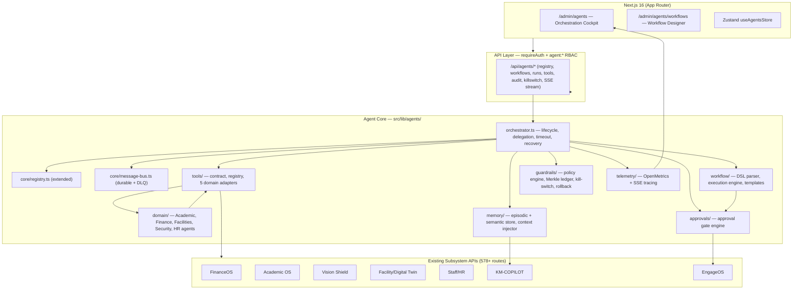
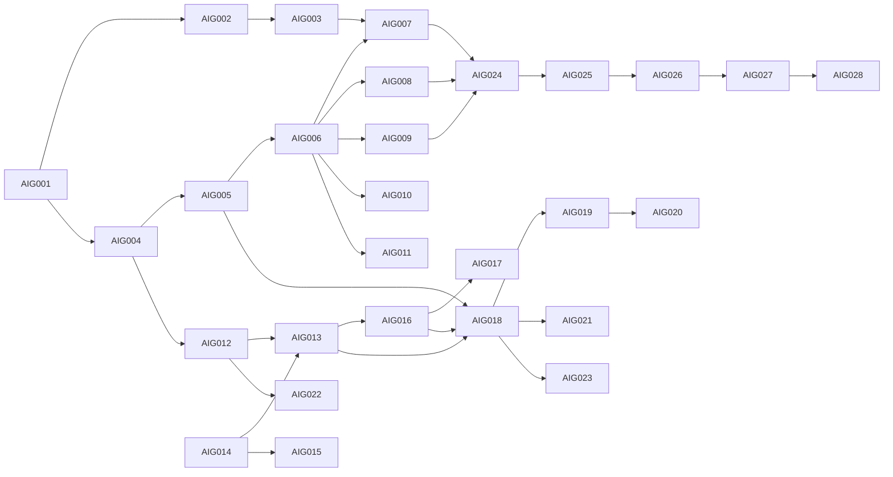

# Sprint-100 Implementation Plan: AIGENT-OS / AgenticWorkflows

**Sprint:** Sprint-100 — Autonomous Multi-Agent Workflow Orchestration & Institutional Intelligence Layer
**Plan Version:** 1.2 (Revised after cross-AI plan review — Qwen, Claude Code, **OpenCode**; see §12)
**Plan Date:** 2026-10-01
**Base Recommendation:** `.ai/Sprint-100-Recommendation.md`
**Baseline:** Release v3.32.0 (100% modernization waves complete, 578/578 gateway routes shielded, 701/701 test suites passing)
**Task ID Prefix:** `AIG-001` … `AIG-028`
**Estimated Size:** Large (28 tasks, 15 phases, 12–16 days)

---

## 1. Context: What Already Exists (Build On, Do Not Duplicate)

Sprint-100 must **extend existing agent infrastructure** rather than create parallel systems.

| Existing Asset | Location | Sprint-100 Usage |
| :--- | :--- | :--- |
| Agent core (registry, message bus, scheduler, state store, consensus) | `src/lib/agents/core/` | Extended with tenancy, capability scopes, durability |
| Swarm/negotiation/healing agents | `src/lib/agents/swarm/`, `negotiation/`, `healing/` | Reused as reference patterns; approval-gateway reused for HITL |
| DB tables: `aiAgents`, `aiAgentCommunications`, `agentRegistry`, `agentLogs`, `agentDecisions` | `packages/db/schema.ts` | Extended, not replaced |
| Trigger-based autonomous workflows (Sprint-010) | `autonomousWorkflows`, `remediationRules`, `remediationTickets` | Coexist; agentic engine references them as triggers |
| Auth/RBAC | `packages/auth/roles.ts`, `src/lib/api/auth-guard.ts` | New `agent:*` permission family added to all tiers |
| Store pattern | `src/lib/db/vision-store.ts` (singleton + memory Map + Drizzle) | Replicated as `src/lib/db/agent-store.ts` |
| Simulation convention | `scripts/*-simulate.ts` → `pnpm <name>:simulate` (8 stages) | New `pnpm agent:simulate` |
| Verification scanners | `security:rbac`, `gateway:scan`, `security:tenants`, `identity:scan` | Must stay 100% after new routes |

---

## 2. Architecture Overview



### Layer Responsibilities

1. **Agent Core** — orchestration, registry, durable message bus (extends `src/lib/agents/core/`).
2. **Tool Integration Layer** — Zod-typed tool contracts; adapters wrap existing subsystem API handlers as callable tools with RBAC scoping and audit hooks.
3. **Domain Agents** — 5 specialized reasoning agents; each declares a capability set, permission scope, and tool allowlist.
4. **Workflow Engine** — versioned DSL (JSON, Zod-validated), state-machine execution with retries, compensation transactions, and persisted runs.
5. **HITL** — approval gates for high-impact steps; escalations routed via EngageOS; kill-switch halts all execution.
6. **Guardrails** — policy constraints, confidence thresholds, Merkle-chained audit ledger, deterministic rollback.
7. **Observability** — Prometheus OpenMetrics + distributed trace IDs propagated through every tool call.

---

## 3. Key Design Decisions

| # | Decision | Rationale |
| :--- | :--- | :--- |
| D1 | **Iterative agent rollout**: build framework (Phases 1–2) domain-agnostic, ship **Academic + Finance + Security first** (AIG-007/008/009), then Facilities + HR (AIG-010/011) | Answers Antigravity review question; reduces blast radius, validates tool contract early with highest-value domains |
| D2 | **Workflow DSL = JSON (canonical) with YAML import** parsed via Zod from `src/lib/validation/schemas.ts` | Avoids adding YAML runtime dependency for storage; designers edit JSON; YAML accepted at import for authoring convenience |
| D3 | **No external broker in v1** — durable DB-backed queue layered over in-process `AgentMessageBus` | Platform runs Next.js single-node; Redis/Kafka can be layered later behind the same interface. Keeps `sub-100ms` latency and zero new infra |
| D4 | **LLM provider behind `ReasoningPort` interface** (OpenAI / Claude / local Ollama via env) | Vendor-neutral; tests run with deterministic stub; no hard dependency |
| D5 | **Tool = function contract over existing API handler logic**, not HTTP loopback | Avoids auth-hop overhead; reuses business logic directly with explicit permission context |
| D6 | **Every agent action writes to Merkle audit ledger** before side effects commit | Non-repudiation; reuses Vision Shield Merkle anchor pattern |
| D7 | **Dual-schema parity mandatory** — every table added to `packages/db/schema.ts` AND `packages/db/schema.pg.ts` | Sprint-050 lesson; enforced by parity test |
| D8 | **All new routes wrapped in `requireAuth(handler, "agent:*")`** from day one | Gateway AST scanner must remain 100% |
| D9 | **Crash-durable orchestration**: run/step state persisted in DB; outbox-backed bus; execution engine performs boot-time recovery scan and resumes `running` runs | Next.js request handlers are ephemeral — long-running workflows must survive cold starts/restarts; prevents stuck `running` runs (Qwen R1) |
| D10 | **Semantic memory v1 = FTS + metadata filtering** (SQLite FTS5 / PG `tsvector`); vector columns added as nullable `embedding` for forward-compat with pgvector/sqlite-vss | Avoids hard extension dependency in v1 while keeping schema migration path open (Qwen R3) |
| D11 | **Merkle batching**: hash-chain entries batched per run-completion + flush interval (not per-invocation SELECT); `prevAuditHash` indexed; verification is a read-optimized endpoint | Eliminates O(N) lookup contention on hot path; load-test gate added (Qwen R2) |
| D12 | **Kill-switch step-up auth**: engage requires fresh session (re-auth/step-up within 5 min), type-to-confirm UI, and writes a mandatory audit entry; release requires same | Prevents single-session catastrophic halt/restore (Qwen R4) |
| D13 | **Feature-flagged rollout**: entire `/api/agents/*` surface + UI gated behind institution-level flags in `src/lib/features.ts`; off by default | Staged rollout, instant kill at platform level, zero-risk for non-enabled tenants (OpenCode R1) |
| D14 | **Server-authoritative approvals**: offline/mobile decision queues replay against gate state; already-decided gates reject with 409, never last-write-wins | Prevents conflicting concurrent approval decisions (OpenCode R7) |

---

## 4. Database Schema Changes

New tables in **both** `packages/db/schema.ts` (SQLite) and `packages/db/schema.pg.ts` (PostgreSQL), with parity test `agentic-schema-parity.test.ts`.

### 4.1 `agentic_workflows`
| Column | Type | Notes |
| :--- | :--- | :--- |
| id | text PK | `wf_<uuid>` |
| institutionId | text FK → institutions | tenant isolation |
| name, description | text | |
| definitionJson | text | Zod-validated DSL (see §4.8) |
| version | integer | optimistic concurrency |
| status | text | `draft｜active｜paused｜archived` |
| createdBy | text FK → staff | |
| createdAt/updatedAt | text | ISO (project convention) |

### 4.2 `agentic_workflow_runs`
| Column | Type | Notes |
| :--- | :--- | :--- |
| id | text PK | `run_<uuid>` |
| workflowId | text FK → agentic_workflows | cascade delete |
| institutionId | text FK | |
| status | text | `pending｜running｜awaiting_approval｜completed｜failed｜cancelled｜rolled_back` |
| triggerType | text | `manual｜schedule｜anomaly｜event` |
| triggeredBy | text | staffId or `system` |
| contextJson, error | text | |
| traceId | text | OpenTelemetry correlation |
| startedAt/finishedAt | text | |

### 4.3 `agentic_workflow_steps`
| Column | Type | Notes |
| :--- | :--- | :--- |
| id | text PK | |
| runId | text FK → agentic_workflow_runs | cascade |
| stepKey | text | DSL node id |
| agentId, toolName | text | who executed what |
| status | text | `pending｜running｜awaiting_approval｜completed｜failed｜skipped｜compensated` |
| inputJson, outputJson, compensationJson | text | |
| attempt | integer | retry count |
| startedAt/finishedAt | text | |
| Index | | `(runId, stepKey)` unique |

### 4.4 `agent_approval_gates`
| Column | Type | Notes |
| :--- | :--- | :--- |
| id | text PK | |
| runId, stepId | text FK | |
| institutionId | text FK | |
| requiredPermission | text | e.g. `agent:workflows:approve` |
| severity | text | `critical｜high｜medium｜low` |
| status | text | `pending｜approved｜rejected｜expired` |
| approverId, decisionReason | text | |
| expiresAt, createdAt/decidedAt | text | SLA-based auto-escalation |

### 4.5 `agent_memory_entries`
| Column | Type | Notes |
| :--- | :--- | :--- |
| id | text PK | |
| agentId, institutionId | text | |
| scope | text | `episodic｜semantic｜procedural` |
| contentJson | text | |
| importance | real | retention pruning score |
| sourceRef | text | link to run/step/entity |
| createdAt/lastAccessedAt/expiresAt | text | retention policy enforcement |

### 4.6 `agent_tool_invocations`
| Column | Type | Notes |
| :--- | :--- | :--- |
| id | text PK | |
| agentId, toolName, institutionId | text | |
| status | text | `success｜error｜denied` |
| durationMs | integer | |
| inputHash, outputHash, error | text | payload-safe audit |
| auditHash, prevAuditHash | text | Merkle chain link |
| traceId | text | |
| createdAt | text | |
| Index | | `(prevAuditHash)` for chain traversal; `(institutionId, createdAt)` for tenant-scoped reads |

### 4.7 `agent_outbox_messages` (7th table — D3 durable outbox)
| Column | Type | Notes |
| :--- | :--- | :--- |
| id | text PK | |
| institutionId | text | tenant isolation |
| topic, payloadJson, headersJson | text | message envelope |
| priority | integer | 4-level priority queue (0–3) |
| status | text | `pending｜delivered｜failed｜dlq` |
| attempts, maxAttempts | integer | retry budget → DLQ |
| deliveredAt, createdAt | text | |

### 4.8 DSL Shape (Zod schema in `src/lib/agents/workflow/dsl/schema.ts`)

```json
{
  "key": "semester-closing",
  "name": "Semester Closing Orchestration",
  "dslVersion": 1,
  "version": 1,
  "triggers": [{ "type": "schedule", "cron": "0 0 1 1,7 *" }],
  "defaults": { "maxRetries": 2, "timeoutMs": 300000, "onFailure": "compensate" },
  "steps": [
    {
      "key": "reconcile-fees",
      "agent": "finance",
      "tool": "finance.fees.reconcile",
      "input": { "termId": "{{trigger.termId}}" },
      "approval": { "required": true, "permission": "agent:workflows:approve", "severity": "high" },
      "onFailure": { "action": "compensate", "goto": "notify-principal" }
    },
    { "key": "parallel-audit", "type": "parallel", "steps": ["[…]"] },
    { "key": "branch", "type": "branch", "condition": "{{steps.x.output.score}} > 0.8", "then": "…", "else": "…" }
  ]
}
```

Supported node types: `action`, `parallel`, `branch`, `approval`, `wait`, `subworkflow`, `compensate`.

**Versioning:** parser routes on `dslVersion`; older versions execute via legacy adapters under a documented deprecation policy; validator flags deprecated node types.

---

## 5. RBAC Permission Changes (`packages/auth/roles.ts`)

New permission family (both `:` forms where applicable):

```
agent:orchestrate          — create/execute workflow runs
agent:workflows:view       — read workflow definitions & runs
agent:workflows:create     — author workflow definitions
agent:workflows:approve    — HITL approval gate decisions
agent:workflows:execute    — trigger runs manually
agent:agents:view          — view registry & agent health
agent:memory:manage        — prune/inspect agent memory
agent:tools:manage         — enable/disable tools per institution
agent:telemetry:view       — metrics & traces
agent:audit:view           — Merkle audit ledger verification
agent:killswitch:engage    — halt all agent execution (critical)
```

### Tier Mapping

| Role | agent:* grants |
| :--- | :--- |
| `super_admin` | `*` (already) |
| `admin` | all except implied wildcard — full list including `agent:killswitch:engage` |
| `regional_admin` | full list including kill-switch |
| `regional_auditor` | `view` + `agent:audit:view` + `agent:telemetry:view` only |
| `principal` | view/create/approve/execute + telemetry + audit view (no kill-switch, no tools:manage) |
| `hod` | view + approve (own institution) + agents:view |
| `staff`, `teacher` | `agent:workflows:view`, `agent:agents:view` (read-only) |
| `accounts` | + `agent:workflows:approve` (finance-domain gates) |
| `purchase` | `agent:workflows:view` |

**Enforcement:** update `packages/auth/__tests__/rbac-5tier-matrix.test.ts` with positive + negative assertions; `pnpm security:rbac` must report 0 unmapped keys.

---

## 6. File Structure

```
src/lib/agents/
├── core/                          # EXISTING — extended
│   ├── types.ts                   # + AgentCapability, ToolPermissionScope, tenancy fields
│   ├── registry.ts                # + capability/permission-scope registration, institution filter
│   ├── message-bus.ts             # + durable outbox, DLQ, dead-letter replay
│   ├── scheduler.ts               # (unchanged)
│   ├── state-store.ts             # + run-state hydration
│   └── consensus.ts               # (unchanged)
├── orchestrator/
│   ├── orchestrator.ts            # lifecycle, delegation, timeout, error recovery
│   └── reasoning-port.ts          # LLM provider interface (OpenAI/Claude/Ollama/stub)
├── tools/
│   ├── contract.ts                # AgentTool interface + Zod IO schemas
│   ├── tool-registry.ts           # registration, allowlists, rate limits
│   ├── executor.ts                # sandboxed invocation + RBAC + audit + trace
│   └── adapters/
│       ├── academic-tools.ts      # students, attendance, exams, timetables, curriculum
│       ├── finance-tools.ts       # fees, reconciliation, approvals, accounts, supply
│       ├── security-tools.ts      # vision alerts, incidents, lockdown, SOAR playbooks
│       ├── facilities-tools.ts    # workorders, telemetry, energy, inventory, dispatch
│       └── hr-tools.ts            # staff, leaves, performance, onboarding
├── domain/
│   ├── base-agent.ts              # abstract: plan → act → observe → reflect loop
│   ├── academic-agent.ts
│   ├── finance-agent.ts
│   ├── facilities-agent.ts
│   ├── security-agent.ts
│   └── hr-agent.ts
├── workflow/
│   ├── dsl/
│   │   ├── schema.ts              # Zod DSL schema (JSON canonical, YAML import)
│   │   ├── parser.ts              # parse/validate/normalize + template interpolation
│   │   └── validator.ts           # AST checks: cycles, unreachable, missing permissions
│   ├── engine/
│   │   ├── execution-engine.ts    # state machine, retries, compensation, persistence
│   │   ├── step-runner.ts         # single-step dispatch to tool executor
│   │   └── compensation.ts        # rollback registry per tool
│   └── templates/                 # 10 pre-built workflows (JSON)
├── memory/
│   ├── memory-store.ts            # agent_memory_entries CRUD + retention pruning
│   └── context-injector.ts        # pulls KM-COPILOT / subsystem context into prompts
├── approvals/
│   ├── approval-engine.ts         # gate creation, decision, expiry, escalation
│   └── escalation-notifier.ts     # EngageOS integration for nudges
├── guardrails/
│   ├── policy-engine.ts           # constraint validation before side effects
│   ├── merkle-ledger.ts           # hash chain over agent_tool_invocations
│   ├── kill-switch.ts             # global halt flag + drain semantics
│   └── rollback-coordinator.ts    # compensation orchestration across steps
├── telemetry/
│   ├── agent-metrics.ts           # Prometheus OpenMetrics counters/histograms
│   └── trace-context.ts           # traceId propagation helper
└── __tests__/                     # colocated suites per module

src/lib/db/agent-store.ts          # singleton store (vision-store pattern)

src/app/api/agents/
├── route.ts                       # GET registry (agent:agents:view)
├── [agentId]/route.ts             # GET/DELETE single agent
├── workflows/route.ts             # GET list, POST create (agent:workflows:create)
├── workflows/[id]/route.ts        # GET/PUT/PATCH/DELETE
├── workflows/[id]/execute/route.ts# POST trigger run (agent:workflows:execute)
├── workflows/[id]/runs/route.ts   # GET run history
├── runs/[runId]/route.ts          # GET run detail + step timeline
├── runs/[runId]/steps/[stepId]/approve/route.ts  # POST decision (agent:workflows:approve)
├── tools/route.ts                 # GET/PUT tool allowlist (agent:tools:manage)
├── audit/route.ts                 # GET Merkle ledger + verify (agent:audit:view)
├── killswitch/route.ts            # POST engage/release (agent:killswitch:engage)
└── stream/route.ts                # SSE live run events (agent:telemetry:view)

src/app/(shell)/admin/agents/
├── page.tsx                       # Orchestration Cockpit (registry, health, kill-switch)
├── workflows/page.tsx             # workflow list + status
├── workflows/designer/page.tsx    # visual workflow designer
├── workflows/[id]/page.tsx        # definition detail + version history
├── runs/[runId]/page.tsx          # execution trace viewer (step timeline)
└── audit/page.tsx                 # audit ledger verification view

src/stores/agents-store.ts         # Zustand: registry, runs, live SSE state
mobile/lib/features/agent_hub/     # Riverpod: notifications, approval queue screens
scripts/agent-simulate.ts          # pnpm agent:simulate (8 stages)
docs/operations/
├── aigent-os-agent-operations-runbook.md
├── workflow-design-governance-runbook.md
└── agent-incident-killswitch-runbook.md
```

---

## 7. Phased Task Breakdown (28 Tasks)

### Phase 1 — Multi-Agent Architecture Foundation
| Task | Deliverable | Files | Verification |
| :--- | :--- | :--- | :--- |
| **AIG-001** | Extended agent core: tenancy, capability sets, permission scopes on registry/types; `ReasoningPort` LLM abstraction | `core/types.ts`, `core/registry.ts`, `orchestrator/reasoning-port.ts` | `agents-core.test.ts` — register/discover/filter by capability+institution |
| **AIG-002** | Durable message bus: DB-backed outbox, DLQ, priority delivery, replay | `core/message-bus.ts`, `db/agent-store.ts` | `agent-message-bus.test.ts` — priority, DLQ, crash-recovery replay |
| **AIG-003** | Orchestration engine: agent lifecycle, task delegation, timeout, retry, error recovery, boot-time run recovery scan (resume/requeue `running` runs), `ReasoningPort` with circuit breaker + exponential-backoff retry budget + fallback chain (Ollama → cached plan → HITL escalation) **+ per-run and per-institution daily token-budget caps (budget exhaustion → pause + HITL, never unbounded spend)** | `orchestrator/orchestrator.ts`, `orchestrator/reasoning-port.ts` | `orchestrator.test.ts` — delegation, timeout recovery, no deadlock; **crash-recovery resume test**; **LLM-outage chaos test falls back to HITL**; **budget-cap enforcement test** |

### Phase 2 — Tool Integration Layer
| Task | Deliverable | Files | Verification |
| :--- | :--- | :--- | :--- |
| **AIG-004** | Tool contract: `AgentTool` interface, Zod IO schemas, metadata (domain, permission, risk level), **required `compensate` handler for every write tool (saga registry)**, **idempotency-key support for all mutating tools** | `tools/contract.ts` | `tool-contract.test.ts` — schema validation, invalid IO rejected, every write tool has compensator declared |
| **AIG-005** | Tool registry + executor: allowlists, RBAC enforcement, **explicit `TenantContext` injected at executor entry with runtime assertion (`tenantId` match before dispatch)**, rate limits, audit write, trace propagation | `tools/tool-registry.ts`, `tools/executor.ts` | `tool-executor.test.ts` — permission denial, rate limit, audit row, **cross-tenant invocation negative test** |
| **AIG-006** | 5 domain tool adapters wrapping existing subsystem logic (≥10 tools per domain = 50+ tools) | `tools/adapters/*.ts` | `domain-tools.test.ts` — each tool executes against in-memory store, tenant isolation |

### Phase 3 — Specialized Agent Implementations (staged: D1)
| Task | Deliverable | Files | Verification |
| :--- | :--- | :--- | :--- |
| **AIG-007** | **AcademicAgent** — attendance anomaly remediation, grade posting orchestration, timetable conflict resolution | `domain/base-agent.ts`, `domain/academic-agent.ts` | `academic-agent.test.ts` — 3 scenario plans execute with correct tool sequences |
| **AIG-008** | **FinanceAgent** — fee reconciliation, approval triage, 3-way match audits | `domain/finance-agent.ts` | `finance-agent.test.ts` — reconciliation plan + approval gating |
| **AIG-009** | **SecurityAgent** — Vision Shield alert triage, SOAR playbook invocation, lockdown escalation (always HITL) | `domain/security-agent.ts` | `security-agent.test.ts` — alert → plan → mandatory approval gate |
| **AIG-010** | **FacilitiesAgent** — workorder dispatch, energy optimization, predictive maintenance | `domain/facilities-agent.ts` | `facilities-agent.test.ts` — telemetry → dispatch plan |
| **AIG-011** | **HRAgent** — leave balancing, staff allocation, credential verification | `domain/hr-agent.ts` | `hr-agent.test.ts` — leave plan + escalation path |

### Phase 4 — Autonomous Workflow Engine
| Task | Deliverable | Files | Verification |
| :--- | :--- | :--- | :--- |
| **AIG-012** | DSL Zod schema **with `dslVersion` field + version-routing parser + deprecation policy**, parser (JSON canonical + YAML import), template interpolation, AST validator (cycles/unreachable/permission/deprecated-node checks) | `workflow/dsl/*` | `workflow-dsl.test.ts` — valid/invalid fixtures, cycle detection, **v1→v2 regression: v1 definitions still execute** |
| **AIG-013** | Execution engine: state machine, parallel/branch/approval nodes, retries, compensation, run persistence, **per-workflow concurrency policy (skip/queue/allow) to prevent conflicting simultaneous runs** | `workflow/engine/*` | `workflow-engine.test.ts` — happy path, retry, compensate, branch, **concurrency-policy tests** |
| **AIG-014** | Schema migration: 7 new tables in SQLite + PG with parity test **including explicit type-mapping assertions (`real`→`double precision`, boolean modes, ISO text timestamps) and cross-DB round-trip test**; `agent-store.ts` CRUD layer | `packages/db/schema.ts`, `schema.pg.ts`, `src/lib/db/agent-store.ts` | `agentic-schema-parity.test.ts` (structural + type mapping) + `agent-store.test.ts` (CRUD + tenant isolation + round-trip) |

### Phase 5 — Agent Memory & Context
| Task | Deliverable | Files | Verification |
| :--- | :--- | :--- | :--- |
| **AIG-015** | Memory store (episodic/semantic/procedural, importance decay, retention pruning) + **FTS5/`tsvector` full-text retrieval with metadata filtering; nullable `embedding` column reserved for pgvector/sqlite-vss forward-compat** + context injector bridging KM-COPILOT & subsystem facts | `memory/*` | `agent-memory.test.ts` — write/recall/prune, **FTS search relevance**, tenant isolation, injector builds context packet |

### Phase 6 — Human-in-the-Loop & Safety
| Task | Deliverable | Files | Verification |
| :--- | :--- | :--- | :--- |
| **AIG-016** | Approval gate engine: creation from DSL `approval` nodes, decision handling, **SLA auto-expiry with explicit configured policy on expiry (escalate → hold run → reject; never silent resume)**, EngageOS escalation, **run-failure notification to workflow owner (not just approvals)** | `approvals/*` | `approval-engine.test.ts` — approve/reject/**expire-with-escalation**/hold paths, **failure-notification dispatch** |
| **AIG-017** | Guardrails: policy engine pre-flight checks, **batched Merkle audit ledger (per-run completion + interval flush, `prevAuditHash` indexed, chain written & verified before critical side-effect commit)**, **kill-switch with step-up auth + type-to-confirm + mandatory audit entry**, rollback coordinator | `guardrails/*` | `guardrails.test.ts` — policy block, chain verification (**tamper detection**), **kill-switch requires fresh session**, rollback restores prior state |

### Phase 7 — REST API & Route Protection
| Task | Deliverable | Files | Verification |
| :--- | :--- | :--- | :--- |
| **AIG-018** | 13 API routes (`/api/agents/*`) with `requireAuth` + `agent:*` permissions, Zod body validation, **SSE stream with tenantId bound at connect, session re-verification on expiry (close on invalid), per-tenant connection caps + rate limiting**, **feature-flag check (D13) on every route, `Idempotency-Key` support on POST `/execute`, monotonic event sequence numbers for SSE resume** | `src/app/api/agents/**` | `agent-routes.test.ts` (401/403/404/2xx matrix) + **SSE cross-tenant leak test + auth-expiry disconnect test + duplicate-execute idempotency test + flag-off 404 test** + `pnpm gateway:scan` 100% + `pnpm security:rbac` 0 leaks |

### Phase 8 — Workflow Designer UI
| Task | Deliverable | Files | Verification |
| :--- | :--- | :--- | :--- |
| **AIG-019** | Visual workflow designer: node palette (action/parallel/branch/approval/wait), canvas, JSON preview, validation feedback, save via API | `(shell)/admin/agents/workflows/designer/` | UI renders with `src/components/ui/*` primitives; jest component test — create & validate a 3-node workflow |

### Phase 9 — Agent Orchestration UI
| Task | Deliverable | Files | Verification |
| :--- | :--- | :--- | :--- |
| **AIG-020** | Cockpit: agent registry health cards, live run monitor (SSE with backoff reconnect + gap detection from last-seq), step timeline trace viewer, audit page, kill-switch control; Zustand store; **permission-gated sidebar nav entry for `/admin/agents`** | `(shell)/admin/agents/**`, `src/stores/agents-store.ts`, nav config | Component tests — registry render, run trace, kill-switch dialog, **nav hidden without `agent:agents:view`**; `Skeleton` loading, `Badge` statuses, `Dialog` modals per conventions |

### Phase 10 — Observability & Telemetry
| Task | Deliverable | Files | Verification |
| :--- | :--- | :--- | :--- |
| **AIG-021** | OpenMetrics exporter (10+ series: runs, step latency, tool calls, approvals pending, gate denials, **LLM token/cost per run + daily budget consumption**), traceId propagation, SSE telemetry feed | `telemetry/*`, exposed via existing metrics endpoint | `agent-telemetry.test.ts` — series emitted, format valid OpenMetrics, **cost series present** |

### Phase 11 — Pre-Built Workflow Library
| Task | Deliverable | Files | Verification |
| :--- | :--- | :--- | :--- |
| **AIG-022** | 10 institutional workflows: semester closing, annual audit, fee-defaulter recovery, compliance report, at-risk student intervention, equipment predictive maintenance, security incident response, staff onboarding, energy load-shedding, disaster recovery drill | `workflow/templates/*.json`, **seed integration via `src/db/seed.ts` (`pnpm db:seed`) so templates + 5 default agents exist on fresh installs** | `workflow-library.test.ts` — all 10 parse + AST-validate + dry-run execute; **seed idempotent on re-run** |

### Phase 12 — Mobile Agent Interface (Flutter)
| Task | Deliverable | Files | Verification |
| :--- | :--- | :--- | :--- |
| **AIG-023** | Riverpod `agentHubProvider`, offline approval vault, approval queue screens, run notification push, GoRouter routes under `_authGuard`, **server-authoritative decision replay (D14): queued offline decisions rejected with 409 if gate already decided** | `mobile/lib/features/agent_hub/**` | Flutter analyze clean; screens registered in `lib/app/router.dart`; **stale-decision conflict test** |

### Phase 13 — Integration Testing Suite
| Task | Deliverable | Files | Verification |
| :--- | :--- | :--- | :--- |
| **AIG-024** | End-to-end integration: agent → tool → subsystem, workflow run → approval → completion, cross-agent collaboration, failure/recovery, tenant isolation | `src/lib/agents/__tests__/integration/**` | Full integration suite green; ≥40 new test cases |

### Phase 14 — Operational Runbooks & Documentation
| Task | Deliverable | Files | Verification |
| :--- | :--- | :--- | :--- |
| **AIG-025** | 3 runbooks: agent operations & health, workflow design governance, kill-switch/incident response | `docs/operations/*.md` | Docs reviewed against code; commands verified executable |

### Phase 15 — Security, RBAC & Simulation Verification
| Task | Deliverable | Files | Verification |
| :--- | :--- | :--- | :--- |
| **AIG-026** | RBAC matrix expansion: `agent:*` across all tiers + tests; dot/colon alias consistency | `packages/auth/roles.ts`, `rbac-5tier-matrix.test.ts` | `pnpm security:rbac` → 276+11 keys mapped, 0 unmapped; jest auth suites green |
| **AIG-027** | Security governance suite: tenant isolation on all agent tables, approval bypass prevention, kill-switch authority + step-up tests, Merkle tamper detection (**chain verified before critical side-effect commit and again post-run**), Merkle load gate (10k invocations/min) | `agent-security-governance.test.ts` | All assertions pass; `pnpm security:tenants` 100% |
| **AIG-028** | 8-stage simulation CLI `pnpm agent:simulate`: (1) registry boot (2) tool dispatch (3) workflow DSL parse (4) full run with branch/parallel (5) approval gate hold/resume (6) failure + compensation rollback (7) kill-switch halt (8) audit chain verify | `scripts/agent-simulate.ts`, `package.json` | **8/8 stages passing** |

---

## 8. Dependency Map



**Critical path:** AIG-001 → AIG-004 → AIG-005 → AIG-006 → AIG-007 → AIG-013 → AIG-018 → AIG-020 → AIG-028

**Parallelizable waves:**
- Wave 1: AIG-001/002/003 ∥ AIG-014 (schema work can start immediately)
- Wave 2: AIG-004/005 ∥ AIG-012 (DSL parser independent of executor)
- Wave 3: AIG-007 ∥ AIG-008 ∥ AIG-009 ∥ AIG-010 ∥ AIG-011
- Wave 4: AIG-019/020/021 ∥ AIG-022 ∥ AIG-023

---

## 9. Verification Gates (Must All Pass Before Sprint Close)

| Gate | Command | Required Result |
| :--- | :--- | :--- |
| TypeScript | `pnpm typecheck` | 0 errors |
| Lint | `pnpm lint` | 0 errors |
| Test Suite | `pnpm test` | 100% pass (≥701 suites baseline + new agent suites) |
| Gateway Shielding | `pnpm gateway:scan` | 100% (all new `/api/agents/*` routes covered) |
| RBAC Mapping | `pnpm security:rbac` | 0 unmapped permission keys |
| Tenant Isolation | `pnpm security:tenants` | 100% (0 leaks) |
| Identity/DPoP | `pnpm identity:scan` | 100% |
| Accessibility | `pnpm test:a11y` | 25/25 passing (new UI must not regress) |
| Schema Parity | `pnpm db:generate` + parity test | SQLite ↔ PG tables match |
| Simulation | `pnpm agent:simulate` | **8/8 stages passing** |
| Audit Chain | `pnpm compliance:verify` | Chain intact incl. new agent entries |
| DR Coverage | compliance snapshot / `pnpm dr:drill` check | 7 new agent tables included in backup + restore verification |
| Feature Flag | flag-off integration test | All `/api/agents/*` return 404 when institution flag disabled |

### Success Criteria (from Recommendation) — Mapping to Tasks

| Criterion | Covered By |
| :--- | :--- |
| Agent registry + communication bus | AIG-001, AIG-002, AIG-003 |
| 5 specialized agents | AIG-007 … AIG-011 |
| Workflow engine + DSL + designer | AIG-012, AIG-013, AIG-019 |
| 10+ pre-built workflows | AIG-022 |
| Memory + context injection | AIG-015 |
| HITL approval gates | AIG-016 |
| Orchestration UI + tracing | AIG-020, AIG-021 |
| Kill-switch + rollback | AIG-017 |
| Merkle audit logging | AIG-017, AIG-027 |
| Mobile interface | AIG-023 |
| `pnpm agent:simulate` 8 stages | AIG-028 |
| 100% TS / tests / route protection | §9 gates |

---

## 10. Risks & Mitigations

| Risk | Level | Mitigation | Owner Task |
| :--- | :--- | :--- | :--- |
| Agent coordination deadlock/circular delegation | High | Orchestrator enforces single-writer run state, delegation depth cap (5), 30s step timeout, priority queue | AIG-003 |
| Autonomous high-impact actions without oversight | High | Severity-based approval gates mandatory for `critical/high`; kill-switch; Merkle audit before commit | AIG-016, AIG-017 |
| Incorrect reasoning → wrong actions | High | Confidence threshold (default 0.8) below which flow routes to HITL; deterministic stub in tests; tool allowlists restrict blast radius | `reasoning-port.ts`, AIG-005 |
| LLM provider cost/latency at scale | High | `ReasoningPort` plan caching + batch planning; **per-run/daily token-budget caps → HITL pause (D13 era guardrail)**; cost series in telemetry; local Ollama option | AIG-003, AIG-021 |
| Conflicting approval decisions (offline/mobile vs web) | Medium | Server-authoritative gate state; queued offline decisions rejected with 409 if already decided (D14) | AIG-023, AIG-016 |
| Feature flag misconfiguration exposing unfinished surface | Medium | Flags off by default; flag-off test gate; route-level check in `requireAuth` chain | AIG-018 (D13) |
| Schema drift SQLite ↔ PG | Medium | Parity test added in same task as tables | AIG-014 |
| New routes failing gateway/RBAC scanners | Medium | Routes wrapped in `requireAuth` at creation; scanners run per-wave not just at end | AIG-018, AIG-026 |
| Non-technical users can't author workflows | Medium | Designer UI with palette + validation feedback + template library | AIG-019, AIG-022 |
| Message bus memory growth | Low | Outbox persistence with retention window; DLQ size cap | AIG-002 |
| Agent memory bloat | Low | Importance decay + `expiresAt` pruning job in scheduler | AIG-015 |
| LLM provider outage/latency stalls critical runs | High | Circuit breaker + retry budget + fallback chain (Ollama → cached plan → HITL escalation); chaos test in simulation stage 6 | AIG-003 |
| Cold start / process restart leaves runs stuck in `running` | High | Boot-time recovery scan requeues or fails-with-compensation orphaned runs; outbox replays undelivered messages | AIG-003 (D9) |
| SSE stream cross-tenant leak or use-after-session-expiry | High | Tenant bound at connect, session re-verified, connection caps, dedicated leak test | AIG-018 |
| Merkle per-invocation write contention under load | Medium | Batched hashing + indexed `prevAuditHash` + load-test gate (10k invocations/min) | AIG-017 (D11) |
| Kill-switch abuse or accidental global halt | Medium | Step-up auth + type-to-confirm + audit entry + dual-role grants (super_admin/regional_admin only for engage) | AIG-017 (D12) |
| DSL evolution breaks saved workflow definitions | Medium | `dslVersion` routing + deprecation policy + v1→v2 regression test | AIG-012 |

---

## 11. Out of Scope (Deferred)

- External message brokers (Kafka/RabbitMQ) — interface-compatible later (D3)
- Multi-institution agent federation — single-institution tenancy first
- Self-improving/continuously-trained agents — versioned definitions only
- Agent marketplace/install UX — reuse existing marketplace patterns in a later sprint
- Real production LLM fine-tuning — prompt-template iteration only

---

## 12. Plan Review Log (Cross-AI Review per `plan-review-rule`)

Review executed 2026-10-01 against Plan v1.0. Feedback incorporated into v1.1 (Qwen + Claude Code), then OpenCode review incorporated into v1.2.

| Reviewer | Status | Key Feedback Incorporated |
| :--- | :--- | :--- |
| **Qwen** (qwen3.6 via Ollama) | ✅ 10/10 points reviewed | R1 ephemeral-runtime durability → **D9 + AIG-003 recovery**; R2 Merkle contention → **D11 batching + load gate**; R3 vector memory gap → **D10 FTS-first + forward-compat columns**; R4 kill-switch step-up → **D12**; R5 executor tenant leakage → **AIG-005 TenantContext + negative test**; R6 saga vagueness → **AIG-004 compensate/idempotency**; R7 DSL versioning → **AIG-012 `dslVersion`**; R8 SSE isolation → **AIG-018 tenant binding + disconnect tests**; R9 type drift → **AIG-014 type-mapping assertions**; R10 LLM circuit breaking → **AIG-003 fallback chain + chaos test** |
| **Claude Code** (claude -p) | ✅ Reviewed (condensed input) | SLA auto-expiry must have explicit policy → **AIG-016 escalate/hold/reject, never silent resume**; Merkle verify before commit → **AIG-017 + AIG-027 ordering**; dead-branch cleanup → enforced via `pnpm lint` + typecheck gates |
| **OpenCode** (this session, `opencode/mimo-v2.6-flash-free`) | ✅ 10/10 findings incorporated → v1.2 | R1 feature flag → **D13 + flag gate**; R2 LLM cost budgets → **AIG-003 caps + AIG-021 cost series**; R3 DB seed → **AIG-022 seed integration**; R4 run concurrency → **AIG-013 policy**; R5 API idempotency → **AIG-018 Idempotency-Key**; R6 SSE sequencing/reconnect → **AIG-018 seq numbers + AIG-020 gap detection**; R7 offline approval conflicts → **D14 + AIG-023 409 replay**; R8 sidebar nav → **AIG-020 nav entry**; R9 run-failure notification → **AIG-016 owner notify**; R10 DR coverage → **§9 DR gate** |

**Review Status:** ✅ COMPLETE — all 3 required reviewers done (Qwen, Claude Code, OpenCode)

---

## 13. Approval & Certification

| Field | Value |
| :--- | :--- |
| Plan Status | ✅ **CERTIFIED & COMPLETED** |
| Reviews Completed | Qwen ✅ (10 pts) · Claude Code ✅ · OpenCode ✅ (10 pts) — all incorporated → v1.2 |
| Verification | Antigravity ✅ (All 28 tasks, 14 decisions) · OpenCode ✅ (Independent gate re-runs) |
| Release Tags | `v3.33.0` (commit `20fc8b9`) · `v3.33.1` (commit `36a3fef`) |
| Quality Gates | 744/744 test suites (2,519/2,519 tests), `tsc` (0 errors), `gateway:scan` (592/592), `security:tenants` (100%), `security:rbac` (100%), `agent:simulate` (8/8) |

