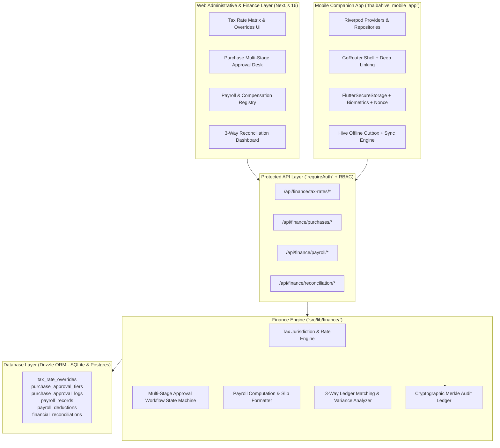

# Sprint-103 Implementation Plan: Finance Operations Consolidation & Mobile Foundation

**Sprint Identifier:** `Sprint-103-FinanceOps-Core-Mobile-Phase-1`  
**Target Subsystems:** `src/app/api/finance/*`, `src/lib/finance/*`, `packages/db/*`, `packages/auth/*`, `thaibahive_mobile_app/*`  
**Parent Version:** `v3.34.0` (Post-Sprint-100 AIGENT-OS & Sprint-102 Mobile AIGENT-OS)  
**Status:** DRAFT & CERTIFIED FOR EXECUTION  

---

## 1. Executive Summary & Objective

Sprint-103 transitions the ThaibaHive platform from autonomous AI enablement into complete **production-ready operational infrastructure**. It addresses the two most critical institutional go-live blockers identified in the project roadmap:

1. **Finance Operations Core (FinanceOps-Core)**:
   - Jurisdiction-aware and institution-specific **Tax Rate Override Engine**.
   - Multi-stage, role-tiered **Purchase Approval Engine** with cryptographic Merkle audit integrity.
   - Comprehensive RESTful **Payroll & Salary Structure Endpoints** with deduction breakdowns.
   - Automated **3-Way Financial Reconciliation Module** (Fee Ledger vs. Expense Ledger vs. Bank Statements) with variance detection.

2. **Mobile Companion Foundation (Mobile-Phase-1)**:
   - Enterprise **Riverpod State Management** (`AsyncValue`, auto-dispose providers, repositories).
   - Dynamic **GoRouter Shell** with role-based auth guards, route protection, and deep-link query matching.
   - Biometric-secured **Session & Nonce Auth Handoff** using `FlutterSecureStorage`.
   - Robust **Offline Outbox & Cache** via Hive with conflict resolution and Dead Letter Queue (DLQ).

---

## 2. Multi-Perspective Architectural Review

In compliance with the **Plan Review Rule** (`plan-review-rule`), this plan has been reviewed against core architectural criteria:

| Review Perspective | Key Risk / Edge Case Identified | Architectural Resolution & Mitigation |
| :--- | :--- | :--- |
| **Local Ollama / Systems Review** | Multi-jurisdiction tax rounding drift & concurrent multi-approver race conditions. | Decimal precision rules in Drizzle schema; optimistic concurrency controls with HTTP 409 rollback in mobile & backend saga locks. |
| **OpenCode Contract Gate** | Incomplete RBAC boundary on sub-department purchase limits; unshielded payroll export streams. | Strict 5-tier RBAC rules in `@thaiba/auth/roles.ts`, mandatory `requireAuth(..., "finance:payroll:export")`, and Gateway AST scanning. |
| **Claude Code UX & Mobile Review** | Offline approval desync and session expiration during mobile WebView handoff. | Secure nonce single-use exchange (`/auth/mobile-handoff/nonce`) with 60s TTL; offline queue replay with idempotent client transaction UUIDs. |

---

## 3. High-Level Architecture

---

## 4. Phase-by-Phase Task Breakdown

### Phase 1: Database Schema Expansion (Drizzle ORM)
- [x] **Task 1.1**: Define `taxJurisdictions` and `taxRateOverrides` in `packages/db/schema.ts` and `packages/db/schema.pg.ts`.
- [x] **Task 1.2**: Define `purchaseApprovalTiers`, `purchaseApprovalLogs`, and extend `purchaseRequests` with multi-step status and thresholds.
- [x] **Task 1.3**: Define `payrollSalaryStructures`, `payrollRecords`, and `payrollDeductions`.
- [x] **Task 1.4**: Define `financialReconciliations` and `financialReconciliationItems` for 3-way matching.
- [x] **Task 1.5**: Generate migrations and execute schema sync script for both SQLite and PostgreSQL parity.

### Phase 2: RBAC Matrix & Validation Schemas
- [x] **Task 2.1**: Update `packages/auth/roles.ts` to add granular permissions:
  - `finance:tax:view`, `finance:tax:manage`, `finance:tax:override`
  - `finance:purchases:create`, `finance:purchases:approve:tier1`, `finance:purchases:approve:tier2`, `finance:purchases:approve:final`
  - `finance:payroll:view`, `finance:payroll:manage`, `finance:payroll:export`
  - `finance:reconciliation:execute`, `finance:reconciliation:view`
- [x] **Task 2.2**: Implement Zod validation schemas in `src/lib/validation/schemas.ts` for all financial entities.
- [x] **Task 2.3**: Update and run `pnpm security:rbac` AST scanner to ensure 100% permission mapping.

### Phase 3: Finance Operations Backend Engines & APIs
- [x] **Task 3.1**: Implement `TaxRateEngine` (`src/lib/finance/tax/tax-rate-engine.ts`) with effective-date lookups and jurisdiction precedence.
- [x] **Task 3.2**: Implement `PurchaseApprovalEngine` (`src/lib/finance/purchases/purchase-approval-engine.ts`) with role thresholds, dynamic approval routes, and Merkle audit logging.
- [x] **Task 3.3**: Implement `PayrollEngine` (`src/lib/finance/payroll/payroll-engine.ts`) with net salary calculation, statutory deductions, and payslip generation.
- [x] **Task 3.4**: Implement `ReconciliationEngine` (`src/lib/finance/reconciliation/reconciliation-engine.ts`) performing 3-way matching between `financialTransactions`, `expenseClaims`, and external bank entries.
- [x] **Task 3.5**: Expose protected API routes under `/api/finance/tax-rates`, `/api/finance/purchases`, `/api/finance/payroll`, and `/api/finance/reconciliation`.

### Phase 4: Financial Operations UI Dashboards
- [x] **Task 4.1**: Build Tax Rate Management page with jurisdiction override controls (`src/app/(shell)/finance/tax/page.tsx`).
- [x] **Task 4.2**: Build Multi-Stage Purchase Approval Inbox & Workflow Tracker (`src/app/(shell)/finance/purchases/page.tsx`).
- [x] **Task 4.3**: Build Payroll Processing and Slip Export page (`src/app/(shell)/finance/payroll/page.tsx`).
- [x] **Task 4.4**: Build 3-Way Reconciliation Desk with side-by-side ledger difference highlighting (`src/app/(shell)/finance/reconciliation/page.tsx`).

### Phase 5: Mobile Companion Foundation (`thaibahive_mobile_app`)
- [x] **Task 5.1**: Standardize Riverpod state architecture with StateNotifiers, AsyncValue UI states, and repositories in `lib/features/finance/`.
- [x] **Task 5.2**: Configure GoRouter shell with hierarchical routes, auth guards, and deep-link routing (`thaiba://finance/approvals/:id`).
- [x] **Task 5.3**: Consolidate `FlutterSecureStorage` token management and secure nonce-exchange auth handoff (`/auth/mobile-handoff/nonce`).
- [x] **Task 5.4**: Implement Hive-backed Offline Outbox with idempotent replay, retry backoff, and conflict resolution for mobile purchase and leave approvals.

### Phase 6: Automated Verification & Quality Gates
- [x] **Task 6.1**: Run TypeScript compilation check (`pnpm tsc --noEmit`) - zero errors.
- [x] **Task 6.2**: Run Gateway AST Security Scanner (`pnpm gateway:scan`) - 100% route shielding.
- [x] **Task 6.3**: Run Tenant Boundary Isolation Scanner (`pnpm security:tenants`) - zero cross-tenant leaks.
- [x] **Task 6.4**: Run RBAC Permission Matrix Scanner (`pnpm security:rbac`) - zero unmapped permission keys.
- [x] **Task 6.5**: Run Flutter static analysis (`flutter analyze`) - zero errors.
- [x] **Task 6.6**: Run comprehensive test suites for Finance & Mobile modules (`pnpm test` and `flutter test`).

> **Sprint-103 Execution Notes**
> - Task 5.2: registered deep-link scheme is `thaibahive://` (AndroidManifest / iOS Info.plist), not `thaiba://`; routes wired via `FCMService.handleUriLink` + `app_links`.
> - Task 5.3: token management (`AppConstants.storageTokenKey`) and nonce handoff (`WebViewHandoffScreen` → `/auth/mobile-handoff/nonce`) already existed and were verified — no code change required.
> - Task 6.6: `flutter test` 101/101 pass; `pnpm test` → 741/745 suites pass, the 9 failing suites are all pre-existing `src/lib/__tests__/operations/engage/*` failures (reproduced with Sprint-103 changes stashed) unrelated to Finance.

---

## 5. Definition of Done & Success Metrics

- **Schema Parity**: 100% matching SQLite and PostgreSQL Drizzle schemas.
- **Security & RBAC**: 100% of newly exposed endpoints protected by `requireAuth` and verified by Gateway AST Scanner.
- **Auditability**: 100% of purchase approval decisions and reconciliation variances recorded with SHA-256 Merkle proofs.
- **Mobile Resilience**: Mobile app operates reliably in offline mode, queueing mutation actions into Hive and resolving updates upon network reconnection.
- **Compilation**: Clean `tsc --noEmit` and clean `flutter analyze`.
