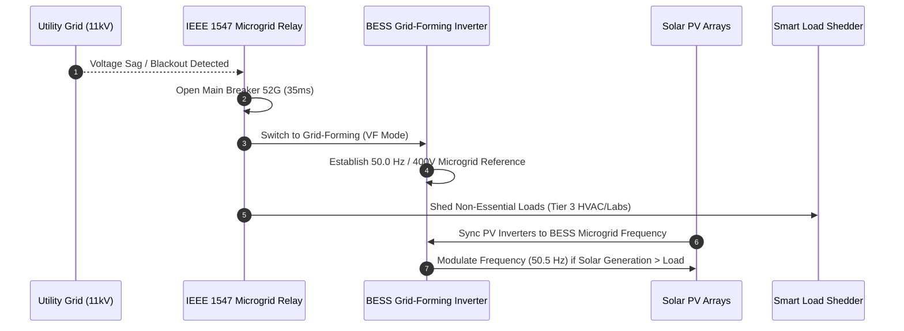

# ECO-RUNBOOK-01: Microgrid Autonomous Islanding & Black-Start Procedure

**Module**: ECO-MESH / NetZeroOS  
**Severity**: High / Emergency  
**Target Systems**: Solar PV Inverters, BESS Inverter, Grid Interconnection Breaker (52G)  

---

## 1. Overview
This runbook details the autonomous and manual protocols for transitioning the campus microgrid from grid-connected mode to islanded autonomous mode during external grid blackout or frequency excursions, and the subsequent seamless re-synchronization.

---

## 2. Trigger Conditions
1. **Under-Frequency Excursion**: Grid frequency drops below $47.5\text{ Hz}$ for $> 200\text{ ms}$.
2. **Voltage Collapse**: Grid voltage drops below $80\%\text{ Nominal}$ for $> 300\text{ ms}$.
3. **Loss of Mains (RoCoF)**: Rate of Change of Frequency $> 1.5\text{ Hz/sec}$.
4. **Manual Islanding Command**: Declared by Chief Campus Engineer via Cockpit.

---

## 3. Autonomous Sequence of Operations

---

## 4. Operational Checkpoints
- [ ] Confirm Breaker 52G is fully open and mechanically latched.
- [ ] Verify BESS is operating in Voltage-Frequency (`grid_forming`) mode.
- [ ] Verify Total Microgrid Demand $\le \text{BESS Max Power (500 kW)} + \text{Solar Generation}$.
- [ ] Monitor Battery SoC: Ensure SoC stays above $20\%$ critical reserve floor.

---

## 5. Re-synchronization to Utility Grid
1. Utility grid voltage and frequency remain stable within nominal range for $\ge 300\text{ seconds}$.
2. Synchrocheck relay confirms voltage phase angle delta $\Delta\theta \le 5^\circ$, voltage difference $\Delta V \le 2\%$, frequency difference $\Delta f \le 0.1\text{ Hz}$.
3. Close Breaker 52G.
4. BESS seamlessly reverts to `arbitrage` / `peak_shaving` PQ grid-following mode.
