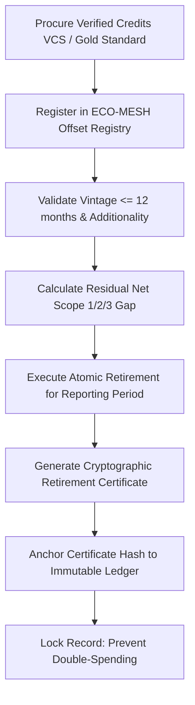

# ECO-RUNBOOK-05: Carbon Offset & Renewable Energy Certificate (REC) Retirement Protocol

**Module**: ECO-MESH / NetZeroOS  
**Compliance Standards**: Verra VCS, Gold Standard, I-REC Standard  

---

## 1. Overview
Standard operating procedure for purchasing, registering, validating additionality, and permanently retiring verified environmental commodities to offset residual campus emissions.

---

## 2. Retirement Workflow

---

## 3. Mandatory Checklist for Sustainability Officer
- [ ] Verify certificate serial numbers on public registry (Verra / Gold Standard).
- [ ] Confirm project type does not involve temporary soil carbon without permanence guarantee.
- [ ] Match offset vintage year to the emissions reporting period.
- [ ] Archive the cryptographic retirement certificate in compliance vault.
