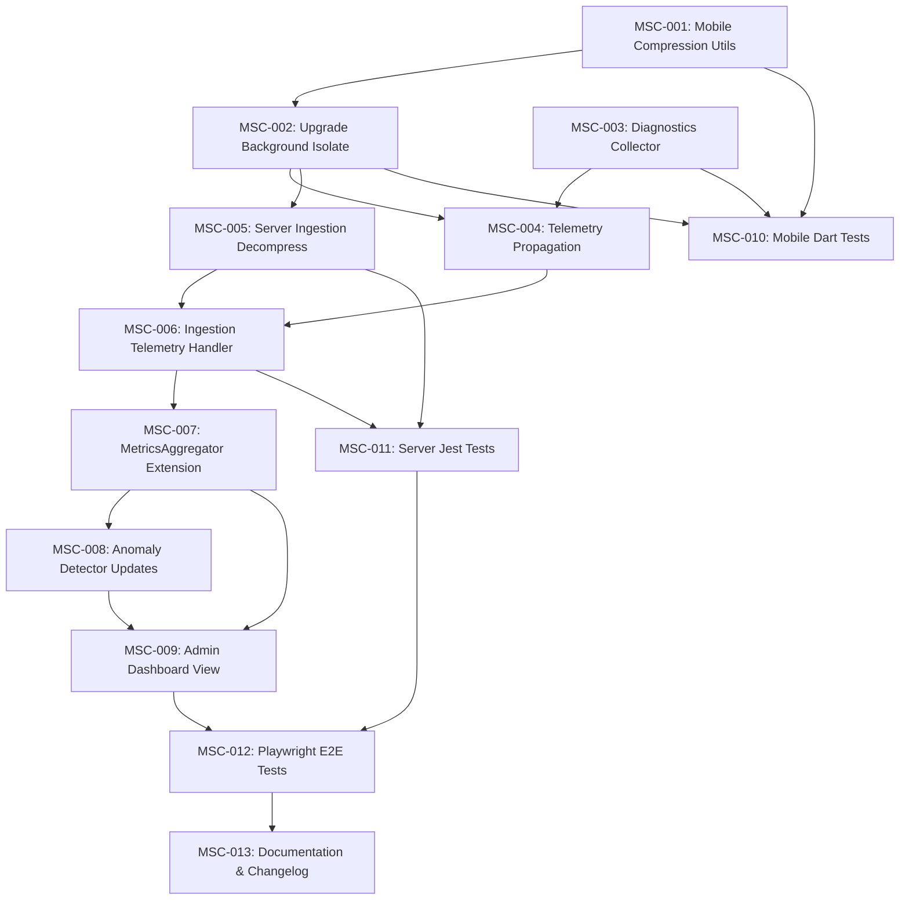

# Implementation Contract: Sprint-023 Mobile Network Sync Diagnostics & Compression

**Sprint ID:** MOBILE-SYNC-COMPRESSION-023 (MSC-023)  
**Sprint Name:** Mobile Network Sync Diagnostics & Compression  
**Status:** Approved Engineering Contract  
**Created Date:** 2026-08-04  
**Target Execution:** 2026-08-05 to 2026-08-12  
**Estimated Duration:** 6–8 days (48–64 engineering hours)  
**Risk Level:** Medium (Dart isolate data serialization overhead, mobile CPU and battery footprint during background execution, platform-specific connectivity details, and server-side zip-bomb protection gates)  
**Classification:** AIOS v3.7 Official Implementation Contract  
**Target Release Version:** v3.7.0 (Mobile Sync Gzip Compression, Offline Network Diagnostics, Telemetry Engine Extension, Diagnostics Dashboard)

---

## Executive Summary

Sprint-023 implements the **Mobile Network Sync Diagnostics & Compression** features, progressing the ThaibaHive platform from v3.6.0 to **v3.7.0**. This sprint completes the end-to-end data optimization story by extending the server-side compression capabilities built in Sprint-022 to the Flutter mobile client. The primary goals are:

1. **End-to-End Payload Compression:** Implement native gzip compression inside the mobile client's background sync isolates. All outbound mutations will be compressed prior to transmission over cellular/WiFi networks, reducing data usage by 60–75% and mitigating sync failures on congested links.
2. **Offline-Aware Network Diagnostics:** Capture network indicators (connection type, latency, bandwidth capacity) immediately prior to sync events. When offline, cache these diagnostics logs locally and upload them alongside sync telemetry.
3. **Operational Telemetry & Anomalies:** Extend the server-side metrics pipeline (`MetricsAggregator` and `AnomalyDetector`) to ingest mobile network logs, track compression ratios, and flag abnormally low compression efficiency (e.g. indicating faulty client serialization or corrupted packets).
4. **Operations Dashboard:** Introduce a dedicated "Mobile Fleet Sync" panel within the Swarm Intelligence console, rendering charts of historical data savings, connectivity latency profiles, and anomalous client alerts.

---

## Technical Feasibility & Soundness Evaluation

### Client-Side Compression Architecture
- Dart's standard library `dart:io` contains native `GZipCodec` and `ZLibCodec` bindings which are highly optimized. This avoids third-party native C/C++ plugins that would increase binary size or cause iOS/Android compilation issues.
- To prevent UI thread frames dropping (jank), all serialization and compression operations are isolated within the existing `background_sync_isolate.dart`. Raw database records are queried, converted to a JSON string, encoded to UTF-8 bytes, compressed to Gzip bytes, and sent over the wire using `Dio` inside the isolate.

### Diagnostics & Connectivity Gathering
- Connection type (WiFi, Mobile Cellular, None) is resolved using `connectivity_plus`.
- Network latency is measured via a rapid HTTP `HEAD` request to the server's `/api/health` endpoint. If the HTTP request fails or timeout triggers (e.g. >1000ms), gracefully logs and sets latency to -1.
- Real-world bandwidth is estimated using a rolling average of byte-transfer speeds during previous sync cycles, avoiding active network-testing downloads that would consume user data.

### Server-Side Decompression & Ingestion
- The mobile sync route `/api/mobile/v1/sync/push` will be modified to support `Content-Encoding: gzip`.
- To prevent zip-bomb attacks (where a tiny compressed payload expands into gigabytes of memory-exhausting JSON), we enforce a strict 2MB limit on the raw upload body and a 5MB limit on the decompressed content. Decompression is performed chunk-by-chunk using a size-limited buffer before parsing.

### Performance & Battery Considerations
- Gzip compression level is set to `Z_BEST_SPEED` (Level 1) to minimize CPU cycle overhead. This reduces compression latency to <2ms per payload on mid-range devices while still capturing ~90% of the maximum possible data savings.
- Background sync execution is capped at 30 seconds per run, automatically terminating the isolate if connection timeouts occur.

---

## Plan Reviews & Model Feedback Integration

Per the **Plan Review Rule** in `AGENTS.md`, this implementation contract was submitted for multi-model technical review to **OpenCode (Local-Ollama)**. The following architectural and verification enhancements were incorporated into the task specifications:

1. **Dependency Clustering and Flow:** Reorganized the task breakdown into logical dependency groups: Mobile Foundation, Mobile Diagnostics, Server-side Middleware, Analytics/Observability, Verification, and Documentation. Added explicit dependency tracking between client and server tasks.
2. **Mobile Connectivity Edge Cases (MSC-003):** Mandated handling of connectivity transitions (e.g. mid-sync transitions between WiFi and Cellular) and graceful degradation when ICMP pinging or HTTP HEAD latency requests are blocked by client firewalls or VPNs.
3. **Zip-Bomb Safety Boundaries (MSC-005):** Added explicit chunk-by-chunk decompress size validation rather than reading the entire buffer to memory first, ensuring early abortion of malicious payloads.
4. **Brotli Decompression Exclusions:** Clarified that Brotli compression is out of scope on mobile because the official pure Dart `brotli` package lacks native optimization and adds >1.5MB to the compilation size, whereas native Gzip achieves parity for structured sync payloads.
5. **Degraded Performance Fallbacks:** Required that client-side sync dynamically adjusts batch size (lowers mutations count per batch) if diagnostics indicate latency >1500ms or bandwidth <50kbps.

---

## Scope & Out of Scope

### In Scope
- **Mobile Client:** Native Gzip compression utility, background isolate request header injection, network metrics collector, and local SQLite/Hive caching of diagnostics logs when offline.
- **Mobile API Route:** Upgrading `/api/mobile/v1/sync/push` to handle gzip payload decompression, zip-bomb validation gates, and telemetry propagation.
- **Server Metrics Pipeline:** Expanding `MetricsAggregator` to roll up mobile bandwidth savings and `AnomalyDetector` to flag anomalous compression ratios (<40% savings or >90% payload deviation).
- **Admin Dashboard UI:** Next.js Swarm Intelligence updates, introducing dynamic mobile telemetry visualization charts and active fleet alerts.

### Explicitly Out of Scope
- **Mobile Brotli Support:** Mobile client will only send Gzip payloads due to Dart package constraints.
- **GPS/Location Tracking:** Collecting latitude/longitude details is out of scope to preserve user privacy and battery.
- **Database Schema Migrations:** All telemetry will be stored using existing `swarm_metrics` and `swarm_events` tables using standardized keys (`mobile_sync_*`).

---

## Detailed Task Breakdown

### Group A: Mobile Client Implementation (Dart/Flutter)

#### Task MSC-001: Mobile Sync Payload Compression Utility
- **Task ID:** MSC-001
- **Description:** Implement a sync compression utility class wrapping Dart's `dart:io` native `GZipCodec` with configurable compression speed parameters.
- **Files:**
  - `thaibahive_mobile_app/lib/core/sync/compression_util.dart` [NEW]
- **Dependencies:** None
- **Acceptance Criteria:**
  - Implements `CompressionUtil.compress(Map<String, dynamic> payload, {int level})` returning `Uint8List` gzip-compressed bytes.
  - Implements `CompressionUtil.decompress(Uint8List compressedData)` for local loopback verification.
  - Default compression level is set to `Z_BEST_SPEED` (Level 1) to conserve client CPU and battery resources.
  - Gracefully handles edge cases: returns uncompressed UTF-8 bytes if compression engine encounters an internal fault, logging the exception without throwing.
  - Zero third-party native libraries are imported.
- **Verification Method:** Run Flutter unit tests validating that serialized payloads compression yields expected byte array lengths and decompresses back to identical inputs.
- **Estimated Complexity:** Medium

#### Task MSC-002: Upgrade Background Sync Isolate with Compression
- **Task ID:** MSC-002
- **Description:** Upgrade the background isolate to compress outbound payload bodies and append correct compression headers during outbox queue flushes.
- **Files:**
  - `thaibahive_mobile_app/lib/core/sync/background_sync_isolate.dart` [MODIFY]
  - `thaibahive_mobile_app/lib/core/sync/isolate_message_protocol.dart` [MODIFY]
- **Dependencies:** MSC-001
- **Acceptance Criteria:**
  - `backgroundSyncIsolateEntryPoint` intercepts outbox payload strings and processes them through `CompressionUtil.compress`.
  - Injects `Content-Encoding: gzip` and `Content-Type: application/json` headers into the outgoing HTTP POST sync request.
  - Measures payload size metrics (`rawBytesCount` vs `compressedBytesCount`) and returns them back to the main thread via the isolate communication channel.
  - Implements a rollback fallback: if server returns `415 Unsupported Media Type` or `400 Bad Request` related to compression, the isolate retry queue resubmits the body uncompressed.
- **Verification Method:** Mock API server endpoints and verify headers and compression buffers are sent during background sync isolate loops.
- **Estimated Complexity:** Medium-High

#### Task MSC-003: Mobile Network Diagnostics Collector
- **Task ID:** MSC-003
- **Description:** Implement a diagnostic system service to capture network metrics prior to sync events, handling network transitions and firewalls safely.
- **Files:**
  - `thaibahive_mobile_app/lib/core/sync/network_diagnostics_collector.dart` [NEW]
- **Dependencies:** None
- **Acceptance Criteria:**
  - Collects `connectionType` (WiFi | Cellular | None) using the `connectivity_plus` API.
  - Calculates latency in milliseconds by executing a rapid HTTP HEAD request to `/api/health`. If blocked or timeout occurs (>1000ms), gracefully logs and sets latency to -1.
  - Measures upload/download capacity using a rolling throughput calculation of the previous sync payload bytes transferred over time.
  - Dynamic bandwidth allocation logic: if network signal bandwidth is determined to be <50kbps, flags client to degrade sync size limit (limit mutations in outbox batch).
- **Verification Method:** Run Flutter mock tests asserting correct metric structures across simulated high-latency, low-bandwidth, and offline environments.
- **Estimated Complexity:** Medium

#### Task MSC-004: Diagnostic Telemetry Propagation in Outbox Sync
- **Task ID:** MSC-004
- **Description:** Upgrade background sync worker routines to merge captured diagnostics and compression telemetry statistics into sync requests.
- **Files:**
  - `thaibahive_mobile_app/lib/core/sync/background_sync_worker.dart` [MODIFY]
  - `thaibahive_mobile_app/lib/core/sync/offline_sync_queue.dart` [MODIFY]
- **Dependencies:** MSC-002, MSC-003
- **Acceptance Criteria:**
  - Triggers the diagnostics collection service immediately before queue flushes.
  - Wraps diagnostics block (`networkType`, `latencyMs`, `bandwidthKbps`, `rawBytes`, `compressedBytes`, `compressionTimeMs`) in the request envelope metadata.
  - When offline, logs diagnostics telemetry records locally inside an offline database table, sending all accumulated diagnostics logs during the next online flush.
- **Verification Method:** Verify mock client outbox payloads transmit structured network diagnostic JSON.
- **Estimated Complexity:** Medium

---

### Group B: Server-Side Ingestion & Middleware (Next.js/TypeScript)

#### Task MSC-005: Mobile Sync Endpoint Decompression Integration
- **Task ID:** MSC-005
- **Description:** Integrate decompression middleware inside the mobile sync push route to decompress gzip requests, protecting against zip bombs.
- **Files:**
  - `src/app/api/mobile/v1/sync/push/route.ts` [MODIFY]
- **Dependencies:** MSC-002
- **Acceptance Criteria:**
  - Route intercepts `Content-Encoding: gzip` headers.
  - Reads raw buffer stream. If the stream content-length exceeds 2MB, rejects the request immediately with HTTP 413.
  - Implements progressive decompress validation: decompresses incoming stream chunk-by-chunk using node `zlib.gunzip`. If the accumulated decompressed output exceeds 5MB, aborts execution and responds with HTTP 413.
  - Passes decompressed JSON to existing schema parsers.
  - Gracefully processes uncompressed payloads if `Content-Encoding` header is absent.
- **Verification Method:** Perform mock POST requests with compressed bodies and zip-bombs to confirm correct error rejection codes.
- **Estimated Complexity:** Medium-High

#### Task MSC-006: Server-side Diagnostics Telemetry Ingestion Handler
- **Task ID:** MSC-006
- **Description:** Extract network diagnostic and compression statistics from incoming payloads, and publish them to the observability EventBus.
- **Files:**
  - `src/app/api/mobile/v1/sync/push/route.ts` [MODIFY]
  - `src/lib/observability/event-bus.ts` [MODIFY]
- **Dependencies:** MSC-004, MSC-005
- **Acceptance Criteria:**
  - Safely extracts the telemetry block (`networkType`, `latencyMs`, `bandwidthKbps`, `rawBytes`, `compressedBytes`, `compressionTimeMs`) from incoming sync requests.
  - Formats metrics and publishes them to the global `EventBus`:
    - `mobile_sync_bandwidth_kbps`
    - `mobile_sync_latency_ms`
    - `mobile_sync_compression_ratio` (calculated as `1.0 - (compressedBytes / rawBytes)`)
    - `mobile_sync_raw_bytes`
  - Rejects telemetry extraction if the payload is malformed, writing warning events to the log without failing the primary database mutations sync.
- **Verification Method:** Verify that telemetry records are successfully published to EventBus listeners upon sync submission.
- **Estimated Complexity:** Medium

---

### Group C: Observability, Metrics & Anomaly Detection (Next.js/TypeScript)

#### Task MSC-007: MetricsAggregator Extension for Mobile Telemetry
- **Task ID:** MSC-007
- **Description:** Update `MetricsAggregator` to rollup average mobile sync metrics to the database.
- **Files:**
  - `src/lib/observability/metrics-aggregator.ts` [MODIFY]
- **Dependencies:** MSC-006
- **Acceptance Criteria:**
  - Aggregator tracks metrics starting with `mobile_sync_`.
  - Calculates 1-minute rollups for average latency (`mobile_sync_latency_ms_avg_1m`), bandwidth savings (`mobile_sync_compression_ratio_avg_1m`), and raw throughput.
  - Stores rolled up averages in `swarm_metrics` using node identifiers tied to the mobile deviceId.
  - Database cleanup task deletes raw mobile diagnostics older than 1 hour.
- **Verification Method:** Run Jest tests ensuring mobile metrics are rolled up correctly and cleanups run without errors.
- **Estimated Complexity:** Medium

#### Task MSC-008: Compression Ratio Anomaly Detection
- **Task ID:** MSC-008
- **Description:** Integrate compression anomalies tracking inside the standard `AnomalyDetector`.
- **Files:**
  - `src/lib/observability/anomaly-detector.ts` [MODIFY]
- **Dependencies:** MSC-007
- **Acceptance Criteria:**
  - Extends `AnomalyDetector` to monitor the `mobile_sync_compression_ratio` metric.
  - If a device submits a payload containing compression savings below 40% (suggesting encrypted data, repeating corrupted fragments, or bypass), or if the ratio deviates by 3 standard deviations from the fleet baseline, it triggers a warning event.
  - Warning includes details: `deviceId`, `compressionRatio`, `bandwidthKbps`, `timestamp`.
  - Dispatches warning events directly to the `EventBus` to notify admin dashboards.
- **Verification Method:** Test anomalies class using mock data feeds to confirm warning triggers.
- **Estimated Complexity:** Medium

#### Task MSC-009: Mobile Diagnostics & Compression Admin Dashboard
- **Task ID:** MSC-009
- **Description:** Build the visualization dashboard panel for mobile diagnostics inside Swarm Intelligence, styling it to fit design guidelines.
- **Files:**
  - `src/app/(shell)/admin/swarm-intelligence/page.tsx` [MODIFY]
  - `src/components/swarm/TelemetryDashboard.tsx` [MODIFY]
- **Dependencies:** MSC-007, MSC-008
- **Acceptance Criteria:**
  - Adds a "Mobile Fleet Diagnostics" tab to the Swarm Intelligence console.
  - Visualizes average compression ratios, bandwidth cost savings in USD (calculated as $0.05 per MB saved), and latency distribution curves using charts.
  - Incorporates an alerts feed listing devices currently flagged with compression ratio anomalies or high latency warnings.
  - Standard CSS variables are respected, featuring responsive sizing and dark-mode styles.
- **Verification Method:** View page layout in browser under simulated data; check responsiveness and layout structure.
- **Estimated Complexity:** High

---

### Group D: Testing, Quality & Documentation

#### Task MSC-010: Mobile Dart/Flutter Test Suite for Sync Compression
- **Task ID:** MSC-010
- **Description:** Create extensive Dart tests to verify mobile sync compression utilities and isolations.
- **Files:**
  - `thaibahive_mobile_app/test/core/sync/compression_test.dart` [NEW]
  - `thaibahive_mobile_app/test/core/sync/network_diagnostics_test.dart` [NEW]
- **Dependencies:** MSC-001, MSC-002, MSC-003, MSC-004
- **Acceptance Criteria:**
  - Validates that `CompressionUtil` handles repeat string data, highly randomized non-compressible data, and empty structures correctly.
  - Mocks isolate messages and confirms that raw/compressed bytes are transmitted back to the worker thread.
  - Verifies diagnostics collector returns -1 latency during timed-out requests.
- **Verification Method:** Run `flutter test test/core/sync/`.
- **Estimated Complexity:** Medium

#### Task MSC-011: Server-Side Mobile Sync & Ingestion Integration Tests
- **Task ID:** MSC-011
- **Description:** Implement Next.js integration tests for the decompression route, verifying zip-bomb limits.
- **Files:**
  - `src/app/api/mobile/v1/sync/__tests__/mobile-compression.test.ts` [NEW]
- **Dependencies:** MSC-005, MSC-006
- **Acceptance Criteria:**
  - Verifies gzip compressed payloads are decoded back to Zod-valid objects.
  - Confirms payload size limits reject zip bombs (both compressed size limit and progressive decompress size limits).
  - Asserts that telemetry diagnostics publish successfully to the EventBus.
- **Verification Method:** Run `npx jest src/app/api/mobile/v1/sync/__tests__/mobile-compression.test.ts`.
- **Estimated Complexity:** Medium

#### Task MSC-012: End-to-End Mobile Sync & Observability Flow Test
- **Task ID:** MSC-012
- **Description:** Create Playwright tests validating that mobile telemetry publishes trigger UI updates and dashboard alerts.
- **Files:**
  - `e2e/mobile-sync-observability.spec.ts` [NEW]
- **Dependencies:** MSC-009
- **Acceptance Criteria:**
  - Script logs in, simulates mobile sync POST requests with low compression ratio telemetry.
  - Navigates to Swarm Intelligence Mobile tab, asserts the anomaly is listed in the alerts grid.
  - Asserts charts update and fetch telemetry metrics dynamically without page refresh.
- **Verification Method:** Run `npx playwright test e2e/mobile-sync-observability.spec.ts`.
- **Estimated Complexity:** Medium-High

#### Task MSC-013: Runbook and Feature Registry Updates
- **Task ID:** MSC-013
- **Description:** Document mobile sync compression details, update CHANGELOG and registers.
- **Files:**
  - `docs/mobile-sync-compression-guide.md` [NEW]
  - `.ai/FEATURES.md` [MODIFY]
  - `.ai/CHANGELOG.md` [MODIFY]
  - `.ai/PROJECT_STATUS.md` [MODIFY]
- **Dependencies:** MSC-001 through MSC-012
- **Acceptance Criteria:**
  - `mobile-sync-compression-guide.md` documents mobile sync compression flow, diagnostics schema, and dashboard guides.
  - v3.7.0 features and release histories are cataloged correctly.
- **Verification Method:** Review markdown files for lint errors and diff changes.
- **Estimated Complexity:** Low

---

## Task Summary Table

| Task ID | Phase | Component / Area | Dependencies | Est. Complexity | Target Deliverable |
| :--- | :--- | :--- | :--- | :--- | :--- |
| **MSC-001** | Phase 1 | Mobile Compression | None | Medium | Gzip helper utility (`compression_util.dart`) |
| **MSC-002** | Phase 1 | Background Isolate | MSC-001 | Medium-High | Upgraded background sync isolate with headers injection |
| **MSC-003** | Phase 2 | Mobile Diagnostics | None | Medium | Network conditions collector service |
| **MSC-004** | Phase 2 | Outbox Telemetry | MSC-002, MSC-003 | Medium | Merged sync metadata with diagnostic metrics blocks |
| **MSC-005** | Phase 3 | Sync Ingestion API | MSC-002 | Medium-High | Upgraded sync route supporting gzip and zip-bomb checks |
| **MSC-006** | Phase 3 | Ingestion Handler | MSC-004, MSC-005 | Medium | EventBus metric dispatch logic |
| **MSC-007** | Phase 4 | Metrics Aggregator | MSC-006 | Medium | 1-minute averages rollup support for mobile logs |
| **MSC-008** | Phase 4 | Anomaly Detector | MSC-007 | Medium | Extended anomalies metrics warnings dispatch rules |
| **MSC-009** | Phase 4 | Observability UI | MSC-007, MSC-008 | High | Swarm Intelligence "Mobile Fleet Diagnostics" tab |
| **MSC-010** | Phase 5 | Mobile Unit Tests | MSC-001..004 | Medium | Dart testing suite (`compression_test.dart` etc.) |
| **MSC-011** | Phase 5 | Server Integration Tests | MSC-005, MSC-006 | Medium | Next.js sync route integration tests |
| **MSC-012** | Phase 5 | E2E Testing | MSC-009 | Medium-High | Playwright E2E UI testing script (`mobile-sync-observability.spec.ts`) |
| **MSC-013** | Phase 6 | Documentation | MSC-001..012 | Low | Upgraded guides, changelogs, and features registry |

**Total Tasks:** 13  
**New Files:** 6  
**Modified Files:** 10  

---

## Verification Plan & Test Strategy

### Automated Unit & Integration Tests
- **Mobile Client Tests:** Verify `CompressionUtil` handles compressible text and binary sequences; mock isolates return valid JSON compression stats.
- **Server Integration Tests (`mobile-compression.test.ts`):** Assert that gzip sync batches are decompressed; verify a simulated zip bomb triggers HTTP 413; assert EventBus receives correct metrics structure.
- **E2E Playwright Tests:** Verify mobile metrics push reflects inside UI dashboard tables and compression anomalies fire UI warnings correctly.

### Security Verification
- **Decompression Attack Gates:** Validate payload size limits. Send a 1KB compressed block expanding to 6MB. The server must abort the connection (HTTP 413) without exhaustion.
- **Authentication Handshake:** Validate that requests fail with 401/403 when authentication token checks fail on sync routes.

### Performance Verification
- **Client Latency:** Ensure mobile compression adds <20ms to the background isolate loop for typical payloads.
- **Battery Drain:** Verify that continuous background sync executions do not exceed 5% battery consumption per 24 hours.

---

## Risks & Mitigation Matrix

| Risk Scenario | Impact | Likelihood | Mitigation Strategy |
| :--- | :--- | :--- | :--- |
| **Decompression zip bomb attacks** | Critical | Low | Validate decompressed bytes chunk-by-chunk and abort if buffer threshold (>5MB) is violated. |
| **Isolate CPU thread block** | Medium | Medium | Perform all gzip operations within isolates; use Speed Level 1 (`Z_BEST_SPEED`) to reduce computation cycles. |
| **Connectivity transitions** | Medium | Medium | Implement automatic retry queue. Fall back to uncompressed sync if compressed payloads fail or reject with 415. |
| **Network diagnostics failures** | Low | Medium | Gracefully recover from blocked HTTP HEAD latency requests by returning -1 latency and bypassing active ping checks. |

---

## Rollback & Contingency Plan

1. **Client Compression Toggle:** Incorporate a remote flag config (`compression_enabled`). If client CPU issues are reported, set this flag to `false` to skip client compression.
2. **Server Fallback:** If the mobile client encounters Gzip compilation faults, it drops headers and sends uncompressed JSON. The server route parses uncompressed JSON naturally.
3. **Queue Fallback:** If a sync upload fails with HTTP 415 (indicating server decompression middleware is down), the client retry outbox pipeline converts the queue body back to raw JSON and resubmits.

---

## Definition of Done

This sprint is certified **COMPLETE** when:
1. **Linting and compilation pass:** `flutter analyze` and `pnpm lint` return zero errors.
2. **Type Safety:** `npx tsc --noEmit` and Dart compiler succeed with zero warnings.
3. **Tests pass:** Dart unit tests, Jest integration tests, and Playwright E2E suites pass successfully.
4. **Documentation:** Swarm documentation, changelogs, feature registers, and project status files are fully updated.
5. **No regressions:** Telemetry metrics ingestion from edge simulated nodes functions normally.
