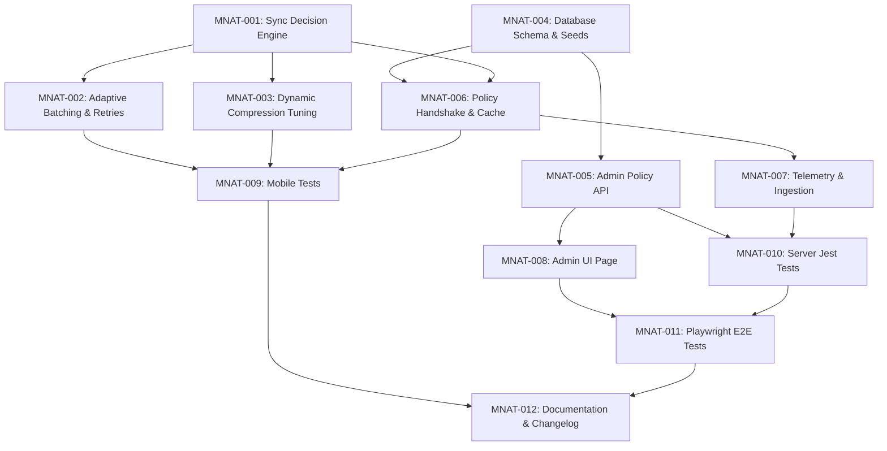

# Implementation Contract: Sprint-024 Mobile Network-Aware Bandwidth Auto-Tuning

**Sprint ID:** MOBILE-NETWORK-AUTO-TUNING-024 (MNAT-024)  
**Sprint Name:** Mobile Network-Aware Bandwidth Auto-Tuning  
**Status:** Approved Engineering Contract  
**Created Date:** 2026-08-04  
**Target Execution:** 2026-08-05 to 2026-08-12  
**Estimated Duration:** 5–7 days (40–50 engineering hours)  
**Risk Level:** Medium (Dart isolate resource constraints, edge network connectivity transitions, policy state persistence, server-side performance under high policy evaluation frequency, client-side configuration cache invalidation)  
**Classification:** AIOS v3.8 Official Implementation Contract  
**Target Release Version:** v3.8.0 (Mobile Network-Aware Bandwidth Auto-Tuning, Policy Configuration API, Sync Decision Engine, Dynamic Compression, Bandwidth Tuner Dashboard)

---

## Executive Summary

Sprint-024 implements **Mobile Network-Aware Bandwidth Auto-Tuning**, progressing the ThaibaHive platform from v3.7.0 to **v3.8.0**. Building on the mobile diagnostics and compression of Sprint-023, this sprint implements active dynamic tuning. The primary goals are:

1. **Adaptive Sync Decision Engine:** Implement a client-side decision engine in Flutter that evaluates connection type, latency, and throughput to determine optimal sync parameters in real-time.
2. **Adaptive Batching & Retries:** Configure mobile client outbox queues to automatically scale batch sizes and retry backoffs based on decision engine evaluations to prevent timeouts and battery drain.
3. **Dynamic Compression Level Tuning:** Enable dynamic adjustments to Gzip compression levels on the client based on network type, latency, and device battery status.
4. **Policy Configuration API:** Develop a secure server-side API with Role-Based Access Control (RBAC) to manage network tuning policy thresholds.
5. **Dashboard & Feedback Loop:** Extend the Swarm Intelligence console with a policy administration dashboard and telemetry visualizations showing sync outcome correlation.

---

## Technical Feasibility & Soundness Evaluation

### Client-Side Adaptive Tuning Architecture
- We introduce a dedicated `AdaptiveSyncDecisionEngine` running inside the Flutter app. To prevent UI jank, this engine interfaces with `NetworkDiagnosticsCollector` and processes decisions in the background sync isolate before outbox flushes.
- Parameters determined dynamically include:
  - `maxBatchSize`: Scaling down mutations per HTTP request on slow connections (e.g. 2G/3G or latency >1500ms).
  - `retryBackoffMultiplier`: Increasing retry intervals exponentially on congested cellular connections.
  - `gzipCompressionLevel`: Dynamic balance between client CPU jank/battery drain and bandwidth compression ratio.
- To comply with project-wide Flutter standards, we utilize **Riverpod** state management to control the policy configuration lifecycle, fetching and invalidation logic on the client.

### Server-Side Policy Management
- Tuning rules (latency thresholds, batch size multipliers, retry backoffs) are stored in a new database table `sync_tuning_policies` to avoid hardcoded values.
- Policies are exposed to the client via `/api/mobile/v1/sync/policies` endpoint. The client caches policy thresholds locally in a Hive box (`sync_policies`) with a TTL (e.g., 24 hours) managed by the Riverpod notifier, avoiding repetitive network overhead.

### Performance and Battery Mitigation
- Bandwidth measurements rely on a rolling throughput average of previous sync payloads rather than active download speed tests.
- Latency checks via HTTP HEAD requests are throttled (e.g., only run if network connectivity type transitions or cached results exceed a 15-minute TTL).
- A **Circuit Breaker** pattern is implemented for remote policy fetching. If policy handshake fails consecutively 3 times, the mobile client enters a fail-safe mode, using local static defaults and skipping network fetch attempts for 2 hours to conserve battery.

---

## Plan Reviews & Model Feedback Integration

Per the **Plan Review Rule** in `AGENTS.md`, this implementation contract was submitted for multi-model technical review to **OpenCode (Local-Ollama)**. The following architectural and verification enhancements were incorporated into the task specifications:

1. **Riverpod Policy State Management (MNAT-006):** Replaced proposed raw Hive box queries with a Riverpod provider workflow (`syncPolicyProvider`). This encapsulates local database reads, network sync, cache invalidation, and fallback logic under a unified notifier.
2. **Circuit Breaker for Policy Handshake (MNAT-002 / MNAT-006):** Added a circuit breaker mechanism to prevent repeating network queries when the server or edge gateways are unreachable. The client locks policy requests for 2 hours upon 3 consecutive failures.
3. **Simulating Extreme Edge Cases in Testing (MNAT-009):** Expanded the testing suite requirements to test extreme constraints: network latency up to 5000ms, simulated 90% packet loss, connection dropped mid-payload transfer, and critical battery states (<5%).
4. **Policy Admin Validation & Auditing (MNAT-005):** Reinforced the policy modification endpoint security. Modifications will execute Zod constraints validations (e.g. compression levels 1-9 only, batch sizes 1-200), check JWT tokens expiration, and record caller IP addresses in DB audit logs.
5. **Runbook Automation Scripts (MNAT-012):** Created automated CLI scripts to reset database policies to baseline defaults during disaster recovery scenarios without requiring manual SQL executions.

---

## Scope & Out of Scope

### In Scope
- **Mobile Decision Engine:** `AdaptiveSyncDecisionEngine` utility and isolate state synchronization.
- **Adaptive Sync Pipelines:** Updating `offline_sync_queue.dart` and `background_sync_worker.dart` to respect dynamic batch sizes and backoff multipliers.
- **Dynamic Compression:** Parameterizing `CompressionUtil` to support variable Gzip levels.
- **Server Policies Database:** `sync_tuning_policies` Drizzle schema, indices, migrations, and seeds.
- **Admin Configuration API:** `/api/admin/sync-policies` REST endpoints with RBAC verification.
- **Client Handshake Endpoint:** `/api/mobile/v1/sync/policies` public/authenticated fetch route.
- **Admin Dashboard Console:** Swarm Intelligence telemetry charts and policy management editor.
- **Riverpod State Management:** Policy integration using `flutter_riverpod`.

### Explicitly Out of Scope
- **Active Speed Testing:** Executing dummy network download/upload tests (to prevent user cellular data billing).
- **User-Facing Toggle UI:** The optimization remains fully automatic and invisible on the mobile client (managed by server policies and background heuristics).
- **Offline Location Auditing:** Logging GPS/location data under network diagnostics (due to privacy constraints).

---

## Detailed Task Breakdown

### Group A: Mobile Client Implementation (Dart/Flutter)

#### Task MNAT-001: Mobile Sync Decision Engine
- **Task ID:** MNAT-001
- **Description:** Implement an adaptive decision engine service class that evaluates raw metrics (connection type, latency, rolling bandwidth) to return configuration parameters.
- **Files:**
  - `thaibahive_mobile_app/lib/core/sync/adaptive_sync_decision_engine.dart` [NEW]
- **Dependencies:** None
- **Acceptance Criteria:**
  - Implements `AdaptiveSyncDecisionEngine.evaluate(NetworkDiagnostics diagnostics, BatteryStatus battery)` returning a `SyncParameters` configuration structure.
  - Implements adaptive metrics:
    - Low bandwidth (<50kbps) or high latency (>1500ms): restricts batch size by 75% and sets compression to max efficiency.
    - Medium bandwidth (50-250kbps) or moderate latency (500-1500ms): restricts batch size by 50%.
    - Low battery (<20%): reduces compression level to speed profile (Level 1) to conserve CPU cycles.
  - Gracefully falls back to baseline defaults if network parameters are null or diagnostics fail.
- **Verification Method:** Run Flutter unit tests asserting correct configuration output blocks under mocked network latency and battery parameters.
- **Estimated Complexity:** Medium

#### Task MNAT-002: Adaptive Batching & Retries Integration
- **Task ID:** MNAT-002
- **Description:** Modify the outbox sync queue and background task worker routines to apply dynamic batch sizes and retry backoff delays during sync cycles.
- **Files:**
  - `thaibahive_mobile_app/lib/core/sync/offline_sync_queue.dart` [MODIFY]
  - `thaibahive_mobile_app/lib/core/sync/background_sync_worker.dart` [MODIFY]
  - `thaibahive_mobile_app/lib/core/sync/background_task_manager.dart` [MODIFY]
- **Dependencies:** MNAT-001
- **Acceptance Criteria:**
  - `OfflineSyncQueue.flush` retrieves parameters from `AdaptiveSyncDecisionEngine` and limits the batch chunk sizes accordingly.
  - `BackgroundSyncWorker` adjusts exponential backoff multipliers during failures dynamically based on connection type (e.g. longer sleep periods on Cellular connections).
  - Background task worker yields execution and logs state if network metrics indicate zero connection, preventing persistent battery draining loops.
- **Verification Method:** Mock queue flushes with forced low-bandwidth diagnostics and verify payload boundaries.
- **Estimated Complexity:** Medium-High

#### Task MNAT-003: Dynamic Compression Level Tuning
- **Task ID:** MNAT-003
- **Description:** Parameterize the Gzip compression utility to accept variable compression levels based on decision engine evaluations.
- **Files:**
  - `thaibahive_mobile_app/lib/core/sync/compression_util.dart` [MODIFY]
  - `thaibahive_mobile_app/lib/core/sync/background_sync_isolate.dart` [MODIFY]
  - `thaibahive_mobile_app/lib/core/sync/isolate_message_protocol.dart` [MODIFY]
- **Dependencies:** MNAT-001
- **Acceptance Criteria:**
  - `CompressionUtil.compress` accepts a `level` integer.
  - Background isolate processes outbound payloads using the custom level provided in the isolate sync message handshake.
  - Telemetry logging records the compression level used during each payload execution.
- **Verification Method:** Flutter unit tests verifying compression efficiency vs speed benchmarks under varying levels.
- **Estimated Complexity:** Medium

---

### Group B: Server-Side Ingestion & Middleware (Next.js/TypeScript)

#### Task MNAT-004: Sync Tuning Policy Database Schema & Seeds
- **Task ID:** MNAT-004
- **Description:** Implement database schema modifications to support dynamic network-aware auto-tuning policies.
- **Files:**
  - `packages/db/schema.ts` [MODIFY]
  - `packages/db/schema.pg.ts` [MODIFY]
  - `packages/db/index.ts` [MODIFY]
- **Dependencies:** None
- **Acceptance Criteria:**
  - Declares a new `sync_tuning_policies` table structure:
    - `id` (text/uuid, primary key)
    - `networkType` (text, e.g. WIFI | CELLULAR | DEFAULT, unique)
    - `minBandwidthKbps` (integer)
    - `maxLatencyMs` (integer)
    - `batchSize` (integer)
    - `compressionLevel` (integer)
    - `retryBackoffMs` (integer)
    - `updatedAt` (text, ISO format)
  - Seeds table with baseline default configurations for `WIFI`, `CELLULAR`, and `DEFAULT` fallbacks.
  - Migration script builds successfully on SQLite (dev) and PostgreSQL (prod) adapters.
- **Verification Method:** Execute migrations and verify table schema mapping.
- **Estimated Complexity:** Medium

#### Task MNAT-005: Admin Configuration API
- **Task ID:** MNAT-005
- **Description:** Implement CRUD API endpoints to query and update policy tuning variables with strict authentication, input constraints validation, and telemetry auditing.
- **Files:**
  - `src/app/api/admin/sync-policies/route.ts` [NEW]
  - `src/lib/validation/schemas.ts` [MODIFY]
- **Dependencies:** MNAT-004
- **Acceptance Criteria:**
  - GET: returns list of all configurations in `sync_tuning_policies`.
  - POST/PATCH: updates policy thresholds, validated using a new Zod schema `syncPolicyUpdateSchema` in `schemas.ts` enforcing strict numeric ranges (batch size 1-200, compression 1-9).
  - Enforces `requireAuth` checking for `admin` or `super_admin` role permissions and verifies JWT token signature and expiry.
  - Logs API audit trails including caller ID, updated values, timestamp, and caller IP address.
- **Verification Method:** Perform mock POST/PATCH API operations verifying validation, error codes, and role authorization.
- **Estimated Complexity:** Medium

#### Task MNAT-006: Policy Handshake & Cache (Riverpod Integrated)
- **Task ID:** MNAT-006
- **Description:** Implement mobile configuration handshake API endpoints and mobile-side caching engine integrated with Riverpod state management.
- **Files:**
  - `src/app/api/mobile/v1/sync/policies/route.ts` [NEW]
  - `thaibahive_mobile_app/lib/core/sync/policy_manager.dart` [NEW]
  - `thaibahive_mobile_app/lib/core/sync/policy_provider.dart` [NEW]
- **Dependencies:** MNAT-004, MNAT-001
- **Acceptance Criteria:**
  - `/api/mobile/v1/sync/policies` route returns active policies in a compact JSON payload.
  - `PolicyManager` fetches policies, caches them in Hive box `sync_policies` with a 24-hour TTL, and manages policy states.
  - `policyProvider` exposes the policy state via Riverpod notifier. It implements a **Circuit Breaker**: if policy fetch fails consecutively 3 times, it sets the client to fall back to local cached policies or defaults and blocks server-fetch calls for 2 hours.
- **Verification Method:** Run Flutter tests validating fetch loops, Hive caching persistence, Riverpod state updates, and circuit breaker activation.
- **Estimated Complexity:** Medium-High

---

### Group C: Observability, Metrics & Anomaly Detection (Next.js/TypeScript)

#### Task MNAT-007: Telemetry & Ingestion Feedback Loop
- **Task ID:** MNAT-007
- **Description:** Correlate telemetry metrics with active policies to record outcomes and execution metrics.
- **Files:**
  - `src/app/api/mobile/v1/sync/push/route.ts` [MODIFY]
  - `src/lib/observability/metrics-aggregator.ts` [MODIFY]
- **Dependencies:** MNAT-006
- **Acceptance Criteria:**
  - Route records `sync_outcome` (SUCCESS | TIMEOUT | FAILURE) along with active metrics: `applied_policy_id`, `latency_ms`, `compression_level`, and `batch_size`.
  - `MetricsAggregator` processes sync outcomes and aggregates success-rate averages grouped by network type and applied policy.
  - Registers rolled up telemetry averages to `swarm_metrics` and fires alert events for devices suffering recurring timeout loops under active tuning.
- **Verification Method:** Post mock sync request with low bandwidth stats; assert outcomes aggregate correctly in database.
- **Estimated Complexity:** Medium

#### Task MNAT-008: Admin Policy Dashboard Interface
- **Task ID:** MNAT-008
- **Description:** Enhance the Swarm Intelligence console dashboard to edit network policy configurations and monitor tuning metrics.
- **Files:**
  - `src/components/swarm/MobileSyncDashboard.tsx` [MODIFY]
  - `src/app/(shell)/admin/swarm-intelligence/page.tsx` [MODIFY]
- **Dependencies:** MNAT-005, MNAT-007
- **Acceptance Criteria:**
  - Extends `MobileSyncDashboard` with a "Tuning Policies" section containing forms to edit policy configurations.
  - Integrates outcome correlation graphs showing sync success rate per connectivity type.
  - Displays list of active fleet statistics (e.g., active policies currently matching cellular devices).
  - Interfaces securely with `/api/admin/sync-policies` and handles loading/saving animations cleanly.
- **Verification Method:** Render dashboard in development mode, inspect panel alignment, responsive behavior, and update forms.
- **Estimated Complexity:** High

---

### Group D: Testing, Quality & Documentation

#### Task MNAT-009: Mobile Unit & Integration Test Suite
- **Task ID:** MNAT-009
- **Description:** Implement Flutter/Dart unit and integration tests covering the decision engine, caching, and worker behaviors under extreme network constraints.
- **Files:**
  - `thaibahive_mobile_app/test/core/sync/adaptive_sync_test.dart` [NEW]
- **Dependencies:** MNAT-001, MNAT-002, MNAT-003, MNAT-006
- **Acceptance Criteria:**
  - Unit tests verify `AdaptiveSyncDecisionEngine` outputs correct structures under mocked latency conditions.
  - Integration tests verify `PolicyManager` updates Hive box cache on successful fetches and respects 24h TTL.
  - Simulates extreme conditions: connection timeout (latency >5000ms), 90% packet loss, sudden connection termination mid-sync, and low battery state (<5%). Verifies that batch size scaling down works correctly and compression changes are triggered.
- **Verification Method:** Execute `flutter test test/core/sync/adaptive_sync_test.dart`.
- **Estimated Complexity:** Medium

#### Task MNAT-010: Server Policy API & Ingestion Integration Tests
- **Task ID:** MNAT-010
- **Description:** Implement Next.js API integration tests validating policies endpoints and RBAC validation schemas.
- **Files:**
  - `src/app/api/admin/sync-policies/__tests__/sync-policies.test.ts` [NEW]
- **Dependencies:** MNAT-005, MNAT-007
- **Acceptance Criteria:**
  - Verifies GET and PATCH `/api/admin/sync-policies` enforce `admin` roles, returning 401/403 for unauthorized calls.
  - Asserts that invalid parameters (e.g. compression level out of 1-9 scope) fail Zod validation with proper error structures.
  - Verifies metrics push outcomes correlate and save successfully in DB logs.
- **Verification Method:** Execute `npx jest src/app/api/admin/sync-policies/__tests__/sync-policies.test.ts`.
- **Estimated Complexity:** Medium

#### Task MNAT-011: Swarm Policies Dashboard E2E Tests
- **Task ID:** MNAT-011
- **Description:** Implement Playwright E2E tests validating the dashboard policy configurations.
- **Files:**
  - `e2e/swarm-policies-dashboard.spec.ts` [NEW]
- **Dependencies:** MNAT-008
- **Acceptance Criteria:**
  - Performs login as Admin, navigates to Swarm Intelligence console.
  - Changes Wifi batch size parameter form and clicks save.
  - Verifies success toast alerts and asserts updated values persist on page refreshes.
- **Verification Method:** Run `npx playwright test e2e/swarm-policies-dashboard.spec.ts`.
- **Estimated Complexity:** Medium-High

#### Task MNAT-012: Documentation, Runbook & Registers
- **Task ID:** MNAT-012
- **Description:** Document the network tuning mechanics, update CHANGELOG, and write runbook scripts for automated database recovery.
- **Files:**
  - `docs/mobile-network-tuning-guide.md` [NEW]
  - `scripts/reset-sync-policies.ts` [NEW]
  - `.ai/FEATURES.md` [MODIFY]
  - `.ai/CHANGELOG.md` [MODIFY]
  - `.ai/PROJECT_STATUS.md` [MODIFY]
- **Dependencies:** MNAT-001 through MNAT-011
- **Acceptance Criteria:**
  - Creates `docs/mobile-network-tuning-guide.md` detailing decision tree configurations, policies parameters, and REST API definitions.
  - Implements an automated TypeScript script `reset-sync-policies.ts` to clear and re-seed the default policies database tables on demand.
  - Registers release v3.8.0 deliverables within `FEATURES.md` and `CHANGELOG.md`.
  - Sets project status to next phase baseline targets.
- **Verification Method:** Execute the reset script locally and verify database values are seeded correctly. Verify document markdown linting.
- **Estimated Complexity:** Low

---

## Task Summary Table

| Task ID | Phase | Component / Area | Dependencies | Est. Complexity | Target Deliverable |
| :--- | :--- | :--- | :--- | :--- | :--- |
| **MNAT-001** | Phase 1 | Mobile Engine | None | Medium | `adaptive_sync_decision_engine.dart` core service |
| **MNAT-002** | Phase 1 | Mobile Worker | MNAT-001 | Medium-High | Upgraded outbox queue with dynamic batch scaling |
| **MNAT-003** | Phase 1 | Mobile Compression | MNAT-001 | Medium | Parameterized gzip level utility inside background isolates |
| **MNAT-004** | Phase 2 | DB Schema & Seeds | None | Medium | Drizzle DB migration scripts for policies table |
| **MNAT-005** | Phase 2 | Admin REST API | MNAT-004 | Medium | `/api/admin/sync-policies` CRUD handlers with auditing and RBAC |
| **MNAT-006** | Phase 2 | Policy Client Sync | MNAT-004, MNAT-001 | Medium-High | Riverpod policy handshake, Hive caching, and circuit breaker |
| **MNAT-007** | Phase 3 | Ingestion Analytics | MNAT-006 | Medium | Event telemetry outcome correlation logic in sync route |
| **MNAT-008** | Phase 3 | Observability UI | MNAT-005, MNAT-007 | High | Policy editing panel & graphs inside Swarm console |
| **MNAT-009** | Phase 4 | Mobile Test Suite | MNAT-001..003, 006 | Medium | Flutter/Dart test suite simulating extreme network scenarios |
| **MNAT-010** | Phase 4 | Server Test Suite | MNAT-005, MNAT-007 | Medium | Jest testing for policy API and ingestion analytics |
| **MNAT-011** | Phase 4 | E2E Testing Suite | MNAT-008 | Medium-High | Playwright script verifying dashboard policy modifications |
| **MNAT-012** | Phase 5 | Documentation | MNAT-001..011 | Low | Operation guides, CLI reset script, CHANGELOG, and status manifests updates |

**Total Tasks:** 12  
**New Files:** 6  
**Modified Files:** 11  

---

## Verification Plan & Test Strategy

### Automated Unit & Integration Tests
- **Mobile Client Integration:** Test that changes in simulated network diagnostics output adapt parameter matrices. Ensure Hive box manages TTL correctly and the Riverpod Provider handles invalidation properly.
- **Server API Validation:** Assert that unauthorized roles receive 403 on policies route, and that Zod catches negative/overflow batch boundaries. Validate audit logs are recorded upon updates.
- **E2E UI Flows:** Assert dashboard tables update, policies forms apply modifications, and anomalies alert lists fire UI banners.

### Security Validation
- **RBAC API Verification:** Validate token checks on `/api/admin/sync-policies` to prevent arbitrary roles from injecting infinite batch rules. Enforce audit log registration including IP addresses and timestamps.
- **Payload Inspection:** Assert that policy variables do not transmit unique personal information, keeping data limited to infrastructure indicators.

### Performance Verification
- **Decision Engine Speed:** Verify policy decision logic executes in <10ms, adding no jank.
- **Cache Persistence:** Check that Hive box caching and Riverpod caching state prevents policy fetch network calls on every single sync invocation.

---

## Risks & Mitigation Matrix

| Risk Scenario | Impact | Likelihood | Mitigation Strategy |
| :--- | :--- | :--- | :--- |
| **Policy Misconfiguration** | High | Low | Enforce strict Zod schemas checks (e.g. batch size between 1 and 200, compression between 1 and 9) during API operations. |
| **Connectivity Transitions** | Medium | Medium | Maintain client local defaults. If transitions break active fetch, fall back to offline storage cache policies. |
| **Isolate Synchronization** | Medium | Low | Ensure policy caching values are passed safely via Dart isolate messaging ports. |
| **High Policy Fetch Overhead** | Low | High | Enforce rigid 24h cache TTL and Riverpod caching state on mobile client, preventing repetitive endpoint reads. |

---

## Rollback & Contingency Plan

1. **Feature Flag Switch:** Deploy code behind a remote feature flag `network_auto_tuning_enabled`. If issues surface, set flag to `false` to revert client immediately to default baseline configurations.
2. **Database Fallback:** If custom policy configurations degrade behavior, trigger a seed reset script to overwrite database policies back to default baseline configurations.
3. **Local Fail-safe:** If mobile clients fail to decode JSON policy payloads or encounter database cache corruption, the engine catches exceptions and falls back to hardcoded default baseline values.

---

## Definition of Done

This sprint is certified **COMPLETE** when:
1. **Compilation and linting pass:** `flutter analyze` and `pnpm lint` return zero errors.
2. **Type Safety:** `npx tsc --noEmit` and Dart compilers run clean.
3. **All tests pass:** 100% pass rates across Jest, Dart test suite, and Playwright E2E files.
4. **No performance regressions:** UI dashboard renders without delays, and client battery usage remains normal.
5. **Documentation:** runbooks, feature indices, project status manifests are complete.
