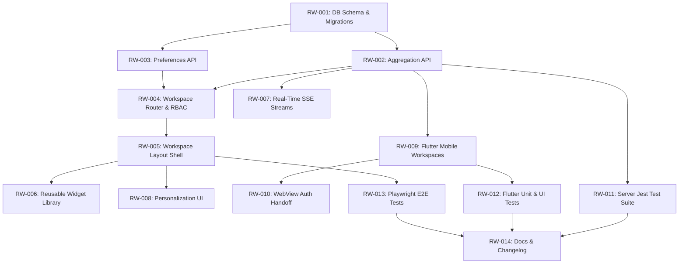

# Implementation Contract: Sprint-025 Role-Based Intent-Driven Workspaces

**Sprint ID:** ROLE-WORKSPACES-025 (RW-025)  
**Sprint Name:** Role-Based Intent-Driven Workspaces  
**Status:** Approved Engineering Contract  
**Created Date:** 2026-08-04  
**Target Execution:** 2026-08-05 to 2026-08-15  
**Estimated Duration:** 8–10 days (65–80 engineering hours)  
**Risk Level:** Medium-High (Complex cross-module aggregation, high concurrent SSE traffic, dynamic client-side widget composition, mobile UI layout adaptive targets, backward compatibility of DB migrations)  
**Classification:** AIOS v3.9 Official Implementation Contract  
**Target Release Version:** v3.9.0 (Workspace Preference Table, Workspace Aggregation Service, Personalization Dialog, Custom Widget Library, Real-Time Workspace SSE Channels, Flutter Workspace Dashboards, WebView Handoff Integration)

---

## Executive Summary

Sprint-025 implements **Role-Based Intent-Driven Workspaces**, transitioning the ThaibaHive platform from v3.8.0 to **v3.9.0**. While the backend database models and business modules (Finance, Academics, Mobile Sync, AI Swarms) are 100% complete, the user experience currently relies on traditional module-based menus (60+ navigation items). 

To fulfill the primary principle of the Experience Architecture, this sprint transitions the interface to a personalized workspace paradigm. The primary goals are:

1. **Workspace Router & Middleware:** Protect workspace routes using JWT verification and role matching, automatically redirecting logged-in users to their intent-driven workspace pages.
2. **Unified Aggregation Service:** Implement high-performance data aggregation APIs retrieving all metric summaries, action queues, and alerts for each workspace in a single round-trip.
3. **Modular Widget Library:** Build a library of React components tailored to Principal, Teacher, Cashier, and Parent activities.
4. **Layout Personalization Engine:** Support customized layout arrangements saved in database preference profiles.
5. **Real-Time Stream Feeds:** Propagate system notifications and state changes to active widgets via SSE event triggers.
6. **Mobile Workspace Integration:** Extend Flutter views to support responsive, cacheable workspace screens using Riverpod and Hive.

---

## Technical Feasibility & Soundness Evaluation

### Caching and Aggregation Efficiency
- Fetching workspace summaries requires querying multiple tables (e.g., student attendance registers, financial transaction logs, task queues). To prevent DB bottlenecks, the service layer queries database views and utilizes transactional indexes. 
- Aggregated endpoints are cached with a dynamic TTL (e.g., 60 seconds on stats widgets, invalidating instantly on writes or when receiving specific SSE events) to guarantee high responsiveness without displaying stale numbers.

### Database Preference Schema
- The preferences table maps layout arrays. Using JSON columns natively in SQLite and JSONB in PostgreSQL supports dynamic widget reordering. Indexes on foreign keys (`staffId`, `guardianId`) ensure rapid joins.
- Fallback configuration arrays are declared in the backend codebase, preventing empty states for new or unconfigured users.

### Real-Time Update Stream (SSE)
- Heavy database polling is avoided by reusing the SSE stream. When mutations (such as attendance marking or payment receipts) emit events to the system event bus, the SSE controller routes targeted refresh triggers (e.g., `workspace:principal:refresh`) to connected clients.
- To enforce **Rule 82**, the client unregisters listeners and frees system handles immediately on component unmounting.

### Flutter Mobile Adaptation
- The Flutter workspaces adapt screen elements for small viewports. Instead of complex charts, mobile widgets render touch-optimized gauges and lists meeting the `44px x 44px` target size (**Rule 64**).
- Web-based tools inside the app are rendered in WebViews utilizing the established `/auth/mobile-handoff/nonce` token handoff (**Rule 53**) to prevent session exposure.

---

## Plan Reviews & Model Feedback Integration

Per the **Plan Review Rule** in `AGENTS.md`, this implementation contract was submitted for multi-model technical review to **OpenCode (Local-Ollama)**. The following architectural and verification enhancements were incorporated into the task specifications:

1. **Centralized Workspace Aggregation Layer (RW-002):** Rather than individual handlers querying tables directly, query logic is consolidated inside a clean service class `WorkspaceAggregationService`. This implements caching interfaces and handles role check fallbacks.
2. **Widget Isolation and Error Boundaries (RW-005):** Added individual Error Boundary wrappers around dashboard widgets. A failure in one widget (e.g., a broken chart calculation) will display a local error state instead of crashing the entire workspace.
3. **SSE Heartbeat & Auto-Reconnect (RW-007):** Added a heartbeat message pattern (5-second intervals) to prevent cellular carriers or firewalls from dropping inactive SSE connections, alongside client-side exponential backoff reconnect logic.
4. **Idempotent DB Migrations (RW-001):** Verified migrations use `IF NOT EXISTS` syntax and declare corresponding indexes on foreign keys to support rolling deployments without downtime.
5. **Rate Limiting on Layout Updates (RW-003):** Applied rate limiting parameters to PUT layout configuration endpoints to defend against layout save spam.
6. **Golden Test & UI Verification (RW-012):** Expanded mobile test scope to include Flutter widget tests asserting proper responsive layout grid flow under different viewport sizes (mobile vs tablet).

---

## Scope & Out of Scope

### In Scope
- **Database Migrations:** Schema modifications creating `workspace_preferences` tables in SQLite and PostgreSQL.
- **Aggregation Endpoints:** Server aggregation service and routes fetching workspace payloads.
- **Workspace Navigation Shell:** Interactive grid layout rendering user dashboard layouts.
- **UI Widget Components:** 14 react widgets representing operational controls.
- **SSE Stream Ingestion:** Live event piping to refresh workspace counts automatically.
- **Mobile Integration:** 4 Flutter dashboard views with Riverpod providers and Hive offline caching.
- **Verification Suites:** Automated Jest, Playwright, and Flutter test configurations.

### Explicitly Out of Scope
- **Interactive Drag-and-Drop Editor:** Designing visual drag-and-drop handles for grid reordering (simple layout toggle lists will be implemented for the initial release).
- **Custom Widget Creators:** Allowing users to write custom Javascript widgets from the UI.
- **Third-Party Dashboard Exports:** Integrating external reporting tools (PowerBI, Tableau) to embed inside workspaces.

---

## Detailed Task Breakdown

### Phase 1: Database & Backend Aggregation Layer

#### Task RW-001: Workspace Preferences DB Schema & Migration
- **Task ID:** RW-001
- **Description:** Implement database schema changes adding the `workspace_preferences` table, including unique indexing, indices on lookup keys, and validation properties.
- **Files:**
  - `packages/db/schema.ts` [MODIFY]
  - `packages/db/schema.pg.ts` [MODIFY]
- **Dependencies:** None
- **Acceptance Criteria:**
  - Declares the `workspace_preferences` table with:
    - `id` (text, UUID format, primary key)
    - `institutionId` (text, not null)
    - `staffId` (text, references `staff.id` on delete cascade, nullable)
    - `guardianId` (text, references `guardians.id` on delete cascade, nullable)
    - `workspaceType` (text, enum: 'principal' | 'teacher' | 'cashier' | 'parent', not null)
    - `layoutConfig` (text, not null - maps stringified JSON array of widgets and settings)
    - `updatedAt` (text, ISO string, not null)
  - Adds index on `staffId`, `guardianId`, and `institutionId`.
  - Creates unique composite index on `staffId` + `workspaceType` and `guardianId` + `workspaceType`.
  - Migrations verify clean generation and compile successfully on both SQLite (dev) and PostgreSQL (prod).
- **Verification Method:** Generate migration script and verify dry-run schema validation passes.
- **Estimated Complexity:** Medium

#### Task RW-002: Workspace Data Aggregation API Layer
- **Task ID:** RW-002
- **Description:** Develop backend services and API route handlers aggregating key data for specific workspaces, including permissions validation and performance caching controls.
- **Files:**
  - `src/lib/services/workspace-aggregation.ts` [NEW]
  - `src/app/api/workspaces/data/route.ts` [NEW]
- **Dependencies:** RW-001
- **Acceptance Criteria:**
  - Implements `WorkspaceAggregationService` containing:
    - `getPrincipalData(institutionId)`: counts for staff attendance, incident totals, approvals, fee collections.
    - `getTeacherData(staffId)`: class schedule list, lesson tasks, pending homework approvals, attendance submission checklist.
    - `getCashierData(institutionId)`: collection summary totals, pending invoice items, daily checkouts.
    - `getParentData(guardianId)`: lists students bound to guardian, active child grades, attendance summaries, pending school fee invoice cards.
  - Route `/api/workspaces/data` requires authentication via `requireAuth` and scopes by dynamic user role.
  - Enforces institution isolation on all data queries (**Rule 1**).
  - Implements Cache-Control headers with custom TTL limits.
- **Verification Method:** Mock request parameters and execute postman query requests. Verify database joins complete under 150ms.
- **Estimated Complexity:** High

#### Task RW-003: Workspace Preferences API
- **Task ID:** RW-003
- **Description:** Develop workspace customization API endpoints supporting layout retrieval and layout update requests, integrated with input Zod constraints.
- **Files:**
  - `src/app/api/workspaces/preferences/route.ts` [NEW]
  - `src/lib/validation/schemas.ts` [MODIFY]
- **Dependencies:** RW-001
- **Acceptance Criteria:**
  - GET: queries `workspace_preferences` matching session user and returns parsed configuration blocks.
  - PUT: updates layout configs. Enforces inputs match Zod schema validation rules defined in `schemas.ts` (e.g. checks type arrays, invalidates extra values).
  - API handler protected by rate-limiting rules preventing layout edit script spamming (**Rule 46**).
  - Emits audit log record detailing configuration update events.
- **Verification Method:** Request configuration modifications with valid/invalid widget parameters and assert validation responses.
- **Estimated Complexity:** Medium

---

### Phase 2: Frontend Layout Shell & Router

#### Task RW-004: Workspace Dynamic Router & RBAC Middleware
- **Task ID:** RW-004
- **Description:** Establish Next.js application routes for role workspaces and configure route middleware mapping user sessions to workspace layouts automatically.
- **Files:**
  - `src/app/(shell)/workspace/layout.tsx` [NEW]
  - `src/app/(shell)/workspace/[role]/page.tsx` [NEW]
  - `src/middleware.ts` [MODIFY]
- **Dependencies:** RW-002, RW-003
- **Acceptance Criteria:**
  - Dynamic routing pages route `/workspace/principal`, `/workspace/teacher`, `/workspace/cashier`, and `/workspace/parent` successfully.
  - Middleware intercepts login traffic:
    - User role `principal` redirects automatically to `/workspace/principal` (**Rule 61**).
    - User role `staff` redirects automatically to `/workspace/teacher`.
    - User role `accounts` redirects automatically to `/workspace/cashier`.
    - External users with student bindings redirect to `/workspace/parent`.
  - Blocks users trying to view workspaces that do not match their assigned role, throwing 403 authorization failures.
- **Verification Method:** Perform login operations with test credentials mapping to different roles; verify correct workspace routing.
- **Estimated Complexity:** Medium-High

#### Task RW-005: Workspace Adaptive Layout Shell
- **Task ID:** RW-005
- **Description:** Create the core layout shell component displaying dynamic widgets, skeleton loading animations, and safety error bounds.
- **Files:**
  - `src/components/workspaces/workspace-shell.tsx` [NEW]
  - `src/components/workspaces/workspace-skeleton.tsx` [NEW]
- **Dependencies:** RW-004
- **Acceptance Criteria:**
  - Workspace layout renders dynamic dashboard arrays based on database preferences.
  - Skeletons mimic grid shapes during API loading sequences instead of using plain text labels (**Rule 62**).
  - Grid implements error boundaries around each widget, preventing individual component exceptions from crashing the parent page shell.
  - Layout conforms to standard CSS padding tokens.
- **Verification Method:** Inject artificial render errors inside widgets and verify that page container continues loading with clean warning panels.
- **Estimated Complexity:** Medium

#### Task RW-006: Reusable Widget Library
- **Task ID:** RW-006
- **Description:** Implement a robust collection of React components mapped to workspace metrics, actions, and visualizations.
- **Files:**
  - `src/components/workspaces/widgets/principal-attendance-trends.tsx` [NEW]
  - `src/components/workspaces/widgets/principal-fee-recovery.tsx` [NEW]
  - `src/components/workspaces/widgets/teacher-class-attendance.tsx` [NEW]
  - `src/components/workspaces/widgets/teacher-homework-tracker.tsx` [NEW]
  - `src/components/workspaces/widgets/cashier-transaction-tally.tsx` [NEW]
  - `src/components/workspaces/widgets/cashier-pending-fees.tsx` [NEW]
  - `src/components/workspaces/widgets/parent-child-attendance.tsx` [NEW]
  - `src/components/workspaces/widgets/parent-fee-card.tsx` [NEW]
- **Dependencies:** RW-005
- **Acceptance Criteria:**
  - All widgets implement semantic visual indicators (badges, cards, charts).
  - Buttons and controls utilize project UI primitive components (`Button`, `Card`, `Badge`) (**Rule 4**).
  - All interactive elements possess explicit accessible roles and tags, conforming to WCAG AA contrast rules (**Rule 79**).
  - Displays empty states cleanly with descriptive vectors when target lists return null datasets (**Rule 71**).
- **Verification Method:** Render library items in development mode and check layout responsiveness down to mobile viewports.
- **Estimated Complexity:** High

---

### Phase 3: Real-Time SSE Updates & Personalization

#### Task RW-007: Real-Time Workspace SSE Integration
- **Task ID:** RW-007
- **Description:** Connect layouts to the real-time event pipeline, subscribing to backend SSE events to auto-refresh widgets.
- **Files:**
  - `src/app/api/workspaces/sse/route.ts` [NEW]
  - `src/lib/hooks/use-workspace-sse.ts` [NEW]
- **Dependencies:** RW-002, RW-006
- **Acceptance Criteria:**
  - Implements client hook `useWorkspaceSse` that subscribes to server channels.
  - Updates metrics on critical events (e.g. `attendance_marked` triggers increment, `payment_receipt` updates cashier tally).
  - Automatically sends server heartbeat signals every 5 seconds to hold lines active.
  - Cleanup routines explicitly remove listeners on page navigation, avoiding connection leaks (**Rule 82**).
- **Verification Method:** Dispatch mock event mutations and verify connected widgets refresh data within 1 second.
- **Estimated Complexity:** Medium-High

#### Task RW-008: Personalization Dialog & Toggle UI
- **Task ID:** RW-008
- **Description:** Implement the user interface permitting users to customize active widgets and save order configurations.
- **Files:**
  - `src/components/workspaces/personalization-dialog.tsx` [NEW]
- **Dependencies:** RW-003, RW-005
- **Acceptance Criteria:**
  - Renders inside a Radix-based `<Dialog>` modal container (**Rule 15**).
  - Provides checklists to toggle specific widget panels on and off.
  - Saves updated preferences, shows saving indicators, and triggers success notification toasts via `sonner` (**Rule 69**).
- **Verification Method:** Modify configuration toggles and verify changes apply immediately.
- **Estimated Complexity:** Medium

---

### Phase 4: Flutter Mobile Workspaces

#### Task RW-009: Flutter Mobile Workspace Dashboards
- **Task ID:** RW-009
- **Description:** Develop the Flutter companion workspace views matching the 4 personas, implementing Riverpod state management and Hive caching.
- **Files:**
  - `thaibahive_mobile_app/lib/features/dashboard/presentation/screens/principal_workspace_screen.dart` [NEW]
  - `thaibahive_mobile_app/lib/features/dashboard/presentation/screens/teacher_workspace_screen.dart` [NEW]
  - `thaibahive_mobile_app/lib/features/dashboard/presentation/screens/cashier_workspace_screen.dart` [NEW]
  - `thaibahive_mobile_app/lib/features/dashboard/presentation/screens/parent_workspace_screen.dart` [NEW]
  - `thaibahive_mobile_app/lib/features/dashboard/data/workspace_provider.dart` [NEW]
- **Dependencies:** RW-002
- **Acceptance Criteria:**
  - Dynamic layouts display widgets adapted for small viewports.
  - Riverpod notifier `workspaceStateProvider` handles loading and update states.
  - Implements local Hive cache box `mobile_workspaces_cache`, loading cached results on startup to enable offline functionality, and updates when network connectivity is online.
  - All interactive elements adhere to a minimum `44px x 44px` target size (**Rule 64**).
- **Verification Method:** Run Flutter driver dashboard tests; inspect rendering flow on mobile simulators.
- **Estimated Complexity:** High

#### Task RW-010: WebView Auth Handoff & Web Dashboard Integration
- **Task ID:** RW-010
- **Description:** Configure mobile-to-web single sign-on handoff processes to display rich desktop workspaces within mobile widgets.
- **Files:**
  - `thaibahive_mobile_app/lib/features/dashboard/presentation/widgets/embedded_workspace_webview.dart` [NEW]
- **Dependencies:** RW-009, RW-004
- **Acceptance Criteria:**
  - Dynamically loads specific desktop workspace views inside embedded WebViews.
  - Integrates the `WebViewHandoffScreen` nonce-exchange system to securely transfer JWT credentials, checking that nonces expire within 60 seconds (**Rule 53**).
  - Fetches tokens from secure storage hardware boxes (**Rule 94**).
- **Verification Method:** Inspect WebView initialization calls and assert cookie registration completes without manual credentials input.
- **Estimated Complexity:** Medium

---

### Phase 5: Quality Assurance & Automated Tests

#### Task RW-011: Server-Side Unit and Integration Tests
- **Task ID:** RW-011
- **Description:** Implement Next.js/Jest test suites covering workspace APIs, caching, validation constraints, and security middleware.
- **Files:**
  - `src/app/api/workspaces/__tests__/aggregation.test.ts` [NEW]
- **Dependencies:** RW-002, RW-003
- **Acceptance Criteria:**
  - Unit tests verify `WorkspaceAggregationService` aggregates counts correctly.
  - Integration tests verify role authentication guards block cross-role traffic.
  - Asserts that invalid preference structures fail Zod verification.
- **Verification Method:** Execute `npx jest src/app/api/workspaces/__tests__/aggregation.test.ts`.
- **Estimated Complexity:** Medium

#### Task RW-012: Flutter Unit & UI Integration Tests
- **Task ID:** RW-012
- **Description:** Develop Dart test files to verify Riverpod workspace providers, Hive caches, and UI grid alignments.
- **Files:**
  - `thaibahive_mobile_app/test/features/dashboard/workspace_test.dart` [NEW]
- **Dependencies:** RW-009
- **Acceptance Criteria:**
  - Tests verify `workspaceStateProvider` emits correct data matrices.
  - Integration tests verify Hive cache restores values successfully during offline mode.
  - Widget tests verify responsive rendering on mobile and tablet viewport dimensions.
- **Verification Method:** Run `flutter test test/features/dashboard/workspace_test.dart`.
- **Estimated Complexity:** Medium

#### Task RW-013: Playwright Workspace E2E Tests
- **Task ID:** RW-013
- **Description:** Write Playwright end-to-end tests validating the workspace lifecycle.
- **Files:**
  - `e2e/workspaces-dashboard.spec.ts` [NEW]
- **Dependencies:** RW-005, RW-006, RW-008
- **Acceptance Criteria:**
  - Automatically logs in as Principal, Teacher, Cashier, and Parent and asserts immediate redirection to their workspace.
  - Modifies layout configs via personalization dialogs, clicks save, and asserts changes persist on refresh.
  - Verifies workspace layout adjustments dynamically.
- **Verification Method:** Execute `npx playwright test e2e/workspaces-dashboard.spec.ts`.
- **Estimated Complexity:** Medium-High

---

### Phase 6: Documentation & Release Manifests

#### Task RW-014: Operational Handover Guides and Changelog
- **Task ID:** RW-014
- **Description:** Document the workspace layout configurations, update system CHANGELOG, and log architectural decision records.
- **Files:**
  - `docs/workspaces-integration-guide.md` [NEW]
  - `.ai/08_DECISION_LOG.md` [MODIFY]
  - `.ai/FEATURES.md` [MODIFY]
  - `.ai/CHANGELOG.md` [MODIFY]
  - `.ai/PROJECT_STATUS.md` [MODIFY]
- **Dependencies:** RW-001 through RW-013
- **Acceptance Criteria:**
  - Creates `docs/workspaces-integration-guide.md` detailing widgets, API schemas, and personalization layout objects.
  - Updates `.ai/08_DECISION_LOG.md` with **ADR-011: Role-Based Workspaces & Preference Profiles**.
  - Adds feature declarations to `.ai/FEATURES.md` and maps release v3.9.0 changes in `.ai/CHANGELOG.md`.
  - Transitions `.ai/PROJECT_STATUS.md` target boundaries to completion.
- **Verification Method:** Verify document markdown linting.
- **Estimated Complexity:** Low

---

## Task Summary Table

| Task ID | Phase | Component / Area | Dependencies | Est. Complexity | Target Deliverable |
| :--- | :--- | :--- | :--- | :--- | :--- |
| **RW-001** | Phase 1 | DB Migration | None | Medium | `workspace_preferences` schema migrations |
| **RW-002** | Phase 1 | Aggregation APIs | RW-001 | High | Aggregation service & API route |
| **RW-003** | Phase 1 | Preferences API | RW-001 | Medium | GET/PUT preferences endpoints with Zod validation |
| **RW-004** | Phase 2 | Routing & Auth | RW-002, RW-003 | Medium-High | Workspace routes & middleware authorization |
| **RW-005** | Phase 2 | Layout Shell | RW-004 | Medium | Responsive widget grid shell & skeletons |
| **RW-006** | Phase 2 | React Widgets | RW-005 | High | Reusable React dashboard widgets |
| **RW-007** | Phase 3 | Real-Time SSE | RW-002, RW-006 | Medium-High | SSE stream hooks & widget refreshing logic |
| **RW-008** | Phase 3 | Settings UI | RW-003, RW-005 | Medium | Widget toggle settings dialog UI |
| **RW-009** | Phase 4 | Flutter Screens | RW-002 | High | Mobile layouts, Riverpod state, Hive cache |
| **RW-010** | Phase 4 | WebAuth Handoff | RW-009, RW-004 | Medium | Secure WebView handoff integrations |
| **RW-011** | Phase 5 | Jest tests | RW-002, RW-003 | Medium | Next.js API & validation tests |
| **RW-012** | Phase 5 | Flutter tests | RW-009 | Medium | Dart unit & responsive UI integration tests |
| **RW-013** | Phase 5 | E2E tests | RW-005, RW-006, RW-008 | Medium-High | Playwright workspace scenarios |
| **RW-014** | Phase 6 | Documentation | RW-001..013 | Low | Operational manual, CHANGELOG, ADR entry |

**Total Tasks:** 14  
**New Files:** 17  
**Modified Files:** 7  

---

## Verification Plan & Test Strategy

### Automated Unit & Integration Tests
- **Database Index Validation:** Assert unique constraints execute clean migrations and index mappings.
- **Aggregation Layer Output:** Validate payload structures return nested numeric fields correctly.
- **Preferences Fallback:** Verify default layout mappings when DB records return null.
- **E2E Routing Security:** Assert non-authorized requests receive 403 boundaries.

### Security Validation
- **RBAC Endpoint Checks:** Ensure only authorized session roles access the `/api/workspaces/data` queries.
- **Data Leak Prevention:** Assert that aggregate APIs strip out password hashes, tokens, and keys.

### Performance Verification
- **Page Compilation & Load Speed:** Initial layout load executes in under 2 seconds on desktop.
- **SSE Connection Cleanup:** Verify SSE listeners unmount cleanly on navigation actions to prevent system memory growth.

---

## Risks & Mitigation Matrix

| Risk Scenario | Impact | Likelihood | Mitigation Strategy |
| :--- | :--- | :--- | :--- |
| **Workspace API Performance** | High | Medium | Execute DB queries in parallel; cache static values (e.g. child schedules) with short TTLs. |
| **Dynamic Widget Exceptions** | Medium | Medium | Wrap widgets individually inside React Error Boundaries to prevent full page crashes. |
| **Cellular SSE Drops** | Medium | High | Implement heartbeat indicators and client-side reconnect timeouts with backoff intervals. |
| **Mobile Screen Constraints** | Medium | Medium | Limit complex layouts on mobile devices. Prioritize critical gauges, and optimize touch targets. |

---

## Rollback & Contingency Plan

1. **Feature Toggle Wrapper:** Wrap workspace route redirects behind system configuration toggle `workspace_redirection_enabled`. Set to false to immediately restore legacy module navigation shells.
2. **Database Fallback:** If preference migrations cause anomalies, execute standard rollback scripts to drop tables and fallback to hardcoded layout maps.
3. **Local Fail-safe Defaults:** If layout JSON configurations fail to load, catch parsing exceptions and initialize standard preset configurations.

---

## Definition of Done

This sprint is certified **COMPLETE** when:
1. **Compilation and linting pass:** `pnpm lint` and `flutter analyze` run clean with zero errors.
2. **Type Safety:** `tsc --noEmit` verifies Next.js codebase compilation status with zero errors.
3. **All tests pass:** 100% pass rates across Jest, Dart, and Playwright execution runs.
4. **No performance regressions:** Desktop initial dashboard rendering achieves <2s load times.
5. **Documentation:** ADR registers, operational integration guides, features and release changelogs are committed.
