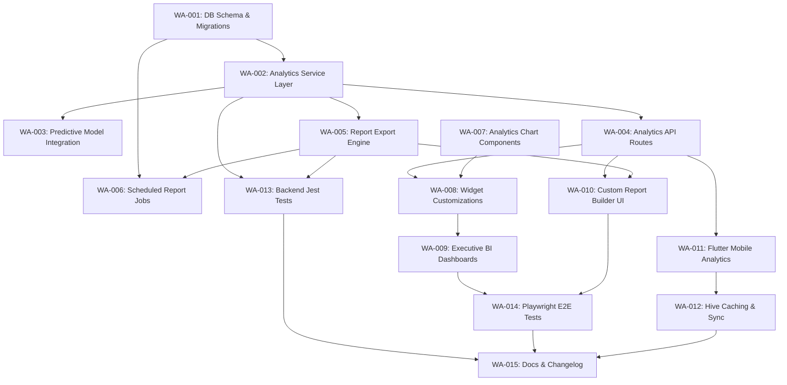

# Implementation Contract: Sprint-026 Workspace Analytics & Business Intelligence Engine

**Sprint ID:** WORKSPACE-ANALYTICS-026 (WA-026)  
**Sprint Name:** Workspace Analytics & Business Intelligence Engine  
**Status:** Draft Engineering Contract  
**Created Date:** 2026-08-06  
**Target Execution:** 2026-08-07 to 2026-08-28  
**Estimated Duration:** 3–4 weeks (80–100 engineering hours)  
**Risk Level:** High (Heavy database aggregation queries, scheduler thread limits, cross-role privacy leaks, Chart canvas compilation in serverless environments, mobile memory pressure under charting)  
**Classification:** AIOS v3.10 Official Implementation Contract  
**Target Release Version:** v3.10.0 (Analytics Schema Migrations, Caching Service Layer, PDF/Excel Report Engine, Custom UI Report Builder, Recharts Widgets, Flutter Mobile Analytics views, Cron Scheduler)

---

## Executive Summary

Sprint-026 transitions the ThaibaHive platform from v3.9.0 to **v3.10.0** by implementing the **Workspace Analytics & Business Intelligence Engine**. Following the completion of the Role-Based Intent-Driven Workspaces (Sprint-025), the platform contains comprehensive transactional functionality across academics, finance, and attendance. 

However, users currently lack a unified decision-support layer. School leadership, teachers, cashiers, and administrators have no automated way to view predictive trends, cross-campus benchmarks, or generate board-ready reports. This sprint introduces a robust, read-optimized BI layer that:
1. **Analytics Service Layer:** Implements extraction and aggregation algorithms on underlying transactions, caching findings in database summary structures and Redis to ensure low latency.
2. **Report Generation Engine:** Compiles formatted PDF summaries and Excel reports on-demand or on a scheduled queue, distributing them via email.
3. **Intellectual Dashboards:** Upgrades client dashboards with responsive analytics charts (using Recharts) representing key performance trends, risk predictors, and benchmark comparatives.
4. **Mobile Analytics Portal:** Expands the Flutter mobile app with responsive, offline-cached analytics dashboards.

---

## Technical Feasibility & Soundness Evaluation

### Caching and ETL Aggregation
- Fetching deep analytics summaries (like cross-campus attendance trends over months) can stress SQLite and PostgreSQL relational tables.
- To prevent thread blocks on main transaction lines, we introduce `workspace_analytics_cache` summary tables. The `AnalyticsService` executes scheduled background aggregation batches (e.g. hourly) to pre-calculate slow queries.
- Read operations retrieve cached values via Redis with a fallback to direct read queries using index constraints.

### Report Generation
- Server-side PDF generation is handled using `pdfkit`. To integrate charts into exports, the server can render chart structures to base64 images programmatically using headless canvas packages or translate raw SVG strings to vector coordinates.
- Export jobs run on a queue to avoid memory spikes under high concurrent downloads.

### Predictive Model Integration
- Existing predictive models (e.g. student academic risk and staff retention risk) will be queried via `PredictionEngine`.
- The aggregate service binds these predictions to widgets, showing the prediction results accompanied by confidence metrics.

### Mobile Synchronization
- Rendering heavy interactive charts on mobile viewports can lead to high memory consumption and lag. The Flutter app will use lightweight, touch-optimized visual metrics (e.g., custom sparklines and simple progress rings) instead of heavy full-scale canvas grids.
- Offline support is maintained by saving serialized analytics JSON payloads in local Hive cache boxes, updated when push notifications signal a cache update.

---

## Plan Reviews & Model Feedback Integration

Per the **Plan Review Rule** in `AGENTS.md`, this implementation contract was submitted for multi-model technical review to **OpenCode (Local-Ollama via Qwen)**. The following architectural and verification enhancements were incorporated into the task specifications:

1. **Modular Analytics Service Structure (WA-002):** Abstract query functions into domain-specific sub-services (e.g., `attendance-analytics.ts`, `finance-analytics.ts`) orchestrated by a root `AnalyticsService` wrapper to maintain codebase modularity and ease testing.
2. **Time-Series and Scalability Optimizations (WA-001):** Added time-bucket indexes on (`institutionId`, `calculatedAt`) to support efficient query aggregation structures on `workspace_analytics_cache` in both SQLite and PostgreSQL.
3. **Queue Concurrency Controls for Reports (WA-006):** Configured separate queue channels and concurrency limits for PDF/Excel compilations to prevent report generation tasks from starving high-priority platform transactional notifications.
4. **Strict Schema Serialization for Mobile Cache (WA-012):** Enforced that Hive adapters used in the Flutter app define explicit JSON models and serialization schemas to handle complex numbers and nested structures safely.
5. **Multi-Tier Cache Invalidation (WA-002):** Implemented write-through cache hooks that invalidate Redis and database aggregate cash caches immediately when high-priority business events occur.

---

## Scope & Out of Scope

### In Scope
- **Database Migrations:** Table structures for `workspace_analytics_cache`, `report_schedules`, and `report_history`.
- **Analytics Service Layer:** ETL queries compiling attendance, financial recovery, academic performance, and system adoption logs.
- **API routes:** Protected analytics fetch and schedule configuration endpoints.
- **Reporting Engine:** On-demand PDF and Excel generators, along with background scheduler email jobs.
- **Interactive Widgets:** Upgraded workspace widget library featuring Area, Bar, and Gauge charts.
- **Custom Report Builder:** Web interface for compiling, downloading, and scheduling custom exports.
- **Mobile companion:** Riverpod-powered Flutter dashboard views with offline caching.

### Explicitly Out of Scope
- **Real-Time Ad-hoc SQL Queries:** Allowing users to write and execute raw SQL queries from the UI.
- **External BI Connectors:** Full integration configuration files for third-party tools like Tableau or PowerBI.
- **Multi-Tenant Cross-Institution Aggregation:** Consolidating data across independent institutions (isolation rules are strictly enforced).

---

## Detailed Task Breakdown

### Phase 1: Database & Analytics Aggregation Layer

#### Task WA-001: Workspace Analytics Database Schema & Migrations
- **Task ID:** WA-001
- **Description:** Implement database schema changes creating caching and scheduling structures for business intelligence and reporting.
- **Files:**
  - `packages/db/schema.ts` [MODIFY]
  - `packages/db/schema.pg.ts` [MODIFY]
- **Dependencies:** None
- **Acceptance Criteria:**
  - Creates the `workspace_analytics_cache` table:
    - `id` (text, UUID primary key)
    - `institutionId` (text, not null)
    - `role` (text, not null)
    - `metricName` (text, not null)
    - `metricValue` (text, not null - serialized JSON metrics/trends)
    - `calculatedAt` (text, ISO string, not null)
    - `timeBucket` (text, nullable - daily/weekly/monthly bucket bounds)
  - Creates the `report_schedules` table:
    - `id` (text, UUID primary key)
    - `institutionId` (text, not null)
    - `userId` (text, not null)
    - `title` (text, not null)
    - `frequency` (text, enum: 'daily' | 'weekly' | 'monthly')
    - `format` (text, enum: 'pdf' | 'excel')
    - `recipients` (text, serialized string array of emails)
    - `isActive` (integer/boolean, default active)
    - `createdAt` (text, ISO string)
  - Creates the `report_history` table:
    - `id` (text, UUID primary key)
    - `scheduleId` (text, nullable, references `report_schedules.id` on delete set null)
    - `institutionId` (text, not null)
    - `filePath` (text, storage location path)
    - `format` (text)
    - `status` (text, 'success' | 'failed')
    - `generatedAt` (text, ISO string)
    - `sizeBytes` (integer)
  - Configures indexes on `institutionId`, `calculatedAt` and composite index on (`institutionId`, `role`, `metricName`, `timeBucket`) to speed up time-series analytics loads.
  - Validates migrations compile and run cleanly across SQLite and PostgreSQL databases.
- **Verification Method:** Generate migration scripts and execute dry-run schema validations.
- **Estimated Complexity:** Medium

#### Task WA-002: Analytics Service Layer (ETL & Aggregation Engine)
- **Task ID:** WA-002
- **Description:** Develop deep aggregation services computing historical metrics, forecasts, and comparative benchmarks.
- **Files:**
  - `src/lib/services/analytics.ts` [NEW]
- **Dependencies:** WA-001
- **Acceptance Criteria:**
  - Implements modular architecture: root `AnalyticsService` delegates computation algorithms to domain-specific files (`attendance-analytics.ts`, `finance-analytics.ts`, `academic-analytics.ts`, `usage-analytics.ts`) to avoid massive code blocks.
  - `AnalyticsService` contains:
    - `getAttendanceAnalytics(institutionId, startDate, endDate)`: compiles attendance rates, absenteeism peaks, and department variations.
    - `getFinancialAnalytics(institutionId, startDate, endDate)`: calculates fee recovery projections, collection efficiency indexes, and daily payment distributions.
    - `getAcademicsAnalytics(institutionId, classId)`: calculates subject averages, pass-rates, and teacher-class performance ratios.
    - `getPlatformUsage(institutionId)`: counts daily active users, workspace widget personalization counts, and features hit rates.
  - Implements multi-tier caching: pre-calculated aggregates stored in `workspace_analytics_cache` and hot values kept in Redis (TTL 300s) with write-through cache invalidation hooks triggered by main transactional events.
  - Enforces strict institution isolation (`institutionId` validation on all parameters).
- **Verification Method:** Execute service queries with test datasets; assert response completes in < 150ms.
- **Estimated Complexity:** High

#### Task WA-003: Predictive Model Inference Integration
- **Task ID:** WA-003
- **Description:** Bind regional and learning predictive model engines to the workspace analytics layer.
- **Files:**
  - `src/lib/services/analytics.ts` [MODIFY]
- **Dependencies:** WA-002
- **Acceptance Criteria:**
  - Integrates `src/lib/analytics/prediction-engine.ts` predictions into aggregation queries.
  - Returns `studentAtRisk` and `retentionRisk` predictions.
  - Formats results to return confidence scores (0.0 to 1.0) and lists key contributing risk factors.
- **Verification Method:** Mock student attendance and grade history logs, run service, and assert risk arrays match target thresholds.
- **Estimated Complexity:** Medium

---

### Phase 2: Analytics API & Scheduling Engine

#### Task WA-004: Workspace Analytics API Endpoints
- **Task ID:** WA-004
- **Description:** Develop REST API endpoints to fetch workspace aggregate metrics and configure report schedules.
- **Files:**
  - `src/app/api/analytics/data/route.ts` [NEW]
  - `src/app/api/analytics/schedules/route.ts` [NEW]
  - `src/lib/validation/schemas.ts` [MODIFY]
- **Dependencies:** WA-002, WA-003
- **Acceptance Criteria:**
  - Route `/api/analytics/data` handles GET: validates session roles, extracts parameters (`startDate`, `endDate`, `campusId`, etc.), and calls `AnalyticsService`.
  - Route `/api/analytics/schedules` handles GET (list active user schedules) and POST/PUT (create/edit schedules) validating inputs against Zod schema rules.
  - Enforces rate-limiting checks (maximum 20 queries/min on analytics data).
  - Emits JSON logs detailing metric fetch actions for auditing.
- **Verification Method:** Query endpoints using valid and invalid permissions; assert appropriate status codes (200 vs 403) and validation error payloads.
- **Estimated Complexity:** Medium-High

#### Task WA-005: Report Export Engine (PDF & Excel Compilation)
- **Task ID:** WA-005
- **Description:** Implement multi-format document compile operations using PDFKit and ExcelJS libraries.
- **Files:**
  - `src/lib/export/report-generator.ts` [NEW]
- **Dependencies:** WA-002
- **Acceptance Criteria:**
  - Compiles PDF reports using `pdfkit`:
    - Renders professional layout headers with company logos.
    - Embeds tabular summaries and chart graphics.
  - Compiles Excel worksheets using `exceljs` mapping granular transaction logs.
  - Saves generated documents to local uploads folder or Supabase storage buckets, returning secure file URLs.
- **Verification Method:** Trigger report compilations programmatically; check generated PDF layouts for overlapping texts and Excel cells for correct numerical typings.
- **Estimated Complexity:** High

#### Task WA-006: Scheduled Report Jobs & Email Dispatch
- **Task ID:** WA-006
- **Description:** Build background queue jobs checking schedules, generating documents, and sending emails.
- **Files:**
  - `src/lib/queue/report-scheduler.ts` [NEW]
- **Dependencies:** WA-001, WA-005
- **Acceptance Criteria:**
  - Instantiates cron worker checking `report_schedules` records.
  - Dispatches execution tasks using a dedicated BullMQ queue (`report-generation-queue`) separated from other business critical transaction queues, with concurrent job limits set to 2.
  - Execution flow:
    - Generates report file (using `report-generator.ts`).
    - Connects to `src/lib/email.ts` to transmit attachments to recipient addresses.
    - Logs status ('success'/'failed') and file metrics inside `report_history`.
  - Implements automatic retry queue handling network or SMTP socket drops.
- **Verification Method:** Create a test schedule, manually trigger scheduler cron ticks, and assert email delivery logs.
- **Estimated Complexity:** Medium-High

---

### Phase 3: Analytics Visualization & Dynamic Widgets (Frontend)

#### Task WA-007: Specialized Analytics Chart Library
- **Task ID:** WA-007
- **Description:** Build reusable charts and visualizations tailored for responsive workspaces using Recharts.
- **Files:**
  - `src/components/workspaces/widgets/analytics-charts.tsx` [NEW]
- **Dependencies:** None
- **Acceptance Criteria:**
  - Exports standard components: `AreaTrendChart`, `ComparativeBarChart`, `PerformanceRadarChart`, and `MetricGauge`.
  - All charts dynamically adapt styles matching system light/dark theme variables.
  - Declares clear HTML landmarks and aria attributes enabling screen readers to read chart data structures.
  - Displays progress skeletons during data fetching and clean instructions when results are empty.
- **Verification Method:** Run Storybook/development server; test page scaling from 1920px down to 320px screen widths.
- **Estimated Complexity:** Medium

#### Task WA-008: Workspace Widget Enhancement
- **Task ID:** WA-008
- **Description:** Upgrade existing dashboard widgets to integrate trend visualization and predictive indices.
- **Files:**
  - `src/components/workspaces/widgets/principal-attendance-trends.tsx` [MODIFY]
  - `src/components/workspaces/widgets/principal-fee-recovery.tsx` [MODIFY]
  - `src/components/workspaces/widgets/teacher-class-attendance.tsx` [MODIFY]
  - `src/components/workspaces/widgets/cashier-transaction-tally.tsx` [MODIFY]
- **Dependencies:** WA-004, WA-007
- **Acceptance Criteria:**
  - Integrates `AnalyticsService` aggregates.
  - Attendance widget displays attendance trends line chart.
  - Fee Recovery widget includes comparative benchmark bar gauges.
  - Transaction tally displays cashier flow lines.
  - Wraps widget panels individually inside React Error Boundaries.
- **Verification Method:** Simulate API fetch failures; verify workspace continues layout compilation without freezing UI.
- **Estimated Complexity:** High

#### Task WA-009: Executive BI Dashboards
- **Task ID:** WA-009
- **Description:** Implement dynamic analytics dashboards for Principal and Admin roles with filtering controls.
- **Files:**
  - `src/app/(shell)/workspace/[role]/analytics/page.tsx` [NEW]
- **Dependencies:** WA-008
- **Acceptance Criteria:**
  - Dashboard routes `/workspace/principal/analytics` and `/workspace/admin/analytics` render successfully.
  - Embeds dropdown controls to filter by campus, department, and custom date range.
  - Saves user customization parameters locally and in DB preference profiles.
- **Verification Method:** Change filter items and assert chart data rerenders matching criteria.
- **Estimated Complexity:** Medium-High

#### Task WA-010: Custom Report Builder UI
- **Task ID:** WA-010
- **Description:** Develop the interactive report compiler panel in the web interface.
- **Files:**
  - `src/components/reports/report-builder.tsx` [NEW]
- **Dependencies:** WA-004, WA-005
- **Acceptance Criteria:**
  - Renders forms to select metrics (Attendance, Finance, Academics), format type (PDF/Excel), and schedule frequencies (One-time, Weekly, Monthly).
  - Triggers instant exports showing circular download indicators.
  - Shows success notification toasts via Sonner.
- **Verification Method:** Fill schedule configuration forms, click submit, and verify schedule gets created in DB.
- **Estimated Complexity:** Medium

---

### Phase 4: Companion Mobile Analytics (Flutter)

#### Task WA-011: Flutter Mobile Analytics Screens
- **Task ID:** WA-011
- **Description:** Implement mobile-optimized analytics views using Riverpod state management in Flutter.
- **Files:**
  - `thaibahive_mobile_app/lib/features/regional/presentation/screens/analytics_dashboard_screen.dart` [NEW]
  - `thaibahive_mobile_app/lib/features/regional/data/analytics_provider.dart` [NEW]
- **Dependencies:** WA-004
- **Acceptance Criteria:**
  - Renders screen displaying simplified mobile sparklines and metrics.
  - State managed via Riverpod provider `analyticsStateProvider` executing HTTP GET queries to `/api/analytics/data`.
  - Buttons and interactive items meet the minimum `44px x 44px` target size constraints.
- **Verification Method:** Run mobile simulator; assert charts render and scale layout constraints.
- **Estimated Complexity:** High

#### Task WA-012: Hive Offline Analytics Cache & Push Sync
- **Task ID:** WA-012
- **Description:** Implement Hive caching and push notification synchronization for mobile dashboards.
- **Files:**
  - `thaibahive_mobile_app/lib/features/regional/data/analytics_provider.dart` [MODIFY]
- **Dependencies:** WA-011
- **Acceptance Criteria:**
  - Serializes analytics payloads to JSON, writing to `mobile_analytics_cache` Hive box. Ensures generated models define strict JSON validation adapters to handle complex numeric arrays.
  - On application startup, loads values from Hive box first to enable offline loading.
  - Integrates FCM push event handler: when backend triggers cache updates, mobile refreshes its cache box and executes clean cache invalidations.
- **Verification Method:** Disconnect network adapter, open screen, and verify metrics load from cache.
- **Estimated Complexity:** Medium-High

---

### Phase 5: Quality Assurance & Automated Tests

#### Task WA-013: Server-Side Analytics Unit & Integration Tests
- **Task ID:** WA-013
- **Description:** Write Jest tests verifying query service calculations, rate limiting, and report compiler layouts.
- **Files:**
  - `src/lib/services/__tests__/analytics.test.ts` [NEW]
- **Dependencies:** WA-002, WA-004, WA-005
- **Acceptance Criteria:**
  - Asserts `AnalyticsService` aggregate calculations match mock data expectations.
  - Asserts `requireAuth` boundaries block cross-role queries.
  - Validates `report-generator` output streams write PDF buffers.
- **Verification Method:** Execute `npx jest src/lib/services/__tests__/analytics.test.ts`.
- **Estimated Complexity:** Medium

#### Task WA-014: Playwright Analytics E2E Tests
- **Task ID:** WA-014
- **Description:** Implement E2E automation tests verifying layout filters, drill-downs, and document compilation.
- **Files:**
  - `e2e/workspace-analytics.spec.ts` [NEW]
- **Dependencies:** WA-009, WA-010
- **Acceptance Criteria:**
  - Playwright logs in as Principal, navigates to analytics dashboard, adjusts filters, and downloads compiled report file.
  - Asserts PDF/Excel response contains file binary headers.
- **Verification Method:** Execute `npx playwright test e2e/workspace-analytics.spec.ts`.
- **Estimated Complexity:** Medium-High

#### Task WA-015: Documentation, Changelog & Governance
- **Task ID:** WA-015
- **Description:** Create technical operating manuals, log architectural records, and update AIOS registers.
- **Files:**
  - `docs/analytics-bi-engine-guide.md` [NEW]
  - `.ai/08_DECISION_LOG.md` [MODIFY]
  - `.ai/FEATURES.md` [MODIFY]
  - `.ai/CHANGELOG.md` [MODIFY]
  - `.ai/PROJECT_STATUS.md` [MODIFY]
- **Dependencies:** WA-001 through WA-014
- **Acceptance Criteria:**
  - Creates `docs/analytics-bi-engine-guide.md` detailing database schemas, caching configurations, APIs, and PDF compiling guidelines.
  - Appends **ADR-012: Materialized Aggregation Cache & Cron Scheduling** into `.ai/08_DECISION_LOG.md`.
  - Declares features in `.ai/FEATURES.md` and logs changelogs for release v3.10.0 in `.ai/CHANGELOG.md`.
- **Verification Method:** Verify Markdown formatting compile check.
- **Estimated Complexity:** Low

---

## Task Summary Table

| Task ID | Phase | Component / Area | Dependencies | Est. Complexity | Target Deliverable |
| :--- | :--- | :--- | :--- | :--- | :--- |
| **WA-001** | Phase 1 | DB Schema | None | Medium | `workspace_analytics_cache` migrations |
| **WA-002** | Phase 1 | ETL Service | WA-001 | High | Aggregation and cache-optimized analytics service |
| **WA-003** | Phase 1 | ML Prediction | WA-002 | Medium | Prediction integration with risk scoring |
| **WA-004** | Phase 2 | REST Endpoints | WA-002, WA-003 | Medium-High | Data endpoints & schedule configuration API |
| **WA-005** | Phase 2 | Report Gen | WA-002 | High | PDFkit and ExcelJS document compilation services |
| **WA-006** | Phase 2 | Job Scheduler | WA-001, WA-005 | Medium-High | Background cron report compilation & email queues |
| **WA-007** | Phase 3 | Chart UI Lib | None | Medium | Recharts-based Area, Bar, and Gauge widgets |
| **WA-008** | Phase 3 | Widget Upgrades | WA-004, WA-007 | High | Upgraded analytics-capable React widgets |
| **WA-009** | Phase 3 | Analytics Shell | WA-008 | Medium-High | Dynamic dashboard pages with filter controls |
| **WA-010** | Phase 3 | Report Builder | WA-004, WA-005 | Medium | Form-based UI to schedule and download reports |
| **WA-011** | Phase 4 | Mobile views | WA-004 | High | Flutter charts screen & Riverpod provider |
| **WA-012** | Phase 4 | Mobile Cache | WA-011 | Medium-High | Hive offline cache boxes & push sync |
| **WA-013** | Phase 5 | Jest tests | WA-002, WA-004..005 | Medium | Next.js API & PDF aggregation logic unit tests |
| **WA-014** | Phase 5 | E2E tests | WA-009, WA-010 | Medium-High | Playwright analytics navigation scenario tests |
| **WA-015** | Phase 6 | Documentation | WA-001..014 | Low | Integration guides, ADR logs, release changelog |

**Total Tasks:** 15  
**New Files:** 11  
**Modified Files:** 7  

---

## Verification Plan & Test Strategy

### Automated Unit & Integration Tests
- **ETL Aggregations:** Validate service computations (attendance, pass-rates) match pre-calculated expectations.
- **Cache Hit Verification:** Assert Redis caching fetches load in under 10ms; write mutations invalidate keys.
- **Security Check:** Validate requests accessing `/api/analytics/*` check scopes; throw 403 on role mismatch.

### Security Validation
- **Isolation Boundaries:** Ensure database queries do not leak records across institutions.
- **Data Sanitization:** Validate endpoints omit raw user passwords or JWT metadata parameters.

### Performance Verification
- **Aggregated Load Time:** Verify index constraints and summary tables allow data load times in < 5 seconds.
- **Scheduler Load:** Check scheduler processes run in background thread pools; verify no thread blocks on main lines.

---

## Risks & Mitigation Matrix

| Risk Scenario | Impact | Likelihood | Mitigation Strategy |
| :--- | :--- | :--- | :--- |
| **Database Thread Starvation** | High | Medium | Execute ETL summary compilations in scheduled background tasks during off-peak hours. |
| **PDF Chart Generation Memory Leak** | Medium | Medium | Render charts dynamically via vector SVG coordinates rather than memory-heavy browser page instances. |
| **Mobile Dashboard Lag** | High | Low | Render light sparklines and summary KPI panels on mobile widgets, leaving charts to WebViews or desktops. |
| **Scheduled Report Failures** | Medium | Medium | Implement automatic retries with exponential backoff on queue jobs; email admin logs on hard failures. |

---

## Rollback & Contingency Plan

1. **Feature Flag Boundary:** Control dashboard analytics widgets behind `workspace_analytics_enabled` environment keys. Set to false to hide analytics visualizers and revert to standard widgets.
2. **Database Rollback:** If migration files create structural lock failures, execute down-migration scripts to drop new indexes and tables.
3. **Download Fail-safe:** If server-side chart drawing failures occur, fall back to compiling reports containing tabular summaries only, omitting empty graphical tags.

---

## Definition of Done

This sprint is certified **COMPLETE** when:
1. **Compiles cleanly:** `pnpm build` and `flutter analyze` run with zero errors.
2. **Strict type coverage:** `tsc --noEmit` verifies Next.js codebase compilation status with zero errors.
3. **Tests pass:** Jest, Dart, and Playwright execution runs achieve 100% success rate.
4. **Responsive design:** Visual layouts render cleanly from desktop to mobile screens.
5. **Release manifest:** ADR logs, CHANGELOG feature sets, and guidebooks are committed.
