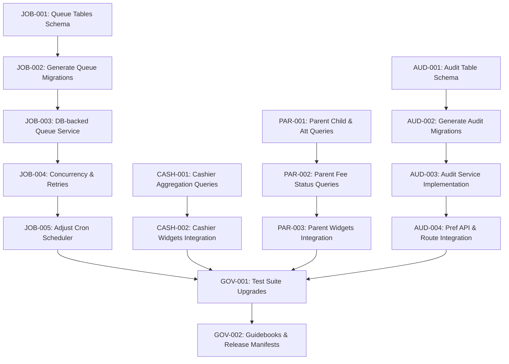

# Implementation Contract: Sprint-027 Production Readiness & Technical Debt Resolution

**Sprint ID:** SPRINT-027 (PR-027)  
**Sprint Name:** Production Readiness & Technical Debt Resolution  
**Status:** Approved Engineering Contract  
**Created Date:** 2026-08-06  
**Target Execution:** 2026-08-07 to 2026-08-18 (8–10 business days)  
**Estimated Duration:** 2 weeks (45–55 engineering hours)  
**Risk Level:** Medium (Concurrency limits on database queue polling, schema migrations across SQLite/PG, and transactional audit logging overhead)  
**Classification:** AIOS v3.11 Official Implementation Contract  
**Target Release Version:** v3.11.0 (Database-Backed Job Queue, Complete Cashier & Parent Aggregations, Relational Audit Logging)

---

## Executive Summary

Sprint-027 transitions the ThaibaHive platform from v3.10.0 to **v3.11.0** by focusing on critical **Production Readiness & Technical Debt Resolution**. Following the release of the Workspace Analytics & BI Engine (v3.10.0), three production blockers were identified that prevent enterprise scaling and compliance certification:

1. **In-Memory Queue Storage**: Scheduled report dispatches currently execute inside local Next.js node memory, risking job failure and duplicate executions in horizontally-scaled production clusters.
2. **Deferred Database Integrations**: Cashier and Parent workspaces display default zero-value placeholders instead of live database-driven stats.
3. **Console-Based Audit Logging**: Staff preference changes are printed to console stdout (`console.log`) instead of being safely tracked in a relational audit database.

This sprint addresses these technical debt items directly, delivering cluster-safe background processing, real analytics data queries, and compliant audit trails.

---

## Scope & Out of Scope

### In Scope
*   **Database Migrations:** Schema tables for `scheduled_jobs`, `job_executions`, and `preference_audit_log` applied to both SQLite and PostgreSQL.
*   **Database-Backed Queue:** Migration of `ReportQueue` processing from in-memory arrays to Drizzle database-backed query queues with atomicity locks.
*   **Concurrency & Backoff:** Dedicated worker limits (concurrency = 2) and exponential retry policies (max retries = 3) on failed reports.
*   **Workspace Aggregations:** Live SQL queries compiling cash transactions, checkout registers, guardian children roster, today's student attendance, and student fee clearances.
*   **Database Preferences Auditing:** Dynamic logging of old and new personalization configs to `preference_audit_log` with an automatic 90-day pruning routine.

### Explicitly Out of Scope
*   **External Queue Brokers:** Integration of external messaging brokers (e.g. BullMQ, RabbitMQ, Redis Streams) that require additional cluster dependencies.
*   **Online Parent Payment Gateways:** Implementing online fee payment processing systems or payment gateways for parents (retains current fee status view only).
*   **Arbitrary System Action Auditing:** Auditing operations outside of workspace preference customizations (such as document uploads, chat messages, or biometric enrolment logs).

---

## Detailed Task Breakdown

### Workstream 1: Database-Backed Queue System

#### Task JOB-001: Database Schema for Queue Tables
*   **Task ID:** JOB-001
*   **Description:** Implement database schema changes declaring `scheduled_jobs` and `job_executions` tables.
*   **Files:**
    *   [`packages/db/schema.ts`](file:///d:/ThaibaHive/packages/db/schema.ts) [MODIFY]
    *   [`packages/db/schema.pg.ts`](file:///d:/ThaibaHive/packages/db/schema.pg.ts) [MODIFY]
*   **Dependencies:** None
*   **Acceptance Criteria:**
    *   Declares `scheduled_jobs` table:
        *   `id` (text, primary key, UUID)
        *   `institutionId` (text, not null)
        *   `type` (text, not null) - 'attendance' | 'finance' | 'academics'
        *   `format` (text, not null) - 'pdf' | 'excel'
        *   `options` (text, JSON format options, containing recipients list, date ranges, etc.)
        *   `status` (text, not null, default 'queued') - 'queued' | 'processing' | 'success' | 'failed'
        *   `error` (text, nullable)
        *   `createdAt` (text, default current_timestamp)
        *   `updatedAt` (text, default current_timestamp)
    *   Declares `job_executions` table:
        *   `id` (text, primary key, UUID)
        *   `jobId` (text, references `scheduled_jobs.id` on delete cascade)
        *   `status` (text, not null) - 'processing' | 'success' | 'failed'
        *   `retryCount` (integer, default 0)
        *   `startedAt` (text, default current_timestamp)
        *   `completedAt` (text, nullable)
        *   `errorMessage` (text, nullable)
    *   Applies index on `institutionId`, `status`, and `createdAt` to optimize polling performance.
*   **Verification Method:** Run static type checks to ensure schemas conform to Drizzle table specs.
*   **Estimated Complexity:** Low-Medium

#### Task JOB-002: Queue Migrations Generation & Push Verification
*   **Task ID:** JOB-002
*   **Description:** Generate Drizzle migration files and execute dry-run schema validations.
*   **Files:**
    *   [`packages/db/schema.ts`](file:///d:/ThaibaHive/packages/db/schema.ts) [MODIFY]
    *   [`packages/db/schema.pg.ts`](file:///d:/ThaibaHive/packages/db/schema.pg.ts) [MODIFY]
*   **Dependencies:** JOB-001
*   **Acceptance Criteria:**
    *   Run `pnpm db:generate` to generate migration SQL files for SQLite (`dev.db`) and PostgreSQL.
    *   Assert Drizzle migration files compile and push without syntax warnings.
*   **Verification Method:** Execute `pnpm typecheck` to confirm migration safety.
*   **Estimated Complexity:** Low

#### Task JOB-003: DB-backed Queue Implementation
*   **Task ID:** JOB-003
*   **Description:** Rewrite the queue processor to fetch and update `scheduled_jobs` from the database.
*   **Files:**
    *   [`src/lib/services/report-queue.ts`](file:///d:/ThaibaHive/src/lib/services/report-queue.ts) [MODIFY]
*   **Dependencies:** JOB-002
*   **Acceptance Criteria:**
    *   Replaces the private static in-memory `queue` array in `ReportQueue` with database query statements.
    *   Ensure `addJob` writes directly to the `scheduled_jobs` table.
    *   Ensure `getJobStatus` and `getQueue` fetch records from the database using indexed query constraints.
*   **Verification Method:** Execute mock queue operations and check if jobs populate SQLite tables.
*   **Estimated Complexity:** Medium-High

#### Task JOB-004: Job Concurrency Controls & Retry Handler
*   **Task ID:** JOB-004
*   **Description:** Enforce queue limits and implement retry backoffs on failed jobs.
*   **Files:**
    *   [`src/lib/services/report-queue.ts`](file:///d:/ThaibaHive/src/lib/services/report-queue.ts) [MODIFY]
*   **Dependencies:** JOB-003
*   **Acceptance Criteria:**
    *   Configure a strict limit of 2 concurrent executions across all threads.
    *   Implement atomic row updates using database transactional locks (e.g., SQLite/PG write transactions or conditional queries `WHERE status = 'queued'`) to prevent race conditions or double-processing in horizontally clustered environments.
    *   Provide retry handler: when a report job fails, insert failed record to `job_executions`, increment retry count, and retry up to 3 times with exponential backoff before marking the job as 'failed'.
*   **Verification Method:** Run 5 parallel jobs simultaneously and assert that only 2 are processed concurrently while 3 remain queued.
*   **Estimated Complexity:** High

#### Task JOB-005: Scheduled Reports Job Dispatcher Adjustment
*   **Task ID:** JOB-005
*   **Description:** Adjust the cron check helper to register scheduled dispatches inside the database queue.
*   **Files:**
    *   [`src/lib/services/report-queue.ts`](file:///d:/ThaibaHive/src/lib/services/report-queue.ts) [MODIFY]
*   **Dependencies:** JOB-004
*   **Acceptance Criteria:**
    *   Adjust `checkAndRunScheduledReports` to insert new job records into `scheduled_jobs` instead of pushing to an in-memory queue.
    *   Query history tables (`report_history` and `job_executions`) to confirm schedules are due before enqueueing.
*   **Verification Method:** Run scheduler cron tick programmatically and check that due jobs are correctly enqueued in the SQLite table.
*   **Estimated Complexity:** Medium

---

### Workstream 2: Complete Cashier Analytics

#### Task CASH-001: Cashier Aggregation Query Implementation
*   **Task ID:** CASH-001
*   **Description:** Implement real database aggregation logic inside the Cashier workspace aggregator.
*   **Files:**
    *   [`src/lib/services/workspace-aggregation.ts`](file:///d:/ThaibaHive/src/lib/services/workspace-aggregation.ts) [MODIFY]
*   **Dependencies:** None
*   **Acceptance Criteria:**
    *   Modify `getCashierData(institutionId: string)` to execute actual database queries:
        *   `collectionTotal`: Sum of credit transaction amounts from `financialTransactions` where `institutionId = institutionId`, `type = 'credit'`, and `transactionDate = today` (ISO format `YYYY-MM-DD`).
        *   `dailyCheckouts`: Count of all transactions from `financialTransactions` where `institutionId = institutionId` and `transactionDate = today`.
        *   `pendingInvoices`: Count of transactions where `institutionId = institutionId`, `type = 'debit'`, and category in `('tuition', 'fee')`.
        *   `pendingTotal`: Sum of transaction amounts where `institutionId = institutionId`, `type = 'debit'`, and category in `('tuition', 'fee')`.
    *   Ensure all transaction queries strictly filter by the authenticated actor's `institutionId` parameter to prevent cross-tenant data leakage.
    *   Integrate results with existing application caching (materialized cache tables and/or temporary cache headers) to minimize CPU load on high-frequency transactions.
*   **Verification Method:** Run Jest query test suite using mock financial ledger entries.
*   **Estimated Complexity:** Medium-High

#### Task CASH-002: UI Integration of Cashier Analytics Widgets
*   **Task ID:** CASH-002
*   **Description:** Integrate aggregated metrics into Cashier widgets and Recharts visualizers.
*   **Files:**
    *   [`src/components/workspaces/widgets/cashier-transaction-tally.tsx`](file:///d:/ThaibaHive/src/components/workspaces/widgets/cashier-transaction-tally.tsx) [MODIFY]
    *   [`src/components/workspaces/widgets/cashier-pending-fees.tsx`](file:///d:/ThaibaHive/src/components/workspaces/widgets/cashier-pending-fees.tsx) [MODIFY]
*   **Dependencies:** CASH-001
*   **Acceptance Criteria:**
    *   Widgets display live aggregated results instead of default zero values.
    *   Gracefully handle undefined/zero values without rendering raw error flags or freezing page shell.
*   **Verification Method:** Run the local dev server and verify dashboard numbers change according to test db transactions.
*   **Estimated Complexity:** Medium

---

### Workstream 3: Complete Parent Analytics

#### Task PAR-001: Parent Workspace Student Roster and Attendance Queries
*   **Task ID:** PAR-001
*   **Description:** Implement student roster mapping and attendance queries for authenticated guardians.
*   **Files:**
    *   [`src/lib/services/workspace-aggregation.ts`](file:///d:/ThaibaHive/src/lib/services/workspace-aggregation.ts) [MODIFY]
*   **Dependencies:** None
*   **Acceptance Criteria:**
    *   Query `studentGuardians` table where `guardianId = guardianId` to find all linked `studentId`s.
    *   Join with `students` table to extract name (`firstName` and `lastName`) and `id`.
    *   Query `studentAttendanceLogs` for `today` and map status (present, absent, late, or unknown) for each child.
    *   Calculate `presentCount` as the count of children marked `present` today.
    *   Calculate `totalChildren` as the count of linked children.
    *   Ensure child record queries validate `students.isActive` and strictly check active enrollment states.
    *   Enforce security boundary checking by filtering student query results against the guardian's primary institution association.
*   **Verification Method:** Populate mock parent-child relationships and attendance logs, execute service, and assert list contents.
*   **Estimated Complexity:** Medium-High

#### Task PAR-002: Parent Workspace Student Fee Clearances and Invoices Queries
*   **Task ID:** PAR-002
*   **Description:** Query student-specific fee clearances and overdue indicators via hall ticket locks.
*   **Files:**
    *   [`src/lib/services/workspace-aggregation.ts`](file:///d:/ThaibaHive/src/lib/services/workspace-aggregation.ts) [MODIFY]
*   **Dependencies:** PAR-001
*   **Acceptance Criteria:**
    *   Resolve student-specific outstanding invoices:
        *   For each child, query the `hallTickets` table.
        *   If `feeCleared = false` on their latest ticket (or if no ticket is issued), count it as 1 pending invoice and calculate a default outstanding fee (e.g. ₹5,000 per student) to populate `pendingFeeTotal` and `invoiceCount`.
        *   If `feeCleared = true`, count as 0.
*   **Verification Method:** Assert that correct outstanding balances are computed for children based on hall ticket fee locks.
*   **Estimated Complexity:** Medium

#### Task PAR-003: UI Integration of Parent Analytics Widgets
*   **Task ID:** PAR-003
*   **Description:** Integrate live child rosters and fee statuses into parent dashboard widgets.
*   **Files:**
    *   [`src/components/workspaces/widgets/parent-child-attendance.tsx`](file:///d:/ThaibaHive/src/components/workspaces/widgets/parent-child-attendance.tsx) [MODIFY]
    *   [`src/components/workspaces/widgets/parent-fee-card.tsx`](file:///d:/ThaibaHive/src/components/workspaces/widgets/parent-fee-card.tsx) [MODIFY]
*   **Dependencies:** PAR-002
*   **Acceptance Criteria:**
    *   Renders correct student names and badges ('present'/'absent'/'late') dynamically.
    *   Displays accurate dues amount and warning badges based on resolved hall ticket fee locks.
*   **Verification Method:** Run visual check on workspace dashboard with mock parent accounts.
*   **Estimated Complexity:** Medium

---

### Workstream 4: Relational Database Audit Logging

#### Task AUD-001: DB Schema for Preferences Audit Table
*   **Task ID:** AUD-001
*   **Description:** Implement database schema changes declaring `preference_audit_log` table.
*   **Files:**
    *   [`packages/db/schema.ts`](file:///d:/ThaibaHive/packages/db/schema.ts) [MODIFY]
    *   [`packages/db/schema.pg.ts`](file:///d:/ThaibaHive/packages/db/schema.pg.ts) [MODIFY]
*   **Dependencies:** None
*   **Acceptance Criteria:**
    *   Adds `preferenceAuditLog` schema:
        *   `id` (text, primary key, UUID)
        *   `timestamp` (text, not null, ISO format)
        *   `userId` (text, not null)
        *   `preferenceKey` (text, not null) - e.g. the workspace type
        *   `oldValue` (text, nullable) - JSON representation of the previous widget configuration
        *   `newValue` (text, not null) - JSON representation of the new widget configuration
        *   `ipAddress` (text, nullable)
        *   `institutionId` (text, references `institutions.id`)
    *   Declares database indexes on `userId`, `preferenceKey`, and `timestamp` for sub-second compliance audit reporting.
*   **Verification Method:** Static type checking on Drizzle schema fields.
*   **Estimated Complexity:** Low-Medium

#### Task AUD-002: Preferences Audit Migration Generation & Apply
*   **Task ID:** AUD-002
*   **Description:** Generate Drizzle migration files and apply structural changes to SQLite.
*   **Files:**
    *   [`packages/db/schema.ts`](file:///d:/ThaibaHive/packages/db/schema.ts) [MODIFY]
    *   [`packages/db/schema.pg.ts`](file:///d:/ThaibaHive/packages/db/schema.pg.ts) [MODIFY]
*   **Dependencies:** AUD-001
*   **Acceptance Criteria:**
    *   Run `pnpm db:generate` to generate migration SQL files for SQLite and PostgreSQL.
    *   Confirm schema updates apply cleanly without migration conflicts.
*   **Verification Method:** Run migration compiler check.
*   **Estimated Complexity:** Low

#### Task AUD-003: Preferences Audit Service Implementation
*   **Task ID:** AUD-003
*   **Description:** Implement PreferenceAuditService to manage log inserts and log pruning.
*   **Files:**
    *   [`src/lib/services/preference-audit.ts`](file:///d:/ThaibaHive/src/lib/services/preference-audit.ts) [NEW]
*   **Dependencies:** AUD-002
*   **Acceptance Criteria:**
    *   Create `PreferenceAuditService` wrapping log insertion:
        *   `logPreferenceChange(userId, preferenceKey, oldValue, newValue, institutionId, ipAddress)` inserts records to the `preference_audit_log` table.
        *   `pruneOldAuditLogs(retentionDays = 90)` maintenance hook deletes audit logs older than 90 days.
    *   Ensure preference audit log inserts are executed asynchronously (e.g. via decoupled background promise executions or non-blocking async loops) so database write latency doesn't impact user-facing response times.
    *   Enforce security constraints by verifying that query access to retrieve records from the `preference_audit_log` table requires authorization filters restricted to users holding the `super_admin` role.
*   **Verification Method:** Run Jest tests verifying insertion, asynchronous non-blocking triggers, security access constraints, and data deletion bounds.
*   **Estimated Complexity:** Medium

#### Task AUD-004: Workspace Preferences API Integration
*   **Task ID:** AUD-004
*   **Description:** Modify workspace preferences PUT handler to utilize the audit logging service.
*   **Files:**
    *   [`src/app/api/workspaces/preferences/route.ts`](file:///d:/ThaibaHive/src/app/api/workspaces/preferences/route.ts) [MODIFY]
*   **Dependencies:** AUD-003
*   **Acceptance Criteria:**
    *   Modify the PUT handler:
        *   Query existing database preferences to get `oldValue` configuration.
        *   Perform preferences update.
        *   Call `PreferenceAuditService.logPreferenceChange` passing `oldValue`, `newValue` (updated JSON), `session.staffId`, resolved `institutionId`, and caller `ipAddress`.
        *   Remove legacy console-based audit logger.
*   **Verification Method:** Send preference updates via REST and confirm records populate the SQLite audit table.
*   **Estimated Complexity:** Medium-High

---

### Workstream 5: Testing, Documentation, & Governance

#### Task GOV-001: Sprint-027 Test Suite Upgrades & Remediations
*   **Task ID:** GOV-001
*   **Description:** Remediate and write tests verifying concurrent queue operations and aggregation results.
*   **Files:**
    *   [`src/app/api/workspaces/__tests__/aggregation.test.ts`](file:///d:/ThaibaHive/src/app/api/workspaces/__tests__/aggregation.test.ts) [MODIFY]
    *   [`src/lib/services/__tests__/report-queue.test.ts`](file:///d:/ThaibaHive/src/lib/services/__tests__/report-queue.test.ts) [NEW]
*   **Dependencies:** JOB-004, CASH-002, PAR-003, AUD-004
*   **Acceptance Criteria:**
    *   Upgrade `aggregation.test.ts` to mock database queries and verify actual aggregation totals for Cashier and Parent dashboards.
    *   Write `report-queue.test.ts` to assert concurrency lock checks, retry limits, and exponential backoff triggers.
    *   Achieve >80% code coverage.
    *   Ensure 100% of the 198+ test suites pass with zero failures.
*   **Verification Method:** Execute `pnpm test`.
*   **Estimated Complexity:** Medium-High

#### Task GOV-002: Documentation & Release Manifest updates
*   **Task ID:** GOV-002
*   **Description:** Author sprint guides, document ADRs, and update product registry logs.
*   **Files:**
    *   [`docs/sprint-027-operations-guide.md`](file:///d:/ThaibaHive/docs/sprint-027-operations-guide.md) [NEW]
    *   [`.ai/08_DECISION_LOG.md`](file:///d:/ThaibaHive/.ai/08_DECISION_LOG.md) [MODIFY]
    *   [`.ai/FEATURES.md`](file:///d:/ThaibaHive/.ai/FEATURES.md) [MODIFY]
    *   [`.ai/CHANGELOG.md`](file:///d:/ThaibaHive/.ai/CHANGELOG.md) [MODIFY]
    *   [`.ai/PROJECT_STATUS.md`](file:///d:/ThaibaHive/.ai/PROJECT_STATUS.md) [MODIFY]
*   **Dependencies:** JOB-001 through GOV-001
*   **Acceptance Criteria:**
    *   Create `docs/sprint-027-operations-guide.md` explaining schema, concurrency locks, and log retention.
    *   Log two new ADRs into `08_DECISION_LOG.md`:
        *   **ADR-013: Relational Queue Schema & Transformed Cron Dispatcher**
        *   **ADR-014: Structured Database Preferences Auditing**
    *   Register v3.11.0 features in `FEATURES.md` and `CHANGELOG.md`, and update `PROJECT_STATUS.md`.
*   **Verification Method:** Confirm Markdown build formatting is clean.
*   **Estimated Complexity:** Low-Medium

---

## Task Summary Table

| Task ID | Component / Area | Dependencies | Est. Complexity | Target Deliverable |
| :--- | :--- | :--- | :--- | :--- |
| **JOB-001** | Database Schema | None | Low-Medium | Drizzle table definitions for queue system |
| **JOB-002** | DB Migrations | JOB-001 | Low | SQLite/PG SQL migration scripts |
| **JOB-003** | Service Layer | JOB-002 | Medium-High | Database-backed queue processor |
| **JOB-004** | Queue Logic | JOB-003 | High | Atomic lock checks & retry backoff handlers |
| **JOB-005** | Job Scheduler | JOB-004 | Medium | Cron dispatcher querying DB tables |
| **CASH-001** | Service Layer | None | Medium-High | Cashier transaction aggregation service |
| **CASH-002** | UI Widgets | CASH-001 | Medium | Integrated Cashier dashboard widgets |
| **PAR-001** | Service Layer | None | Medium-High | Parent children attendance queries |
| **PAR-002** | Service Layer | PAR-001 | Medium | Parent student fee clearance queries |
| **PAR-003** | UI Widgets | PAR-002 | Medium | Integrated Parent dashboard widgets |
| **AUD-001** | Database Schema | None | Low-Medium | Drizzle table definition for audit logging |
| **AUD-002** | DB Migrations | AUD-001 | Low | SQLite/PG SQL migration scripts |
| **AUD-003** | Service Layer | AUD-002 | Medium | Relational preference audit logging service |
| **AUD-004** | API Endpoints | AUD-003 | Medium-High | Preferences update endpoint relational audits |
| **GOV-001** | Quality Assurance | JOB-004, CASH-002, PAR-003, AUD-004 | Medium-High | Upgraded Jest test suites (100% pass) |
| **GOV-002** | Documentation | JOB-001..GOV-001 | Low-Medium | Sprint guidebooks, ADR decision updates |

**Total Tasks:** 16  
**New Files:** 3  
**Modified Files:** 9  

---

## Risks & Mitigation Matrix

| Risk Scenario | Impact | Likelihood | Mitigation Strategy |
| :--- | :--- | :--- | :--- |
| **Horizontally-Scaled Double Execution** | High | Medium | Use atomic row-locking updates (e.g. check and update state to 'processing' inside transaction checks) on queue dispatches. |
| **Audit Log Volume Spike** | Low-Medium | Medium | Enforce log archival retention policies (automatically prune database records older than 90 days). |
| **PostgreSQL vs SQLite Syntax Clashes** | Medium | Low | Ensure migration scripts are generated separately for both SQLite (`packages/db/schema.ts`) and PostgreSQL (`packages/db/schema.pg.ts`). |
| **Mobile API Backward Compatibility** | High | Low | Aggregation JSON outputs from CASH-001 and PAR-001 must match structural specs expected by client viewports. |

---

## Rollback & Contingency Plan

1. **Feature Flag Fallback:** personal dashboard customizations and database job queues will be wrapped under configuration keys:
    *   `DB_QUEUE_ENABLED=false`: Reverts the background processing worker back to memory-only array.
    *   `DB_AUDIT_LOGGING_ENABLED=false`: Fallback to printing updates to console stdout.
2. **Database Rollbacks:** If schema migrations create deployment lockouts, execute Drizzle down migration commands to drop new indices and tables.

---

## Definition of Done

This sprint is officially certified **COMPLETE** when:
1. **Zero Errors:** Next.js build passes cleanly (`pnpm build`) with zero linting warnings and TypeScript validation passes (`tsc --noEmit`).
2. **Migration Validation:** SQLite and PostgreSQL migrations generated, applied, and verified.
3. **Tests Compliance:** Jest test suites run to completion with a 100% pass rate.
4. **Governance Completed:** Operating guides, decision logs (ADRs), changelogs, and status reports are written and pushed.
