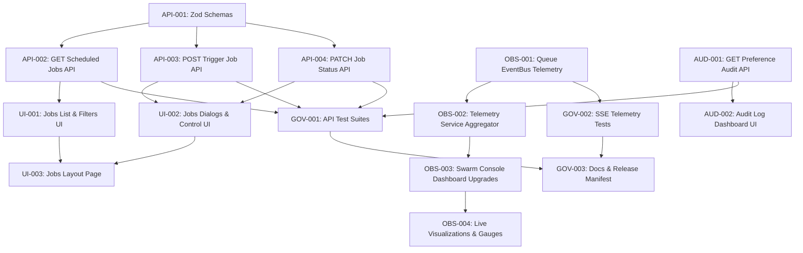

# Implementation Contract: Sprint-028 Infrastructure Hardening & Global Swarm Monitoring Console Improvements

**Sprint ID:** SPRINT-028 (PR-028)  
**Sprint Name:** Infrastructure Hardening and Global Swarm Monitoring Console Improvements  
**Status:** Approved Engineering Contract  
**Created Date:** 2026-08-06  
**Target Execution:** 2026-08-07 to 2026-08-18 (8–10 business days)  
**Estimated Duration:** 2 weeks (45–55 engineering hours)  
**Risk Level:** Medium (SSE connection scaling, concurrency locks on job queue manipulation, and secure role-guarded audit logs access)  
**Classification:** AIOS v3.12 Official Implementation Contract  
**Target Release Version:** v3.12.0 (Scheduled Jobs Management UI, Swarm Telemetry Integration, Preference Audit Log Viewer)

---

## Executive Summary

Sprint-028 transitions the ThaibaHive platform from v3.11.0 to **v3.12.0** by focusing on **Infrastructure Hardening and Global Swarm Monitoring Console Improvements**. With the completion of Sprint-027, the platform now has robust database-backed schemas and services (such as persistent report queues, exponential backoff retries, and personalization preference audit logs). However, these backend systems lack administrative interfaces, leaving operators to rely on direct database queries or command line interactions for monitoring and operations.

This sprint bridges that gap by establishing safe, secure administrative APIs and intuitive UI consoles. The primary goals are:
1. **Scheduled Jobs Management UI:** A centralized administrative panel to view, trigger, pause, resume, or cancel active/queued report queue items without database manipulation.
2. **Enhanced Swarm Console:** Real-time visual display of queue metrics (size, latency, retry counts), worker status, and system health by streaming events from the background workers to the UI via Server-Sent Events (SSE).
3. **Preference Audit Log Viewer:** A secure, role-guarded console interface to inspect user personalization changes, older configurations, and new settings layouts.

---

## Scope & Out of Scope

### In Scope
*   **Administrative API Handlers:** Zod-validated, role-gated REST API endpoints under `/api/admin/scheduled-jobs/*` and `/api/admin/preference-audit/*` checking strictly for `super_admin` permissions.
*   **Scheduled Jobs Control UI:** An administrative dashboard under `/admin/scheduled-jobs` displaying current job queue status, execution histories, and interactive control buttons (Pause, Resume, Cancel, Trigger Report).
*   **Swarm Console Event Upgrades:** Modifying `ReportQueue` processing to publish real-time telemetry events and metrics (queue size, latency, worker pool, job state changes) to the `EventBus`.
*   **Swarm Live UI Visualizations:** Upgrading the Swarm Intelligence console UI to subscribe to the SSE stream and render live queue timelines, worker node health indicators, and status gauges.
*   **Auditing Dashboard UI:** A role-guarded user interface under `/admin/preference-audit` to browse, search, and audit personalization changes across institutions.
*   **Automated Tests:** Comprehensive unit and integration test coverage verifying role security guards, queue action locks (e.g. preventing cancellation of completed jobs), and telemetry event propagation.

### Explicitly Out of Scope
*   **Direct Database Administration Tools:** Constructing schema viewers, SQL execution consoles, or general raw database editors inside the admin workspace.
*   **Non-Workspace Preference Auditing:** Implementing audit trails for arbitrary system activities like document uploads, chat messages, or grade book inputs (retains focus on workspace preference settings as recommended).
*   **Third-party Telemetry Collectors:** Integrating external SaaS monitoring suites (e.g. Datadog, Dynatrace, New Relic) or running Prometheus/Grafana infrastructure agents.

---

## Detailed Task Breakdown

---

### Workstream 1: API Surface for Job Queue Management

#### Task API-001: Zod Schema Definitions for Administrative Operations
*   **Task ID:** API-001
*   **Description:** Declare the Zod schemas required for administrative payloads, including job filtering, manual job triggers, and job status modifications.
*   **Files:**
    *   [`src/lib/validation/schemas.ts`](file:///d:/ThaibaHive/src/lib/validation/schemas.ts) [MODIFY]
*   **Dependencies:** None
*   **Acceptance Criteria:**
    *   Exports `jobFilterSchema` validating query parameters:
        *   `status` (optional enum: `'queued' | 'processing' | 'success' | 'failed' | 'paused' | 'cancelled'`)
        *   `type` (optional enum: `'attendance' | 'finance' | 'academics'`)
        *   `institutionId` (optional UUID/text)
        *   `limit` (optional integer, default 50)
        *   `offset` (optional integer, default 0)
    *   Exports `jobTriggerSchema` validating request body:
        *   `type` (enum: `'attendance' | 'finance' | 'academics'`, required)
        *   `format` (enum: `'pdf' | 'excel'`, required)
        *   `options` (JSON string or object; if string, verifies it parses to valid JSON and validates required nested parameter flags like date ranges, avoiding serialization execution crashes)
        *   `institutionId` (text/UUID, required)
    *   Exports `jobUpdateSchema` validating PATCH body:
        *   `status` (enum: `'paused' | 'cancelled'`, required for transition)
*   **Verification Method:** Run type checks and verify schema compilation passes cleanly under strict Zod configurations.
*   **Estimated Complexity:** Low

#### Task API-002: GET Endpoint for Scheduled Jobs
*   **Task ID:** API-002
*   **Description:** Implement the GET endpoint to fetch scheduled jobs and their execution histories.
*   **Files:**
    *   [`src/app/api/admin/scheduled-jobs/route.ts`](file:///d:/ThaibaHive/src/app/api/admin/scheduled-jobs/route.ts) [NEW]
*   **Dependencies:** API-001
*   **Acceptance Criteria:**
    *   GET handler gated with `requireAuth` checking strictly for `super_admin` permissions.
    *   Queries `scheduled_jobs` joined with `job_executions` to fetch execution histories.
    *   Applies request parameters parsed via `jobFilterSchema` for filtering and pagination.
    *   Returns list of jobs ordered by `createdAt` descending.
    *   Handles empty results and queries gracefully.
*   **Verification Method:** Test GET response with mock data using Postman or a script, asserting 200 OK for super_admins and 403 Forbidden for other roles.
*   **Estimated Complexity:** Medium

#### Task API-003: POST Endpoint to Trigger Manual Report Job
*   **Task ID:** API-003
*   **Description:** Implement the POST endpoint to allow super admins to manually insert a new job into the queue.
*   **Files:**
    *   [`src/app/api/admin/scheduled-jobs/route.ts`](file:///d:/ThaibaHive/src/app/api/admin/scheduled-jobs/route.ts) [NEW]
*   **Dependencies:** API-001
*   **Acceptance Criteria:**
    *   POST handler gated with `requireAuth` checking strictly for `super_admin` permissions.
    *   Validates request body against `jobTriggerSchema`. Returns descriptive 400 Bad Request if nested options contain malformed/invalid JSON structures.
    *   Inserts a new record into `scheduled_jobs` with status `'queued'`.
    *   Calls the background queue processor `ReportQueue.processQueue()` asynchronously to pick up the enqueued task immediately.
    *   Logs administrative action in `preference_audit_log` with status changes.
    *   Returns 201 Created with the created job ID.
*   **Verification Method:** Trigger a mock job POST request and verify a new row appears in `scheduled_jobs` database.
*   **Estimated Complexity:** Medium

#### Task API-004: PATCH Scheduled Job Status Endpoint (Pause / Resume / Cancel)
*   **Task ID:** API-004
*   **Description:** Implement the PATCH endpoint to manage active or pending jobs.
*   **Files:**
    *   [`src/app/api/admin/scheduled-jobs/[id]/route.ts`](file:///d:/ThaibaHive/src/app/api/admin/scheduled-jobs/%5Bid%5D/route.ts) [NEW]
*   **Dependencies:** API-001
*   **Acceptance Criteria:**
    *   PATCH handler gated with `requireAuth` checking strictly for `super_admin` permissions.
    *   Validates path parameters and input status against `jobUpdateSchema`.
    *   Supports transitions:
        *   **Pause:** Changes status from `'queued'` to `'paused'`. Returning error if status is already processing, success, or failed.
        *   **Resume:** Changes status from `'paused'` to `'queued'` and triggers the background queue processing worker immediately.
        *   **Cancel:** If status is `'queued'`, transitions status directly to `'cancelled'`. If status is `'processing'`, halts execution context (if active) and updates `scheduled_jobs.status` to `'cancelled'` while marking `job_executions` status as `'failed'` with error "Cancelled by administrator".
    *   All transitions are audited via `PreferenceAuditService` or equivalent admin logging with target change payload details.
*   **Verification Method:** Attempt to pause a queued job, resume it, and cancel it, confirming database state transitions and audit logs.
*   **Estimated Complexity:** Medium-High

---

### Workstream 2: UI for Scheduled Jobs Management Dashboard

#### Task UI-001: Jobs List View and Filtering Panel
*   **Task ID:** UI-001
*   **Description:** Build the UI list table and filtration component to display jobs queue history and metrics.
*   **Files:**
    *   [`src/components/admin/jobs/jobs-list-panel.tsx`](file:///d:/ThaibaHive/src/components/admin/jobs/jobs-list-panel.tsx) [NEW]
*   **Dependencies:** API-002
*   **Acceptance Criteria:**
    *   Renders a table displaying: Job ID, Job Type, Output Format, Current Status (Badge styled), Institution ID, Created At timestamp, and runtime duration.
    *   Status labels must render using the standard `<Badge>` component with designated semantic color configurations:
        *   `queued` -> `info`
        *   `processing` -> `warning`
        *   `success` -> `success`
        *   `failed` -> `destructive`
        *   `paused` -> `secondary`
        *   `cancelled` -> `secondary`
    *   Includes filters for Status, Type, and Institution search input. Changing filters updates the state and triggers debounced API requests to prevent over-fetching.
    *   Provides skeleton screens using `<Skeleton>` for loading states (no raw text loading spinners or layout thrashing).
*   **Verification Method:** Inspect list UI layout, filter options, and skeleton screens.
*   **Estimated Complexity:** Medium

#### Task UI-002: Jobs Control Actions Dialogs
*   **Task ID:** UI-002
*   **Description:** Implement action buttons and dialog forms to trigger, pause, resume, or cancel jobs.
*   **Files:**
    *   [`src/components/admin/jobs/jobs-actions-panel.tsx`](file:///d:/ThaibaHive/src/components/admin/jobs/jobs-actions-panel.tsx) [NEW]
*   **Dependencies:** API-003, API-004
*   **Acceptance Criteria:**
    *   Renders interaction buttons next to each job item in the list:
        *   "Pause" button (visible on `'queued'` jobs).
        *   "Resume" button (visible on `'paused'` jobs).
        *   "Cancel" button (visible on `'queued'` or `'processing'` jobs).
    *   Clicking "Cancel" triggers a confirmation modal using the Radix UI `<Dialog>` component primitive (avoiding raw CSS position fixes).
    *   "Trigger Report" button opens a Radix dialog containing a form (Type dropdown, Format radio buttons, Institution selection, and Options JSON text-area).
    *   Catches API fetch errors and displays them to the user via toast notifications (`toast.error`).
*   **Verification Method:** Interact with pause/resume actions, confirm dialogs work correctly, and mock failed API requests to verify toast error messages.
*   **Estimated Complexity:** Medium

#### Task UI-003: Jobs Management Page Integration
*   **Task ID:** UI-003
*   **Description:** Assemble the list, filter, and action panels into a main responsive dashboard routing path.
*   **Files:**
    *   [`src/app/(shell)/admin/scheduled-jobs/page.tsx`](file:///d:/ThaibaHive/src/app/%28shell%29/admin/scheduled-jobs/page.tsx) [NEW]
*   **Dependencies:** UI-001, UI-002
*   **Acceptance Criteria:**
    *   Integrates jobs list table, filter forms, and action dialogs.
    *   Gated with role verification checks; redirects unauthorized users and displays "Access Restricted".
    *   Utilizes React `useState` and `useEffect` with clean dependency arrays. All catch blocks prevent stuck loading states.
*   **Verification Method:** Attempt to access page with super_admin vs other roles, checking responsiveness and state updates.
*   **Estimated Complexity:** Medium

---

### Workstream 3: Observability Enhancements (Swarm Console Integration)

#### Task OBS-001: Queue Event & Telemetry Publishing to EventBus
*   **Task ID:** OBS-001
*   **Description:** Modify the report queue processing system to emit execution events and metrics to the observability `EventBus`.
*   **Files:**
    *   [`src/lib/services/report-queue.ts`](file:///d:/ThaibaHive/src/lib/services/report-queue.ts) [MODIFY]
*   **Dependencies:** None
*   **Acceptance Criteria:**
    *   Imports `EventBus` from `@/lib/observability/event-bus`.
    *   Emits telemetry event (`EventBus.getInstance().publishEvent`) during:
        *   Job start: `"Job [ID] of type [Type] transition to processing."` (severity: `'info'`)
        *   Job success: `"Job [ID] of type [Type] execution completed successfully."` (severity: `'info'`)
        *   Job failure: `"Job [ID] of type [Type] execution failed with error: [Error]."` (severity: `'error'`)
        *   Job cancellation: `"Job [ID] cancelled by administrative operator."` (severity: `'warning'`)
    *   Emits telemetry metrics (`EventBus.getInstance().publishMetric`) on every queue cycle:
        *   `queue_backlog_size` (current queued + paused jobs count)
        *   `worker_concurrency_load` (current count of active processing jobs, out of max 2)
        *   `job_failure_retry_rate` (number of jobs requiring retry attempts)
*   **Verification Method:** Run a report execution and assert that events and metrics are published to the EventBus.
*   **Estimated Complexity:** Medium-High

#### Task OBS-002: Telemetry Aggregation Service Expansion
*   **Task ID:** OBS-002
*   **Description:** Expand the telemetry and aggregation layer to calculate historical queue performance benchmarks for dashboard consumption.
*   **Files:**
    *   [`src/lib/services/workspace-aggregation.ts`](file:///d:/ThaibaHive/src/lib/services/workspace-aggregation.ts) [MODIFY]
*   **Dependencies:** OBS-001
*   **Acceptance Criteria:**
    *   Implements `getQueueTelemetryMetrics()` to compile aggregates over the past 24 hours:
        *   `avgProcessingTime`: Average duration (seconds) between start and complete timestamps of successful executions in `job_executions`.
        *   `completionSuccessRate`: Ratio of success vs total executions.
        *   `failedJobsTotal`: Count of failed queue items.
    *   Calculates indices and wraps query logic to ensure sub-100ms service execution. Utilizes a sliding-window memory caching strategy (5-second TTL) for heavy aggregation queries to prevent database read lock contention.
*   **Verification Method:** Mock historical database executions and assert that computed aggregates match mathematical outputs.
*   **Estimated Complexity:** Medium

#### Task OBS-003: Enhanced Swarm Console Dashboard Upgrades
*   **Task ID:** OBS-003
*   **Description:** Integrate queue statistics, worker node workloads, and real-time event updates into the Swarm Intelligence console.
*   **Files:**
    *   [`src/app/(shell)/admin/swarm-intelligence/page.tsx`](file:///d:/ThaibaHive/src/app/%28shell%29/admin/swarm-intelligence/page.tsx) [MODIFY]
*   **Dependencies:** OBS-002
*   **Acceptance Criteria:**
    *   Integrates a new "Queue and Worker Telemetry" tab or panel.
    *   Performs connection setup to `/api/admin/swarm/stream` for real-time telemetry updates.
    *   Provides connection resiliency: implements auto-reconnect backoff logic (retrying connection after 2s, 4s, 8s up to 30s) and displays connection status indicator badges.
    *   Dynamically maps queue backlog metrics and worker workloads as SSE events arrive. If SSE fails permanently, falls back to polling database metrics every 15s.
    *   Ensures clean React hook lifecycle: closes connections on components unmount, avoiding memory leaks.
*   **Verification Method:** Keep console open, run queue operations, and check that dashboard variables update dynamically.
*   **Estimated Complexity:** Medium-High

#### Task OBS-004: Advanced Telemetry UI Visualizations
*   **Task ID:** OBS-004
*   **Description:** Implement advanced charting and topology nodes representing active job queue statistics.
*   **Files:**
    *   [`src/components/swarm/swarm-telemetry-charts.tsx`](file:///d:/ThaibaHive/src/components/swarm/swarm-telemetry-charts.tsx) [NEW]
*   **Dependencies:** OBS-003
*   **Acceptance Criteria:**
    *   Implements a timeline chart visualizing job executions and throughput volumes over time using Recharts.
    *   Creates a visual worker node status gauge (concurrency indicators, e.g. displaying 0/2, 1/2, or 2/2 slots occupied).
    *   Links topology nodes to represent worker tasks: when a node is processing a job, display a glowing connection link labeled with the job ID.
*   **Verification Method:** Assert charts render correctly with zero layout issues and update smoothly during active processing.
*   **Estimated Complexity:** High

---

### Workstream 4: Preference Audit Log UI

#### Task AUD-001: GET Endpoint for Preference Audit Logs
*   **Task ID:** AUD-001
*   **Description:** Build the secure API route to fetch user workspace setting modification history.
*   **Files:**
    *   [`src/app/api/admin/preference-audit/route.ts`](file:///d:/ThaibaHive/src/app/api/admin/preference-audit/route.ts) [NEW]
*   **Dependencies:** None
*   **Acceptance Criteria:**
    *   GET handler gated with `requireAuth` checking strictly for `super_admin` permissions.
    *   Calls `PreferenceAuditService.getAuditLogs` passing limit, offset, and optional `institutionId` parameter.
    *   Handles errors and returns JSON formatted list of preferences changes.
*   **Verification Method:** Send GET request as admin and staff, validating that permissions correctly restrict access.
*   **Estimated Complexity:** Medium

#### Task AUD-002: Preference Audit Log Viewer Dashboard
*   **Task ID:** AUD-002
*   **Description:** Build the user interface for inspecting user workspace customization changes.
*   **Files:**
    *   [`src/app/(shell)/admin/preference-audit/page.tsx`](file:///d:/ThaibaHive/src/app/%28shell%29/admin/preference-audit/page.tsx) [NEW]
*   **Dependencies:** AUD-001
*   **Acceptance Criteria:**
    *   Creates an interactive datatable panel showing: Timestamp, User ID, Preference Key, and Old vs New Value JSON diff comparison representation.
    *   Provides filtration by Preference Key, User search input, and Institution selectors. Filters dynamically fetch updated query results on interaction.
    *   Uses UI components from `src/components/ui/` (no raw HTML inputs or selects).
*   **Verification Method:** Verify columns render correctly, filters process successfully, and JSON payloads display readable settings diffs.
*   **Estimated Complexity:** Medium

---

### Workstream 5: Testing, Governance & Compliance

#### Task GOV-001: Automated API Test Suites
*   **Task ID:** GOV-001
*   **Description:** Implement comprehensive Jest unit and integration tests for the administrative endpoints.
*   **Files:**
    *   [`src/app/api/admin/scheduled-jobs/__tests__/route.test.ts`](file:///d:/ThaibaHive/src/app/api/admin/scheduled-jobs/__tests__/route.test.ts) [NEW]
    *   [`src/app/api/admin/preference-audit/__tests__/route.test.ts`](file:///d:/ThaibaHive/src/app/api/admin/preference-audit/__tests__/route.test.ts) [NEW]
*   **Dependencies:** API-002, API-003, API-004, AUD-001
*   **Acceptance Criteria:**
    *   Verifies authentication and permission guards (gated to `super_admin`).
    *   Verifies POST endpoint inserts valid jobs and rejects schema violations.
    *   Verifies PATCH transitions: checks successful pauses, resumes, and cancellations (e.g. canceling processing task writes failure log details).
    *   Includes multi-step integration flow tests: triggering a job -> asserting processing state and EventBus triggers -> pausing or canceling it -> verifying updated state configurations.
    *   Ensures 100% of these test suites pass and do not regress existing tests.
*   **Verification Method:** Run `pnpm test`.
*   **Estimated Complexity:** Medium-High

#### Task GOV-002: SSE Telemetry and EventBus Integration Tests
*   **Task ID:** GOV-002
*   **Description:** Implement unit tests asserting that queue worker status changes publish correct telemetry updates to the EventBus.
*   **Files:**
    *   [`src/lib/observability/__tests__/report-queue-telemetry.test.ts`](file:///d:/ThaibaHive/src/lib/observability/__tests__/report-queue-telemetry.test.ts) [NEW]
*   **Dependencies:** OBS-001
*   **Acceptance Criteria:**
    *   Mocks `EventBus.getInstance().publishEvent` and `EventBus.getInstance().publishMetric`.
    *   Simulates report execution and asserts that the mock functions receive appropriate transition events and metric values.
    *   Asserts correct severity codes (`info` / `warning` / `error`) mapping on job states.
    *   Validates error handling edge cases: verifies that EventBus subscription network delays or listener throws do not abort queue processing cycles.
*   **Verification Method:** Run `pnpm test` for the telemetry suite.
*   **Estimated Complexity:** Medium

#### Task GOV-003: Documentation & Release Manifest Updates
*   **Task ID:** GOV-003
*   **Description:** Author the operations guide, document new ADR decisions, and log features in project registries.
*   **Files:**
    *   [`docs/sprint-028-operations-guide.md`](file:///d:/ThaibaHive/docs/sprint-028-operations-guide.md) [NEW]
    *   [`.ai/08_DECISION_LOG.md`](file:///d:/ThaibaHive/.ai/08_DECISION_LOG.md) [MODIFY]
    *   [`.ai/FEATURES.md`](file:///d:/ThaibaHive/.ai/FEATURES.md) [MODIFY]
    *   [`.ai/CHANGELOG.md`](file:///d:/ThaibaHive/.ai/CHANGELOG.md) [MODIFY]
    *   [`.ai/PROJECT_STATUS.md`](file:///d:/ThaibaHive/.ai/PROJECT_STATUS.md) [MODIFY]
*   **Dependencies:** All Sprint-028 tasks (API-001 through GOV-002)
*   **Acceptance Criteria:**
    *   Creates `docs/sprint-028-operations-guide.md` explaining dashboard operations, manual triggering instructions, and SSE monitoring.
    *   Logs two new ADRs into `08_DECISION_LOG.md`:
        *   **ADR-015: Administrative Job Management API**
        *   **ADR-016: Swarm Queue Telemetry & Observability**
    *   Updates `FEATURES.md`, `CHANGELOG.md`, and `PROJECT_STATUS.md` registering v3.12.0 release milestones.
*   **Verification Method:** Review formatting syntax.
*   **Estimated Complexity:** Low-Medium

---

## Task Summary Table

| Task ID | Component / Area | Dependencies | Est. Complexity | Target Deliverable |
| :--- | :--- | :--- | :--- | :--- |
| **API-001** | Validation Schemas | None | Low | Zod schema exports for filtering and body validation |
| **API-002** | Admin API Route | API-001 | Medium | GET endpoint returning scheduled jobs history list |
| **API-003** | Admin API Route | API-001 | Medium | POST endpoint triggering manual report generation |
| **API-004** | Admin API Route | API-001 | Medium-High | PATCH endpoint pausing, resuming, or canceling jobs |
| **UI-001** | UI Component | API-002 | Medium | Jobs list datatable widget and filtering buttons |
| **UI-002** | UI Component | API-003, API-004 | Medium | Pause/Resume/Cancel triggers and creation Dialog |
| **UI-003** | UI View Page | UI-001, UI-002 | Medium | Completed `/admin/scheduled-jobs` layout page wrapper |
| **OBS-001** | Observability Layer | None | Medium-High | EventBus notifications from inside report-queue worker |
| **OBS-002** | Aggregations Service | OBS-001 | Medium | Historical averages calculations logic for telemetry |
| **OBS-003** | Swarm Console UI | OBS-002 | Medium-High | SSE telemetry integration inside Swarm Dashboard page |
| **OBS-004** | UI Visualizations | OBS-003 | High | Recharts queue volume timelines and worker status gauges |
| **AUD-001** | Admin API Route | None | Medium | GET endpoint returning workspace personalization audit logs |
| **AUD-002** | UI View Page | AUD-001 | Medium | Completed `/admin/preference-audit` audit viewer panel |
| **GOV-001** | Quality Assurance | API-002..004, AUD-001 | Medium-High | Automated Jest unit/integration tests for REST API endpoints |
| **GOV-002** | Quality Assurance | OBS-001 | Medium | Jest tests asserting queue worker event publication |
| **GOV-003** | Governance Docs | API-001..GOV-002 | Low-Medium | Operations guide, ADR updates, and registry logs |

**Total Tasks:** 16  
**New Files:** 10  
**Modified Files:** 6  

---

## Risks & Mitigation Matrix

| Risk Scenario | Impact | Likelihood | Mitigation Strategy |
| :--- | :--- | :--- | :--- |
| **SSE Connection Saturation** | High | Low | Enforce strict rate limits on SSE routes and set up connection timeouts to clean up stale controllers. |
| **Concurrent Status Race Conditions** | Medium | Medium | Wrap state modifications (e.g. Pause/Cancel) inside atomic database transactions, verifying the current status before changing it. |
| **UI Layout Performance Lag** | Low-Medium | Medium | Use lazy loading for charts and optimize Recharts canvas rendering to prevent main-thread blockage during high-frequency telemetry. |
| **Unauthorized Action Exploits** | Critical | Low | Restrict endpoint routes strictly via `@/lib/auth/require-auth` and verify matching session roles explicitly in handlers. |

---

## Rollback & Contingency Plan

1. **Feature Flag Toggles:** Wrap administrative actions and telemetry feeds behind configuration options:
    *   `ENABLE_ADMIN_JOB_MANAGEMENT=false`: Disables manual queues control endpoints, falling back to read-only views.
    *   `ENABLE_QUEUE_TELEMETRY=false`: Stops background queue workers from publishing metrics to the `EventBus` to prevent performance overhead.
2. **Database Rollbacks:** If database indices or schemas generate locks, apply Drizzle down migrations to restore database integrity.
3. **UI Fail-safe:** If SSE streams suffer connection drops, fallback to query-based polling on dashboards to maintain monitoring coverage.

---

## Definition of Done

This sprint is officially certified **COMPLETE** when:
1. **Zero Errors:** Next.js build compiles successfully (`pnpm build`) with zero TypeScript errors (`pnpm typecheck`) and zero new ESLint warnings.
2. **Schema Integration:** Schema modifications and migrations execute cleanly on dev databases.
3. **Tests Complete:** All 16+ new unit/integration tests pass, maintaining a 100% pass rate across the full project test suite.
4. **Governance Approved:** Operations guides, two new ADR decisions, changelogs, and features manifest logs are written and pushed.
