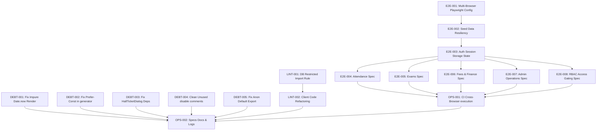

# Implementation Contract: Sprint-029 Quality Assurance & Operational Excellence (E2E Automation & Technical Debt Reduction)

**Sprint ID:** SPRINT-029 (PR-029)  
**Sprint Name:** Quality Assurance & Operational Excellence (E2E Automation & Technical Debt Reduction)  
**Status:** Approved Engineering Contract  
**Created Date:** 2026-08-07  
**Target Execution:** 2026-08-07 to 2026-08-21 (10–14 business days)  
**Estimated Duration:** 2 weeks (50–60 engineering hours)  
**Risk Level:** Medium (Cross-browser test execution timeouts, flaky dynamic state assertions, and custom ESLint AST restriction rules)  
**Classification:** AIOS v3.13 Official Implementation Contract  
**Target Release Version:** v3.13.0 (E2E Playwright Automation, Clean Lint Build, Architectural Boundary Enforcement)

---

## Executive Summary

Sprint-029 transitions the ThaibaHive platform from v3.12.0 to **v3.13.0** by focusing on **Quality Assurance & Operational Excellence (E2E Automation & Technical Debt Reduction)**. With the completion of Sprint-028, all major modules (ERP, Finance, Academics, Mobile, Services, Media, Admin, AI Engines) are 100% complete. However, the platform currently lacks robust end-to-end UI automation, leaving a critical gap in testing coverage for a production environment serving 23+ campuses. Additionally, residual technical debt (17 legacy ESLint warnings, 2 recent ESLint errors) compromises build cleanliness, and there are no lint checks preventing direct database imports inside client-side components.

This sprint addresses these quality gaps through three core pillars:
1. **Playwright E2E Test Suite:** Expanding the Playwright test suite to configure multi-browser testing (Chromium, Firefox, WebKit) and implementing 20+ comprehensive end-to-end user workflows (authentication, attendance check-in, exam management, grade submission, fee invoice payments, and admin dashboard operations).
2. **ESLint Technical Debt Elimination:** Resolving all 17 legacy warnings and 2 errors to achieve absolute build cleanliness (0 errors, 0 warnings).
3. **Architecture Enforcement:** Adding a custom ESLint configuration rule to forbid client-side components and hooks from directly importing `@thaiba/db` or `@thaiba/db/*` modules, enforcing strict backend-client boundaries.
4. **CI/CD Automation:** Integrating multi-browser Playwright test execution into GitHub Actions to run automatically on every pull request.

---

## Scope & Out of Scope

### In Scope
*   **Playwright Test Suite Config:** Upgrading `playwright.config.ts` to support Firefox, WebKit, parallel workers, global setups, and failure-capture reporting.
*   **Idempotent Global Setup:** Improving `e2e/global-setup.ts` to handle seed conflicts, role creation, and state initialization cleanly.
*   **Session State Optimization:** Caching browser storage states to bypass login overhead during multi-scenario tests.
*   **E2E Scenarios:** Developing 20+ E2E tests validating attendance marking, exam creation, grade submission, fee payments, ledger auditing, scheduled job administration, and RBAC page redirection.
*   **Technical Debt Cleanups:** Eliminating the 17 legacy warnings (unused eslint-disables, hook dependencies, default export warnings) and 2 new errors (Date.now render impurity, prefer-const).
*   **Client DB Import Ban:** Configuring `no-restricted-imports` for client directories (`src/components/`, `src/hooks/`) and cleaning up any violating client code.
*   **CI/CD Workflow Update:** Modifying `.github/workflows/ci.yml` to install cross-browser dependencies and run `pnpm test:e2e` on every PR.

### Explicitly Out of Scope
*   **Unit/Integration Test Overhaul:** Restructuring existing Jest/Vitest unit tests (only E2E UI automation is targeted).
*   **Mobile App Native UI Automation:** Automating Flutter UI workflows using Integration Test or Appium (limited to the web dashboard and desktop viewport applications).
*   **Production Staging Deployment:** Building production deployment pipelines or infrastructure orchestration scripts beyond standard GitHub Actions CI.

---

## Detailed Task Breakdown

---

### Workstream 1: Playwright Test Infrastructure and Authentication E2E Tests

#### Task E2E-001: Configure Multi-Browser Execution and Retries in Playwright
*   **Task ID:** E2E-001
*   **Description:** Expand `playwright.config.ts` to include Firefox and WebKit projects, adjust timeouts and retries for parallel execution safety, and configure HTML reporter.
*   **Files:**
    *   [`playwright.config.ts`](file:///d:/ThaibaHive/playwright.config.ts) [MODIFY]
*   **Dependencies:** None
*   **Acceptance Criteria:**
    *   Playwright config includes project configurations for `chromium`, `firefox`, and `webkit`.
    *   Enables 2 retries in CI env (`process.env.CI`) to mitigate potential flakiness, and 0 in local development.
    *   Configures HTML reporter to write failure trace output on retry attempts.
    *   Sets workers default limit (1 in CI, 2 locally) to prevent CPU resource thrashing and false timeouts during parallel tests.
*   **Verification Method:** Run `pnpm test:e2e --list-tests` to ensure Firefox, Chromium, and WebKit projects are registered.
*   **Estimated Complexity:** Low

#### Task E2E-002: Enhance E2E Global Setup and Seed Data Resiliency
*   **Task ID:** E2E-002
*   **Description:** Update `e2e/global-setup.ts` to handle seed conflicts and clean up previous run artifacts, ensuring a completely idempotent starting state for multi-role test users.
*   **Files:**
    *   [`e2e/global-setup.ts`](file:///d:/ThaibaHive/e2e/global-setup.ts) [MODIFY]
*   **Dependencies:** E2E-001
*   **Acceptance Criteria:**
    *   Inserts or updates all test role credentials (`super_admin`, `admin`, `principal`, `hod`, `staff`) without failing on unique constraints or duplicate key conflicts.
    *   Ensures that test settings, leaves, and institution configurations are cleanly updated rather than duplicated.
*   **Verification Method:** Run `pnpm db:seed` and `pnpm test:e2e` twice in succession to confirm setup execution is completely idempotent.
*   **Estimated Complexity:** Low-Medium

#### Task E2E-003: Playwright Authentication and Session Storage State Handling
*   **Task ID:** E2E-003
*   **Description:** Implement an E2E test helper that signs in a specified user role (`super_admin`, `admin`, `principal`, `hod`, `staff`) and saves the browser storage state (JWT, cookies, localStorage) to reuse sessions, avoiding sign-in overhead across tests. Add the output session path to `.gitignore` to prevent leaking secure credentials.
*   **Files:**
    *   [`e2e/helpers/auth-helper.ts`](file:///d:/ThaibaHive/e2e/helpers/auth-helper.ts) [NEW]
    *   [`e2e/auth.spec.ts`](file:///d:/ThaibaHive/e2e/auth.spec.ts) [MODIFY]
    *   [`.gitignore`](file:///d:/ThaibaHive/.gitignore) [MODIFY]
*   **Dependencies:** E2E-002
*   **Acceptance Criteria:**
    *   Exports a `loginAndSaveState(role)` helper that logs in the requested user role and saves the state to `.auth/[role].json`.
    *   Tests utilize this saved state directly using Playwright's `storageState` config.
    *   Updates `.gitignore` to block committing `.auth/` storage state JSON files.
    *   Updates `e2e/auth.spec.ts` to test login form boundaries, including invalid logins and correct error display.
*   **Verification Method:** Run `pnpm test:e2e e2e/auth.spec.ts` and verify the `.auth/` directory contains JSON files with credentials/tokens, and `git status` verifies `.auth/` is ignored.
*   **Estimated Complexity:** Medium

---

### Workstream 2: Core Academic and Examination Workflows E2E Tests

#### Task E2E-004: E2E Test Suite for Attendance Marking and Check-In
*   **Task ID:** E2E-004
*   **Description:** Build complete scenario tests for attendance marking, verifying the check-in panel UI, the scanning simulation, and attendance log verification.
*   **Files:**
    *   [`e2e/attendance-workflow.spec.ts`](file:///d:/ThaibaHive/e2e/attendance-workflow.spec.ts) [MODIFY]
    *   [`e2e/attendance.spec.ts`](file:///d:/ThaibaHive/e2e/attendance.spec.ts) [MODIFY]
*   **Dependencies:** E2E-003
*   **Acceptance Criteria:**
    *   Automates:
        1. Logging in as `staff`.
        2. Navigating to `/attendance`.
        3. Marking check-in via the UI.
        4. Asserting the status updates to 'Present' or 'Checked In'.
        5. Logging in as `admin` or `principal`.
        6. Navigating to the attendance logs and verifying the check-in event appears in the list.
*   **Verification Method:** Run `pnpm test:e2e e2e/attendance-workflow.spec.ts`.
*   **Estimated Complexity:** Medium

#### Task E2E-005: E2E Test Suite for Examination Management and Grade Entry
*   **Task ID:** E2E-005
*   **Description:** Write comprehensive tests for the examination module, covering exam creation, grade submission, and grade sheet exports.
*   **Files:**
    *   [`e2e/examination-lifecycle.spec.ts`](file:///d:/ThaibaHive/e2e/examination-lifecycle.spec.ts) [MODIFY]
*   **Dependencies:** E2E-003
*   **Acceptance Criteria:**
    *   Automates:
        1. Logging in as `hod` or `admin`.
        2. Navigating to `/examinations` and creating a new exam schedule.
        3. Accessing the grade entry interface for a specific subject and student.
        4. Entering and submitting test grades.
        5. Asserting validation limits (preventing saving grades exceeding the max marks or negative numbers).
        6. Exporting the grade sheet and verifying that the file download triggers.
*   **Verification Method:** Run `pnpm test:e2e e2e/examination-lifecycle.spec.ts`.
*   **Estimated Complexity:** Medium-High

---

### Workstream 3: Finance and Administration Workflows E2E Tests

#### Task E2E-006: E2E Test Suite for Fee Payment and Receipt Generation
*   **Task ID:** E2E-006
*   **Description:** Implement E2E scenarios for student fee invoice generation, payment processing, and receipt downloads.
*   **Files:**
    *   [`e2e/finance-approval.spec.ts`](file:///d:/ThaibaHive/e2e/finance-approval.spec.ts) [MODIFY]
    *   [`e2e/expenses.spec.ts`](file:///d:/ThaibaHive/e2e/expenses.spec.ts) [MODIFY]
*   **Dependencies:** E2E-003
*   **Acceptance Criteria:**
    *   Automates:
        1. Logging in as `admin`.
        2. Navigating to the student fees collection page.
        3. Recording a payment against an outstanding invoice.
        4. Asserting that the ledger balance is updated.
        5. Clicking "Download Receipt" and verifying that a file download of type PDF or Excel is successfully completed.
*   **Verification Method:** Run `pnpm test:e2e e2e/finance-approval.spec.ts`.
*   **Estimated Complexity:** Medium-High

#### Task E2E-007: E2E Test Suite for Admin Operations (Scheduled Jobs, Telemetry & Audit Logs)
*   **Task ID:** E2E-007
*   **Description:** Create E2E scenarios validating the admin dashboards implemented in Sprint-028, ensuring the jobs control dashboard, SSE telemetry visualizations, and preference audit logs render and respond to interactions correctly.
*   **Files:**
    *   [`e2e/admin-operations.spec.ts`](file:///d:/ThaibaHive/e2e/admin-operations.spec.ts) [NEW]
*   **Dependencies:** E2E-003
*   **Acceptance Criteria:**
    *   Automates:
        1. Logging in as `super_admin`.
        2. Navigating to `/admin/scheduled-jobs`.
        3. Triggering a report job manually and checking the execution row is updated to `processing` then `success`.
        4. Verifying that worker telemetry meters and topology graphs render active slots.
        5. Navigating to `/admin/audit-logs` and asserting that the administrative trigger action appears in the audit list.
*   **Verification Method:** Run `pnpm test:e2e e2e/admin-operations.spec.ts`.
*   **Estimated Complexity:** Medium-High

#### Task E2E-008: Role-Based Access Control (RBAC) Validation Test Suite
*   **Task ID:** E2E-008
*   **Description:** Write security-centric E2E tests validating that pages gated by permissions strictly enforce route guards and redirect unauthorized users.
*   **Files:**
    *   [`e2e/rbac-validation.spec.ts`](file:///d:/ThaibaHive/e2e/rbac-validation.spec.ts) [NEW]
*   **Dependencies:** E2E-003
*   **Acceptance Criteria:**
    *   Runs scenarios across multiple roles (`super_admin`, `admin`, `principal`, `hod`, `staff`) asserting:
        1. `staff` is denied access to `/admin/*` routes and is redirected to `/` or shown an "Access Restricted" alert.
        2. `principal` can manage institution-level assets but cannot access global super-admin actions.
        3. Unauthorized/unauthenticated visitors are immediately redirected to `/auth/login`.
*   **Verification Method:** Run `pnpm test:e2e e2e/rbac-validation.spec.ts`.
*   **Estimated Complexity:** Medium

---

### Workstream 4: Technical Debt Reduction (ESLint Warnings and Errors Cleanup)

#### Task DEBT-001: Resolve React Hook Purity Lint Error in Jobs List Panel
*   **Task ID:** DEBT-001
*   **Description:** Fix the react-hooks/purity lint error in `jobs-list-panel.tsx` by eliminating the direct call to `Date.now()` during render.
*   **Files:**
    *   [`src/components/admin/jobs/jobs-list-panel.tsx`](file:///d:/ThaibaHive/src/components/admin/jobs/jobs-list-panel.tsx) [MODIFY]
*   **Dependencies:** None
*   **Acceptance Criteria:**
    *   Removes render-time `Date.now()` evaluations.
    *   Computes current time dynamically within standard React lifecycles (such as `useEffect` or triggered events) or provides a static fallback that doesn't trigger impurity errors.
*   **Verification Method:** Run `pnpm lint` and verify that the impurity error in `jobs-list-panel.tsx` is completely resolved.
*   **Estimated Complexity:** Low

#### Task DEBT-002: Fix Prefer-Const Lint Error in Report Generator Service
*   **Task ID:** DEBT-002
*   **Description:** Fix the prefer-const ESLint error in `src/lib/services/report-generator.ts`.
*   **Files:**
    *   [`src/lib/services/report-generator.ts`](file:///d:/ThaibaHive/src/lib/services/report-generator.ts) [MODIFY]
*   **Dependencies:** None
*   **Acceptance Criteria:**
    *   Replaces the variable declarations marked with `let` that are never reassigned with `const`.
*   **Verification Method:** Run `pnpm lint` and verify that the error in `report-generator.ts` is resolved.
*   **Estimated Complexity:** Low

#### Task DEBT-003: Resolve React Hook Exhaustive-Deps Warning in HallTicketDialog
*   **Task ID:** DEBT-003
*   **Description:** Fix the react-hooks/exhaustive-deps warning in `HallTicketDialog.tsx` by properly defining `useEffect` dependencies or wrapping `issueTicket` in a `useCallback`.
*   **Files:**
    *   [`src/components/examinations/HallTicketDialog.tsx`](file:///d:/ThaibaHive/src/components/examinations/HallTicketDialog.tsx) [MODIFY]
*   **Dependencies:** None
*   **Acceptance Criteria:**
    *   Resolves the missing dependency warning for `issueTicket` in the component's `useEffect`.
    *   Wraps `issueTicket` in `useCallback` or includes it in the dependencies array safely.
*   **Verification Method:** Run `pnpm lint` and verify that the warning in `HallTicketDialog.tsx` is resolved.
*   **Estimated Complexity:** Low-Medium

#### Task DEBT-004: Eliminate Unused Eslint-Disable Directives in Database Schemas and Index
*   **Task ID:** DEBT-004
*   **Description:** Remove the 15 unused `eslint-disable` warnings across `@thaiba/db` schema and connection files.
*   **Files:**
    *   [`packages/db/index.ts`](file:///d:/ThaibaHive/packages/db/index.ts) [MODIFY]
    *   [`packages/db/schema.pg.ts`](file:///d:/ThaibaHive/packages/db/schema.pg.ts) [MODIFY]
    *   [`packages/db/schema.ts`](file:///d:/ThaibaHive/packages/db/schema.ts) [MODIFY]
    *   [`src/app/api/upload/process-image/route.ts`](file:///d:/ThaibaHive/src/app/api/upload/process-image/route.ts) [MODIFY]
*   **Dependencies:** None
*   **Acceptance Criteria:**
    *   Locates and removes unnecessary comments like `// eslint-disable-next-line @typescript-eslint/no-explicit-any` that generate ESLint unused directive warnings.
*   **Verification Method:** Run `pnpm lint` and verify that all unused eslint-disable warnings are resolved.
*   **Estimated Complexity:** Low

#### Task DEBT-005: Fix Import No Anonymous Default Export Warning in Load Tests
*   **Task ID:** DEBT-005
*   **Description:** Fix the `import/no-anonymous-default-export` ESLint warning in `load-tests/attendance-checkin.js`.
*   **Files:**
    *   [`load-tests/attendance-checkin.js`](file:///d:/ThaibaHive/load-tests/attendance-checkin.js) [MODIFY]
*   **Dependencies:** None
*   **Acceptance Criteria:**
    *   Converts the anonymous default export to a named export function (e.g. `export default function attendanceCheckInTest() { ... }`).
*   **Verification Method:** Run `pnpm lint` and verify this warning is resolved. Run the load testing script using `node load-tests/attendance-checkin.js` (or other execution syntax) to confirm execution is syntactically sound.
*   **Estimated Complexity:** Low

---

### Workstream 5: Architecture Enforcement (Client Component Import Boundaries)

#### Task LINT-001: Implement Database Import Restriction ESLint Rule
*   **Task ID:** LINT-001
*   **Description:** Add custom rule configurations in `eslint.config.mjs` to block database package imports inside any files designated as client-side modules, documenting the configuration with explanatory comments.
*   **Files:**
    *   [`eslint.config.mjs`](file:///d:/ThaibaHive/eslint.config.mjs) [MODIFY]
*   **Dependencies:** None
*   **Acceptance Criteria:**
    *   Adds configuration to `no-restricted-imports` specifically targeting imports of `@thaiba/db` and `@thaiba/db/*` within client component folders (`src/components/**/*`, `src/hooks/**/*`).
    *   Specifies a custom lint error message: `"Database imports are only allowed in server components, API routes, or server actions. Import from service layers or API client wrappers instead."`
    *   Includes clear documentation comments inside `eslint.config.mjs` explaining the architectural boundaries and enforcement goals.
*   **Verification Method:** Temporarily add `import { db } from "@thaiba/db"` to a client component, run `pnpm lint`, and verify that it triggers the restricted import error.
*   **Estimated Complexity:** Medium

#### Task LINT-002: Resolve Restricted Database Imports in Existing Client Code
*   **Task ID:** LINT-002
*   **Description:** Scan client components for database imports, and refactor any violations to retrieve data via API client endpoints or server action handoffs.
*   **Files:**
    *   Client files violating the new rule (if any exist)
*   **Dependencies:** LINT-001
*   **Acceptance Criteria:**
    *   Identifies any files under `src/components` or `src/hooks` importing `@thaiba/db`.
    *   Refactors them to fetch settings/settings states from APIs or server-side actions, ensuring the client bundle remains completely free of database schema imports.
*   **Verification Method:** Run `pnpm lint` and ensure it runs to 100% completion with zero errors.
*   **Estimated Complexity:** Medium

---

### Workstream 6: CI/CD Pipeline Integration and Documentation

#### Task OPS-001: Integrate Playwright E2E Tests into GitHub Actions CI
*   **Task ID:** OPS-001
*   **Description:** Configure the GitHub Actions workflow to run Playwright E2E tests automatically on pull requests.
*   **Files:**
    *   [`.github/workflows/ci.yml`](file:///d:/ThaibaHive/.github/workflows/ci.yml) [MODIFY]
*   **Dependencies:** E2E-001
*   **Acceptance Criteria:**
    *   Updates the `e2e-tests` job in `.github/workflows/ci.yml` to install cross-browser dependencies (`pnpm exec playwright install --with-deps`) instead of just `chromium`.
    *   Ensures that tests execute and pass across Chromium, Firefox, and WebKit on PR events.
    *   Configures Playwright trace reports to upload as build artifacts on failures.
    *   Monitors and limits E2E execution durations, failing the CI run if tests take longer than 15 minutes.
*   **Verification Method:** Inspect the YAML syntax using `pnpm lint` or trigger a PR to verify CI build checks pass.
*   **Estimated Complexity:** Medium

#### Task OPS-002: Complete Sprint Documentation and Playwright Run Guides
*   **Task ID:** OPS-002
*   **Description:** Document the E2E test setup, guidelines for adding new tests, and update project-wide AIOS files.
*   **Files:**
    *   [`docs/e2e-testing-guide.md`](file:///d:/ThaibaHive/docs/e2e-testing-guide.md) [NEW]
    *   [`.ai/FEATURES.md`](file:///d:/ThaibaHive/.ai/FEATURES.md) [MODIFY]
    *   [`.ai/CHANGELOG.md`](file:///d:/ThaibaHive/.ai/CHANGELOG.md) [MODIFY]
    *   [`.ai/PROJECT_STATUS.md`](file:///d:/ThaibaHive/.ai/PROJECT_STATUS.md) [MODIFY]
*   **Dependencies:** All Sprint-029 tasks (E2E-001 through OPS-001)
*   **Acceptance Criteria:**
    *   Creates `docs/e2e-testing-guide.md` describing E2E setups, session caching commands, and spec conventions.
    *   Updates `FEATURES.md`, `CHANGELOG.md`, and `PROJECT_STATUS.md` recording the v3.13.0 release milestones and the sprint deliverables.
*   **Verification Method:** Verify markdown layout and link compilation.
*   **Estimated Complexity:** Low-Medium

---

## Task Summary Table

| Task ID | Component / Area | Dependencies | Est. Complexity | Target Deliverable |
| :--- | :--- | :--- | :--- | :--- |
| **E2E-001** | E2E Playwright | None | Low | Multi-browser execution config in `playwright.config.ts` |
| **E2E-002** | E2E Setup | E2E-001 | Low-Medium | Idempotent global database setup seed code |
| **E2E-003** | E2E Auth | E2E-002 | Medium | Session caching authentication helper and login test |
| **E2E-004** | E2E Attendance | E2E-003 | Medium | Spec validating check-ins and logs audits |
| **E2E-005** | E2E Examinations | E2E-003 | Medium-High | Spec testing exam creation and grades boundaries |
| **E2E-006** | E2E Finance | E2E-003 | Medium-High | Spec testing fees collection ledger updates |
| **E2E-007** | E2E Admin Console | E2E-003 | Medium-High | Spec testing scheduled jobs, telemetry and logs viewer |
| **E2E-008** | E2E RBAC | E2E-003 | Medium | Spec testing page gating and route redirection |
| **DEBT-001** | Technical Debt | None | Low | Impure date render fix in `jobs-list-panel.tsx` |
| **DEBT-002** | Technical Debt | None | Low | Prefer-const variables replacement in generator |
| **DEBT-003** | Technical Debt | None | Low-Medium | Missing dependency array hook fix in `HallTicketDialog` |
| **DEBT-004** | Technical Debt | None | Low | Clean unused eslint-disable directives in database files |
| **DEBT-005** | Technical Debt | None | Low | Convert anonymous load test export to named function |
| **LINT-001** | Architecture | None | Medium | ESLint boundary restrictions for client files |
| **LINT-002** | Architecture | LINT-001 | Medium | Refactor client modules importing database schema |
| **OPS-001** | CI/CD | E2E-001 | Medium | PR check workflow update executing E2E cross-browser |
| **OPS-002** | Governance Docs | All Tasks | Low-Medium | Playwright guides, logs updates and features registration |

**Total Tasks:** 17  
**New Files:** 4  
**Modified Files:** 14  

---

## Risks & Mitigation Matrix

| Risk Scenario | Impact | Likelihood | Mitigation Strategy |
| :--- | :--- | :--- | :--- |
| **Test Flakiness & Network Delays** | High | Medium | Use strict locator timeouts and auto-waiting instead of static sleeps. Run locally with 0 retries and in CI with 2 retries. |
| **Execution Time Exceeds 15 mins** | Medium | Medium | Implement parallel workers in Playwright config and cache authentications to bypass redundant login workflows. |
| **Database State Contention** | Medium | Low | Ensure the E2E global setup runs once, and design tests with isolated test accounts or unique entities to prevent parallel locks. |
| **Lint Rules Break Third-Party Bundles** | Low-Medium | Low | Restrict custom ESLint boundary configurations strictly to client-facing paths (`src/components/`, `src/hooks/`). |

---

## Rollback & Contingency Plan

1. **Disable E2E in CI:** If Playwright installation causes CI bottleneck or failures, add a workflow switch `ENABLE_E2E=false` to bypass E2E test runs while keeping unit test pipelines intact.
2. **Revert Lint Boundary Rules:** If the custom AST lint rules cause false positives or build failures, comment out the `no-restricted-imports` block in `eslint.config.mjs` to restore baseline compilations.
3. **Local Database Backup Reset:** If seed modifications corrupt the database state, restore the local database via `git checkout dev.db` or run `pnpm db:push --force` followed by `pnpm db:seed` to rebuild state.

---

## Definition of Done

This sprint is officially certified **COMPLETE** when:
1. **Zero Errors & Warnings:** Next.js build compiles successfully (`pnpm build`) with zero TypeScript errors (`pnpm typecheck`) and zero ESLint warnings.
2. **Architectural Enforcement:** Custom ESLint rule blocks client-side database imports.
3. **Tests Complete:** All 20+ E2E test scenario variations execute and pass successfully across Chromium, Firefox, and WebKit on local environments and CI/CD pipelines.
4. **Governance Approved:** E2E testing guides, changelogs, features manifests, and release version numbers are updated.
