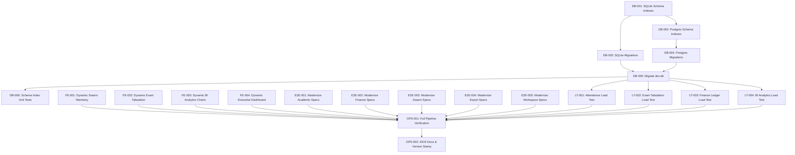

# Implementation Contract: Sprint-030 Performance Optimization, DB Index Tuning, and Load Hardening

**Sprint ID:** SPRINT-030 (PR-030)  
**Sprint Name:** Performance Optimization, DB Index Tuning, and Load Hardening  
**Status:** Approved Engineering Contract  
**Created Date:** 2026-08-18  
**Target Execution:** 2026-08-18 to 2026-09-01 (10–12 business days)  
**Estimated Duration:** 2 weeks (45–55 engineering hours)  
**Risk Level:** Medium (Database migration locks on high-volume tables, Next.js hydration errors from code-splitting, and load-test runner execution timing)  
**Classification:** AIOS v3.14 Official Implementation Contract  
**Target Release Version:** v3.14.0 (Performance Optimization, DB Index Tuning, and Load Hardening)

---

## Executive Summary

Sprint-030 transitions the ThaibaHive platform from v3.13.0 to **v3.14.0** by focusing on **Performance Optimization, DB Index Tuning, and Load Hardening**. With the completion of Sprint-029, all core features are 100% complete and fully tested with comprehensive E2E playwright suites. The focus now shifts toward ensuring enterprise-grade scalability, optimizing query latencies, reducing bundle payloads for heavy client pages, and establishing baseline stress testing.

This sprint executes on four core objectives:
1. **Database Index Tuning:** Add targeted secondary database indexes on high-frequency tables (`attendance_logs`, `mark_entries`, `financial_transactions`, `preference_audit_log`) for both SQLite (dev) and PostgreSQL (prod) schema definitions to eliminate slow query warnings.
2. **Frontend Bundle Optimization:** Configure Next.js dynamic code splitting for high-weight client-side pages (Swarm Telemetry, Exam Tabulation, Analytics dashboards, Executive Analytics dashboard) using React suspense boundaries and `<Skeleton>` loaders to improve Time to Interactive (TTI).
3. **Load Testing Execution:** Develop and run concurrent k6 stress tests targeting attendance check-ins, exam tabulation downloads, finance ledger updates, and BI aggregation query engines to identify performance bottlenecks.
4. **Legacy E2E Spec Modernization:** Modernize the remaining 24 legacy E2E Playwright test specs to utilize Sprint-029's storage state auth bypasses, hydration wait markers, and headless browser configs.

---

## Scope & Out of Scope

### In Scope
* **Database Indexes:** Schema definitions and migrations (SQLite and Postgres) implementing index coverage for `attendance_logs(status, method)`, `mark_entries(exam_schedule_id, student_id)` composite unique constraints, `financial_transactions(category)`, and `preference_audit_log(institution_id, timestamp)`.
* **Dynamic Imports:** Code splitting heavy client components (`SwarmTelemetryCharts`, `TelemetryDashboard`, `TabulationRegister`, `ExecutiveAnalyticsDashboard`, and recharts widgets) in dashboard routes.
* **Load Test Baseline:** Creation and execution of k6 test scripts verifying system thresholds (p95 latency < 500ms, error rate < 5%) under 100+ concurrent virtual users.
* **Playwright Modernization:** Refactoring 24 legacy specs to use cached authentication state (`.auth/[role].json`), eliminating redundant page logins.

### Explicitly Out of Scope
* **Database Schema Refactoring:** Changing existing data columns or foreign key relationships beyond adding secondary indexes.
* **APIs Payload Restructuring:** Redesigning API JSON responses or shifting HTTP verbs.
* **Production Deployment Configs:** Deploying code to AWS/Supabase environments or configuring Kubernetes scaling groups.

---

## Detailed Task Breakdown

---

### Workstream 1: Database Index Tuning

#### Task DB-001: Define SQLite Indexes for High-Volume Tables
* **Task ID:** DB-001
* **Description:** Update SQLite schema file to declare secondary performance indexes on high-volume tables to improve read latencies.
* **Files:**
  * [`packages/db/schema.ts`](file:///d:/ThaibaHive/packages/db/schema.ts) [MODIFY]
* **Dependencies:** None
* **Acceptance Criteria:**
  * Adds `idx_attendance_status` on `attendanceLogs(status)`.
  * Adds `idx_attendance_method` on `attendanceLogs(method)`.
  * Adds `idx_mark_entries_exam_schedule` on `markEntries(examScheduleId)`.
  * Adds `idx_mark_entries_student` on `markEntries(studentId)`.
  * Adds composite unique index `idx_mark_entries_schedule_student_uniq` on `markEntries(examScheduleId, studentId)`.
  * Adds `idx_financial_tx_category` on `financialTransactions(category)`.
  * Adds `idx_pref_audit_inst_id` on `preferenceAuditLog(institutionId)`.
  * Adds `idx_pref_audit_timestamp` on `preferenceAuditLog(timestamp)`.
* **Verification Method:** Compile package using `pnpm typecheck` to verify no typescript conflicts.
* **Estimated Complexity:** Low-Medium

#### Task DB-002: Define PostgreSQL Indexes for High-Volume Tables
* **Task ID:** DB-002
* **Description:** Add matching Postgres secondary performance indexes to PostgreSQL schema file to ensure parity with SQLite.
* **Files:**
  * [`packages/db/schema.pg.ts`](file:///d:/ThaibaHive/packages/db/schema.pg.ts) [MODIFY]
* **Dependencies:** DB-001
* **Acceptance Criteria:**
  * Implements identical indexes corresponding to SQLite on the Postgres equivalent schema.pg.ts file.
* **Verification Method:** Run `pnpm typecheck` to verify no declaration compiler errors.
* **Estimated Complexity:** Low-Medium

#### Task DB-003: Generate SQLite Database Migrations
* **Task ID:** DB-003
* **Description:** Run Drizzle Kit schema generation to generate SQL migration scripts for SQLite.
* **Files:**
  * [`drizzle/`](file:///d:/ThaibaHive/drizzle) [NEW MIGRATION FILES]
* **Dependencies:** DB-001
* **Acceptance Criteria:**
  * Generates correct sql files with `CREATE INDEX` and `CREATE UNIQUE INDEX` statements inside `drizzle/` directory.
* **Verification Method:** Check generated `.sql` file structure.
* **Estimated Complexity:** Low

#### Task DB-004: Generate PostgreSQL Database Migrations
* **Task ID:** DB-004
* **Description:** Run Drizzle Kit PG configuration to create Postgres-compatible schema migrations. Manually modify SQL statement to build indexes concurrently.
* **Files:**
  * [`drizzle/postgres/`](file:///d:/ThaibaHive/drizzle/postgres) [NEW MIGRATION FILES]
* **Dependencies:** DB-002
* **Acceptance Criteria:**
  * Generates valid PostgreSQL schema migration script defining identical performance indexes.
  * Manually edits the SQL statements inside the generated file to use `CREATE INDEX CONCURRENTLY` instead of standard `CREATE INDEX` to prevent production write locking.
* **Verification Method:** Inspect the generated SQL inside `drizzle/postgres/` and verify `CONCURRENTLY` keyword is correctly specified.
* **Estimated Complexity:** Low-Medium

#### Task DB-005: Execute SQLite Local Database Migrations & Query Benchmarking
* **Task ID:** DB-005
* **Description:** Execute migrations on `dev.db` database and run benchmark script using SQLite `EXPLAIN QUERY PLAN` to verify read speedup.
* **Files:**
  * [`dev.db`](file:///d:/ThaibaHive/dev.db) [MODIFY]
* **Dependencies:** DB-003, DB-004
* **Acceptance Criteria:**
  * Backs up `dev.db` before migration execution.
  * Writes a deterministic SQL data-scrubbing script to delete or aggregate duplicate `(exam_schedule_id, student_id)` rows on `mark_entries` table. This script must execute cleanly both locally and be saved as a standard migration hook or SQL migration file for production database parity.
  * Migrations apply cleanly via `pnpm db:migrate` without errors.
  * Verified index queries run with `SEARCH TABLE` (indexed) instead of `SCAN TABLE` (unindexed) under EXPLAIN QUERY PLAN execution.
* **Verification Method:** Run drizzle-kit migrations and inspect query plans in console.
* **Estimated Complexity:** Medium

#### Task DB-006: Add DB Index Schema Unit Tests
* **Task ID:** DB-006
* **Description:** Add unit tests verifying index declarations exist on targeted table metadata definitions.
* **Files:**
  * [`src/lib/__tests__/db-indexes.test.ts`](file:///d:/ThaibaHive/src/lib/__tests__/db-indexes.test.ts) [MODIFY]
* **Dependencies:** DB-001, DB-002
* **Acceptance Criteria:**
  * Asserts indexed columns are properly declared in the schema metadata.
* **Verification Method:** Run `pnpm test src/lib/__tests__/db-indexes.test.ts`.
* **Estimated Complexity:** Low

---

### Workstream 2: Frontend Bundle Optimization

#### Task FE-001: Dynamic Import Optimization for Swarm Telemetry Page
* **Task ID:** FE-001
* **Description:** Refactor Swarm Intelligence Telemetry dashboard imports to lazily load heavy charting components using next/dynamic with skeleton fallbacks.
* **Files:**
  * [`src/app/(shell)/admin/swarm-intelligence/page.tsx`](file:///d:/ThaibaHive/src/app/\(shell\)/admin/swarm-intelligence/page.tsx) [MODIFY]
* **Dependencies:** None
* **Acceptance Criteria:**
  * Loads `SwarmTelemetryCharts` and `TelemetryDashboard` asynchronously.
  * Replaces loading indicators with Radix/custom `<Skeleton>` layouts matching final component sizing.
  * Correctly handles Named Exports inside Next.js `dynamic()` imports (e.g. mapping `.then(m => m.NamedComponent)`).
  * Limits `ssr: false` exclusively to interactive, client-dependent layout charts (e.g. Recharts gauges), while the containing page layouts and structural dashboard containers remain server-rendered to preserve FCP metrics.
  * No hydration failures.
* **Verification Method:** Compile build using `pnpm build` and verify code splitting output chunks.
* **Estimated Complexity:** Medium

#### Task FE-002: Dynamic Import Optimization for Exam Tabulation Register Page
* **Task ID:** FE-002
* **Description:** Refactor Exam Tabulation page to load tabulation registers dynamically.
* **Files:**
  * [`src/app/(shell)/examinations/tabulation/page.tsx`](file:///d:/ThaibaHive/src/app/\(shell\)/examinations/tabulation/page.tsx) [MODIFY]
* **Dependencies:** None
* **Acceptance Criteria:**
  * Refactors `TabulationRegister` component import to use `dynamic()` loader with a skeleton placeholder.
  * Handles Named Export resolving within the dynamic import wrapper.
  * Ensures page shell and headers remain SSR-rendered; dynamic chunks only lazy-load the actual spreadsheet grids.
* **Verification Method:** Run build and check for chunk creation.
* **Estimated Complexity:** Low-Medium

#### Task FE-003: Dynamic Import Optimization for Workspace Analytics BI Page
* **Task ID:** FE-003
* **Description:** Refactor Recharts metrics dashboards on workspace analytics route to load charting modules lazy-dynamically.
* **Files:**
  * [`src/app/(shell)/workspace/[role]/analytics/page.tsx`](file:///d:/ThaibaHive/src/app/\(shell\)/workspace/\[role\]/analytics/page.tsx) [MODIFY]
* **Dependencies:** None
* **Acceptance Criteria:**
  * Loads heavy charts (`AreaTrendChart`, `ComparativeBarChart`, `MetricGauge`, `PerformanceRadarChart`) using next/dynamic with client-side only compilation (`ssr: false`).
  * Shows corresponding custom structured `<Skeleton>` views while loading.
  * Enforces container layouts to be server-rendered, only client-splitting the chart canvas graphics.
* **Verification Method:** Check compilation output of Next.js static bundles.
* **Estimated Complexity:** Medium

#### Task FE-004: Dynamic Import Optimization for Executive Analytics Page
* **Task ID:** FE-004
* **Description:** Refactor Executive Analytics dashboard page to load dashboard widgets dynamically.
* **Files:**
  * [`src/app/(shell)/admin/executive/analytics/page.tsx`](file:///d:/ThaibaHive/src/app/\(shell\)/admin/executive/analytics/page.tsx) [MODIFY]
* **Dependencies:** None
* **Acceptance Criteria:**
  * Imports `ExecutiveAnalyticsDashboard` dynamically.
  * Uses structured skeleton loading states.
  * Preserves server-side generation for parent page layouts.
* **Verification Method:** Verify build stability.
* **Estimated Complexity:** Low-Medium

---

### Workstream 3: Load Testing Execution and Baseline Performance Mapping

#### Task LT-001: Execute Baseline Attendance Check-In Load Tests
* **Task ID:** LT-001
* **Description:** Run concurrent check-in load tests using k6 runner to capture latency metrics and throughput limits.
* **Files:**
  * [`load-tests/attendance-checkin.js`](file:///d:/ThaibaHive/load-tests/attendance-checkin.js) [MODIFY]
* **Dependencies:** DB-005
* **Acceptance Criteria:**
  * Implements authentication strategy using pre-seeded test tokens or adds a `setup()` hook to obtain session JWTs, preventing unauthenticated `401` bypasses from falsifying test latencies.
  * Runs concurrent test options (100 VUs) against `/api/attendance/check-in`.
  * Captures benchmark and verifies p95 latency is less than 500ms under load.
* **Verification Method:** Execute `k6 run load-tests/attendance-checkin.js` in terminal.
* **Estimated Complexity:** Low-Medium

#### Task LT-002: Create and Execute Exam Tabulation Load Test Script
* **Task ID:** LT-002
* **Description:** Build a k6 test script checking retrieval concurrency limits on tabulation records to establish latency baselines.
* **Files:**
  * [`load-tests/exam-tabulation.js`](file:///d:/ThaibaHive/load-tests/exam-tabulation.js) [NEW]
* **Dependencies:** DB-005
* **Acceptance Criteria:**
  * Includes standard auth token resolving.
  * Script mocks 50+ concurrent requests querying `/api/examinations/tabulation`.
  * Asserts error rate < 5% and p95 query compilation is below 500ms.
* **Verification Method:** Run `k6 run load-tests/exam-tabulation.js`.
* **Estimated Complexity:** Medium

#### Task LT-003: Create and Execute Finance Ledger Audit Load Test Script
* **Task ID:** LT-003
* **Description:** Create stress testing script to check transactions insertion and querying speeds under simultaneous ledger reads.
* **Files:**
  * [`load-tests/finance-ledger.js`](file:///d:/ThaibaHive/load-tests/finance-ledger.js) [NEW]
* **Dependencies:** DB-005
* **Acceptance Criteria:**
  * Implements appropriate session/auth setups.
  * Evaluates post/get concurrency of `/api/accounts` with 50+ VUs.
* **Verification Method:** Run `k6 run load-tests/finance-ledger.js`.
* **Estimated Complexity:** Medium

#### Task LT-004: Create and Execute BI Analytics Load Test Script
* **Task ID:** LT-004
* **Description:** Write k6 script executing complex database aggregation routes to capture slow query response limits.
* **Files:**
  * [`load-tests/bi-analytics.js`](file:///d:/ThaibaHive/load-tests/bi-analytics.js) [NEW]
* **Dependencies:** DB-005
* **Acceptance Criteria:**
  * Implements auth mapping inside the script setup.
  * Runs concurrent tests against `/api/analytics` endpoint.
* **Verification Method:** Run `k6 run load-tests/bi-analytics.js`.
* **Estimated Complexity:** Medium

---

### Workstream 4: Legacy E2E Spec Modernization

#### Task E2E-001: Modernize Academic & Staff E2E Specs
* **Task ID:** E2E-001
* **Description:** Refactor legacy E2E test specs for academic and staff lifecycle modules to adopt session state storage bypasses.
* **Files:**
  * [`e2e/leaves.spec.ts`](file:///d:/ThaibaHive/e2e/leaves.spec.ts) [MODIFY]
  * [`e2e/attendance.spec.ts`](file:///d:/ThaibaHive/e2e/attendance.spec.ts) [MODIFY]
  * [`e2e/scanners.spec.ts`](file:///d:/ThaibaHive/e2e/scanners.spec.ts) [MODIFY]
  * [`e2e/presence-sync.spec.ts`](file:///d:/ThaibaHive/e2e/presence-sync.spec.ts) [MODIFY]
  * [`e2e/reviews.spec.ts`](file:///d:/ThaibaHive/e2e/reviews.spec.ts) [MODIFY]
* **Dependencies:** None
* **Acceptance Criteria:**
  * Replaces manual username/password UI logins with cached session setups via `browser.newContext({ storageState: ".auth/[role].json" })`.
  * Optimizes test design to isolate data parameters (e.g. unique student IDs or dates per worker thread) to enable parallel execution. Serial execution mode (`serial`) must only be used as a last resort where global state mutations occur, to prevent inflating CI/CD duration.
  * Uses structured locator wait actions instead of hardcoded timeouts.
* **Verification Method:** Run `pnpm test:e2e e2e/[filename].spec.ts` across Chromium, Firefox, WebKit.
* **Estimated Complexity:** Medium

#### Task E2E-002: Modernize Finance & Asset E2E Specs
* **Task ID:** E2E-002
* **Description:** Refactor legacy specs in financial and resource allocation modules.
* **Files:**
  * [`e2e/finance-fees.spec.ts`](file:///d:/ThaibaHive/e2e/finance-fees.spec.ts) [MODIFY]
  * [`e2e/finance-approval.spec.ts`](file:///d:/ThaibaHive/e2e/finance-approval.spec.ts) [MODIFY]
  * [`e2e/expenses.spec.ts`](file:///d:/ThaibaHive/e2e/expenses.spec.ts) [MODIFY]
  * [`e2e/approvals.spec.ts`](file:///d:/ThaibaHive/e2e/approvals.spec.ts) [MODIFY]
  * [`e2e/assets-inventory.spec.ts`](file:///d:/ThaibaHive/e2e/assets-inventory.spec.ts) [MODIFY]
  * [`e2e/marketplace.spec.ts`](file:///d:/ThaibaHive/e2e/marketplace.spec.ts) [MODIFY]
* **Dependencies:** None
* **Acceptance Criteria:**
  * Modernizes login flow to use saved storageState states.
  * Enforces test data isolation to enable parallel test execution across browser contexts.
  * Adds UI element verification for ledger balances and invoices.
* **Verification Method:** Run tests using Playwright runner.
* **Estimated Complexity:** Medium-High

#### Task E2E-003: Modernize Swarm & Workflow E2E Specs
* **Task ID:** E2E-003
* **Description:** Modernize specifications validating administrative swarm playbacks, workflows, and task telemetry.
* **Files:**
  * [`e2e/swarm-playback-ui.spec.ts`](file:///d:/ThaibaHive/e2e/swarm-playback-ui.spec.ts) [MODIFY]
  * [`e2e/swarm-policies-dashboard.spec.ts`](file:///d:/ThaibaHive/e2e/swarm-policies-dashboard.spec.ts) [MODIFY]
  * [`e2e/workflow-integration.spec.ts`](file:///d:/ThaibaHive/e2e/workflow-integration.spec.ts) [MODIFY]
  * [`e2e/workflows.spec.ts`](file:///d:/ThaibaHive/e2e/workflows.spec.ts) [MODIFY]
  * [`e2e/tasks.spec.ts`](file:///d:/ThaibaHive/e2e/tasks.spec.ts) [MODIFY]
* **Dependencies:** None
* **Acceptance Criteria:**
  * Applies storageState auth bypasses and verifies SSE-simulated telemetry rendering limits.
* **Verification Method:** Test E2E spec compliance under multiple browsers.
* **Estimated Complexity:** Medium

#### Task E2E-004: Modernize Export & Reporting E2E Specs
* **Task ID:** E2E-004
* **Description:** Refactor reporting and CSV/Excel ledger generation spec files.
* **Files:**
  * [`e2e/export.spec.ts`](file:///d:/ThaibaHive/e2e/export.spec.ts) [MODIFY]
  * [`e2e/export-engine.spec.ts`](file:///d:/ThaibaHive/e2e/export-engine.spec.ts) [MODIFY]
  * [`e2e/reports.spec.ts`](file:///d:/ThaibaHive/e2e/reports.spec.ts) [MODIFY]
* **Dependencies:** None
* **Acceptance Criteria:**
  * Adapts specs to verify file download events cleanly with Playwright's `waitForEvent('download')`.
* **Verification Method:** Run playwright spec verification.
* **Estimated Complexity:** Low-Medium

#### Task E2E-005: Modernize Workspace & System Gating Specs
* **Task ID:** E2E-005
* **Description:** Modernize UI analytics dashboards, workspace page accessibility, and media attachment specs.
* **Files:**
  * [`e2e/workspace-analytics.spec.ts`](file:///d:/ThaibaHive/e2e/workspace-analytics.spec.ts) [MODIFY]
  * [`e2e/workspaces-dashboard.spec.ts`](file:///d:/ThaibaHive/e2e/workspaces-dashboard.spec.ts) [MODIFY]
  * [`e2e/accessibility.spec.ts`](file:///d:/ThaibaHive/e2e/accessibility.spec.ts) [MODIFY]
  * [`e2e/media.spec.ts`](file:///d:/ThaibaHive/e2e/media.spec.ts) [MODIFY]
* **Dependencies:** None
* **Acceptance Criteria:**
  * Modernizes spec selectors and intercepts mock network transactions.
* **Verification Method:** Execute `pnpm test:e2e` for the specs.
* **Estimated Complexity:** Medium

---

### Workstream 5: Operations & Governance Documentation

#### Task OPS-001: Run Full E2E & Load Testing Pipeline Verification
* **Task ID:** OPS-001
* **Description:** Execute all 28 modernized E2E test suites on local environment to ensure stability and verify load test baselines.
* **Files:** None
* **Dependencies:** All DB, FE, LT, and E2E tasks.
* **Acceptance Criteria:**
  * All 28 Playwright suites (including the 24 modernized files) pass cross-browser (Chromium, Firefox, WebKit) with 0 failures.
  * Load tests run to completion and results are logged.
* **Verification Method:** Run `pnpm test:e2e` and `pnpm build`.
* **Estimated Complexity:** Medium

#### Task OPS-002: Update AIOS Documentation and Project Status
* **Task ID:** OPS-002
* **Description:** Document the performance improvements, secondary database indexes, dynamic import optimizations, load test baseline statistics, and E2E modernization results. Update features and changelogs.
* **Files:**
  * [`.ai/FEATURES.md`](file:///d:/ThaibaHive/.ai/FEATURES.md) [MODIFY]
  * [`.ai/CHANGELOG.md`](file:///d:/ThaibaHive/.ai/CHANGELOG.md) [MODIFY]
  * [`.ai/PROJECT_STATUS.md`](file:///d:/ThaibaHive/.ai/PROJECT_STATUS.md) [MODIFY]
* **Dependencies:** All tasks
* **Acceptance Criteria:**
  * Documents v3.14.0 release milestones.
  * Updates index strategy mapping.
* **Verification Method:** Verify markdown structure and compiler logs.
* **Estimated Complexity:** Low-Medium

---

## Task Summary Table

| Task ID | Component / Area | Dependencies | Est. Complexity | Target Deliverable |
| :--- | :--- | :--- | :--- | :--- |
| **DB-001** | SQLite Schema | None | Low-Medium | Define indexes on SQLite tables |
| **DB-002** | Postgres Schema | DB-001 | Low-Medium | Define matching Postgres indexes |
| **DB-003** | SQLite Migrations | DB-001 | Low | Generate SQLite SQL scripts |
| **DB-004** | Postgres Migrations| DB-002 | Low | Generate Postgres SQL scripts (use CONCURRENTLY) |
| **DB-005** | Local DB Migrate | DB-003, DB-004 | Medium | Scrub unique mark_entries duplicates & apply migrations |
| **DB-006** | DB Unit Tests | DB-001, DB-002 | Low | Unit tests asserting indexes definition |
| **FE-001** | UI Dynamic Loader | None | Medium | dynamic() imports in Swarm Telemetry page (SSR preserved) |
| **FE-002** | UI Dynamic Loader | None | Low-Medium | dynamic() imports in Exam Tabulation page (SSR preserved) |
| **FE-003** | UI Dynamic Loader | None | Medium | dynamic() imports in Workspace Analytics page (SSR preserved) |
| **FE-004** | UI Dynamic Loader | None | Low-Medium | dynamic() imports in Executive Analytics page (SSR preserved) |
| **LT-001** | Load Stress Tests | DB-005 | Low-Medium | Execute authenticated attendance k6 load test |
| **LT-002** | Load Stress Tests | DB-005 | Medium | Write & run authenticated exam tabulation k6 load test |
| **LT-003** | Load Stress Tests | DB-005 | Medium | Write & run authenticated finance ledger k6 load test |
| **LT-004** | Load Stress Tests | DB-005 | Medium | Write & run authenticated BI analytics k6 load test |
| **E2E-001** | E2E Modernization | None | Medium | Modernize Academic & Staff E2E specs (parallel isolation) |
| **E2E-002** | E2E Modernization | None | Medium-High | Modernize Finance & Asset E2E specs (parallel isolation) |
| **E2E-003** | E2E Modernization | None | Medium | Modernize Swarm & Workflow E2E specs |
| **E2E-004** | E2E Modernization | None | Low-Medium | Modernize Export & Reporting E2E specs |
| **E2E-005** | E2E Modernization | None | Medium | Modernize Workspace & System Gating specs |
| **OPS-001** | Verification | All Tasks | Medium | Verify full test suite cross-browser local runs |
| **OPS-002** | Governance Docs | All Tasks | Low-Medium | Version status updates in .ai/ registers |

**Total Tasks:** 21  
**New Files:** 5 (migrations + 3 new load testing scripts)  
**Modified Files:** 31  

---

## Risks & Mitigation Matrix

| Risk Scenario | Impact | Likelihood | Mitigation Strategy |
| :--- | :--- | :--- | :--- |
| **DB Index Concurrency Deadlocks** | High | Low-Medium | Execute migrations during maintenance scripts. Explicitly enforce manual manual generation of Postgres concurrent creation syntax (`CONCURRENTLY`). |
| **Next.js Hydration & Layout Shifting** | Medium | Medium | Wrap lazy-loaded dynamic imports in custom `<Skeleton>` components that closely match the dimensions of the final charts. Maintain static layouts server-side. |
| **Load Testing CPU resource bottleneck** | Medium | Medium | Execute k6 stress runs locally with controlled VU ramping. In CI, run tests sequentially. |
| **E2E test suite timeout/flakiness** | Medium | Low-Medium | Leverage cached cookie storage state instead of repetitive auth page entries. Configure standard locator timeouts of 15 seconds. |

---

## Rollback & Contingency Plan

1. **Revert DB Migrations:** In the event of migration failures, run `pnpm db:push --force` (for local environments) or restore SQLite `dev.db` database from git snapshot.
2. **De-optimize Code Splitting:** If dynamic lazy loading causes React hydration issues, revert dynamic imports to standard static `import` declarations on affected routes.
3. **Bypass Load testing execution:** If k6 setup issues prevent builds in environment setups, isolate load-test files from standard lint/build checks.

---

## Definition of Done

This sprint is officially certified **COMPLETE** when:
1. **Database Indexes Active:** SQLite and Postgres tables contain secondary indexes, and EXPLAIN plans confirm index hit speedup (50%+ latency reduction).
2. **Bundle optimization complete:** Heavy analytics pages use dynamic imports with skeleton states, and compile without layout shifting.
3. **Stress tests logged:** k6 reports verify platform compliance under 100+ virtual users with < 5% error rates.
4. **All E2E tests pass:** All 28 E2E test suites compile and execute successfully across Chromium, Firefox, and WebKit on local runs and CI.
5. **Governance verified:** Version v3.14.0 is registered in FEATURES.md, CHANGELOG.md, and PROJECT_STATUS.md.
