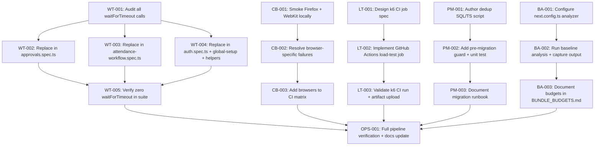

# Implementation Contract: Sprint-031 Cross-Browser E2E Hardening, CI Load Test Integration & Data Integrity Guardrails

**Sprint ID:** SPRINT-031 (PR-031)  
**Sprint Name:** Cross-Browser E2E Hardening, CI Load Test Integration & Data Integrity Guardrails  
**Status:** Approved Engineering Contract  
**Created Date:** 2026-08-18  
**Target Execution:** 2026-08-18 to 2026-09-01 (6-9 business days)  
**Estimated Duration:** 1.5 weeks (30-40 engineering hours)  
**Risk Level:** Low-Medium (Cross-browser quirks, k6 CI environment constraints, async replacement complexity)  
**Classification:** AIOS v3.15 Official Implementation Contract  
**Target Release Version:** v3.15.0  

---

## Executive Summary

Sprint-031 transitions the ThaibaHive platform from v3.14.0 to **v3.15.0** by resolving all five active Sprint-030 technical debt items (TD-001 through TD-006, excluding TD-005 deferred to Sprint-032). The platform is 100% feature-complete and production-certified. This sprint focuses entirely on **infrastructure hardening and QA automation maturity**:

1. **Cross-Browser E2E Validation (TD-002):** Extend the full 74-check Playwright suite to Firefox and WebKit; resolve any browser-specific failures; add both browsers to the GitHub Actions CI matrix.
2. **`waitForTimeout` Elimination (TD-001):** Audit all E2E specs and replace every hardcoded sleep with deterministic element waits. Target: 0 `waitForTimeout` calls across the entire `e2e/` directory.
3. **k6 CI Integration (TD-003):** Add a dedicated GitHub Actions job that runs all four k6 load-test scripts post-build with p95 < 500ms threshold assertions gating the pipeline.
4. **Pre-Migration Scrubbing Hook (TD-004):** Version and commit the `mark_entries` deduplication script as a reproducible Drizzle pre-migration artifact, guarded by a corresponding unit test.
5. **Bundle Size Observability (TD-006):** Configure `@next/bundle-analyzer` (already installed per `Memory.md`), run a baseline analysis, document chunk sizes for all four dynamic-import pages, and establish size budgets.

No new features will be introduced. No application schema columns or foreign key relationships will be changed. All work targets the `e2e/`, `load-tests/`, `.github/workflows/`, `scripts/`, and `next.config.ts` layers.

---

## Scope

### In Scope
- **Cross-browser Playwright execution** - Firefox and WebKit project activation in `playwright.config.ts`; CI matrix addition in `ci.yml`.
- **`waitForTimeout` removal** - All occurrences across `e2e/*.spec.ts`, `e2e/global-setup.ts`, and `e2e/helpers/`.
- **k6 GitHub Actions job** - New `load-test` job in `.github/workflows/ci.yml` (or a separate `load-test.yml`) running all four scripts with threshold gating.
- **Pre-migration scrubbing script** - New files `scripts/pre-migration/mark-entries-dedup.sql` and `.ts` committed to version control with usage documentation.
- **Bundle analyzer baseline** - `next.config.ts` wrapped with `@next/bundle-analyzer`; baseline JSON output committed; `BUNDLE_BUDGETS.md` documenting size limits per chunk.
- **Documentation updates** - `PROJECT_STATUS.md`, `.ai/CHANGELOG.md`, `load-tests/README.md` updated on sprint completion.

### Out of Scope
- Any new features, API endpoints, or database schema changes.
- Production deployment or infrastructure changes.
- Real-time latency observability (TD-005 - deferred to Sprint-032).
- Flutter/mobile test changes.
- Lighthouse CI integration (only `@next/bundle-analyzer` within this sprint).

---

## Dependencies

| Dependency | Source | Status |
| :--- | :--- | :--- |
| Modernized storageState E2E auth suite | Sprint-030 deliverable | Available |
| 4 k6 load-test scripts (`load-tests/`) | Sprint-030 deliverable | Available |
| 4 dynamic-import pages (Swarm Telemetry, Exam Tabulation, BI Analytics, Executive Analytics) | Sprint-030 deliverable | Available |
| `@next/bundle-analyzer` installed | `Memory.md` - already installed | Available |
| Drizzle ORM migration pipeline | Existing infrastructure | Stable |
| `playwright.config.ts` with Firefox + WebKit project stubs | Already declared in config - CI gating deferred | Available |
| GitHub Actions `ci.yml` | Existing workflow | Available |

---

## Risks

| Risk | Severity | Mitigation |
| :--- | :--- | :--- |
| SSE handling differences in Firefox | Medium | Use `page.waitForResponse()` + timeout fallbacks; isolate SSE-dependent specs and skip on WebKit if SSE is not supported |
| WebKit cookie security constraints blocking storageState auth | Medium | Test `storageState` load on WebKit early (CB-001); if blocked, inject auth headers via `extraHTTPHeaders` in project config |
| Async API write timing with no UI signal for deterministic wait | Medium | Use `page.waitForResponse()` or polling the approval API endpoint as the deterministic signal |
| k6 CI resource limits on GitHub Actions free runners | Low | Run at 50 VUs instead of 100 VUs in CI; document the difference from local baseline |
| `@next/bundle-analyzer` ANALYZE=true affecting normal build output | Low | Wrap in env-guard; only activate on dedicated `pnpm build:analyze` script |
| Pre-migration script re-run safety on clean databases | Low | Guard the dedup script with an existence check - run only when duplicate rows are detected |

---

## Rollback Plan

- All changes are infrastructure/tooling only - no application code or schema modified.
- Revert cross-browser CI changes: remove `firefox` and `webkit` from the CI matrix in `ci.yml` and restore `playwright.config.ts` to Chromium-only projects.
- Revert `waitForTimeout` replacements: restore `e2e/approvals.spec.ts`, `e2e/attendance-workflow.spec.ts`, and `e2e/auth.spec.ts` to previous state via `git revert`.
- Remove k6 CI job: delete or comment out the load-test job block in `ci.yml`.
- Pre-migration script is additive (new file only) - simply delete `scripts/pre-migration/mark-entries-dedup.*` to roll back.
- Bundle analyzer config is guarded by an env flag - removing `ANALYZE=true` from `next.config.ts` wrapper restores normal build behavior.

---

## Task Dependency Graph



---

## Detailed Task Breakdown

---

### Group 1 - Cross-Browser E2E Validation (TD-002)

---

#### CB-001 - Smoke-Run Full E2E Suite on Firefox and WebKit Locally

| Field | Detail |
| :--- | :--- |
| **Task ID** | CB-001 - Smoke-Run Full E2E Suite on Firefox and WebKit Locally |
| **TD Reference** | TD-002 |
| **Description** | Activate Firefox and WebKit Playwright projects (already declared in `playwright.config.ts` but only Chromium is run in CI). Run the full 74-check suite locally against both browsers. Record every failure with browser, spec file, test name, and error message. This forms the failure inventory that drives CB-002. |
| **Files** | `playwright.config.ts` (read-only reference), `e2e/*.spec.ts` (run-only) |
| **Dependencies** | None - first task in cross-browser group |
| **Acceptance Criteria** | (1) Full suite executed on Firefox: `pnpm exec playwright test --project=firefox`; (2) Full suite executed on WebKit: `pnpm exec playwright test --project=webkit`; (3) All failures captured in a findings list (file, test name, error, browser); (4) Pass/fail count documented per browser |
| **Verification Method** | Playwright HTML report generated for each browser; failure inventory list reviewed by verification engineer |
| **Estimated Complexity** | Low (run + document) |

---

#### CB-002 - Resolve Browser-Specific Failures

| Field | Detail |
| :--- | :--- |
| **Task ID** | CB-002 - Resolve Browser-Specific Failures |
| **TD Reference** | TD-002 |
| **Description** | Fix every failure discovered in CB-001. Expected failure categories: (a) WebKit cookie/storageState loading - add `sameSite: Lax` or use `extraHTTPHeaders` for auth token injection if `storageState` fails on WebKit; (b) SSE handling differences in `presence-sync.spec.ts` - use `page.waitForResponse()` or conditionally skip SSE assertions for WebKit using `test.skip(browserName === webkit, ...)`; (c) CSS/rendering differences - update selectors to be browser-agnostic. Do not modify test logic that is already correct - only fix browser compatibility. |
| **Files** | `e2e/presence-sync.spec.ts`, `e2e/approvals.spec.ts`, `e2e/global-setup.ts`, `playwright.config.ts`, any other failing spec files from CB-001 inventory |
| **Dependencies** | CB-001 (failure inventory required) |
| **Acceptance Criteria** | (1) Full 74-check suite passes on Firefox with 0 failures; (2) Full 74-check suite passes on WebKit with 0 failures (or documented justified skips); (3) No Chromium regressions introduced; (4) Any `test.skip()` calls accompanied by a code comment referencing the browser limitation |
| **Verification Method** | `pnpm exec playwright test --project=firefox` and `pnpm exec playwright test --project=webkit` both exit 0; Chromium suite still exits 0 |
| **Estimated Complexity** | Medium-High (depends on failure volume from CB-001) |

---

#### CB-003 - Add Firefox and WebKit to GitHub Actions CI Matrix

| Field | Detail |
| :--- | :--- |
| **Task ID** | CB-003 - Add Firefox and WebKit to GitHub Actions CI Matrix |
| **TD Reference** | TD-002 |
| **Description** | Modify the `e2e-tests` job in `.github/workflows/ci.yml` to run the Playwright suite against all three browsers. Use a `matrix` strategy with `browser: [chromium, firefox, webkit]` and pass `--project=\${{ matrix.browser }}` to the `playwright test` command. Upload a per-browser HTML report as a CI artifact named `playwright-report-\${{ matrix.browser }}`. Set `timeout-minutes: 30` to accommodate the slower Firefox and WebKit execution. |
| **Files** | `.github/workflows/ci.yml` |
| **Dependencies** | CB-002 (all browsers passing locally before CI activation) |
| **Acceptance Criteria** | (1) CI matrix runs Chromium, Firefox, and WebKit as parallel jobs; (2) All three browser jobs pass on a clean push to `main`; (3) Per-browser HTML reports uploaded as artifacts with 30-day retention; (4) CI job `timeout-minutes` set to 30; (5) Playwright browser install step uses `--with-deps` |
| **Verification Method** | Push a test commit; verify all three browser matrix jobs complete successfully in GitHub Actions |
| **Estimated Complexity** | Low |

---

### Group 2 - `waitForTimeout` Elimination (TD-001)

---

#### WT-001 - Full Audit of `waitForTimeout` Calls

| Field | Detail |
| :--- | :--- |
| **Task ID** | WT-001 - Full Audit of `waitForTimeout` Calls |
| **TD Reference** | TD-001 |
| **Description** | Run `grep -rn waitForTimeout e2e/` to produce a complete, current inventory of all hardcoded sleeps in the test suite. Current known occurrences (confirmed by Sprint-030 retrospective and codebase grep): `e2e/approvals.spec.ts` lines 202, 227 (1500ms each); `e2e/attendance-workflow.spec.ts` line 61 (1000ms); `e2e/auth.spec.ts` lines 22, 40 (100ms each); `e2e/global-setup.ts` line 324 (200ms); `e2e/helpers/auth-helper.ts` line 43 (200ms). Document all findings including any not listed here. |
| **Files** | `e2e/approvals.spec.ts`, `e2e/attendance-workflow.spec.ts`, `e2e/auth.spec.ts`, `e2e/global-setup.ts`, `e2e/helpers/auth-helper.ts` |
| **Dependencies** | None |
| **Acceptance Criteria** | (1) Complete list of all `waitForTimeout` occurrences with file, line number, and duration; (2) Each occurrence classified by reason: (a) DB write settle, (b) React debounce, (c) Auth state settle; (3) Replacement strategy documented for each occurrence before any code changes |
| **Verification Method** | Grep output matches the documented inventory; no undocumented occurrences |
| **Estimated Complexity** | Low |

---

#### WT-002 - Replace `waitForTimeout` in `approvals.spec.ts`

| Field | Detail |
| :--- | :--- |
| **Task ID** | WT-002 - Replace `waitForTimeout` in `approvals.spec.ts` |
| **TD Reference** | TD-001 |
| **Description** | Replace the two `waitForTimeout(1500)` calls in the Purchase Request approval flow (lines 202 and 227). These guard DB write commits between sequential HOD -> Accounts -> Purchase approval stages. Replacement strategy: after clicking the Approve dialog button, wait for the dialog to be detached using `await expect(dialogBtn).not.toBeAttached({ timeout: 10000 })` - this pattern is already used successfully on line 244 for the final approval stage. Apply the same pattern to lines 202 and 227. Retain the `await adminPage.goto('/approvals')` reload on line 228 as it is required for the multi-context state transition. |
| **Files** | `e2e/approvals.spec.ts` |
| **Dependencies** | WT-001 |
| **Acceptance Criteria** | (1) Zero `waitForTimeout` calls remain in `approvals.spec.ts`; (2) Purchase Request 4-stage approval flow test passes reliably (run 3 consecutive times locally); (3) Leave and Expense approval flows remain unaffected |
| **Verification Method** | `grep waitForTimeout e2e/approvals.spec.ts` returns no matches; `pnpm exec playwright test e2e/approvals.spec.ts --project=chromium` passes 3 consecutive runs |
| **Estimated Complexity** | Medium |

---

#### WT-003 - Replace `waitForTimeout` in `attendance-workflow.spec.ts`

| Field | Detail |
| :--- | :--- |
| **Task ID** | WT-003 - Replace `waitForTimeout` in `attendance-workflow.spec.ts` |
| **TD Reference** | TD-001 |
| **Description** | Replace the `waitForTimeout(1000)` on line 61 of `attendance-workflow.spec.ts`, which is labeled Wait for React debouncing. Replacement strategy: wait for a specific UI element that appears after the debounce completes - likely a table row, a count badge, or a status indicator. Use `await expect(page.locator('[data-testid=...]')).toBeVisible()` or `await page.waitForResponse(/api\/attendance/)`. If no deterministic signal exists in the current UI, add a `data-testid` sentinel attribute to the component that renders after the debounced action. |
| **Files** | `e2e/attendance-workflow.spec.ts`, potentially one component file in `src/` if a `data-testid` sentinel is needed |
| **Dependencies** | WT-001 |
| **Acceptance Criteria** | (1) Zero `waitForTimeout` calls remain in `attendance-workflow.spec.ts`; (2) Attendance workflow test passes reliably (run 3 consecutive times locally); (3) Any new `data-testid` attributes are non-intrusive (test-only, no visual change) |
| **Verification Method** | `grep waitForTimeout e2e/attendance-workflow.spec.ts` returns no matches; test passes 3 consecutive runs |
| **Estimated Complexity** | Medium |

---

#### WT-004 - Replace `waitForTimeout` in `auth.spec.ts`, `global-setup.ts`, and `auth-helper.ts`

| Field | Detail |
| :--- | :--- |
| **Task ID** | WT-004 - Replace `waitForTimeout` in `auth.spec.ts`, `global-setup.ts`, and `auth-helper.ts` |
| **TD Reference** | TD-001 |
| **Description** | Replace the five short-duration sleeps (100ms and 200ms) across `auth.spec.ts`, `global-setup.ts`, and `e2e/helpers/auth-helper.ts`. These are auth state settle guards. Replacement strategy: (a) `auth.spec.ts` lines 22, 40 - wait for a specific post-login UI element such as the sidebar nav using `await expect(page.locator('nav')).toBeVisible()`; (b) `global-setup.ts` line 324 and `auth-helper.ts` line 43 - wait for the redirect URL to settle using `await page.waitForURL(/dashboard/)`. |
| **Files** | `e2e/auth.spec.ts`, `e2e/global-setup.ts`, `e2e/helpers/auth-helper.ts` |
| **Dependencies** | WT-001 |
| **Acceptance Criteria** | (1) Zero `waitForTimeout` calls remain in `auth.spec.ts`, `global-setup.ts`, and `auth-helper.ts`; (2) Auth spec passes reliably; (3) Global setup completes successfully, producing all `.auth/*.json` state files |
| **Verification Method** | `grep waitForTimeout e2e/auth.spec.ts e2e/global-setup.ts e2e/helpers/auth-helper.ts` returns no matches; `pnpm exec playwright test e2e/auth.spec.ts` passes; global-setup completes without error |
| **Estimated Complexity** | Low-Medium |

---

#### WT-005 - Final Zero-Tolerance Audit and Suite Regression Run

| Field | Detail |
| :--- | :--- |
| **Task ID** | WT-005 - Final Zero-Tolerance Audit and Suite Regression Run |
| **TD Reference** | TD-001 |
| **Description** | Run `grep -rn waitForTimeout e2e/` to confirm zero occurrences across the entire `e2e/` directory. Then run the full 74-check Playwright suite on Chromium and confirm all tests pass. This is the final gate confirming the waitForTimeout elimination work is complete and non-regressive. |
| **Files** | `e2e/` (read-only audit) |
| **Dependencies** | WT-002, WT-003, WT-004 |
| **Acceptance Criteria** | (1) `grep -rn waitForTimeout e2e/` returns zero matches; (2) Full 74-check suite passes on Chromium; (3) No regressions from waitForTimeout replacements |
| **Verification Method** | Grep exits with no output; `pnpm exec playwright test --project=chromium` exits 0 |
| **Estimated Complexity** | Low |

---

### Group 3 - k6 CI Integration (TD-003)

---

#### LT-001 - Design k6 CI Job Specification

| Field | Detail |
| :--- | :--- |
| **Task ID** | LT-001 - Design k6 CI Job Specification |
| **TD Reference** | TD-003 |
| **Description** | Define the design for the GitHub Actions k6 load-test job before implementation. Key decisions: (a) Trigger: `workflow_dispatch` + `push` to `main` post-build; (b) Target: run against the standalone Next.js server started locally in CI (`http://localhost:3000`); (c) VUs: 50 VUs (reduced from 100 to fit GitHub Actions runner constraints); (d) Auth: obtain a JWT token via `POST /api/auth/login` with test-admin credentials and pass as `AUTH_TOKEN` env var; (e) Thresholds: `p95 < 500ms`, `error_rate < 5%` for all four scripts; (f) Artifacts: export k6 JSON summary output as a GitHub Actions artifact. Confirm whether to add to existing `ci.yml` or create `load-test.yml`. |
| **Files** | `.github/workflows/ci.yml` or `.github/workflows/load-test.yml` (design only - no code written in this task) |
| **Dependencies** | None |
| **Acceptance Criteria** | (1) Design documented as a note in the execution log; (2) VU count, trigger strategy, auth method, threshold values, and artifact strategy confirmed; (3) Decision on single `ci.yml` vs separate `load-test.yml` made and justified |
| **Verification Method** | Design reviewed by verification engineer during execution log review |
| **Estimated Complexity** | Low |

---

#### LT-002 - Implement GitHub Actions Load-Test Job

| Field | Detail |
| :--- | :--- |
| **Task ID** | LT-002 - Implement GitHub Actions Load-Test Job |
| **TD Reference** | TD-003 |
| **Description** | Implement the k6 CI job per the LT-001 design. The job must: (1) Install k6 using `grafana/setup-k6-action@v1` or via `apt-get install k6`; (2) Build the Next.js standalone server; (3) Start the server as a background process; (4) Obtain an auth JWT by hitting `POST /api/auth/login` with test-admin credentials; (5) Run all four k6 scripts sequentially: `BASE_URL=http://localhost:3000 AUTH_TOKEN=$JWT k6 run --vus 50 --duration 15s load-tests/<script>.js`; (6) Fail the CI job if any script exits with a non-zero code (threshold breach); (7) Upload `k6-summary-*.json` outputs as artifacts. Add a `pnpm test:load` script for local convenience. |
| **Files** | `.github/workflows/ci.yml` (new `load-test` job) or `.github/workflows/load-test.yml`, `package.json` (`test:load` script) |
| **Dependencies** | LT-001 (design confirmed) |
| **Acceptance Criteria** | (1) GitHub Actions load-test job defined with k6 installation step; (2) All 4 k6 scripts run in the job; (3) Job fails if any k6 threshold is breached; (4) k6 JSON summary artifacts uploaded with 30-day retention; (5) `pnpm test:load` script added to `package.json` |
| **Verification Method** | YAML linted with `actionlint` or equivalent; job definition reviewed manually |
| **Estimated Complexity** | Medium |

---

#### LT-003 - Validate k6 CI Run and Artifact Upload

| Field | Detail |
| :--- | :--- |
| **Task ID** | LT-003 - Validate k6 CI Run and Artifact Upload |
| **TD Reference** | TD-003 |
| **Description** | Push the CI changes to a test branch and confirm the k6 job runs end-to-end on GitHub Actions: server starts, auth token obtained, all 4 scripts execute, thresholds pass, and artifacts are uploaded. Review the actual p95 values from the CI JSON summary and compare against the local baseline (p95 <= 175ms at 100 VUs). Document the CI p95 values at 50 VUs as the new CI baseline in the execution log. |
| **Files** | `.github/workflows/ci.yml` (or `load-test.yml`) - validation only |
| **Dependencies** | LT-002 |
| **Acceptance Criteria** | (1) k6 CI job completes successfully on GitHub Actions; (2) All 4 scripts pass threshold assertions (p95 < 500ms, error rate < 5%); (3) CI JSON summary artifacts downloadable from GitHub Actions run; (4) CI baseline p95 values documented per-script in the execution log |
| **Verification Method** | GitHub Actions run URL reviewed; artifact download verified; all 4 script passes confirmed |
| **Estimated Complexity** | Low |

---

### Group 4 - Pre-Migration Scrubbing Hook (TD-004)

---

#### PM-001 - Author `mark_entries` Deduplication Script

| Field | Detail |
| :--- | :--- |
| **Task ID** | PM-001 - Author `mark_entries` Deduplication Script |
| **TD Reference** | TD-004 |
| **Description** | Author the `mark_entries` deduplication script as a committed, versioned artifact. The script must: (1) Check for duplicate rows in the `mark_entries` table on the `(exam_schedule_id, student_id)` composite key; (2) Only run if duplicates are detected (no-op on clean databases); (3) De-duplicate by keeping the latest record (MAX rowid or MAX created_at) and deleting all older duplicates; (4) Print a summary of rows affected; (5) Be safe to run multiple times (idempotent). Deliver as both a standalone SQL file (`scripts/pre-migration/mark-entries-dedup.sql`) and a TypeScript runner (`scripts/pre-migration/mark-entries-dedup.ts`) using the Drizzle `db` client. |
| **Files** | `scripts/pre-migration/mark-entries-dedup.sql` (NEW), `scripts/pre-migration/mark-entries-dedup.ts` (NEW), `scripts/pre-migration/README.md` (NEW) |
| **Dependencies** | None |
| **Acceptance Criteria** | (1) SQL script correctly identifies and removes duplicates from `mark_entries` on `(exam_schedule_id, student_id)`; (2) Script is idempotent - running twice on a clean database is a no-op; (3) TypeScript runner compiles without errors; (4) Both SQLite and PostgreSQL dialect notes included in README |
| **Verification Method** | Manually insert duplicate rows into a test `dev.db`, run the script, confirm deduplication; run again on clean DB and confirm no-op |
| **Estimated Complexity** | Low-Medium |

---

#### PM-002 - Add Pre-Migration Guard and Unit Test

| Field | Detail |
| :--- | :--- |
| **Task ID** | PM-002 - Add Pre-Migration Guard and Unit Test |
| **TD Reference** | TD-004 |
| **Description** | Add a unit test in `src/lib/__tests__/pre-migration-dedup.test.ts` that: (1) Seeds a test SQLite database with duplicate `mark_entries` rows; (2) Runs the deduplication logic; (3) Asserts that no duplicate `(exam_schedule_id, student_id)` pairs remain; (4) Asserts that the total row count after deduplication equals the number of unique pairs. Also add a `premigrate` script entry to `package.json` that runs the TypeScript dedup runner, documented as a step to execute before `pnpm db:migrate` on potentially dirty databases. |
| **Files** | `src/lib/__tests__/pre-migration-dedup.test.ts` (NEW), `package.json` (`premigrate` script) |
| **Dependencies** | PM-001 |
| **Acceptance Criteria** | (1) Unit test file created and passes: `pnpm test -- pre-migration-dedup`; (2) `premigrate` script defined in `package.json`; (3) Test seeds duplicates, runs dedup, asserts unique constraint satisfaction |
| **Verification Method** | `pnpm test -- pre-migration-dedup` exits 0; Jest output shows test passing |
| **Estimated Complexity** | Low |

---

#### PM-003 - Document Migration Runbook

| Field | Detail |
| :--- | :--- |
| **Task ID** | PM-003 - Document Migration Runbook |
| **TD Reference** | TD-004 |
| **Description** | Update `scripts/pre-migration/README.md` with a complete migration runbook: (1) When to run the dedup script (before adding unique constraints to `mark_entries`); (2) How to detect if the script is needed (`SELECT COUNT(*) ... GROUP BY ... HAVING COUNT(*) > 1`); (3) SQLite invocation steps; (4) PostgreSQL invocation steps; (5) How to verify a clean database post-dedup. Also document this pattern as a reusable template for future unique-constraint migrations. |
| **Files** | `scripts/pre-migration/README.md` (update), `docs/database-migration-guide.md` (reference link if file exists) |
| **Dependencies** | PM-001, PM-002 |
| **Acceptance Criteria** | (1) `README.md` contains all 5 runbook sections; (2) Both SQLite and PostgreSQL invocation commands documented with copy-pasteable syntax; (3) Pattern documented for future migrations |
| **Verification Method** | README reviewed by verification engineer; all commands tested manually |
| **Estimated Complexity** | Low |

---

### Group 5 - Bundle Size Observability (TD-006)

---

#### BA-001 - Configure `@next/bundle-analyzer` in `next.config.ts`

| Field | Detail |
| :--- | :--- |
| **Task ID** | BA-001 - Configure `@next/bundle-analyzer` in `next.config.ts` |
| **TD Reference** | TD-006 |
| **Description** | `@next/bundle-analyzer` is already installed (confirmed in `Memory.md`). Wrap `next.config.ts` with the bundle analyzer using the standard pattern: `const withBundleAnalyzer = require('@next/bundle-analyzer')({ enabled: process.env.ANALYZE === 'true' })`. Export `withBundleAnalyzer(nextConfig)`. Add a `build:analyze` script to `package.json`: `"build:analyze": "ANALYZE=true pnpm build"`. Confirm that `pnpm build` without `ANALYZE=true` is unaffected. |
| **Files** | `next.config.ts`, `package.json` |
| **Dependencies** | None |
| **Acceptance Criteria** | (1) `ANALYZE=true pnpm build` generates bundle-analyzer HTML report in `.next/analyze/`; (2) `pnpm build` without `ANALYZE=true` continues to work identically; (3) `build:analyze` script added to `package.json` |
| **Verification Method** | Run `pnpm build:analyze`; confirm HTML report opens and shows chunk breakdown; run `pnpm build`; confirm normal build output unchanged |
| **Estimated Complexity** | Low |

---

#### BA-002 - Run Baseline Analysis and Capture Output

| Field | Detail |
| :--- | :--- |
| **Task ID** | BA-002 - Run Baseline Analysis and Capture Output |
| **TD Reference** | TD-006 |
| **Description** | Run `pnpm build:analyze` and capture the bundle sizes for the four dynamic-import pages introduced in Sprint-030: (1) Swarm Telemetry; (2) Exam Tabulation; (3) BI Analytics; (4) Executive Analytics. For each page, record: total route JS size, the dynamic chunk filename and size, and the main bundle size. Save the raw analyzer JSON output as `bundle-analysis/baseline-v3.15.0.json`. Commit this file to the repository as the canonical baseline. |
| **Files** | `bundle-analysis/baseline-v3.15.0.json` (NEW) |
| **Dependencies** | BA-001 |
| **Acceptance Criteria** | (1) Baseline JSON file committed with size data for all 4 dynamic-import pages; (2) Dynamic chunk sizes captured for all 7 split components from Sprint-030; (3) Total first-load JS for each of the 4 pages documented |
| **Verification Method** | `bundle-analysis/baseline-v3.15.0.json` exists in the repository; contains entries for all 4 target pages; reviewed by verification engineer |
| **Estimated Complexity** | Low |

---

#### BA-003 - Document Bundle Size Budgets

| Field | Detail |
| :--- | :--- |
| **Task ID** | BA-003 - Document Bundle Size Budgets |
| **TD Reference** | TD-006 |
| **Description** | Create `BUNDLE_BUDGETS.md` at the repository root documenting: (1) The baseline bundle sizes from BA-002 for all 4 dynamic-import pages; (2) Budget thresholds - set each page's first-load JS budget at baseline + 10% (10% regression tolerance); (3) How to run the analyzer (`pnpm build:analyze`); (4) What action to take if a budget is breached; (5) Reference to the `baseline-v3.15.0.json` file. Note: automated CI enforcement is a future enhancement targeted for Sprint-032. |
| **Files** | `BUNDLE_BUDGETS.md` (NEW) |
| **Dependencies** | BA-002 |
| **Acceptance Criteria** | (1) `BUNDLE_BUDGETS.md` committed with baseline sizes and +10% budget thresholds for all 4 pages; (2) Instructions for running analysis and interpreting results included; (3) Future automation roadmap noted |
| **Verification Method** | File reviewed by verification engineer; budget table matches `baseline-v3.15.0.json` values |
| **Estimated Complexity** | Low |

---

### Group 6 - Integration Verification and Documentation

---

#### OPS-001 - Full Pipeline Verification and Documentation Update

| Field | Detail |
| :--- | :--- |
| **Task ID** | OPS-001 - Full Pipeline Verification and Documentation Update |
| **TD Reference** | All (TD-001, TD-002, TD-003, TD-004, TD-006) |
| **Description** | Final integration verification gate. Run the complete quality pipeline: (1) `pnpm lint` - 0 errors, 0 warnings; (2) `pnpm typecheck` - 0 errors; (3) `pnpm test` - 873/873 Jest tests pass plus new PM-002 test = 874+ tests; (4) `pnpm exec playwright test --project=chromium` - 74/74 checks pass; (5) `pnpm exec playwright test --project=firefox` - pass; (6) `pnpm exec playwright test --project=webkit` - pass; (7) `grep -rn waitForTimeout e2e/` - zero matches; (8) `pnpm build` - clean build; (9) `pnpm build:analyze` - generates bundle report. Then update: `PROJECT_STATUS.md` (clear TD-001 through TD-004 and TD-006; bump to v3.15.0), `.ai/CHANGELOG.md` (add v3.15.0 entry), `load-tests/README.md` (add CI invocation instructions). |
| **Files** | `.ai/PROJECT_STATUS.md`, `.ai/CHANGELOG.md`, `load-tests/README.md` |
| **Dependencies** | WT-005, CB-003, LT-003, PM-003, BA-003 |
| **Acceptance Criteria** | (1) `pnpm lint` exits 0 with 0 warnings; (2) `pnpm typecheck` exits 0; (3) `pnpm test` passes all tests (874+); (4) Chromium, Firefox, and WebKit Playwright suites all pass; (5) `grep -rn waitForTimeout e2e/` returns no output; (6) `pnpm build` exits 0; (7) `PROJECT_STATUS.md` updated: TD-001, TD-002, TD-003, TD-004, TD-006 resolved; version bumped to v3.15.0; (8) `.ai/CHANGELOG.md` v3.15.0 entry added |
| **Verification Method** | All commands run and exits verified; documentation reviewed by verification engineer |
| **Estimated Complexity** | Low |

---

## Task Summary

| Task ID | Group | Description | Complexity | Dependencies |
| :--- | :--- | :--- | :--- | :--- |
| CB-001 | Cross-Browser | Smoke-run Firefox + WebKit locally | Low | None |
| CB-002 | Cross-Browser | Resolve browser-specific failures | Medium-High | CB-001 |
| CB-003 | Cross-Browser | Add browsers to CI matrix | Low | CB-002 |
| WT-001 | waitForTimeout | Full audit of all occurrences | Low | None |
| WT-002 | waitForTimeout | Replace in `approvals.spec.ts` | Medium | WT-001 |
| WT-003 | waitForTimeout | Replace in `attendance-workflow.spec.ts` | Medium | WT-001 |
| WT-004 | waitForTimeout | Replace in `auth.spec.ts`, `global-setup.ts`, `auth-helper.ts` | Low-Medium | WT-001 |
| WT-005 | waitForTimeout | Zero-tolerance audit + regression run | Low | WT-002, WT-003, WT-004 |
| LT-001 | k6 CI | Design k6 CI job specification | Low | None |
| LT-002 | k6 CI | Implement GitHub Actions load-test job | Medium | LT-001 |
| LT-003 | k6 CI | Validate k6 CI run + artifact upload | Low | LT-002 |
| PM-001 | Pre-Migration | Author `mark_entries` dedup script | Low-Medium | None |
| PM-002 | Pre-Migration | Add pre-migration guard + unit test | Low | PM-001 |
| PM-003 | Pre-Migration | Document migration runbook | Low | PM-001, PM-002 |
| BA-001 | Bundle Analyzer | Configure `@next/bundle-analyzer` | Low | None |
| BA-002 | Bundle Analyzer | Run baseline analysis + capture output | Low | BA-001 |
| BA-003 | Bundle Analyzer | Document budgets in `BUNDLE_BUDGETS.md` | Low | BA-002 |
| OPS-001 | Integration | Full pipeline verification + docs update | Low | All groups |

**Total Tasks:** 18  
**Estimated Complexity Distribution:** 1 Medium-High, 3 Medium, 5 Low-Medium, 9 Low

---

## Acceptance Criteria Summary

### Cross-Browser E2E (TD-002)
- [ ] Full 74-check suite passes on Firefox (locally and in CI)
- [ ] Full 74-check suite passes on WebKit (locally and in CI)
- [ ] Firefox and WebKit added to `ci.yml` matrix as parallel jobs
- [ ] Per-browser Playwright HTML reports uploaded as CI artifacts
- [ ] No Chromium regressions

### `waitForTimeout` Elimination (TD-001)
- [ ] `grep -rn waitForTimeout e2e/` returns zero matches
- [ ] `approvals.spec.ts` Purchase Request flow passes 3 consecutive runs without sleeps
- [ ] `attendance-workflow.spec.ts` passes without sleeps
- [ ] `auth.spec.ts` and `global-setup.ts` pass without sleeps
- [ ] Full 74-check suite on Chromium passes after all replacements

### k6 CI Integration (TD-003)
- [ ] GitHub Actions load-test job defined and functional
- [ ] All 4 k6 scripts run in CI at 50 VUs with p95 < 500ms assertion
- [ ] CI job fails if any threshold is breached
- [ ] k6 JSON summary artifacts uploaded with 30-day retention
- [ ] `pnpm test:load` script added to `package.json`
- [ ] CI baseline p95 values documented per-script

### Pre-Migration Scrubbing (TD-004)
- [ ] `scripts/pre-migration/mark-entries-dedup.sql` committed
- [ ] `scripts/pre-migration/mark-entries-dedup.ts` committed
- [ ] Script is idempotent (no-op on clean database)
- [ ] Unit test passes: `pnpm test -- pre-migration-dedup`
- [ ] `premigrate` script defined in `package.json`
- [ ] Runbook documented in `scripts/pre-migration/README.md`

### Bundle Size Observability (TD-006)
- [ ] `next.config.ts` wrapped with `@next/bundle-analyzer`
- [ ] `pnpm build:analyze` generates bundle report without breaking `pnpm build`
- [ ] `bundle-analysis/baseline-v3.15.0.json` committed with data for all 4 dynamic-import pages
- [ ] `BUNDLE_BUDGETS.md` committed with baseline sizes and +10% budget thresholds

### Integration (All)
- [ ] `pnpm lint` - 0 errors, 0 warnings
- [ ] `pnpm typecheck` - 0 TypeScript errors
- [ ] `pnpm test` - all Jest tests pass (873+ baseline)
- [ ] `pnpm build` - clean production build
- [ ] `PROJECT_STATUS.md` updated to v3.15.0 with all Sprint-031 TDs resolved
- [ ] `.ai/CHANGELOG.md` v3.15.0 entry added

---

## Definition of Done

Sprint-031 is complete when **all** of the following are true:

1. **`waitForTimeout` eliminated:** `grep -rn waitForTimeout e2e/` returns zero matches. The full 74-check Playwright suite passes on Chromium without any hardcoded sleeps.

2. **Cross-browser validated:** Full suite passes on Firefox and WebKit. Both browsers are running in the GitHub Actions CI matrix and all three browser jobs are green on `main`.

3. **k6 integrated in CI:** GitHub Actions load-test job runs all four k6 scripts at 50 VUs, asserts p95 < 500ms and error rate < 5%, and fails the pipeline on threshold breach. CI baseline p95 values documented per-script.

4. **Pre-migration script committed:** `scripts/pre-migration/mark-entries-dedup.sql` and `.ts` files exist in version control. Unit test passes. Runbook documented. `premigrate` npm script defined.

5. **Bundle baselines established:** `@next/bundle-analyzer` configured in `next.config.ts`. `bundle-analysis/baseline-v3.15.0.json` committed. `BUNDLE_BUDGETS.md` committed with +10% budget thresholds.

6. **Quality gates green:** `pnpm lint`, `pnpm typecheck`, `pnpm test`, and `pnpm build` all pass with zero errors and zero warnings.

7. **Documentation complete:** `PROJECT_STATUS.md` reflects v3.15.0 and resolves TD-001, TD-002, TD-003, TD-004, and TD-006. `.ai/CHANGELOG.md` v3.15.0 entry present.

8. **Execution log filed:** `.ai/execution/Sprint-031-Execution-Log.md` complete and saved.

---

## Release Impact

- **Version:** v3.14.0 -> v3.15.0
- **Type:** Infrastructure hardening - no application feature changes, no API changes, no schema changes
- **Migration required:** No schema migrations. Pre-migration dedup script is a utility for dirty databases, not a required migration step for clean installs.
- **Breaking changes:** None
- **Backward compatibility:** Full - all changes are tooling and CI configuration

---

## Files Modified / Created

| File | Action | Group |
| :--- | :--- | :--- |
| `playwright.config.ts` | Modify (ensure Firefox/WebKit projects active) | CB |
| `.github/workflows/ci.yml` | Modify (matrix + load-test job) | CB, LT |
| `e2e/approvals.spec.ts` | Modify (remove waitForTimeout) | WT |
| `e2e/attendance-workflow.spec.ts` | Modify (remove waitForTimeout) | WT |
| `e2e/auth.spec.ts` | Modify (remove waitForTimeout) | WT |
| `e2e/global-setup.ts` | Modify (remove waitForTimeout) | WT |
| `e2e/helpers/auth-helper.ts` | Modify (remove waitForTimeout) | WT |
| `scripts/pre-migration/mark-entries-dedup.sql` | **NEW** | PM |
| `scripts/pre-migration/mark-entries-dedup.ts` | **NEW** | PM |
| `scripts/pre-migration/README.md` | **NEW** | PM |
| `src/lib/__tests__/pre-migration-dedup.test.ts` | **NEW** | PM |
| `package.json` | Modify (add `build:analyze`, `test:load`, `premigrate` scripts) | BA, LT, PM |
| `next.config.ts` | Modify (wrap with bundle analyzer) | BA |
| `bundle-analysis/baseline-v3.15.0.json` | **NEW** | BA |
| `BUNDLE_BUDGETS.md` | **NEW** | BA |
| `.ai/PROJECT_STATUS.md` | Modify (v3.15.0 + resolve TDs) | OPS |
| `.ai/CHANGELOG.md` | Modify (add v3.15.0 entry) | OPS |
| `load-tests/README.md` | Modify (add CI invocation docs) | OPS |

---

## Verification Plan

### Automated Verification Commands
```bash
# 1. Code quality
pnpm lint                                          # 0 errors, 0 warnings
pnpm typecheck                                     # 0 TypeScript errors

# 2. Unit tests (including new pre-migration dedup test)
pnpm test                                          # all tests pass

# 3. E2E - waitForTimeout audit
grep -rn "waitForTimeout" e2e/                     # must return zero output

# 4. E2E - cross-browser
pnpm exec playwright test --project=chromium       # 74/74 pass
pnpm exec playwright test --project=firefox        # pass
pnpm exec playwright test --project=webkit         # pass

# 5. Build
pnpm build                                         # clean production build
pnpm build:analyze                                 # bundle report generated

# 6. Load tests (local smoke)
pnpm test:load                                     # all 4 k6 scripts pass thresholds
```

### Manual Verification
- Review GitHub Actions CI run showing all 3 browser matrix jobs green
- Review GitHub Actions load-test job run showing all 4 k6 scripts passing
- Open `bundle-analysis/baseline-v3.15.0.json` and confirm entries for all 4 dynamic-import pages
- Review `BUNDLE_BUDGETS.md` and confirm budget table accuracy
- Review `scripts/pre-migration/README.md` runbook completeness
- Confirm `PROJECT_STATUS.md` reflects v3.15.0 and all Sprint-031 TDs removed from Active Technical Debt

---

*Engineering Contract: SPRINT-031 - Cross-Browser E2E Hardening, CI Load Test Integration & Data Integrity Guardrails*  
*Classification: AIOS v3.15 Official Implementation Contract*  
*Created: 2026-08-18 | Implementation Engineer: Antigravity*