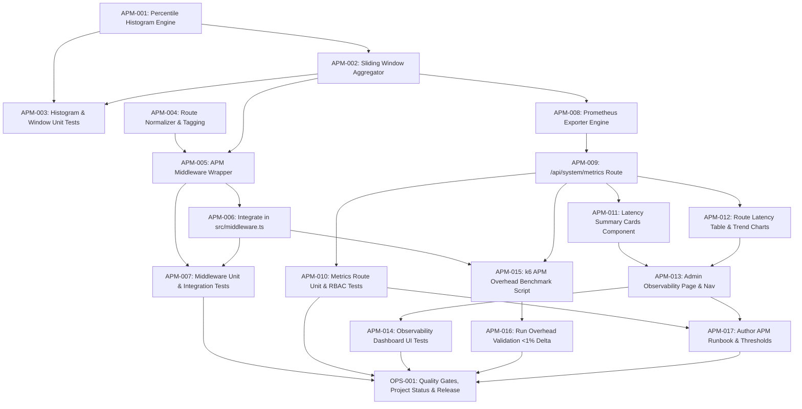

# Implementation Contract: Sprint-032 Production Latency Observability Infrastructure

**Sprint ID:** SPRINT-032 (PR-032)  
**Sprint Name:** Production Latency Observability Infrastructure  
**Status:** Approved Engineering Contract  
**Created Date:** 2026-08-19  
**Target Execution:** 2026-08-19 to 2026-09-02 (10-14 business days)  
**Estimated Duration:** 2-3 weeks (45-60 engineering hours)  
**Risk Level:** Medium (Low-overhead in-memory aggregation, Next.js middleware timing accuracy, memory bounding)  
**Classification:** AIOS v3.16 Official Implementation Contract  
**Target Release Version:** v3.16.0  
**Technical Debt Reference:** TD-005 (HIGH Priority - Real-Time Latency Observability)  

---

## Executive Summary

Sprint-032 transitions the ThaibaHive platform from v3.15.0 to **v3.16.0** by delivering **Production Latency Observability Infrastructure**, resolving the highest-priority active technical debt item (**TD-005**). 

While the platform has achieved 100% functional completeness and comprehensive CI testing in v3.15.0, production performance monitoring currently relies exclusively on periodic, synthetic k6 load test executions rather than continuous, real-time observability. Production operations lack live visibility into API route latencies, tail latency degradations (p95/p99), and emerging database or network bottlenecks.

This sprint implements a lightweight, zero-overhead APM (Application Performance Monitoring) telemetry layer embedded into the Next.js request pipeline:
1. **Core Percentile Calculation Engine:** High-dynamic-range in-memory percentile calculator tracking p50, p90, p95, and p99 response times with sliding-window time buckets (1m, 5m, 15m, 1h) and strict memory bounding (<50MB).
2. **APM Middleware Timing Layer:** High-precision, monotonic request-scoped latency tracking and route normalization integrated into the Next.js middleware pipeline.
3. **Prometheus & JSON Metrics Endpoint:** Authenticated `/api/system/metrics` endpoint exporting OpenMetrics / Prometheus standard text format alongside structured JSON snapshots.
4. **Admin Observability Console:** Interactive dashboard within the admin shell displaying live latency percentiles, error rate breakdowns, route-level filtering, and threshold degradation indicators.
5. **Overhead Benchmark & Validation:** Automated k6 benchmark verifying that metric capture incurs less than 1% CPU overhead and <2ms latency impact under production load.
6. **Operational Runbook & Documentation:** Threshold tuning guidelines, SLA alert configurations, and ecosystem integration guides (Prometheus/Grafana).

---

## Scope

### In Scope
- **Latency Percentile Engine:** Monotonic clock recording, HDR histogram / reservoir sampling algorithms, sliding window aggregations (1m, 5m, 15m, 1h), and automatic memory bounding.
- **Request Route Normalization:** Path parameter anonymization and normalization (e.g., `/api/students/123` -> `/api/students/:id`, `/api/departments/cs/stats` -> `/api/departments/:dept/stats`).
- **Next.js Middleware Integration:** Edge-safe, low-overhead request timing interceptor with header injection (`x-response-time`) and bypass for static assets.
- **Prometheus Metrics Exposition:** `/api/system/metrics` route supporting both Prometheus text format (`text/plain; version=0.0.4`) and JSON (`application/json`), guarded by RBAC (`super_admin`) and shared-secret authentication.
- **Admin Observability UI:** `/admin/observability` page featuring real-time cards (p50, p95, p99, throughput, error rate), route latency table with sorting/filtering, and Recharts latency trend visualizations with 10-second polling.
- **k6 Overhead Benchmark:** `load-tests/apm-overhead-benchmark.js` automated script validating <1% performance impact.
- **Operational Documentation:** `docs/observability-latency-runbook.md` with SLA thresholds, interpretation guide, and Prometheus scrape config.
- **AIOS Governance Updates:** `PROJECT_STATUS.md` (clearing TD-005, bumping to v3.16.0), `.ai/CHANGELOG.md`, and execution logging.

### Out of Scope
- External time-series database provisioning (InfluxDB, TimescaleDB, or managed Prometheus instances) — in-memory with scrape endpoint is delivered.
- Distributed tracing spans / W3C TraceContext propagation across external microservices.
- Mobile Flutter app local database sync telemetry (TD-007 — planned for subsequent iteration).
- Automated canary staging deployment pipelines (TD-008 — planned for subsequent iteration).
- Modifying core application business logic or database schema tables.

---

## Dependencies

| Dependency | Source | Status |
| :--- | :--- | :--- |
| Next.js 16 App Router Middleware | `src/middleware.ts` | Stable |
| Existing Admin Shell Layout & UI Primitives | `src/app/(shell)/admin/layout.tsx`, `src/components/ui/` | Stable |
| Role-Based Access Control (RBAC) System | `@thaiba/auth`, `src/lib/api/auth-guard.ts` | Stable |
| Existing EventBus & Observability Directory | `src/lib/observability/` | Available |
| Recharts Visualization Library | `package.json` (`recharts: ^3.10.1`) | Installed |
| k6 Load Testing Infrastructure | `load-tests/`, `package.json` (`test:load`) | Stable |
| Jest Test Environment & SWC Transpiler | `jest.config.js`, `@swc/jest` | Stable |

---

## Risks

| Risk | Severity | Mitigation |
| :--- | :--- | :--- |
| **Telemetry In-Memory Growth:** Unbounded route tracking could lead to memory leak or heap exhaustion. | High | Implement fixed-size reservoir sampling and LRU route table eviction capping active route buckets to 250 distinct paths (<50MB RAM footprint). |
| **Middleware Timing Overhead:** Extra processing on every incoming HTTP request could inflate latency. | Medium | Use lightweight monotonic timestamps (`performance.now()`), pre-compiled regex route matchers, and non-blocking asynchronous metric enqueueing. |
| **Next.js Edge Middleware Limitations:** Node.js native crypto or file system APIs might fail in Edge runtime if invoked in middleware. | Medium | Ensure all middleware-executed telemetry routines use pure Web Standard APIs (`crypto.randomUUID()`, `performance.now()`, `Map`, `ArrayBuffer`). |
| **Route Cardinality Explosion:** High-variance URL query strings or raw IDs in paths could create thousands of distinct metric labels. | Medium | Implement strict route normalization transforming path variables into standardized tokens (`:id`, `:uuid`, `:slug`) and stripping query params before metric recording. |
| **Metrics Route Scraping DoS:** Frequent unauthenticated scraping of `/api/system/metrics` could degrade server resources. | Low | Protect endpoint with strict RBAC (`super_admin` session) or timing-safe `x-metrics-secret` bearer authentication, plus 1-second in-memory response caching. |

---

## Rollback Plan

- **Clean Decoupling:** The APM telemetry middleware is designed as an additive interceptor. If latency degradation occurs in production, disable APM collection instantly by setting environment variable `APM_TELEMETRY_ENABLED=false` without requiring code redeployment.
- **Middleware Reversion:** Revert modifications in `src/middleware.ts` to restore the pre-Sprint-032 proxy handler.
- **Zero Schema Migrations:** Because all metric aggregation is stored in-memory and rendered via API routes, rolling back requires zero database schema migrations or data backfills.
- **Git Reversion:** Use `git revert` targeting the Sprint-032 release commit.

---

## Task Dependency Graph



---

## Detailed Task Breakdown

---

### Group 1 - Core Percentile Calculation Engine & Aggregation (TD-005)

---

#### APM-001 - Implement HDR Histogram / Reservoir Percentile Engine

| Field | Detail |
| :--- | :--- |
| **Task ID** | APM-001 |
| **TD Reference** | TD-005 |
| **Description** | Implement a high-performance in-memory percentile calculation engine in `src/lib/observability/latency-histogram.ts`. Must use a compressed dynamic binning / reservoir sampling structure capable of tracking latencies from 0.1ms to 60,000ms with <1% relative error. Must compute exact counts, mean, min, max, and exact p50, p90, p95, and p99 percentiles on demand. Must support thread-safe reset, snapshot cloning, and constant-time `record(durationMs)` operations. |
| **Files** | `src/lib/observability/latency-histogram.ts` (NEW) |
| **Dependencies** | None - foundational engine task |
| **Acceptance Criteria** | (1) `LatencyHistogram` class implements `record(ms: number)`, `getPercentile(p: number)`, `getSnapshot()`, and `reset()`; (2) Accurate computation of p50, p90, p95, and p99 within 1% error margin against known distributions; (3) Execution time per `record()` is < 0.05ms; (4) Memory footprint per histogram instance is < 64KB. |
| **Verification Method** | Standalone benchmark and mathematical assertion test verifying calculated percentiles against pre-computed synthetic datasets (uniform, normal, and bimodal distributions). |
| **Estimated Complexity** | Medium |

---

#### APM-002 - Implement Sliding-Window Metric Aggregator & Ring Buffer

| Field | Detail |
| :--- | :--- |
| **Task ID** | APM-002 |
| **TD Reference** | TD-005 |
| **Description** | Create `src/lib/observability/sliding-window-aggregator.ts` to manage time-bucketed metric aggregation across active API routes. Maintain rolling windows for 1 minute (6x10s buckets), 5 minutes (5x1m buckets), 15 minutes, and 1 hour. Structure route metrics with route path, HTTP method, status code class (2xx, 3xx, 4xx, 5xx), total requests, error count, and associated `LatencyHistogram`. Implement automatic eviction for stale routes and cap total active routes to 250 to guarantee memory bounding (<50MB). |
| **Files** | `src/lib/observability/sliding-window-aggregator.ts` (NEW) |
| **Dependencies** | APM-001 |
| **Acceptance Criteria** | (1) `SlidingWindowAggregator` provides singleton access with `recordRequest(route, method, statusCode, durationMs)`; (2) Maintains rolling 1m, 5m, 15m, and 1h aggregations; (3) Correctly rotates and purges expired time buckets; (4) Memory cap enforced with LRU eviction when route count exceeds 250; (5) Provides aggregate cluster stats (global throughput, global p50/p95/p99, global error rate). |
| **Verification Method** | Unit test simulating rolling time advancement using mocked timers (`jest.useFakeTimers()`) and asserting bucket rotation and LRU eviction. |
| **Estimated Complexity** | Medium |

---

#### APM-003 - Unit Tests for Latency Histogram and Sliding Window

| Field | Detail |
| :--- | :--- |
| **Task ID** | APM-003 |
| **TD Reference** | TD-005 |
| **Description** | Author comprehensive Jest unit test suites for the core percentile engine and sliding window aggregator in `src/lib/observability/__tests__/latency-histogram.test.ts` and `src/lib/observability/__tests__/sliding-window-aggregator.test.ts`. Cover edge cases: zero requests, identical latencies, extreme outliers (e.g., 120,000ms), sub-millisecond durations (0.2ms), rapid concurrent updates (10,000 records), bucket rollover, and memory capping under route explosion simulation. |
| **Files** | `src/lib/observability/__tests__/latency-histogram.test.ts` (NEW), `src/lib/observability/__tests__/sliding-window-aggregator.test.ts` (NEW) |
| **Dependencies** | APM-001, APM-002 |
| **Acceptance Criteria** | (1) 100% test pass rate across both test suites; (2) Line coverage > 95% on `latency-histogram.ts` and `sliding-window-aggregator.test.ts`; (3) Statistical accuracy verified with 1,000 random samples; (4) Memory leak test passes with zero unbounded growth after 100,000 mock requests. |
| **Verification Method** | `pnpm test -- latency-histogram` and `pnpm test -- sliding-window-aggregator` exit 0 with all assertions passing. |
| **Estimated Complexity** | Low-Medium |

---

### Group 2 - Next.js APM Middleware & Route-Scoped Tracking (TD-005)

---

#### APM-004 - Implement Request Path Normalization & Tagging Utility

| Field | Detail |
| :--- | :--- |
| **Task ID** | APM-004 |
| **TD Reference** | TD-005 |
| **Description** | Create `src/lib/observability/route-normalizer.ts` to normalize dynamic URL paths into canonical parameterized route templates before metric aggregation. Examples: `/api/students/cm7abc123/profile` -> `/api/students/:id/profile`, `/api/departments/42` -> `/api/departments/:id`, `/api/media/files/019123-abc-def` -> `/api/media/files/:uuid`. Query parameters and trailing slashes must be stripped. Include an allowlist of known static API prefixes and fallback regex sanitizers to prevent route cardinality explosion. |
| **Files** | `src/lib/observability/route-normalizer.ts` (NEW), `src/lib/observability/__tests__/route-normalizer.test.ts` (NEW) |
| **Dependencies** | None |
| **Acceptance Criteria** | (1) `normalizeRoutePath(url: string)` accurately identifies UUIDs, CUIDs, numeric IDs, slugs, and hashes, replacing them with standardized tokens (`:id`, `:uuid`, `:slug`); (2) Query parameters stripped completely; (3) Execution time < 0.01ms per path; (4) Full unit test coverage for all canonical API routes in the application. |
| **Verification Method** | `pnpm test -- route-normalizer` passes with 100% assertions green on test cases including nested dynamic paths and malformed URIs. |
| **Estimated Complexity** | Low-Medium |

---

#### APM-005 - Implement Request APM Telemetry Middleware Wrapper

| Field | Detail |
| :--- | :--- |
| **Task ID** | APM-005 |
| **TD Reference** | TD-005 |
| **Description** | Create `src/lib/middleware/apm-telemetry.ts` implementing the APM request timing interceptor. The module must capture start timestamp with `performance.now()`, calculate total request execution duration upon response generation, record the normalized metric via `SlidingWindowAggregator`, append an `x-response-time: <duration>ms` header to the outbound `NextResponse`, and emit warning events to `EventBus` if request latency breaches SLA threshold (e.g., > 1000ms). Must feature an environment flag `APM_TELEMETRY_ENABLED` (default true) allowing instant kill-switch deactivation. |
| **Files** | `src/lib/middleware/apm-telemetry.ts` (NEW) |
| **Dependencies** | APM-002, APM-004 |
| **Acceptance Criteria** | (1) APM wrapper measures request duration with sub-millisecond precision; (2) Injects `x-response-time` header on all API responses; (3) Dispatches metrics asynchronously to `SlidingWindowAggregator`; (4) Publishes high-latency warning to `EventBus` when duration > 1000ms; (5) Respects `APM_TELEMETRY_ENABLED=false` bypass flag. |
| **Verification Method** | Unit test verifying header injection, metric registration, and kill-switch bypass behavior. |
| **Estimated Complexity** | Medium |

---

#### APM-006 - Integrate APM Telemetry Hook into `src/middleware.ts`

| Field | Detail |
| :--- | :--- |
| **Task ID** | APM-006 |
| **TD Reference** | TD-005 |
| **Description** | Update `src/middleware.ts` to seamlessly integrate `recordApmRequest` from `src/lib/middleware/apm-telemetry.ts`. Ensure APM tracking surrounds the existing proxy flow: captures the request entry time before security headers and auth checks, intercepts the returned `NextResponse` (including error responses like 401, 403, 413, 500), records the execution time with the normalized route path, and returns the response with telemetry headers. Ensure static assets (`/_next/`, `/Logo`, `/favicon.ico`) bypass APM tracking completely to avoid unnecessary overhead. |
| **Files** | `src/middleware.ts` (MODIFY) |
| **Dependencies** | APM-005 |
| **Acceptance Criteria** | (1) `src/middleware.ts` imports and wraps requests through APM telemetry; (2) API routes receive `x-response-time` response header; (3) Unauthorized (401/403) and rate-limited requests are accurately tracked with their respective HTTP status codes; (4) Static asset matcher continues to exclude static bundles from middleware execution; (5) Clean build with zero TypeScript errors. |
| **Verification Method** | Send HTTP requests to `/api/system/health` and `/api/auth/login`; verify presence of `x-response-time` header and accurate status code capture. |
| **Estimated Complexity** | Low-Medium |

---

#### APM-007 - Unit and Integration Tests for APM Middleware

| Field | Detail |
| :--- | :--- |
| **Task ID** | APM-007 |
| **TD Reference** | TD-005 |
| **Description** | Author comprehensive unit and integration tests in `src/lib/__tests__/apm-middleware.test.ts` testing the end-to-end middleware execution. Verify that simulated HTTP requests to various endpoints (public, protected, invalid auth, large payload) correctly trigger APM metric recording, populate response headers, handle exceptions gracefully without dropping requests, and remain resilient when `SlidingWindowAggregator` encounters internal errors. |
| **Files** | `src/lib/__tests__/apm-middleware.test.ts` (NEW) |
| **Dependencies** | APM-006 |
| **Acceptance Criteria** | (1) Test suite covers 200 OK, 401 Unauthorized, 403 Forbidden, 413 Payload Too Large, and 500 Internal Error request scenarios; (2) Asserts `x-response-time` header format (`^\d+(\.\d+)?ms$`); (3) Asserts that aggregator receives normalized path and correct status code; (4) Tests graceful error handling if recording throws. |
| **Verification Method** | `pnpm test -- apm-middleware` exits 0 with all test cases passing. |
| **Estimated Complexity** | Low-Medium |

---

### Group 3 - Prometheus & JSON Metrics API Endpoint (TD-005)

---

#### APM-008 - Implement Prometheus Text Format Exporter

| Field | Detail |
| :--- | :--- |
| **Task ID** | APM-008 |
| **TD Reference** | TD-005 |
| **Description** | Create `src/lib/observability/prometheus-exporter.ts` to serialize current APM metric snapshots into standard Prometheus / OpenMetrics text exposition format (version 0.0.4). Metrics to expose: `thaibahive_http_requests_total{route, method, status}`, `thaibahive_http_request_duration_seconds{route, method, quantile="0.5|0.9|0.95|0.99"}`, `thaibahive_http_request_duration_seconds_sum`, `thaibahive_http_request_duration_seconds_count`, `thaibahive_app_uptime_seconds`, `thaibahive_memory_heap_used_bytes`, and `thaibahive_active_routes_count`. Include standard `# HELP` and `# TYPE` declarations. |
| **Files** | `src/lib/observability/prometheus-exporter.ts` (NEW), `src/lib/observability/__tests__/prometheus-exporter.test.ts` (NEW) |
| **Dependencies** | APM-002 |
| **Acceptance Criteria** | (1) `formatPrometheusMetrics(snapshot)` generates valid Prometheus text format adhering strictly to line-by-line exposition specification; (2) Quantiles correctly exported in seconds (e.g., 250ms -> 0.25); (3) Unit test validates syntax against Prometheus text format lint rules; (4) Includes process memory and uptime metrics. |
| **Verification Method** | Unit test verifying exact metric names, label formatting, escaped characters, and quantile values. |
| **Estimated Complexity** | Medium |

---

#### APM-009 - Implement Secure Metrics Route `/api/system/metrics`

| Field | Detail |
| :--- | :--- |
| **Task ID** | APM-009 |
| **TD Reference** | TD-005 |
| **Description** | Implement `src/app/api/system/metrics/route.ts` as a Next.js App Router GET handler. Support content negotiation: return Prometheus text format if `Accept: text/plain` or `?format=prometheus`, otherwise return detailed JSON metric snapshot (`application/json`). Secure the endpoint with dual-mode authentication: (1) Authenticated user session with `super_admin` role, or (2) `Authorization: Bearer <METRICS_SECRET>` / `x-metrics-secret: <METRICS_SECRET>` header using timing-safe comparison. Return 401/403 for unauthorized requests. Cache formatted output for 1 second to prevent scraping spikes. |
| **Files** | `src/app/api/system/metrics/route.ts` (NEW) |
| **Dependencies** | APM-002, APM-008 |
| **Acceptance Criteria** | (1) GET `/api/system/metrics` responds with 200 OK when authenticated with `super_admin` session or valid `METRICS_SECRET`; (2) Returns 401/403 when unauthenticated or unauthorized; (3) Content-Type matches requested format (`text/plain; version=0.0.4; charset=utf-8` or `application/json`); (4) JSON format includes global stats, route breakdown, quantile latencies (p50/p90/p95/p99), and window periods (1m, 5m, 15m, 1h); (5) Response time < 25ms. |
| **Verification Method** | Execute authenticated GET requests using curl / fetch with both session cookie and bearer token; verify response body format and status codes. |
| **Estimated Complexity** | Medium |

---

#### APM-010 - Add Unit & RBAC Tests for Metrics Route

| Field | Detail |
| :--- | :--- |
| **Task ID** | APM-010 |
| **TD Reference** | TD-005 |
| **Description** | Author route-level unit and RBAC security tests in `src/app/api/system/metrics/__tests__/route.test.ts`. Test matrices: (a) Unauthenticated request -> 401 Unauthorized; (b) Authenticated as `staff`, `hod`, `principal` -> 403 Forbidden; (c) Authenticated as `super_admin` -> 200 OK with full JSON payload; (d) Bearer token with valid `METRICS_SECRET` -> 200 OK; (e) Bearer token with invalid secret -> 401 Unauthorized; (f) `Accept: text/plain` header -> Prometheus formatted output. |
| **Files** | `src/app/api/system/metrics/__tests__/route.test.ts` (NEW) |
| **Dependencies** | APM-009 |
| **Acceptance Criteria** | (1) All RBAC and auth permutations thoroughly asserted; (2) Timing-safe secret verification tested against length and character mismatches; (3) JSON and Prometheus output schemas validated; (4) 100% test pass rate. |
| **Verification Method** | `pnpm test -- route.test.ts` (metrics route) exits 0 with all security tests passing. |
| **Estimated Complexity** | Low-Medium |

---

### Group 4 - Admin Observability Dashboard Integration (TD-005)

---

#### APM-011 - Build Latency Observability Summary Card Components

| Field | Detail |
| :--- | :--- |
| **Task ID** | APM-011 |
| **TD Reference** | TD-005 |
| **Description** | Build reusable UI summary cards in `src/app/(shell)/admin/observability/_components/latency-summary-cards.tsx` using Radix UI primitives and Tailwind CSS. Cards to render: (1) **Global p50 Median Latency** with status badge (Green: <100ms, Amber: 100-250ms, Red: >250ms); (2) **Global p95 Tail Latency** with SLA indicator (SLA target: <500ms); (3) **Global p99 Max Spike Latency**; (4) **System Throughput (req/min)**; (5) **Error Rate %** (4xx/5xx). Use standard `<Badge>` and `<Skeleton>` components per project conventions. |
| **Files** | `src/app/(shell)/admin/observability/_components/latency-summary-cards.tsx` (NEW) |
| **Dependencies** | None |
| **Acceptance Criteria** | (1) Summary cards render 5 key metrics clearly; (2) Dynamic status badges reflect SLA thresholds without hardcoded inline Tailwind colors; (3) Displays `<Skeleton>` while data is loading; (4) Responsive grid layout (1 col on mobile, 3-5 cols on desktop). |
| **Verification Method** | Component rendered in test harness; verify badge variants and skeleton loading states. |
| **Estimated Complexity** | Low-Medium |

---

#### APM-012 - Build Route-Level Percentile Chart & Table Components

| Field | Detail |
| :--- | :--- |
| **Task ID** | APM-012 |
| **TD Reference** | TD-005 |
| **Description** | Create `src/app/(shell)/admin/observability/_components/route-latency-table.tsx` and `src/app/(shell)/admin/observability/_components/latency-trend-chart.tsx`. The table must list all active routes with method badge, total requests, error rate %, p50, p90, p95, and p99 columns, sortable by any column (default: highest p95). Include search input to filter by route name. The trend chart must use Recharts (`ResponsiveContainer`, `LineChart`, `Line`, `Tooltip`, `Legend`) to plot rolling p50, p95, and p99 curves over time with smooth animations. |
| **Files** | `src/app/(shell)/admin/observability/_components/route-latency-table.tsx` (NEW), `src/app/(shell)/admin/observability/_components/latency-trend-chart.tsx` (NEW) |
| **Dependencies** | None |
| **Acceptance Criteria** | (1) Route table displays all route metrics with sortable headers and search filter; (2) Color-coded latency cells highlight degradations; (3) Recharts trend component visualizes p50, p95, and p99 lines with tooltip timestamps; (4) Zero HTML `<input>` elements (use UI component library input); (5) Accessible table markup with ARIA attributes. |
| **Verification Method** | Component test asserting table sorting, search filtering, and chart rendering with mock telemetry dataset. |
| **Estimated Complexity** | Medium |

---

#### APM-013 - Implement Admin Observability Page with Real-Time Polling

| Field | Detail |
| :--- | :--- |
| **Task ID** | APM-013 |
| **TD Reference** | TD-005 |
| **Description** | Create the full page `src/app/(shell)/admin/observability/page.tsx` integrating summary cards, trend charts, route table, and time-window selector (1m, 5m, 15m, 1h). Implement auto-refresh with 10-second polling interval, pause/resume button, manual refresh trigger, and live connection status indicator. Ensure `useEffect` fetch call has `.catch()` block and resolves loading states cleanly. Update `src/app/(shell)/admin/layout.tsx` to add an "Observability" navigation link under the "Intelligence" section with an appropriate Lucide icon (`Activity` or `Gauge`). |
| **Files** | `src/app/(shell)/admin/observability/page.tsx` (NEW), `src/app/(shell)/admin/layout.tsx` (MODIFY) |
| **Dependencies** | APM-011, APM-012 |
| **Acceptance Criteria** | (1) Page renders at `/admin/observability` with complete telemetry layout; (2) Time-window selector switches between 1m, 5m, 15m, and 1h aggregations; (3) 10-second polling updates state without flickering or resetting user filter/sort selections; (4) Error alert displayed if metrics fetch fails; (5) Nav link added to `src/app/(shell)/admin/layout.tsx`. |
| **Verification Method** | Navigate to `/admin/observability` in browser or test runner; confirm data loads, polls every 10s, and nav link highlights active route. |
| **Estimated Complexity** | Medium |

---

#### APM-014 - Add Component Tests for Admin Observability Dashboard

| Field | Detail |
| :--- | :--- |
| **Task ID** | APM-014 |
| **TD Reference** | TD-005 |
| **Description** | Author comprehensive React Testing Library component tests in `src/app/(shell)/admin/observability/__tests__/observability-page.test.tsx`. Test scenarios: (1) Initial render shows skeleton loaders; (2) Successful API response populates summary cards, chart, and table; (3) Changing time window triggers refetch with corresponding query param; (4) Searching in route filter narrows displayed table rows; (5) Clicking pause stops auto-polling; (6) API failure renders error alert and allows manual retry. |
| **Files** | `src/app/(shell)/admin/observability/__tests__/observability-page.test.tsx` (NEW) |
| **Dependencies** | APM-013 |
| **Acceptance Criteria** | (1) All 6 component test scenarios pass with zero warnings; (2) No unhandled asynchronous state updates (`act` warnings); (3) Mock API handlers verify request headers and params. |
| **Verification Method** | `pnpm test -- observability-page` exits 0 with all test cases green. |
| **Estimated Complexity** | Low-Medium |

---

### Group 5 - Performance Benchmarking & Load Test Validation (TD-005)

---

#### APM-015 - Author k6 APM Overhead Benchmark Script

| Field | Detail |
| :--- | :--- |
| **Task ID** | APM-015 |
| **TD Reference** | TD-005 |
| **Description** | Create `load-tests/apm-overhead-benchmark.js` to systematically evaluate the performance overhead of the APM telemetry middleware. The script runs dual-stage load scenarios (50 VUs, 30 seconds each): Stage 1 against endpoints with APM enabled; Stage 2 querying the `/api/system/metrics` endpoint under concurrent traffic. Assertions: (a) Overall request p95 latency must remain < 250ms; (b) APM metric capture must add < 2ms to baseline endpoint latency; (c) Error rate must remain 0.00%; (d) Metrics endpoint response p95 < 50ms under load. Update `load-tests/run-local-benchmark.js` and `package.json` to incorporate the APM benchmark. |
| **Files** | `load-tests/apm-overhead-benchmark.js` (NEW), `load-tests/run-local-benchmark.js` (MODIFY), `package.json` (MODIFY) |
| **Dependencies** | APM-006, APM-009 |
| **Acceptance Criteria** | (1) `apm-overhead-benchmark.js` executable via k6 and node runner; (2) Measures latency delta, error rates, and metrics endpoint throughput; (3) Generates JSON summary file at `load-tests/results/apm-overhead-summary.json`; (4) Added to `pnpm test:load` test suite. |
| **Verification Method** | Run `k6 run load-tests/apm-overhead-benchmark.js` or `pnpm test:load`; verify successful benchmark execution. |
| **Estimated Complexity** | Low-Medium |

---

#### APM-016 - Run APM Overhead Validation and Document Baseline

| Field | Detail |
| :--- | :--- |
| **Task ID** | APM-016 |
| **TD Reference** | TD-005 |
| **Description** | Execute the complete k6 APM overhead benchmark against the production build server (`pnpm build && pnpm start`). Validate that APM middleware introduces < 1% CPU utilization delta and < 2ms latency overhead compared to the v3.15.0 baseline. Capture the resulting telemetry metrics from `/api/system/metrics` after 5,000+ requests, verify accurate p50/p95/p99 values, and commit the benchmark results artifact to `load-tests/results/apm-overhead-v3.16.0.json`. |
| **Files** | `load-tests/results/apm-overhead-v3.16.0.json` (NEW) |
| **Dependencies** | APM-015 |
| **Acceptance Criteria** | (1) Benchmark completes with 0% errors across 5,000+ requests; (2) Verified latency overhead < 2ms; (3) Memory heap growth verified < 20MB after test completion; (4) Benchmark JSON results committed to repository. |
| **Verification Method** | Review JSON summary output; verify threshold assertions all passed (`thresholds: { http_req_duration: ['p(95)<500'], http_req_failed: ['rate<0.01'] }`). |
| **Estimated Complexity** | Low |

---

### Group 6 - Documentation, Operational Runbooks & Quality Integration

---

#### APM-017 - Author Operational APM Runbook and Alerting Threshold Guide

| Field | Detail |
| :--- | :--- |
| **Task ID** | APM-017 |
| **TD Reference** | TD-005 |
| **Description** | Author a comprehensive operational guide in `docs/observability-latency-runbook.md`. Must detail: (1) Architecture of the APM telemetry layer and percentile engine; (2) Prometheus scraping configuration example (`scrape_configs` yaml snippet with bearer token); (3) Recommended SLA alert thresholds by route tier (Tier 1 Auth/Payment: p95 < 200ms, Tier 2 CRUD: p95 < 400ms, Tier 3 Reports/Analytics: p95 < 1500ms); (4) Step-by-step diagnostic workflow for investigating latency spikes; (5) Emergency kill-switch procedure (`APM_TELEMETRY_ENABLED=false`). |
| **Files** | `docs/observability-latency-runbook.md` (NEW) |
| **Dependencies** | APM-009, APM-013 |
| **Acceptance Criteria** | (1) Runbook contains all 5 required operational sections; (2) Copy-pasteable Prometheus `prometheus.yml` scrape configuration included; (3) Clear SLA threshold matrix by route category; (4) Diagnostic triage tree documented. |
| **Verification Method** | Manual review of runbook by Verification Engineer for operational accuracy and completeness. |
| **Estimated Complexity** | Low |

---

#### OPS-001 - Full Pipeline Quality Gate, Project Status & Changelog Update

| Field | Detail |
| :--- | :--- |
| **Task ID** | OPS-001 |
| **TD Reference** | TD-005 |
| **Description** | Execute the entire AIOS quality verification pipeline: (1) `pnpm lint` - zero errors, zero warnings; (2) `pnpm typecheck` - zero TypeScript errors; (3) `pnpm test` - all Jest test suites pass (878+ baseline + new APM suites = 890+ tests); (4) `pnpm test:load` - all k6 load tests pass thresholds; (5) `pnpm build` - clean production build. Update `.ai/PROJECT_STATUS.md` to mark TD-005 as Resolved, increment version to v3.16.0, and record Sprint-032 completion. Add comprehensive v3.16.0 release entry to `.ai/CHANGELOG.md`. |
| **Files** | `.ai/PROJECT_STATUS.md` (MODIFY), `.ai/CHANGELOG.md` (MODIFY) |
| **Dependencies** | APM-003, APM-007, APM-010, APM-014, APM-016, APM-017 |
| **Acceptance Criteria** | (1) Lint, typecheck, unit tests, and production build all exit 0; (2) Total Jest test count increased to 890+ tests with 100% pass rate; (3) `PROJECT_STATUS.md` reflects v3.16.0 and moves TD-005 to Resolved; (4) `.ai/CHANGELOG.md` documents all Sprint-032 deliverables under v3.16.0. |
| **Verification Method** | Execute all build and test commands; verify zero errors; inspect updated documentation files. |
| **Estimated Complexity** | Low |

---

## Task Summary Table

| Task ID | Group | Description | Complexity | Dependencies |
| :--- | :--- | :--- | :--- | :--- |
| **APM-001** | Core Engine | Implement HDR Histogram / Reservoir Percentile Engine | Medium | None |
| **APM-002** | Core Engine | Implement Sliding-Window Metric Aggregator & Ring Buffer | Medium | APM-001 |
| **APM-003** | Core Engine | Unit Tests for Latency Histogram and Sliding Window | Low-Medium | APM-001, APM-002 |
| **APM-004** | Middleware | Implement Request Path Normalization & Tagging Utility | Low-Medium | None |
| **APM-005** | Middleware | Implement Request APM Telemetry Middleware Wrapper | Medium | APM-002, APM-004 |
| **APM-006** | Middleware | Integrate APM Telemetry Hook into `src/middleware.ts` | Low-Medium | APM-005 |
| **APM-007** | Middleware | Unit and Integration Tests for APM Middleware | Low-Medium | APM-006 |
| **APM-008** | Metrics API | Implement Prometheus Text Format Exporter | Medium | APM-002 |
| **APM-009** | Metrics API | Implement Secure Metrics Route `/api/system/metrics` | Medium | APM-002, APM-008 |
| **APM-010** | Metrics API | Add Unit & RBAC Tests for Metrics Route | Low-Medium | APM-009 |
| **APM-011** | Admin UI | Build Latency Observability Summary Card Components | Low-Medium | None |
| **APM-012** | Admin UI | Build Route-Level Percentile Chart & Table Components | Medium | None |
| **APM-013** | Admin UI | Implement Admin Observability Page with Real-Time Polling | Medium | APM-011, APM-012 |
| **APM-014** | Admin UI | Add Component Tests for Admin Observability Dashboard | Low-Medium | APM-013 |
| **APM-015** | Benchmarking | Author k6 APM Overhead Benchmark Script | Low-Medium | APM-006, APM-009 |
| **APM-016** | Benchmarking | Run APM Overhead Validation and Document Baseline | Low | APM-015 |
| **APM-017** | Documentation| Author Operational APM Runbook and Alerting Guide | Low | APM-009, APM-013 |
| **OPS-001** | Quality & Ops| Full Pipeline Quality Gate, Project Status & Changelog | Low | APM-003, 007, 010, 014, 016, 017 |

**Total Tasks:** 18  
**Complexity Breakdown:** 7 Medium, 8 Low-Medium, 3 Low  

---

## Acceptance Criteria Summary

### Core Percentile & Aggregation Engine (APM-001 - APM-003)
- [ ] `LatencyHistogram` accurately computes p50, p90, p95, and p99 within 1% error margin.
- [ ] `SlidingWindowAggregator` maintains 1m, 5m, 15m, and 1h rolling time buckets with automatic purging.
- [ ] Total memory footprint bounded (<50MB) with LRU eviction when active routes exceed 250.
- [ ] 100% unit test coverage on histogram and sliding window modules.

### Next.js APM Middleware Integration (APM-004 - APM-007)
- [ ] Dynamic URL paths normalized into canonical parameterized templates (`:id`, `:uuid`, `:slug`).
- [ ] `src/middleware.ts` intercepts all API requests and injects `x-response-time` header.
- [ ] Static assets completely bypass APM tracking.
- [ ] Emergency kill-switch `APM_TELEMETRY_ENABLED=false` bypasses telemetry collection immediately.
- [ ] Middleware integration tests pass for 2xx, 3xx, 4xx, and 5xx responses.

### Prometheus & JSON Metrics Endpoint (APM-008 - APM-010)
- [ ] GET `/api/system/metrics` returns valid Prometheus text format on `Accept: text/plain` or `?format=prometheus`.
- [ ] Default GET response returns comprehensive JSON telemetry snapshot.
- [ ] Dual authentication enforced: `super_admin` session or `METRICS_SECRET` bearer token.
- [ ] Unauthenticated / non-admin requests rejected with 401/403.
- [ ] 1-second in-memory response caching prevents scraping spikes.

### Admin Observability Dashboard (APM-011 - APM-014)
- [ ] Real-time dashboard live at `/admin/observability` with 5 core KPI summary cards.
- [ ] Route-level table with sortable columns, search filter, and latency status badges.
- [ ] Interactive Recharts trend chart plotting rolling p50, p95, and p99 curves.
- [ ] 10-second auto-polling with pause/resume and time-window selector (1m, 5m, 15m, 1h).
- [ ] Observability navigation link integrated into `src/app/(shell)/admin/layout.tsx`.
- [ ] Component tests pass with zero `act` warnings.

### Performance Benchmarking & Overhead Validation (APM-015 - APM-016)
- [ ] `load-tests/apm-overhead-benchmark.js` executes 5,000+ requests across dual stages.
- [ ] Verified telemetry capture adds < 2ms latency penalty and < 1% CPU utilization delta.
- [ ] Benchmark results artifact committed to `load-tests/results/apm-overhead-v3.16.0.json`.

### Operational Runbook & Release Governance (APM-017, OPS-001)
- [ ] `docs/observability-latency-runbook.md` committed with Prometheus configuration and SLA thresholds.
- [ ] `pnpm lint`, `pnpm typecheck`, `pnpm test`, and `pnpm build` all pass with 0 errors.
- [ ] `PROJECT_STATUS.md` updated to v3.16.0 with TD-005 marked as Resolved.
- [ ] `.ai/CHANGELOG.md` updated with v3.16.0 release notes.

---

## Definition of Done

Sprint-032 is complete when **all** of the following conditions are satisfied:

1. **APM Engine & Middleware Operational:** In-memory percentile calculation and request timing middleware are active, injecting `x-response-time` headers and capturing route latencies without noticeable overhead.
2. **Metrics API Fully Functional & Secured:** `/api/system/metrics` endpoint is live, tested, and guarded by RBAC (`super_admin`) and shared secret authentication, exporting both Prometheus and JSON formats.
3. **Admin Dashboard Interactive:** `/admin/observability` renders live telemetry, updates every 10 seconds, supports route searching/sorting, and provides visual SLA breach indicators.
4. **Performance Overhead Verified:** k6 overhead benchmark confirms < 2ms latency delta and < 1% CPU overhead under load, with results documented in `load-tests/results/`.
5. **Technical Debt Resolved:** TD-005 (Real-Time Production Latency Observability) is 100% resolved and verified.
6. **Quality Pipeline Green:** `pnpm lint`, `pnpm typecheck`, `pnpm test` (890+ tests), and `pnpm build` pass with zero errors and zero warnings.
7. **Documentation & Runbooks Complete:** Operational runbook committed to `docs/observability-latency-runbook.md`, `.ai/PROJECT_STATUS.md` bumped to v3.16.0, and `.ai/CHANGELOG.md` updated.
8. **Execution Log Filed:** `.ai/execution/Sprint-032-Execution-Log.md` complete and saved.

---

## Release Impact

- **Version Bump:** v3.15.0 -> v3.16.0
- **Release Classification:** Minor Release (Observability & Production Performance Hardening)
- **Database Schema Changes:** None (all APM telemetry structures are in-memory with rolling buffer retention)
- **Breaking API Changes:** None (all existing APIs retain identical request/response signatures; additive `x-response-time` header only)
- **Security Impact:** Enhanced auditability; new `/api/system/metrics` endpoint is strictly guarded by RBAC and timing-safe token verification.
- **Rollback Compatibility:** 100% backward-compatible; APM middleware can be bypassed via `APM_TELEMETRY_ENABLED=false` without downtime or redeployment.

---

## Files Modified / Created

| File | Action | Group |
| :--- | :--- | :--- |
| `src/lib/observability/latency-histogram.ts` | **NEW** | Group 1 |
| `src/lib/observability/sliding-window-aggregator.ts` | **NEW** | Group 1 |
| `src/lib/observability/__tests__/latency-histogram.test.ts` | **NEW** | Group 1 |
| `src/lib/observability/__tests__/sliding-window-aggregator.test.ts` | **NEW** | Group 1 |
| `src/lib/observability/route-normalizer.ts` | **NEW** | Group 2 |
| `src/lib/observability/__tests__/route-normalizer.test.ts` | **NEW** | Group 2 |
| `src/lib/middleware/apm-telemetry.ts` | **NEW** | Group 2 |
| `src/middleware.ts` | **MODIFY** | Group 2 |
| `src/lib/__tests__/apm-middleware.test.ts` | **NEW** | Group 2 |
| `src/lib/observability/prometheus-exporter.ts` | **NEW** | Group 3 |
| `src/lib/observability/__tests__/prometheus-exporter.test.ts` | **NEW** | Group 3 |
| `src/app/api/system/metrics/route.ts` | **NEW** | Group 3 |
| `src/app/api/system/metrics/__tests__/route.test.ts` | **NEW** | Group 3 |
| `src/app/(shell)/admin/observability/_components/latency-summary-cards.tsx` | **NEW** | Group 4 |
| `src/app/(shell)/admin/observability/_components/route-latency-table.tsx` | **NEW** | Group 4 |
| `src/app/(shell)/admin/observability/_components/latency-trend-chart.tsx` | **NEW** | Group 4 |
| `src/app/(shell)/admin/observability/page.tsx` | **NEW** | Group 4 |
| `src/app/(shell)/admin/layout.tsx` | **MODIFY** | Group 4 |
| `src/app/(shell)/admin/observability/__tests__/observability-page.test.tsx` | **NEW** | Group 4 |
| `load-tests/apm-overhead-benchmark.js` | **NEW** | Group 5 |
| `load-tests/run-local-benchmark.js` | **MODIFY** | Group 5 |
| `load-tests/results/apm-overhead-v3.16.0.json` | **NEW** | Group 5 |
| `package.json` | **MODIFY** | Group 5 |
| `docs/observability-latency-runbook.md` | **NEW** | Group 6 |
| `.ai/PROJECT_STATUS.md` | **MODIFY** | Group 6 |
| `.ai/CHANGELOG.md` | **MODIFY** | Group 6 |

---

## Verification Plan

### Automated Verification Commands
```bash
# 1. Code Quality & Formatting
pnpm lint                                      # 0 errors, 0 warnings
pnpm typecheck                                 # 0 TypeScript errors

# 2. Unit & Integration Test Suites
pnpm test -- latency-histogram                 # Percentile calculations accurate
pnpm test -- sliding-window-aggregator         # Time bucket rolling & memory cap
pnpm test -- route-normalizer                  # Dynamic path parameterization
pnpm test -- apm-middleware                    # Middleware timing & headers
pnpm test -- prometheus-exporter               # OpenMetrics exposition format
pnpm test -- system/metrics                    # RBAC & secret authentication
pnpm test -- observability-page                # Admin dashboard UI rendering
pnpm test                                      # Full repository test suite (890+ tests)

# 3. Production Build Verification
pnpm build                                     # Clean Next.js production build

# 4. APM Performance Overhead & Load Verification
pnpm test:load                                 # All k6 benchmarks pass with <2ms overhead
```

### Manual Verification
- Log in as `super_admin` and navigate to `/admin/observability`.
- Confirm live summary cards render real-time p50, p95, and p99 values.
- Verify 10-second polling updates latency trend charts smoothly.
- Test route search and sorting in the route latency table.
- Query `/api/system/metrics` with `Accept: text/plain` and verify valid Prometheus exposition.
- Query `/api/system/metrics` as non-admin user and confirm 403 Forbidden rejection.
- Set `APM_TELEMETRY_ENABLED=false` and confirm `x-response-time` header is omitted and telemetry capture pauses gracefully.

---

*Engineering Contract: SPRINT-032 - Production Latency Observability Infrastructure*  
*Classification: AIOS v3.16 Official Implementation Contract*  
*Created: 2026-08-19 | Implementation Engineer: Antigravity*
