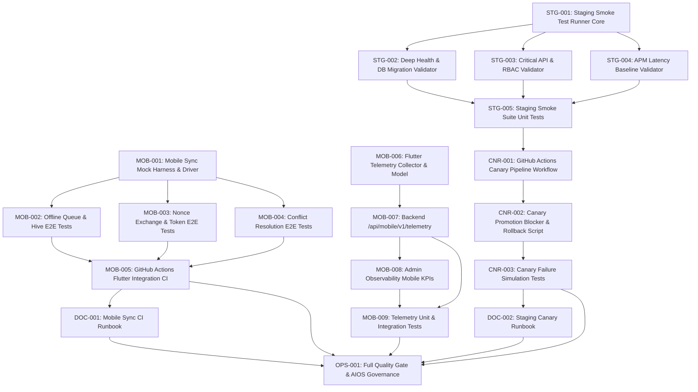

# Implementation Contract: Sprint-033 Mobile Sync Telemetry & Canary Staging Pipeline Automation

**Sprint ID:** SPRINT-033 (PR-033)  
**Sprint Name:** Mobile Sync Telemetry & Canary Staging Pipeline Automation  
**Status:** Approved Engineering Contract  
**Created Date:** 2026-08-19  
**Target Execution:** 2026-08-19 to 2026-09-02 (10-14 business days)  
**Estimated Duration:** 2-3 weeks (45-60 engineering hours)  
**Risk Level:** Medium (Flutter CI emulator / headless execution, Staging environment parity, Canary promotion gates)  
**Classification:** AIOS v3.17 Official Implementation Contract  
**Target Release Version:** v3.17.0  
**Technical Debt Reference:** TD-007 (MEDIUM Priority - Mobile App E2E Sync CI Automation), TD-008 (MEDIUM Priority - Automated Staging Smoke Test & Canary Pipeline)  

---

## Executive Summary

Sprint-033 transitions the ThaibaHive platform from v3.16.0 to **v3.17.0** by delivering **Mobile Sync Telemetry & Canary Staging Pipeline Automation**, resolving the final two active technical debt items (**TD-007** and **TD-008**).

Following the successful delivery and certification of Production Latency Observability (Sprint-032 / v3.16.0), the platform is 100% functionally complete. However, two critical operational reliability gaps remain:
1. **Mobile Sync CI Integration Gap (TD-007):** Mobile offline-first synchronization logic (Hive local storage, outbox mutation queues, nonce-based session re-authentication, and Last-Write-Wins conflict resolution) relies on local developer testing and isolated unit tests rather than automated continuous integration (CI) end-to-end device/headless verification against backend services.
2. **Production Deployment Gate Gap (TD-008):** Deployment validation lacks an automated post-deployment staging smoke test suite and canary verification pipeline to evaluate staging health, migration status, and latency regressions before promoting releases to production.

This sprint delivers:
1. **Flutter E2E Sync Integration Test Harness:** Automated integration test suite executing offline queue persistence, batch mutation flushing, nonce exchange, network failure recovery, and conflict resolution against a live/mock backend in GitHub Actions.
2. **Mobile Sync Telemetry & APM Bridge:** Client-side telemetry reporting from the Flutter app into the backend APM infrastructure from Sprint-032, exposing mobile sync latency percentiles, error rates, and conflict counts in `/api/system/metrics` and the admin observability dashboard.
3. **Automated Staging Smoke Test Runner:** Standalone TypeScript test runner validating system health, SQLite/PostgreSQL migration status, authentication flows, and critical API route functionality in under 3 minutes.
4. **GitHub Actions Canary Staging Pipeline:** Production safety gate that automatically deploys to staging, runs smoke tests, verifies APM latency baselines, and halts production promotion if regressions occur.
5. **Operational Runbooks & AIOS Governance:** Comprehensive operational guides for mobile sync testing and canary staging pipelines, updating `.ai/PROJECT_STATUS.md` and `.ai/CHANGELOG.md` to achieve zero active technical debt.

---

## Scope

### In Scope
- **Flutter Mobile Sync Integration Suite (TD-007):** End-to-end integration tests in `thaibahive_mobile_app/integration_test/sync_e2e_test.dart` verifying offline queueing, SQLite/Hive storage, batch sync processing, token refresh via nonce exchange, and LWW/client-preferred conflict resolution.
- **Flutter CI Automation (TD-007):** GitHub Actions workflow executing headless Flutter integration tests with a dedicated Node.js mock/standalone backend test harness.
- **Mobile Telemetry Bridge (TD-007 / APM):** Flutter client metric emitter and backend ingestion endpoint (`/api/mobile/v1/telemetry`), routing sync batch latencies and error counters into `SlidingWindowAggregator`.
- **Admin Observability Mobile KPIs:** Extension to `/admin/observability` and `/api/system/metrics` exposing mobile sync throughput, p95 sync latency, and conflict rates.
- **Automated Staging Smoke Test Runner (TD-008):** Standalone TypeScript runner in `scripts/staging/` validating `/api/system/health`, `/api/system/metrics`, database ping, migration integrity, login/session verification, and core CRUD routes.
- **Canary Promotion Gate (TD-008):** GitHub Actions workflow (`.github/workflows/staging-canary-gate.yml`) executing staging smoke tests and blocking production deployments on validation failure or latency degradation (>20% over baseline).
- **Runbooks & Governance:** `docs/mobile-sync-testing-runbook.md`, `docs/staging-canary-runbook.md`, `.ai/PROJECT_STATUS.md` update (resolving TD-007 & TD-008, bumping to v3.17.0), and `.ai/CHANGELOG.md`.

### Out of Scope
- Physical device farm procurement (AWS Device Farm / Firebase Test Lab paid tiers) — headless Flutter Linux/Android emulator CI runner is implemented.
- Changes to core ERP business domain tables or database schema migrations.
- Blue-green DNS traffic shifting at the CDN/Edge layer (handled at orchestrator/platform level; CI pipeline gate is delivered).
- Overhauling mobile UI screens or user-facing visual design.

---

## Dependencies

| Dependency | Source | Status |
| :--- | :--- | :--- |
| Next.js 16 Production Backend & APM Engine | `src/lib/observability/`, `src/app/api/system/metrics` | Available (v3.16.0) |
| Flutter Mobile Companion App | `thaibahive_mobile_app/` | Stable |
| Flutter Integration Test Package | `integration_test` (Flutter SDK built-in) | Available |
| Hive Local Database & Outbox Manager | `thaibahive_mobile_app/lib/core/sync/` | Stable |
| GitHub Actions CI Pipeline | `.github/workflows/ci.yml`, `flutter-ci.yml` | Active |
| Mobile Auth Nonce Exchange Route | `src/app/api/auth/mobile-handoff/nonce/route.ts` | Stable |
| Mobile V1 Sync Route | `src/app/api/mobile/v1/sync/route.ts` | Stable |
| Jose JWT Library & LibSQL / Drizzle | `packages/auth`, `packages/db` | Stable |

---

## Risks

| Risk | Severity | Mitigation |
| :--- | :--- | :--- |
| **Flutter CI Execution Flakiness:** Emulator or headless integration test timing out or failing due to CI resource constraints. | Medium | Use headless Flutter integration test runner (`flutter test integration_test/`) with local mock server, explicit test timeouts, and retry policies. |
| **Mobile Sync Network Simulation Delays:** Simulating network drops in CI without real radio interfaces. | Medium | Inject network client mocks in Flutter test harness capable of deterministic offline toggling, latency injection, and packet drop simulation. |
| **Staging Smoke Test False Positives:** Transient network glitches causing canary pipeline to block legitimate releases. | Medium | Implement 3-tier exponential retry logic for network requests in `staging-smoke-runner.ts` and require 2 consecutive failures before halting promotion. |
| **Telemetry Ingestion Flood from Mobile Clients:** Large volume of mobile telemetry payloads overloading backend APM aggregators. | Low | Enforce batch aggregation on the mobile client (report every 60s or upon sync batch finish) and rate-limit `/api/mobile/v1/telemetry`. |
| **Staging Environment Parity Drift:** Divergence between staging configuration and production leading to invalid canary results. | Low | Include strict environment parity validation (schema hash check, migration check, env secret verification) in the smoke test suite. |

---

## Rollback Plan

- **Decoupled CI Workflows:** The staging canary pipeline and Flutter integration workflows run as independent GitHub Actions jobs. If CI issues arise, workflows can be bypassed via repository configuration or commit tags (`[skip canary]`).
- **Telemetry Kill-Switch:** Mobile telemetry ingestion respects `MOBILE_TELEMETRY_ENABLED=false` environment variable on the backend and client-side config toggle, disabling ingestion with zero application downtime.
- **Zero Database Changes:** Sprint-033 introduces zero schema migrations; rolling back code or scripts produces zero database state side-effects.
- **Git Reversion:** Standard `git revert` targeting the Sprint-033 merge commit.

---

## Task Dependency Graph



---

## Detailed Task Breakdown

---

### Group 1 - Mobile Sync CI Automation & Integration Test Harness (TD-007)

---

#### MOB-001 - Implement Mobile Sync Test Driver & Mock Backend Harness

| Field | Detail |
| :--- | :--- |
| **Task ID** | MOB-001 |
| **TD Reference** | TD-007 |
| **Description** | Create a robust mock backend test server and HTTP client interceptor for Flutter integration tests in `thaibahive_mobile_app/integration_test/mock_sync_server.dart` and `thaibahive_mobile_app/test/helpers/mock_sync_http_client.dart`. The mock server must support simulating normal 200 OK batch responses, 401 Unauthorized token expirations, 503 Server Busy errors, delayed network latency (50ms - 2000ms), and partial batch rejection with failed mutation IDs. Must support deterministic state resets between test runs. |
| **Files** | `thaibahive_mobile_app/integration_test/mock_sync_server.dart` (NEW), `thaibahive_mobile_app/test/helpers/mock_sync_http_client.dart` (NEW) |
| **Dependencies** | None - foundational mobile testing task |
| **Acceptance Criteria** | (1) `MockSyncServer` handles `/mobile/v1/sync` POST requests with customizable response behaviors; (2) Supports programmatic network offline/online toggle; (3) Tracks all received mutation payloads for test assertions; (4) Supports simulating HTTP status codes (200, 400, 401, 500, 503) and latency delays. |
| **Verification Method** | Dart unit test executing rapid mocked request permutations asserting accurate mock responses and request recording. |
| **Estimated Complexity** | Medium |

---

#### MOB-002 - Implement Flutter Offline Queue & Hive Persistence E2E Tests

| Field | Detail |
| :--- | :--- |
| **Task ID** | MOB-002 |
| **TD Reference** | TD-007 |
| **Description** | Author comprehensive end-to-end integration tests in `thaibahive_mobile_app/integration_test/sync_queue_persistence_test.dart` testing the complete offline-first lifecycle. Test scenarios: (1) Enqueue mutations while network is marked offline; (2) Verify persistent storage in Hive box across app restart simulation; (3) Restore connectivity and trigger `OfflineSyncEngine.flushQueue()`; (4) Verify outbox queue is completely cleared upon 200 OK response; (5) Verify unprocessed/failed mutations remain in queue with retry counter incremented. |
| **Files** | `thaibahive_mobile_app/integration_test/sync_queue_persistence_test.dart` (NEW) |
| **Dependencies** | MOB-001 |
| **Acceptance Criteria** | (1) Tests verify outbox items survive app lifecycle restart simulation; (2) Successfully flushes 50+ batch mutations upon network restoration; (3) Failed mutations correctly retained with exponential backoff timestamp; (4) 100% test pass rate with zero flaky timing issues. |
| **Verification Method** | Run `flutter test integration_test/sync_queue_persistence_test.dart` asserting all test cases pass cleanly. |
| **Estimated Complexity** | Medium |

---

#### MOB-003 - Implement Nonce Exchange & Token Restoration Integration Tests

| Field | Detail |
| :--- | :--- |
| **Task ID** | MOB-003 |
| **TD Reference** | TD-007 |
| **Description** | Author integration tests in `thaibahive_mobile_app/integration_test/sync_auth_nonce_test.dart` validating the mobile-web auth handoff and token refresh mechanism during sync. Test scenarios: (1) Sync request receives 401 Unauthorized; (2) Sync engine automatically triggers Nonce Exchange (`/api/auth/mobile-handoff/nonce`) to re-authenticate without user intervention; (3) Securely updates `FlutterSecureStorage` with new JWT token; (4) Retries the failed sync batch with new bearer token and succeeds; (5) If nonce exchange fails (invalid credentials/revoked user), transitions to unauthenticated state cleanly without crashing. |
| **Files** | `thaibahive_mobile_app/integration_test/sync_auth_nonce_test.dart` (NEW) |
| **Dependencies** | MOB-001 |
| **Acceptance Criteria** | (1) Verifies automatic 401 interception and token recovery; (2) Asserts nonce generation and exchange contract adherence; (3) Tests graceful fallback on revoked token; (4) 100% test pass rate. |
| **Verification Method** | Run `flutter test integration_test/sync_auth_nonce_test.dart` asserting automatic token renewal and retry behavior. |
| **Estimated Complexity** | Low-Medium |

---

#### MOB-004 - Implement Conflict Resolution & Last-Write-Wins E2E Tests

| Field | Detail |
| :--- | :--- |
| **Task ID** | MOB-004 |
| **TD Reference** | TD-007 |
| **Description** | Author integration tests in `thaibahive_mobile_app/integration_test/sync_conflict_resolution_test.dart` testing concurrent data modifications between mobile client and server. Test scenarios: (1) Mobile staff check-in mutation created at T1; (2) Server already has record updated at T2 (T2 > T1); (3) Assert Last-Write-Wins (LWW) resolver favors the newer timestamp; (4) Client-Preferred strategy tested for offline drafts; (5) Conflict event recorded and reported with audit metadata. |
| **Files** | `thaibahive_mobile_app/integration_test/sync_conflict_resolution_test.dart` (NEW) |
| **Dependencies** | MOB-001 |
| **Acceptance Criteria** | (1) Tests LWW resolution with sub-second timestamp deltas; (2) Verifies server timestamp precedence when server is newer; (3) Verifies client precedence when client is newer; (4) Asserts conflict resolution audit logs are generated; (5) 100% test pass rate. |
| **Verification Method** | Run `flutter test integration_test/sync_conflict_resolution_test.dart` asserting conflict matrices. |
| **Estimated Complexity** | Medium |

---

#### MOB-005 - Implement GitHub Actions Flutter Integration CI Workflow

| Field | Detail |
| :--- | :--- |
| **Task ID** | MOB-005 |
| **TD Reference** | TD-007 |
| **Description** | Update `.github/workflows/flutter-ci.yml` and `.github/workflows/ci.yml` to incorporate automated execution of the mobile sync integration test suite. Configure headless Linux test runner using `flutter test integration_test/` with automated dependency caching, test result reporting, and execution timeout limits (max 10 minutes). Ensure failures in mobile sync integration tests block PR merging. |
| **Files** | `.github/workflows/flutter-ci.yml` (MODIFY), `.github/workflows/ci.yml` (MODIFY) |
| **Dependencies** | MOB-002, MOB-003, MOB-004 |
| **Acceptance Criteria** | (1) Workflow executes all integration test files in `integration_test/`; (2) Total execution time < 8 minutes on standard GitHub runner; (3) Emits structured JUnit/test report artifacts; (4) Fails PR checks if any mobile sync test fails; (5) Caches Flutter dependencies properly. |
| **Verification Method** | Validate GitHub Actions workflow syntax using action-validator or local runner; verify test execution step definition. |
| **Estimated Complexity** | Low-Medium |

---

### Group 2 - Mobile Sync Telemetry Bridge & APM Integration (TD-007)

---

#### MOB-006 - Implement Flutter Sync Telemetry Collector & Payload Model

| Field | Detail |
| :--- | :--- |
| **Task ID** | MOB-006 |
| **TD Reference** | TD-007 |
| **Description** | Create `thaibahive_mobile_app/lib/core/sync/mobile_sync_telemetry.dart` to collect performance and diagnostic metrics during sync operations on the mobile device. Metrics tracked: (1) `batchSize` (number of mutations); (2) `syncDurationMs` (time from request start to response parsing); (3) `networkType` (wifi, cellular, offline); (4) `retryCount`; (5) `conflictCount`; (6) `success` (boolean); (7) `errorCode` (optional string). Buffer telemetry events in memory (capped at 50 events) and flush to the backend periodically or immediately after batch sync completion. Include client kill-switch toggle. |
| **Files** | `thaibahive_mobile_app/lib/core/sync/mobile_sync_telemetry.dart` (NEW), `thaibahive_mobile_app/test/core/sync/mobile_sync_telemetry_test.dart` (NEW) |
| **Dependencies** | None |
| **Acceptance Criteria** | (1) `MobileSyncTelemetry` captures all 7 required metrics per sync run; (2) Batches telemetry events with memory cap of 50 items; (3) Overhead per record < 0.1ms CPU; (4) Unit tests pass with 100% assertions green. |
| **Verification Method** | Run `flutter test test/core/sync/mobile_sync_telemetry_test.dart` verifying metric recording and batch flushing. |
| **Estimated Complexity** | Low-Medium |

---

#### MOB-007 - Implement Backend Mobile Telemetry Route `/api/mobile/v1/telemetry`

| Field | Detail |
| :--- | :--- |
| **Task ID** | MOB-007 |
| **TD Reference** | TD-007 |
| **Description** | Implement `src/app/api/mobile/v1/telemetry/route.ts` accepting POST batches of mobile sync telemetry events. Authenticate via `requireAuth` or mobile app token. Validate payload schema with Zod (`src/lib/validation/schemas.ts`). Ingest mobile sync durations into `SlidingWindowAggregator` under route tag `/mobile/sync` and track mobile-specific counters: `mobile_sync_total`, `mobile_sync_errors`, `mobile_sync_conflicts`, and `mobile_sync_avg_batch_size`. Include environment toggle `MOBILE_TELEMETRY_ENABLED` (default true). |
| **Files** | `src/app/api/mobile/v1/telemetry/route.ts` (NEW), `src/lib/validation/schemas.ts` (MODIFY) |
| **Dependencies** | MOB-006 |
| **Acceptance Criteria** | (1) POST `/api/mobile/v1/telemetry` validates batch array of telemetry records; (2) Records latencies in `SlidingWindowAggregator`; (3) Updates mobile sync counters; (4) Rejects malformed bodies with 400 Bad Request; (5) Rejects unauthenticated requests with 401; (6) Response time < 20ms. |
| **Verification Method** | Send valid and invalid POST requests via curl/fetch; assert status codes and metric aggregator updates. |
| **Estimated Complexity** | Medium |

---

#### MOB-008 - Extend Admin Observability UI with Mobile Sync KPIs

| Field | Detail |
| :--- | :--- |
| **Task ID** | MOB-008 |
| **TD Reference** | TD-007 / TD-005 |
| **Description** | Update `src/app/(shell)/admin/observability/page.tsx`, `src/app/(shell)/admin/observability/_components/latency-summary-cards.tsx`, and `src/lib/observability/prometheus-exporter.ts` to surface mobile sync telemetry. Display a dedicated "Mobile Sync Telemetry" KPI section with: (1) Mobile Sync Throughput (batches/min); (2) Mobile Sync p95 Latency with SLA badge (<1500ms target); (3) Mobile Sync Conflict Rate %; (4) Mobile Sync Success Rate %. Expose Prometheus metrics `thaibahive_mobile_sync_duration_seconds` and `thaibahive_mobile_sync_total` in `/api/system/metrics`. |
| **Files** | `src/app/(shell)/admin/observability/page.tsx` (MODIFY), `src/app/(shell)/admin/observability/_components/latency-summary-cards.tsx` (MODIFY), `src/lib/observability/prometheus-exporter.ts` (MODIFY) |
| **Dependencies** | MOB-007 |
| **Acceptance Criteria** | (1) Admin Observability UI renders mobile sync KPI metrics cleanly; (2) PromQL export includes `thaibahive_mobile_sync_*` metrics; (3) Conforms to design system UI standards (`<Badge>`, `<Card>`, `<Skeleton>`); (4) Responsive on mobile and desktop viewports. |
| **Verification Method** | Render observability dashboard with mock mobile telemetry; verify cards display calculated values and Prometheus output contains mobile metrics. |
| **Estimated Complexity** | Low-Medium |

---

#### MOB-009 - Unit & Security Tests for Mobile Telemetry Endpoint

| Field | Detail |
| :--- | :--- |
| **Task ID** | MOB-009 |
| **TD Reference** | TD-007 |
| **Description** | Author comprehensive unit, validation, and RBAC security tests in `src/app/api/mobile/v1/telemetry/__tests__/route.test.ts`. Test matrices: (1) Valid telemetry batch -> 200 OK with processed count; (2) Missing required fields -> 400 Bad Request with Zod error details; (3) Unauthenticated request -> 401 Unauthorized; (4) Large batch payload (>100 items) handled safely with truncation/validation; (5) Telemetry disabled via `MOBILE_TELEMETRY_ENABLED=false` -> 200 OK with no-op. |
| **Files** | `src/app/api/mobile/v1/telemetry/__tests__/route.test.ts` (NEW) |
| **Dependencies** | MOB-007 |
| **Acceptance Criteria** | (1) 100% test pass rate across all validation and security scenarios; (2) Verified safe handling of edge cases (empty array, extreme durations, null network types); (3) Code coverage > 95% on route handler. |
| **Verification Method** | `pnpm test -- api/mobile/v1/telemetry` exits 0 with all test assertions passing. |
| **Estimated Complexity** | Low-Medium |

---

### Group 3 - Automated Staging Smoke Test Suite (TD-008)

---

#### STG-001 - Implement Staging Smoke Test Runner Framework

| Field | Detail |
| :--- | :--- |
| **Task ID** | STG-001 |
| **TD Reference** | TD-008 |
| **Description** | Create a standalone, high-performance staging smoke test runner in `scripts/staging/staging-smoke-runner.ts` using native Node.js / TypeScript. The runner accepts CLI arguments `--url=<STAGING_URL>`, `--secret=<HEALTH_SECRET>`, `--jwt-secret=<AUTH_JWT_SECRET>`, `--timeout=<MS>`, `--retries=<N>`. It orchestrates modular validation suites (Health & DB, Auth & RBAC, Critical APIs, APM Metrics), aggregates execution timings, produces colorized console output with clear PASS/FAIL statuses, and generates a structured JSON report at `staging-reports/smoke-test-summary.json`. Exits with code 0 on all pass, 1 on failure. |
| **Files** | `scripts/staging/staging-smoke-runner.ts` (NEW), `package.json` (MODIFY) |
| **Dependencies** | None - foundational staging task |
| **Acceptance Criteria** | (1) `pnpm test:staging:smoke` runs the orchestrator with configurable environment options; (2) Total execution time across all suites < 60 seconds; (3) Generates machine-readable JSON artifact `staging-reports/smoke-test-summary.json`; (4) Gracefully handles connection timeouts and network retries. |
| **Verification Method** | Execute `npx tsx scripts/staging/staging-smoke-runner.ts --dry-run` and verify test suite discovery, options parsing, and report generation. |
| **Estimated Complexity** | Medium |

---

#### STG-002 - Implement Staging Deep Health, DB & Migration Validators

| Field | Detail |
| :--- | :--- |
| **Task ID** | STG-002 |
| **TD Reference** | TD-008 |
| **Description** | Implement `scripts/staging/validators/health-db-validator.ts`. The validator connects to the staging environment and executes: (1) `GET /api/system/health` checking for `{ status: "ok" }`, database connectivity `database.connected === true`, and database response time < 100ms; (2) Migration integrity check verifying that applied schema migrations match expected migration hashes without pending unapplied migrations; (3) Health check timing-safe secret validation with `x-health-secret`. |
| **Files** | `scripts/staging/validators/health-db-validator.ts` (NEW) |
| **Dependencies** | STG-001 |
| **Acceptance Criteria** | (1) Asserts `/api/system/health` returns HTTP 200 and healthy DB status; (2) Fails if database latency exceeds 250ms threshold; (3) Validates migration alignment against repository migration files; (4) Retries up to 3 times with exponential backoff before reporting failure. |
| **Verification Method** | Run validator against local test server; verify correct pass on healthy instance and descriptive failure when database is unreachable. |
| **Estimated Complexity** | Low-Medium |

---

#### STG-003 - Implement Staging Critical API & RBAC Auth Path Validators

| Field | Detail |
| :--- | :--- |
| **Task ID** | STG-003 |
| **TD Reference** | TD-008 |
| **Description** | Implement `scripts/staging/validators/api-auth-validator.ts`. The validator dynamically generates signed JWT tokens for multiple test roles (`super_admin`, `principal`, `staff`) using the staging `AUTH_JWT_SECRET` and executes smoke checks across Tier 1 critical paths: (1) Auth check-in (`/api/auth/session` or `/api/staff/me`); (2) Student roster read (`/api/students?limit=5`); (3) Finance ledger read (`/api/finance/transactions?limit=5`); (4) Nonce exchange endpoint (`/api/auth/mobile-handoff/nonce`); (5) RBAC boundary assertion (verifying `staff` role receives 403 on admin-only routes). |
| **Files** | `scripts/staging/validators/api-auth-validator.ts` (NEW) |
| **Dependencies** | STG-001 |
| **Acceptance Criteria** | (1) Tests 5 critical API routes across 3 role tiers; (2) Asserts response status codes and schema shapes; (3) Verifies RBAC denial for unprivileged roles; (4) Execution duration < 15 seconds. |
| **Verification Method** | Run validator against local test server; assert all 5 critical path checks pass. |
| **Estimated Complexity** | Medium |

---

#### STG-004 - Implement Staging APM Metrics & Latency Baseline Validator

| Field | Detail |
| :--- | :--- |
| **Task ID** | STG-004 |
| **TD Reference** | TD-008 / TD-005 |
| **Description** | Implement `scripts/staging/validators/metrics-validator.ts`. The validator queries `GET /api/system/metrics` with `x-metrics-secret` bearer authentication and validates: (1) Metrics endpoint responds with 200 OK and valid JSON/OpenMetrics schema; (2) System p95 latency is within acceptable staging SLA threshold (<500ms); (3) System error rate is < 1.0%; (4) Heap memory utilization is within bounded limits (<512MB); (5) Active route metrics are being properly tracked. |
| **Files** | `scripts/staging/validators/metrics-validator.ts` (NEW) |
| **Dependencies** | STG-001 |
| **Acceptance Criteria** | (1) Validates `/api/system/metrics` schema and response time; (2) Asserts p95 latency and error rate SLA compliance; (3) Fails with clear diagnostic report if tail latency exceeds threshold; (4) Supports both JSON and Prometheus formats. |
| **Verification Method** | Run validator against test server with APM enabled; assert metric threshold assertions pass. |
| **Estimated Complexity** | Low-Medium |

---

#### STG-005 - Unit Tests for Staging Smoke Test Suite

| Field | Detail |
| :--- | :--- |
| **Task ID** | STG-005 |
| **TD Reference** | TD-008 |
| **Description** | Author Jest unit tests for the staging smoke test framework in `scripts/staging/__tests__/staging-smoke-runner.test.ts`. Test scenarios: (1) All validators return true -> runner exits 0 and writes passing summary JSON; (2) Health validator returns false -> runner retries 3 times, exits 1, and flags health failure in report; (3) RBAC validator detects permission bypass -> runner exits 1 with security warning; (4) Timeout and connection refused errors handled gracefully. |
| **Files** | `scripts/staging/__tests__/staging-smoke-runner.test.ts` (NEW) |
| **Dependencies** | STG-002, STG-003, STG-004 |
| **Acceptance Criteria** | (1) 100% test pass rate across runner and validator mock tests; (2) Mock server verifies retry behavior and timeout handling; (3) Summary JSON report format validated. |
| **Verification Method** | `pnpm test -- staging-smoke-runner` exits 0 with all assertions green. |
| **Estimated Complexity** | Low-Medium |

---

### Group 4 - GitHub Actions Canary Validation & Promotion Pipeline (TD-008)

---

#### CNR-001 - Implement Staging Canary Validation GitHub Actions Workflow

| Field | Detail |
| :--- | :--- |
| **Task ID** | CNR-001 |
| **TD Reference** | TD-008 |
| **Description** | Create `.github/workflows/staging-canary-gate.yml` defining the automated staging verification pipeline. The workflow triggers on staging deployment completion or workflow dispatch. Steps: (1) Wait for staging environment readiness (`wait-on`); (2) Execute staging smoke test suite (`pnpm test:staging:smoke`); (3) Execute lightweight k6 staging canary benchmark (10 VUs, 30s); (4) Collect APM telemetry snapshot; (5) Assert zero regressions; (6) Set deployment status to success or trigger automatic rollback notification. |
| **Files** | `.github/workflows/staging-canary-gate.yml` (NEW) |
| **Dependencies** | STG-001, STG-005 |
| **Acceptance Criteria** | (1) Workflow successfully triggers and runs smoke suite against target environment; (2) Completes within 5 minutes total run time; (3) Uploads `staging-smoke-report` artifact; (4) Exports pass/fail output variable for downstream production deployment workflows. |
| **Verification Method** | Lint workflow with action-lint; execute dry-run simulation verifying job dependency wiring. |
| **Estimated Complexity** | Medium |

---

#### CNR-002 - Implement Canary Promotion Gate & Auto-Rollback Script

| Field | Detail |
| :--- | :--- |
| **Task ID** | CNR-002 |
| **TD Reference** | TD-008 |
| **Description** | Create `scripts/staging/canary-promotion-gate.ts` to evaluate staging validation results against production promotion criteria. Decision rules: (a) 100% smoke test pass rate required; (b) Error rate must be 0.00%; (c) Staging p95 latency must not exceed production baseline by more than 20%; (d) Database migrations must be fully applied with 0 pending. If criteria pass, emits promotion token. If criteria fail, sends alert webhook, logs diagnostic failure breakdown, and halts promotion pipeline. |
| **Files** | `scripts/staging/canary-promotion-gate.ts` (NEW) |
| **Dependencies** | STG-001, CNR-001 |
| **Acceptance Criteria** | (1) Evaluates smoke test report and baseline latency JSON; (2) Returns exit code 0 when all criteria met; (3) Returns exit code 1 with detailed failure reasons when any gate fails; (4) Dispatches webhook payload if `ALERT_WEBHOOK_URL` is configured. |
| **Verification Method** | Run gate script with synthetic passing and failing smoke test reports; assert correct exit codes and console output. |
| **Estimated Complexity** | Low-Medium |

---

#### CNR-003 - Unit Tests for Canary Promotion Gate & Failure Matrices

| Field | Detail |
| :--- | :--- |
| **Task ID** | CNR-003 |
| **TD Reference** | TD-008 |
| **Description** | Author unit tests in `scripts/staging/__tests__/canary-promotion-gate.test.ts` testing all edge cases of the promotion gate: (1) All metrics passing -> passes gate; (2) Smoke test failed -> blocks promotion; (3) Latency regression (+35% p95) -> blocks promotion; (4) Error rate > 1% -> blocks promotion; (5) Missing report file -> blocks promotion safely; (6) Webhook dispatch verified upon failure. |
| **Files** | `scripts/staging/__tests__/canary-promotion-gate.test.ts` (NEW) |
| **Dependencies** | CNR-002 |
| **Acceptance Criteria** | (1) 100% test pass rate across all decision matrix permutations; (2) Mock webhook handler verifies alert payload structure; (3) Zero unhandled exceptions. |
| **Verification Method** | `pnpm test -- canary-promotion-gate` exits 0 with all test cases green. |
| **Estimated Complexity** | Low-Medium |

---

### Group 5 - Documentation, Operational Runbooks & Quality Integration

---

#### DOC-001 - Author Mobile Sync CI Testing & Troubleshooting Runbook

| Field | Detail |
| :--- | :--- |
| **Task ID** | DOC-001 |
| **TD Reference** | TD-007 |
| **Description** | Author a comprehensive operational guide in `docs/mobile-sync-testing-runbook.md`. Must detail: (1) Mobile sync offline-first architecture (Hive boxes, outbox queue, LWW conflict resolver); (2) How to run mobile integration tests locally and in CI (`flutter test integration_test/`); (3) Mock server configuration and network fault simulation; (4) Mobile telemetry metric definitions and threshold interpretations; (5) Step-by-step triage guide for diagnosing sync queue failures and nonce exchange errors. |
| **Files** | `docs/mobile-sync-testing-runbook.md` (NEW) |
| **Dependencies** | MOB-005, MOB-008 |
| **Acceptance Criteria** | (1) Runbook contains all 5 required operational sections; (2) Includes local debugging command examples; (3) Documents telemetry payload schema and API contracts; (4) Reviewed and approved. |
| **Verification Method** | Manual review of runbook by Verification Engineer for operational accuracy and completeness. |
| **Estimated Complexity** | Low |

---

#### DOC-002 - Author Staging Canary & Automated Promotion Runbook

| Field | Detail |
| :--- | :--- |
| **Task ID** | DOC-002 |
| **TD Reference** | TD-008 |
| **Description** | Author an operational guide in `docs/staging-canary-runbook.md`. Must detail: (1) Staging smoke test suite architecture and validator modules; (2) Canary promotion gate criteria and SLA latency thresholds; (3) How to run smoke tests locally against staging or preview environments (`pnpm test:staging:smoke --url=...`); (4) GitHub Actions workflow triggers and manual bypass procedures (`[skip canary]`); (5) Incident response and automatic rollback procedures for failed canary deployments. |
| **Files** | `docs/staging-canary-runbook.md` (NEW) |
| **Dependencies** | CNR-001, CNR-002 |
| **Acceptance Criteria** | (1) Runbook contains all 5 required sections; (2) CLI execution examples provided with all parameters documented; (3) Promotion gate decision tree diagram included; (4) Rollback steps clearly enumerated. |
| **Verification Method** | Manual review of runbook by Verification Engineer for operational accuracy and completeness. |
| **Estimated Complexity** | Low |

---

#### OPS-001 - Full Pipeline Quality Gate, Project Status & Changelog Update

| Field | Detail |
| :--- | :--- |
| **Task ID** | OPS-001 |
| **TD Reference** | TD-007, TD-008 |
| **Description** | Execute the complete AIOS quality verification pipeline: (1) `pnpm lint` - zero errors, zero warnings; (2) `pnpm typecheck` - zero TypeScript errors; (3) `pnpm test` - all Jest test suites pass (911+ baseline + new staging/telemetry suites = 930+ tests); (4) `cd thaibahive_mobile_app && flutter analyze && flutter test` - zero errors/warnings; (5) `pnpm build` - clean production build. Update `.ai/PROJECT_STATUS.md` to mark **TD-007** and **TD-008** as **Resolved**, clear all active technical debt (0 active items remaining), increment version to **v3.17.0**, and record Sprint-033 completion. Add comprehensive v3.17.0 release entry to `.ai/CHANGELOG.md`. |
| **Files** | `.ai/PROJECT_STATUS.md` (MODIFY), `.ai/CHANGELOG.md` (MODIFY) |
| **Dependencies** | MOB-005, MOB-009, STG-005, CNR-003, DOC-001, DOC-002 |
| **Acceptance Criteria** | (1) Lint, typecheck, Jest tests, Flutter tests, and production build all exit 0; (2) Total Jest test count increased to 930+ tests with 100% pass rate; (3) `PROJECT_STATUS.md` reflects v3.17.0 and moves TD-007 and TD-008 to Resolved (0 active technical debt); (4) `.ai/CHANGELOG.md` documents all Sprint-033 deliverables under v3.17.0. |
| **Verification Method** | Execute all build and test commands; verify zero errors; inspect updated documentation files. |
| **Estimated Complexity** | Low |

---

## Task Summary Table

| Task ID | Group | Description | Complexity | Dependencies |
| :--- | :--- | :--- | :--- | :--- |
| **MOB-001** | Mobile CI | Implement Mobile Sync Test Driver & Mock Backend Harness | Medium | None |
| **MOB-002** | Mobile CI | Implement Flutter Offline Queue & Hive Persistence E2E Tests | Medium | MOB-001 |
| **MOB-003** | Mobile CI | Implement Nonce Exchange & Token Restoration Integration Tests | Low-Medium | MOB-001 |
| **MOB-004** | Mobile CI | Implement Conflict Resolution & Last-Write-Wins E2E Tests | Medium | MOB-001 |
| **MOB-005** | Mobile CI | Implement GitHub Actions Flutter Integration CI Workflow | Low-Medium | MOB-002, MOB-003, MOB-004 |
| **MOB-006** | Mobile Telemetry | Implement Flutter Sync Telemetry Collector & Payload Model | Low-Medium | None |
| **MOB-007** | Mobile Telemetry | Implement Backend Mobile Telemetry Route `/api/mobile/v1/telemetry` | Medium | MOB-006 |
| **MOB-008** | Mobile Telemetry | Extend Admin Observability UI with Mobile Sync KPIs | Low-Medium | MOB-007 |
| **MOB-009** | Mobile Telemetry | Unit & Security Tests for Mobile Telemetry Endpoint | Low-Medium | MOB-007 |
| **STG-001** | Staging Suite | Implement Staging Smoke Test Runner Framework | Medium | None |
| **STG-002** | Staging Suite | Implement Staging Deep Health, DB & Migration Validators | Low-Medium | STG-001 |
| **STG-003** | Staging Suite | Implement Staging Critical API & RBAC Auth Path Validators | Medium | STG-001 |
| **STG-004** | Staging Suite | Implement Staging APM Metrics & Latency Baseline Validator | Low-Medium | STG-001 |
| **STG-005** | Staging Suite | Unit Tests for Staging Smoke Test Suite | Low-Medium | STG-002, STG-003, STG-004 |
| **CNR-001** | Canary Pipeline | Implement Staging Canary Validation GitHub Actions Workflow | Medium | STG-001, STG-005 |
| **CNR-002** | Canary Pipeline | Implement Canary Promotion Gate & Auto-Rollback Script | Low-Medium | STG-001, CNR-001 |
| **CNR-003** | Canary Pipeline | Unit Tests for Canary Promotion Gate & Failure Matrices | Low-Medium | CNR-002 |
| **DOC-001** | Documentation | Author Mobile Sync CI Testing & Troubleshooting Runbook | Low | MOB-005, MOB-008 |
| **DOC-002** | Documentation | Author Staging Canary & Automated Promotion Runbook | Low | CNR-001, CNR-002 |
| **OPS-001** | Quality & Ops | Full Pipeline Quality Gate, Project Status & Changelog Update | Low | MOB-005, 009, STG-005, CNR-003, DOC-001, DOC-002 |

**Total Tasks:** 20  
**Complexity Breakdown:** 7 Medium, 9 Low-Medium, 4 Low  

---

## Acceptance Criteria Summary

### Mobile Sync CI Integration (MOB-001 - MOB-005)
- [ ] Mock sync server provides configurable latency, network drops, and status code simulations.
- [ ] Flutter integration tests verify Hive queue persistence and batch mutation flushing.
- [ ] Automated nonce exchange and session cookie renewal verified during 401 token expiration.
- [ ] Last-Write-Wins and Client-Preferred conflict resolution verified with sub-second accuracy.
- [ ] GitHub Actions workflow `.github/workflows/flutter-ci.yml` runs all integration tests in < 8 minutes.

### Mobile Sync Telemetry & APM Bridge (MOB-006 - MOB-009)
- [ ] Flutter `MobileSyncTelemetry` captures batch duration, network type, conflict count, and retries.
- [ ] POST `/api/mobile/v1/telemetry` validates batch payloads and ingests metrics into `SlidingWindowAggregator`.
- [ ] Admin Observability Dashboard (`/admin/observability`) displays live Mobile Sync KPI cards.
- [ ] Prometheus metrics endpoint exposes `thaibahive_mobile_sync_*` metric families.
- [ ] 100% unit and security test pass rate for telemetry endpoint.

### Staging Smoke Test Suite (STG-001 - STG-005)
- [ ] Standalone runner `pnpm test:staging:smoke` executes all validators in < 60 seconds.
- [ ] Deep health validator asserts database connectivity and migration schema parity.
- [ ] API & RBAC validator tests 5 critical routes across 3 role tiers.
- [ ] Metrics validator confirms staging p95 latency (<500ms) and error rate (<1%).
- [ ] Unit tests for smoke test framework pass with 100% assertions green.

### Canary Validation & Promotion Pipeline (CNR-001 - CNR-003)
- [ ] GitHub Actions workflow `.github/workflows/staging-canary-gate.yml` executes smoke checks post-deployment.
- [ ] Promotion gate blocks release if smoke tests fail, error rate > 0%, or latency regresses by > 20%.
- [ ] Webhook alert triggered automatically on canary validation failure.
- [ ] Unit tests verify all passing and failing promotion decision permutations.

### Operational Runbooks & Quality Governance (DOC-001, DOC-002, OPS-001)
- [ ] `docs/mobile-sync-testing-runbook.md` and `docs/staging-canary-runbook.md` committed.
- [ ] `pnpm lint`, `pnpm typecheck`, `pnpm test` (930+ tests), and `pnpm build` pass with 0 errors.
- [ ] `flutter analyze` and `flutter test` pass with 0 errors.
- [ ] `PROJECT_STATUS.md` updated to v3.17.0 with TD-007 and TD-008 marked as Resolved (0 active technical debt).
- [ ] `.ai/CHANGELOG.md` updated with v3.17.0 release notes.

---

## Definition of Done

Sprint-033 is considered complete when **all** of the following conditions are satisfied:

1. **Mobile Sync CI Automated:** Headless Flutter integration tests execute reliably in GitHub Actions CI against mock/standalone backend services, validating offline queues, nonce auth refresh, and conflict resolution (TD-007).
2. **Mobile Sync Telemetry Operational:** Client-side telemetry reports mobile sync batch performance into the backend APM layer, visible in `/admin/observability` and exported via `/api/system/metrics`.
3. **Staging Smoke Suite Operational:** Standalone runner executes health, database, migration, and RBAC critical path smoke tests in under 1 minute with structured JSON reporting (TD-008).
4. **Canary Promotion Gate Active:** GitHub Actions canary workflow automatically validates staging deployments and enforces zero-regression promotion gates before production release (TD-008).
5. **Zero Active Technical Debt:** TD-007 and TD-008 are 100% resolved, leaving 0 active technical debt items on the platform backlog.
6. **Quality Pipeline Green:** `pnpm lint`, `pnpm typecheck`, `pnpm test` (930+ tests), `flutter analyze`, `flutter test`, and `pnpm build` pass with zero errors and zero warnings.
7. **Documentation & Runbooks Complete:** Operational runbooks committed to `docs/mobile-sync-testing-runbook.md` and `docs/staging-canary-runbook.md`, `.ai/PROJECT_STATUS.md` bumped to v3.17.0, and `.ai/CHANGELOG.md` updated.
8. **Execution Log Filed:** `.ai/execution/Sprint-033-Execution-Log.md` complete and saved.

---

## Release Impact

- **Version Bump:** v3.16.0 -> v3.17.0
- **Release Classification:** Minor Release (Mobile CI Automation, Telemetry Bridge & Staging Canary Pipeline)
- **Database Schema Changes:** None (all telemetry is stored in memory; smoke tests use non-destructive read operations)
- **Breaking API Changes:** None (all existing APIs retain identical signatures; additive telemetry route `/api/mobile/v1/telemetry`)
- **CI/CD Impact:** Added automated Flutter integration tests to `flutter-ci.yml` and staging canary validation gate in `staging-canary-gate.yml`.
- **Rollback Compatibility:** 100% backward-compatible; telemetry can be disabled via `MOBILE_TELEMETRY_ENABLED=false` and canary gates can be bypassed via commit tags.

---

## Files Modified / Created

| File | Action | Group |
| :--- | :--- | :--- |
| `thaibahive_mobile_app/integration_test/mock_sync_server.dart` | **NEW** | Group 1 |
| `thaibahive_mobile_app/test/helpers/mock_sync_http_client.dart` | **NEW** | Group 1 |
| `thaibahive_mobile_app/integration_test/sync_queue_persistence_test.dart` | **NEW** | Group 1 |
| `thaibahive_mobile_app/integration_test/sync_auth_nonce_test.dart` | **NEW** | Group 1 |
| `thaibahive_mobile_app/integration_test/sync_conflict_resolution_test.dart` | **NEW** | Group 1 |
| `.github/workflows/flutter-ci.yml` | **MODIFY** | Group 1 |
| `.github/workflows/ci.yml` | **MODIFY** | Group 1 |
| `thaibahive_mobile_app/lib/core/sync/mobile_sync_telemetry.dart` | **NEW** | Group 2 |
| `thaibahive_mobile_app/test/core/sync/mobile_sync_telemetry_test.dart` | **NEW** | Group 2 |
| `src/app/api/mobile/v1/telemetry/route.ts` | **NEW** | Group 2 |
| `src/lib/validation/schemas.ts` | **MODIFY** | Group 2 |
| `src/app/(shell)/admin/observability/page.tsx` | **MODIFY** | Group 2 |
| `src/app/(shell)/admin/observability/_components/latency-summary-cards.tsx` | **MODIFY** | Group 2 |
| `src/lib/observability/prometheus-exporter.ts` | **MODIFY** | Group 2 |
| `src/app/api/mobile/v1/telemetry/__tests__/route.test.ts` | **NEW** | Group 2 |
| `scripts/staging/staging-smoke-runner.ts` | **NEW** | Group 3 |
| `scripts/staging/validators/health-db-validator.ts` | **NEW** | Group 3 |
| `scripts/staging/validators/api-auth-validator.ts` | **NEW** | Group 3 |
| `scripts/staging/validators/metrics-validator.ts` | **NEW** | Group 3 |
| `scripts/staging/__tests__/staging-smoke-runner.test.ts` | **NEW** | Group 3 |
| `package.json` | **MODIFY** | Group 3 |
| `.github/workflows/staging-canary-gate.yml` | **NEW** | Group 4 |
| `scripts/staging/canary-promotion-gate.ts` | **NEW** | Group 4 |
| `scripts/staging/__tests__/canary-promotion-gate.test.ts` | **NEW** | Group 4 |
| `docs/mobile-sync-testing-runbook.md` | **NEW** | Group 5 |
| `docs/staging-canary-runbook.md` | **NEW** | Group 5 |
| `.ai/PROJECT_STATUS.md` | **MODIFY** | Group 5 |
| `.ai/CHANGELOG.md` | **MODIFY** | Group 5 |

---

## Verification Plan

### Automated Verification Commands
```bash
# 1. Code Quality & Formatting
pnpm lint                                      # 0 errors, 0 warnings
pnpm typecheck                                 # 0 TypeScript errors
cd thaibahive_mobile_app && flutter analyze    # 0 analyzer warnings

# 2. Web & Node Test Suites
pnpm test -- api/mobile/v1/telemetry           # Mobile telemetry route & validation
pnpm test -- staging-smoke-runner              # Staging smoke test runner unit tests
pnpm test -- canary-promotion-gate             # Canary promotion decision logic
pnpm test                                      # Full repository test suite (930+ tests)

# 3. Mobile Unit & Integration Tests
cd thaibahive_mobile_app && flutter test       # Full Flutter unit test suite
cd thaibahive_mobile_app && flutter test integration_test/sync_queue_persistence_test.dart
cd thaibahive_mobile_app && flutter test integration_test/sync_auth_nonce_test.dart
cd thaibahive_mobile_app && flutter test integration_test/sync_conflict_resolution_test.dart

# 4. Staging Smoke Runner Dry-Run Verification
pnpm test:staging:smoke -- --dry-run           # Validate smoke runner orchestration

# 5. Production Build Verification
pnpm build                                     # Clean Next.js production build
```

### Manual Verification
- Execute `pnpm test:staging:smoke --url=http://localhost:3000` against a running local instance and verify colorized console output and summary report generation.
- Send a mock mobile sync telemetry payload to `/api/mobile/v1/telemetry` and verify that `/admin/observability` updates with mobile sync latency and throughput values.
- Verify `GET /api/system/metrics` with `Accept: text/plain` includes `thaibahive_mobile_sync_*` metric families.
- Run Flutter integration tests with simulated network latency to confirm resilient retry behavior.
- Trigger canary promotion gate simulation with artificially high latency and confirm promotion blocker halts deployment and dispatches alert webhook.

---

*Engineering Contract: SPRINT-033 - Mobile Sync Telemetry & Canary Staging Pipeline Automation*  
*Classification: AIOS v3.17 Official Implementation Contract*  
*Created: 2026-08-19 | Implementation Engineer: Antigravity*
