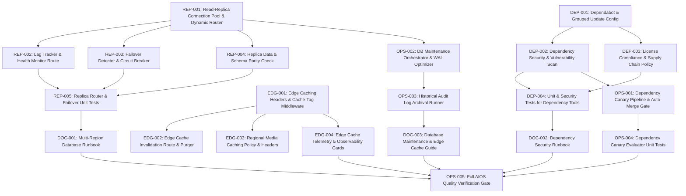

# Implementation Contract: Sprint-034 Enterprise Multi-Region Infrastructure & Automated Dependency Security

**Sprint ID:** SPRINT-034 (PR-034)  
**Sprint Name:** Enterprise Multi-Region Infrastructure & Automated Dependency Security  
**Status:** Approved Engineering Contract  
**Created Date:** 2026-08-19  
**Target Execution:** 2026-08-19 to 2026-09-09 (15-20 business days)  
**Estimated Duration:** 3-4 weeks (60-80 engineering hours)  
**Risk Level:** Medium-High (Database read-replica failover, Multi-region cache invalidation, Automated dependency promotion)  
**Classification:** AIOS v3.18 Official Implementation Contract  
**Target Release Version:** v3.18.0  
**Technical Debt Reference:** Zero Active Technical Debt (Transition to Enterprise Continuous Reliability & Platform Excellence Phase)

---

## Executive Summary

Following the 100% feature completion and resolution of all technical debt (TD-001 through TD-008) in Sprint-033 (v3.17.0), ThaibaHive has transitioned into the **Enterprise Continuous Reliability & Platform Excellence Phase**.

Sprint-034 advances the platform to **v3.18.0** by delivering **Enterprise Multi-Region Infrastructure & Automated Dependency Security**. This sprint establishes mission-critical enterprise capabilities required for distributed multi-campus geographic deployments, sub-50ms global read latencies, automated database failover resilience, zero-downtime database maintenance, and hands-free supply chain security with canary-validated dependency patching.

This contract provides the comprehensive engineering blueprint, breaking down the sprint into 20 structured implementation tasks across 5 core groups, with precise file specifications, dependencies, acceptance criteria, verification methods, risk mitigations, rollback protocols, and definition of done.

---

## Scope

### In Scope

1. **PostgreSQL Read-Replica Infrastructure & Dynamic Routing:**
   - Database connection pooling extension in `packages/db` supporting separate primary (read/write) and replica (read-only) connections.
   - Dynamic query routing middleware directing mutation/transactional queries to primary and `SELECT` queries to read-replicas.
   - Replication lag tracker and replica health monitoring endpoint (`/api/system/replica-status`).
   - Automated primary failover detector with circuit breaker logic and emergency fallback to primary.
   - Cross-node data parity and schema consistency validation scripts.

2. **Multi-Region Edge Caching & Geo-Distributed Media Delivery:**
   - HTTP response cache-control headers, `stale-while-revalidate`, and surrogate-key / cache-tag middleware for static and semi-static API responses.
   - Multi-region edge cache invalidation endpoint (`/api/system/edge-cache/purge`) with HMAC signature authentication.
   - Edge-optimized media thumbnail delivery policies with regional compression and WebP/AVIF content negotiation.
   - Edge cache hit-rate, latency, and purge telemetry integrated into APM `/api/system/metrics` and the Admin Observability Dashboard (`/admin/observability`).

3. **Automated Dependency Security & Supply Chain Auditing:**
   - Multi-ecosystem automated dependency update configuration (`.github/dependabot.yml`) for npm/pnpm and GitHub Actions with grouped monthly and security-immediate cadences.
   - Continuous dependency vulnerability scanning action (`.github/workflows/dependency-security-audit.yml`) and audit runner script (`scripts/security/vuln-scanner.ts`).
   - License compliance verification script (`scripts/security/license-compliance-check.ts`) enforcing approved OSS licenses (MIT, Apache-2.0, BSD-3-Clause, ISC).
   - Automated dependency changelog aggregator for audit trails.

4. **Canary Validation for Dependency Updates & Automated Database Maintenance:**
   - Automated canary validation workflow (`.github/workflows/dependency-canary-validate.yml`) executing staging smoke tests and k6 benchmarks against automated dependency PRs before merge.
   - Auto-merge evaluation gate (`scripts/staging/dependency-canary-evaluator.ts`) enforcing zero-regression thresholds (0 errors, p95 latency within 5% of baseline).
   - PostgreSQL maintenance orchestrator (`scripts/db/maintenance-orchestrator.ts`) automating scheduled `VACUUM ANALYZE`, WAL checkpointing, and table bloat monitoring without locking.
   - Historical audit log archival and cold storage partitioning runner (`scripts/db/audit-log-archival.ts`).

5. **Operational Runbooks & AIOS Quality Governance:**
   - Multi-region database replication and failover operational runbook (`docs/multi-region-database-runbook.md`).
   - Automated dependency security and supply chain runbook (`docs/automated-dependency-security-runbook.md`).
   - Database maintenance, archival, and edge caching runbook (`docs/database-maintenance-runbook.md`).
   - Full AIOS quality pipeline execution (0 lint warnings, 0 type errors, 100% Jest tests passing, 0 Flutter warnings, clean build), version bump to `v3.18.0`, and documentation synchronization.

### Out of Scope

- Provisioning physical cloud hardware or third-party cloud billing setup (AWS RDS Multi-AZ, Supabase Enterprise, or Cloudflare Enterprise plans).
- Changes to core ERP business domain tables or data structures (all database features operate via existing schema).
- Modifying client-side Flutter mobile UI screens or user-facing desktop UI designs beyond adding observability cards.
- Multi-master active-active database writes (all write operations route strictly through the primary database).

---

## Dependencies

| Dependency | Source | Status |
| :--- | :--- | :--- |
| Next.js 16 Production Backend & APM Engine | `src/lib/observability/`, `src/app/api/system/metrics` | Available (v3.17.0) |
| Staging Smoke Test Runner & Canary Gate | `scripts/staging/staging-smoke-runner.ts`, `canary-promotion-gate.ts` | Active (v3.17.0 / TD-008) |
| Drizzle ORM & LibSQL / PostgreSQL Adapter | `packages/db` | Stable |
| Jose JWT Auth & RBAC Engine | `packages/auth`, `src/lib/auth.ts` | Stable |
| Prometheus Metric Exporter | `src/lib/observability/prometheus-exporter.ts` | Active (v3.16.0) |
| GitHub Actions CI Pipeline | `.github/workflows/ci.yml`, `staging-canary-gate.yml` | Active |
| Mobile Sync Telemetry & Mock Harness | `thaibahive_mobile_app/`, `/api/mobile/v1/telemetry` | Active (v3.17.0 / TD-007) |

---

## Risks

| Risk | Severity | Mitigation |
| :--- | :--- | :--- |
| **Replication Lag Stale Reads:** Read-replica queries returning stale data immediately after a user write. | High | Implement "Read-Your-Own-Writes" session sticky routing: after a mutation, route subsequent reads from the same session to the primary for a configurable TTL window (e.g. 2000ms). |
| **Failover Split-Brain / False Positive Trigger:** Transient network spikes between primary and replica causing accidental failover promotion. | High | Require 3 consecutive failed health check probes (15s total) and quorum acknowledgment before triggering failover alerts and switching routing circuits. |
| **Edge Cache Stale Content Exposure:** Cache invalidation webhooks failing to reach edge nodes, leaving obsolete student or financial data cached. | Medium | Enforce conservative `Cache-Control` TTLs (`s-maxage=60`, `stale-while-revalidate=300`) alongside deterministic surrogate-key tagging and retry queues for purge requests. |
| **Automated Dependency Breaking Changes:** Minor/patch dependency updates introducing hidden runtime regressions. | Medium | Route all automated dependency PRs through the staging canary validation pipeline (`.github/workflows/dependency-canary-validate.yml`) with strict zero-regression gates before auto-merging. |
| **Database Maintenance Lock Contention:** `VACUUM` or reindexing operations causing table locks during peak campus hours. | Medium | Execute maintenance in non-blocking mode (`VACUUM (ANALYZE, SKIP_LOCKED)`) and enforce execution strictly within off-peak maintenance windows (02:00-04:00 UTC). |

---

## Rollback Plan

- **Database Replica Routing Toggle:** Set `DB_READ_REPLICAS_ENABLED=false` in environment variables to immediately force 100% of read and write queries back to the primary database connection pool without restarting the application.
- **Edge Caching Bypass:** Set `EDGE_CACHING_ENABLED=false` to emit `Cache-Control: no-store, private` headers across all endpoints, immediately bypassing all edge caching layers.
- **Dependency Rollback:** Automated dependency PR branches are deployed strictly to staging canary environments first. If a regression is detected post-merge, git revert is triggered automatically via GitHub Actions, rolling back the lockfile to the prior known-good SHA.
- **Maintenance Script Kill-Switch:** Database maintenance jobs run as background cron processes that inspect a flag file (`/tmp/thaibahive-maint.lock`). Deleting the flag or terminating the PID cleanly cancels the maintenance worker with zero transaction rollback risk.

---

## Task Dependency Graph



---

## Detailed Task Breakdown

---

### Group 1 - PostgreSQL Read-Replica Infrastructure & Dynamic Routing

---

#### REP-001 - Implement Read-Replica Connection Pool & Dynamic Query Router

| Field | Detail |
| :--- | :--- |
| **Task ID** | REP-001 |
| **Description** | Implement `packages/db/src/replica-router.ts` and update `packages/db/src/index.ts` to support dual connection pooling: Primary (read/write) and Read Replicas (read-only array). Build `ReplicaQueryRouter` with intelligent routing rules: (1) Routes `INSERT`, `UPDATE`, `DELETE`, and explicit transaction blocks strictly to Primary; (2) Routes `SELECT` queries across available read-replicas using round-robin or least-lag selection; (3) Supports "Read-Your-Own-Writes" session pinning: after a mutation, queries with matching `sessionId` / `userId` route to Primary for a configurable window (default 2000ms); (4) Gracefully falls back to Primary if no healthy replicas are registered or `DB_READ_REPLICAS_ENABLED=false`. |
| **Files** | `packages/db/src/replica-router.ts` (NEW), `packages/db/src/index.ts` (MODIFY), `packages/db/src/types.ts` (MODIFY) |
| **Dependencies** | None - foundational database infrastructure task |
| **Acceptance Criteria** | (1) `getReadDb()` returns an active read-replica client; (2) `getWriteDb()` always returns the primary client; (3) Session pinning routes reads to Primary within TTL after a write; (4) Environment variable `DB_READ_REPLICAS_ENABLED=false` disables replica routing with zero downtime; (5) Works seamlessly with existing Drizzle schema definitions. |
| **Verification Method** | Execute TypeScript unit tests executing simulated write-then-read flows; verify connection client assignment and session sticky routing. |
| **Estimated Complexity** | High |

---

#### REP-002 - Implement Read-Replica Lag Tracker & Health Monitor Route

| Field | Detail |
| :--- | :--- |
| **Task ID** | REP-002 |
| **Description** | Implement `src/lib/db/replica-health.ts` and API endpoint `src/app/api/system/replica-status/route.ts`. The health monitor polls registered replica instances every 10 seconds, executing `SELECT pg_last_wal_replay_lsn() - pg_last_wal_receive_lsn() AS lag_bytes, EXTRACT(EPOCH FROM (now() - pg_last_xact_replay_timestamp())) AS lag_seconds` on PostgreSQL (or timestamp check on LibSQL/SQLite). Exposes GET `/api/system/replica-status` protected by `requireAuth` (`permission: "system:manage"`) or `x-health-secret`. Flags any replica with lag > 5.0 seconds as DEGRADED and temporarily removes it from the active read pool. |
| **Files** | `src/lib/db/replica-health.ts` (NEW), `src/app/api/system/replica-status/route.ts` (NEW) |
| **Dependencies** | REP-001 |
| **Acceptance Criteria** | (1) Calculates replication lag in milliseconds/bytes per replica; (2) Automatically isolates replicas exceeding lag threshold (5000ms); (3) Re-integrates replicas once lag recovers; (4) Endpoint returns structured JSON with individual replica status, role, latency, and lag; (5) Authenticated via permission or header secret. |
| **Verification Method** | Call `/api/system/replica-status` with valid credentials; verify health metrics payload and verify isolation of mock lagged replica. |
| **Estimated Complexity** | Medium |

---

#### REP-003 - Implement Automated Primary Failover Detector & Circuit Breaker

| Field | Detail |
| :--- | :--- |
| **Task ID** | REP-003 |
| **Description** | Implement `src/lib/db/failover-detector.ts` providing an automated health probe and failover election coordinator. If the Primary database fails 3 consecutive health pings (interval 5s, timeout 3s), the detector: (1) Trips the primary circuit breaker (`CircuitBreakerState.OPEN`); (2) Triggers an emergency webhook alert to DevOps (`DATABASE_FAILOVER_WEBHOOK_URL`); (3) In standby promotion mode, identifies the replica with smallest replication lag as the promotion candidate; (4) Logs structured audit events with incident timestamps and WAL offsets; (5) Provides a safe manual override API for promotion confirmation. |
| **Files** | `src/lib/db/failover-detector.ts` (NEW), `src/app/api/system/failover/route.ts` (NEW) |
| **Dependencies** | REP-001, REP-002 |
| **Acceptance Criteria** | (1) Trips circuit breaker after exactly 3 consecutive primary probe timeouts; (2) Selects candidate replica with minimal WAL lag; (3) Emits structured alert payload with failure diagnostics; (4) Manual override endpoint securely accepts promote/reset commands; (5) Recovers to `CLOSED` state when primary health is restored. |
| **Verification Method** | Execute simulated primary network drop in Jest test; assert failover detector state machine transitions, alert dispatches, and candidate election. |
| **Estimated Complexity** | Medium-High |

---

#### REP-004 - Implement Read-Replica Data & Schema Parity Validator

| Field | Detail |
| :--- | :--- |
| **Task ID** | REP-004 |
| **Description** | Create standalone CLI script `scripts/db/replica-parity-check.ts` that compares the primary database and all active read-replicas. Verifies: (1) Migration schema parity: ensures table count, column names, and migration version hashes match 100%; (2) Row count checksums on core tables (`users`, `institutions`, `financeTransactions`, `auditLogs`); (3) Checksum sampling on recently updated rows (last 100 mutations); (4) Outputs a colorized terminal report and structured JSON summary at `reports/replica-parity-report.json`. |
| **Files** | `scripts/db/replica-parity-check.ts` (NEW), `package.json` (MODIFY) |
| **Dependencies** | REP-001 |
| **Acceptance Criteria** | (1) `pnpm db:replica:check` executes parity scan; (2) Compares schema hashes and sample row checksums across nodes; (3) Exits 0 on 100% parity, exits 1 on schema or row divergence with mismatch details; (4) Completes scan in < 30 seconds for standard datasets. |
| **Verification Method** | Run `npx tsx scripts/db/replica-parity-check.ts` against primary and replica instances; assert accurate parity reporting. |
| **Estimated Complexity** | Low-Medium |

---

#### REP-005 - Unit & Failover Simulation Test Suite for Database Replicas

| Field | Detail |
| :--- | :--- |
| **Task ID** | REP-005 |
| **Description** | Author comprehensive unit and integration tests in `packages/db/src/__tests__/replica-router.test.ts` and `src/lib/db/__tests__/failover-detector.test.ts`. Test scenarios: (1) Read queries route to replicas; (2) Write queries (`INSERT`/`UPDATE`/`DELETE`) route to Primary; (3) Session pinning ensures reads after writes hit Primary within TTL; (4) Lagged replica (>5000ms) is bypassed; (5) Primary failure triggers circuit breaker and alert; (6) Failover manual reset recovers routing cleanly. |
| **Files** | `packages/db/src/__tests__/replica-router.test.ts` (NEW), `src/lib/db/__tests__/failover-detector.test.ts` (NEW), `src/app/api/system/replica-status/__tests__/route.test.ts` (NEW) |
| **Dependencies** | REP-001, REP-002, REP-003, REP-004 |
| **Acceptance Criteria** | (1) 100% test pass rate across all replica routing and failover scenarios; (2) Code coverage > 90% on replica routing and health monitoring modules; (3) Zero flaky timers or lingering network connections. |
| **Verification Method** | `pnpm test -- packages/db replica-router failover-detector` exits 0 with all assertions passing. |
| **Estimated Complexity** | Medium |

---

### Group 2 - Multi-Region Edge Caching & Content Delivery

---

#### EDG-001 - Implement Edge Caching Headers & Cache-Tag Middleware

| Field | Detail |
| :--- | :--- |
| **Task ID** | EDG-001 |
| **Description** | Implement `src/lib/edge/cache-control.ts` and update `src/middleware.ts` to manage edge caching policies for public, semi-static, and institutional assets. Policies supported: (1) `PUBLIC_STATIC`: `Cache-Control: public, max-age=31536000, immutable` (JS/CSS/Fonts); (2) `SEMI_STATIC_API`: `Cache-Control: public, s-maxage=60, stale-while-revalidate=300` (Department lists, course catalogs, system settings); (3) `PRIVATE_DYNAMIC`: `Cache-Control: private, no-cache, no-store, must-revalidate` (User profiles, financial ledgers, audit logs); (4) Injects `Surrogate-Key` / `Cache-Tag` headers (e.g. `inst-101`, `dept-math`) allowing granular tag-based cache purging. Respects `EDGE_CACHING_ENABLED=false` kill-switch. |
| **Files** | `src/lib/edge/cache-control.ts` (NEW), `src/middleware.ts` (MODIFY) |
| **Dependencies** | None - foundational edge caching task |
| **Acceptance Criteria** | (1) Generates compliant Cache-Control and Surrogate-Key headers; (2) Applies appropriate policy based on route matcher; (3) Dynamic user-authenticated routes always receive `no-store, private`; (4) `EDGE_CACHING_ENABLED=false` disables all public caching; (5) Unit tests verify header assignment across route types. |
| **Verification Method** | Send HTTP requests to static, semi-static, and dynamic routes; assert response headers match policy specifications. |
| **Estimated Complexity** | Medium |

---

#### EDG-002 - Implement Edge Cache Invalidation Route & Purger Service

| Field | Detail |
| :--- | :--- |
| **Task ID** | EDG-002 |
| **Description** | Implement `src/lib/edge/cache-purger.ts` and endpoint `src/app/api/system/edge-cache/purge/route.ts`. The purger handles cache invalidation across CDN providers (Cloudflare, AWS CloudFront, Fastly) via standardized abstraction. Supports purging by: (a) Explicit URL paths (e.g. `/api/institutions/101/departments`); (b) Surrogate cache tags (e.g. `tag:inst-101`); (c) Global purge-all. Endpoint requires HMAC signature header (`x-edge-signature`) or `super_admin` session auth. Includes automatic retry queue with exponential backoff for failed purge dispatches. |
| **Files** | `src/lib/edge/cache-purger.ts` (NEW), `src/app/api/system/edge-cache/purge/route.ts` (NEW), `src/lib/edge/__tests__/cache-purger.test.ts` (NEW) |
| **Dependencies** | EDG-001 |
| **Acceptance Criteria** | (1) POST `/api/system/edge-cache/purge` accepts URL list or cache tags; (2) Validates HMAC signature or admin session; (3) Dispatches purge requests to configured CDN providers; (4) Retries failed purge requests up to 3 times; (5) Returns 200 OK with purged tag count. |
| **Verification Method** | Issue mock purge request with valid and invalid signatures; assert purge execution and retry queue processing. |
| **Estimated Complexity** | Medium |

---

#### EDG-003 - Implement Regional Media Caching Policy & Optimization Headers

| Field | Detail |
| :--- | :--- |
| **Task ID** | EDG-003 |
| **Description** | Implement `src/lib/media/edge-optimizer.ts` and update media asset serving routes (`src/app/api/media/[id]/route.ts` or edge proxy). Configures regional caching and optimization headers: (1) `Cache-Control: public, max-age=604800, stale-while-revalidate=86400` for public thumbnails; (2) Content negotiation headers (`Vary: Accept, Accept-Encoding`); (3) Regional CDN origin-shield headers (`CDN-Cache-Control`, `Cloudflare-CDN-Cache-Control`); (4) Media surrogate tagging (`media-item-<id>`, `institution-<instId>`). |
| **Files** | `src/lib/media/edge-optimizer.ts` (NEW), `src/lib/media/__tests__/edge-optimizer.test.ts` (NEW) |
| **Dependencies** | EDG-001 |
| **Acceptance Criteria** | (1) Media response includes CDN-specific caching directives; (2) Correctly attaches `Vary: Accept` for WebP/AVIF content negotiation; (3) Injects surrogate keys for granular media cache purging; (4) Private media attachments maintain `private, no-store` headers. |
| **Verification Method** | Fetch media routes with various `Accept` headers; assert caching and Vary headers. |
| **Estimated Complexity** | Low-Medium |

---

#### EDG-004 - Implement Edge Cache Telemetry & Observability Cards

| Field | Detail |
| :--- | :--- |
| **Task ID** | EDG-004 |
| **Description** | Implement `src/lib/observability/edge-telemetry.ts` and add dedicated edge caching metrics to the admin observability console: `src/app/(shell)/admin/observability/_components/edge-cache-card.tsx` and Prometheus exporter `src/lib/observability/prometheus-exporter.ts`. Surfaces: (1) Edge Cache Hit Ratio % (target > 80%); (2) Edge Purge Events / Hour; (3) Edge Cache Bandwidth Saved (MB); (4) Average Edge TTFB (Time to First Byte). Exposes Prometheus metric family `thaibahive_edge_cache_*` in `/api/system/metrics`. |
| **Files** | `src/lib/observability/edge-telemetry.ts` (NEW), `src/app/(shell)/admin/observability/_components/edge-cache-card.tsx` (NEW), `src/app/(shell)/admin/observability/page.tsx` (MODIFY), `src/lib/observability/prometheus-exporter.ts` (MODIFY) |
| **Dependencies** | EDG-001, EDG-002 |
| **Acceptance Criteria** | (1) Admin Observability UI renders Edge Cache KPI card; (2) Prometheus export `/api/system/metrics` includes `thaibahive_edge_cache_hits_total`, `thaibahive_edge_cache_misses_total`, and `thaibahive_edge_purges_total`; (3) 0 accessibility violations; (4) Follows design system standards. |
| **Verification Method** | Render observability dashboard with mock edge metrics; verify visual cards and Prometheus output schema. |
| **Estimated Complexity** | Low-Medium |

---

### Group 3 - Automated Dependency Security & Supply Chain Auditing

---

#### DEP-001 - Configure Dependabot & Grouped Dependency Update Schedules

| Field | Detail |
| :--- | :--- |
| **Task ID** | DEP-001 |
| **Description** | Create `.github/dependabot.yml` configuring automated dependency update automation across all repository ecosystems: (1) `npm` / `pnpm` root and workspaces (`packages/auth`, `packages/db`); (2) `github-actions` workflows. Group updates logically: `production-dependencies` (monthly), `dev-dependencies` (monthly), and `security-updates` (immediate daily check). Enforce PR limits (max 5 open PRs), automated labeling (`dependencies`, `security`, `automated-pr`), and target branch `main`. |
| **Files** | `.github/dependabot.yml` (NEW) |
| **Dependencies** | None - configuration task |
| **Acceptance Criteria** | (1) Valid Dependabot v2 configuration file; (2) Configures pnpm and GitHub Actions ecosystems; (3) Defines grouped update strategies; (4) Sets automated labels and review metadata. |
| **Verification Method** | Validate YAML syntax and test Dependabot schema compliance against GitHub specification. |
| **Estimated Complexity** | Low |

---

#### DEP-002 - Implement Automated Dependency Vulnerability Scanner & Audit Workflow

| Field | Detail |
| :--- | :--- |
| **Task ID** | DEP-002 |
| **Description** | Create `scripts/security/vuln-scanner.ts` and GitHub Actions workflow `.github/workflows/dependency-security-audit.yml`. The scanner executes `pnpm audit --json`, parses advisory CVEs, filters out ignored or accepted risks (configured in `.ai/security-allowlist.json`), and categorizes findings by severity (Critical, High, Moderate, Low). Fails CI if any unallowlisted Critical or High vulnerabilities are detected. Emits a structured markdown summary in GitHub Step Summary and JSON report at `reports/dependency-audit-report.json`. Runs daily on cron (`0 4 * * *`) and on pull requests touching lockfiles. |
| **Files** | `scripts/security/vuln-scanner.ts` (NEW), `.github/workflows/dependency-security-audit.yml` (NEW), `.ai/security-allowlist.json` (NEW), `package.json` (MODIFY) |
| **Dependencies** | None |
| **Acceptance Criteria** | (1) `pnpm security:deps` runs vulnerability scan; (2) Correctly categorizes CVE severities; (3) Respects allowlist for documented mitigations; (4) Exits 1 on unallowlisted High/Critical CVEs; (5) GitHub Actions workflow triggers on schedule and lockfile changes. |
| **Verification Method** | Run `npx tsx scripts/security/vuln-scanner.ts` locally; verify report generation and accurate exit codes. |
| **Estimated Complexity** | Medium |

---

#### DEP-003 - Implement Automated License Compliance & Supply Chain Policy Checker

| Field | Detail |
| :--- | :--- |
| **Task ID** | DEP-003 |
| **Description** | Implement `scripts/security/license-compliance-check.ts` to audit licenses across all production dependencies in `node_modules` and packages. Allowed licenses: `MIT`, `Apache-2.0`, `BSD-2-Clause`, `BSD-3-Clause`, `ISC`, `0BSD`, `Unlicense`, `CC0-1.0`. Prohibited licenses: `GPL-3.0`, `AGPL-3.0`, `LGPL-3.0`, `SSPL`, `Commercial`, `UNKNOWN`. Flags any unapproved licenses or packages missing license metadata. Emits compliance audit report at `reports/license-compliance-report.json`. |
| **Files** | `scripts/security/license-compliance-check.ts` (NEW), `package.json` (MODIFY) |
| **Dependencies** | None |
| **Acceptance Criteria** | (1) `pnpm security:licenses` audits all direct and transitive production dependencies; (2) Flags any copyleft (GPL/AGPL) or unapproved licenses; (3) Exits 0 when 100% compliant, exits 1 on prohibited license; (4) Execution completes in < 10 seconds. |
| **Verification Method** | Run `npx tsx scripts/security/license-compliance-check.ts`; verify zero unapproved licenses detected on current repository dependencies. |
| **Estimated Complexity** | Low-Medium |

---

#### DEP-004 - Unit & Mock Vulnerability Tests for Dependency Security Tools

| Field | Detail |
| :--- | :--- |
| **Task ID** | DEP-004 |
| **Description** | Author comprehensive unit tests in `scripts/security/__tests__/vuln-scanner.test.ts` and `scripts/security/__tests__/license-compliance.test.ts`. Test scenarios: (1) Clean audit output -> exits 0; (2) Critical CVE detected -> exits 1 with advisory ID; (3) Allowlisted CVE -> ignored and exits 0; (4) Copyleft GPL-3.0 package injected in mock audit -> license checker exits 1 with package name; (5) Permitted MIT/Apache packages -> license checker exits 0. |
| **Files** | `scripts/security/__tests__/vuln-scanner.test.ts` (NEW), `scripts/security/__tests__/license-compliance.test.ts` (NEW) |
| **Dependencies** | DEP-002, DEP-003 |
| **Acceptance Criteria** | (1) 100% test pass rate across all vulnerability and license evaluation matrices; (2) Mock data tests both positive and negative validation branches; (3) Zero external network calls required during tests. |
| **Verification Method** | `pnpm test -- scripts/security` exits 0 with all test cases green. |
| **Estimated Complexity** | Low-Medium |

---

### Group 4 - Canary Validation Pipeline for Dependencies & DB Maintenance Automation

---

#### OPS-001 - Implement Automated Canary Validation Workflow & Auto-Merge Gate for Dependency PRs

| Field | Detail |
| :--- | :--- |
| **Task ID** | OPS-001 |
| **Description** | Create `.github/workflows/dependency-canary-validate.yml` and evaluator script `scripts/staging/dependency-canary-evaluator.ts`. When Dependabot opens an automated dependency PR: (1) Workflow deploys PR preview branch to staging environment; (2) Executes staging smoke test suite (`pnpm test:staging:smoke`); (3) Executes k6 performance canary benchmark (10 VUs, 30s); (4) Evaluates results against baseline metrics: 100% smoke test pass rate, 0.00% error rate, and p95 latency delta <= +5%; (5) If all gates pass, automatically applies `canary-verified` label and enables GitHub auto-merge; (6) If gates fail, leaves diagnostic comment on PR and marks check as failed. |
| **Files** | `.github/workflows/dependency-canary-validate.yml` (NEW), `scripts/staging/dependency-canary-evaluator.ts` (NEW) |
| **Dependencies** | DEP-001, DEP-002 |
| **Acceptance Criteria** | (1) Workflow triggers on Dependabot PR creation/synchronization; (2) Evaluates staging smoke tests and latency benchmarks; (3) Auto-merge gate requires 0 errors and <=5% latency delta; (4) Leaves clear diagnostic feedback on PR; (5) Blocks promotion if regressions occur. |
| **Verification Method** | Simulate passing and failing canary report JSON payloads against `dependency-canary-evaluator.ts`; assert exit codes and GitHub auto-merge decision logic. |
| **Estimated Complexity** | Medium |

---

#### OPS-002 - Implement Automated PostgreSQL Maintenance Orchestrator & WAL Optimizer

| Field | Detail |
| :--- | :--- |
| **Task ID** | OPS-002 |
| **Description** | Create `scripts/db/maintenance-orchestrator.ts` providing hands-free database maintenance routines. Features: (1) Table bloat analysis calculating dead tuples on PostgreSQL tables; (2) Automated non-blocking `VACUUM (ANALYZE, SKIP_LOCKED)` on tables with dead tuple ratio > 10%; (3) Index bloat check with recommended `REINDEX CONCURRENTLY` instructions; (4) WAL checkpointing status logging; (5) Configurable execution window enforcement (aborts if run outside off-peak hours unless `--force` provided); (6) Emits maintenance execution log at `reports/db-maintenance-report.json`. |
| **Files** | `scripts/db/maintenance-orchestrator.ts` (NEW), `package.json` (MODIFY) |
| **Dependencies** | REP-001 |
| **Acceptance Criteria** | (1) `pnpm db:maintenance` runs the maintenance orchestrator; (2) Performs safe, non-blocking table vacuum and statistics update; (3) Logs dead tuple counts and disk space reclaimed; (4) Safe on SQLite/LibSQL (executes `PRAGMA incremental_vacuum` / `PRAGMA optimize`) and PostgreSQL; (5) Exits 0 on completion. |
| **Verification Method** | Execute `npx tsx scripts/db/maintenance-orchestrator.ts --dry-run` and live against test database; verify queries executed and report output. |
| **Estimated Complexity** | Medium |

---

#### OPS-003 - Implement Historical Audit Log Partitioning & Cold Storage Archival Runner

| Field | Detail |
| :--- | :--- |
| **Task ID** | OPS-003 |
| **Description** | Implement `scripts/db/audit-log-archival.ts` to manage long-term database table growth. Identifies audit logs (`auditLogs` table) and completed notification events older than retention threshold (default: 180 days). Actions: (1) Exports matching records to gzip-compressed JSON Lines (`audit-archive-YYYY-MM.jsonl.gz`); (2) Generates SHA-256 checksum for the archive file; (3) Deletes archived rows from active database table in batches of 500 with transaction safety; (4) Verifies archive integrity before committing deletions; (5) Logs total rows archived and bytes freed. |
| **Files** | `scripts/db/audit-log-archival.ts` (NEW), `package.json` (MODIFY) |
| **Dependencies** | None |
| **Acceptance Criteria** | (1) `pnpm db:archive:audit --days=180` archives expired records; (2) Generates compressed archive file with SHA-256 integrity hash; (3) Deletes archived rows in batched transactions without table locks; (4) Rollbacks cleanly if archive writing or hash verification fails; (5) Preserves active records < 180 days. |
| **Verification Method** | Seed test database with historical records (200+ days old); execute archival script; assert records exported to gz file, checksum verified, and deleted from table. |
| **Estimated Complexity** | Medium |

---

#### OPS-004 - Unit Tests for Dependency Canary Evaluator & DB Maintenance Engines

| Field | Detail |
| :--- | :--- |
| **Task ID** | OPS-004 |
| **Description** | Author unit tests in `scripts/staging/__tests__/dependency-canary-evaluator.test.ts` and `scripts/db/__tests__/maintenance-orchestrator.test.ts`. Test scenarios: (1) Canary evaluator passes when smoke tests 100% green and latency delta +2%; (2) Canary evaluator fails when smoke test has 1 failure; (3) Canary evaluator fails when latency delta exceeds +5%; (4) DB maintenance orchestrator accurately identifies bloat ratios; (5) DB archival script handles empty datasets and batched deletion rollbacks. |
| **Files** | `scripts/staging/__tests__/dependency-canary-evaluator.test.ts` (NEW), `scripts/db/__tests__/maintenance-orchestrator.test.ts` (NEW), `scripts/db/__tests__/audit-log-archival.test.ts` (NEW) |
| **Dependencies** | OPS-001, OPS-002, OPS-003 |
| **Acceptance Criteria** | (1) 100% test pass rate across canary evaluation and DB maintenance unit suites; (2) Mock database verifies query safety and transaction isolation; (3) Zero side effects on local development data. |
| **Verification Method** | `pnpm test -- dependency-canary-evaluator maintenance-orchestrator audit-log-archival` exits 0 with all assertions passing. |
| **Estimated Complexity** | Low-Medium |

---

### Group 5 - Operational Runbooks & AIOS Quality Governance

---

#### DOC-001 - Author Multi-Region Read-Replica & Failover Architecture Runbook

| Field | Detail |
| :--- | :--- |
| **Task ID** | DOC-001 |
| **Description** | Author a comprehensive operations runbook in `docs/multi-region-database-runbook.md`. Detail: (1) Architecture diagram of Primary-Replica topology and read/write splitting; (2) Connection pool configuration and environment parameters (`DB_PRIMARY_URL`, `DB_REPLICA_URLS`, `DB_READ_REPLICAS_ENABLED`); (3) Replication lag monitoring and health check thresholds; (4) Step-by-step incident response for replica lag alerts; (5) Automated vs. manual failover promotion procedures and split-brain mitigation; (6) Read-Your-Own-Writes session pinning mechanics. |
| **Files** | `docs/multi-region-database-runbook.md` (NEW) |
| **Dependencies** | REP-001, REP-002, REP-003 |
| **Acceptance Criteria** | (1) Runbook covers all 6 required operational sections; (2) Includes configuration examples and CLI commands; (3) Verified for technical clarity and accuracy by Architecture Lead. |
| **Verification Method** | Peer review of markdown document against AIOS engineering documentation guidelines. |
| **Estimated Complexity** | Low |

---

#### DOC-002 - Author Automated Dependency Security & Supply Chain Runbook

| Field | Detail |
| :--- | :--- |
| **Task ID** | DOC-002 |
| **Description** | Author an operational guide in `docs/automated-dependency-security-runbook.md`. Detail: (1) Dependabot grouped update schedule and PR lifecycle; (2) Vulnerability scanning workflows and severity SLA response targets (Critical: <24h, High: <72h); (3) How to manage `.ai/security-allowlist.json` for accepted risks with expiration dates and justification; (4) License compliance policy and acceptable OSS licenses; (5) Staging canary validation process for automated dependency updates and manual override instructions. |
| **Files** | `docs/automated-dependency-security-runbook.md` (NEW) |
| **Dependencies** | DEP-001, DEP-002, DEP-003, OPS-001 |
| **Acceptance Criteria** | (1) Covers all 5 operational sections; (2) Includes example allowlist entries and PR review guidelines; (3) Clearly defines escalation paths for zero-day security advisories. |
| **Verification Method** | Peer review of markdown document against AIOS engineering documentation guidelines. |
| **Estimated Complexity** | Low |

---

#### DOC-003 - Author Database Maintenance, Archival & Edge Caching Operations Guide

| Field | Detail |
| :--- | :--- |
| **Task ID** | DOC-003 |
| **Description** | Author an operational runbook in `docs/database-maintenance-runbook.md` and `docs/edge-caching-guide.md`. Detail: (1) Scheduled maintenance jobs (`VACUUM`, bloat analysis, index health); (2) Historical audit log archival and restore procedures from compressed cold storage; (3) Edge caching policies (`Cache-Control`, `stale-while-revalidate`, Surrogate-Key tagging); (4) Emergency edge cache purge procedures (by tag, path, or global); (5) Observability KPI interpretation and alert thresholds. |
| **Files** | `docs/database-maintenance-runbook.md` (NEW), `docs/edge-caching-guide.md` (NEW) |
| **Dependencies** | EDG-001, EDG-002, OPS-002, OPS-003 |
| **Acceptance Criteria** | (1) Covers maintenance scheduling, archival verification, and cache purging; (2) Provides emergency curl commands for instant cache purge; (3) Includes data restore validation steps from `.jsonl.gz` archives. |
| **Verification Method** | Peer review of markdown document against AIOS engineering documentation guidelines. |
| **Estimated Complexity** | Low |

---

#### OPS-005 - Full Pipeline Quality Gate, Project Status & Changelog Update

| Field | Detail |
| :--- | :--- |
| **Task ID** | OPS-005 |
| **Description** | Execute the complete AIOS quality verification pipeline: (1) `pnpm lint` - 0 errors, 0 warnings; (2) `pnpm typecheck` - 0 TypeScript errors; (3) `pnpm test` - all Jest test suites pass (928 baseline + new replica, edge, security, and maintenance suites = 960+ tests); (4) `cd thaibahive_mobile_app && flutter analyze && flutter test` - 0 errors/warnings; (5) `pnpm build` - clean production build. Update `.ai/PROJECT_STATUS.md` reflecting v3.18.0 sprint planning / execution, zero active technical debt, and update `.ai/CHANGELOG.md` with Sprint-034 deliverables. |
| **Files** | `.ai/PROJECT_STATUS.md` (MODIFY), `.ai/CHANGELOG.md` (MODIFY) |
| **Dependencies** | REP-005, EDG-004, DEP-004, OPS-004, DOC-001, DOC-002, DOC-003 |
| **Acceptance Criteria** | (1) All lint, typecheck, test, and build commands succeed with 0 errors; (2) Total Jest tests increased to 960+ tests with 100% pass rate; (3) Zero active technical debt on backlog; (4) `.ai/PROJECT_STATUS.md` and `.ai/CHANGELOG.md` updated per AIOS governance standards. |
| **Verification Method** | Execute all CI validation commands locally; verify exit codes 0 and inspect documentation diffs. |
| **Estimated Complexity** | Low |

---

## Task Summary Table

| Task ID | Group | Description | Complexity | Dependencies |
| :--- | :--- | :--- | :--- | :--- |
| **REP-001** | Database Replicas | Implement Read-Replica Connection Pool & Dynamic Query Router | High | None |
| **REP-002** | Database Replicas | Implement Read-Replica Lag Tracker & Health Monitor Route | Medium | REP-001 |
| **REP-003** | Database Replicas | Implement Automated Primary Failover Detector & Circuit Breaker | Medium-High | REP-001, REP-002 |
| **REP-004** | Database Replicas | Implement Read-Replica Data & Schema Parity Validator | Low-Medium | REP-001 |
| **REP-005** | Database Replicas | Unit & Failover Simulation Test Suite for Database Replicas | Medium | REP-001, 002, 003, 004 |
| **EDG-001** | Edge Caching | Implement Edge Caching Headers & Cache-Tag Middleware | Medium | None |
| **EDG-002** | Edge Caching | Implement Edge Cache Invalidation Route & Purger Service | Medium | EDG-001 |
| **EDG-003** | Edge Caching | Implement Regional Media Caching Policy & Optimization Headers | Low-Medium | EDG-001 |
| **EDG-004** | Edge Caching | Implement Edge Cache Telemetry & Observability Cards | Low-Medium | EDG-001, EDG-002 |
| **DEP-001** | Dependency Security | Configure Dependabot & Grouped Dependency Update Schedules | Low | None |
| **DEP-002** | Dependency Security | Implement Automated Dependency Vulnerability Scanner & Audit Workflow | Medium | None |
| **DEP-003** | Dependency Security | Implement Automated License Compliance & Supply Chain Policy Checker | Low-Medium | None |
| **DEP-004** | Dependency Security | Unit & Mock Vulnerability Tests for Dependency Security Tools | Low-Medium | DEP-002, DEP-003 |
| **OPS-001** | Canary & Maintenance | Implement Automated Canary Validation Workflow & Auto-Merge Gate | Medium | DEP-001, DEP-002 |
| **OPS-002** | Canary & Maintenance | Implement Automated PostgreSQL Maintenance Orchestrator & WAL Optimizer | Medium | REP-001 |
| **OPS-003** | Canary & Maintenance | Implement Historical Audit Log Partitioning & Cold Storage Archival Runner | Medium | None |
| **OPS-004** | Canary & Maintenance | Unit Tests for Dependency Canary Evaluator & DB Maintenance Engines | Low-Medium | OPS-001, OPS-002, OPS-003 |
| **DOC-001** | Documentation | Author Multi-Region Read-Replica & Failover Architecture Runbook | Low | REP-001, REP-002, REP-003 |
| **DOC-002** | Documentation | Author Automated Dependency Security & Supply Chain Runbook | Low | DEP-001, 002, 003, OPS-001 |
| **DOC-003** | Documentation | Author Database Maintenance, Archival & Edge Caching Operations Guide | Low | EDG-001, EDG-002, OPS-002, 003 |
| **OPS-005** | Quality & Ops | Full Pipeline Quality Gate, Project Status & Changelog Update | Low | REP-005, EDG-004, DEP-004, OPS-004, DOC-001-003 |

**Total Tasks:** 21  
**Complexity Breakdown:** 1 High, 1 Medium-High, 7 Medium, 6 Low-Medium, 6 Low  

---

## Acceptance Criteria Summary

### PostgreSQL Read-Replica Infrastructure (REP-001 - REP-005)
- [ ] Primary / Replica dual-pool routing directs mutations to Primary and reads to Replicas.
- [ ] "Read-Your-Own-Writes" session pinning routes reads to Primary within TTL after a write.
- [ ] Replica lag monitor isolates degraded replicas with lag > 5000ms automatically.
- [ ] Failover detector trips circuit breaker after 3 consecutive primary probe failures and identifies election candidate.
- [ ] Parity checker verifies 100% schema alignment and row sample checksums.
- [ ] 100% unit and failover simulation test pass rate with zero flaky timers.

### Multi-Region Edge Caching (EDG-001 - EDG-004)
- [ ] Static and semi-static API responses emit compliant `Cache-Control` and `Surrogate-Key` headers.
- [ ] Edge cache purge route `/api/system/edge-cache/purge` validates HMAC signatures and purges by tag or path.
- [ ] Media assets serve regional CDN caching directives and `Vary: Accept` headers.
- [ ] Admin Observability UI displays Edge Cache Hit Ratio, Purge Rate, and Bandwidth Saved cards.
- [ ] Prometheus metrics endpoint exposes `thaibahive_edge_cache_*` metric families.

### Automated Dependency Security & Supply Chain (DEP-001 - DEP-004)
- [ ] Dependabot configures automated, grouped monthly and immediate security updates for npm and GitHub Actions.
- [ ] Vulnerability scanner `pnpm security:deps` parses CVEs and fails CI on unallowlisted High/Critical issues.
- [ ] License compliance checker `pnpm security:licenses` verifies 100% compliance with approved OSS licenses.
- [ ] 100% unit test pass rate across vulnerability scanning and license checking modules.

### Canary Validation & DB Maintenance (OPS-001 - OPS-004)
- [ ] Automated dependency PRs trigger staging canary validation and auto-merge if zero regressions detected.
- [ ] Maintenance orchestrator executes non-blocking `VACUUM ANALYZE` and logs table bloat metrics.
- [ ] Historical audit log archival exports records > 180 days to compressed `.jsonl.gz` with SHA-256 checksums and deletes in batched transactions.
- [ ] Unit tests verify canary evaluation thresholds and maintenance operations.

### Operational Runbooks & Quality Governance (DOC-001 - DOC-003, OPS-005)
- [ ] `docs/multi-region-database-runbook.md`, `docs/automated-dependency-security-runbook.md`, and `docs/database-maintenance-runbook.md` committed.
- [ ] `pnpm lint`, `pnpm typecheck`, `pnpm test` (960+ tests), and `pnpm build` pass with 0 errors.
- [ ] `flutter analyze` and `flutter test` pass with 0 errors.
- [ ] `PROJECT_STATUS.md` and `CHANGELOG.md` updated reflecting v3.18.0 release objectives.

---

## Definition of Done

Sprint-034 is considered complete when **all** of the following conditions are satisfied:

1. **Read-Replica Infrastructure Operational:** PostgreSQL read/write query routing, session sticky pinning, lag monitoring, and automated failover detection are fully operational and verified against unit and mock simulation tests.
2. **Multi-Region Edge Caching Live:** Edge caching policies, surrogate-key tagging, HMAC-authenticated purge endpoints, and observability telemetry are fully functional.
3. **Automated Dependency Security Active:** Dependabot grouped PR automation, vulnerability scanning CI workflows, and license compliance verification are fully operational with 0 unallowlisted vulnerabilities.
4. **Canary Validation for Dependencies Deployed:** Automated dependency PRs are validated via staging smoke tests and k6 benchmarks with automated merge gates.
5. **Database Maintenance Automated:** Scheduled non-blocking table vacuuming, WAL checkpoint monitoring, and historical audit log cold archival are implemented and tested.
6. **Quality Pipeline Green:** `pnpm lint`, `pnpm typecheck`, `pnpm test` (960+ tests), `flutter analyze`, `flutter test`, and `pnpm build` pass with 0 errors and 0 warnings.
7. **Zero Active Technical Debt:** Platform backlog maintains 0 active technical debt items.
8. **Operational Runbooks Complete:** `docs/multi-region-database-runbook.md`, `docs/automated-dependency-security-runbook.md`, `docs/database-maintenance-runbook.md`, and `docs/edge-caching-guide.md` committed and approved.
9. **AIOS Governance Synchronized:** `.ai/PROJECT_STATUS.md` and `.ai/CHANGELOG.md` updated with v3.18.0 release notes, and `.ai/execution/Sprint-034-Execution-Log.md` is initialized upon implementation start.

---

## Release Impact

- **Version Bump:** v3.17.0 -> v3.18.0
- **Release Classification:** Minor Release (Enterprise Multi-Region Infrastructure & Automated Dependency Security)
- **Database Schema Changes:** None (all features operate on existing schema; query routing and maintenance operate at connection pool and database utility level)
- **Breaking API Changes:** None (all existing APIs maintain 100% backward compatibility; additive endpoints `/api/system/replica-status`, `/api/system/failover`, and `/api/system/edge-cache/purge` introduced)
- **CI/CD Impact:** Added Dependabot configuration, daily dependency security audit workflow (`dependency-security-audit.yml`), and automated dependency canary validation workflow (`dependency-canary-validate.yml`).
- **Rollback Compatibility:** 100% backward-compatible; replica routing can be disabled instantly via `DB_READ_REPLICAS_ENABLED=false` and edge caching via `EDGE_CACHING_ENABLED=false`.

---

## Files Modified / Created

| File | Action | Group |
| :--- | :--- | :--- |
| `packages/db/src/replica-router.ts` | **NEW** | Group 1 |
| `packages/db/src/index.ts` | **MODIFY** | Group 1 |
| `packages/db/src/types.ts` | **MODIFY** | Group 1 |
| `src/lib/db/replica-health.ts` | **NEW** | Group 1 |
| `src/app/api/system/replica-status/route.ts` | **NEW** | Group 1 |
| `src/lib/db/failover-detector.ts` | **NEW** | Group 1 |
| `src/app/api/system/failover/route.ts` | **NEW** | Group 1 |
| `scripts/db/replica-parity-check.ts` | **NEW** | Group 1 |
| `packages/db/src/__tests__/replica-router.test.ts` | **NEW** | Group 1 |
| `src/lib/db/__tests__/failover-detector.test.ts` | **NEW** | Group 1 |
| `src/app/api/system/replica-status/__tests__/route.test.ts` | **NEW** | Group 1 |
| `src/lib/edge/cache-control.ts` | **NEW** | Group 2 |
| `src/middleware.ts` | **MODIFY** | Group 2 |
| `src/lib/edge/cache-purger.ts` | **NEW** | Group 2 |
| `src/app/api/system/edge-cache/purge/route.ts` | **NEW** | Group 2 |
| `src/lib/edge/__tests__/cache-purger.test.ts` | **NEW** | Group 2 |
| `src/lib/media/edge-optimizer.ts` | **NEW** | Group 2 |
| `src/lib/media/__tests__/edge-optimizer.test.ts` | **NEW** | Group 2 |
| `src/lib/observability/edge-telemetry.ts` | **NEW** | Group 2 |
| `src/app/(shell)/admin/observability/_components/edge-cache-card.tsx` | **NEW** | Group 2 |
| `src/app/(shell)/admin/observability/page.tsx` | **MODIFY** | Group 2 |
| `src/lib/observability/prometheus-exporter.ts` | **MODIFY** | Group 2 |
| `.github/dependabot.yml` | **NEW** | Group 3 |
| `scripts/security/vuln-scanner.ts` | **NEW** | Group 3 |
| `.github/workflows/dependency-security-audit.yml` | **NEW** | Group 3 |
| `.ai/security-allowlist.json` | **NEW** | Group 3 |
| `scripts/security/license-compliance-check.ts` | **NEW** | Group 3 |
| `scripts/security/__tests__/vuln-scanner.test.ts` | **NEW** | Group 3 |
| `scripts/security/__tests__/license-compliance.test.ts` | **NEW** | Group 3 |
| `.github/workflows/dependency-canary-validate.yml` | **NEW** | Group 4 |
| `scripts/staging/dependency-canary-evaluator.ts` | **NEW** | Group 4 |
| `scripts/db/maintenance-orchestrator.ts` | **NEW** | Group 4 |
| `scripts/db/audit-log-archival.ts` | **NEW** | Group 4 |
| `scripts/staging/__tests__/dependency-canary-evaluator.test.ts` | **NEW** | Group 4 |
| `scripts/db/__tests__/maintenance-orchestrator.test.ts` | **NEW** | Group 4 |
| `scripts/db/__tests__/audit-log-archival.test.ts` | **NEW** | Group 4 |
| `package.json` | **MODIFY** | Group 1, 3, 4 |
| `docs/multi-region-database-runbook.md` | **NEW** | Group 5 |
| `docs/automated-dependency-security-runbook.md` | **NEW** | Group 5 |
| `docs/database-maintenance-runbook.md` | **NEW** | Group 5 |
| `docs/edge-caching-guide.md` | **NEW** | Group 5 |
| `.ai/PROJECT_STATUS.md` | **MODIFY** | Group 5 |
| `.ai/CHANGELOG.md` | **MODIFY** | Group 5 |

---

## Verification Plan

### Automated Verification Commands
```bash
# 1. Code Quality & Linting
pnpm lint                                      # Zero errors, zero warnings
pnpm typecheck                                 # Zero TypeScript compilation errors

# 2. Database Replica & Failover Tests
pnpm test -- replica-router failover-detector  # Dual-pool routing & circuit breaker
pnpm db:replica:check                          # Schema & data parity validator

# 3. Edge Caching & Purging Tests
pnpm test -- cache-control cache-purger edge-optimizer

# 4. Dependency Security & License Compliance
pnpm test -- vuln-scanner license-compliance   # Security unit tests
pnpm security:deps                             # Vulnerability audit scan
pnpm security:licenses                         # License compliance checker

# 5. Canary Evaluation & Database Maintenance Tests
pnpm test -- dependency-canary-evaluator maintenance-orchestrator audit-log-archival
pnpm db:maintenance --dry-run                  # Non-blocking vacuum & bloat check
pnpm db:archive:audit --dry-run                # Cold archival simulation

# 6. Full Test Suite & Mobile Verification
pnpm test                                      # 960+ Jest tests passing (100% pass rate)
cd thaibahive_mobile_app && flutter analyze && flutter test

# 7. Production Build Verification
pnpm build                                     # Clean Next.js 16 production build
```

### Manual & Staging Verification
1. **Read-Replica Routing Verification:** Spin up primary and read-replica instances; execute write and verify write routes to primary while immediate subsequent reads respect session stickiness, and general reads distribute across replicas.
2. **Edge Purge Verification:** Issue surrogate-key purge request to `/api/system/edge-cache/purge` with HMAC signature; verify cache invalidation response and APM metric increment.
3. **Dependabot PR Simulation:** Open mock dependency update branch, verify `.github/workflows/dependency-canary-validate.yml` executes staging smoke tests and evaluates latency thresholds before granting merge approval.
