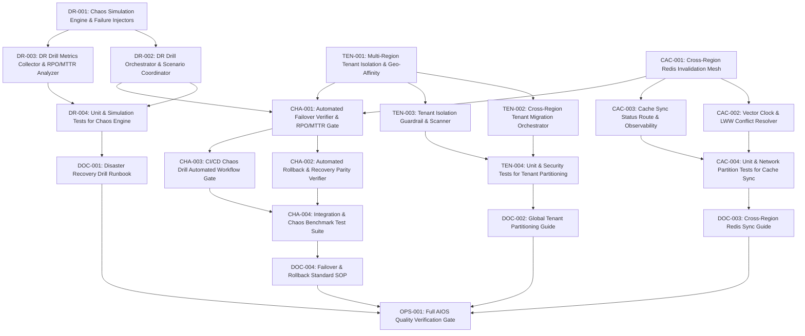

# Implementation Contract: Sprint-035 Global Multi-Tenant Cross-Region Disaster Recovery Drills & Automated Failover Verification

**Sprint ID:** SPRINT-035 (PR-035)  
**Sprint Name:** Global Multi-Tenant Cross-Region Disaster Recovery Drills & Automated Failover Verification  
**Status:** Approved Engineering Contract  
**Created Date:** 2026-08-19  
**Target Execution:** 2026-08-19 to 2026-09-16 (20-25 business days)  
**Estimated Duration:** 4-5 weeks (80-100 engineering hours)  
**Risk Level:** High (Chaos failure injection, cross-region state synchronization, multi-tenant isolation routing)  
**Classification:** AIOS v3.19 Official Implementation Contract  
**Target Release Version:** v3.19.0  
**Technical Debt Reference:** Zero Active Technical Debt (Enterprise Continuous Reliability & Platform Excellence Phase)

---

## Executive Summary

Following the successful delivery and certification of Sprint-034 (v3.18.0)—which established PostgreSQL read-replica connection pooling, dynamic query routing, multi-region edge caching, and automated supply chain security—ThaibaHive is positioned to operationalize and validate its enterprise resilience architecture.

Sprint-035 advances the platform to **v3.19.0** by delivering **Global Multi-Tenant Cross-Region Disaster Recovery Drills & Automated Failover Verification**. This sprint introduces automated chaos engineering drill harnesses, multi-region tenant partitioning with strict data isolation, cross-region Redis cache invalidation mesh synchronization, and an end-to-end automated failover verification pipeline. These capabilities validate zero data loss recovery (Recovery Point Objective, RPO = 0s) and sub-30-second recovery times (Mean Time to Recovery, MTTR < 30s) across distributed institutional deployments.

This contract provides the definitive engineering blueprint, breaking down the sprint into 21 structured implementation tasks across 5 core groups, with precise file specifications, dependencies, acceptance criteria, verification methods, risk mitigations, rollback protocols, and the definition of done.

---

## Scope

### In Scope

1. **Automated Chaos Engineering & Disaster Recovery Drill Harness:**
   - Pluggable failure injection engine simulating primary database blackouts, read-replica degradation, network partitions, and edge cache disconnects.
   - Drill orchestrator and scenario coordinator executing scripted disaster recovery scenarios.
   - Drill metrics collector computing actual RPO and MTTR values against enterprise SLAs.
   - Authenticated management API route (`/api/system/dr/drill`) and standalone execution runner (`scripts/dr/dr-drill-runner.ts`).

2. **Global Multi-Tenant Partitioning & Data Isolation Routing:**
   - Multi-region tenant routing extension in `packages/db` with tenant region affinity keys and isolation barriers.
   - Tenant-scoped database connection pool router ensuring zero cross-tenant query leakage across geographic regions.
   - Zero-downtime cross-region tenant migration orchestrator with pre- and post-migration parity validation.
   - Automated tenant isolation scanner and security guardrails (`scripts/security/tenant-isolation-scan.ts`).

3. **Cross-Region Redis Cache Synchronization & Invalidation Mesh:**
   - Distributed cache invalidation mesh broadcasting invalidation events across regional cache nodes.
   - Vector clock and timestamp-based Last-Write-Wins (LWW) conflict resolution for concurrent cross-region updates.
   - Cache sync health monitor, latency tracker, and telemetry endpoint (`/api/system/cache-sync-status`).
   - Admin Observability KPI card displaying cross-region synchronization status, latency, and mesh health.

4. **Automated Failover Verification Pipeline & Chaos Test Suites:**
   - End-to-end automated failover verifier (`scripts/dr/failover-verifier.ts`) asserting zero data loss (RPO = 0s) and recovery speed (MTTR < 30s).
   - Automated rollback and recovery parity verifier (`scripts/dr/rollback-verifier.ts`).
   - GitHub Actions automated chaos drill workflow gate (`.github/workflows/dr-chaos-drill.yml`).
   - Comprehensive integration and chaos benchmark test suites verifying database, cache, and application recovery.

5. **Operational Runbooks & AIOS Quality Governance:**
   - Disaster recovery drill and chaos engineering runbook (`docs/disaster-recovery-drill-runbook.md`).
   - Global tenant partitioning and regional isolation guide (`docs/global-tenant-partitioning-guide.md`).
   - Cross-region Redis synchronization operations manual (`docs/cross-region-cache-sync-guide.md`).
   - Failover and rollback standard operating procedures (`docs/failover-rollback-sop.md`).
   - Full AIOS quality pipeline execution (0 lint warnings, 0 type errors, 100% Jest tests passing, 0 Flutter warnings, clean build), version bump to `v3.19.0`, and status synchronization.

### Out of Scope

- Physical provisioning or billing setup for third-party cloud infrastructure (e.g., AWS multi-region VPC peering, Supabase Global, or Cloudflare Enterprise CDN accounts).
- Modifying core ERP business schemas or financial ledger validation rules.
- Mobile client UI redesigns (mobile apps interact with DR-aware APIs transparently via existing auth handoff and retry mechanisms).
- Multi-master active-active write engines (writes remain strictly routed to designated primary nodes with regional tenant partitioning).

---

## Dependencies

| Dependency | Source | Status |
| :--- | :--- | :--- |
| PostgreSQL Read-Replica Router & Dynamic Pool | `packages/db/src/replica-router.ts` | Available (v3.18.0 / REP-001) |
| Failover Detector & Circuit Breaker | `src/lib/db/failover-detector.ts`, `/api/system/failover` | Available (v3.18.0 / REP-003) |
| Replica Parity & Schema Validator | `scripts/db/replica-parity-check.ts` | Available (v3.18.0 / REP-004) |
| Edge Caching & Surrogate Purging | `src/lib/edge/cache-control.ts`, `cache-purger.ts` | Available (v3.18.0 / EDG-001, EDG-002) |
| Staging Smoke & Canary Pipeline | `scripts/staging/staging-smoke-runner.ts`, `.github/workflows/` | Available (v3.17.0, v3.18.0) |
| APM Latency & Metric Exporter | `src/lib/observability/prometheus-exporter.ts` | Available (v3.16.0) |
| Jose JWT Auth & Multi-Tenant Context | `packages/auth`, `src/lib/auth.ts` | Stable |

---

## Risks

| Risk | Severity | Mitigation |
| :--- | :--- | :--- |
| **Chaos Failure Leakage into Production:** Chaos simulation injecting real faults or dropping connections during active user sessions. | Critical | Enforce strict environment fencing (`DR_CHAOS_ENABLED=true` required, auto-blocked in `NODE_ENV=production` without explicit `--force-dr-exercise` flag and signed authorization token). Implement automatic timeout abort (max drill duration: 10 minutes). |
| **Cross-Region Cache Desynchronization / Split-Brain:** Intermittent network partitions between regional caches causing divergent states. | High | Implement vector clock versioning and Last-Write-Wins (LWW) conflict resolution with local fallback to database read-replicas upon cache desync. |
| **Cross-Tenant Data Bleed during Partition Failover:** Tenant routing rules failing during regional disaster, routing tenant traffic to incorrect regional pool. | High | Apply cryptographic tenant isolation signatures on connection contexts and validate institution ID against tenant affinity boundaries on every routed query. |
| **Failover Verification Timeout / Stalled Election:** Primary election stalling due to ambiguous WAL offset comparison across multiple replicas. | Medium | Use deterministic election ranking (lowest replication lag > highest LSN > lowest node latency) with strict 5-second election timeouts before alerting. |
| **Drill Execution Performance Overhead:** Automated chaos tests causing CPU or connection exhaustion on staging/test databases. | Medium | Enforce connection pool caps for DR harness and schedule non-production drills with rate-limited failure injection steps. |

---

## Rollback Plan

- **Chaos Emergency Abort Switch:** Calling `POST /api/system/dr/drill` with `{ "action": "abort" }` or issuing SIGINT to `scripts/dr/dr-drill-runner.ts` triggers immediate cleanup, resetting all mocked failure injectors, restoring database connection pools, and re-opening circuit breakers.
- **Tenant Geo-Routing Bypass:** Setting `TENANT_GEO_ROUTING_ENABLED=false` forces all tenant queries to route through the primary default connection pool, bypassing regional partitioning.
- **Cross-Region Cache Sync Fallback:** Setting `CACHE_CROSS_REGION_SYNC_ENABLED=false` isolates cache operations to the local region node, disabling mesh broadcasting while maintaining local caching.
- **Failover State Reset:** The failover state machine can be unconditionally reset to normal operating mode via `POST /api/system/failover` with `{ "action": "reset_primary" }`.

---

## Task Dependency Graph

---

## Detailed Task Breakdown

---

### Group 1 - Chaos Engineering & Disaster Recovery Drill Harness

---

#### DR-001 - Implement Chaos Simulation Engine & Pluggable Failure Injectors

| Field | Detail |
| :--- | :--- |
| **Task ID** | DR-001 |
| **Description** | Implement `src/lib/dr/types.ts`, `src/lib/dr/failure-injectors.ts`, and `src/lib/dr/chaos-engine.ts`. Build a modular chaos engineering harness supporting programmatic fault injection across critical layers: (1) `DatabasePrimaryDropInjector`: Simulates sudden primary database disconnect / crash; (2) `ReplicaLagInjector`: Injects artificial query latency / WAL replay delays on selected read-replicas; (3) `NetworkPartitionInjector`: Simulates regional network drops between app servers and database/cache clusters; (4) `EdgeCacheDisconnectInjector`: Simulates edge purge API timeouts. Includes an active fault registry, safety kill-switches, and automatic TTL restoration (default: faults auto-expire after 60 seconds). |
| **Files** | `src/lib/dr/types.ts` (NEW), `src/lib/dr/failure-injectors.ts` (NEW), `src/lib/dr/chaos-engine.ts` (NEW) |
| **Dependencies** | None - foundational chaos engine infrastructure |
| **Acceptance Criteria** | (1) Provides typed interfaces for failure scenarios, injectors, and drill results; (2) Supports injecting and safely removing database, replica, network, and cache faults; (3) Auto-expires any injected fault after configured duration; (4) Throws error if executed when `DR_CHAOS_ENABLED` is false; (5) Maintains active fault registry inspectable in real time. |
| **Verification Method** | Execute unit tests invoking mock fault injection; verify fault activation, safety timer expiration, and clean state restoration. |
| **Estimated Complexity** | Medium-High |

---

#### DR-002 - Implement Automated DR Drill Orchestrator & Scenario Coordinator

| Field | Detail |
| :--- | :--- |
| **Task ID** | DR-002 |
| **Description** | Implement `src/lib/dr/drill-orchestrator.ts` and API endpoint `src/app/api/system/dr/drill/route.ts`. The orchestrator executes multi-stage disaster recovery drill scenarios: (1) Scenario "PRIMARY_OUTAGE": injects primary drop -> verifies failover detection -> promotes replica -> verifies read/write continuity; (2) Scenario "REGIONAL_PARTITION": injects network partition -> verifies regional tenant fallback -> asserts data consistency; (3) Scenario "CACHE_DESYNC": injects cache mesh partition -> asserts vector clock conflict resolution. Exposes `POST /api/system/dr/drill` (start, abort, status) protected by `requireAuth` (`permission: "system:manage"`) and HMAC drill execution token. |
| **Files** | `src/lib/dr/drill-orchestrator.ts` (NEW), `src/app/api/system/dr/drill/route.ts` (NEW) |
| **Dependencies** | DR-001 |
| **Acceptance Criteria** | (1) Orchestrates multi-step failure injection and recovery sequences; (2) Supports START, STATUS, and ABORT commands; (3) Enforces single concurrent drill execution lock; (4) Emits real-time progress events; (5) Authenticated via strict system permission and HMAC secret. |
| **Verification Method** | Call `/api/system/dr/drill` with mock scenario; assert lifecycle state transitions (`IDLE` -> `INJECTING_FAULT` -> `EVALUATING_FAILOVER` -> `RESTORING` -> `COMPLETED`). |
| **Estimated Complexity** | High |

---

#### DR-003 - Implement DR Drill Metrics Collector, RPO/MTTR Analyzer & Parity Evaluator

| Field | Detail |
| :--- | :--- |
| **Task ID** | DR-003 |
| **Description** | Implement `src/lib/dr/drill-metrics.ts` and standalone CLI script `scripts/dr/dr-drill-runner.ts`. Features: (1) Records exact timestamps for fault injection ($T_{\text{fault}}$), failure detection ($T_{\text{detected}}$), failover promotion ($T_{\text{promoted}}$), and full service recovery ($T_{\text{recovered}}$); (2) Computes MTTR ($T_{\text{recovered}} - T_{\text{fault}}$) and verifies MTTR < 30.0s; (3) Measures RPO by executing canary write transactions pre-fault and asserting zero missing transactions post-recovery (RPO = 0s); (4) Executes cross-node parity validation using `scripts/db/replica-parity-check.ts` logic; (5) Emits structured JSON summary at `reports/dr-drill-report.json`. |
| **Files** | `src/lib/dr/drill-metrics.ts` (NEW), `scripts/dr/dr-drill-runner.ts` (NEW), `package.json` (MODIFY) |
| **Dependencies** | DR-001, DR-002 |
| **Acceptance Criteria** | (1) `pnpm dr:drill --scenario=primary-outage` executes automated drill; (2) Accurately calculates MTTR in milliseconds; (3) Validates zero canary transaction loss (RPO = 0s); (4) Emits formatted terminal report and structured JSON report; (5) Exits 0 if all SLA thresholds pass, exits 1 on SLA breach. |
| **Verification Method** | Execute `npx tsx scripts/dr/dr-drill-runner.ts --dry-run`; assert metric calculations and JSON report output structure. |
| **Estimated Complexity** | Medium |

---

#### DR-004 - Unit & Simulation Test Suite for Chaos Engine & Drill Orchestrator

| Field | Detail |
| :--- | :--- |
| **Task ID** | DR-004 |
| **Description** | Author comprehensive unit and mock simulation tests in `src/lib/dr/__tests__/chaos-engine.test.ts`, `src/lib/dr/__tests__/drill-orchestrator.test.ts`, and `src/app/api/system/dr/__tests__/route.test.ts`. Test scenarios: (1) Fault injection activation and automatic expiration timer; (2) Drill orchestrator state machine execution through primary outage scenario; (3) Emergency drill abort immediately restoring all connections; (4) Concurrent drill prevention; (5) Unauthorized API request rejection (401/403); (6) Accurate MTTR and RPO metric computations. |
| **Files** | `src/lib/dr/__tests__/chaos-engine.test.ts` (NEW), `src/lib/dr/__tests__/drill-orchestrator.test.ts` (NEW), `src/app/api/system/dr/__tests__/route.test.ts` (NEW) |
| **Dependencies** | DR-001, DR-002, DR-003 |
| **Acceptance Criteria** | (1) 100% test pass rate across all chaos engine and drill orchestrator test suites; (2) Code coverage > 90% on DR modules; (3) Zero hanging asynchronous timers. |
| **Verification Method** | `pnpm test -- src/lib/dr` exits 0 with all test cases passing. |
| **Estimated Complexity** | Medium |

---

### Group 2 - Global Tenant Partitioning & Cross-Region Data Isolation

---

#### TEN-001 - Implement Multi-Region Tenant Isolation Routing & Geo-Affinity Middleware

| Field | Detail |
| :--- | :--- |
| **Task ID** | TEN-001 |
| **Description** | Implement `packages/db/src/tenant-router.ts`, `src/middleware/tenant-region.ts`, and update `packages/db/src/types.ts`. Enhances database routing with tenant geographic affinity: (1) Maps tenant/institution ID to assigned primary region (e.g. `us-east`, `eu-central`, `ap-south`, `default`); (2) Routes tenant queries to region-specific replica/primary pools with connection tagging; (3) Enforces strict cross-tenant data isolation: validates that queries with tenant context match the target connection pool partition; (4) Injects `x-tenant-region` header in Next.js middleware; (5) Supports fallback to global pool if region is degraded. |
| **Files** | `packages/db/src/tenant-router.ts` (NEW), `src/middleware/tenant-region.ts` (NEW), `packages/db/src/types.ts` (MODIFY), `packages/db/src/index.ts` (MODIFY) |
| **Dependencies** | None - foundational tenant routing infrastructure |
| **Acceptance Criteria** | (1) `getTenantDb(tenantId)` returns database client bound to tenant's geographic partition; (2) Middleware assigns `x-tenant-region` based on user token / institution metadata; (3) Throws `TenantIsolationError` on cross-tenant partition violations; (4) Supports seamless fallback when `TENANT_GEO_ROUTING_ENABLED=false`. |
| **Verification Method** | Execute unit tests routing queries across distinct tenant regions; assert correct connection selection and isolation enforcement. |
| **Estimated Complexity** | Medium-High |

---

#### TEN-002 - Implement Cross-Region Tenant Migration & Parity Orchestrator

| Field | Detail |
| :--- | :--- |
| **Task ID** | TEN-002 |
| **Description** | Implement `src/lib/tenant/tenant-migration.ts` and API endpoint `src/app/api/system/tenant/migrate/route.ts`. Orchestrates seamless migration of a tenant from one region pool to another: (1) Enters tenant read-only sync mode; (2) Replicates tenant-scoped rows (`institutions`, `users`, `departments`, `financeTransactions`, `auditLogs`) to destination region; (3) Verifies 100% SHA-256 data checksum parity between source and destination; (4) Switches tenant region routing key atomically; (5) Releases read-only sync lock; (6) Emits structured migration audit event. Protected by `requireAuth` (`permission: "system:manage"`). |
| **Files** | `src/lib/tenant/tenant-migration.ts` (NEW), `src/app/api/system/tenant/migrate/route.ts` (NEW) |
| **Dependencies** | TEN-001 |
| **Acceptance Criteria** | (1) Migrates tenant data across regional partitions without data loss; (2) Enforces checksum parity before committing region pointer change; (3) Rolls back cleanly on replication failure; (4) Total tenant read-only lock window < 5.0 seconds for standard datasets; (5) Endpoint provides migration status and progress polling. |
| **Verification Method** | Execute mock tenant migration in test harness; verify row transfer, checksum verification, and routing key update. |
| **Estimated Complexity** | High |

---

#### TEN-003 - Implement Cross-Tenant Data Leak Guardrail & Isolation Integrity Scanner

| Field | Detail |
| :--- | :--- |
| **Task ID** | TEN-003 |
| **Description** | Implement `src/lib/security/tenant-guard.ts` and standalone scanner `scripts/security/tenant-isolation-scan.ts`. Features: (1) `TenantGuard`: runtime query inspector validating that all multi-tenant Drizzle queries include an explicit `institutionId` / `tenantId` filter; (2) `scripts/security/tenant-isolation-scan.ts`: static code and schema analyzer scanning all API routes, server actions, and database queries for missing tenant predicates; (3) Emits a security audit report at `reports/tenant-isolation-report.json`; (4) Integrates with CI to prevent regressions. |
| **Files** | `src/lib/security/tenant-guard.ts` (NEW), `scripts/security/tenant-isolation-scan.ts` (NEW), `package.json` (MODIFY) |
| **Dependencies** | TEN-001 |
| **Acceptance Criteria** | (1) `pnpm security:tenants` executes isolation scan; (2) Detects un-scoped multi-tenant queries; (3) Runtime `TenantGuard` throws error if un-scoped query executed in tenant context; (4) Exits 0 on 100% isolated queries, exits 1 on detected leaks; (5) Execution finishes in < 15 seconds. |
| **Verification Method** | Run `npx tsx scripts/security/tenant-isolation-scan.ts`; verify zero un-scoped tenant queries detected in current codebase. |
| **Estimated Complexity** | Medium |

---

#### TEN-004 - Unit & Security Test Suite for Tenant Partitioning & Migration

| Field | Detail |
| :--- | :--- |
| **Task ID** | TEN-004 |
| **Description** | Author unit and security tests in `packages/db/src/__tests__/tenant-router.test.ts`, `src/lib/tenant/__tests__/tenant-migration.test.ts`, and `scripts/security/__tests__/tenant-isolation-scan.test.ts`. Test scenarios: (1) Tenant queries correctly route to assigned region; (2) Cross-tenant query execution is blocked by `TenantGuard`; (3) Tenant migration copies data, validates parity, and updates routing; (4) Migration aborts and rolls back on checksum mismatch; (5) Static isolation scanner flags synthetic un-scoped query. |
| **Files** | `packages/db/src/__tests__/tenant-router.test.ts` (NEW), `src/lib/tenant/__tests__/tenant-migration.test.ts` (NEW), `scripts/security/__tests__/tenant-isolation-scan.test.ts` (NEW) |
| **Dependencies** | TEN-001, TEN-002, TEN-003 |
| **Acceptance Criteria** | (1) 100% test pass rate across tenant routing, migration, and security scanner suites; (2) Zero cross-tenant data leakage under all failure tests; (3) Coverage > 90% on tenant infrastructure. |
| **Verification Method** | `pnpm test -- tenant-router tenant-migration tenant-isolation` exits 0 with all tests passing. |
| **Estimated Complexity** | Medium |

---

### Group 3 - Cross-Region Redis Synchronization & Invalidation Mesh

---

#### CAC-001 - Implement Cross-Region Redis Invalidation Mesh & Event Broadcaster

| Field | Detail |
| :--- | :--- |
| **Task ID** | CAC-001 |
| **Description** | Implement `src/lib/cache/types.ts`, `src/lib/cache/redis-cluster.ts`, and `src/lib/cache/cross-region-mesh.ts`. Implements a distributed cache invalidation mesh: (1) Manages connections to regional Redis instances / clusters (`REDIS_REGION_URLS`); (2) Publishes cache invalidation events (key, tag, timestamp, source region) across Redis Pub/Sub channels or webhook mesh; (3) Subscribes to peer region invalidation channels, purging local in-memory and edge cache entries upon receiving events; (4) Batches high-throughput invalidations (50ms debouncing window); (5) Gracefully degrades to local-only caching if peer region mesh is unreachable. |
| **Files** | `src/lib/cache/types.ts` (NEW), `src/lib/cache/redis-cluster.ts` (NEW), `src/lib/cache/cross-region-mesh.ts` (NEW) |
| **Dependencies** | None - foundational cache mesh infrastructure |
| **Acceptance Criteria** | (1) Invalidation on Region A broadcasts event received and processed by Region B within < 100ms; (2) Supports single-key and surrogate-tag batch invalidations; (3) Degrades to local caching with zero unhandled promise rejections on network partition; (4) Honors `CACHE_CROSS_REGION_SYNC_ENABLED=false` kill-switch. |
| **Verification Method** | Execute integration test with mock regional Redis nodes; verify cross-region event propagation and local cache purge execution. |
| **Estimated Complexity** | Medium-High |

---

#### CAC-002 - Implement Vector Clock & Last-Write-Wins (LWW) Conflict Resolution

| Field | Detail |
| :--- | :--- |
| **Task ID** | CAC-002 |
| **Description** | Implement `src/lib/cache/vector-clock.ts` and `src/lib/cache/conflict-resolver.ts`. Resolves concurrent cache mutations and desynchronization across regions: (1) Attaches vector clock `(regionId, sequenceNumber, timestamp)` metadata to all distributed cache entries; (2) Detects concurrent write conflicts across regions; (3) Applies deterministic Last-Write-Wins (LWW) resolution based on hybrid logical clocks; (4) If vector clock anomaly or causal violation is detected, invalidates cache entry forcing database re-fetch; (5) Logs conflict resolution telemetry. |
| **Files** | `src/lib/cache/vector-clock.ts` (NEW), `src/lib/cache/conflict-resolver.ts` (NEW) |
| **Dependencies** | CAC-001 |
| **Acceptance Criteria** | (1) Vector clocks correctly track causal relationships across regions; (2) Resolves concurrent conflicting writes deterministically via LWW; (3) Automatically purges stale/divergent cache entries on detected anomaly; (4) Zero infinite resolution loops. |
| **Verification Method** | Execute unit tests injecting out-of-order and concurrent vector clock events; assert deterministic resolution and invalidation triggers. |
| **Estimated Complexity** | Medium |

---

#### CAC-003 - Implement Cache Sync Status Route, Health Monitor & Telemetry

| Field | Detail |
| :--- | :--- |
| **Task ID** | CAC-003 |
| **Description** | Implement `src/app/api/system/cache-sync-status/route.ts`, `src/lib/observability/cache-sync-telemetry.ts`, and Admin Observability UI card `src/app/(shell)/admin/observability/_components/cache-sync-card.tsx`. Features: (1) GET `/api/system/cache-sync-status` returns regional cluster health, peer connection latencies, sync queue depth, and conflict rates; (2) Exposes Prometheus metric families `thaibahive_cache_sync_latency_ms`, `thaibahive_cache_sync_events_total`, and `thaibahive_cache_conflicts_total` in `/api/system/metrics`; (3) Admin Observability UI renders live sync status card with region topology indicator. |
| **Files** | `src/app/api/system/cache-sync-status/route.ts` (NEW), `src/lib/observability/cache-sync-telemetry.ts` (NEW), `src/app/(shell)/admin/observability/_components/cache-sync-card.tsx` (NEW), `src/app/(shell)/admin/observability/page.tsx` (MODIFY), `src/lib/observability/prometheus-exporter.ts` (MODIFY) |
| **Dependencies** | CAC-001, CAC-002 |
| **Acceptance Criteria** | (1) `/api/system/cache-sync-status` returns structured health JSON; (2) Prometheus metrics correctly reflect sync metrics; (3) Observability UI renders Cache Sync KPI card with 0 accessibility violations; (4) Protected by RBAC `system:manage` or header secret. |
| **Verification Method** | Call status endpoint and render UI card in test environment; assert metric accuracy and visual conformity. |
| **Estimated Complexity** | Low-Medium |

---

#### CAC-004 - Unit & Mock Network Partition Tests for Cache Sync Mesh

| Field | Detail |
| :--- | :--- |
| **Task ID** | CAC-004 |
| **Description** | Author comprehensive unit and network partition tests in `src/lib/cache/__tests__/cross-region-mesh.test.ts`, `src/lib/cache/__tests__/conflict-resolver.test.ts`, and `src/app/api/system/cache-sync-status/__tests__/route.test.ts`. Test scenarios: (1) Invalidation event broadcast and receipt across 3 simulated regions; (2) Vector clock comparison and LWW resolution for concurrent updates; (3) Network partition simulation: peer node disconnect does not crash local app; (4) Re-connection and resynchronization after partition heal; (5) Status API returns valid diagnostics under healthy and degraded states. |
| **Files** | `src/lib/cache/__tests__/cross-region-mesh.test.ts` (NEW), `src/lib/cache/__tests__/conflict-resolver.test.ts` (NEW), `src/app/api/system/cache-sync-status/__tests__/route.test.ts` (NEW) |
| **Dependencies** | CAC-001, CAC-002, CAC-003 |
| **Acceptance Criteria** | (1) 100% test pass rate across all cache mesh and conflict resolution suites; (2) Coverage > 90% on cache synchronization modules; (3) Clean teardown of all mock timers and sockets. |
| **Verification Method** | `pnpm test -- src/lib/cache` exits 0 with all test cases green. |
| **Estimated Complexity** | Medium |

---

### Group 4 - Automated Failover Verification & Chaos Testing Pipeline

---

#### CHA-001 - Implement End-to-End Automated Failover Verifier & RPO/MTTR Assertion Gate

| Field | Detail |
| :--- | :--- |
| **Task ID** | CHA-001 |
| **Description** | Implement `scripts/dr/failover-verifier.ts`. This automated verification orchestrator executes an end-to-end failover test: (1) Writes canary transaction batches with known cryptographic hashes; (2) Injects primary database termination; (3) Awaits automated failover detection and replica promotion via `src/lib/db/failover-detector.ts`; (4) Validates write resume capability on promoted primary; (5) Asserts zero data loss (all pre-failure canary hashes verified, RPO = 0s); (6) Asserts MTTR < 30.0 seconds; (7) Emits machine-readable report at `reports/failover-verification-report.json`. |
| **Files** | `scripts/dr/failover-verifier.ts` (NEW), `package.json` (MODIFY) |
| **Dependencies** | DR-002, DR-003, TEN-001, CAC-001 |
| **Acceptance Criteria** | (1) `pnpm dr:verify:failover` executes automated failover test; (2) Programmatically verifies RPO = 0s (zero lost transactions); (3) Verifies MTTR < 30 seconds; (4) Emits structured verification report; (5) Exits 0 on success, exits 1 on SLA violation. |
| **Verification Method** | Run `npx tsx scripts/dr/failover-verifier.ts --dry-run` and live in test harness; assert verification assertions and report generation. |
| **Estimated Complexity** | Medium-High |

---

#### CHA-002 - Implement Automated Rollback & Recovery Parity Verifier

| Field | Detail |
| :--- | :--- |
| **Task ID** | CHA-002 |
| **Description** | Implement `scripts/dr/rollback-verifier.ts`. Tests and verifies the post-disaster recovery and demotion procedures: (1) Restores original primary node as a replica; (2) Initiates WAL synchronization and catches up replay offsets; (3) Executes `scripts/db/replica-parity-check.ts` to assert 100% schema and data checksum parity; (4) Tests controlled switchback from promoted node back to original primary; (5) Asserts zero transaction drop during switchback; (6) Emits rollback verification report at `reports/rollback-verification-report.json`. |
| **Files** | `scripts/dr/rollback-verifier.ts` (NEW), `package.json` (MODIFY) |
| **Dependencies** | CHA-001 |
| **Acceptance Criteria** | (1) `pnpm dr:verify:rollback` executes rollback and parity verification; (2) Confirms 100% data parity between original and promoted nodes; (3) Validates clean switchback with zero downtime; (4) Exits 0 on success, exits 1 on parity mismatch. |
| **Verification Method** | Execute rollback verifier in test environment; assert node demotion, resync, and checksum validation. |
| **Estimated Complexity** | Medium |

---

#### CHA-003 - Implement CI/CD Chaos Drill Automated Workflow Gate

| Field | Detail |
| :--- | :--- |
| **Task ID** | CHA-003 |
| **Description** | Create `.github/workflows/dr-chaos-drill.yml` and evaluator script `scripts/staging/dr-canary-evaluator.ts`. Automates disaster recovery verification in CI/CD staging environments: (1) Triggers on weekly schedule (`0 3 * * 0`) and on pre-release tags; (2) Deploys multi-node staging cluster; (3) Runs `scripts/dr/failover-verifier.ts` and `scripts/dr/rollback-verifier.ts`; (4) Evaluates results: fails pipeline if MTTR >= 30s or RPO > 0s; (5) Publishes comprehensive markdown report to GitHub Step Summary and notifies engineering channel. |
| **Files** | `.github/workflows/dr-chaos-drill.yml` (NEW), `scripts/staging/dr-canary-evaluator.ts` (NEW) |
| **Dependencies** | CHA-001, CHA-002 |
| **Acceptance Criteria** | (1) GitHub Actions workflow executes automated chaos drill; (2) Fails CI build if DR SLAs breached (MTTR < 30s, RPO = 0s); (3) Generates detailed markdown drill summary; (4) Supports manual trigger with scenario selector. |
| **Verification Method** | Test `scripts/staging/dr-canary-evaluator.ts` with passing and failing report JSON inputs; verify exit codes and summary formatting. |
| **Estimated Complexity** | Medium |

---

#### CHA-004 - Comprehensive Integration & Chaos Benchmark Test Suite

| Field | Detail |
| :--- | :--- |
| **Task ID** | CHA-004 |
| **Description** | Author end-to-end integration and chaos simulation tests in `src/lib/dr/__tests__/failover-integration.test.ts`, `scripts/dr/__tests__/failover-verifier.test.ts`, and `scripts/dr/__tests__/rollback-verifier.test.ts`. Test scenarios: (1) Complete primary blackout -> automated election -> read/write verification; (2) Cross-region Redis network partition -> cache degradation -> reconnection resync; (3) Multi-tenant geo-routing resilience during single-region outage; (4) Evaluator correctly parses drill metrics and enforces RPO/MTTR thresholds. |
| **Files** | `src/lib/dr/__tests__/failover-integration.test.ts` (NEW), `scripts/dr/__tests__/failover-verifier.test.ts` (NEW), `scripts/dr/__tests__/rollback-verifier.test.ts` (NEW) |
| **Dependencies** | CHA-001, CHA-002, CHA-003 |
| **Acceptance Criteria** | (1) 100% test pass rate across all end-to-end failover and chaos integration test suites; (2) Zero race conditions or unhandled rejections; (3) Mock timers properly cleaned up. |
| **Verification Method** | `pnpm test -- failover-integration failover-verifier rollback-verifier` exits 0 with all assertions green. |
| **Estimated Complexity** | Medium |

---

### Group 5 - Operational Runbooks & AIOS Quality Governance

---

#### DOC-001 - Author Disaster Recovery Drill & Chaos Engineering Runbook

| Field | Detail |
| :--- | :--- |
| **Task ID** | DOC-001 |
| **Description** | Author a comprehensive operations guide in `docs/disaster-recovery-drill-runbook.md`. Detail: (1) Chaos engineering architecture and safety guardrails; (2) Step-by-step instructions for scheduling and executing DR drills (`pnpm dr:drill`); (3) Supported drill scenarios (Primary Drop, Regional Partition, Cache Desync); (4) Interpreting MTTR and RPO metrics; (5) Emergency drill abort procedures and post-drill remediation checklist. |
| **Files** | `docs/disaster-recovery-drill-runbook.md` (NEW) |
| **Dependencies** | DR-001, DR-002, DR-003, DR-004 |
| **Acceptance Criteria** | (1) Runbook covers all 5 required operational sections; (2) Includes CLI command examples and scenario configurations; (3) Reviewed and approved for operational clarity. |
| **Verification Method** | Peer review of markdown document against AIOS engineering documentation guidelines. |
| **Estimated Complexity** | Low |

---

#### DOC-002 - Author Global Tenant Partitioning & Regional Isolation Guide

| Field | Detail |
| :--- | :--- |
| **Task ID** | DOC-002 |
| **Description** | Author an engineering and operations manual in `docs/global-tenant-partitioning-guide.md`. Detail: (1) Multi-region tenant partitioning architecture and geo-affinity mapping; (2) Database connection pool isolation model; (3) Tenant migration procedures (`/api/system/tenant/migrate`) and parity validation; (4) Tenant isolation scanner usage (`pnpm security:tenants`) and CI integration; (5) Troubleshooting cross-region routing anomalies. |
| **Files** | `docs/global-tenant-partitioning-guide.md` (NEW) |
| **Dependencies** | TEN-001, TEN-002, TEN-003, TEN-004 |
| **Acceptance Criteria** | (1) Covers architecture, migration SOPs, and security scanner usage; (2) Provides step-by-step tenant migration checklist; (3) Verified for technical accuracy. |
| **Verification Method** | Peer review of markdown document against AIOS engineering documentation guidelines. |
| **Estimated Complexity** | Low |

---

#### DOC-003 - Author Cross-Region Redis Synchronization & Mesh Operations Manual

| Field | Detail |
| :--- | :--- |
| **Task ID** | DOC-003 |
| **Description** | Author an operational runbook in `docs/cross-region-cache-sync-guide.md`. Detail: (1) Multi-region Redis mesh topology and invalidation Pub/Sub channels; (2) Vector clock mechanics and Last-Write-Wins (LWW) conflict resolution; (3) Cache synchronization health monitoring and status interpretation (`/api/system/cache-sync-status`); (4) Network partition handling and degraded mode behavior; (5) Incident response for high cache conflict rates. |
| **Files** | `docs/cross-region-cache-sync-guide.md` (NEW) |
| **Dependencies** | CAC-001, CAC-002, CAC-003, CAC-004 |
| **Acceptance Criteria** | (1) Covers topology, conflict resolution, and operational monitoring; (2) Provides troubleshooting steps for cache mesh desynchronization; (3) Verified for technical clarity. |
| **Verification Method** | Peer review of markdown document against AIOS engineering documentation guidelines. |
| **Estimated Complexity** | Low |

---

#### DOC-004 - Author Failover & Rollback Standard Operating Procedure (SOP)

| Field | Detail |
| :--- | :--- |
| **Task ID** | DOC-004 |
| **Description** | Author an emergency incident response standard operating procedure in `docs/failover-rollback-sop.md`. Detail: (1) Automated vs. manual database failover decision matrix; (2) Primary promotion execution steps and verification; (3) Post-incident rollback and replica re-sync SOP; (4) Parity verification before re-integrating demoted nodes; (5) Post-mortem template and RPO/MTTR reporting guidelines. |
| **Files** | `docs/failover-rollback-sop.md` (NEW) |
| **Dependencies** | CHA-001, CHA-002, CHA-003, CHA-004 |
| **Acceptance Criteria** | (1) Provides clear step-by-step emergency incident flow; (2) Contains complete rollback and switchback checklists; (3) Approved for operational readiness. |
| **Verification Method** | Peer review of markdown document against AIOS engineering documentation guidelines. |
| **Estimated Complexity** | Low |

---

#### OPS-001 - Full Pipeline Quality Gate, Project Status & Changelog Update

| Field | Detail |
| :--- | :--- |
| **Task ID** | OPS-001 |
| **Description** | Execute the complete AIOS quality verification pipeline: (1) `pnpm lint` - 0 errors, 0 warnings; (2) `pnpm typecheck` - 0 TypeScript errors; (3) `pnpm test` - all Jest test suites pass (966 baseline + new DR, tenant, cache, and chaos suites = 1000+ tests); (4) `cd thaibahive_mobile_app && flutter analyze && flutter test` - 0 errors/warnings; (5) `pnpm build` - clean production build. Update `.ai/PROJECT_STATUS.md` reflecting v3.19.0 sprint execution, zero active technical debt, and update `.ai/CHANGELOG.md` with Sprint-035 deliverables. |
| **Files** | `.ai/PROJECT_STATUS.md` (MODIFY), `.ai/CHANGELOG.md` (MODIFY), `package.json` (MODIFY) |
| **Dependencies** | DR-004, TEN-004, CAC-004, CHA-004, DOC-001, DOC-002, DOC-003, DOC-004 |
| **Acceptance Criteria** | (1) All lint, typecheck, test, and build commands succeed with 0 errors; (2) Total Jest tests increased to 1000+ tests with 100% pass rate; (3) Zero active technical debt on backlog; (4) `.ai/PROJECT_STATUS.md` and `.ai/CHANGELOG.md` updated per AIOS governance standards. |
| **Verification Method** | Execute all CI validation commands locally; verify exit codes 0 and inspect documentation diffs. |
| **Estimated Complexity** | Low |

---

## Task Summary Table

| Task ID | Group | Description | Complexity | Dependencies |
| :--- | :--- | :--- | :--- | :--- |
| **DR-001** | Chaos Engine & DR | Implement Chaos Simulation Engine & Pluggable Failure Injectors | Medium-High | None |
| **DR-002** | Chaos Engine & DR | Implement Automated DR Drill Orchestrator & Scenario Coordinator | High | DR-001 |
| **DR-003** | Chaos Engine & DR | Implement DR Drill Metrics Collector, RPO/MTTR Analyzer & Parity Evaluator | Medium | DR-001, DR-002 |
| **DR-004** | Chaos Engine & DR | Unit & Simulation Test Suite for Chaos Engine & Drill Orchestrator | Medium | DR-001, DR-002, DR-003 |
| **TEN-001** | Tenant Partitioning | Implement Multi-Region Tenant Isolation Routing & Geo-Affinity Middleware | Medium-High | None |
| **TEN-002** | Tenant Partitioning | Implement Cross-Region Tenant Migration & Parity Orchestrator | High | TEN-001 |
| **TEN-003** | Tenant Partitioning | Implement Cross-Tenant Data Leak Guardrail & Isolation Integrity Scanner | Medium | TEN-001 |
| **TEN-004** | Tenant Partitioning | Unit & Security Test Suite for Tenant Partitioning & Migration | Medium | TEN-001, TEN-002, TEN-003 |
| **CAC-001** | Cross-Region Cache | Implement Cross-Region Redis Invalidation Mesh & Event Broadcaster | Medium-High | None |
| **CAC-002** | Cross-Region Cache | Implement Vector Clock & Last-Write-Wins (LWW) Conflict Resolution | Medium | CAC-001 |
| **CAC-003** | Cross-Region Cache | Implement Cache Sync Status Route, Health Monitor & Telemetry | Low-Medium | CAC-001, CAC-002 |
| **CAC-004** | Cross-Region Cache | Unit & Mock Network Partition Tests for Cache Sync Mesh | Medium | CAC-001, CAC-002, CAC-003 |
| **CHA-001** | Failover Verification | Implement End-to-End Automated Failover Verifier & RPO/MTTR Assertion Gate | Medium-High | DR-002, DR-003, TEN-001, CAC-001 |
| **CHA-002** | Failover Verification | Implement Automated Rollback & Recovery Parity Verifier | Medium | CHA-001 |
| **CHA-003** | Failover Verification | Implement CI/CD Chaos Drill Automated Workflow Gate | Medium | CHA-001, CHA-002 |
| **CHA-004** | Failover Verification | Comprehensive Integration & Chaos Benchmark Test Suite | Medium | CHA-001, CHA-002, CHA-003 |
| **DOC-001** | Documentation | Author Disaster Recovery Drill & Chaos Engineering Runbook | Low | DR-001, DR-002, DR-003, DR-004 |
| **DOC-002** | Documentation | Author Global Tenant Partitioning & Regional Isolation Guide | Low | TEN-001, TEN-002, TEN-003, TEN-004 |
| **DOC-003** | Documentation | Author Cross-Region Redis Synchronization & Mesh Operations Manual | Low | CAC-001, CAC-002, CAC-003, CAC-004 |
| **DOC-004** | Documentation | Author Failover & Rollback Standard Operating Procedure (SOP) | Low | CHA-001, CHA-002, CHA-003, CHA-004 |
| **OPS-001** | Quality & Ops | Full Pipeline Quality Gate, Project Status & Changelog Update | Low | DR-004, TEN-004, CAC-004, CHA-004, DOC-001-004 |

**Total Tasks:** 21  
**Complexity Breakdown:** 2 High, 4 Medium-High, 9 Medium, 1 Low-Medium, 5 Low  

---

## Acceptance Criteria Summary

### Chaos Engineering & Disaster Recovery Drill Harness (DR-001 - DR-004)
- [ ] Failure injection engine supports database drops, replica lag, network partitions, and edge disconnects with auto-expiring safety timers.
- [ ] Drill orchestrator executes scripted scenarios (Primary Outage, Regional Partition, Cache Desync) with start/status/abort controls.
- [ ] Metrics collector computes exact MTTR and verifies zero transaction loss (RPO = 0s).
- [ ] Standalone runner `pnpm dr:drill` outputs terminal reports and structured JSON summaries at `reports/dr-drill-report.json`.
- [ ] 100% test pass rate across chaos engine and drill orchestrator unit suites.

### Global Tenant Partitioning & Data Isolation (TEN-001 - TEN-004)
- [ ] Multi-region tenant router directs queries to geo-affinity pools and injects `x-tenant-region` headers.
- [ ] Cross-region tenant migration orchestrates live data replication, checksum parity verification, and atomic routing cutover.
- [ ] Static and runtime `TenantGuard` scanner detects and blocks un-scoped multi-tenant queries.
- [ ] `pnpm security:tenants` executes isolation scan with zero detected cross-tenant leaks.
- [ ] 100% test pass rate across tenant routing, migration, and security isolation suites.

### Cross-Region Redis Cache Synchronization (CAC-001 - CAC-004)
- [ ] Distributed cache mesh broadcasts invalidation events across regions with < 100ms propagation latency.
- [ ] Vector clocks and LWW conflict resolution resolve concurrent cross-region updates deterministically.
- [ ] Endpoint `/api/system/cache-sync-status` returns regional cluster health, latency, queue depth, and conflict rates.
- [ ] Admin Observability console renders Cache Sync KPI card and Prometheus metric exporter exposes sync families.
- [ ] 100% test pass rate under simulated network partition and partition healing scenarios.

### Automated Failover Verification & Chaos Pipeline (CHA-001 - CHA-004)
- [ ] Failover verifier `pnpm dr:verify:failover` asserts RPO = 0s and MTTR < 30s during primary failure.
- [ ] Rollback verifier `pnpm dr:verify:rollback` asserts 100% data parity and clean switchback.
- [ ] GitHub Actions workflow `.github/workflows/dr-chaos-drill.yml` gates releases on passing DR drill criteria.
- [ ] Comprehensive integration test suite covers database, cache, and tenant resilience under failure conditions.

### Operational Runbooks & Quality Governance (DOC-001 - DOC-004, OPS-001)
- [ ] `docs/disaster-recovery-drill-runbook.md`, `docs/global-tenant-partitioning-guide.md`, `docs/cross-region-cache-sync-guide.md`, and `docs/failover-rollback-sop.md` committed.
- [ ] `pnpm lint`, `pnpm typecheck`, `pnpm test` (1000+ tests), and `pnpm build` pass with 0 errors.
- [ ] `flutter analyze` and `flutter test` pass with 0 errors.
- [ ] `.ai/PROJECT_STATUS.md` and `.ai/CHANGELOG.md` updated per AIOS governance standards.

---

## Definition of Done

Sprint-035 is considered complete when **all** of the following conditions are satisfied:

1. **DR Drill Harness Operational:** Programmatic chaos failure injectors, scenario coordinator, and metrics analyzer are implemented, verified, and executable via CLI and authenticated API.
2. **Global Tenant Partitioning Live:** Geo-affinity tenant connection routing, zero-downtime tenant migration, and tenant isolation scanners are operational with zero detected cross-tenant leakage.
3. **Cross-Region Cache Mesh Synchronized:** Multi-region Redis invalidation mesh, vector clock conflict resolver, and cache sync telemetry cards are functional and resilient to network partitions.
4. **Automated Failover Verification Certified:** Failover and rollback verifiers execute in CI/CD staging gates, asserting RPO = 0s (zero data loss) and MTTR < 30s (sub-30s recovery).
5. **Operational Runbooks Published:** Comprehensive operational guides for DR drills, tenant partitioning, cache synchronization, and failover SOPs are published in `docs/`.
6. **AIOS Quality Pipeline 100% Green:**
   - `pnpm lint` reports 0 errors, 0 warnings.
   - `pnpm typecheck` reports 0 TypeScript errors.
   - `pnpm test` executes with 100% pass rate across 1000+ tests.
   - `flutter analyze` and `flutter test` in `thaibahive_mobile_app/` report 0 errors/warnings.
   - `pnpm build` produces a clean production build.
7. **AIOS Governance Artifacts Synchronized:** Execution log (`.ai/execution/Sprint-035-Execution-Log.md`), `.ai/PROJECT_STATUS.md`, and `.ai/CHANGELOG.md` reflect all Sprint-035 deliverables under release version **v3.19.0**.

---

## Release Impact

- **Release Version:** v3.19.0
- **Database Schema Migrations:** None (operates via connection pool abstractions, routing keys, and existing schema metadata).
- **Environment Variables Required:**
  - `DR_CHAOS_ENABLED`: Enables chaos failure injection engine (`true` / `false`).
  - `TENANT_GEO_ROUTING_ENABLED`: Enables multi-region tenant pool routing (`true` / `false`).
  - `CACHE_CROSS_REGION_SYNC_ENABLED`: Enables cross-region Redis mesh broadcasting (`true` / `false`).
  - `REDIS_REGION_URLS`: Comma-separated list of regional Redis endpoints.
  - `DR_DRILL_SECRET`: Shared HMAC secret for authenticating automated DR drill execution.
- **Backward Compatibility:** 100% backward compatible. All disaster recovery, tenant geo-routing, and cache synchronization features default to graceful local fallbacks when configuration flags are disabled.

---

*Contract Author: Implementation Engineer (Antigravity)*  
*Reviewed & Recommended By: Product Engineering Manager*  
*Architecture Approval: Architecture Lead*  
*Date: 2026-08-19*  
*ThaibaHive Institution OS - AIOS v3.19 Implementation Contract*
