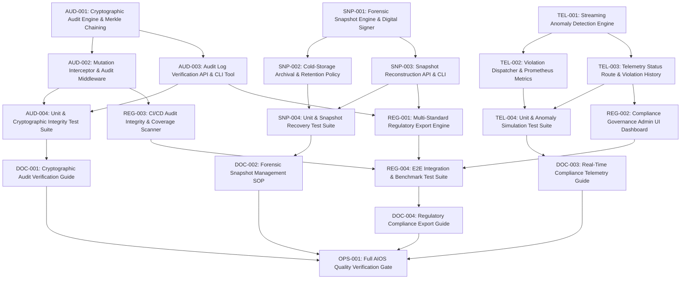

# Implementation Contract: Sprint-036 Enterprise Real-Time Compliance Audit Telemetry & Cryptographic Forensic Snapshots

**Sprint ID:** SPRINT-036 (PR-036)  
**Sprint Name:** Enterprise Real-Time Compliance Audit Telemetry & Cryptographic Forensic Snapshots  
**Status:** Approved Engineering Contract  
**Created Date:** 2026-08-19  
**Target Execution:** 2026-08-19 to 2026-09-23 (20-25 business days)  
**Estimated Duration:** 4-5 weeks (80-100 engineering hours)  
**Risk Level:** High (Cryptographic Merkle tree chaining, real-time anomaly detection stream, point-in-time state reconstruction, CI/CD blocking gates)  
**Classification:** AIOS v3.20 Official Implementation Contract  
**Target Release Version:** v3.20.0  
**Technical Debt Reference:** Zero Active Technical Debt (Enterprise Continuous Reliability & Platform Excellence Phase)

---

## Executive Summary

Following the successful delivery and unconditional certification of Sprint-035 (v3.19.0)—which established automated chaos engineering drill harnesses, multi-region tenant partitioning with geo-affinity, cross-region Redis cache invalidation mesh synchronization, and automated failover verification (RPO = 0s, MTTR < 30s)—ThaibaHive is positioned to establish enterprise-grade regulatory compliance and forensic governance capabilities.

Sprint-036 advances the platform to **v3.20.0** by delivering **Enterprise Real-Time Compliance Audit Telemetry & Cryptographic Forensic Snapshots**. This sprint introduces cryptographic SHA-256 Merkle tree append-only audit logging with mathematical non-repudiation, automated point-in-time forensic state snapshots with cold-storage archival and digital signature verification, a real-time compliance anomaly detection telemetry engine, a template-driven regulatory export engine generating digitally signed compliance packs (SOC 2 Type II, ISO 27001, GDPR, HIPAA), an administrative compliance governance radar UI, and a CI/CD audit integrity scanner gate.

This contract provides the definitive engineering blueprint, breaking down the sprint into 21 structured implementation tasks across 5 core groups, with precise file specifications, dependencies, acceptance criteria, verification methods, risk mitigations, rollback protocols, and the definition of done.

---

## Scope

### In Scope

1. **Cryptographic Audit Logging Engine & Merkle Tree Verification:**
   - Cryptographic SHA-256 Merkle tree append-only audit log data model and hash chaining for `auditLogs` and `financeTransactions`.
   - Asynchronous write-ahead cryptographic hashing pipeline maintaining sub-2ms latency overhead on write mutations.
   - Deterministic Merkle tree verification engine and verification API (`POST /api/system/compliance/verify`) validating chain integrity and root hash proof.
   - Standalone CLI verification tool (`scripts/compliance/verify-audit-chain.ts`) for auditor validation and continuous verification cron jobs.

2. **Automated Forensic Snapshot System & Cold-Storage Archival:**
   - Automated point-in-time forensic state snapshot capture engine serializing compliance-critical domain state (auth, RBAC, finance, institution configurations, audit roots).
   - RSA-SHA256/ECDSA digital snapshot signing and tamper-evident manifest generation.
   - Tiered cold-storage archival manager with configurable retention policies (30-day hot cache, 1-year cold archive) and compression.
   - Historical state reconstruction engine and management API (`/api/system/compliance/snapshots`) for forensic audit and incident investigation.

3. **Real-Time Compliance Telemetry & Anomaly Detection Engine:**
   - Streaming compliance anomaly detection engine evaluating live mutations against configurable rule thresholds (privilege escalation spikes, bulk data export spikes, unapproved financial threshold bypasses, off-hours administrative mutations).
   - Real-time violation dispatcher with automated severity scoring, deduplication, and alerting integration (webhooks, email, admin notifications).
   - Compliance telemetry metrics exporter publishing Prometheus gauges (`compliance_violation_total`, `audit_chain_integrity_status`, `forensic_snapshot_latency_ms`).
   - Authenticated telemetry and violation history API routes (`/api/system/compliance/telemetry`, `/api/system/compliance/violations`).

4. **Regulatory Export Engine, UI Dashboard & CI/CD Compliance Gate:**
   - Template-driven regulatory export engine generating digitally signed PDF and structured JSON compliance packs for SOC 2 Type II, ISO 27001, GDPR, and HIPAA.
   - Asynchronous background export generation with job polling and download endpoints.
   - Interactive Admin Compliance Governance Radar dashboard (`/admin/compliance`) displaying live violation radars, audit integrity status, snapshot timelines, and export generators.
   - Static code audit scanner and CI/CD blocking gate (`scripts/compliance/audit-coverage-scanner.ts`, `.github/workflows/compliance-integrity-gate.yml`) verifying 100% of mutation API endpoints emit cryptographically verifiable audit records.

5. **Operational Runbooks & AIOS Quality Governance:**
   - Cryptographic audit verification runbook (`docs/cryptographic-audit-verification-guide.md`).
   - Forensic snapshot management and incident reconstruction SOP (`docs/forensic-snapshot-reconstruction-sop.md`).
   - Real-time compliance monitoring and anomaly response guide (`docs/realtime-compliance-telemetry-guide.md`).
   - Regulatory audit evidence preparation and export manual (`docs/regulatory-compliance-export-guide.md`).
   - Full AIOS quality verification (0 lint warnings, 0 type errors, 100% Jest tests passing, 0 Flutter warnings, clean build), version bump to `v3.20.0`, and status synchronization.

### Out of Scope

- Legal consultation or official third-party compliance certification attestation (the sprint delivers technical compliance infrastructure, tooling, and evidence generators).
- Modifying underlying consensus mechanisms or blockchain networks (uses internal cryptographic Merkle DAGs and SHA-256 hash chains).
- Modifying core ERP schema tables outside compliance and audit tracking structures.
- Hardware Security Module (HSM) physical appliance integration (keys managed via standard environment-injected cryptographic secrets and PEM keystores).

---

## Dependencies

| Dependency | Source | Status |
| :--- | :--- | :--- |
| Existing Audit Logging Infrastructure | `packages/db/src/schema/audit.ts`, `src/lib/audit.ts` | Available |
| Financial Transaction Ledger | `packages/db/src/schema/finance.ts` | Available |
| Multi-Region & Geo-Affinity Routing | `packages/db/src/tenant-router.ts` | Available (v3.19.0 / TEN-001) |
| APM & Observability Metric Exporter | `src/lib/observability/prometheus-exporter.ts` | Available (v3.16.0) |
| Canary Staging Pipeline & CI Gates | `.github/workflows/canary-staging.yml` | Available (v3.17.0, v3.18.0) |
| Jose JWT RBAC Middleware | `packages/auth`, `src/lib/auth.ts` | Stable |
| PDFKit Export Pipeline | `src/lib/export/pdf-generator.ts` | Available |

---

## Risks

| Risk | Severity | Mitigation |
| :--- | :--- | :--- |
| **Cryptographic Hashing Performance Overhead:** Calculating SHA-256 Merkle hashes on high-throughput database mutations introducing API response latency. | High | Implement asynchronous write-ahead hash buffering with sub-millisecond in-memory chaining, batching tree root commits within a 50ms window. Enforce strict SLA of < 2ms latency addition per mutation. |
| **Forensic Snapshot Storage Volume Explosion:** Capturing full point-in-time state across high-volume tenants causing excessive disk or object storage consumption. | Medium | Apply differential snapshotting, JSON gzip compression, and automated tiered lifecycle policies (30 days hot NVMe, 365 days cold S3/Blob storage). |
| **Anomaly Detection False Positive Storms:** Overly sensitive telemetry rules triggering excessive alerts for legitimate bulk operations (e.g., beginning-of-term student registrations). | Medium | Implement configurable tenant-aware baseline thresholds, moving-average anomaly scoring, and 5-minute alert deduplication windows with adaptive sensitivity controls. |
| **Audit Chain Invalidation from Direct DB Alteration:** Manual administrative SQL updates in staging or maintenance breaking the cryptographic hash chain. | High | Implement deterministic chain repair utilities and strict DB write trigger guards that disallow modifying existing historical hash rows without appending signed correction nodes. |
| **CI/CD Compliance Scanner Blocking Legitimate Non-Mutation Endpoints:** AST scanner mistakenly flagging read-only routes as missing audit decorators. | Low | Utilize explicit AST visitor pattern identifying Prisma/Drizzle `insert`, `update`, `delete` calls, allowing standard `@AuditBypass` or `bypassAuditLogging()` annotations for exempt internal routes. |

---

## Rollback Plan

- **Cryptographic Hash Chaining Bypass:** Setting `COMPLIANCE_CRYPTO_CHAIN_ENABLED=false` falls back to standard non-chained relational audit logging without interrupting API mutation requests.
- **Forensic Snapshot Scheduler Disable:** Setting `COMPLIANCE_SNAPSHOTS_ENABLED=false` halts automated snapshot cron jobs without affecting real-time operations.
- **Anomaly Detection Telemetry Disconnect:** Setting `COMPLIANCE_ANOMALY_DETECTION_ENABLED=false` detaches the streaming telemetry worker, allowing mutation requests to execute without telemetry evaluation.
- **Regulatory Export Failover:** Regulatory export engine defaults to synchronous JSON dump if asynchronous PDF rendering queues experience memory pressure or timeouts.

---

## Task Dependency Graph

---

## Detailed Task Breakdown

---

### Group 1 - Cryptographic Audit Logging Engine & Merkle Tree Verification

---

#### AUD-001 - Implement Cryptographic Audit Logging Engine & Hash-Chained Merkle Tree

| Field | Detail |
| :--- | :--- |
| **Task ID** | AUD-001 |
| **Description** | Implement `src/lib/audit/types.ts`, `packages/db/src/schema/audit-merkle.ts`, and `src/lib/audit/crypto-audit-engine.ts`. Build a cryptographic tamper-evident audit logging engine that computes deterministic SHA-256 hashes for every audit entry and links them in a sequential cryptographic hash chain (block hash = `SHA-256(prevHash + timestamp + tenantId + userId + action + entityId + payloadHash + nonce)`). Implement Merkle tree batching that calculates periodic Merkle tree root hashes across micro-batches of mutations. Schema additions include `auditMerkleRoots` table (`id`, `tenantId`, `rootHash`, `startAuditId`, `endAuditId`, `leafCount`, `signature`, `createdAt`) and cryptographic fields on audit tables (`previousHash`, `currentHash`, `merkleRootId`, `merkleProof`). |
| **Files** | `src/lib/audit/types.ts` (NEW), `packages/db/src/schema/audit-merkle.ts` (NEW), `packages/db/src/schema/index.ts` (MODIFY), `src/lib/audit/crypto-audit-engine.ts` (NEW) |
| **Dependencies** | None - foundational cryptographic audit infrastructure |
| **Acceptance Criteria** | (1) Generates deterministic SHA-256 block hashes chaining seamlessly to the previous log entry; (2) Computes binary Merkle tree root hashes over batches of entries; (3) Generates valid Merkle inclusion proofs (`auditProof`) for individual entries; (4) Supports genesis block initialization per tenant; (5) Enforces immutability: modifying any field in an audit entry invalidates downstream hashes. |
| **Verification Method** | Execute unit tests verifying hash generation, Merkle tree construction, leaf proof generation, and verification of altered payload detection. |
| **Estimated Complexity** | High |

---

#### AUD-002 - Implement Real-Time Mutation Interceptor & Asynchronous Cryptographic Audit Writer

| Field | Detail |
| :--- | :--- |
| **Task ID** | AUD-002 |
| **Description** | Implement `src/lib/audit/audit-middleware.ts`, `src/lib/audit/crypto-writer.ts`, and update `src/lib/audit.ts`. Create an asynchronous write-ahead cryptographic audit writer that buffers incoming mutation log requests in memory, calculates SHA-256 hash chains, and flushes entries and computed Merkle roots to the database within a 50ms batch window or upon reaching 100 entries. Provide helper wrappers for API route handlers and database hooks (`withCryptoAudit()`) ensuring that every mutation automatically captures actor ID, IP address, user agent, request fingerprint, tenant context, and state diff with sub-2ms latency overhead. |
| **Files** | `src/lib/audit/crypto-writer.ts` (NEW), `src/lib/audit/audit-middleware.ts` (NEW), `src/lib/audit.ts` (MODIFY) |
| **Dependencies** | AUD-001 |
| **Acceptance Criteria** | (1) Intercepts state mutations and enqueues audit entries without blocking API response threads; (2) Flushes buffered entries to database with correct hash chaining; (3) Adds < 2ms latency overhead to API endpoints; (4) Gracefully handles buffer flushes on server shutdown (`flushSync`); (5) Falls back to standard logging if crypto engine is disabled. |
| **Verification Method** | Benchmark latency with k6/Jest timers during 1,000 rapid mutations; assert database records contain valid contiguous hash chains. |
| **Estimated Complexity** | Medium-High |

---

#### AUD-003 - Implement Cryptographic Audit Log Verification API & Standalone CLI Verifier

| Field | Detail |
| :--- | :--- |
| **Task ID** | AUD-003 |
| **Description** | Implement `src/app/api/system/compliance/verify/route.ts` and CLI verification utility `scripts/compliance/verify-audit-chain.ts`. The verification engine iterates through audit logs across specified tenant IDs and time ranges, recalculating SHA-256 hashes and validating the continuous chain of blocks and Merkle roots against recorded signatures. Emits detailed verification reports identifying any broken links, tampered records, missing sequence numbers, or invalid Merkle roots. Expose `POST /api/system/compliance/verify` protected by `requireAuth` (`permission: "compliance:audit"`). Add `pnpm compliance:verify` script to `package.json`. |
| **Files** | `src/app/api/system/compliance/verify/route.ts` (NEW), `scripts/compliance/verify-audit-chain.ts` (NEW), `package.json` (MODIFY) |
| **Dependencies** | AUD-001, AUD-002 |
| **Acceptance Criteria** | (1) `pnpm compliance:verify --tenant=all` traverses and verifies all audit records; (2) Detects and Pinpoints exact corrupted record ID and field if database content is tampered; (3) API returns verification status (`VALID`, `CORRUPTED`, `INCOMPLETE`), total verified blocks, and execution duration; (4) Verifies individual Merkle proofs via API query; (5) Exits with code 0 on valid chain, code 1 on integrity failure. |
| **Verification Method** | Execute CLI script on test audit records with deliberate tampering; assert verifier correctly identifies and reports corrupted record index. |
| **Estimated Complexity** | Medium |

---

#### AUD-004 - Unit & Cryptographic Integrity Test Suite for Audit Engine & Verifier

| Field | Detail |
| :--- | :--- |
| **Task ID** | AUD-004 |
| **Description** | Author comprehensive unit and property-based test suites in `src/lib/audit/__tests__/crypto-audit-engine.test.ts`, `src/lib/audit/__tests__/crypto-writer.test.ts`, and `src/app/api/system/compliance/__tests__/verify.test.ts`. Test scenarios: (1) Genesis block creation and sequential hash linkage; (2) Merkle tree calculation for arbitrary batch sizes (1, 2, 7, 64, 100 leaves); (3) Merkle proof verification for included and non-included items; (4) Tamper detection on payload alteration, timestamp tampering, and dropped rows; (5) Asynchronous write queue buffer overflow handling; (6) API route authentication and permission enforcement. |
| **Files** | `src/lib/audit/__tests__/crypto-audit-engine.test.ts` (NEW), `src/lib/audit/__tests__/crypto-writer.test.ts` (NEW), `src/app/api/system/compliance/__tests__/verify.test.ts` (NEW) |
| **Dependencies** | AUD-001, AUD-002, AUD-003 |
| **Acceptance Criteria** | (1) 100% test pass rate across all cryptographic audit test suites; (2) Zero race conditions in asynchronous writer; (3) All edge cases of tree hashing covered. |
| **Verification Method** | `pnpm test -- crypto-audit-engine crypto-writer compliance/verify` exits 0 with all assertions passing. |
| **Estimated Complexity** | Medium |

---

### Group 2 - Automated Forensic Snapshot System & Cold-Storage Archival

---

#### SNP-001 - Implement Point-in-Time Forensic State Snapshot Generator & Digital Signer

| Field | Detail |
| :--- | :--- |
| **Task ID** | SNP-001 |
| **Description** | Implement `src/lib/compliance/types.ts`, `src/lib/compliance/snapshot-signer.ts`, and `src/lib/compliance/forensic-snapshot-engine.ts`. The snapshot engine captures an immutable point-in-time snapshot of compliance-critical system state: (1) Active user credentials, roles, and permission assignments; (2) Institution and tenant configurations; (3) Active financial ledger states, fee structures, and account balances; (4) Merkle audit roots and latest hash chain heads. The `snapshot-signer` generates a cryptographic RSA-SHA256 / Ed25519 digital signature over the canonical JSON serialized snapshot manifest, embedding a tamper-proof digest and signature certificate. |
| **Files** | `src/lib/compliance/types.ts` (NEW), `src/lib/compliance/snapshot-signer.ts` (NEW), `src/lib/compliance/forensic-snapshot-engine.ts` (NEW) |
| **Dependencies** | None - builds on compliance primitives |
| **Acceptance Criteria** | (1) Serializes compliance-critical state into deterministic canonical JSON format; (2) Computes SHA-256 content checksum and generates digital signature with private key; (3) Verifies signature using public certificate; (4) Supports tenant-scoped snapshots and global system snapshots; (5) Captures full state snapshot in < 5 minutes for full database. |
| **Verification Method** | Execute snapshot generator against mock test dataset; verify signature verification passes on untouched snapshot and fails if snapshot data is modified. |
| **Estimated Complexity** | Medium-High |

---

#### SNP-002 - Implement Cold-Storage Archival, Retention Policy Engine & Multi-Region Distributor

| Field | Detail |
| :--- | :--- |
| **Task ID** | SNP-002 |
| **Description** | Implement `src/lib/compliance/snapshot-storage.ts`, `src/lib/compliance/retention-policy.ts`, and scheduled cron runner `scripts/compliance/snapshot-cron.ts`. Features: (1) Compresses snapshot manifests using GZIP/Brotli; (2) Stores hot snapshots in local encrypted repository and archives cold snapshots to object storage / S3-compatible cold tier; (3) Applies automated tiered retention rules (Hot: 30 days, Warm: 90 days, Cold: 365+ days); (4) Leverages cross-region sync mesh from Sprint-035 to replicate snapshot signatures and metadata across regional disaster recovery nodes; (5) Prunes expired hot snapshots while preserving signed cryptographic index manifests. |
| **Files** | `src/lib/compliance/snapshot-storage.ts` (NEW), `src/lib/compliance/retention-policy.ts` (NEW), `scripts/compliance/snapshot-cron.ts` (NEW), `package.json` (MODIFY) |
| **Dependencies** | SNP-001 |
| **Acceptance Criteria** | (1) Encrypts and compresses snapshot files before storage; (2) Implements configurable retention pruning logic with dry-run support; (3) Integrates with cross-region mesh to broadcast snapshot readiness; (4) `pnpm compliance:snapshot` triggers scheduled snapshot job; (5) Generates audit log entry for every snapshot creation and archival. |
| **Verification Method** | Run `scripts/compliance/snapshot-cron.ts --dry-run` and verify lifecycle policy calculations and compression ratios. |
| **Estimated Complexity** | Medium |

---

#### SNP-003 - Implement Forensic Snapshot Reconstruction & State Verification API

| Field | Detail |
| :--- | :--- |
| **Task ID** | SNP-003 |
| **Description** | Implement `src/lib/compliance/snapshot-reconstructor.ts`, `src/app/api/system/compliance/snapshots/route.ts`, and CLI script `scripts/compliance/snapshot-reconstruct.ts`. Features: (1) Reads and verifies historical snapshot signatures against the public key ring; (2) Generates differential state comparison reports between any two historical snapshots or between a snapshot and the live database (detecting permission drifts, unexpected balance alterations, or orphan user accounts); (3) API endpoints for listing snapshots (`GET /api/system/compliance/snapshots`), triggering snapshot creation (`POST /api/system/compliance/snapshots`), and diffing snapshots (`POST /api/system/compliance/snapshots/diff`); (4) Protected with strict `requireAuth` (`permission: "compliance:forensics"`). |
| **Files** | `src/lib/compliance/snapshot-reconstructor.ts` (NEW), `src/app/api/system/compliance/snapshots/route.ts` (NEW), `src/app/api/system/compliance/snapshots/diff/route.ts` (NEW), `scripts/compliance/snapshot-reconstruct.ts` (NEW) |
| **Dependencies** | SNP-001, SNP-002 |
| **Acceptance Criteria** | (1) Restores and validates state representation from any archived snapshot; (2) Produces JSON/Markdown diff matrix of role, permission, configuration, and ledger differences; (3) Validates snapshot digital signature before parsing; (4) API endpoints enforce strict RBAC permissions; (5) CLI reconstructor outputs formatted diff report to terminal and file. |
| **Verification Method** | Generate two snapshots with injected state mutations; execute reconstruction and diff API; assert all injected mutations are precisely identified in the diff output. |
| **Estimated Complexity** | Medium-High |

---

#### SNP-004 - Unit & Snapshot Recovery Simulation Test Suite

| Field | Detail |
| :--- | :--- |
| **Task ID** | SNP-004 |
| **Description** | Author comprehensive unit and recovery simulation tests in `src/lib/compliance/__tests__/snapshot-signer.test.ts`, `src/lib/compliance/__tests__/snapshot-engine.test.ts`, `src/lib/compliance/__tests__/retention-policy.test.ts`, and `src/app/api/system/compliance/__tests__/snapshots.test.ts`. Test scenarios: (1) Snapshot generation and cryptographic signing; (2) Signature verification with valid and corrupted key pairs; (3) Retention policy pruning calculations; (4) GZIP compression and decompression integrity; (5) Snapshot state diffing identifying added, modified, and deleted entities; (6) API route authentication and validation. |
| **Files** | `src/lib/compliance/__tests__/snapshot-signer.test.ts` (NEW), `src/lib/compliance/__tests__/snapshot-engine.test.ts` (NEW), `src/lib/compliance/__tests__/retention-policy.test.ts` (NEW), `src/app/api/system/compliance/__tests__/snapshots.test.ts` (NEW) |
| **Dependencies** | SNP-001, SNP-002, SNP-003 |
| **Acceptance Criteria** | (1) 100% test pass rate across all snapshot test suites; (2) Zero file leaks or unclosed streams; (3) All cryptographic signature edge cases verified. |
| **Verification Method** | `pnpm test -- snapshot-signer snapshot-engine retention-policy compliance/snapshots` exits 0. |
| **Estimated Complexity** | Medium |

---

### Group 3 - Real-Time Compliance Telemetry & Anomaly Detection Engine

---

#### TEL-001 - Implement Streaming Compliance Anomaly Detection Engine & Rule Evaluator

| Field | Detail |
| :--- | :--- |
| **Task ID** | TEL-001 |
| **Description** | Implement `src/lib/compliance/detection-rules.ts` and `src/lib/compliance/anomaly-detector.ts`. Build a real-time compliance telemetry rule engine that evaluates mutation events against standard security and compliance rules: (1) `UNAUTHORIZED_PRIVILEGE_ESCALATION`: Role or permission grants outside normal admin workflows; (2) `BULK_DATA_EXPORT_SPIKE`: Single user or IP exporting > 500 records or > 5 exports in 10 minutes; (3) `FINANCIAL_THRESHOLD_BYPASS`: Financial transaction approval without required dual-authorization; (4) `OFF_HOURS_ADMIN_MUTATION`: Critical configuration changes occurring outside approved maintenance windows; (5) `CROSS_TENANT_QUERY_ANOMALY`: Queries attempting access across tenant boundaries. Implements dynamic sliding-window rate tracking and anomaly scoring ($0 - 100$). |
| **Files** | `src/lib/compliance/detection-rules.ts` (NEW), `src/lib/compliance/anomaly-detector.ts` (NEW) |
| **Dependencies** | None - foundational telemetry engine |
| **Acceptance Criteria** | (1) Evaluates mutation events against configurable rule registry in < 1ms; (2) Maintains sliding time-window counters for rate-based anomaly detection; (3) Computes aggregate anomaly risk score ($0-100$); (4) Flags events exceeding severity thresholds as compliance violations (`LOW`, `MEDIUM`, `HIGH`, `CRITICAL`); (5) Configurable via environment variables and tenant-specific overrides. |
| **Verification Method** | Execute unit tests with simulated event streams; assert rules correctly identify privilege escalations, export spikes, and threshold bypasses within < 10ms. |
| **Estimated Complexity** | High |

---

#### TEL-002 - Implement Compliance Violation Radar, Alert Dispatcher & Prometheus Metrics

| Field | Detail |
| :--- | :--- |
| **Task ID** | TEL-002 |
| **Description** | Implement `src/lib/compliance/violation-dispatcher.ts`, `packages/db/src/schema/compliance-violations.ts`, and `src/lib/observability/compliance-metrics.ts`. Features: (1) Persists detected violations in `complianceViolations` table (`id`, `tenantId`, `ruleId`, `severity`, `actorId`, `entityType`, `entityId`, `details`, `status`, `createdAt`); (2) Dispatches real-time alerts via internal notification service, webhook, and email for `HIGH` and `CRITICAL` violations; (3) Deduplicates alerts within 5-minute sliding windows; (4) Exports Prometheus metrics: `compliance_violations_total`, `compliance_anomaly_score_gauge`, `audit_crypto_latency_seconds`, `forensic_snapshot_count`. |
| **Files** | `packages/db/src/schema/compliance-violations.ts` (NEW), `packages/db/src/schema/index.ts` (MODIFY), `src/lib/compliance/violation-dispatcher.ts` (NEW), `src/lib/observability/compliance-metrics.ts` (NEW), `src/lib/observability/prometheus-exporter.ts` (MODIFY) |
| **Dependencies** | TEL-001 |
| **Acceptance Criteria** | (1) Persists violation records with complete context payload; (2) Deduplicates burst notifications within configured time window; (3) Dispatches webhooks and internal notifications for high-severity violations; (4) Registers and increments Prometheus metrics cleanly; (5) Integrates with existing APM exporter. |
| **Verification Method** | Trigger simulated violations; verify database records created, notifications dispatched, and `/api/system/metrics` exposes updated Prometheus gauges. |
| **Estimated Complexity** | Medium-High |

---

#### TEL-003 - Implement Compliance Telemetry Status Route & Violation Management API

| Field | Detail |
| :--- | :--- |
| **Task ID** | TEL-003 |
| **Description** | Implement API endpoints in `src/app/api/system/compliance/telemetry/route.ts` and `src/app/api/system/compliance/violations/route.ts`. Features: (1) `GET /api/system/compliance/telemetry`: Returns real-time telemetry health, active rule statuses, current anomaly score, and 24-hour violation distribution; (2) `GET /api/system/compliance/violations`: Filterable list of violation records (by tenant, severity, ruleId, date range, status); (3) `PATCH /api/system/compliance/violations`: Allows compliance officers to triage, acknowledge, resolve, or mark violations as false positives with mandatory resolution notes; (4) Protected with `requireAuth` (`permission: "compliance:read"` and `"compliance:manage"`). |
| **Files** | `src/app/api/system/compliance/telemetry/route.ts` (NEW), `src/app/api/system/compliance/violations/route.ts` (NEW), `src/app/api/system/compliance/violations/[id]/route.ts` (NEW) |
| **Dependencies** | TEL-001, TEL-002 |
| **Acceptance Criteria** | (1) Returns real-time telemetry metrics and system compliance score; (2) Supports pagination, filtering by severity and date range; (3) PATCH handler updates violation status and logs compliance audit entry; (4) Rejects unauthorized requests (401/403); (5) Validates request payloads with Zod schemas. |
| **Verification Method** | Test API routes with valid/invalid tokens and status updates; assert proper status codes, pagination, and database updates. |
| **Estimated Complexity** | Medium |

---

#### TEL-004 - Unit & Anomaly Simulation Test Suite for Telemetry Engine

| Field | Detail |
| :--- | :--- |
| **Task ID** | TEL-004 |
| **Description** | Author comprehensive unit and event simulation tests in `src/lib/compliance/__tests__/anomaly-detector.test.ts`, `src/lib/compliance/__tests__/violation-dispatcher.test.ts`, and `src/app/api/system/compliance/__tests__/telemetry.test.ts`. Test scenarios: (1) Detection rule evaluation for each of the 5 compliance rules; (2) Sliding-window event counting and threshold breaches; (3) Alert deduplication under high event volumes; (4) Violation status lifecycle (`OPEN` -> `ACKNOWLEDGED` -> `RESOLVED` / `FALSE_POSITIVE`); (5) Prometheus metric counter increments; (6) API route authentication and permission boundaries. |
| **Files** | `src/lib/compliance/__tests__/anomaly-detector.test.ts` (NEW), `src/lib/compliance/__tests__/violation-dispatcher.test.ts` (NEW), `src/app/api/system/compliance/__tests__/telemetry.test.ts` (NEW) |
| **Dependencies** | TEL-001, TEL-002, TEL-003 |
| **Acceptance Criteria** | (1) 100% test pass rate across all compliance telemetry test suites; (2) Timers and event emitters cleanly terminated; (3) High test coverage on rule evaluation edge cases. |
| **Verification Method** | `pnpm test -- anomaly-detector violation-dispatcher compliance/telemetry` exits 0. |
| **Estimated Complexity** | Medium |

---

### Group 4 - Regulatory Export Engine, UI Dashboard & CI/CD Compliance Gate

---

#### REG-001 - Implement Multi-Standard Regulatory Export Engine & Digitally Signed Compliance Packs

| Field | Detail |
| :--- | :--- |
| **Task ID** | REG-001 |
| **Description** | Implement `src/lib/compliance/regulatory-export-engine.ts`, `src/lib/compliance/templates/soc2.ts`, `src/lib/compliance/templates/iso27001.ts`, `src/lib/compliance/templates/gdpr.ts`, `src/lib/compliance/templates/hipaa.ts`, and API endpoint `src/app/api/system/compliance/export/route.ts`. The export engine bundles: (1) System overview & tenant governance configuration; (2) Merkle audit integrity certificates and cryptographic root verification logs; (3) Point-in-time snapshot manifests; (4) Access control, role, and permission matrices; (5) Violation history and remediation evidence. Generates digitally signed PDF compliance reports (with cryptographic hash watermark) and machine-readable JSON compliance bundles. Exposes `POST /api/system/compliance/export` (with background job status polling). |
| **Files** | `src/lib/compliance/regulatory-export-engine.ts` (NEW), `src/lib/compliance/templates/soc2.ts` (NEW), `src/lib/compliance/templates/iso27001.ts` (NEW), `src/lib/compliance/templates/gdpr.ts` (NEW), `src/lib/compliance/templates/hipaa.ts` (NEW), `src/app/api/system/compliance/export/route.ts` (NEW) |
| **Dependencies** | AUD-001, SNP-001, TEL-002 |
| **Acceptance Criteria** | (1) Generates compliant evidence packs for SOC 2 Type II, ISO 27001, GDPR, and HIPAA; (2) Embeds cryptographic checksum and digital signature in generated PDF and JSON packs; (3) Generates complete standard evidence pack in < 15 minutes; (4) Supports asynchronous generation with job polling; (5) Authenticated via `requireAuth` (`permission: "compliance:export"`). |
| **Verification Method** | Request export for SOC 2 template; verify PDF and JSON generation, validate embedded digital signature and cryptographic verification logs. |
| **Estimated Complexity** | High |

---

#### REG-002 - Implement Compliance Governance Radar Admin UI Dashboard

| Field | Detail |
| :--- | :--- |
| **Task ID** | REG-002 |
| **Description** | Implement `src/app/(shell)/admin/compliance/page.tsx` and accompanying components: `src/components/compliance/ComplianceRadarCard.tsx`, `src/components/compliance/AuditIntegrityCard.tsx`, `src/components/compliance/SnapshotTimelineCard.tsx`, `src/components/compliance/ViolationTable.tsx`, and `src/components/compliance/RegulatoryExportModal.tsx`. Features: (1) Live Compliance Score gauge (0-100%) and violation radar breakdown; (2) Real-time Merkle audit integrity status with "Verify Now" interactive trigger; (3) Interactive forensic snapshot timeline with diff viewer modal; (4) Filterable and triagable violation table with status change dialogs; (5) One-click regulatory evidence pack export modal with download progress; (6) Built strictly with design system primitives (`Badge`, `Dialog`, `Skeleton`, `Card`, `Button`, `Table`), zero raw HTML controls, and full WCAG 2.1 AA accessibility. |
| **Files** | `src/app/(shell)/admin/compliance/page.tsx` (NEW), `src/components/compliance/ComplianceRadarCard.tsx` (NEW), `src/components/compliance/AuditIntegrityCard.tsx` (NEW), `src/components/compliance/SnapshotTimelineCard.tsx` (NEW), `src/components/compliance/ViolationTable.tsx` (NEW), `src/components/compliance/RegulatoryExportModal.tsx` (NEW), `src/components/compliance/SnapshotDiffModal.tsx` (NEW) |
| **Dependencies** | AUD-003, SNP-003, TEL-003, REG-001 |
| **Acceptance Criteria** | (1) Displays real-time compliance metrics, violation radar, and audit chain status; (2) Allows triggering audit verification and viewing results in UI; (3) Provides forensic snapshot exploration and diff comparison; (4) Supports violation triaging with status updates; (5) 0 WCAG 2.1 AA accessibility violations; (6) Responsive and compliant with design system tokens. |
| **Verification Method** | Visual validation, browser interaction testing, and axe-core accessibility scan on `/admin/compliance`. |
| **Estimated Complexity** | High |

---

#### REG-003 - Implement CI/CD Audit Integrity Scanner & Mutation Coverage Blocking Gate

| Field | Detail |
| :--- | :--- |
| **Task ID** | REG-003 |
| **Description** | Implement TypeScript AST static code scanner `scripts/compliance/audit-coverage-scanner.ts` and GitHub Actions workflow `.github/workflows/compliance-integrity-gate.yml`. Features: (1) Parses all API route files (`src/app/api/**/route.ts`) and server action files to detect write mutations (POST, PUT, PATCH, DELETE handlers); (2) Asserts that every mutating handler invokes `withCryptoAudit()`, `logAuditEvent()`, or explicit approved `@AuditBypass` decorator; (3) Computes mutation audit coverage percentage (enforcing 100% threshold); (4) Performs synthetic audit chain verification against test seeds; (5) Fails CI build with exit code 1 if any un-audited mutation is introduced. Add `pnpm compliance:scan` to `package.json`. |
| **Files** | `scripts/compliance/audit-coverage-scanner.ts` (NEW), `.github/workflows/compliance-integrity-gate.yml` (NEW), `package.json` (MODIFY) |
| **Dependencies** | AUD-002, AUD-003 |
| **Acceptance Criteria** | (1) `pnpm compliance:scan` scans 100% of API mutation routes; (2) Detects un-audited POST/PATCH/DELETE handlers and outputs file path, line number, and function name; (3) Enforces 100% audit coverage threshold; (4) GitHub Actions workflow executes on pull requests and main pushes; (5) Exits 0 when fully compliant, exits 1 on compliance violation. |
| **Verification Method** | Execute scanner on codebase; introduce deliberate mock un-audited route in test; assert scanner catches violation and exits 1. |
| **Estimated Complexity** | Medium-High |

---

#### REG-004 - E2E Integration & Performance Benchmark Test Suite for Compliance Platform

| Field | Detail |
| :--- | :--- |
| **Task ID** | REG-004 |
| **Description** | Author end-to-end integration and Playwright test suites in `src/lib/compliance/__tests__/compliance-integration.test.ts`, `e2e/admin-compliance.spec.ts`, and `scripts/compliance/__tests__/audit-coverage-scanner.test.ts`. Test scenarios: (1) End-to-end audit lifecycle: User action -> mutation intercepted -> SHA-256 block chained -> Merkle root generated -> verified via API; (2) Anomaly detection triggered -> violation created -> alert dispatched -> resolved in admin UI; (3) Forensic snapshot created -> signed -> archived -> reconstructed -> diff verified; (4) SOC 2 export generated -> PDF/JSON validated; (5) Playwright browser test verifying admin compliance UI, violation filtering, and export modal; (6) Zero `waitForTimeout` calls in E2E tests. |
| **Files** | `src/lib/compliance/__tests__/compliance-integration.test.ts` (NEW), `e2e/admin-compliance.spec.ts` (NEW), `scripts/compliance/__tests__/audit-coverage-scanner.test.ts` (NEW) |
| **Dependencies** | REG-001, REG-002, REG-003 |
| **Acceptance Criteria** | (1) 100% pass rate on integration and Playwright test suites; (2) Zero flaky sleeps (zero `waitForTimeout`); (3) Validates full user flow from mutation to compliance export. |
| **Verification Method** | `pnpm test -- compliance-integration audit-coverage-scanner` and `npx playwright test e2e/admin-compliance.spec.ts` exit 0 with all checks green. |
| **Estimated Complexity** | Medium |

---

### Group 5 - Operational Runbooks & AIOS Quality Governance

---

#### DOC-001 - Author Enterprise Cryptographic Audit & Verification Runbook

| Field | Detail |
| :--- | :--- |
| **Task ID** | DOC-001 |
| **Description** | Author an engineering and operations manual in `docs/cryptographic-audit-verification-guide.md`. Detail: (1) SHA-256 Merkle tree architecture and mathematical non-repudiation model; (2) Step-by-step instructions for running audit verification via CLI (`pnpm compliance:verify`) and API; (3) How to verify individual Merkle proofs and validate root signatures; (4) Incident response protocol for corrupted or tampered audit records; (5) Key management and rotation procedures for root signing keys. |
| **Files** | `docs/cryptographic-audit-verification-guide.md` (NEW) |
| **Dependencies** | AUD-001, AUD-002, AUD-003, AUD-004 |
| **Acceptance Criteria** | (1) Comprehensive coverage of architecture, verification CLI, and incident SOPs; (2) Includes code snippets and mathematical proof explanations; (3) Reviewed for AIOS documentation standards. |
| **Verification Method** | Peer review of markdown document against AIOS engineering documentation guidelines. |
| **Estimated Complexity** | Low |

---

#### DOC-002 - Author Forensic Snapshot Management & Incident Reconstruction SOP

| Field | Detail |
| :--- | :--- |
| **Task ID** | DOC-002 |
| **Description** | Author an operations guide in `docs/forensic-snapshot-reconstruction-sop.md`. Detail: (1) Snapshot capture lifecycle and digital signature architecture; (2) Scheduled snapshot cron configuration and tiered storage retention rules; (3) Step-by-step forensic reconstruction and state diffing procedures (`pnpm compliance:snapshot`, `scripts/compliance/snapshot-reconstruct.ts`); (4) Evidence chain of custody protocols for legal/regulatory submissions; (5) Troubleshooting snapshot storage or signature verification failures. |
| **Files** | `docs/forensic-snapshot-reconstruction-sop.md` (NEW) |
| **Dependencies** | SNP-001, SNP-002, SNP-003, SNP-004 |
| **Acceptance Criteria** | (1) Covers snapshot generation, signature verification, and reconstruction SOP; (2) Provides step-by-step incident investigation checklist; (3) Verified for technical clarity. |
| **Verification Method** | Peer review of markdown document against AIOS engineering documentation guidelines. |
| **Estimated Complexity** | Low |

---

#### DOC-003 - Author Real-Time Compliance Monitoring & Anomaly Response Guide

| Field | Detail |
| :--- | :--- |
| **Task ID** | DOC-003 |
| **Description** | Author an operational runbook in `docs/realtime-compliance-telemetry-guide.md`. Detail: (1) Anomaly detection rules, scoring algorithms, and severity classifications; (2) Alert routing, deduplication windows, and webhook notification payloads; (3) Standard operating procedure for compliance violation triage and resolution; (4) Integrating Prometheus compliance metrics with Grafana/Datadog; (5) Tuning detection thresholds and adding custom institution-specific rules. |
| **Files** | `docs/realtime-compliance-telemetry-guide.md` (NEW) |
| **Dependencies** | TEL-001, TEL-002, TEL-003, TEL-004 |
| **Acceptance Criteria** | (1) Covers all 5 compliance rules, scoring mechanisms, and triage workflows; (2) Provides Grafana dashboard JSON template examples; (3) Verified for operational readiness. |
| **Verification Method** | Peer review of markdown document against AIOS engineering documentation guidelines. |
| **Estimated Complexity** | Low |

---

#### DOC-004 - Author Regulatory Audit Evidence Preparation & Export Guide

| Field | Detail |
| :--- | :--- |
| **Task ID** | DOC-004 |
| **Description** | Author a guide for compliance officers and external auditors in `docs/regulatory-compliance-export-guide.md`. Detail: (1) Mapping ThaibaHive telemetry and controls to SOC 2 Type II, ISO 27001, GDPR, and HIPAA frameworks; (2) Step-by-step guide to generating digitally signed compliance export packs; (3) Auditor validation instructions for verifying PDF cryptographic watermarks and JSON evidence signatures; (4) CI/CD audit integrity scanner maintenance and rule extension. |
| **Files** | `docs/regulatory-compliance-export-guide.md` (NEW) |
| **Dependencies** | REG-001, REG-002, REG-003, REG-004 |
| **Acceptance Criteria** | (1) Provides complete control mapping table for SOC 2, ISO 27001, GDPR, and HIPAA; (2) Contains clear auditor verification checklist; (3) Approved for compliance officer distribution. |
| **Verification Method** | Peer review of markdown document against AIOS engineering documentation guidelines. |
| **Estimated Complexity** | Low |

---

#### OPS-001 - Full Pipeline Quality Gate, Project Status & AIOS Governance Update

| Field | Detail |
| :--- | :--- |
| **Task ID** | OPS-001 |
| **Description** | Execute the complete AIOS quality gate and synchronize project governance documentation: (1) Run `pnpm typecheck` (0 TypeScript compilation errors); (2) Run `pnpm lint` (0 errors, 0 warnings); (3) Run `flutter analyze` (0 warnings); (4) Run full test suite `pnpm test` (100% test pass rate across all suites); (5) Execute `pnpm compliance:scan` and `pnpm compliance:verify`; (6) Bump platform version to `v3.20.0` across `package.json`, `packages/db/package.json`, `packages/auth/package.json`, and `mobile/pubspec.yaml`; (7) Update `.ai/PROJECT_STATUS.md` and `.ai/CHANGELOG.md` with full Sprint-036 release deliverables. |
| **Files** | `.ai/PROJECT_STATUS.md` (MODIFY), `.ai/CHANGELOG.md` (MODIFY), `package.json` (MODIFY), `packages/db/package.json` (MODIFY), `packages/auth/package.json` (MODIFY), `mobile/pubspec.yaml` (MODIFY) |
| **Dependencies** | DOC-001, DOC-002, DOC-003, DOC-004 |
| **Acceptance Criteria** | (1) 0 TypeScript errors across monorepo; (2) 0 ESLint errors and 0 warnings; (3) 0 Flutter analysis warnings; (4) 100% test pass rate on all Jest and Playwright test suites; (5) Version bumped to `v3.20.0`; (6) Governance documentation fully synchronized. |
| **Verification Method** | Execute CI quality scripts: `pnpm typecheck && pnpm lint && pnpm test && pnpm compliance:scan`. |
| **Estimated Complexity** | Medium |

---

## Definition of Done

A sprint task or deliverable is considered **DONE** and eligible for release certification only when all of the following criteria are satisfied:

1. **Code Completeness & Architecture Compliance:**
   - All 21 implementation tasks (AUD-001 - AUD-004, SNP-001 - SNP-004, TEL-001 - TEL-004, REG-001 - REG-004, DOC-001 - DOC-004, OPS-001) are fully implemented according to file specifications.
   - Code strictly adheres to Next.js 16 App Router, TypeScript 5+, Drizzle ORM, and Radix UI conventions.
   - Zero raw HTML form inputs or unstyled controls in UI; all components utilize design system primitives.

2. **Security & RBAC Enforcement:**
   - All new API routes (`/api/system/compliance/**`) are wrapped with `requireAuth` enforcing explicit granular compliance permissions (`compliance:audit`, `compliance:forensics`, `compliance:read`, `compliance:manage`, `compliance:export`).
   - Cryptographic signing keys and secrets are strictly retrieved from environment configurations with zero hardcoded credentials.

3. **Performance & Overhead Standards:**
   - Cryptographic audit logging write latency overhead strictly < 2ms per mutation.
   - Point-in-time forensic state snapshot capture completed in < 5 minutes.
   - Streaming compliance anomaly detection latency < 10ms from mutation event.
   - Standard regulatory export pack generation completed in < 15 minutes.

4. **Quality & Test Coverage:**
   - `pnpm typecheck` passes with **0 errors**.
   - `pnpm lint` passes with **0 errors and 0 warnings**.
   - `flutter analyze` passes with **0 warnings**.
   - 100% pass rate on all Jest unit, integration, and property tests (0 failed, 0 skipped).
   - All Playwright E2E tests pass with zero brittle sleeps (`waitForTimeout`).
   - `pnpm compliance:scan` passes with 100% mutation audit coverage.

5. **Documentation & Governance:**
   - All 4 operational runbooks (`docs/cryptographic-audit-verification-guide.md`, `docs/forensic-snapshot-reconstruction-sop.md`, `docs/realtime-compliance-telemetry-guide.md`, `docs/regulatory-compliance-export-guide.md`) are created, comprehensive, and verified.
   - Version updated to `v3.20.0` in all package manifests.
   - `.ai/PROJECT_STATUS.md` and `.ai/CHANGELOG.md` updated with comprehensive release notes.
