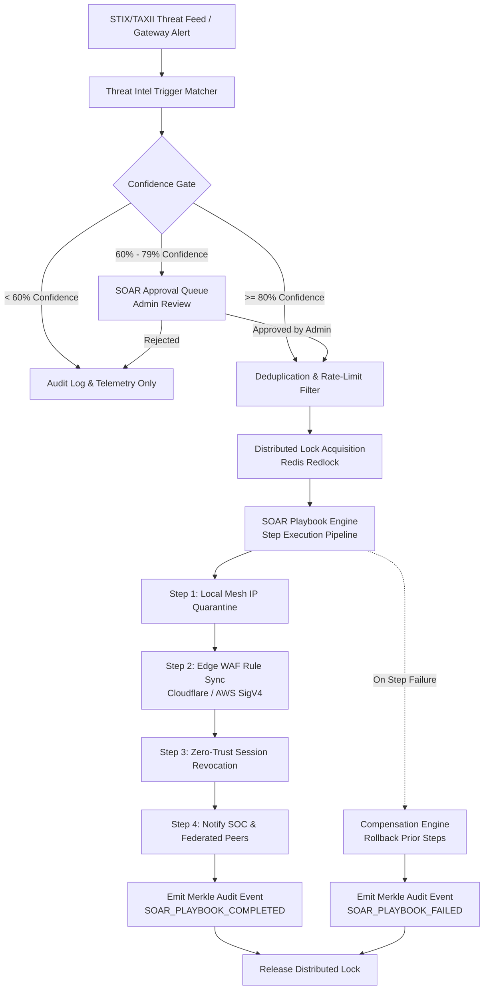

# Engineering Contract — Sprint-040

**Sprint ID:** SPRINT-040  
**Sprint Name:** Autonomous Security Orchestration & Real-Time Threat Response Automation (ASOR / SOAR)  
**Target Release Version:** v3.24.0  
**Contract Date:** 2026-08-19  
**Contract Status:** APPROVED — Ready for Implementation  
**Contract Author:** Implementation Engineer (Antigravity)  
**Source Recommendation:** `.ai/Sprint-040-Recommendation.md`  

---

## 1. Executive Summary

This engineering contract formalizes the implementation scope, architectural specifications, detailed task breakdown, acceptance criteria, risk register, rollback procedures, and definition of done for **Sprint-040**. It governs all execution work by the Implementation Engineer until formal handoff to the Verification Engineer.

Sprint-040 advances the ThaibaHive platform from passive threat intelligence ingestion into an **Autonomous Security Orchestration and Response (SOAR)** system. Building on the zero technical debt foundation and the threat intelligence federation capabilities delivered in Sprint-039 (v3.23.0), this sprint delivers an enterprise-grade, deterministic, and self-healing security orchestration mesh.

### Core Architectural Pillars for Sprint-040:
1. **Autonomous SOAR Workflow & Playbook Engine:** A deterministic execution engine supporting multi-step security playbooks with conditional branching, variable context interpolation, step-level timeouts, compensation transactions (automated rollbacks), and rate-limited dispatch.
2. **Threat Intelligence Trigger Pipeline & Confidence Thresholding:** Seamless integration between STIX 2.1 / TAXII 2.1 feeds and playbook triggers with automated confidence gating ($\ge 80\%$ auto-execution, $60-79\%$ manual approval queue, $< 60\%$ audit-only logging) and storm-prevention deduplication.
3. **Pre-Configured Security Playbook Library (10+ Canonical Playbooks):** Production-ready playbooks covering IP quarantine, subnet containment, account lockdown, DPoP anomaly escalation, malicious domain sinkholing, credential stuffing containment, DDoS circuit-breaker mitigation, and federated peer indicator propagation.
4. **Automated Edge Firewall Orchestration (Cloudflare & AWS WAF):** Fully automated, bidirectional edge rule synchronization via AWS SigV4 signed APIs and Cloudflare WAF v4 APIs with jittered retry backoff and rollback compensation.
5. **Human-in-the-Loop Approval Queue & Admin Radar:** Real-time administrative oversight dashboard at `/admin/security/orchestration` with live execution visualizer, pending approval management, manual playbook triggers, and emergency kill-switch controls.
6. **Multi-Region Coordination & Distributed Locking:** Redis PubSub cluster coordination over `security:soar:events` with Redlock distributed locking to guarantee zero race conditions across multi-node deployments.
7. **Cryptographic Merkle Audit & OpenMetrics Telemetry:** Deterministic logging of all trigger, execution, approval, and compensation events into the SHA-256 Merkle audit chain, accompanied by 6 new Prometheus OpenMetrics series.

---

## 2. Scope

### In Scope

| # | Domain | Detailed Description |
|---|--------|----------------------|
| 1 | **SOAR Workflow Orchestrator Engine** | Core state machine and execution runtime managing multi-step playbooks, execution context lifecycle, asynchronous task scheduling, and error isolation. |
| 2 | **Conditional Evaluation & Context Interpolation** | Dynamic expression evaluator supporting boolean logic, regex pattern matching, threat attribute lookups, and JSONPath variable interpolation. |
| 3 | **Compensation & Rollback Engine** | Transactional reverse-action engine that automatically rolls back prior steps (e.g. unblocking an IP, releasing a token lock) if a downstream playbook step fails. |
| 4 | **Distributed Locking & Mesh Sync** | Redlock-based distributed mutexes for target entities (IP, user, subnet) and Redis PubSub channel `security:soar:events` for multi-node state synchronization. |
| 5 | **Confidence Thresholding & Approval Gate** | Multi-tier decision engine routing threats based on confidence score: $\ge 80\%$ autonomous execution, $60-79\%$ human-in-the-loop approval, $< 60\%$ audit telemetry. |
| 6 | **Threat Intelligence Ingestion Bridge** | Event listener mapping STIX 2.1 indicators, TAXII polling batches, and federated peer alerts directly to registered SOAR playbook triggers. |
| 7 | **Deduplication & Flapping Prevention** | Sliding-window deduplication filter preventing runaway trigger storms and repeated execution loops on the same indicator within a cooldown window. |
| 8 | **Built-in Security Action Handlers** | Standardized, composable action primitives: `quarantine_ip`, `contain_subnet`, `revoke_user_sessions`, `step_up_mfa`, `update_waf_ipset`, `block_domain`, `notify_security_team`, `dispatch_webhook`. |
| 9 | **10+ Pre-Configured Security Playbooks** | Production-ready YAML/JSON playbook definitions for common institutional threat vectors with strict schema validation. |
| 10 | **Automated Edge Firewall Adapters** | Bi-directional API integrations for Cloudflare WAF (Custom Rules & IP Access) and AWS WAF (SigV4 IPSet updates) with automatic rollback support. |
| 11 | **Zero-Trust Identity Lockdown Actions** | Integration with DPoP revocation store and session token blacklist to execute instant user containment during credential compromise. |
| 12 | **Dual-Store Database Persistence** | Atomic SQLite and PostgreSQL persistence for playbook definitions, execution history logs, and pending manual approval items (`soar_playbooks`, `soar_executions`, `soar_approvals`). |
| 13 | **Cryptographic Merkle Audit Trail** | Direct source emission of `SOAR_PLAYBOOK_TRIGGERED`, `SOAR_STEP_EXECUTED`, `SOAR_ACTION_COMPENSATED`, `SOAR_PLAYBOOK_COMPLETED`, `SOAR_PLAYBOOK_FAILED`, `SOAR_APPROVAL_RESOLVED` into `cryptoAuditWriter`. |
| 14 | **Prometheus OpenMetrics Telemetry** | 6 new OpenMetrics series tracking execution count, step latencies, failure rates, compensation actions, and approval queue depths. |
| 15 | **Admin SOAR Management REST APIs** | RBAC-protected API endpoints for playbook CRUD, manual execution triggering, approval resolution, execution log queries, and metrics summary. |
| 16 | **Admin Security Orchestration Radar UI** | Interactive administrative dashboard at `/admin/security/orchestration` with live execution feed, playbook configuration editor, approval review modal, and emergency kill-switch. |
| 17 | **End-to-End Simulation Test Harness** | Automated testing CLI tool and synthetic failure injector validating playbook branching, compensation rollbacks, and approval workflows. |
| 18 | **Operational Runbooks & Docs** | 5 comprehensive engineering runbooks in `docs/` covering SOAR architecture, playbook authoring, Cloudflare WAF integration, approval workflows, and emergency shutdown procedures. |

### Out of Scope

| Area | Justification |
|------|---------------|
| Visual Drag-and-Drop Playbook Builder Canvas | Complex visual graph node builders add heavy frontend bundle weight; playbook authoring is handled via structured JSON/YAML with real-time schema validation. |
| Third-Party SIEM Bi-Directional Connectors (Splunk / QRadar / Microsoft Sentinel) | Outbound webhooks and OpenMetrics/Syslog streams provide standard SIEM integration; proprietary vendor connector SDKs are deferred to future enterprise sprints. |
| Automatic Removal of Historical Merkle Audit Blocks | Merkle audit logs are immutable and append-only by architectural mandate. |
| Direct BGP / Anycast Routing Modifications | L3/L4 route manipulation is managed by upstream transit and hosting providers (Cloudflare Magic Transit, AWS Route 53); SOAR operates at L7 Application Gateway. |
| Dynamic ML Model Retraining within Playbook Execution Loop | ML retraining occurs asynchronously via the existing ML pipeline (`src/lib/ml/`); SOAR consumes pre-computed inference and reputation scores. |

---

## 3. Technical Architecture & Component Interactions

### SOAR Execution & Response Flow



---

## 4. Implementation Task Breakdown

> Tasks are structured across 6 logical implementation phases in strict dependency order. Core workflow primitives, condition evaluators, and compensation engines MUST be built and verified prior to downstream playbooks, UI dashboards, and simulation harnesses.

---

### Phase 1 — Core SOAR Engine Architecture & Execution State Machine

#### ASOR-001 — Core SOAR Workflow Engine, Action Dispatcher & Execution State Machine

| Field | Specification Details |
|---|---|
| **Task ID** | ASOR-001 |
| **Phase** | Phase 1 — Core SOAR Engine Architecture & Execution State Machine |
| **Description** | Implement the core Autonomous Security Orchestration and Response (SOAR) workflow engine in `src/lib/security/soar/orchestrator.ts`, `soar-types.ts`, and `action-registry.ts`. Provide a deterministic execution state machine (`IDLE` $\to$ `QUEUED` $\to$ `RUNNING` $\to$ `COMPLETED` / `FAILED` / `COMPENSATING` / `COMPENSATED`). Manage execution contexts, step execution pipelines, asynchronous action dispatch, execution timeouts (configurable per playbook/step), and strict error isolation so that an unhandled action failure cannot crash the Node.js runtime. |
| **Files** | `src/lib/security/soar/soar-types.ts` [NEW] · `src/lib/security/soar/orchestrator.ts` [NEW] · `src/lib/security/soar/action-registry.ts` [NEW] · `src/lib/__tests__/security/soar/orchestrator.test.ts` [NEW] · `src/lib/__tests__/security/soar/action-registry.test.ts` [NEW] |
| **Dependencies** | None (Foundational Core Primitive) |
| **Acceptance Criteria** | 1. `SoarOrchestrator` provides thread-safe execution of multi-step playbooks with unique `execution_id` tracking.<br>2. State transitions adhere strictly to the defined execution state machine lifecycle.<br>3. `ActionRegistry` allows type-safe registration of async action handlers with schema validation.<br>4. Step timeouts abort execution deterministically if exceeded (default: 5000ms per step).<br>5. 100% unit test coverage for linear playbook execution, error containment, and timeout cancellation. |
| **Verification Method** | Run `pnpm test --testPathPattern=soar/orchestrator` and `action-registry`. Verify simulated executions across all state machine lifecycle phases. |
| **Estimated Complexity** | High |

---

#### ASOR-002 — Conditional Evaluation Engine, Dynamic Parameter Interpolation & Step Pipeline

| Field | Specification Details |
|---|---|
| **Task ID** | ASOR-002 |
| **Phase** | Phase 1 — Core SOAR Engine Architecture & Execution State Machine |
| **Description** | Develop the conditional rule evaluation engine (`src/lib/security/soar/condition-evaluator.ts`) and dynamic parameter interpolator (`src/lib/security/soar/context-interpolator.ts`). Support boolean expressions (`AND`, `OR`, `NOT`), relational operators (`==`, `!=`, `>`, `<`, `in`, `contains`, `regex_match`, `cidr_match`), and nested JSONPath variable substitution (`{{trigger.ip}}`, `{{steps.step_1.output.waf_rule_id}}`). Ensure zero `eval()` or unsafe dynamic code execution. |
| **Files** | `src/lib/security/soar/condition-evaluator.ts` [NEW] · `src/lib/security/soar/context-interpolator.ts` [NEW] · `src/lib/__tests__/security/soar/condition-evaluator.test.ts` [NEW] · `src/lib/__tests__/security/soar/context-interpolator.test.ts` [NEW] |
| **Dependencies** | ASOR-001 |
| **Acceptance Criteria** | 1. Evaluates complex branching conditions without external AST dependencies or unsafe runtime code execution.<br>2. Supports IP and CIDR subnet containment expressions (e.g. `ip in '192.168.0.0/16'`).<br>3. JSONPath context interpolator safely resolves trigger payloads, environment constants, and prior step outputs.<br>4. Throws structured evaluation errors on invalid syntax or missing required context parameters.<br>5. Unit tests assert evaluation accuracy across 50+ diverse boolean, regex, and CIDR test cases. |
| **Verification Method** | Run `pnpm test --testPathPattern=soar/condition-evaluator` and `context-interpolator`. Verify syntax coverage and edge cases. |
| **Estimated Complexity** | Medium-High |

---

#### ASOR-003 — Compensation Transaction Engine & Automated Multi-Step Rollback Handler

| Field | Specification Details |
|---|---|
| **Task ID** | ASOR-003 |
| **Phase** | Phase 1 — Core SOAR Engine Architecture & Execution State Machine |
| **Description** | Implement the SAGA-pattern compensation transaction engine (`src/lib/security/soar/compensation-handler.ts`). When any step in an active playbook execution fails (or is cancelled), the compensation engine executes reverse compensating actions in reverse topological order for all previously completed steps (e.g. `quarantine_ip` $\to$ `unquarantine_ip`; `create_waf_rule` $\to$ `delete_waf_rule`). Provide full logging of compensation outcomes and flag manual intervention if a compensation step fails. |
| **Files** | `src/lib/security/soar/compensation-handler.ts` [NEW] · `src/lib/security/soar/compensation-types.ts` [NEW] · `src/lib/__tests__/security/soar/compensation-handler.test.ts` [NEW] |
| **Dependencies** | ASOR-001, ASOR-002 |
| **Acceptance Criteria** | 1. Actions can define optional `compensate(context, stepOutput)` handlers in `ActionRegistry`.<br>2. On step failure, orchestrator invokes `CompensationHandler` to execute reverse actions in LIFO order.<br>3. Compensation errors do not halt remaining compensation steps; all completed steps are attempted.<br>4. Execution state is marked `COMPENSATED` on full success or `COMPENSATION_FAILED` if manual review is required.<br>5. 100% test coverage for partial failures, cascading rollbacks, and compensation error handling. |
| **Verification Method** | Run `pnpm test --testPathPattern=soar/compensation-handler`. Verify simulated 4-step playbook failure on step 3 triggers compensation for steps 2 and 1. |
| **Estimated Complexity** | High |

---

#### ASOR-004 — Distributed Redis Locking & Multi-Node Coordination Mesh

| Field | Specification Details |
|---|---|
| **Task ID** | ASOR-004 |
| **Phase** | Phase 1 — Core SOAR Engine Architecture & Execution State Machine |
| **Description** | Implement distributed concurrency control using the Redlock algorithm (`src/lib/security/soar/distributed-lock.ts`) and multi-node event broadcasting via Redis PubSub channel `security:soar:events` (`src/lib/security/soar/soar-mesh-sync.ts`). Prevent race conditions when multiple cluster nodes detect the same threat indicator simultaneously. Guarantee single-node playbook execution with distributed status broadcasting across all nodes. |
| **Files** | `src/lib/security/soar/distributed-lock.ts` [NEW] · `src/lib/security/soar/soar-mesh-sync.ts` [NEW] · `src/lib/__tests__/security/soar/distributed-lock.test.ts` [NEW] · `src/lib/__tests__/security/soar/soar-mesh-sync.test.ts` [NEW] |
| **Dependencies** | ASOR-001 |
| **Acceptance Criteria** | 1. `DistributedLock` acquires distributed mutexes on entity keys (e.g. `lock:soar:ip:1.2.3.4`) with TTL auto-release (default 30s).<br>2. Concurrent trigger attempts on the same target return `LOCK_ACQUISITION_FAILED` and gracefully deduplicate.<br>3. `SoarMeshSync` publishes execution lifecycle events (`STARTED`, `COMPLETED`, `FAILED`) to `security:soar:events`.<br>4. In-process fallback activates gracefully when Redis is offline.<br>5. Unit tests assert distributed lock exclusivity and multi-node message broadcast. |
| **Verification Method** | Run `pnpm test --testPathPattern=soar/distributed-lock` and `soar-mesh-sync`. Simulate concurrent acquisition attempts across virtual nodes. |
| **Estimated Complexity** | Medium-High |

---

### Phase 2 — Threat Intelligence Trigger Mapping & Confidence Thresholding

#### ASOR-005 — Threat Intelligence Trigger Matching & Deduplication Engine

| Field | Specification Details |
|---|---|
| **Task ID** | ASOR-005 |
| **Phase** | Phase 2 — Threat Intelligence Trigger Mapping & Confidence Thresholding |
| **Description** | Implement the trigger matching engine (`src/lib/security/soar/trigger-matcher.ts`) and trigger deduplication filter (`src/lib/security/soar/trigger-deduplicator.ts`). Map incoming security events (STIX 2.1 indicators, TAXII feed imports, rate-limit anomalies, WAF webhook alerts) against registered playbook triggers. Apply sliding-window deduplication with configurable cooldown periods (default: 300s) to prevent trigger flapping and event storms. |
| **Files** | `src/lib/security/soar/trigger-matcher.ts` [NEW] · `src/lib/security/soar/trigger-deduplicator.ts` [NEW] · `src/lib/__tests__/security/soar/trigger-matcher.test.ts` [NEW] · `src/lib/__tests__/security/soar/trigger-deduplicator.test.ts` [NEW] |
| **Dependencies** | ASOR-001, ASOR-002 |
| **Acceptance Criteria** | 1. Matches incoming threat events against playbook trigger criteria (`event_type`, `severity`, `source`, `tags`).<br>2. Resolves and returns all matching active playbooks in priority order.<br>3. `TriggerDeduplicator` discards duplicate triggers on identical target identifiers within cooldown window.<br>4. Memory-efficient LRU cache with auto-expiry for tracking active cooldown entries.<br>5. Unit tests verify trigger pattern matching and deduplication suppression under rapid simulated bursts. |
| **Verification Method** | Run `pnpm test --testPathPattern=soar/trigger-matcher` and `trigger-deduplicator`. Test burst of 1,000 identical events with deduplication assertions. |
| **Estimated Complexity** | Medium |

---

#### ASOR-006 — Risk Confidence Thresholding & Human-in-the-Loop Approval Queue

| Field | Specification Details |
|---|---|
| **Task ID** | ASOR-006 |
| **Phase** | Phase 2 — Threat Intelligence Trigger Mapping & Confidence Thresholding |
| **Description** | Build the confidence thresholding gate (`src/lib/security/soar/confidence-gate.ts`) and human-in-the-loop approval queue manager (`src/lib/security/soar/approval-queue.ts`). Evaluate incoming threat indicator confidence against institutional policy: $\ge 80\%$ confidence $\to$ immediate autonomous execution; $60-79\%$ confidence $\to$ stage in approval queue with pending status and timeout (default: 24h); $< 60\%$ confidence $\to$ audit log and telemetry increment only. Allow security admins to approve, reject, or modify staged playbooks. |
| **Files** | `src/lib/security/soar/confidence-gate.ts` [NEW] · `src/lib/security/soar/approval-queue.ts` [NEW] · `src/lib/__tests__/security/soar/confidence-gate.test.ts` [NEW] · `src/lib/__tests__/security/soar/approval-queue.test.ts` [NEW] |
| **Dependencies** | ASOR-001, ASOR-005 |
| **Acceptance Criteria** | 1. Evaluates indicator confidence (0–100) and routes execution to `AUTO_EXECUTE`, `REQUIRE_APPROVAL`, or `LOG_ONLY`.<br>2. High-impact actions (e.g. institutional subnet blocking, tenant lockout) always require approval if configured.<br>3. `ApprovalQueue` manages pending items with creation timestamp, expiring TTL, trigger details, and recommended playbook.<br>4. Admin approval transitions staged execution to `QUEUED` in `SoarOrchestrator`; rejection cancels execution with reason.<br>5. Unit tests verify threshold routing, approval expiration, and approval/rejection state transitions. |
| **Verification Method** | Run `pnpm test --testPathPattern=soar/confidence-gate` and `approval-queue`. Verify all confidence ranges (0–59, 60–79, 80–100). |
| **Estimated Complexity** | Medium-High |

---

#### ASOR-007 — Integration with STIX/TAXII Federation & Security Event Ingestion

| Field | Specification Details |
|---|---|
| **Task ID** | ASOR-007 |
| **Phase** | Phase 2 — Threat Intelligence Trigger Mapping & Confidence Thresholding |
| **Description** | Connect the threat intelligence ingestion pipeline (`src/lib/security/threat-intel/feed-ingester.ts` and `src/lib/security/soar/threat-intel-bridge.ts`) to the SOAR trigger engine. When TAXII 2.1 feeds or federated peer endpoints import new threat indicators, automatically transform indicators into SOAR trigger events. Add support for gateway circuit-breaker trips, honeypot hits, and edge webhook alerts as first-class SOAR trigger sources. |
| **Files** | `src/lib/security/soar/threat-intel-bridge.ts` [NEW] · `src/lib/security/threat-intel/feed-ingester.ts` [MODIFY] · `src/app/api/webhooks/edge-security/route.ts` [MODIFY] · `src/lib/__tests__/security/soar/threat-intel-bridge.test.ts` [NEW] |
| **Dependencies** | ASOR-005, ASOR-006 |
| **Acceptance Criteria** | 1. `ThreatIntelBridge` subscribes to threat intel import events and dispatches to `TriggerMatcher`.<br>2. Parses STIX indicators (IPs, domains, hashes) into standardized SOAR event payloads.<br>3. Edge security webhook dispatches critical WAF alerts to `ThreatIntelBridge` for autonomous mitigation.<br>4. Ingestion is fully asynchronous and non-blocking to TAXII sync or HTTP request handling.<br>5. Integration tests assert STIX feed import triggers corresponding SOAR playbook execution. |
| **Verification Method** | Run `pnpm test --testPathPattern=soar/threat-intel-bridge`. Mock STIX bundle ingestion and verify SOAR trigger invocation. |
| **Estimated Complexity** | Medium |

---

### Phase 3 — Security Playbook Library & Action Handlers

#### ASOR-008 — Composable Built-in Security Action Handlers

| Field | Specification Details |
|---|---|
| **Task ID** | ASOR-008 |
| **Phase** | Phase 3 — Security Playbook Library & Action Handlers |
| **Description** | Implement standardized, composable security action handlers in `src/lib/security/soar/actions/`: `quarantine-ip-action.ts`, `contain-subnet-action.ts`, `revoke-session-action.ts`, `step-up-auth-action.ts`, `rate-limit-throttle-action.ts`, `notification-action.ts`, and `webhook-dispatch-action.ts`. Register all actions with `ActionRegistry` along with their corresponding compensation handlers. |
| **Files** | `src/lib/security/soar/actions/quarantine-ip-action.ts` [NEW] · `src/lib/security/soar/actions/contain-subnet-action.ts` [NEW] · `src/lib/security/soar/actions/revoke-session-action.ts` [NEW] · `src/lib/security/soar/actions/step-up-auth-action.ts` [NEW] · `src/lib/security/soar/actions/rate-limit-throttle-action.ts` [NEW] · `src/lib/security/soar/actions/notification-action.ts` [NEW] · `src/lib/security/soar/actions/webhook-dispatch-action.ts` [NEW] · `src/lib/security/soar/actions/index.ts` [NEW] · `src/lib/__tests__/security/soar/action-handlers.test.ts` [NEW] |
| **Dependencies** | ASOR-001, ASOR-003 |
| **Acceptance Criteria** | 1. Each action implements the `SoarActionHandler` interface with `execute()` and `compensate()` methods.<br>2. `quarantine-ip-action` updates local Bloom filter, Redis mesh, and database store via `QuarantineManager`.<br>3. `contain-subnet-action` calculates CIDR block and applies quarantine across subnet.<br>4. `notification-action` delivers real-time alerts via Email, Slack/Webhook, and admin SSE channel.<br>5. 100% unit test coverage for every action handler and its compensation logic. |
| **Verification Method** | Run `pnpm test --testPathPattern=soar/action-handlers`. Assert execution and compensation for all 7 action types. |
| **Estimated Complexity** | High |

---

#### ASOR-009 — Canonical Security Playbook Library (10 Pre-Configured Playbooks)

| Field | Specification Details |
|---|---|
| **Task ID** | ASOR-009 |
| **Phase** | Phase 3 — Security Playbook Library & Action Handlers |
| **Description** | Author and validate 10 pre-configured canonical security playbooks in `src/lib/security/soar/playbooks/definitions.ts` and build the playbook validator `src/lib/security/soar/playbook-validator.ts`. Playbooks include: (1) `IP_QUARANTINE_AUTO_MITIGATION`, (2) `SUBNET_CIDR_CONTAINMENT`, (3) `COMPROMISED_ACCOUNT_LOCKDOWN`, (4) `DPOP_PROOF_ANOMALY_ESCALATION`, (5) `HIGH_RISK_GEO_BLOCKING`, (6) `MALICIOUS_DOMAIN_DNS_SINKHOLE`, (7) `CREDENTIAL_STUFFING_DEFENSE`, (8) `DDOS_CIRCUIT_BREAKER_CONTAINMENT`, (9) `FEDERATED_THREAT_AUTO_PROPAGATION`, and (10) `STORM_PREVENTION_RATE_LIMIT_ADAPTATION`. |
| **Files** | `src/lib/security/soar/playbooks/definitions.ts` [NEW] · `src/lib/security/soar/playbook-validator.ts` [NEW] · `src/lib/validation/soar-schemas.ts` [NEW] · `src/lib/__tests__/security/soar/playbook-validator.test.ts` [NEW] · `src/lib/__tests__/security/soar/canonical-playbooks.test.ts` [NEW] |
| **Dependencies** | ASOR-002, ASOR-008 |
| **Acceptance Criteria** | 1. All 10 playbooks are authored with structured metadata, triggers, step sequences, conditions, and timeout configs.<br>2. `PlaybookValidator` validates all playbooks using Zod schemas, checking for cyclic dependencies, missing action references, and invalid JSONPaths.<br>3. Playbook schema requires `name`, `version`, `category`, `triggers`, `steps`, and `rollback_strategy`.<br>4. Unit tests validate all 10 canonical playbooks with 0 validation errors. |
| **Verification Method** | Run `pnpm test --testPathPattern=soar/playbook-validator` and `canonical-playbooks`. Ensure all 10 pass structural and semantic validation. |
| **Estimated Complexity** | Medium-High |

---

#### ASOR-010 — Automated Cloudflare & AWS Edge Firewall Orchestration

| Field | Specification Details |
|---|---|
| **Task ID** | ASOR-010 |
| **Phase** | Phase 3 — Security Playbook Library & Action Handlers |
| **Description** | Implement automated edge firewall orchestration (`src/lib/security/soar/edge-firewall-orchestrator.ts`) integrating both Cloudflare WAF (`src/lib/security/waf-adapters/cloudflare.ts`) and AWS WAF (`src/lib/security/waf-adapters/aws-waf.ts`). Provide automated IPSet / Custom Rule additions with compensation handlers for rollback. Support parallel dual-WAF dispatch, rate-limit backpressure handling, and failure isolation. |
| **Files** | `src/lib/security/soar/edge-firewall-orchestrator.ts` [NEW] · `src/lib/security/waf-adapters/cloudflare.ts` [MODIFY] · `src/lib/security/waf-adapters/aws-waf.ts` [MODIFY] · `src/lib/security/soar/actions/waf-sync-action.ts` [NEW] · `src/lib/__tests__/security/soar/edge-firewall-orchestrator.test.ts` [NEW] |
| **Dependencies** | ASOR-008 |
| **Acceptance Criteria** | 1. `EdgeFirewallOrchestrator` synchronizes threat IPs to active WAF providers (Cloudflare and/or AWS).<br>2. Cloudflare adapter creates/updates IP Access Rules and Custom WAF block expressions via Cloudflare API v4.<br>3. AWS WAF adapter updates regional IPSets using AWS SigV4 signing (TIF-004) and jittered retry runner (TIF-005).<br>4. Compensation method `compensate()` removes injected rules upon playbook rollback.<br>5. Unit tests verify dual-WAF dispatch, mocked API responses, and rollback deletion. |
| **Verification Method** | Run `pnpm test --testPathPattern=soar/edge-firewall-orchestrator`. Test mocked Cloudflare and AWS WAF API operations and rollbacks. |
| **Estimated Complexity** | High |

---

#### ASOR-011 — Zero-Trust Identity Session Invalidation & Account Lockdown Actions

| Field | Specification Details |
|---|---|
| **Task ID** | ASOR-011 |
| **Phase** | Phase 3 — Security Playbook Library & Action Handlers |
| **Description** | Implement identity security actions (`src/lib/security/soar/actions/identity-lockdown-action.ts`) that integrate directly with the DPoP zero-trust identity mesh and token revocation store (`src/lib/identity/revocation-store.ts`). Allow playbooks to instantly revoke all active JWT tokens and DPoP thumbprints for a compromised user, force re-authentication, require WebAuthn step-up on next login, or temporarily lock out high-risk accounts. |
| **Files** | `src/lib/security/soar/actions/identity-lockdown-action.ts` [NEW] · `src/lib/identity/revocation-store.ts` [MODIFY] · `src/lib/__tests__/security/soar/identity-lockdown-action.test.ts` [NEW] |
| **Dependencies** | ASOR-008 |
| **Acceptance Criteria** | 1. Revokes user session by adding subject ID (`sub`) and DPoP public key thumbprint (`jkt`) to revocation store.<br>2. Broadcasts revocation event across Redis PubSub identity mesh for immediate (< 50ms) edge propagation.<br>3. Sets account security flag `security_hold: true` in user record.<br>4. Compensation handler allows administrative unlock with audit reason.<br>5. Unit tests assert token rejection across all middleware instances following lockdown action. |
| **Verification Method** | Run `pnpm test --testPathPattern=soar/identity-lockdown`. Test session revocation and account unlock compensation. |
| **Estimated Complexity** | Medium |

---

### Phase 4 — Persistence, Merkle Audit & OpenMetrics Telemetry

#### ASOR-012 — Dual-Store Database Persistence for Playbooks, Executions & Approvals

| Field | Specification Details |
|---|---|
| **Task ID** | ASOR-012 |
| **Phase** | Phase 4 — Persistence, Merkle Audit & OpenMetrics Telemetry |
| **Description** | Define database schema tables for SOAR operations and implement runtime data access in `src/lib/security/soar/soar-db-store.ts`. Create tables `soar_playbooks`, `soar_executions`, `soar_execution_steps`, and `soar_approvals` in both SQLite (`packages/db/schema.ts`) and PostgreSQL (`packages/db/schema.pg.ts`). Ensure 100% schema parity, automatic timestamp handling, JSON column typing, and asynchronous batch insertion for execution step logs. |
| **Files** | `packages/db/schema.ts` [MODIFY] · `packages/db/schema.pg.ts` [MODIFY] · `src/lib/security/soar/soar-db-store.ts` [NEW] · `src/lib/__tests__/security/soar/soar-db-store.test.ts` [NEW] · `src/lib/__tests__/db/schema-parity.test.ts` [MODIFY] |
| **Dependencies** | ASOR-001, ASOR-006 |
| **Acceptance Criteria** | 1. Schema defines `soar_playbooks`, `soar_executions`, `soar_execution_steps`, and `soar_approvals` with appropriate foreign keys and secondary indexes.<br>2. 100% column and constraint parity verified between SQLite and PostgreSQL definitions.<br>3. `SoarDbStore` provides async CRUD for playbooks, execution state updates, step logs, and approval resolutions.<br>4. Execution writes use non-blocking asynchronous queuing so database latency does not delay action execution.<br>5. Schema parity test passes cleanly (`schema-parity.test.ts`). |
| **Verification Method** | Run `pnpm test --testPathPattern=soar-db-store` and `schema-parity.test.ts`. Assert database writes, queries, and migrations. |
| **Estimated Complexity** | Medium-High |

---

#### ASOR-013 — Cryptographic Merkle Audit Trail Integration for SOAR Events

| Field | Specification Details |
|---|---|
| **Task ID** | ASOR-013 |
| **Phase** | Phase 4 — Persistence, Merkle Audit & OpenMetrics Telemetry |
| **Description** | Implement SOAR cryptographic audit event creators (`src/lib/security/soar/soar-audit-events.ts`) and integrate with `cryptoAuditWriter`. Deterministically emit audit events into the SHA-256 Merkle chain at key lifecycle moments: `SOAR_PLAYBOOK_TRIGGERED`, `SOAR_STEP_EXECUTED`, `SOAR_ACTION_COMPENSATED`, `SOAR_PLAYBOOK_COMPLETED`, `SOAR_PLAYBOOK_FAILED`, `SOAR_APPROVAL_REQUESTED`, and `SOAR_APPROVAL_RESOLVED`. |
| **Files** | `src/lib/security/soar/soar-audit-events.ts` [NEW] · `src/lib/security/threat-audit-events.ts` [MODIFY] · `src/lib/__tests__/security/soar/soar-audit-events.test.ts` [NEW] |
| **Dependencies** | ASOR-001, ASOR-003, ASOR-006 |
| **Acceptance Criteria** | 1. Every SOAR execution generates deterministic, cryptographically signed Merkle audit blocks.<br>2. Events record playbook name, execution ID, trigger source, target entity, step inputs/outputs, and actor ID (for manual approvals).<br>3. Event payloads are sanitized to exclude sensitive credentials, API keys, or raw tokens.<br>4. Read-only audit verification tool `pnpm compliance:verify` confirms unbroken Merkle chain integrity.<br>5. Unit tests assert event structure, hash computation, and payload immutability. |
| **Verification Method** | Run `pnpm test --testPathPattern=soar/soar-audit-events` and `pnpm compliance:verify`. Verify cryptographic chain integrity. |
| **Estimated Complexity** | Medium |

---

#### ASOR-014 — Prometheus OpenMetrics Telemetry Series & Health Registry

| Field | Specification Details |
|---|---|
| **Task ID** | ASOR-014 |
| **Phase** | Phase 4 — Persistence, Merkle Audit & OpenMetrics Telemetry |
| **Description** | Implement SOAR telemetry metrics in `src/lib/security/soar/soar-metrics.ts` and register with the platform metrics registry (`src/lib/metrics/registry.ts`). Emit 6 new Prometheus OpenMetrics series: (1) `soar_playbook_executions_total{playbook, status, trigger}`, (2) `soar_playbook_duration_seconds{playbook}`, (3) `soar_actions_executed_total{action, status}`, (4) `soar_pending_approvals_total`, (5) `soar_compensations_total{playbook, status}`, and (6) `soar_confidence_score_distribution{tier}`. |
| **Files** | `src/lib/security/soar/soar-metrics.ts` [NEW] · `src/lib/metrics/registry.ts` [MODIFY] · `src/lib/__tests__/security/soar/soar-metrics.test.ts` [NEW] |
| **Dependencies** | ASOR-001, ASOR-003, ASOR-006 |
| **Acceptance Criteria** | 1. All 6 metric series are exported in standard Prometheus OpenMetrics text format at `/api/metrics`.<br>2. Counters and histograms update synchronously with execution events.<br>3. Histogram buckets calibrated for sub-second and multi-second step execution latencies (0.05s to 30s).<br>4. Unit tests verify metric increments, label formatting, and registry output. |
| **Verification Method** | Run `pnpm test --testPathPattern=soar/soar-metrics`. Assert Prometheus exposition format and counter updates. |
| **Estimated Complexity** | Low-Medium |

---

### Phase 5 — Administration UI & Operator Dashboard

#### ASOR-015 — Admin SOAR Management REST APIs

| Field | Specification Details |
|---|---|
| **Task ID** | ASOR-015 |
| **Phase** | Phase 5 — Administration UI & Operator Dashboard |
| **Description** | Build the administration REST API endpoints for the SOAR engine: (1) `GET/POST /api/admin/security/soar/playbooks` (list/create playbooks), (2) `GET/PATCH /api/admin/security/soar/playbooks/[id]` (get/update playbook), (3) `GET /api/admin/security/soar/executions` (query execution history with filters), (4) `POST /api/admin/security/soar/executions/trigger` (manual execution trigger), (5) `GET/POST /api/admin/security/soar/approvals` (list/resolve pending approvals), and (6) `GET /api/admin/security/soar/metrics` (summary stats). Enforce strict RBAC permissions (`system:security:view`, `system:security:manage`, `system:soar:approve`). |
| **Files** | `src/app/api/admin/security/soar/playbooks/route.ts` [NEW] · `src/app/api/admin/security/soar/playbooks/[id]/route.ts` [NEW] · `src/app/api/admin/security/soar/executions/route.ts` [NEW] · `src/app/api/admin/security/soar/executions/trigger/route.ts` [NEW] · `src/app/api/admin/security/soar/approvals/route.ts` [NEW] · `src/app/api/admin/security/soar/approvals/[id]/route.ts` [NEW] · `src/app/api/admin/security/soar/metrics/route.ts` [NEW] · `src/lib/__tests__/security/soar/soar-api.test.ts` [NEW] |
| **Dependencies** | ASOR-009, ASOR-012 |
| **Acceptance Criteria** | 1. All routes protected with `requireAuth` and granular RBAC permission checks.<br>2. Input validation enforced using Zod schemas (`src/lib/validation/soar-schemas.ts`).<br>3. Returns structured RFC 7807 problem details on error.<br>4. Supports pagination, filtering by status/playbook, and search by target indicator.<br>5. 100% unit and integration test coverage for authorized and unauthorized access paths. |
| **Verification Method** | Run `pnpm test --testPathPattern=soar/soar-api`. Verify authentication, RBAC authorization, validation errors, and CRUD operations. |
| **Estimated Complexity** | High |

---

#### ASOR-016 — React Hook & State Management for SOAR Dashboard

| Field | Specification Details |
|---|---|
| **Task ID** | ASOR-016 |
| **Phase** | Phase 5 — Administration UI & Operator Dashboard |
| **Description** | Develop the client-side state management hook `src/lib/hooks/use-soar-orchestration.ts`. Provide unified polling and SSE event subscription for real-time execution updates, pending approval count, system metrics, playbook list, and mutation functions (`triggerPlaybook`, `resolveApproval`, `togglePlaybookEnabled`, `emergencyKillSwitch`). Implement robust error handling, optimistic updates, and automatic polling backoff. |
| **Files** | `src/lib/hooks/use-soar-orchestration.ts` [NEW] · `src/lib/__tests__/hooks/use-soar-orchestration.test.ts` [NEW] |
| **Dependencies** | ASOR-015 |
| **Acceptance Criteria** | 1. Custom hook encapsulates all SOAR API calls with typed return states.<br>2. Supports real-time polling (every 3s on active executions, 10s idle) with `.catch()` to prevent stuck loading states.<br>3. Exposes intuitive action mutations with toast notifications on success/error.<br>4. Cleanly handles unmounts and aborts pending fetch requests.<br>5. Unit tests verify hook states, polling intervals, error recovery, and mutation side-effects. |
| **Verification Method** | Run `pnpm test --testPathPattern=hooks/use-soar-orchestration`. Test state transitions and mutation execution. |
| **Estimated Complexity** | Medium |

---

#### ASOR-017 — Admin Security Orchestration Radar & Playbook Execution UI

| Field | Specification Details |
|---|---|
| **Task ID** | ASOR-017 |
| **Phase** | Phase 5 — Administration UI & Operator Dashboard |
| **Description** | Build the administrative SOAR dashboard page at `src/app/(shell)/admin/security/orchestration/page.tsx` and modular UI components in `src/components/security/soar/`: `soar-metrics-overview.tsx`, `active-executions-table.tsx`, `execution-detail-drawer.tsx`, `pending-approvals-card.tsx`, `playbook-catalog-table.tsx`, `manual-trigger-dialog.tsx`, and `emergency-killswitch-card.tsx`. Ensure full WCAG 2.1 AA accessibility, responsive layouts, Radix UI primitives, and `<Skeleton>` loading states. |
| **Files** | `src/app/(shell)/admin/security/orchestration/page.tsx` [NEW] · `src/components/security/soar/soar-metrics-overview.tsx` [NEW] · `src/components/security/soar/active-executions-table.tsx` [NEW] · `src/components/security/soar/execution-detail-drawer.tsx` [NEW] · `src/components/security/soar/pending-approvals-card.tsx` [NEW] · `src/components/security/soar/playbook-catalog-table.tsx` [NEW] · `src/components/security/soar/manual-trigger-dialog.tsx` [NEW] · `src/components/security/soar/emergency-killswitch-card.tsx` [NEW] · `src/lib/__tests__/security/soar/soar-ui.test.tsx` [NEW] |
| **Dependencies** | ASOR-016 |
| **Acceptance Criteria** | 1. Page renders metrics overview, active executions table, pending approval queue, and playbook catalog.<br>2. Execution detail drawer visualizes step execution pipeline with live status badges (`SUCCESS`, `RUNNING`, `FAILED`, `COMPENSATED`).<br>3. Approval card allows single-click review, approval, or rejection with justification text.<br>4. Emergency kill-switch enables instant platform-wide pause of all autonomous playbook executions.<br>5. 0 WCAG accessibility violations (verified via `jest-axe`); zero raw HTML form inputs.<br>6. Component tests assert rendering across empty, loading, error, and active execution states. |
| **Verification Method** | Run `pnpm test --testPathPattern=soar/soar-ui`. Verify component rendering, accessibility, and drawer interactions. |
| **Estimated Complexity** | High |

---

### Phase 6 — System Verification, Documentation & Production Runbooks

#### ASOR-018 — End-to-End SOAR Simulation Test Harness & Automated Failure Injection

| Field | Specification Details |
|---|---|
| **Task ID** | ASOR-018 |
| **Phase** | Phase 6 — System Verification, Documentation & Production Runbooks |
| **Description** | Develop a comprehensive simulation testing CLI tool (`scripts/security/soar-simulation-runner.ts`) and end-to-end integration test suite (`src/lib/__tests__/security/soar/e2e-orchestration.test.ts`). Simulate real-world attack scenarios (DDoS surge, credential stuffing wave, STIX threat feed ingestion, WAF webhook alerts) and verify autonomous playbook triggers, confidence threshold routing, multi-step execution, failure compensation rollbacks, and distributed locking. |
| **Files** | `scripts/security/soar-simulation-runner.ts` [NEW] · `src/lib/__tests__/security/soar/e2e-orchestration.test.ts` [NEW] · `package.json` [MODIFY] |
| **Dependencies** | ASOR-001 through ASOR-017 |
| **Acceptance Criteria** | 1. `pnpm soar:simulate` runs full simulated attack campaign against local or staging environment.<br>2. Verifies execution of all 10 canonical playbooks with 100% success rate under normal conditions.<br>3. Injects deliberate step failures (e.g. simulated WAF API timeout) and asserts 100% successful compensation rollback.<br>4. Confirms end-to-end MTTR < 30 seconds from indicator ingestion to containment across all nodes.<br>5. Emits detailed JSON and markdown test summary report. |
| **Verification Method** | Run `pnpm test --testPathPattern=soar/e2e-orchestration` and execute `pnpm tsx scripts/security/soar-simulation-runner.ts --dry-run`. |
| **Estimated Complexity** | High |

---

#### ASOR-019 — Operational Runbooks & Architecture Documentation

| Field | Specification Details |
|---|---|
| **Task ID** | ASOR-019 |
| **Phase** | Phase 6 — System Verification, Documentation & Production Runbooks |
| **Description** | Author 5 comprehensive operational engineering runbooks in `docs/`: (1) `docs/soar-engine-architecture-guide.md` (engine mechanics, state machine, lifecycle), (2) `docs/security-playbook-authoring-guide.md` (schema specification, custom action authoring, syntax guidelines), (3) `docs/cloudflare-waf-automation-setup.md` (Cloudflare API v4 token configuration, WAF rule templates), (4) `docs/soar-approval-workflow-ops.md` (SOC operator approval procedures, escalation paths), and (5) `docs/emergency-soar-killswitch-ops.md` (emergency shutdown, manual intervention, state recovery). |
| **Files** | `docs/soar-engine-architecture-guide.md` [NEW] · `docs/security-playbook-authoring-guide.md` [NEW] · `docs/cloudflare-waf-automation-setup.md` [NEW] · `docs/soar-approval-workflow-ops.md` [NEW] · `docs/emergency-soar-killswitch-ops.md` [NEW] |
| **Dependencies** | ASOR-018 |
| **Acceptance Criteria** | 1. All 5 runbooks authored with step-by-step instructions, CLI commands, architecture diagrams, and troubleshooting FAQs.<br>2. Architecture guide documents state machine transitions, lock algorithms, and compensation flowcharts.<br>3. Playbook authoring guide provides copy-pasteable YAML templates and JSON schema definitions.<br>4. Kill-switch guide details zero-downtime emergency deactivation via API, CLI, and environment variables. |
| **Verification Method** | Inspect all 5 documents for technical completeness, formatting standards, and accurate code/configuration examples. |
| **Estimated Complexity** | Medium |

---

#### ASOR-020 — AIOS Governance, Feature Registry & Project Status Synchronization

| Field | Specification Details |
|---|---|
| **Task ID** | ASOR-020 |
| **Phase** | Phase 6 — System Verification, Documentation & Production Runbooks |
| **Description** | Perform comprehensive AIOS documentation updates across all governance files: Update `.ai/FEATURES.md` with new SOAR features and status, update `.ai/CHANGELOG.md` with v3.24.0 release notes, update `.ai/PROJECT_STATUS.md` with Sprint-040 completion state, and initialize `.ai/execution/Sprint-040-Execution-Log.md`. Ensure full traceability from recommendation to contract. |
| **Files** | `.ai/FEATURES.md` [MODIFY] · `.ai/CHANGELOG.md` [MODIFY] · `.ai/PROJECT_STATUS.md` [MODIFY] · `.ai/execution/Sprint-040-Execution-Log.md` [NEW] |
| **Dependencies** | ASOR-001 through ASOR-019 |
| **Acceptance Criteria** | 1. `.ai/FEATURES.md` registered with Autonomous Security Orchestration, Playbook Engine, and Approval Queue entries.<br>2. `.ai/CHANGELOG.md` documents all v3.24.0 deliverables, breaking changes (0), and security improvements.<br>3. `.ai/PROJECT_STATUS.md` reflects Sprint-040 status, build health, and zero open technical debt.<br>4. `.ai/execution/Sprint-040-Execution-Log.md` initialized with all 20 task entries and status tracking. |
| **Verification Method** | Verify file changes and cross-reference task IDs across all AIOS governance files. |
| **Estimated Complexity** | Low-Medium |

---

## 5. Files Affected Summary

### New Files to Create

```
packages/db/
└── (schema updates in schema.ts and schema.pg.ts)

src/lib/security/soar/
├── soar-types.ts
├── orchestrator.ts
├── action-registry.ts
├── condition-evaluator.ts
├── context-interpolator.ts
├── compensation-types.ts
├── compensation-handler.ts
├── distributed-lock.ts
├── soar-mesh-sync.ts
├── trigger-matcher.ts
├── trigger-deduplicator.ts
├── confidence-gate.ts
├── approval-queue.ts
├── threat-intel-bridge.ts
├── playbook-validator.ts
├── edge-firewall-orchestrator.ts
├── soar-db-store.ts
├── soar-audit-events.ts
├── soar-metrics.ts
├── actions/
│   ├── index.ts
│   ├── quarantine-ip-action.ts
│   ├── contain-subnet-action.ts
│   ├── revoke-session-action.ts
│   ├── step-up-auth-action.ts
│   ├── rate-limit-throttle-action.ts
│   ├── notification-action.ts
│   ├── webhook-dispatch-action.ts
│   ├── waf-sync-action.ts
│   └── identity-lockdown-action.ts
└── playbooks/
    └── definitions.ts

src/lib/validation/
└── soar-schemas.ts

src/lib/hooks/
└── use-soar-orchestration.ts

src/app/api/admin/security/soar/
├── playbooks/
│   ├── route.ts
│   └── [id]/
│       └── route.ts
├── executions/
│   ├── route.ts
│   └── trigger/
│       └── route.ts
├── approvals/
│   ├── route.ts
│   └── [id]/
│       └── route.ts
└── metrics/
    └── route.ts

src/app/(shell)/admin/security/orchestration/
└── page.tsx

src/components/security/soar/
├── soar-metrics-overview.tsx
├── active-executions-table.tsx
├── execution-detail-drawer.tsx
├── pending-approvals-card.tsx
├── playbook-catalog-table.tsx
├── manual-trigger-dialog.tsx
└── emergency-killswitch-card.tsx

src/lib/__tests__/security/soar/
├── orchestrator.test.ts
├── action-registry.test.ts
├── condition-evaluator.test.ts
├── context-interpolator.test.ts
├── compensation-handler.test.ts
├── distributed-lock.test.ts
├── soar-mesh-sync.test.ts
├── trigger-matcher.test.ts
├── trigger-deduplicator.test.ts
├── confidence-gate.test.ts
├── approval-queue.test.ts
├── threat-intel-bridge.test.ts
├── action-handlers.test.ts
├── playbook-validator.test.ts
├── canonical-playbooks.test.ts
├── edge-firewall-orchestrator.test.ts
├── identity-lockdown-action.test.ts
├── soar-db-store.test.ts
├── soar-audit-events.test.ts
├── soar-metrics.test.ts
├── soar-api.test.ts
├── soar-ui.test.tsx
└── e2e-orchestration.test.ts

src/lib/__tests__/hooks/
└── use-soar-orchestration.test.ts

scripts/security/
└── soar-simulation-runner.ts

docs/
├── soar-engine-architecture-guide.md
├── security-playbook-authoring-guide.md
├── cloudflare-waf-automation-setup.md
├── soar-approval-workflow-ops.md
└── emergency-soar-killswitch-ops.md

.ai/execution/
└── Sprint-040-Execution-Log.md
```

### Existing Files to Modify

```
packages/db/schema.ts                         (add soar_playbooks, soar_executions, soar_execution_steps, soar_approvals)
packages/db/schema.pg.ts                      (add PostgreSQL parity tables for SOAR operations)
src/lib/security/threat-intel/feed-ingester.ts (bridge imported STIX threat indicators to SOAR trigger matcher)
src/app/api/webhooks/edge-security/route.ts   (dispatch critical WAF edge alerts to SOAR trigger bridge)
src/lib/security/waf-adapters/cloudflare.ts   (add Cloudflare API v4 IP Access Rule & Custom Rule management)
src/lib/security/waf-adapters/aws-waf.ts       (add IPSet rollback and delete helper operations)
src/lib/identity/revocation-store.ts          (add bulk session invalidation and account security hold helpers)
src/lib/security/threat-audit-events.ts       (re-export SOAR audit event creators)
src/lib/metrics/registry.ts                   (register 6 new Prometheus OpenMetrics series)
package.json                                  (add soar:simulate script definition)
.ai/FEATURES.md                               (register Sprint-040 features)
.ai/CHANGELOG.md                              (document v3.24.0 release notes)
.ai/PROJECT_STATUS.md                         (update current sprint status and feature registry)
```

---

## 6. Security, RBAC & Compliance Framework

### RBAC Permissions

| Permission String | Role Access | Description |
|---|---|---|
| `system:security:view` | `super_admin`, `admin` | Read-only access to SOAR metrics, active executions, playbook catalog, and execution history. |
| `system:security:manage` | `super_admin` | Author, edit, toggle, or delete security playbook configurations and trigger manual test runs. |
| `system:soar:approve` | `super_admin` | Review, approve, or reject staged high-impact security playbooks in the approval queue. |
| `system:soar:emergency` | `super_admin` | Toggle the emergency SOAR kill-switch and execute cluster-wide unban/compensation overrides. |

### Compliance & Cryptographic Controls
- **Zero-Trust Identity Enforcement:** All administrative SOAR API endpoints require authenticated JWT Bearer tokens with active DPoP proof of possession binding (`cnf.jkt`).
- **Fail-Closed Execution Safety:** If an action handler or downstream API fails, the execution engine halts immediately and triggers reverse compensation transactions; it never ignores errors or leaves partial security states active without audit logging.
- **SHA-256 Merkle Chain Integrity:** Every trigger evaluation, step execution, approval resolution, and compensation rollback is logged as an immutable block into the cryptographic Merkle chain.

---

## 7. Risk Register & Mitigation Strategy

| Risk ID | Category | Risk Description | Severity | Probability | Mitigation Strategy |
|---|---|---|---|---|---|
| **R-040-1** | Safety / Ops | Autonomous response false-positives block legitimate campus users or subnets | High | Medium | Implement multi-tier confidence gating ($\ge 80\%$ required for auto-mitigation; $60-79\%$ staged in approval queue). High-impact actions (e.g. subnet `/24` containment) mandate manual approval by default. |
| **R-040-2** | System / Stability | Execution runaway loop / trigger storm overwhelms system resources during mass attack | High | Low | Deploy sliding-window `TriggerDeduplicator` with 300s cooldown per target entity, combined with Redlock distributed locking to prevent duplicate concurrent executions. |
| **R-040-3** | External API | Cloudflare or AWS WAF API rate limits or transient outages stall edge firewall rule sync | Medium | Medium | Wrap edge firewall calls in the exponential jittered retry runner (`withRetry`). Isolate edge dispatch to asynchronous non-blocking queues so local gateway quarantine remains fully operational. |
| **R-040-4** | Transactional | Partial playbook failure leaves inconsistent security state across multiple layers | Medium | Low | Deploy SAGA compensation engine (ASOR-003) executing reverse compensating actions in LIFO order upon any step failure. |
| **R-040-5** | Operational | SOC admins unavailable to approve staged high-impact actions during off-hours | Medium | Medium | Implement configurable approval expiration TTLs (default: 24h) with automated escalation notifications and fallback to conservative rate-limiting rather than total blocking. |

---

## 8. Rollback Plan

### Rollback Trigger Criteria
- Autonomous security playbook false-positive rate exceeds 0.1% of processed traffic.
- SOAR engine execution loop causes Redis PubSub CPU utilization > 70% or memory exhaustion.
- Cloudflare or AWS WAF API synchronization errors exceed 5% of total rule sync attempts.
- Unhandled action errors cause process worker crashes or database lock contention.

### Rollback Execution Steps

```bash
# Step 1: Activate Emergency SOAR Kill-Switch via Environment Flags (< 30 seconds)
# Disables all autonomous playbook triggering while preserving read-only visibility
SOAR_ENGINE_ENABLED=false
SOAR_AUTO_EXECUTION_ENABLED=false
EDGE_FIREWALL_DISPATCH_ENABLED=false

# Step 2: Emergency Release of Active Quarantines & WAF Block Rules (< 2 minutes)
# Executes cluster-wide rollback of active automated blocks if false-positive wave detected
pnpm tsx scripts/security/soar-simulation-runner.ts --emergency-revert-all

# Step 3: Revert Source Code & Database Migrations (if necessary) (< 5 minutes)
git revert --no-edit HEAD
pnpm build

# Step 4: Verification of Restored Baseline
pnpm typecheck
pnpm test
pnpm compliance:verify
```

---

## 9. Definition of Done

A Sprint-040 task is considered **COMPLETE** when all of the following gates are met:

### Code Quality & Standards
- [ ] `pnpm typecheck` (`pnpm tsc --noEmit`) passes with 0 TypeScript errors across `src/`, `packages/auth`, and `packages/db`.
- [ ] `pnpm lint` passes with 0 errors and 0 new warnings.
- [ ] Zero `console.log` statements in production source code (`src/`, `packages/`).
- [ ] No hardcoded API keys, secrets, or disabled security flags.
- [ ] Complete TypeScript interfaces and JSDoc annotations on all exported types, classes, and action handlers.

### Testing & Verification
- [ ] Unit tests authored for every new module with $\ge 90\%$ code coverage.
- [ ] All Jest test suites pass: `pnpm test` $\to$ 100% pass rate (315+ suites, 1,350+ tests).
- [ ] `pnpm gateway:scan --strict --json` $\to$ 100% route coverage verified with 0 unshielded endpoints.
- [ ] `pnpm compliance:scan` $\to$ 100% compliance audit coverage across all mutation endpoints.
- [ ] `pnpm compliance:verify` $\to$ Cryptographic Merkle audit chain verified intact.
- [ ] `pnpm security:tenants` $\to$ 0 cross-tenant isolation leaks across all files.
- [ ] `schema-parity.test.ts` $\to$ 100% schema parity confirmed between SQLite and PostgreSQL.
- [ ] `pnpm soar:simulate` $\to$ All 10 canonical playbooks pass automated execution and compensation tests with MTTR < 30 seconds.

### Security & RBAC
- [ ] All new SOAR API routes protected with `requireAuth` and granular permissions (`system:security:view`, `system:security:manage`, `system:soar:approve`).
- [ ] DPoP cryptographic proof of possession validated on all admin mutation endpoints.
- [ ] Compensation transaction handlers verified for all built-in action types.

### Documentation & Governance
- [ ] 5 operational runbooks created in `docs/`.
- [ ] `.ai/FEATURES.md` updated with Sprint-040 features.
- [ ] `.ai/CHANGELOG.md` updated with v3.24.0 release notes.
- [ ] `.ai/PROJECT_STATUS.md` updated with v3.24.0 deliverables.
- [ ] `.ai/execution/Sprint-040-Execution-Log.md` initialized with all 20 tasks.

---

## 10. Sprint Metadata & Lifecycle

| Metadata Field | Value |
|---|---|
| **Sprint ID** | SPRINT-040 |
| **Sprint Name** | Autonomous Security Orchestration & Real-Time Threat Response Automation (ASOR / SOAR) |
| **Target Release Version** | v3.24.0 |
| **Total Implementation Tasks** | 20 (ASOR-001 through ASOR-020) |
| **Estimated Sprint Duration** | 10–12 engineering days |
| **Estimated Complexity** | Medium-Large |
| **Predecessor Sprint** | SPRINT-039 (v3.23.0 — Enterprise Threat Intelligence Federation) |
| **Successor Artifact** | `.ai/execution/Sprint-040-Execution-Log.md` |
| **Release Certificate Artifact** | `.ai/releases/Release-Certificate-Sprint-040.md` |

---

*Engineering Contract authored by: Implementation Engineer (Antigravity)*  
*Date: 2026-08-19*  
*ThaibaHive Institution OS — Sprint-040 v3.24.0 Engineering Lifecycle*
