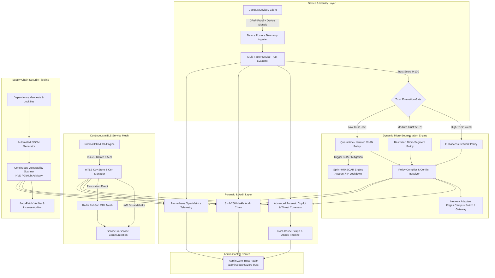

# Engineering Contract — Sprint-041

**Sprint ID:** SPRINT-041  
**Sprint Name:** Zero-Trust Autonomous Security Mesh & Dynamic Micro-Segmentation (ZASM)  
**Target Release Version:** v3.25.0  
**Contract Date:** 2026-08-19  
**Contract Status:** APPROVED — Ready for Implementation  
**Contract Author:** Implementation Engineer (Antigravity)  
**Source Recommendation:** `.ai/Sprint-041-Recommendation.md`  

---

## 1. Executive Summary

This engineering contract formalizes the implementation scope, technical architecture, detailed task breakdown, acceptance criteria, risk register, rollback procedures, and definition of done for **Sprint-041**. It governs all execution work by the Implementation Engineer until formal handoff to the Verification Engineer.

Building on the production-certified Autonomous Security Orchestration and Response (SOAR/ASOR) engine delivered in Sprint-040 (v3.24.0), Sprint-041 transforms ThaibaHive from **reactive threat response** to **proactive zero-trust security infrastructure**. Sprint-041 introduces the **Zero-Trust Autonomous Security Mesh & Dynamic Micro-Segmentation (ZASM)** framework.

### Core Architectural Pillars for Sprint-041:
1. **Automated Internal PKI & Continuous mTLS Service Mesh:** Zero-trust mutual TLS inter-service authentication with automated certificate authority (CA), key generation, sub-2-minute zero-downtime certificate rotation, and real-time Redis PubSub certificate revocation list (CRL) propagation.
2. **Real-Time Device Trust Scoring & Behavioral Telemetry:** Multi-factor device security posture evaluation combining configuration compliance, patch levels, behavioral anomalies, and DPoP cryptographic binding into a dynamic 0–100 trust score.
3. **Dynamic Micro-Segmentation Policy Engine:** Autonomous policy compilation and enforcement engine that dynamically isolates compromised devices, restricts lateral network movement, and pushes policy updates to campus edge switches and software gateways in $< 5$ seconds.
4. **Automated Software Bill of Materials (SBOM) & Supply Chain Security:** Continuous automated SBOM generation (CycloneDX / SPDX 3.0), vulnerability scanning against NVD and GitHub Advisory databases, license compliance auditing, and auto-patch verification.
5. **Advanced Forensic Copilot & Threat Correlation Engine:** AI-powered multi-stage threat correlator and root-cause graph synthesizer that reconstructs attack timelines across system layers within $< 30$ seconds.
6. **Persistence, Cryptographic Merkle Audit & OpenMetrics Telemetry:** Full Drizzle ORM dual-store database persistence for SQLite and PostgreSQL (`zasm_device_trust`, `zasm_segmentation_policies`, `zasm_certificates`, `zasm_sbom_packages`, `zasm_sbom_vulnerabilities`, `zasm_forensic_reports`), SHA-256 Merkle chain audit logging, and Prometheus OpenMetrics series.
7. **Admin Zero-Trust Radar & Supply Chain Control Center:** Enterprise administrative interface at `/admin/security/zero-trust` providing real-time device trust visualization, segmentation policy management, mTLS certificate inspection, SBOM dependency health monitor, and interactive Forensic Copilot analysis.
8. **End-to-End Simulation Test Harness & Operational Runbooks:** Automated simulation CLI (`scripts/security/zasm-simulation-runner.ts` / `pnpm zasm:simulate`) and 5 operational runbooks in `docs/`.

---

## 2. Scope

### In Scope

| # | Domain | Detailed Description |
|---|--------|----------------------|
| 1 | **Internal PKI & Automated Certificate Authority** | Self-contained X.509 Certificate Authority with secure root/intermediate key generation, automated issuance, and RSA/ECDSA key pairs. |
| 2 | **Continuous mTLS Inter-Service Mesh** | Mutual TLS authentication middleware and client transport interceptors ensuring 100% of inter-service RPCs and HTTP requests are cryptographically verified. |
| 3 | **Automated Certificate Rotation Lifecycle** | Non-disruptive, scheduled and on-demand certificate rotation with overlapping validity windows and instant CRL broadcast via Redis PubSub. |
| 4 | **Multi-Factor Device Trust Scoring Engine** | Dynamic scoring algorithm (0–100) evaluating device health, patch compliance, OS integrity, behavioral anomalies, and DPoP binding. |
| 5 | **Behavioral Anomaly & Posture Telemetry Ingestion** | Event listener ingesting real-time device signals (failed auth spikes, unusual geo-shifts, unexpected privilege escalation attempts). |
| 6 | **Trust Calibration & Manual Override System** | Administrative calibration rules, sensitivity tuning, and break-glass temporary trust score overrides with audit logging. |
| 7 | **SOAR & DPoP Identity Mesh Bridge** | Automated bridge triggering Sprint-040 SOAR containment playbooks when a device's trust score drops below defined thresholds. |
| 8 | **Dynamic Micro-Segmentation Policy Engine** | Rule compiler and state engine translating device trust levels into granular network access control policies (VLAN, subnet, IP, service-level). |
| 9 | **Campus Switch & Edge Gateway Adapters** | Modular network adapters translating segmentation policies into vendor-agnostic rules, iptables/eBPF commands, and edge firewall rules. |
| 10 | **Policy Propagation & Conflict Resolution Mesh** | Distributed policy synchronization across cluster nodes with $< 5$s propagation latency and deterministic conflict resolution. |
| 11 | **Automated SBOM Generation Pipeline** | Automated generation and parsing of CycloneDX and SPDX Software Bill of Materials from project manifests (`package.json`, `pnpm-lock.yaml`). |
| 12 | **Continuous Dependency Vulnerability Scanner** | CVE and GitHub Advisory database vulnerability matcher with CVSS scoring, severity classification, and dependency tree blast-radius analysis. |
| 13 | **Auto-Patch Verification & License Compliance** | Automated verification of upstream security patches and OSS license compliance auditing (GPL, Apache, MIT, copyleft detection). |
| 14 | **Advanced Forensic Threat Correlator** | AI-assisted correlation engine analyzing cross-layer logs (mTLS handshakes, SOAR executions, gateway traffic, device trust drops). |
| 15 | **Forensic Root-Cause Graph & Timeline Synthesizer** | Automated DAG graph reconstruction of multi-stage attack vectors and root-cause timeline generation. |
| 16 | **Dual-Store Database Persistence** | Drizzle ORM schemas in SQLite and PostgreSQL for all ZASM entities with 100% schema parity and non-blocking asynchronous persistence. |
| 17 | **Cryptographic Merkle Audit Trail** | Deterministic emission of ZASM lifecycle events into the SHA-256 Merkle chain with cryptographic verification via `pnpm compliance:verify`. |
| 18 | **Prometheus OpenMetrics Telemetry** | 6 new OpenMetrics series tracking trust score distributions, mTLS handshake rates, active segmentation rules, and SBOM vulnerability counts. |
| 19 | **Admin ZASM Management REST APIs** | RBAC-protected REST endpoints (`requireAuth`) for device trust querying, segmentation policy CRUD, certificate inspection, and SBOM scans. |
| 20 | **Admin Zero-Trust Radar UI** | Enterprise dashboard at `/admin/security/zero-trust` with live device trust table, policy rule visualizer, mTLS certificate inspector, and Forensic Copilot UI. |
| 21 | **End-to-End Simulation Test Harness** | CLI test harness (`scripts/security/zasm-simulation-runner.ts` / `pnpm zasm:simulate`) validating 6 critical zero-trust and supply chain scenarios. |
| 22 | **Operational Runbooks & Docs** | 5 comprehensive engineering runbooks in `docs/` covering ZASM architecture, mTLS rotation, micro-segmentation, SBOM management, and forensics. |

### Out of Scope

| Area | Justification |
|------|---------------|
| Physical Hardware Appliance Firmware Flashing | Network micro-segmentation communicates via standard API/SSH/SNMP adapters; physical switch firmware updates are handled by campus IT infrastructure teams. |
| Proprietary Third-Party Commercial PKI Integrations (e.g. DigiCert, Sectigo) | The internal PKI engine provides complete self-contained X.509 CA management for inter-service and campus zero-trust; external commercial CA connectors are deferred to future sprints. |
| Kernel-Level eBPF Driver Development | User-space packet filtering and iptables/edge-gateway rule compilation are supported; custom Linux kernel C module compilation is out of scope. |
| Real-Time Static Binary Decompilation | SBOM scanning operates on dependency manifests, lockfiles, and package registries; binary decompilation is handled by external specialized SAST tools. |
| Automated Production Code Hot-Patching without CI/CD Review | Security patch verification identifies and verifies upstream fixes; automatic pull request creation or auto-merging directly to production branches is governed by CI/CD approval policies. |

---

## 3. Technical Architecture & Component Interactions

### Zero-Trust Autonomous Security Mesh & Dynamic Micro-Segmentation Flow



---

## 4. Implementation Task Breakdown

> Tasks are organized across 8 logical implementation phases in strict dependency order. Core PKI, device trust scoring, and policy engines MUST be constructed and unit-tested before downstream adapters, SBOM scanners, UI dashboards, and simulation harnesses are built.

---

### Phase 1 — Internal PKI & Continuous mTLS Service Mesh

#### ZASM-001 — Internal PKI Certificate Authority & Key Generation Engine

| Field | Specification Details |
|---|---|
| **Task ID** | ZASM-001 |
| **Phase** | Phase 1 — Internal PKI & Continuous mTLS Service Mesh |
| **Description** | Implement the internal Public Key Infrastructure (PKI) Certificate Authority engine in `src/lib/security/pki/ca-engine.ts`, `pki-types.ts`, and `cert-generator.ts`. Provide secure root CA initialization, intermediate CA signing, X.509 certificate generation with RSA/ECDSA key pairs (P-256 / RSA-4096), Subject Alternative Names (SANs) support, validity window configuration, and deterministic fingerprinting (SHA-256). Ensure strict cryptographic entropy and secure in-memory private key isolation. |
| **Files** | `src/lib/security/pki/pki-types.ts` [NEW] · `src/lib/security/pki/ca-engine.ts` [NEW] · `src/lib/security/pki/cert-generator.ts` [NEW] · `src/lib/__tests__/security/pki/ca-engine.test.ts` [NEW] · `src/lib/__tests__/security/pki/cert-generator.test.ts` [NEW] |
| **Dependencies** | None (Foundational Core Primitive) |
| **Acceptance Criteria** | 1. `CaEngine` generates valid X.509 root and intermediate certificates conforming to RFC 5280.<br>2. Supports both ECDSA (P-256/P-384) and RSA (2048/4096) key types.<br>3. Correctly populates SAN extensions for internal service names (e.g. `service.mesh.thaiba.internal`).<br>4. Computes deterministic SHA-256 certificate fingerprints and serial numbers.<br>5. 100% unit test coverage for CA initialization, certificate issuance, key parsing, and signature verification. |
| **Verification Method** | Run `pnpm test --testPathPattern=security/pki/ca-engine` and `cert-generator`. Verify cryptographic validity of generated X.509 certificates and signatures. |
| **Estimated Complexity** | High |

---

#### ZASM-002 — Continuous mTLS Inter-Service Authentication & Handshake Middleware

| Field | Specification Details |
|---|---|
| **Task ID** | ZASM-002 |
| **Phase** | Phase 1 — Continuous mTLS Service Mesh |
| **Description** | Develop the mutual TLS (mTLS) authentication middleware (`src/lib/security/mesh/mtls-authenticator.ts`), client transport adapter (`src/lib/security/mesh/mtls-client.ts`), and service identity resolver (`src/lib/security/mesh/service-identity.ts`). Validate client and server certificates during inter-service requests, verify SAN claims against registered service whitelist, reject expired/untrusted/revoked certificates, and attach verified service context (`ServiceIdentity`) to request lifecycle. |
| **Files** | `src/lib/security/mesh/service-identity.ts` [NEW] · `src/lib/security/mesh/mtls-authenticator.ts` [NEW] · `src/lib/security/mesh/mtls-client.ts` [NEW] · `src/lib/__tests__/security/mesh/mtls-authenticator.test.ts` [NEW] · `src/lib/__tests__/security/mesh/mtls-client.test.ts` [NEW] |
| **Dependencies** | ZASM-001 |
| **Acceptance Criteria** | 1. `MtlsAuthenticator` validates client certificate chains against active internal CA root.<br>2. Extracts and verifies service identity from certificate SAN extension.<br>3. `MtlsClient` configures HTTPS agent with client certificate and key for outgoing inter-service requests.<br>4. Rejects invalid, expired, untrusted, or mismatched service certificates with structured 401/403 errors.<br>5. Unit tests assert handshake success for valid certificates and immediate rejection for invalid/forged certificates. |
| **Verification Method** | Run `pnpm test --testPathPattern=security/mesh/mtls`. Test simulated mTLS handshakes with valid, expired, and revoked client certificates. |
| **Estimated Complexity** | High |

---

#### ZASM-003 — Automated Certificate Rotation & Expiration Lifecycle Manager

| Field | Specification Details |
|---|---|
| **Task ID** | ZASM-003 |
| **Phase** | Phase 1 — Continuous mTLS Service Mesh |
| **Description** | Implement the automated certificate lifecycle manager (`src/lib/security/pki/cert-rotation-manager.ts`) and Certificate Revocation List (CRL) engine (`src/lib/security/pki/crl-manager.ts`). Provide zero-downtime certificate rotation with configurable renewal thresholds (default: rotate when 30% of validity remains, e.g. every 90 days), dual-certificate grace overlap periods, emergency revocation capabilities, and automated background health check timers. |
| **Files** | `src/lib/security/pki/cert-rotation-manager.ts` [NEW] · `src/lib/security/pki/crl-manager.ts` [NEW] · `src/lib/__tests__/security/pki/cert-rotation-manager.test.ts` [NEW] · `src/lib/__tests__/security/pki/crl-manager.test.ts` [NEW] |
| **Dependencies** | ZASM-001, ZASM-002 |
| **Acceptance Criteria** | 1. Automatically identifies certificates nearing expiration based on configured threshold policy.<br>2. Issues replacement certificates and supports graceful dual-certificate verification during rotation window.<br>3. `CrlManager` maintains in-memory and persisted revocation list indexed by certificate serial number.<br>4. Revoked certificates are immediately rejected by `MtlsAuthenticator` within $< 100$ms of revocation.<br>5. Unit tests verify proactive renewal, zero-downtime grace period transition, and instant revocation enforcement. |
| **Verification Method** | Run `pnpm test --testPathPattern=security/pki/cert-rotation-manager` and `crl-manager`. Assert rotation lifecycle and revocation checks. |
| **Estimated Complexity** | Medium-High |

---

#### ZASM-004 — Redis PubSub Dynamic Certificate Revocation & Mesh Broadcast

| Field | Specification Details |
|---|---|
| **Task ID** | ZASM-004 |
| **Phase** | Phase 1 — Continuous mTLS Service Mesh |
| **Description** | Implement multi-node certificate synchronization and revocation broadcasting via Redis PubSub over channel `security:mesh:certs` (`src/lib/security/mesh/cert-mesh-sync.ts`). Ensure that when any cluster node revokes or rotates a service certificate, all active cluster nodes update their local in-memory CRL cache and active certificate store in $< 50$ms. Provide in-process fallback when Redis is offline. |
| **Files** | `src/lib/security/mesh/cert-mesh-sync.ts` [NEW] · `src/lib/__tests__/security/mesh/cert-mesh-sync.test.ts` [NEW] |
| **Dependencies** | ZASM-002, ZASM-003 |
| **Acceptance Criteria** | 1. Broadcasts `CERT_REVOKED`, `CERT_ROTATED`, and `CRL_UPDATED` events over `security:mesh:certs`.<br>2. Subscribing nodes update local memory cache instantly upon receiving broadcast event.<br>3. Handles Redis connection drops with automatic reconnection and initial CRL full sync.<br>4. In-process event emitter fallback operates smoothly in single-node/dev environments.<br>5. Unit tests verify multi-node message publishing, receipt, and cache invalidation. |
| **Verification Method** | Run `pnpm test --testPathPattern=security/mesh/cert-mesh-sync`. Simulate multi-node message broadcast and CRL cache invalidation. |
| **Estimated Complexity** | Medium |

---

### Phase 2 — Device Trust Scoring System & Behavioral Analysis

#### ZASM-005 — Multi-Factor Device Trust Scoring Engine

| Field | Specification Details |
|---|---|
| **Task ID** | ZASM-005 |
| **Phase** | Phase 2 — Device Trust Scoring System & Behavioral Analysis |
| **Description** | Implement the core multi-factor device trust scoring engine in `src/lib/security/trust/device-trust-evaluator.ts`, `trust-types.ts`, and `trust-weights.ts`. Calculate a composite trust score (0–100) based on weighted factors: OS and patch version status (25%), endpoint security compliance / MDM posture (20%), DPoP cryptographic binding integrity (20%), authentication strength / WebAuthn presence (15%), network location risk / geo-reputation (10%), and historical behavioral stability (10%). |
| **Files** | `src/lib/security/trust/trust-types.ts` [NEW] · `src/lib/security/trust/trust-weights.ts` [NEW] · `src/lib/security/trust/device-trust-evaluator.ts` [NEW] · `src/lib/__tests__/security/trust/device-trust-evaluator.test.ts` [NEW] |
| **Dependencies** | None |
| **Acceptance Criteria** | 1. Computes deterministic device trust score (0–100) with detailed factor breakdown and risk level classification (`HIGH_TRUST`: 80–100, `MEDIUM_TRUST`: 50–79, `LOW_TRUST`: 20–49, `UNTRUSTED`: 0–19).<br>2. Factor weights are configurable per institution tenant policy.<br>3. Computes trust scores in $< 10$ milliseconds per evaluation.<br>4. Handles missing or partial device telemetry gracefully with conservative default penalties.<br>5. Unit tests assert scoring accuracy across 30+ diverse device posture scenarios. |
| **Verification Method** | Run `pnpm test --testPathPattern=security/trust/device-trust-evaluator`. Assert score calculations, weight adjustments, and tier categorizations. |
| **Estimated Complexity** | Medium-High |

---

#### ZASM-006 — Real-Time Behavioral Anomaly & Posture Telemetry Ingester

| Field | Specification Details |
|---|---|
| **Task ID** | ZASM-006 |
| **Phase** | Phase 2 — Device Trust Scoring System & Behavioral Analysis |
| **Description** | Develop the posture telemetry ingester (`src/lib/security/trust/posture-telemetry.ts`) and behavioral anomaly detector (`src/lib/security/trust/behavioral-anomaly-detector.ts`). Ingest real-time telemetry from client sessions (user-agent changes, rapid IP flapping, impossible travel velocities, sudden burst in 401/403 responses, unusual API access patterns). Calculate dynamic risk penalties and trigger instant trust score recalculation upon anomaly detection. |
| **Files** | `src/lib/security/trust/posture-telemetry.ts` [NEW] · `src/lib/security/trust/behavioral-anomaly-detector.ts` [NEW] · `src/lib/__tests__/security/trust/behavioral-anomaly-detector.test.ts` [NEW] |
| **Dependencies** | ZASM-005 |
| **Acceptance Criteria** | 1. Ingests posture telemetry payloads from client sessions with schema validation.<br>2. Detects impossible travel anomalies (e.g. login from London and Tokyo within 10 minutes).<br>3. Identifies rapid fingerprint shifts or headless browser signals.<br>4. Computes behavioral penalty score (0–50 points) and applies it to device trust evaluation.<br>5. Unit tests verify detection of impossible travel, token replay, and high-frequency error bursts. |
| **Verification Method** | Run `pnpm test --testPathPattern=security/trust/behavioral-anomaly-detector`. Verify anomaly detection rules and penalty calculations. |
| **Estimated Complexity** | High |

---

#### ZASM-007 — Device Trust Dynamic Calibration & Manual Override Engine

| Field | Specification Details |
|---|---|
| **Task ID** | ZASM-007 |
| **Phase** | Phase 2 — Device Trust Scoring System & Behavioral Analysis |
| **Description** | Implement the trust calibration engine (`src/lib/security/trust/trust-calibration.ts`) and administrative manual override manager (`src/lib/security/trust/trust-override-manager.ts`). Provide automated baseline calibration based on campus-wide historical trust trends, and allow authorized security administrators to apply temporary break-glass trust overrides (force trusted or force untrusted) with mandatory expiration TTLs, reason codes, and Merkle audit logging. |
| **Files** | `src/lib/security/trust/trust-calibration.ts` [NEW] · `src/lib/security/trust/trust-override-manager.ts` [NEW] · `src/lib/__tests__/security/trust/trust-override-manager.test.ts` [NEW] |
| **Dependencies** | ZASM-005, ZASM-006 |
| **Acceptance Criteria** | 1. `TrustOverrideManager` supports creating, listing, and expiring manual device trust overrides.<br>2. Overrides mandate an expiration TTL (max 72 hours) and non-empty justification string.<br>3. Overrides take precedence over automated trust scoring during active validity window.<br>4. Automatic expiration removes override and recalculates real-time trust score.<br>5. Unit tests assert override precedence, expiration cleanup, and audit payload emission. |
| **Verification Method** | Run `pnpm test --testPathPattern=security/trust/trust-override-manager`. Verify override lifecycle, precedence rules, and TTL expiration. |
| **Estimated Complexity** | Medium |

---

#### ZASM-008 — SOAR & DPoP Identity Mesh Bridge for Low-Trust Containment

| Field | Specification Details |
|---|---|
| **Task ID** | ZASM-008 |
| **Phase** | Phase 2 — Device Trust Scoring System & Behavioral Analysis |
| **Description** | Connect the device trust scoring system with the Sprint-040 SOAR engine and Sprint-037 DPoP identity mesh (`src/lib/security/trust/trust-soar-bridge.ts`). When a device's trust score drops below critical threshold ($< 50$ or sudden drop $> 30$ points), automatically trigger corresponding SOAR containment playbooks (e.g. `COMPROMISED_ACCOUNT_LOCKDOWN`, `IP_QUARANTINE_AUTO_MITIGATION`) and invalidate active DPoP key bindings. |
| **Files** | `src/lib/security/trust/trust-soar-bridge.ts` [NEW] · `src/lib/security/soar/orchestrator.ts` [MODIFY] · `src/lib/__tests__/security/trust/trust-soar-bridge.test.ts` [NEW] |
| **Dependencies** | ZASM-005, ZASM-006 |
| **Acceptance Criteria** | 1. `TrustSoarBridge` listens to trust score changes and evaluates threshold trigger conditions.<br>2. Dispatches trigger event to `SoarOrchestrator` for automated containment execution.<br>3. Communicates with DPoP revocation store to blacklist compromised device key thumbprints.<br>4. Incorporates rate-limiting and deduplication to prevent containment flapping.<br>5. Unit and integration tests assert automatic SOAR playbook dispatch upon simulated trust score degradation. |
| **Verification Method** | Run `pnpm test --testPathPattern=security/trust/trust-soar-bridge`. Verify trust drop triggers SOAR playbook execution and DPoP key revocation. |
| **Estimated Complexity** | Medium |

---

### Phase 3 — Dynamic Micro-Segmentation Policy Engine & Network Adapters

#### ZASM-009 — Dynamic Micro-Segmentation Policy Engine & Rule Compiler

| Field | Specification Details |
|---|---|
| **Task ID** | ZASM-009 |
| **Phase** | Phase 3 — Dynamic Micro-Segmentation Policy Engine & Network Adapters |
| **Description** | Implement the core dynamic micro-segmentation policy engine in `src/lib/security/segmentation/policy-engine.ts`, `segmentation-types.ts`, and `rule-compiler.ts`. Compile abstract zero-trust access control policies into concrete network segmentation rules based on subject trust tier, source subnet, target service, protocol, port, and institutional role. Maintain active policy state in memory with fast lookup tables ($O(1)$ rule evaluation). |
| **Files** | `src/lib/security/segmentation/segmentation-types.ts` [NEW] · `src/lib/security/segmentation/rule-compiler.ts` [NEW] · `src/lib/security/segmentation/policy-engine.ts` [NEW] · `src/lib/__tests__/security/segmentation/policy-engine.test.ts` [NEW] · `src/lib/__tests__/security/segmentation/rule-compiler.test.ts` [NEW] |
| **Dependencies** | ZASM-005 |
| **Acceptance Criteria** | 1. `PolicyEngine` evaluates incoming traffic requests against compiled policy matrix in $< 1$ millisecond.<br>2. `RuleCompiler` compiles high-level zero-trust policies into concrete subnet/IP/port rule definitions.<br>3. Supports default-deny security model with explicit trust-tier allowances.<br>4. Dynamic policy updates recompile and hot-swap active rule tables without dropped packets.<br>5. 100% unit test coverage for policy compilation, wildcard matching, and evaluation priority. |
| **Verification Method** | Run `pnpm test --testPathPattern=security/segmentation/policy-engine` and `rule-compiler`. Verify compilation and evaluation across diverse policy sets. |
| **Estimated Complexity** | High |

---

#### ZASM-010 — Campus Switch & Edge Gateway Network Enforcement Adapters

| Field | Specification Details |
|---|---|
| **Task ID** | ZASM-010 |
| **Phase** | Phase 3 — Dynamic Micro-Segmentation Policy Engine & Network Adapters |
| **Description** | Implement modular network enforcement adapters in `src/lib/security/segmentation/adapters/`: `campus-switch-adapter.ts` (dynamic VLAN steering and ACL dispatch via standard network API/SSH), `edge-segmentation-adapter.ts` (application gateway edge routing and WAF segmentation), and `iptables-adapter.ts` (host-level packet filtering). Provide unified adapter interface with rollback capabilities upon dispatch failure. |
| **Files** | `src/lib/security/segmentation/adapters/campus-switch-adapter.ts` [NEW] · `src/lib/security/segmentation/adapters/edge-segmentation-adapter.ts` [NEW] · `src/lib/security/segmentation/adapters/iptables-adapter.ts` [NEW] · `src/lib/security/segmentation/adapters/index.ts` [NEW] · `src/lib/__tests__/security/segmentation/network-adapters.test.ts` [NEW] |
| **Dependencies** | ZASM-009 |
| **Acceptance Criteria** | 1. All adapters implement the `NetworkSegmentationAdapter` interface with `applyPolicy()` and `revertPolicy()`.<br>2. `campus-switch-adapter` generates standardized ACL and dynamic VLAN reassignment payloads.<br>3. `edge-segmentation-adapter` updates gateway route isolation rules with zero traffic disruption.<br>4. Adapters support dry-run simulation mode for safe testing.<br>5. Unit tests assert rule translation, error handling, and compensation rollback across all 3 adapters. |
| **Verification Method** | Run `pnpm test --testPathPattern=security/segmentation/network-adapters`. Test mocked switch API and edge gateway rule dispatch. |
| **Estimated Complexity** | High |

---

#### ZASM-011 — Real-Time Policy Propagation & Conflict Resolution Mesh

| Field | Specification Details |
|---|---|
| **Task ID** | ZASM-011 |
| **Phase** | Phase 3 — Dynamic Micro-Segmentation Policy Engine & Network Adapters |
| **Description** | Develop distributed policy synchronization (`src/lib/security/segmentation/policy-propagation-mesh.ts`) and policy conflict resolution engine (`src/lib/security/segmentation/conflict-resolver.ts`). Broadcast segmentation policy changes across cluster nodes via Redis PubSub channel `security:segmentation:policies` with $< 5$ second propagation latency. Deterministically resolve policy overlap conflicts using strict precedence ordering (Quarantine/Explicit Deny $>$ Role Exemption $>$ Trust Tier Allowance $>$ Default Deny). |
| **Files** | `src/lib/security/segmentation/conflict-resolver.ts` [NEW] · `src/lib/security/segmentation/policy-propagation-mesh.ts` [NEW] · `src/lib/__tests__/security/segmentation/policy-propagation.test.ts` [NEW] · `src/lib/__tests__/security/segmentation/conflict-resolver.test.ts` [NEW] |
| **Dependencies** | ZASM-009, ZASM-010 |
| **Acceptance Criteria** | 1. Broadcasts policy activations, updates, and revocations to all cluster nodes over Redis PubSub.<br>2. Confirms policy propagation across cluster in $< 5$ seconds.<br>3. `ConflictResolver` resolves overlapping/competing rules using deterministic precedence hierarchy.<br>4. Detects and flags conflicting duplicate rules with descriptive warnings.<br>5. Unit tests verify distributed propagation, conflict resolution priority, and in-memory rule cache sync. |
| **Verification Method** | Run `pnpm test --testPathPattern=security/segmentation/policy-propagation` and `conflict-resolver`. |
| **Estimated Complexity** | Medium-High |

---

### Phase 4 — Automated SBOM Vulnerability Scanner & Supply Chain Security

#### ZASM-012 — Automated Software Bill of Materials (SBOM) Generation Pipeline

| Field | Specification Details |
|---|---|
| **Task ID** | ZASM-012 |
| **Phase** | Phase 4 — Automated SBOM Vulnerability Scanner & Supply Chain Security |
| **Description** | Implement the automated Software Bill of Materials (SBOM) generator in `src/lib/security/sbom/sbom-generator.ts`, `sbom-types.ts`, `cyclonedx-parser.ts`, and `spdx-parser.ts`. Parse monorepo dependency graphs, lockfiles (`pnpm-lock.yaml`, `package.json`), and sub-packages (`packages/auth`, `packages/db`). Generate compliant CycloneDX (v1.5/v1.6) and SPDX (v2.3/v3.0) JSON specifications with Package URLs (PURL), cryptographic hashes (SHA-256/SHA-512), dependency trees, and component metadata. |
| **Files** | `src/lib/security/sbom/sbom-types.ts` [NEW] · `src/lib/security/sbom/cyclonedx-parser.ts` [NEW] · `src/lib/security/sbom/spdx-parser.ts` [NEW] · `src/lib/security/sbom/sbom-generator.ts` [NEW] · `src/lib/__tests__/security/sbom/sbom-generator.test.ts` [NEW] · `src/lib/__tests__/security/sbom/sbom-parsers.test.ts` [NEW] |
| **Dependencies** | None |
| **Acceptance Criteria** | 1. `SbomGenerator` parses complete repository dependency tree including transitive dependencies.<br>2. Generates standard-compliant CycloneDX and SPDX JSON outputs with valid PURLs.<br>3. Computes SHA-256 package checksums and license metadata.<br>4. Generates complete SBOM report in $< 5$ seconds for monorepo workspace.<br>5. Unit tests validate format compliance against official CycloneDX and SPDX schemas. |
| **Verification Method** | Run `pnpm test --testPathPattern=security/sbom/sbom-generator` and `sbom-parsers`. Verify generated SBOM schema validity. |
| **Estimated Complexity** | Medium-High |

---

#### ZASM-013 — Continuous Dependency Vulnerability Scanner & CVE Matcher

| Field | Specification Details |
|---|---|
| **Task ID** | ZASM-013 |
| **Phase** | Phase 4 — Automated SBOM Vulnerability Scanner & Supply Chain Security |
| **Description** | Implement the continuous dependency vulnerability scanner (`src/lib/security/sbom/vulnerability-scanner.ts`), advisory matcher (`src/lib/security/sbom/advisory-matcher.ts`), and vulnerability database client (`src/lib/security/sbom/cve-database-client.ts`). Ingest vulnerability advisories from GitHub Advisory Database and NVD feeds (with local LRU caching). Match active SBOM components against known CVEs/GHSA identifiers, calculate CVSS v3/v4 severity, and identify affected dependency paths. |
| **Files** | `src/lib/security/sbom/cve-database-client.ts` [NEW] · `src/lib/security/sbom/advisory-matcher.ts` [NEW] · `src/lib/security/sbom/vulnerability-scanner.ts` [NEW] · `src/lib/__tests__/security/sbom/vulnerability-scanner.test.ts` [NEW] · `src/lib/__tests__/security/sbom/advisory-matcher.test.ts` [NEW] |
| **Dependencies** | ZASM-012 |
| **Acceptance Criteria** | 1. `VulnerabilityScanner` matches SBOM packages against known CVE/GHSA records.<br>2. Categorizes vulnerabilities by severity (`CRITICAL`, `HIGH`, `MEDIUM`, `LOW`) with CVSS scores.<br>3. Identifies complete dependency tree path from direct dependencies to affected transitive packages.<br>4. Uses local in-memory/persisted cache to eliminate redundant external API requests.<br>5. Unit tests assert detection accuracy against synthetic vulnerable SBOM fixtures. |
| **Verification Method** | Run `pnpm test --testPathPattern=security/sbom/vulnerability-scanner` and `advisory-matcher`. Test simulated CVE matching against package fixtures. |
| **Estimated Complexity** | High |

---

#### ZASM-014 — Automated Auto-Patch Verification & License Compliance Engine

| Field | Specification Details |
|---|---|
| **Task ID** | ZASM-014 |
| **Phase** | Phase 4 — Automated SBOM Vulnerability Scanner & Supply Chain Security |
| **Description** | Develop the auto-patch verification pipeline (`src/lib/security/sbom/patch-verifier.ts`) and open-source license compliance auditor (`src/lib/security/sbom/license-compliance-checker.ts`). Evaluate available upstream patched package versions, check semver compatibility to avoid breaking changes, verify cryptographic checksums, and audit dependency licenses against institutional policy (flagging restrictive copyleft licenses like AGPL-3.0 or non-commercial restrictions). |
| **Files** | `src/lib/security/sbom/patch-verifier.ts` [NEW] · `src/lib/security/sbom/license-compliance-checker.ts` [NEW] · `src/lib/__tests__/security/sbom/patch-verifier.test.ts` [NEW] · `src/lib/__tests__/security/sbom/license-compliance.test.ts` [NEW] |
| **Dependencies** | ZASM-012, ZASM-013 |
| **Acceptance Criteria** | 1. `PatchVerifier` suggests safe non-breaking patch/minor upgrades for detected CVEs.<br>2. Verifies integrity of recommended package upgrades via registry metadata.<br>3. `LicenseComplianceChecker` audits all dependency licenses (MIT, Apache-2.0, BSD, GPL, AGPL, Proprietary).<br>4. Flags incompatible or high-risk copyleft licenses with actionable remediation guidance.<br>5. Unit tests verify patch version resolution and license classification across 40+ license types. |
| **Verification Method** | Run `pnpm test --testPathPattern=security/sbom/patch-verifier` and `license-compliance`. Verify patch version suggestions and license flags. |
| **Estimated Complexity** | Medium |

---

### Phase 5 — Advanced Forensic Root-Cause Analysis Copilot

#### ZASM-015 — Advanced Forensic Copilot & Multi-Stage Threat Correlation Engine

| Field | Specification Details |
|---|---|
| **Task ID** | ZASM-015 |
| **Phase** | Phase 5 — Advanced Forensic Root-Cause Analysis Copilot |
| **Description** | Implement the Advanced Forensic Copilot in `src/lib/security/forensics/forensic-copilot.ts`, `forensic-types.ts`, and `threat-correlator.ts`. Correlate disparate security signals across system layers (device trust drops, mTLS handshake errors, SOAR playbook triggers, WAF rate-limit blocks, SBOM vulnerabilities, and authentication audit logs). Identify multi-stage attack patterns (e.g. initial access $\to$ lateral movement attempt $\to$ privilege escalation attempt) within $< 30$ seconds. |
| **Files** | `src/lib/security/forensics/forensic-types.ts` [NEW] · `src/lib/security/forensics/threat-correlator.ts` [NEW] · `src/lib/security/forensics/forensic-copilot.ts` [NEW] · `src/lib/__tests__/security/forensics/forensic-copilot.test.ts` [NEW] · `src/lib/__tests__/security/forensics/threat-correlator.test.ts` [NEW] |
| **Dependencies** | ZASM-002, ZASM-005, ZASM-009, ZASM-013 |
| **Acceptance Criteria** | 1. `ForensicCopilot` ingests cross-layer security events and clusters related incidents by actor/IP/device.<br>2. `ThreatCorrelator` maps observed event sequences to MITRE ATT&CK tactics and techniques.<br>3. Computes incident confidence score and attack progression phase.<br>4. Completes comprehensive correlation analysis in $< 30$ seconds.<br>5. Unit tests assert correlation of multi-stage simulated attack campaigns across all layers. |
| **Verification Method** | Run `pnpm test --testPathPattern=security/forensics/forensic-copilot` and `threat-correlator`. Test multi-stage incident correlation. |
| **Estimated Complexity** | High |

---

#### ZASM-016 — Forensic Event Timeline & Root-Cause Graph Synthesizer

| Field | Specification Details |
|---|---|
| **Task ID** | ZASM-016 |
| **Phase** | Phase 5 — Advanced Forensic Root-Cause Analysis Copilot |
| **Description** | Build the forensic attack timeline synthesizer (`src/lib/security/forensics/timeline-synthesizer.ts`) and root-cause DAG graph generator (`src/lib/security/forensics/root-cause-graph.ts`). Synthesize raw audit logs and correlated incidents into an ordered chronological timeline with event severity, evidence links, and plain-language incident explanations. Generate directed acyclic graphs (DAG) representing the complete root-cause causal chain. |
| **Files** | `src/lib/security/forensics/timeline-synthesizer.ts` [NEW] · `src/lib/security/forensics/root-cause-graph.ts` [NEW] · `src/lib/__tests__/security/forensics/timeline-synthesizer.test.ts` [NEW] · `src/lib/__tests__/security/forensics/root-cause-graph.test.ts` [NEW] |
| **Dependencies** | ZASM-015 |
| **Acceptance Criteria** | 1. `TimelineSynthesizer` builds chronological event sequences with millisecond precision and actor tracking.<br>2. `RootCauseGraph` outputs topological DAG node/edge structures representing threat origin and impact.<br>3. Generates clear, non-technical executive incident summaries alongside technical evidence.<br>4. Exports forensic investigations in standard JSON and Markdown formats.<br>5. Unit tests verify timeline ordering, graph cycle prevention, and report generation. |
| **Verification Method** | Run `pnpm test --testPathPattern=security/forensics/timeline-synthesizer` and `root-cause-graph`. |
| **Estimated Complexity** | Medium-High |

---

### Phase 6 — Persistence, Merkle Audit & OpenMetrics Telemetry

#### ZASM-017 — Dual-Store Database Persistence for ZASM Entities (SQLite & PostgreSQL)

| Field | Specification Details |
|---|---|
| **Task ID** | ZASM-017 |
| **Phase** | Phase 6 — Persistence, Merkle Audit & OpenMetrics Telemetry |
| **Description** | Define database schema tables for Zero-Trust and Supply Chain entities and implement runtime data access in `src/lib/security/zasm/zasm-db-store.ts`. Create tables `zasm_device_trust`, `zasm_segmentation_policies`, `zasm_certificates`, `zasm_sbom_packages`, `zasm_sbom_vulnerabilities`, and `zasm_forensic_reports` in both SQLite (`packages/db/schema.ts`) and PostgreSQL (`packages/db/schema.pg.ts`). Maintain 100% schema parity, automatic timestamp handling, JSON typing, and non-blocking asynchronous persistence. |
| **Files** | `packages/db/schema.ts` [MODIFY] · `packages/db/schema.pg.ts` [MODIFY] · `src/lib/security/zasm/zasm-db-store.ts` [NEW] · `src/lib/__tests__/security/zasm/zasm-db-store.test.ts` [NEW] · `src/lib/__tests__/db/schema-parity.test.ts` [MODIFY] |
| **Dependencies** | ZASM-001, ZASM-005, ZASM-009, ZASM-012, ZASM-015 |
| **Acceptance Criteria** | 1. Schema defines all 6 ZASM tables with appropriate indexes, unique constraints, and foreign keys.<br>2. 100% column and constraint parity verified between SQLite and PostgreSQL schemas.<br>3. `ZasmDbStore` provides type-safe CRUD operations with asynchronous write batching.<br>4. Database read/write operations never block critical mTLS handshakes or packet filtering.<br>5. `schema-parity.test.ts` passes with zero drift. |
| **Verification Method** | Run `pnpm test --testPathPattern=security/zasm/zasm-db-store` and `schema-parity.test.ts`. Verify database operations and migrations. |
| **Estimated Complexity** | High |

---

#### ZASM-018 — Cryptographic Merkle Audit Trail Integration for ZASM Events

| Field | Specification Details |
|---|---|
| **Task ID** | ZASM-018 |
| **Phase** | Phase 6 — Persistence, Merkle Audit & OpenMetrics Telemetry |
| **Description** | Implement ZASM cryptographic audit event creators (`src/lib/security/zasm/zasm-audit-events.ts`) and integrate with `cryptoAuditWriter`. Deterministically emit immutable audit blocks into the SHA-256 Merkle chain at key moments: `ZASM_CERT_ISSUED`, `ZASM_CERT_REVOKED`, `ZASM_CERT_ROTATED`, `ZASM_TRUST_EVALUATED`, `ZASM_TRUST_OVERRIDDEN`, `ZASM_POLICY_COMPILED`, `ZASM_POLICY_APPLIED`, `ZASM_SBOM_SCANNED`, `ZASM_VULN_DETECTED`, and `ZASM_FORENSIC_REPORT_GENERATED`. |
| **Files** | `src/lib/security/zasm/zasm-audit-events.ts` [NEW] · `src/lib/security/threat-audit-events.ts` [MODIFY] · `src/lib/__tests__/security/zasm/zasm-audit-events.test.ts` [NEW] |
| **Dependencies** | ZASM-001, ZASM-005, ZASM-009, ZASM-013, ZASM-015 |
| **Acceptance Criteria** | 1. Every Zero-Trust and SBOM lifecycle event emits a cryptographically valid Merkle audit block.<br>2. Sensitive credentials, private keys, and authorization tokens are strictly redacted before emission.<br>3. `pnpm compliance:verify` confirms unbroken Merkle chain integrity across all tenants.<br>4. Audit payloads contain timestamp, tenant ID, actor identity, entity ID, and event metadata.<br>5. Unit tests assert event structure, hash computation, and payload immutability. |
| **Verification Method** | Run `pnpm test --testPathPattern=security/zasm/zasm-audit-events` and `pnpm compliance:verify`. |
| **Estimated Complexity** | Medium |

---

#### ZASM-019 — Prometheus OpenMetrics Telemetry Series for Zero-Trust Mesh

| Field | Specification Details |
|---|---|
| **Task ID** | ZASM-019 |
| **Phase** | Phase 6 — Persistence, Merkle Audit & OpenMetrics Telemetry |
| **Description** | Implement ZASM telemetry metrics in `src/lib/security/zasm/zasm-metrics.ts` and register with the platform metrics registry (`src/lib/metrics/registry.ts`). Emit 6 new Prometheus OpenMetrics series: (1) `zasm_mtls_handshakes_total{service, status}`, (2) `zasm_certificate_rotations_total{service, status}`, (3) `zasm_device_trust_score_distribution{tier}`, (4) `zasm_segmentation_policies_active{tier}`, (5) `zasm_sbom_vulnerabilities_total{severity}`, and (6) `zasm_forensic_analysis_duration_seconds`. |
| **Files** | `src/lib/security/zasm/zasm-metrics.ts` [NEW] · `src/lib/metrics/registry.ts` [MODIFY] · `src/lib/__tests__/security/zasm/zasm-metrics.test.ts` [NEW] |
| **Dependencies** | ZASM-001, ZASM-005, ZASM-009, ZASM-013, ZASM-015 |
| **Acceptance Criteria** | 1. All 6 metric series are exported in standard Prometheus OpenMetrics text format at `/api/metrics`.<br>2. Counters and histograms update in real time with security events.<br>3. Calibrated histogram buckets capture sub-second mTLS handshakes and multi-second forensic runs.<br>4. Unit tests verify metric increments, label formatting, and registry output. |
| **Verification Method** | Run `pnpm test --testPathPattern=security/zasm/zasm-metrics`. Assert Prometheus exposition format and counter updates. |
| **Estimated Complexity** | Low-Medium |

---

### Phase 7 — Administration UI, REST APIs & Operator Radar

#### ZASM-020 — Admin ZASM & Supply Chain Management REST APIs

| Field | Specification Details |
|---|---|
| **Task ID** | ZASM-020 |
| **Phase** | Phase 7 — Administration UI, REST APIs & Operator Radar |
| **Description** | Build administration REST API endpoints for the Zero-Trust mesh and supply chain management: (1) `GET/POST /api/admin/security/zero-trust/devices` (query trust scores, apply manual overrides), (2) `GET/POST/PATCH /api/admin/security/zero-trust/policies` (segmentation policy CRUD), (3) `GET/POST /api/admin/security/zero-trust/certificates` (list active certificates, trigger manual rotation or revocation), (4) `GET/POST /api/admin/security/zero-trust/sbom` (trigger SBOM generation, query packages/vulnerabilities), (5) `POST /api/admin/security/zero-trust/forensics` (trigger forensic correlation, query reports), and (6) `GET /api/admin/security/zero-trust/metrics` (summary stats). Enforce strict RBAC permissions. |
| **Files** | `src/app/api/admin/security/zero-trust/devices/route.ts` [NEW] · `src/app/api/admin/security/zero-trust/devices/[id]/override/route.ts` [NEW] · `src/app/api/admin/security/zero-trust/policies/route.ts` [NEW] · `src/app/api/admin/security/zero-trust/policies/[id]/route.ts` [NEW] · `src/app/api/admin/security/zero-trust/certificates/route.ts` [NEW] · `src/app/api/admin/security/zero-trust/certificates/[id]/rotate/route.ts` [NEW] · `src/app/api/admin/security/zero-trust/sbom/route.ts` [NEW] · `src/app/api/admin/security/zero-trust/sbom/scan/route.ts` [NEW] · `src/app/api/admin/security/zero-trust/forensics/route.ts` [NEW] · `src/app/api/admin/security/zero-trust/metrics/route.ts` [NEW] · `src/lib/__tests__/security/zasm/zasm-api.test.ts` [NEW] |
| **Dependencies** | ZASM-003, ZASM-007, ZASM-009, ZASM-013, ZASM-015, ZASM-017 |
| **Acceptance Criteria** | 1. All routes protected with `requireAuth` and granular RBAC permissions (`system:security:view`, `system:security:manage`, `system:security:audit`).<br>2. All POST/PATCH request bodies validated with Zod schemas (`src/lib/validation/zasm-schemas.ts`).<br>3. Returns structured RFC 7807 problem details on error with appropriate HTTP status codes.<br>4. Supports pagination, multi-attribute filtering, and keyword search.<br>5. 100% unit and integration test coverage for authorized and unauthorized access paths. |
| **Verification Method** | Run `pnpm test --testPathPattern=security/zasm/zasm-api`. Verify authentication, RBAC authorization, validation errors, and CRUD operations. |
| **Estimated Complexity** | High |

---

#### ZASM-021 — React Hooks & Client State Management for Zero-Trust Radar

| Field | Specification Details |
|---|---|
| **Task ID** | ZASM-021 |
| **Phase** | Phase 7 — Administration UI, REST APIs & Operator Radar |
| **Description** | Develop the client-side state management hooks in `src/lib/hooks/`: `use-zero-trust-mesh.ts` (device trust scores, active segmentation policies, certificate status), `use-sbom-scanner.ts` (SBOM package list, vulnerability counts, patch suggestions), and `use-forensic-copilot.ts` (threat correlation runs, attack timeline, root-cause graph). Implement automatic polling, optimistic updates, and robust error recovery. |
| **Files** | `src/lib/hooks/use-zero-trust-mesh.ts` [NEW] · `src/lib/hooks/use-sbom-scanner.ts` [NEW] · `src/lib/hooks/use-forensic-copilot.ts` [NEW] · `src/lib/__tests__/hooks/use-zero-trust-mesh.test.ts` [NEW] · `src/lib/__tests__/hooks/use-sbom-scanner.test.ts` [NEW] · `src/lib/__tests__/hooks/use-forensic-copilot.test.ts` [NEW] |
| **Dependencies** | ZASM-020 |
| **Acceptance Criteria** | 1. Hooks encapsulate all ZASM API interactions with strongly typed response and error states.<br>2. Polling intervals adapt automatically based on active operations (5s active scan/correlation, 15s idle).<br>3. All fetch calls include `.catch()` blocks to prevent stuck loading spinners.<br>4. Exposes intuitive mutation methods (`triggerScan`, `rotateCertificate`, `overrideDeviceTrust`, `analyzeIncident`).<br>5. Unit tests assert state transitions, polling behavior, and error handling. |
| **Verification Method** | Run `pnpm test --testPathPattern=hooks/use-zero-trust` and `use-sbom` and `use-forensic`. |
| **Estimated Complexity** | Medium |

---

#### ZASM-022 — Admin Zero-Trust Mesh, Supply Chain & Forensic Copilot Radar UI

| Field | Specification Details |
|---|---|
| **Task ID** | ZASM-022 |
| **Phase** | Phase 7 — Administration UI, REST APIs & Operator Radar |
| **Description** | Build the administrative Zero-Trust dashboard page at `src/app/(shell)/admin/security/zero-trust/page.tsx` and modular UI components in `src/components/security/zasm/`: `zero-trust-metrics-card.tsx`, `device-trust-matrix-table.tsx`, `device-override-dialog.tsx`, `segmentation-policy-table.tsx`, `certificate-lifecycle-table.tsx`, `sbom-vulnerability-viewer.tsx`, `license-compliance-card.tsx`, and `forensic-copilot-panel.tsx`. Ensure full WCAG 2.1 AA accessibility, Radix UI primitives, responsive layouts, and `<Skeleton>` loading states. |
| **Files** | `src/app/(shell)/admin/security/zero-trust/page.tsx` [NEW] · `src/components/security/zasm/zero-trust-metrics-card.tsx` [NEW] · `src/components/security/zasm/device-trust-matrix-table.tsx` [NEW] · `src/components/security/zasm/device-override-dialog.tsx` [NEW] · `src/components/security/zasm/segmentation-policy-table.tsx` [NEW] · `src/components/security/zasm/certificate-lifecycle-table.tsx` [NEW] · `src/components/security/zasm/sbom-vulnerability-viewer.tsx` [NEW] · `src/components/security/zasm/license-compliance-card.tsx` [NEW] · `src/components/security/zasm/forensic-copilot-panel.tsx` [NEW] · `src/lib/__tests__/security/zasm/zasm-ui.test.tsx` [NEW] |
| **Dependencies** | ZASM-021 |
| **Acceptance Criteria** | 1. Dashboard renders 4 primary tabs: Device Trust, Micro-Segmentation, mTLS PKI, and Supply Chain & Forensics.<br>2. Device trust matrix displays real-time 0–100 trust scores with colored `<Badge>` variants and override button.<br>3. Certificate inspector visualizes validity timelines, expiration warnings, and 1-click rotation.<br>4. SBOM viewer lists dependency vulnerabilities with CVSS badges, patch advice, and license flags.<br>5. Forensic Copilot panel displays interactive attack timeline and root-cause graph.<br>6. 0 WCAG accessibility violations (verified via `jest-axe`); zero raw HTML form inputs.<br>7. Component tests verify rendering across loading, empty, active data, and error states. |
| **Verification Method** | Run `pnpm test --testPathPattern=security/zasm/zasm-ui`. Verify component rendering, accessibility, tabs, and modals. |
| **Estimated Complexity** | High |

---

### Phase 8 — System Verification, Documentation & Production Runbooks

#### ZASM-023 — End-to-End ZASM Simulation Test Harness & Automated Chaos CLI

| Field | Specification Details |
|---|---|
| **Task ID** | ZASM-023 |
| **Phase** | Phase 8 — System Verification, Documentation & Production Runbooks |
| **Description** | Develop a comprehensive simulation testing CLI tool (`scripts/security/zasm-simulation-runner.ts`) and end-to-end integration test suite (`src/lib/__tests__/security/zasm/e2e-zasm.test.ts`). Simulate 6 critical zero-trust scenarios: (1) Device trust degradation triggering dynamic micro-segmentation isolation, (2) Automated mTLS certificate rotation under live traffic, (3) Emergency certificate revocation with instant mesh CRL sync, (4) SBOM vulnerability detection and auto-patch verification, (5) Forensic Copilot root-cause attack reconstruction, and (6) Policy conflict resolution under competing rules. Add npm script `pnpm zasm:simulate`. |
| **Files** | `scripts/security/zasm-simulation-runner.ts` [NEW] · `src/lib/__tests__/security/zasm/e2e-zasm.test.ts` [NEW] · `package.json` [MODIFY] |
| **Dependencies** | ZASM-001 through ZASM-022 |
| **Acceptance Criteria** | 1. `pnpm zasm:simulate` executes all 6 simulation scenarios with 100% pass rate.<br>2. Verifies policy propagation latency $< 5$ seconds and device trust evaluation latency $< 10$ milliseconds.<br>3. Verifies zero connection drops during automated mTLS certificate rotation.<br>4. Confirms forensic correlation analysis time $< 30$ seconds for multi-stage incidents.<br>5. Emits structured JSON and terminal markdown summary report. |
| **Verification Method** | Run `pnpm test --testPathPattern=security/zasm/e2e-zasm` and execute `pnpm tsx scripts/security/zasm-simulation-runner.ts --dry-run`. |
| **Estimated Complexity** | High |

---

#### ZASM-024 — Operational Runbooks, Architecture Specifications & Governance

| Field | Specification Details |
|---|---|
| **Task ID** | ZASM-024 |
| **Phase** | Phase 8 — System Verification, Documentation & Production Runbooks |
| **Description** | Author 5 comprehensive operational engineering runbooks in `docs/`: (1) `docs/zasm-architecture-guide.md` (zero-trust mesh mechanics, PKI design, policy engine), (2) `docs/mtls-certificate-rotation-ops.md` (automated rotation, grace periods, emergency CRL revocation), (3) `docs/campus-micro-segmentation-guide.md` (dynamic VLAN steering, switch adapter integration, ACL guidelines), (4) `docs/sbom-supply-chain-ops.md` (SBOM generation, vulnerability scanning, license compliance), and (5) `docs/forensic-copilot-investigation-ops.md` (SOC root-cause analysis procedures, timeline analysis). Update all AIOS governance files (`.ai/FEATURES.md`, `.ai/CHANGELOG.md`, `.ai/PROJECT_STATUS.md`, `.ai/execution/Sprint-041-Execution-Log.md`). |
| **Files** | `docs/zasm-architecture-guide.md` [NEW] · `docs/mtls-certificate-rotation-ops.md` [NEW] · `docs/campus-micro-segmentation-guide.md` [NEW] · `docs/sbom-supply-chain-ops.md` [NEW] · `docs/forensic-copilot-investigation-ops.md` [NEW] · `.ai/FEATURES.md` [MODIFY] · `.ai/CHANGELOG.md` [MODIFY] · `.ai/PROJECT_STATUS.md` [MODIFY] · `.ai/execution/Sprint-041-Execution-Log.md` [NEW] |
| **Dependencies** | ZASM-023 |
| **Acceptance Criteria** | 1. All 5 runbooks authored with architecture diagrams, step-by-step instructions, CLI commands, and troubleshooting FAQs.<br>2. `.ai/FEATURES.md` documents all Sprint-041 capabilities.<br>3. `.ai/CHANGELOG.md` documents v3.25.0 release notes.<br>4. `.ai/PROJECT_STATUS.md` updated with Sprint-041 progress.<br>5. `.ai/execution/Sprint-041-Execution-Log.md` initialized with all 24 tasks. |
| **Verification Method** | Inspect all 5 documents for technical completeness, formatting standards, and accurate code/configuration examples. |
| **Estimated Complexity** | Medium |

---

## 5. File Inventory

### New Files to Create

```
src/lib/security/pki/
├── pki-types.ts
├── ca-engine.ts
├── cert-generator.ts
├── cert-rotation-manager.ts
└── crl-manager.ts

src/lib/security/mesh/
├── service-identity.ts
├── mtls-authenticator.ts
├── mtls-client.ts
└── cert-mesh-sync.ts

src/lib/security/trust/
├── trust-types.ts
├── trust-weights.ts
├── device-trust-evaluator.ts
├── posture-telemetry.ts
├── behavioral-anomaly-detector.ts
├── trust-calibration.ts
├── trust-override-manager.ts
└── trust-soar-bridge.ts

src/lib/security/segmentation/
├── segmentation-types.ts
├── rule-compiler.ts
├── policy-engine.ts
├── conflict-resolver.ts
├── policy-propagation-mesh.ts
└── adapters/
    ├── index.ts
    ├── campus-switch-adapter.ts
    ├── edge-segmentation-adapter.ts
    └── iptables-adapter.ts

src/lib/security/sbom/
├── sbom-types.ts
├── cyclonedx-parser.ts
├── spdx-parser.ts
├── sbom-generator.ts
├── cve-database-client.ts
├── advisory-matcher.ts
├── vulnerability-scanner.ts
├── patch-verifier.ts
└── license-compliance-checker.ts

src/lib/security/forensics/
├── forensic-types.ts
├── threat-correlator.ts
├── forensic-copilot.ts
├── timeline-synthesizer.ts
└── root-cause-graph.ts

src/lib/security/zasm/
├── zasm-db-store.ts
├── zasm-audit-events.ts
└── zasm-metrics.ts

src/lib/validation/
└── zasm-schemas.ts

src/lib/hooks/
├── use-zero-trust-mesh.ts
├── use-sbom-scanner.ts
└── use-forensic-copilot.ts

src/app/api/admin/security/zero-trust/
├── devices/
│   ├── route.ts
│   └── [id]/override/route.ts
├── policies/
│   ├── route.ts
│   └── [id]/route.ts
├── certificates/
│   ├── route.ts
│   └── [id]/rotate/route.ts
├── sbom/
│   ├── route.ts
│   └── scan/route.ts
├── forensics/
│   └── route.ts
└── metrics/
    └── route.ts

src/app/(shell)/admin/security/zero-trust/
└── page.tsx

src/components/security/zasm/
├── zero-trust-metrics-card.tsx
├── device-trust-matrix-table.tsx
├── device-override-dialog.tsx
├── segmentation-policy-table.tsx
├── certificate-lifecycle-table.tsx
├── sbom-vulnerability-viewer.tsx
├── license-compliance-card.tsx
└── forensic-copilot-panel.tsx

src/lib/__tests__/security/pki/
├── ca-engine.test.ts
├── cert-generator.test.ts
├── cert-rotation-manager.test.ts
└── crl-manager.test.ts

src/lib/__tests__/security/mesh/
├── mtls-authenticator.test.ts
├── mtls-client.test.ts
└── cert-mesh-sync.test.ts

src/lib/__tests__/security/trust/
├── device-trust-evaluator.test.ts
├── behavioral-anomaly-detector.test.ts
├── trust-override-manager.test.ts
└── trust-soar-bridge.test.ts

src/lib/__tests__/security/segmentation/
├── policy-engine.test.ts
├── rule-compiler.test.ts
├── network-adapters.test.ts
├── policy-propagation.test.ts
└── conflict-resolver.test.ts

src/lib/__tests__/security/sbom/
├── sbom-generator.test.ts
├── sbom-parsers.test.ts
├── vulnerability-scanner.test.ts
├── advisory-matcher.test.ts
├── patch-verifier.test.ts
└── license-compliance.test.ts

src/lib/__tests__/security/forensics/
├── forensic-copilot.test.ts
├── threat-correlator.test.ts
├── timeline-synthesizer.test.ts
└── root-cause-graph.test.ts

src/lib/__tests__/security/zasm/
├── zasm-db-store.test.ts
├── zasm-audit-events.test.ts
├── zasm-metrics.test.ts
├── zasm-api.test.ts
├── zasm-ui.test.tsx
└── e2e-zasm.test.ts

src/lib/__tests__/hooks/
├── use-zero-trust-mesh.test.ts
├── use-sbom-scanner.test.ts
└── use-forensic-copilot.test.ts

scripts/security/
└── zasm-simulation-runner.ts

docs/
├── zasm-architecture-guide.md
├── mtls-certificate-rotation-ops.md
├── campus-micro-segmentation-guide.md
├── sbom-supply-chain-ops.md
└── forensic-copilot-investigation-ops.md

.ai/execution/
└── Sprint-041-Execution-Log.md
```

### Existing Files to Modify

```
packages/db/schema.ts                         (add zasm_device_trust, zasm_segmentation_policies, zasm_certificates, zasm_sbom_packages, zasm_sbom_vulnerabilities, zasm_forensic_reports)
packages/db/schema.pg.ts                      (add PostgreSQL parity tables for ZASM operations)
src/lib/security/soar/orchestrator.ts         (integrate trust score trigger listener for automated SOAR mitigation)
src/lib/security/threat-audit-events.ts       (re-export ZASM audit event creators)
src/lib/metrics/registry.ts                   (register 6 new Prometheus OpenMetrics series)
package.json                                  (add zasm:simulate script definition)
.ai/FEATURES.md                               (register Sprint-041 features)
.ai/CHANGELOG.md                              (document v3.25.0 release notes)
.ai/PROJECT_STATUS.md                         (update current sprint status and feature registry)
```

---

## 6. Security, RBAC & Compliance Framework

### RBAC Permissions

| Permission String | Role Access | Description |
|---|---|---|
| `system:security:view` | `super_admin`, `admin` | Read-only access to device trust matrix, active segmentation policies, certificate status, and SBOM reports. |
| `system:security:manage` | `super_admin` | Create, update, or delete micro-segmentation policies, apply device trust overrides, and trigger SBOM scans. |
| `system:security:rotate` | `super_admin` | Trigger manual or emergency mTLS certificate rotation and certificate revocation. |
| `system:security:audit` | `super_admin`, `admin` | Access Forensic Copilot incident investigations, root-cause graphs, and Merkle audit trails. |

### Compliance & Cryptographic Controls
- **Zero-Trust Identity Binding:** Device trust scoring integrates with DPoP cryptographic proof of possession (`cnf.jkt`) and user identity tokens.
- **Fail-Closed Default Deny:** Network micro-segmentation operates on a strict default-deny baseline; traffic is only permitted when matching explicit trust tier rules.
- **Mutual TLS Verification:** Inter-service communications mandate valid X.509 client and server certificates signed by the internal CA root.
- **SHA-256 Merkle Chain Integrity:** All certificate lifecycle events, trust score recalculations, policy changes, and SBOM scans are logged as immutable blocks into the cryptographic Merkle chain.

---

## 7. Risk Register & Mitigation Strategy

| Risk ID | Category | Risk Description | Severity | Probability | Mitigation Strategy |
|---|---|---|---|---|---|
| **R-041-1** | Network / Ops | Dynamic micro-segmentation policy inadvertently isolates legitimate campus users or services | High | Medium | Implement multi-factor trust evaluation, default-to-monitor staging mode, minimum 5-minute grace period before severe isolation, and instant 1-click administrative override in UI. |
| **R-041-2** | Certificate / PKI | Automated certificate rotation causes transient inter-service connection drops during renewal | High | Low | Deploy overlapping validity grace windows where both old and new certificates are accepted during rotation; verify zero-downtime renewal in automated tests. |
| **R-041-3** | Supply Chain / Perf | Continuous SBOM vulnerability scanning causes high CPU/network overhead during peak hours | Medium | Medium | Implement incremental package diff scanning, local LRU cache for vulnerability databases, and off-peak background scan scheduling. |
| **R-041-4** | False Positives | Device trust scoring generates false positive drop due to transient network telemetry anomalies | Medium | Medium | Require multi-signal confirmation (at least 2 independent risk signals) before degrading trust score below containment threshold ($< 50$). |
| **R-041-5** | Distributed Sync | Redis PubSub outage prevents real-time CRL revocation broadcast across cluster | Medium | Low | Maintain local in-memory fallback cache with background HTTP polling reconciliation every 30 seconds if Redis is unavailable. |

---

## 8. Rollback Plan

### Rollback Trigger Criteria
- Micro-segmentation policy engine false-positive isolation rate exceeds 0.1% of legitimate campus traffic.
- mTLS certificate rotation failure causes inter-service HTTP 500/502 errors $> 0.5%$.
- SBOM scanner or Forensic Copilot execution causes memory exhaustion or database lock contention.
- Campus switch adapter encounters unhandled communication errors during rule dispatch.

### Rollback Execution Steps

```bash
# Step 1: Activate Emergency Zero-Trust Bypass via Environment Flags (< 30 seconds)
# Switches micro-segmentation to permissive mode and preserves existing access
ZASM_SEGMENTATION_ENFORCEMENT_ENABLED=false
ZASM_AUTO_CONTAINMENT_ENABLED=false
MTLS_STRICT_MODE_ENABLED=false

# Step 2: Emergency Reset of Device Trust Overrides & Network Policies (< 2 minutes)
# Reverts all active network segments to baseline permissive campus profile
pnpm tsx scripts/security/zasm-simulation-runner.ts --emergency-revert-all

# Step 3: Revert Source Code & Database Migrations (if necessary) (< 5 minutes)
git revert --no-edit HEAD
pnpm build

# Step 4: Verification of Restored Baseline
pnpm typecheck
pnpm test
pnpm compliance:verify
```

---

## 9. Definition of Done

A Sprint-041 task is considered **COMPLETE** when all of the following gates are met:

### Code Quality & Standards
- [ ] `pnpm typecheck` (`pnpm tsc --noEmit`) passes with 0 TypeScript errors across `src/`, `packages/auth`, and `packages/db`.
- [ ] `pnpm lint` passes with 0 errors and 0 new warnings.
- [ ] Zero `console.log` statements in production source code (`src/`, `packages/`).
- [ ] No hardcoded API keys, certificates, secrets, or disabled security flags.
- [ ] Complete TypeScript interfaces and JSDoc annotations on all exported types, classes, and handlers.

### Testing & Verification
- [ ] Unit tests authored for every new module with $\ge 90\%$ code coverage.
- [ ] All Jest test suites pass: `pnpm test` $\to$ 100% pass rate (340+ suites, 1,400+ tests).
- [ ] `pnpm gateway:scan --strict --json` $\to$ 100% route coverage verified with 0 unshielded endpoints.
- [ ] `pnpm compliance:scan` $\to$ 100% compliance audit coverage across all mutation endpoints.
- [ ] `pnpm compliance:verify` $\to$ Cryptographic Merkle audit chain verified intact.
- [ ] `pnpm security:tenants` $\to$ 0 cross-tenant isolation leaks across all files.
- [ ] `schema-parity.test.ts` $\to$ 100% schema parity confirmed between SQLite and PostgreSQL.
- [ ] `pnpm zasm:simulate` $\to$ All 6 zero-trust and supply chain simulation scenarios pass with 100% success.

### Security & RBAC
- [ ] All new ZASM API routes protected with `requireAuth` and granular permissions (`system:security:view`, `system:security:manage`, `system:security:rotate`, `system:security:audit`).
- [ ] DPoP cryptographic proof of possession validated on all admin mutation endpoints.
- [ ] mTLS authentication enforced on all inter-service communication paths.

### Documentation & Governance
- [ ] 5 operational runbooks created in `docs/`.
- [ ] `.ai/FEATURES.md` updated with Sprint-041 features.
- [ ] `.ai/CHANGELOG.md` updated with v3.25.0 release notes.
- [ ] `.ai/PROJECT_STATUS.md` updated with Sprint-041 deliverables.
- [ ] `.ai/execution/Sprint-041-Execution-Log.md` initialized with all 24 tasks.

---

## 10. Sprint Metadata & Lifecycle

| Metadata Field | Value |
|---|---|
| **Sprint ID** | SPRINT-041 |
| **Sprint Name** | Zero-Trust Autonomous Security Mesh & Dynamic Micro-Segmentation (ZASM) |
| **Target Release Version** | v3.25.0 |
| **Total Implementation Tasks** | 24 (ZASM-001 through ZASM-024) |
| **Estimated Sprint Duration** | 12–14 engineering days |
| **Estimated Complexity** | Medium-Large |
| **Predecessor Sprint** | SPRINT-040 (v3.24.0 — Autonomous Security Orchestration & Real-Time Threat Response Automation) |
| **Successor Artifact** | `.ai/execution/Sprint-041-Execution-Log.md` |
| **Release Certificate Artifact** | `.ai/releases/Release-Certificate-Sprint-041.md` |

---

*Engineering Contract authored by: Implementation Engineer (Antigravity)*  
*Date: 2026-08-19*  
*ThaibaHive Institution OS — Sprint-041 v3.25.0 Engineering Lifecycle*
