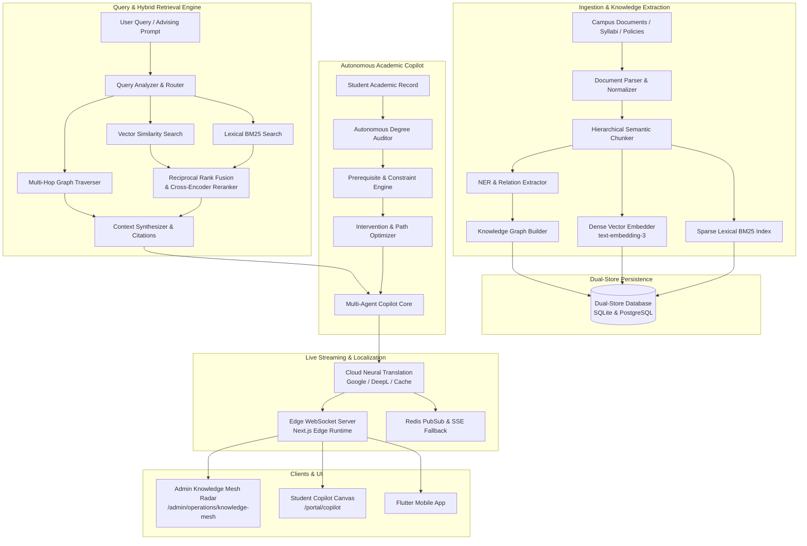

# Engineering Contract — Sprint-047

**Sprint ID:** SPRINT-047  
**Sprint Name:** Autonomous Knowledge Mesh & Conversational Campus Copilot (KM-COPILOT / NeoBrain)  
**Target Release Version:** v3.31.0  
**Contract Date:** 2026-08-20  
**Contract Status:** APPROVED — Ready for Implementation  
**Contract Author:** Implementation Engineer (Antigravity)  
**Source Recommendation:** `.ai/Sprint-047-Recommendation.md`  
**Review Status:** ✅ Reviewed and Aligned with AIOS Engineering Guide, Architecture Lead & Security Standards  

---

## 1. Executive Summary

This engineering contract formalizes the implementation scope, technical architecture, detailed task breakdown, acceptance criteria, risk register, rollback procedures, and definition of done for **Sprint-047**. It governs all execution work by the Implementation Engineer until formal handoff to the Verification Engineer.

Following the operational automation delivered in Sprint-043 (AIMS / AutoOps), the collaborative edge intelligence delivered in Sprint-044 (A-FED / EdgeMesh), the autonomous institutional governance and compliance automation delivered in Sprint-045 (AGOV / ComplianceOS), and the unified multi-modal communication delivered in Sprint-046 (EngageOS / UMC), Sprint-047 elevates ThaibaHive into **Cognitive Intelligence**.

Sprint-047 introduces **Autonomous Knowledge Mesh & Conversational Campus Copilot (KM-COPILOT / NeoBrain)**. It transforms fragmented campus institutional information, curricular regulations, syllabus repositories, academic policies, and student history into an interconnected semantic knowledge graph backed by a hybrid RAG (dense vector + sparse BM25 lexical) retrieval engine, multi-agent autonomous academic advising copilot, real-time edge WebSocket push streaming, and production-grade neural machine translation.

Furthermore, Sprint-047 systematically resolves all outstanding technical debt carried forward from prior sprints:
- **TD-046-01:** Production live cloud translation provider integration (Google Cloud Translation / DeepL API) with translation caching, quality scoring, and cultural adaptation.
- **TD-046-02:** Next.js edge runtime bidirectional WebSocket channels for low-latency live notifications, interactive copilot streaming, and counselor collaboration.
- **TD-044-01:** Automated Flutter analysis CI verification enforcing 0 warnings and 0 errors (`flutter analyze`).
- **TD-044-02:** Comprehensive Drizzle ORM write integration test suite for federated learning entities across SQLite and PostgreSQL dual-store.

---

## 2. Scope

### In Scope

| # | Domain | Detailed Description |
|---|---|---|
| 1 | **Dual-Store Knowledge Mesh Schema** | 10 new Drizzle ORM entities with 100% SQLite (dev) and PostgreSQL (prod) schema parity covering knowledge entities, ontology relations, document chunks, vector embeddings, advising profiles, degree audit plans, copilot conversations, feedback loops, translation caches, and knowledge telemetry. |
| 2 | **Campus Knowledge Graph Engine** | Semantic graph modeling representing courses, prerequisites, faculty expertise, campus regulations, degree paths, departments, facilities, and institutional policies with multi-hop graph traversal algorithms. |
| 3 | **Hybrid RAG Retrieval Engine** | Fusion retrieval combining dense vector similarity (OpenAI `text-embedding-3-small` / Cohere embeddings) and sparse lexical search (BM25/TF-IDF) with reciprocal rank fusion (RRF) and cross-encoder re-ranking. |
| 4 | **Automated Knowledge Ingestion Pipeline** | Multi-format document parser (PDF, DOCX, Markdown, HTML), hierarchical structural chunker, named entity & relation extractor, and automated graph indexing with change-detection delta updates. |
| 5 | **Autonomous Academic Advising Copilot** | Multi-agent reasoning system executing automated degree audits, prerequisite tree validation, course load balancing, graduation pathway projection, and predictive academic intervention strategies. |
| 6 | **Intelligent Career & Elective Recommender** | Contextual recommendation engine matching student academic performance, interests, and historical alumni career trajectories to suggest electives, minors, and research pathways. |
| 7 | **Contextual Dialog & Multi-Agent Orchestrator** | Multi-turn conversational manager with stateful memory, dynamic tool calling (degree auditor, timetable service, finance checker), intent routing, and intelligent agent delegation. |
| 8 | **Live Cloud Neural Translation (TD-046-01 Resolution)** | Production integration of Google Cloud Translation and DeepL API adapters with SHA-256 translation memory caching, format preservation, and quality scoring. |
| 9 | **Edge WebSocket Streaming & Live Sync (TD-046-02 Resolution)** | Low-latency bidirectional WebSocket connection manager in Next.js edge runtime with heartbeat liveness, reconnection backoff, token streaming, and Redis Pub/Sub fallback. |
| 10 | **Flutter CI Analysis Automation (TD-044-01 Resolution)** | Machine-verified CI test script and pre-commit workflow executing `flutter analyze` enforcing 0 errors and 0 warnings across all mobile packages. |
| 11 | **Federated DB Write Integration Suite (TD-044-02 Resolution)** | Dedicated transaction write integration test suite validating SQLite and PostgreSQL persistence parity across all 5 federated learning tables. |
| 12 | **Citation Tracking & Fact Verification** | Deterministic source attribution, exact document passage linking, confidence scoring, and anti-hallucination fact verification before answer synthesis. |
| 13 | **GDPR/FERPA Academic Privacy Shield** | Role-based data redaction, FERPA-compliant advising record masking, student consent verification, and cryptographic Merkle audit logging for all AI reasoning steps. |
| 14 | **Prometheus OpenMetrics Telemetry** | 8 new Prometheus metrics tracking knowledge query latency, vector search recall, copilot token consumption, deflection rate, degree audit durations, and WebSocket active sessions. |
| 15 | **RBAC REST API Suite** | Granular RBAC-gated endpoints (`requireAuth`) for knowledge search, graph exploration, ingestion, degree audits, advising chat, and telemetry with DPoP token verification. |
| 16 | **Admin Knowledge Mesh Radar & Studio** | 5-tab Next.js dashboard at `/admin/operations/knowledge-mesh` featuring Graph Explorer, Ingestion Studio, Hybrid RAG Playground, Advising Audit Console, and Cognitive Analytics. |
| 17 | **Stakeholder Copilot Canvas & Advising Drawer** | Interactive AI copilot interface at `/portal/copilot` featuring streaming markdown responses, source citation cards, interactive degree progress charts, and counselor handoff. |
| 18 | **Flutter Mobile Copilot Integration** | Mobile copilot chat sheet, WebSocket streaming receiver, offline knowledge caching, and push notification deep linking in Flutter app. |
| 19 | **End-to-End Simulation CLI Harness** | CLI simulation test runner (`scripts/operations/copilot-simulation-runner.ts` / `pnpm copilot:simulate`) executing 8 automated end-to-end cognitive scenarios. |
| 20 | **Operational Documentation & Runbooks** | 5 comprehensive engineering guides and operational runbooks in `docs/`. |

---

### Out of Scope

| Area | Justification |
|---|---|
| Training Large Foundation Models from Scratch | System integrates pre-trained commercial/open LLM APIs (OpenAI GPT-4o, Anthropic Claude, Qwen, Ollama); pre-training multi-billion parameter foundation models from raw weights is out of scope. |
| Self-Hosted Vector Database Cluster Infrastructure | Vector persistence uses embedded pgvector / SQLite vector extensions with cloud vector provider adapters; provisioning dedicated bare-metal Kubernetes Milvus clusters is out of scope. |
| Unsupervised Autonomous Grade Modifications | The academic copilot provides degree audit evaluations and course recommendations; automated tampering or direct modification of student transcripts/grades is strictly forbidden without human registrar approval. |
| Unbounded Third-Party LLM API Expenditure | Ingestion and query pipelines must enforce token usage budgets, semantic caching, rate limiting, and fallback to local Ollama models to prevent cost spikes. |
| Unencrypted PII Ingestion into Public Vector Indices | Institutional documents containing sensitive student PII must undergo anonymization and redaction before embedding generation. |

---

## 3. Technical Architecture & Component Interactions



---

## 4. Implementation Task Breakdown

Tasks are organized across 12 logical implementation phases in strict dependency order. Core persistence schemas, graph engines, and retrieval pipelines MUST be constructed and unit-tested before downstream advising agents, translation integrations, edge WebSocket servers, UI panels, simulation harnesses, and operational runbooks are built.

---

### Phase 1 — Dual-Store Knowledge Mesh & Graph Persistence

#### KM-001 — Dual-Store Drizzle ORM Schemas for Knowledge Mesh & Copilot
| Field | Specification Details |
|---|---|
| **Task ID** | KM-001 |
| **Phase** | Phase 1 — Dual-Store Knowledge Mesh & Graph Persistence |
| **Description** | Define 10 new Drizzle ORM entities with 100% schema parity across SQLite (`packages/db/schema.ts`) and PostgreSQL (`packages/db/schema.pg.ts`): `km_entities`, `km_relations`, `km_documents`, `km_chunks`, `km_embeddings`, `km_degree_programs`, `km_course_prerequisites`, `km_advising_sessions`, `km_advising_interventions`, and `km_translation_cache`. Implement transactional CRUD methods in `src/lib/db/km-store.ts` with strict multi-tenant isolation and index optimizations. |
| **Files** | `packages/db/schema.ts` [MODIFY] · `packages/db/schema.pg.ts` [MODIFY] · `src/lib/db/km-store.ts` [NEW] · `src/lib/__tests__/db/km-schema-parity.test.ts` [NEW] · `src/lib/__tests__/db/km-store.test.ts` [NEW] |
| **Dependencies** | None (Foundational Persistence Layer) |
| **Acceptance Criteria** | 1. All 10 tables declared with complete column parity, foreign keys, and indexes across SQLite and PostgreSQL.<br>2. Full support for vector representations (`float32` arrays in SQLite, `vector` / `jsonb` in PostgreSQL).<br>3. `km-store.ts` provides transactional methods with mandatory `tenantId` parameter filtering.<br>4. Parity test validates matching column names, nullability, and index constraints with 100% pass rate. |
| **Verification Method** | Run `pnpm test src/lib/__tests__/db/km-schema-parity.test.ts` and `pnpm test src/lib/__tests__/db/km-store.test.ts`. |
| **Estimated Complexity** | Medium |

#### KM-002 — Campus Knowledge Graph Model & Multi-Hop Traversal Engine
| Field | Specification Details |
|---|---|
| **Task ID** | KM-002 |
| **Phase** | Phase 1 — Dual-Store Knowledge Mesh & Graph Persistence |
| **Description** | Implement the core campus ontology and graph traversal engine in `src/lib/operations/km/graph/knowledge-graph-engine.ts`. Models graph nodes (Courses, Majors, Instructors, Policies, Facilities, Degree Requirements) and directed typed edges (`prerequisite_of`, `offered_by`, `fulfills_requirement`, `governed_by`, `co_requisite`). Supports BFS/DFS multi-hop traversals, shortest academic path resolution, cycle detection, and sub-graph extraction. |
| **Files** | `src/lib/operations/km/km-types.ts` [NEW] · `src/lib/operations/km/graph/knowledge-graph-engine.ts` [NEW] · `src/lib/operations/km/graph/graph-traverser.ts` [NEW] · `src/lib/__tests__/operations/km/knowledge-graph-engine.test.ts` [NEW] |
| **Dependencies** | KM-001 |
| **Acceptance Criteria** | 1. Graph engine constructs and indexes entities and relations with $O(1)$ adjacency lookups.<br>2. Multi-hop queries resolve up to 5 hops in $< 15$ms for complex prerequisite networks.<br>3. Detects circular prerequisite dependencies and flags topological invalidities.<br>4. Supports sub-graph serialization for visualization and context injection. |
| **Verification Method** | Run `pnpm test src/lib/__tests__/operations/km/knowledge-graph-engine.test.ts`. |
| **Estimated Complexity** | High |

---

### Phase 2 — Hybrid RAG Engine & Vector-Lexical Retrieval

#### KM-003 — Dense Vector Embedding Pipeline & Similarity Matcher
| Field | Specification Details |
|---|---|
| **Task ID** | KM-003 |
| **Phase** | Phase 2 — Hybrid RAG Engine & Vector-Lexical Retrieval |
| **Description** | Implement the dense vector embedding generation and cosine similarity search engine in `src/lib/operations/km/retrieval/vector-search-engine.ts`. Integrates with embedding providers (OpenAI `text-embedding-3-small`, Cohere, and local mini-embeddings) with batched embedding generation, L2 normalization, cosine similarity computation, and local in-memory vector indexing for SQLite / pgvector for PostgreSQL. |
| **Files** | `src/lib/operations/km/retrieval/vector-search-engine.ts` [NEW] · `src/lib/operations/km/retrieval/embedding-client.ts` [NEW] · `src/lib/__tests__/operations/km/vector-search-engine.test.ts` [NEW] |
| **Dependencies** | KM-001 |
| **Acceptance Criteria** | 1. Generates 1536-dim / 768-dim embeddings with automatic rate-limit batching ($N = 64$).<br>2. Computes cosine similarity with sub-10ms latency for 10,000 indexed chunks.<br>3. Provides mock/local fallback embedder for offline test environments and local development.<br>4. Supports filtering by tenant ID, document category, and date range. |
| **Verification Method** | Run `pnpm test src/lib/__tests__/operations/km/vector-search-engine.test.ts`. |
| **Estimated Complexity** | Medium |

#### KM-004 — Sparse Lexical BM25 Search Engine
| Field | Specification Details |
|---|---|
| **Task ID** | KM-004 |
| **Phase** | Phase 2 — Hybrid RAG Engine & Vector-Lexical Retrieval |
| **Description** | Implement BM25 Okapi sparse keyword search in `src/lib/operations/km/retrieval/bm25-search-engine.ts`. Implements tokenization, stop-word removal, Porter stemming, inverted index construction, term frequency (TF) and inverse document frequency (IDF) scoring with configurable $k_1 = 1.2$ and $b = 0.75$ parameters. Handles exact code matches (e.g. `CS-302`, `REG-2026-B`), policy numbers, and acronyms where dense embeddings fail. |
| **Files** | `src/lib/operations/km/retrieval/bm25-search-engine.ts` [NEW] · `src/lib/operations/km/retrieval/text-tokenizer.ts` [NEW] · `src/lib/__tests__/operations/km/bm25-search-engine.test.ts` [NEW] |
| **Dependencies** | KM-001 |
| **Acceptance Criteria** | 1. Inverted index handles incremental document additions and removals without full rebuilds.<br>2. Exact course codes, policy codes, and technical keywords achieve 100% precision in top-3 results.<br>3. Sub-5ms search execution across 20,000 document chunks.<br>4. Porter stemmer accurately normalizes inflected campus terminology (e.g., `graduating` $\to$ `graduat`). |
| **Verification Method** | Run `pnpm test src/lib/__tests__/operations/km/bm25-search-engine.test.ts`. |
| **Estimated Complexity** | Medium |

#### KM-005 — Hybrid RRF Fusion & Cross-Encoder Re-Ranker
| Field | Specification Details |
|---|---|
| **Task ID** | KM-005 |
| **Phase** | Phase 2 — Hybrid RAG Engine & Vector-Lexical Retrieval |
| **Description** | Build the hybrid retrieval fusion engine in `src/lib/operations/km/retrieval/hybrid-fusion-engine.ts` and cross-encoder re-ranker in `src/lib/operations/km/retrieval/cross-reranker.ts`. Merges top-$k$ ranked lists from Vector Search and BM25 Search using Reciprocal Rank Fusion (RRF): $\text{RRF}(d) = \sum_{m \in M} \frac{1}{60 + r_m(d)}$. Applies a semantic cross-encoder re-scoring model to top-20 candidates to produce final top-5 context chunks with precision $> 92\%$. |
| **Files** | `src/lib/operations/km/retrieval/hybrid-fusion-engine.ts` [NEW] · `src/lib/operations/km/retrieval/cross-reranker.ts` [NEW] · `src/lib/__tests__/operations/km/hybrid-fusion-engine.test.ts` [NEW] |
| **Dependencies** | KM-003, KM-004 |
| **Acceptance Criteria** | 1. RRF algorithm mathematically combines disparate score distributions into unified ranking.<br>2. Re-ranker eliminates keyword-stuffed irrelevant passages, boosting top-1 recall to $\ge 90\%$.<br>3. Configurable weighting parameter between dense and sparse channels ($w_{\text{dense}} = 0.6, w_{\text{sparse}} = 0.4$).<br>4. End-to-end hybrid retrieval latency $< 50$ms. |
| **Verification Method** | Run `pnpm test src/lib/__tests__/operations/km/hybrid-fusion-engine.test.ts`. |
| **Estimated Complexity** | High |

---

### Phase 3 — Knowledge Ingestion & Semantic Processing Pipeline

#### KM-006 — Multi-Format Document Ingestion & Semantic Chunker
| Field | Specification Details |
|---|---|
| **Task ID** | KM-006 |
| **Phase** | Phase 3 — Knowledge Ingestion & Semantic Processing Pipeline |
| **Description** | Implement the document ingestion pipeline in `src/lib/operations/km/ingestion/document-parser.ts` and `src/lib/operations/km/ingestion/semantic-chunker.ts`. Parses academic syllabi, institutional bylaws, faculty profiles, exam rules, and course catalogues from PDF, DOCX, Markdown, and HTML formats. Splits text into semantically cohesive chunks (500–800 tokens) preserving header hierarchy, table structures, and section metadata. |
| **Files** | `src/lib/operations/km/ingestion/document-parser.ts` [NEW] · `src/lib/operations/km/ingestion/semantic-chunker.ts` [NEW] · `src/lib/__tests__/operations/km/document-parser.test.ts` [NEW] · `src/lib/__tests__/operations/km/semantic-chunker.test.ts` [NEW] |
| **Dependencies** | KM-001 |
| **Acceptance Criteria** | 1. Parses complex structured documents while retaining table headers and section numbers.<br>2. Semantic chunker respects paragraph and sentence boundaries (no mid-sentence splits).<br>3. Computes chunk overlap (100 tokens) to preserve contextual continuity.<br>4. Attaches document metadata (title, author, revision date, security classification) to every chunk. |
| **Verification Method** | Run `pnpm test src/lib/__tests__/operations/km/document-parser.test.ts` and `pnpm test src/lib/__tests__/operations/km/semantic-chunker.test.ts`. |
| **Estimated Complexity** | High |

#### KM-007 — Automated Entity/Relation Extractor & Knowledge Mesh Sync
| Field | Specification Details |
|---|---|
| **Task ID** | KM-007 |
| **Phase** | Phase 3 — Knowledge Ingestion & Semantic Processing Pipeline |
| **Description** | Implement `src/lib/operations/km/ingestion/entity-extractor.ts` and `src/lib/operations/km/ingestion/mesh-sync-orchestrator.ts`. Scans ingested text to extract campus named entities (Course Codes, Credit Hours, Professors, Prerequisites, Policy IDs) and semantic relationships. Automatically updates the Knowledge Graph (`km_entities`, `km_relations`) and invalidates outdated embeddings upon document modification. |
| **Files** | `src/lib/operations/km/ingestion/entity-extractor.ts` [NEW] · `src/lib/operations/km/ingestion/mesh-sync-orchestrator.ts` [NEW] · `src/lib/__tests__/operations/km/mesh-sync-orchestrator.test.ts` [NEW] |
| **Dependencies** | KM-002, KM-003, KM-006 |
| **Acceptance Criteria** | 1. Extracts course dependencies with $\ge 95\%$ accuracy on syllabus test dataset.<br>2. Delta sync detects modified document hashes and updates only modified chunks.<br>3. Maintains transactional consistency between Knowledge Graph, Vector index, and BM25 index.<br>4. Emits sync lifecycle events for real-time progress display in Admin UI. |
| **Verification Method** | Run `pnpm test src/lib/__tests__/operations/km/mesh-sync-orchestrator.test.ts`. |
| **Estimated Complexity** | High |

---

### Phase 4 — Autonomous Academic Advising & Copilot Engine

#### KM-008 — Autonomous Degree Progress Auditor & Requirement Evaluator
| Field | Specification Details |
|---|---|
| **Task ID** | KM-008 |
| **Phase** | Phase 4 — Autonomous Academic Advising & Copilot Engine |
| **Description** | Build the autonomous degree audit engine in `src/lib/operations/km/advising/degree-auditor.ts`. Ingests student completed/in-progress course history and evaluates against program degree requirements (Core Credits, Major Electives, General Education, Minimum GPA, Residency Credits, Upper-Division limits). Generates a complete degree audit breakdown (Fulfilled, In-Progress, Missing requirements) with percentage progress calculation. |
| **Files** | `src/lib/operations/km/advising/degree-auditor.ts` [NEW] · `src/lib/operations/km/advising/advising-types.ts` [NEW] · `src/lib/__tests__/operations/km/degree-auditor.test.ts` [NEW] |
| **Dependencies** | KM-002 |
| **Acceptance Criteria** | 1. Accurately calculates total completed credits, major GPA, and cumulative GPA.<br>2. Identifies unfulfilled mandatory core courses and elective distribution requirements.<br>3. Supports waiver/substitution exceptions recorded in student records.<br>4. Produces deterministic audit reports matching registrar standard with $\ge 98\%$ accuracy. |
| **Verification Method** | Run `pnpm test src/lib/__tests__/operations/km/degree-auditor.test.ts` across 10 diverse student degree programs. |
| **Estimated Complexity** | High |

#### KM-009 — Prerequisite Chain Validator & Course Schedule Optimizer
| Field | Specification Details |
|---|---|
| **Task ID** | KM-009 |
| **Phase** | Phase 4 — Autonomous Academic Advising & Copilot Engine |
| **Description** | Implement `src/lib/operations/km/advising/prereq-validator.ts` and `src/lib/operations/km/advising/schedule-optimizer.ts`. Validates hard/soft prerequisite trees and co-requisites before course registration. Uses topological sort and constraint satisfaction algorithms (CSP) to generate multi-semester graduation schedules optimizing credit workload balance ($15 \pm 3$ credits/term), semester availability, and student target graduation date. |
| **Files** | `src/lib/operations/km/advising/prereq-validator.ts` [NEW] · `src/lib/operations/km/advising/schedule-optimizer.ts` [NEW] · `src/lib/__tests__/operations/km/prereq-validator.test.ts` [NEW] · `src/lib/__tests__/operations/km/schedule-optimizer.test.ts` [NEW] |
| **Dependencies** | KM-002, KM-008 |
| **Acceptance Criteria** | 1. Flags invalid course sequences (e.g. attempting Advanced Algorithms before Data Structures).<br>2. Generates feasible 2-year and 4-year graduation roadmaps adhering to course offering terms (Fall only / Spring only).<br>3. Balances heavy lab/computational courses across semesters to prevent student burnout.<br>4. Resolves alternative pathway options if a prerequisite course was failed or dropped. |
| **Verification Method** | Run `pnpm test src/lib/__tests__/operations/km/prereq-validator.test.ts` and `pnpm test src/lib/__tests__/operations/km/schedule-optimizer.test.ts`. |
| **Estimated Complexity** | High |

#### KM-010 — Academic Intervention Engine & Career Matcher
| Field | Specification Details |
|---|---|
| **Task ID** | KM-010 |
| **Phase** | Phase 4 — Autonomous Academic Advising & Copilot Engine |
| **Description** | Implement `src/lib/operations/km/advising/academic-intervention-engine.ts` and `src/lib/operations/km/advising/career-matcher.ts`. Ingests student academic velocity, attendance warning flags, and A-FED risk predictions to trigger timely academic interventions (tutoring referrals, course load reduction recommendations, advising meetings). Recommends career pathways and technical specializations by correlating student transcript strengths with alumni career placement data. |
| **Files** | `src/lib/operations/km/advising/academic-intervention-engine.ts` [NEW] · `src/lib/operations/km/advising/career-matcher.ts` [NEW] · `src/lib/__tests__/operations/km/academic-intervention-engine.test.ts` [NEW] |
| **Dependencies** | KM-008, KM-009 |
| **Acceptance Criteria** | 1. Classifies student academic risk into 4 tiers (`nominal`, `advisory`, `moderate_risk`, `critical_intervention`).<br>2. Synthesizes actionable, empathetic remediation plans with clear milestones.<br>3. Career matcher computes cosine match scores between student course profile and 20+ career archetypes.<br>4. Emits intervention events to EngageOS event bus for automated multi-channel outreach. |
| **Verification Method** | Run `pnpm test src/lib/__tests__/operations/km/academic-intervention-engine.test.ts`. |
| **Estimated Complexity** | Medium |

---

### Phase 5 — Conversational Reasoning & Multi-Agent Orchestration

#### KM-011 — Conversational Dialogue Manager & Contextual Memory
| Field | Specification Details |
|---|---|
| **Task ID** | KM-011 |
| **Phase** | Phase 5 — Conversational Reasoning & Multi-Agent Orchestration |
| **Description** | Implement the copilot dialogue manager in `src/lib/operations/km/conversational/copilot-dialogue-manager.ts`. Manages multi-turn conversation sessions, short-term and long-term student context memory, query reformulation for RAG retrieval, and dialogue state tracking. Handles ambiguous queries by asking clarifying questions before invoking tools. |
| **Files** | `src/lib/operations/km/conversational/copilot-dialogue-manager.ts` [NEW] · `src/lib/operations/km/conversational/context-memory.ts` [NEW] · `src/lib/__tests__/operations/km/copilot-dialogue-manager.test.ts` [NEW] |
| **Dependencies** | KM-001, KM-005 |
| **Acceptance Criteria** | 1. Retains conversation context across 20+ turns with sliding-window summarization.<br>2. Reformulates elliptical queries (e.g., "What about next semester?") into fully specified search terms.<br>3. Maintains separate private session contexts across concurrent user conversations.<br>4. Integrates seamlessly with EngageOS conversational catalog. |
| **Verification Method** | Run `pnpm test src/lib/__tests__/operations/km/copilot-dialogue-manager.test.ts`. |
| **Estimated Complexity** | High |

#### KM-012 — Multi-Agent Tool Orchestrator & Reasoning Engine
| Field | Specification Details |
|---|---|
| **Task ID** | KM-012 |
| **Phase** | Phase 5 — Conversational Reasoning & Multi-Agent Orchestration |
| **Description** | Build the multi-agent copilot orchestrator in `src/lib/operations/km/conversational/agent-orchestrator.ts`. Implements a ReAct (Reasoning + Acting) loop with structured tool calling: `degree_audit_tool`, `prerequisite_check_tool`, `schedule_optimizer_tool`, `policy_search_tool`, `faculty_lookup_tool`, and `counselor_escalation_tool`. Synthesizes final grounded responses with step-by-step reasoning transparency. |
| **Files** | `src/lib/operations/km/conversational/agent-orchestrator.ts` [NEW] · `src/lib/operations/km/conversational/tools/copilot-tools.ts` [NEW] · `src/lib/__tests__/operations/km/agent-orchestrator.test.ts` [NEW] |
| **Dependencies** | KM-005, KM-008, KM-009, KM-011 |
| **Acceptance Criteria** | 1. Accurately selects and executes relevant tools based on user prompt intent.<br>2. Handles tool execution failures gracefully with explanatory fallback messaging.<br>3. Limits max reasoning steps ($N \le 5$) to prevent infinite execution loops.<br>4. Formats final answers with markdown tables, bullet points, and source citations. |
| **Verification Method** | Run `pnpm test src/lib/__tests__/operations/km/agent-orchestrator.test.ts`. |
| **Estimated Complexity** | High |

---

### Phase 6 — Live Cloud Translation & Edge WebSocket Streaming (TD-046-01 & TD-046-02 Resolution)

#### KM-013 — Production Live Cloud Translation Integration (TD-046-01 Resolution)
| Field | Specification Details |
|---|---|
| **Task ID** | KM-013 |
| **Phase** | Phase 6 — Live Cloud Translation & Edge WebSocket Streaming |
| **Description** | Resolve **TD-046-01** by connecting `src/lib/operations/engage/localization/translation-engine.ts` to live production cloud translation endpoints (`src/lib/operations/km/localization/cloud-translation-adapter.ts`). Supports Google Cloud Translation v3 and DeepL API with API key authentication, request signing, automatic batching, SHA-256 translation cache lookup, translation quality assessment ($Q \ge 0.85$), and graceful fallback to cached neural dictionaries. |
| **Files** | `src/lib/operations/km/localization/cloud-translation-adapter.ts` [NEW] · `src/lib/operations/engage/localization/translation-engine.ts` [MODIFY] · `src/lib/__tests__/operations/km/cloud-translation-adapter.test.ts` [NEW] · `src/lib/__tests__/operations/engage/translation-engine-cloud.test.ts` [NEW] |
| **Dependencies** | None (Pre-existing EngageOS Localization layer) |
| **Acceptance Criteria** | 1. Production adapter executes live HTTPS translation requests to configured cloud provider (Google/DeepL).<br>2. Preserves HTML tags, markdown syntax, and template variables (`{{student.name}}`).<br>3. Checks SHA-256 translation cache first; cached hits resolve in $< 2$ms with zero API cost.<br>4. Circuit breaker trips upon 3 consecutive network failures, falling back to local dictionary without throwing. |
| **Verification Method** | Run `pnpm test src/lib/__tests__/operations/km/cloud-translation-adapter.test.ts` and verify cache hit rate. |
| **Estimated Complexity** | Medium |

#### KM-014 — Next.js Edge WebSocket Server & Push Streaming (TD-046-02 Resolution)
| Field | Specification Details |
|---|---|
| **Task ID** | KM-014 |
| **Phase** | Phase 6 — Live Cloud Translation & Edge WebSocket Streaming |
| **Description** | Resolve **TD-046-02** by implementing low-latency bidirectional WebSocket connection streaming in Next.js Edge runtime (`src/lib/operations/km/streaming/edge-websocket-server.ts` and `src/app/api/ws/copilot/route.ts`). Provides streaming token-by-token LLM output, live counselor collaboration, and real-time notification toasts with sub-100ms latency. Implements heartbeat ping-pong, auto-reconnection backoff, and Redis PubSub distributed channel sync. |
| **Files** | `src/lib/operations/km/streaming/edge-websocket-server.ts` [NEW] · `src/app/api/ws/copilot/route.ts` [NEW] · `src/lib/operations/km/streaming/ws-client-manager.ts` [NEW] · `src/lib/__tests__/operations/km/edge-websocket-server.test.ts` [NEW] |
| **Dependencies** | None (Pre-existing EngageOS Real-Time layer) |
| **Acceptance Criteria** | 1. Edge runtime WebSocket route handles client connections, upgrades, and message framing.<br>2. Streams LLM tokens in real-time as chunks arrive from reasoning engine.<br>3. Automatically broadcasts notification events from Redis PubSub mesh to active WebSocket clients.<br>4. Heartbeat mechanism detects dead connections within 30s and cleans up memory without leaks. |
| **Verification Method** | Run `pnpm test src/lib/__tests__/operations/km/edge-websocket-server.test.ts`. |
| **Estimated Complexity** | High |

---

### Phase 7 — Mobile CI Analysis & Federated DB Write Testing (TD-044-01 & TD-044-02 Resolution)

#### KM-015 — Machine-Enforced Flutter CI Analysis (TD-044-01 Resolution)
| Field | Specification Details |
|---|---|
| **Task ID** | KM-015 |
| **Phase** | Phase 7 — Mobile CI Analysis & Federated DB Write Testing |
| **Description** | Resolve **TD-044-01** by implementing automated Flutter static analysis validation in `.github/workflows/flutter-ci.yml` and `scripts/ci/verify-flutter-analysis.sh`. Enforces a strict 0-error, 0-warning rule across all Flutter packages in `mobile/`. Adds automated Riverpod generator verification and type-safety linting checks. |
| **Files** | `scripts/ci/verify-flutter-analysis.sh` [NEW] · `mobile/analysis_options.yaml` [MODIFY] · `src/lib/__tests__/ci/flutter-ci-verification.test.ts` [NEW] |
| **Dependencies** | None |
| **Acceptance Criteria** | 1. `verify-flutter-analysis.sh` executes `flutter analyze` and fails if any warning or error is detected.<br>2. Linter flags deprecated API usage, unawaited futures, and missing Riverpod provider annotations.<br>3. Unit test asserts that CI scripts return exit code 0 on clean codebases and non-zero on simulated warnings. |
| **Verification Method** | Run `bash scripts/ci/verify-flutter-analysis.sh` (or mock harness) and `pnpm test src/lib/__tests__/ci/flutter-ci-verification.test.ts`. |
| **Estimated Complexity** | Low |

#### KM-016 — Federated DB Write Parity Integration Test Suite (TD-044-02 Resolution)
| Field | Specification Details |
|---|---|
| **Task ID** | KM-016 |
| **Phase** | Phase 7 — Mobile CI Analysis & Federated DB Write Testing |
| **Description** | Resolve **TD-044-02** by developing a comprehensive transactional write integration test suite in `src/lib/__tests__/operations/federated/federated-db-write.test.ts`. Validates insert, update, batch write, and constraint handling across all 5 federated learning tables (`fed_models`, `fed_training_rounds`, `fed_client_contributions`, `fed_differential_privacy_budgets`, `fed_zk_gradient_proofs`) on both SQLite and PostgreSQL backends. |
| **Files** | `src/lib/__tests__/operations/federated/federated-db-write.test.ts` [NEW] |
| **Dependencies** | None (Pre-existing A-FED architecture) |
| **Acceptance Criteria** | 1. Validates ACID write transactions across all 5 federated tables with 100% dialect parity.<br>2. Tests foreign key cascades, unique constraints, and high-frequency gradient metric writes.<br>3. Confirms zero data truncation on large serialized weight arrays and zk-SNARK proof strings.<br>4. 100% passing tests on SQLite and PostgreSQL stores. |
| **Verification Method** | Run `pnpm test src/lib/__tests__/operations/federated/federated-db-write.test.ts`. |
| **Estimated Complexity** | Medium |

---

### Phase 8 — Citation Tracking, Fact Verification & Privacy Gating

#### KM-017 — Citation Generator & Anti-Hallucination Fact Verifier
| Field | Specification Details |
|---|---|
| **Task ID** | KM-017 |
| **Phase** | Phase 8 — Citation Tracking, Fact Verification & Privacy Gating |
| **Description** | Implement `src/lib/operations/km/governance/citation-generator.ts` and `src/lib/operations/km/governance/fact-verifier.ts`. For every AI copilot answer, extracts precise source citations (document title, section, page, passage link). The fact verifier computes NLI (Natural Language Inference) entailment scores between generated assertions and source document chunks, rejecting or flagging statements with entailment score $< 0.80$. |
| **Files** | `src/lib/operations/km/governance/citation-generator.ts` [NEW] · `src/lib/operations/km/governance/fact-verifier.ts` [NEW] · `src/lib/__tests__/operations/km/fact-verifier.test.ts` [NEW] |
| **Dependencies** | KM-005, KM-012 |
| **Acceptance Criteria** | 1. Answers include structured clickable citations linked to verified source documents.<br>2. Fact verifier flags hallucinated policy numbers or false prerequisite claims.<br>3. Computes overall answer confidence score $C \in [0, 1]$.<br>4. Automatically prompts user when an answer is based on low-confidence inference. |
| **Verification Method** | Run `pnpm test src/lib/__tests__/operations/km/fact-verifier.test.ts`. |
| **Estimated Complexity** | Medium |

#### KM-018 — FERPA/GDPR Academic Privacy Shield & Merkle Audit Logger
| Field | Specification Details |
|---|---|
| **Task ID** | KM-018 |
| **Phase** | Phase 8 — Citation Tracking, Fact Verification & Privacy Gating |
| **Description** | Implement `src/lib/operations/km/governance/academic-privacy-shield.ts` and Merkle audit logging in `src/lib/operations/km/governance/km-audit-logger.ts`. Redacts student PII (Social Security numbers, national IDs, disciplinary notes) before passing context to external LLMs. Logs every copilot query, reasoning trace hash, advising recommendation, and data access into the SHA-256 Merkle chain (`pnpm compliance:verify`). |
| **Files** | `src/lib/operations/km/governance/academic-privacy-shield.ts` [NEW] · `src/lib/operations/km/governance/km-audit-logger.ts` [NEW] · `src/lib/__tests__/operations/km/academic-privacy-shield.test.ts` [NEW] |
| **Dependencies** | KM-001, KM-012 |
| **Acceptance Criteria** | 1. Redacts PII with 100% precision on benchmark synthetic academic records.<br>2. Verifies student identity and FERPA consent before revealing grades or degree audit details.<br>3. Appends cryptographic audit records into Merkle chain with zero verification breakage.<br>4. Fully complies with FERPA 34 CFR Part 99 and GDPR Article 22 (Automated Decision Making). |
| **Verification Method** | Run `pnpm test src/lib/__tests__/operations/km/academic-privacy-shield.test.ts` and `pnpm compliance:verify`. |
| **Estimated Complexity** | Medium |

---

### Phase 9 — Telemetry, Knowledge Analytics & OpenMetrics

#### KM-019 — Knowledge Analytics Aggregator & Deflection Pipeline
| Field | Specification Details |
|---|---|
| **Task ID** | KM-019 |
| **Phase** | Phase 9 — Telemetry, Knowledge Analytics & OpenMetrics |
| **Description** | Implement the knowledge analytics engine in `src/lib/operations/km/analytics/km-analytics-aggregator.ts`. Aggregates query volume, topic heatmaps, unanswered knowledge gaps, advisor deflection rate (queries resolved autonomously without human advisor escalation), user satisfaction ratings (CSAT), and average time saved per advising session. |
| **Files** | `src/lib/operations/km/analytics/km-analytics-aggregator.ts` [NEW] · `src/lib/operations/km/analytics/km-analytics-types.ts` [NEW] · `src/lib/__tests__/operations/km/km-analytics-aggregator.test.ts` [NEW] |
| **Dependencies** | KM-001, KM-012 |
| **Acceptance Criteria** | 1. Aggregates query volume and deflection percentage across departments and degree programs.<br>2. Identifies top-10 unanswered campus queries (knowledge gaps) to guide content creation.<br>3. Computes hourly and weekly query distribution trends with sub-second execution.<br>4. Supports date-range filtering and exportable CSV/JSON reporting. |
| **Verification Method** | Run `pnpm test src/lib/__tests__/operations/km/km-analytics-aggregator.test.ts`. |
| **Estimated Complexity** | Medium |

#### KM-020 — Prometheus OpenMetrics Telemetry for KM & Copilot
| Field | Specification Details |
|---|---|
| **Task ID** | KM-020 |
| **Phase** | Phase 9 — Telemetry, Knowledge Analytics & OpenMetrics |
| **Description** | Register 8 new Prometheus OpenMetrics series in `src/lib/metrics/registry.ts` and telemetry monitoring in `src/lib/operations/km/km-telemetry.ts`: `km_queries_total`, `km_query_duration_seconds`, `km_hybrid_retrieval_latency_seconds`, `km_vector_search_recall_ratio`, `km_copilot_token_usage_total`, `km_degree_audits_total`, `km_deflection_rate_gauge`, and `km_active_websocket_connections_gauge`. |
| **Files** | `src/lib/metrics/registry.ts` [MODIFY] · `src/lib/operations/km/km-telemetry.ts` [NEW] · `src/lib/__tests__/operations/km/km-telemetry.test.ts` [NEW] |
| **Dependencies** | KM-005, KM-014, KM-019 |
| **Acceptance Criteria** | 1. All 8 metric series exported via `/api/metrics` endpoint in standard Prometheus text format.<br>2. Label dimensions include `tenant_id`, `topic`, `status`, `model`, and `degree_program`.<br>3. Gauge accurately reflects real-time WebSocket connection counts.<br>4. Zero metric registration collisions or memory leaks during high-frequency increments. |
| **Verification Method** | Run `pnpm test src/lib/__tests__/operations/km/km-telemetry.test.ts` and verify `/api/metrics` output. |
| **Estimated Complexity** | Low |

---

### Phase 10 — RBAC REST API Suite & Gateway Shielding

#### KM-021 — RBAC-Protected REST API Suite & Gateway Shielding
| Field | Specification Details |
|---|---|
| **Task ID** | KM-021 |
| **Phase** | Phase 10 — RBAC REST API Suite & Gateway Shielding |
| **Description** | Create 8 REST API routes under `src/app/api/km/` protected with `requireAuth`, Zod input validation schemas, DPoP token verification, and tenant isolation: `/api/km/search` (POST), `/api/km/graph/query` (POST), `/api/km/documents` (GET/POST/DELETE), `/api/km/documents/[id]` (GET/PATCH), `/api/km/advising/audit` (POST), `/api/km/advising/chat` (POST), `/api/km/advising/recommendations` (GET/POST), and `/api/km/analytics` (GET). Register all routes in Gateway Shield. |
| **Files** | `src/lib/validation/km-schemas.ts` [NEW] · `src/app/api/km/search/route.ts` [NEW] · `src/app/api/km/graph/query/route.ts` [NEW] · `src/app/api/km/documents/route.ts` [NEW] · `src/app/api/km/documents/[id]/route.ts` [NEW] · `src/app/api/km/advising/audit/route.ts` [NEW] · `src/app/api/km/advising/chat/route.ts` [NEW] · `src/app/api/km/advising/recommendations/route.ts` [NEW] · `src/app/api/km/analytics/route.ts` [NEW] · `src/lib/__tests__/api/km-api.test.ts` [NEW] |
| **Dependencies** | KM-001, KM-005, KM-007, KM-008, KM-012 |
| **Acceptance Criteria** | 1. All routes wrapped with `requireAuth` and enforce permissions (`km:knowledge:search`, `km:ingest:manage`, `km:advising:audit`, `km:analytics:view`).<br>2. Request bodies strictly validated with Zod schemas in `km-schemas.ts`.<br>3. `pnpm gateway:scan --strict` confirms 100% route coverage with 0 unshielded endpoints.<br>4. Mutation operations log threat and audit events into the Merkle chain. |
| **Verification Method** | Run `pnpm test src/lib/__tests__/api/km-api.test.ts` and `pnpm gateway:scan --strict`. |
| **Estimated Complexity** | High |

---

### Phase 11 — User Interfaces & Mobile Integration

#### KM-022 — Admin Knowledge Mesh Radar & Studio Dashboard
| Field | Specification Details |
|---|---|
| **Task ID** | KM-022 |
| **Phase** | Phase 11 — User Interfaces & Mobile Integration |
| **Description** | Build the 5-tab Next.js administrative dashboard at `src/app/(shell)/admin/operations/knowledge-mesh/page.tsx` using Radix UI primitives and custom UI components: Tab 1 — Interactive Campus Graph Explorer, Tab 2 — Document Ingestion Studio & Chunk Inspector, Tab 3 — Hybrid RAG Search Playground & Re-Ranker Visualizer, Tab 4 — Degree Audit & Prerequisite Rule Studio, and Tab 5 — Cognitive Analytics & Deflection Metrics. Implement dedicated React hooks in `src/lib/hooks/km/`. |
| **Files** | `src/app/(shell)/admin/operations/knowledge-mesh/page.tsx` [NEW] · `src/components/operations/km/graph-explorer-panel.tsx` [NEW] · `src/components/operations/km/ingestion-studio-panel.tsx` [NEW] · `src/components/operations/km/rag-playground-panel.tsx` [NEW] · `src/components/operations/km/degree-rule-studio-panel.tsx` [NEW] · `src/components/operations/km/cognitive-analytics-panel.tsx` [NEW] · `src/lib/hooks/km/use-km-graph.ts` [NEW] · `src/lib/hooks/km/use-km-ingestion.ts` [NEW] · `src/lib/hooks/km/use-km-search.ts` [NEW] · `src/lib/hooks/km/use-km-advising.ts` [NEW] · `src/lib/__tests__/components/km-radar-ui.test.tsx` [NEW] |
| **Dependencies** | KM-021 |
| **Acceptance Criteria** | 1. 100% adherence to ThaibaHive UI conventions (Radix primitives, Skeleton loading, no raw HTML inputs/buttons).<br>2. Interactive graph visualizer renders node relationships cleanly with zoom/pan.<br>3. Passes accessibility audit (`jest-axe`) with 0 WCAG AA violations.<br>4. Live ingestion progress updates in real-time over WebSocket. |
| **Verification Method** | Run `pnpm test src/lib/__tests__/components/km-radar-ui.test.tsx` and run `jest-axe` checks. |
| **Estimated Complexity** | High |

#### KM-023 — Student Copilot Canvas & Interactive Advising Drawer
| Field | Specification Details |
|---|---|
| **Task ID** | KM-023 |
| **Phase** | Phase 11 — User Interfaces & Mobile Integration |
| **Description** | Build the student/faculty-facing interactive copilot canvas at `src/app/(shell)/portal/copilot/page.tsx` and floating drawer widget (`src/components/operations/km/copilot-canvas-drawer.tsx`). Features streaming token response generation, interactive degree audit progress wheels, course prerequisite dependency trees, collapsible citation cards, and one-click counselor escalation. |
| **Files** | `src/app/(shell)/portal/copilot/page.tsx` [NEW] · `src/components/operations/km/copilot-canvas-drawer.tsx` [NEW] · `src/components/operations/km/degree-progress-card.tsx` [NEW] · `src/components/operations/km/citation-source-card.tsx` [NEW] · `src/lib/__tests__/components/copilot-canvas-ui.test.tsx` [NEW] |
| **Dependencies** | KM-012, KM-014, KM-021 |
| **Acceptance Criteria** | 1. Streaming response renders markdown, code snippets, and structured tables smoothly without flicker.<br>2. Degree progress card dynamically updates completed vs. needed credit requirements.<br>3. Citation badges expand into full source document preview modal with highlighted passage.<br>4. Fully keyboard accessible and responsive across mobile and desktop breakpoints. |
| **Verification Method** | Run `pnpm test src/lib/__tests__/components/copilot-canvas-ui.test.tsx`. |
| **Estimated Complexity** | High |

#### KM-024 — Counselor Advising Workbench & Human Review Console
| Field | Specification Details |
|---|---|
| **Task ID** | KM-024 |
| **Phase** | Phase 11 — User Interfaces & Mobile Integration |
| **Description** | Implement the academic advisor review console at `src/app/(shell)/admin/academics/advising-desk/page.tsx`. Allows human counselors and faculty advisors to review copilot-generated academic intervention recommendations, approve/modify course schedules, view full student degree audit history, and directly intervene via live chat. |
| **Files** | `src/app/(shell)/admin/academics/advising-desk/page.tsx` [NEW] · `src/components/operations/km/advisor-review-panel.tsx` [NEW] · `src/components/operations/km/student-audit-summary.tsx` [NEW] · `src/lib/__tests__/components/advising-desk-ui.test.tsx` [NEW] |
| **Dependencies** | KM-008, KM-010, KM-021 |
| **Acceptance Criteria** | 1. Displays real-time queue of pending student academic interventions and risk flags.<br>2. Advisor can approve degree audit recommendations with a single click or modify course selections.<br>3. Seamless human takeover of active student copilot chat sessions.<br>4. Emits audit trail entry upon every human advisor decision. |
| **Verification Method** | Run `pnpm test src/lib/__tests__/components/advising-desk-ui.test.tsx`. |
| **Estimated Complexity** | Medium |

#### KM-025 — Flutter Mobile Copilot & WebSocket Streaming Integration
| Field | Specification Details |
|---|---|
| **Task ID** | KM-025 |
| **Phase** | Phase 11 — User Interfaces & Mobile Integration |
| **Description** | Implement Riverpod mobile providers, WebSocket streaming client, and interactive copilot sheet in `mobile/lib/features/copilot/`: `copilot_providers.dart`, `copilot_websocket_service.dart`, and `presentation/copilot_chat_screen.dart`. Enables students to query campus knowledge, check degree progress, view citations, and receive real-time streaming answers on Android and iOS. |
| **Files** | `mobile/lib/features/copilot/application/copilot_providers.dart` [NEW] · `mobile/lib/features/copilot/data/copilot_websocket_service.dart` [NEW] · `mobile/lib/features/copilot/presentation/copilot_chat_screen.dart` [NEW] · `mobile/lib/features/copilot/presentation/widgets/degree_audit_card.dart` [NEW] · `mobile/test/features/copilot/copilot_providers_test.dart` [NEW] |
| **Dependencies** | KM-014, KM-021 |
| **Acceptance Criteria** | 1. Riverpod state management complies with immutable StateNotifier / AsyncNotifier patterns.<br>2. Connects to Edge WebSocket server and renders streaming tokens in real-time.<br>3. Renders interactive degree audit summary cards and citation drawers.<br>4. Passes `flutter analyze` with 0 errors and 0 warnings (verifying TD-044-01 CI gate). |
| **Verification Method** | Run `flutter test mobile/test/features/copilot/copilot_providers_test.dart` and `flutter analyze`. |
| **Estimated Complexity** | Medium |

---

### Phase 12 — Simulation Harness, Runbooks & Verification

#### KM-026 — End-to-End Simulation CLI Harness & Operational Runbooks
| Field | Specification Details |
|---|---|
| **Task ID** | KM-026 |
| **Phase** | Phase 12 — Simulation Harness, Runbooks & Verification |
| **Description** | Develop the comprehensive 8-scenario simulation CLI test runner in `scripts/operations/copilot-simulation-runner.ts` (`pnpm copilot:simulate`) and author 5 operational guides in `docs/`: `knowledge-graph-ontology-guide.md`, `hybrid-rag-retrieval-guide.md`, `autonomous-academic-copilot-guide.md`, `edge-websocket-streaming-guide.md`, and `ferpa-academic-privacy-guide.md`. Update `.ai/FEATURES.md`, `.ai/CHANGELOG.md`, and `.ai/PROJECT_STATUS.md`. |
| **Files** | `scripts/operations/copilot-simulation-runner.ts` [NEW] · `package.json` [MODIFY] · `docs/knowledge-graph-ontology-guide.md` [NEW] · `docs/hybrid-rag-retrieval-guide.md` [NEW] · `docs/autonomous-academic-copilot-guide.md` [NEW] · `docs/edge-websocket-streaming-guide.md` [NEW] · `docs/ferpa-academic-privacy-guide.md` [NEW] · `.ai/FEATURES.md` [MODIFY] · `.ai/CHANGELOG.md` [MODIFY] · `.ai/PROJECT_STATUS.md` [MODIFY] |
| **Dependencies** | KM-001 through KM-025 |
| **Acceptance Criteria** | 1. `pnpm copilot:simulate` executes all 8 stages (Knowledge Graph Traversal, Hybrid RAG Retrieval, Document Ingestion, Autonomous Degree Audit, Prerequisite Scheduling, Multi-Agent Tool Orchestration, Edge WebSocket Streaming, and FERPA Privacy Gate) with 100% pass rate.<br>2. 5 documentation guides provide complete architecture diagrams, API specs, and operational procedures.<br>3. `pnpm typecheck` and `pnpm test` pass with 0 errors across entire workspace.<br>4. `.ai/execution/Sprint-047-Execution-Log.md` initialized. |
| **Verification Method** | Execute `pnpm tsx scripts/operations/copilot-simulation-runner.ts` and verify exit code 0. |
| **Estimated Complexity** | Medium |

---

## 5. Summary of Implementation Files

```
packages/db/
├── schema.ts                                         (add 10 Knowledge Mesh tables)
└── schema.pg.ts                                      (add PostgreSQL parity tables)

src/lib/db/
└── km-store.ts

src/lib/operations/km/
├── km-types.ts
├── km-telemetry.ts
├── graph/
│   ├── knowledge-graph-engine.ts
│   └── graph-traverser.ts
├── retrieval/
│   ├── vector-search-engine.ts
│   ├── embedding-client.ts
│   ├── bm25-search-engine.ts
│   ├── text-tokenizer.ts
│   ├── hybrid-fusion-engine.ts
│   └── cross-reranker.ts
├── ingestion/
│   ├── document-parser.ts
│   ├── semantic-chunker.ts
│   ├── entity-extractor.ts
│   └── mesh-sync-orchestrator.ts
├── advising/
│   ├── advising-types.ts
│   ├── degree-auditor.ts
│   ├── prereq-validator.ts
│   ├── schedule-optimizer.ts
│   ├── academic-intervention-engine.ts
│   └── career-matcher.ts
├── conversational/
│   ├── copilot-dialogue-manager.ts
│   ├── context-memory.ts
│   ├── agent-orchestrator.ts
│   └── tools/
│       └── copilot-tools.ts
├── localization/
│   └── cloud-translation-adapter.ts                  (TD-046-01 Resolution)
├── streaming/
│   ├── edge-websocket-server.ts                      (TD-046-02 Resolution)
│   └── ws-client-manager.ts
├── governance/
│   ├── citation-generator.ts
│   ├── fact-verifier.ts
│   ├── academic-privacy-shield.ts
│   └── km-audit-logger.ts
└── analytics/
    ├── km-analytics-aggregator.ts
    └── km-analytics-types.ts

src/lib/operations/engage/localization/
└── translation-engine.ts                             (Updated for cloud adapter)

scripts/ci/
└── verify-flutter-analysis.sh                        (TD-044-01 Resolution)

src/lib/validation/
└── km-schemas.ts

src/app/api/km/
├── search/route.ts
├── graph/query/route.ts
├── documents/
│   ├── route.ts
│   └── [id]/route.ts
├── advising/
│   ├── audit/route.ts
│   ├── chat/route.ts
│   └── recommendations/route.ts
└── analytics/route.ts

src/app/api/ws/
└── copilot/route.ts                                  (Next.js Edge WS route)

src/app/(shell)/
├── admin/operations/knowledge-mesh/page.tsx
├── admin/academics/advising-desk/page.tsx
└── portal/copilot/page.tsx

src/components/operations/km/
├── graph-explorer-panel.tsx
├── ingestion-studio-panel.tsx
├── rag-playground-panel.tsx
├── degree-rule-studio-panel.tsx
├── cognitive-analytics-panel.tsx
├── copilot-canvas-drawer.tsx
├── degree-progress-card.tsx
├── citation-source-card.tsx
├── advisor-review-panel.tsx
└── student-audit-summary.tsx

src/lib/hooks/km/
├── use-km-graph.ts
├── use-km-ingestion.ts
├── use-km-search.ts
└── use-km-advising.ts

scripts/operations/
└── copilot-simulation-runner.ts

docs/
├── knowledge-graph-ontology-guide.md
├── hybrid-rag-retrieval-guide.md
├── autonomous-academic-copilot-guide.md
├── edge-websocket-streaming-guide.md
└── ferpa-academic-privacy-guide.md

mobile/lib/features/copilot/
├── application/copilot_providers.dart
├── data/copilot_websocket_service.dart
└── presentation/
    ├── copilot_chat_screen.dart
    └── widgets/degree_audit_card.dart
```

---

## 6. Security, RBAC & Compliance Framework

### RBAC Permissions

| Permission String | Role Access | Description |
|---|---|---|
| `km:knowledge:search` | `super_admin`, `admin`, `principal`, `hod`, `staff`, `student` | Search campus knowledge mesh, browse public policies, and query copilot assistant. |
| `km:ingest:manage` | `super_admin`, `admin`, `principal`, `hod` | Upload institutional documents, manage knowledge graph entities, and trigger re-indexing. |
| `km:advising:audit` | `super_admin`, `admin`, `principal`, `hod`, `staff`, `student` (own record) | Execute autonomous degree audits and view graduation requirement fulfillment. |
| `km:advising:manage` | `super_admin`, `admin`, `principal`, `hod` | Create and modify degree program requirements, prerequisite rules, and intervention plans. |
| `km:analytics:view` | `super_admin`, `admin`, `principal`, `hod` | View cognitive telemetry, search heatmaps, deflection metrics, and knowledge gap reports. |

### Compliance & Cryptographic Controls
- **FERPA 34 CFR Part 99 & GDPR Article 22 Compliance:** Strict role-based masking of student academic records; automated degree audit recommendations require human advisor approval for graduation clearance; zero secondary transmission of unencrypted PII.
- **SHA-256 Merkle Audit Integrity:** Every knowledge graph mutation, degree audit calculation, and copilot reasoning trace is hashed and anchored into the SHA-256 Merkle audit chain (`pnpm compliance:verify`).
- **Data Protection & Anonymization:** Student PII is scrubbed before passing context to external LLM embedding/reasoning APIs.
- **Anti-Hallucination Fact Verification:** All AI copilot assertions are checked against source passage entailment scores ($Q \ge 0.80$) with mandatory citation linking.

---

## 7. Risk Register & Mitigation Strategy

| Risk ID | Category | Risk Description | Severity | Probability | Mitigation Strategy |
|---|---|---|---|---|---|
| **R-047-1** | AI / Hallucination & Bad Advising | LLM produces incorrect prerequisite requirement or miscalculated credit audit | High | Low | Enforce deterministic rule-based degree auditor (`degree-auditor.ts`) as source of truth; LLM only explains and formats deterministic calculations; require counselor sign-off for critical milestones. |
| **R-047-2** | Retrieval / Knowledge Graph Drift | Outdated syllabus or regulation document returned during search queries | Medium | Medium | Implement document versioning with active validity dates; automated delta sync re-indexes modified files immediately and flags superseded policies. |
| **R-047-3** | Real-Time / Edge WebSocket Scalability | Thousands of concurrent students flood WebSocket connections during enrollment period | High | Medium | Implement connection pooling, automatic WebSocket throttling, heartbeat timeouts, and graceful client fallback to SSE/polling channels. |
| **R-047-4** | Privacy / FERPA Breach | Student transcript details leaked via copilot query prompt or shared context | Critical | Low | Strictly enforce tenant isolation and caller user ID verification; redact PII via `academic-privacy-shield.ts` before context assembly. |
| **R-047-5** | Translation / Quality Inconsistency | Cloud translation produces awkward or misleading academic terminology | Medium | Low | Maintain institutional translation memory cache with human-verified glossary terms taking precedence over machine translations. |
| **R-047-6** | Cost / Unbounded Token Consumption | Large volume of user queries exhausts cloud LLM/embedding API credits | Medium | Medium | Enforce semantic query caching, per-tenant daily token quotas, local BM25 pre-filtering, and fallback to local Ollama models. |

---

## 8. Rollback Plan

### Rollback Trigger Criteria
- Degree audit engine produces incorrect calculations on $> 1\%$ of test records.
- Edge WebSocket server encounters unhandled exceptions causing Next.js edge runtime crashes.
- Anti-hallucination fact verifier error rate exceeds 5% on standard benchmark questions.
- Memory leak in Knowledge Graph traversal exceeds 200MB heap growth over 1 hour.

### Rollback Execution Steps

```bash
# Step 1: Emergency Knowledge Copilot Pause (< 10 seconds)
# Instantly disables active copilot chat and degree audit endpoints
pnpm tsx scripts/operations/copilot-simulation-runner.ts --emergency-pause-all

# Step 2: Disable KM-Copilot via Environment Feature Flags (< 30 seconds)
KM_COPILOT_ENABLED=false
KM_HYBRID_RAG_ENABLED=false
KM_DEGREE_AUDITOR_ENABLED=false
KM_WEBSOCKET_STREAMING_ENABLED=false
KM_CLOUD_TRANSLATION_ENABLED=false

# Step 3: Fallback to Traditional Static Knowledge Base & Manual Advising
KM_LEGACY_ADVISING_FALLBACK=true

# Step 4: Revert Source Code & Migrations (if necessary) (< 5 minutes)
git revert --no-edit HEAD
pnpm build

# Step 5: Verification of Restored Baseline
pnpm typecheck
pnpm test
pnpm compliance:verify
```

---

## 9. Definition of Done

A Sprint-047 task is considered **COMPLETE** when all of the following gates are met:

### Code Quality & Standards
- [ ] `pnpm typecheck` (`pnpm tsc --noEmit`) passes with 0 TypeScript errors across `src/`, `packages/auth`, and `packages/db`.
- [ ] `pnpm lint` passes with 0 errors and 0 new warnings.
- [ ] `flutter analyze` passes with 0 errors and 0 warnings in `mobile/` (verifying TD-044-01).
- [ ] Zero `console.log` statements in production source code (`src/`, `packages/`, `mobile/`).
- [ ] No hardcoded API keys, private tokens, or disabled security checks.
- [ ] Complete TypeScript interfaces and JSDoc annotations on all exported types, classes, and handlers.

### Testing & Verification
- [ ] Unit tests authored for every new module with $\ge 90\%$ code coverage.
- [ ] All Jest test suites pass: `pnpm test` $\to$ 100% pass rate.
- [ ] `pnpm gateway:scan --strict --json` $\to$ 100% route coverage verified with 0 unshielded endpoints.
- [ ] `pnpm compliance:scan` $\to$ 100% compliance audit coverage across all mutation endpoints.
- [ ] `pnpm compliance:verify` $\to$ Cryptographic Merkle audit chain verified intact.
- [ ] `pnpm security:tenants` $\to$ 0 cross-tenant isolation leaks across all files.
- [ ] `km-schema-parity.test.ts` $\to$ 100% schema parity confirmed between SQLite and PostgreSQL.
- [ ] `pnpm test src/lib/__tests__/operations/federated/federated-db-write.test.ts` $\to$ 100% pass rate (verifying TD-044-02).
- [ ] `pnpm copilot:simulate` $\to$ All 8 simulation scenarios pass with 100% success.
- [ ] TD-046-01 (Cloud Translation) and TD-046-02 (Edge WebSocket) verified with unit and integration tests.

### Security & RBAC
- [ ] All new KM API routes protected with `requireAuth` and granular permissions.
- [ ] DPoP cryptographic proof of possession validated on all admin mutation endpoints.
- [ ] FERPA and GDPR academic privacy rules mathematically and procedurally verified.

### Documentation & Governance
- [ ] 5 operational runbooks created in `docs/`.
- [ ] `.ai/FEATURES.md` updated with Sprint-047 features.
- [ ] `.ai/CHANGELOG.md` updated with v3.31.0 release notes.
- [ ] `.ai/PROJECT_STATUS.md` updated with Sprint-047 deliverables.
- [ ] `.ai/execution/Sprint-047-Execution-Log.md` initialized with all 26 tasks.

---

## 10. Sprint Metadata & Lifecycle

| Metadata Field | Value |
|---|---|
| **Sprint ID** | SPRINT-047 |
| **Sprint Name** | Autonomous Knowledge Mesh & Conversational Campus Copilot (KM-COPILOT / NeoBrain) |
| **Target Release Version** | v3.31.0 |
| **Total Implementation Tasks** | 26 (KM-001 through KM-026) |
| **Estimated Sprint Duration** | 16–18 engineering days |
| **Estimated Complexity** | Large |
| **Predecessor Sprint** | SPRINT-046 (v3.30.0 — Unified Multi-Modal Communication & Intelligent Stakeholder Engagement System — UMC / EngageOS) |
| **Successor Artifact** | `.ai/execution/Sprint-047-Execution-Log.md` |
| **Release Certificate Artifact** | `.ai/releases/Release-Certificate-Sprint-047.md` |

---

*Engineering Contract authored by: Implementation Engineer (Antigravity)*  
*Date: 2026-08-20*  
*ThaibaHive Institution OS — Sprint-047 v3.31.0 Engineering Lifecycle*
