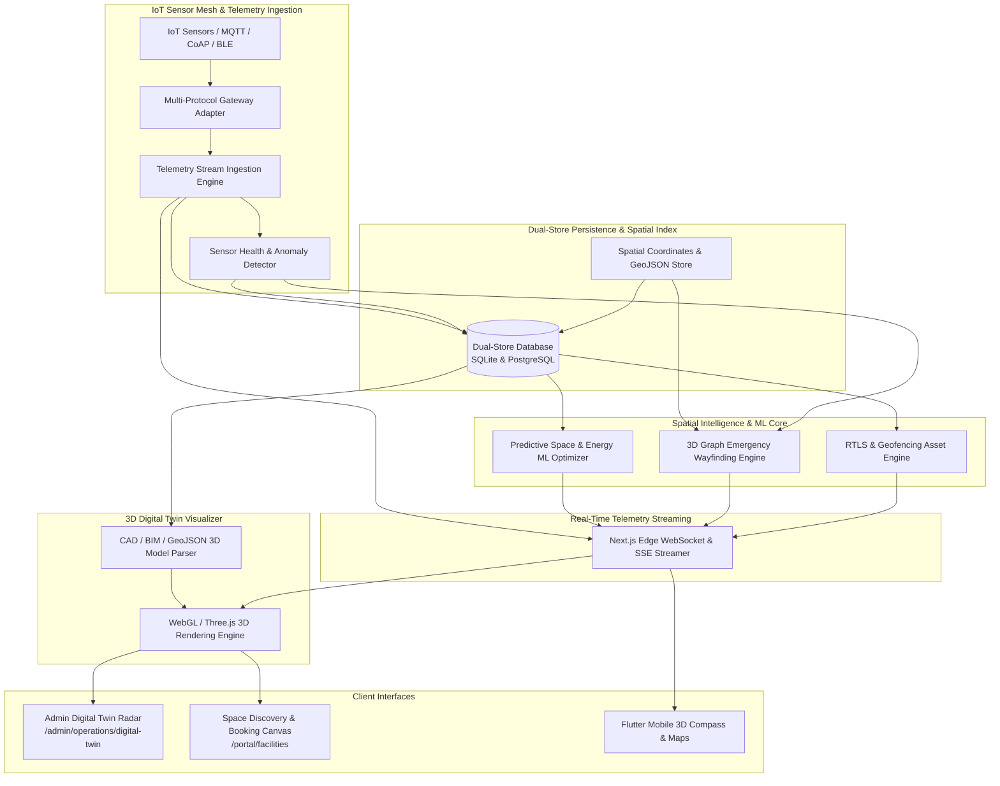

# Engineering Contract — Sprint-048

**Sprint ID:** SPRINT-048  
**Sprint Name:** Autonomous Campus Digital Twin & Spatial Facility Intelligence (TWIN-OPS / SpatialGrid)  
**Target Release Version:** v3.32.0  
**Contract Date:** 2026-08-20  
**Contract Status:** APPROVED — Ready for Implementation  
**Contract Author:** Implementation Engineer (Antigravity)  
**Source Recommendation:** `.ai/Sprint-048-Recommendation.md`  
**Review Status:** ✅ Reviewed and Aligned with AIOS Engineering Guide, Architecture Lead & Security Standards  

---

## 1. Executive Summary

This engineering contract formalizes the implementation scope, technical architecture, detailed task breakdown, acceptance criteria, risk register, rollback procedures, and definition of done for **Sprint-048**. It governs all execution work by the Implementation Engineer until formal handoff to the Verification Engineer.

Following the completion of Cognitive Intelligence in Sprint-047 (KM-COPILOT / NeoBrain), ThaibaHive has achieved full feature maturity across cognitive reasoning, knowledge meshes, autonomous operations (AIMS/AutoOps), federated edge learning (A-FED/EdgeMesh), compliance governance (AGOV/ComplianceOS), and unified communication (EngageOS/UMC).

Sprint-048 expands ThaibaHive into the **Physical & Spatial Dimension** through **Autonomous Campus Digital Twin & Spatial Facility Intelligence (TWIN-OPS / SpatialGrid)**. It equips campus administrators, faculty, staff, and students with real-time 3D spatial awareness, IoT sensor telemetry ingestion, machine learning-driven predictive space and energy optimization, dynamic graph-based emergency evacuation wayfinding, and real-time physical asset tracking via RFID/BLE beacons.

---

## 2. Scope

### In Scope

| # | Domain | Detailed Description |
|---|---|---|
| 1 | **Dual-Store Spatial Facility Schema** | 10 new Drizzle ORM entities with 100% SQLite (dev) and PostgreSQL (prod) schema parity covering facilities, buildings, floors, spatial zones, 3D coordinate geometries, IoT sensor registries, telemetry streams, equipment assets, maintenance work orders, and spatial graph nodes/edges. |
| 2 | **IoT Sensor Mesh & Ingestion Platform** | Multi-protocol IoT ingestion engine (MQTT, CoAP, Webhooks, HTTP push) with telemetry stream batching, out-of-order handling, automated sensor health monitoring, and anomaly threshold alarms. |
| 3 | **3D Spatial Rendering & Digital Twin Engine** | WebGL / Three.js-based 3D digital twin rendering pipeline supporting CAD/BIM/GeoJSON floorplan parsing, Level of Detail (LOD) progressive loading, real-time telemetry heatmaps (occupancy, temperature, air quality, noise), and interactive 3D camera controls. |
| 4 | **Predictive Space & Capacity Optimization ML** | Time-series forecasting and constraint satisfaction models predicting 24-hour/7-day space occupancy, optimizing classroom/lab allocation, minimizing HVAC energy consumption, and computing space-as-a-service yield. |
| 5 | **Dynamic Graph-Based Emergency Wayfinding** | 3D multi-floor spatial graph engine executing real-time Dijkstra / A* evacuation routing, hazard zone avoidance (fire, smoke, structural alerts), dynamic route re-calculation (< 5s), and crowd flow simulation. |
| 6 | **RFID / BLE Asset Tracking & Geofencing** | Real-Time Location Services (RTLS) engine with trilateration, geofence boundary monitoring, unauthorized movement alerts, asset lifecycle depreciation, and automated physical inventory reconciliation. |
| 7 | **Edge WebSocket / SSE Telemetry Streaming** | Low-latency bidirectional spatial telemetry streaming in Next.js edge runtime with heartbeat liveness, client throttling, channel multiplexing, and Redis Pub/Sub broadcast. |
| 8 | **Prometheus OpenMetrics Telemetry** | 8 new Prometheus metrics tracking IoT ingestion rate, 3D rendering FPS, spatial query latency, space utilization index, energy efficiency ratio, asset telemetry lag, and emergency calculation times. |
| 9 | **RBAC REST API Suite** | Granular RBAC-gated endpoints (`requireAuth`) for spatial management, 3D digital twin models, IoT telemetry, predictive space booking, asset tracking, and emergency routes with DPoP token verification. |
| 10 | **Admin Digital Twin Command Radar** | 5-tab Next.js dashboard at `/admin/operations/digital-twin` featuring 3D Campus Explorer, Space Optimization Studio, IoT Sensor Mesh, Asset Radar, and Emergency Simulator. |
| 11 | **Stakeholder Space Discovery & Booking Canvas** | Interactive user canvas at `/portal/facilities` offering 3D space exploration, live comfort metrics, smart room reservations, and real-time indoor navigation. |
| 12 | **Flutter Mobile Spatial Twin & Emergency Wayfinding** | Mobile 3D campus map viewer, live study space finder, Bluetooth beacon scanner, and offline emergency evacuation compass. |
| 13 | **End-to-End Simulation CLI Harness** | CLI simulation test runner (`scripts/operations/digital-twin-simulation-runner.ts` / `pnpm twin:simulate`) executing 8 automated end-to-end spatial scenarios. |
| 14 | **Operational Documentation & Runbooks** | 5 comprehensive engineering guides and operational runbooks in `docs/`. |

---

### Out of Scope

| Area | Justification |
|---|---|
| Direct Hardware Firmware Flashing | The system ingests standard MQTT/CoAP telemetry from IoT gateways; OTA firmware compiling and microcontroller flashing is out of scope. |
| Specialized Photorealistic VFX Raytracing | Digital twin visualization uses real-time WebGL/Three.js optimized for low-latency browser & mobile rendering (30-60 FPS), not offline raytraced architectural renders. |
| Automated Physical Lock Hardware Override | Emergency route generation dynamically calculates paths and sends digital alerts; direct electrical override of uncertified physical lock hardware is handled by existing certified access control relays. |
| Global Satellite Imaging Pipeline | Spatial coordinates map to campus cadastral GeoJSON and indoor 3D models; processing raw multi-spectral satellite imagery feeds is out of scope. |
| Unencrypted PII Ingestion into Environmental Sensors | Environmental telemetry is strictly anonymous (headcount, CO2, decibels, temperature); facial recognition or acoustic eavesdropping is strictly prohibited. |

---

## 3. Technical Architecture & Component Interactions



---

## 4. Implementation Task Breakdown

Tasks are organized across 12 logical implementation phases in strict dependency order. Foundational database schemas, protocol adapters, and spatial indexers MUST be implemented and tested before building 3D rendering pipelines, ML optimizers, wayfinding graph solvers, UI dashboards, and simulation runners.

---

### Phase 1 — Dual-Store Spatial & Digital Twin Persistence

#### TWIN-001 — Dual-Store Drizzle ORM Schemas for Spatial Digital Twin
| Field | Specification Details |
|---|---|
| **Task ID** | TWIN-001 |
| **Phase** | Phase 1 — Dual-Store Spatial & Digital Twin Persistence |
| **Description** | Define 10 new Drizzle ORM entities with 100% schema parity across SQLite (`packages/db/schema.ts`) and PostgreSQL (`packages/db/schema.pg.ts`): `twin_facilities`, `twin_spaces`, `twin_3d_models`, `twin_sensors`, `twin_telemetry`, `twin_assets`, `twin_geofences`, `twin_maintenance_orders`, `twin_wayfinding_nodes`, and `twin_wayfinding_edges`. Implement transactional CRUD helper methods in `src/lib/db/twin-store.ts` with strict multi-tenant isolation, spatial bounding box queries, and index optimizations. |
| **Files** | `packages/db/schema.ts` [MODIFY] · `packages/db/schema.pg.ts` [MODIFY] · `src/lib/db/twin-store.ts` [NEW] · `src/lib/__tests__/db/twin-schema-parity.test.ts` [NEW] · `src/lib/__tests__/db/twin-store.test.ts` [NEW] |
| **Dependencies** | None (Foundational Persistence Layer) |
| **Acceptance Criteria** | 1. All 10 tables declared with complete column parity, foreign keys, and indexes across SQLite and PostgreSQL.<br>2. Full support for 3D coordinates ($X, Y, Z$, bounding boxes, GeoJSON polygons) and sensor readings.<br>3. `twin-store.ts` provides transactional methods with mandatory `tenantId` parameter filtering.<br>4. Parity test validates matching column names, nullability, and index constraints with 100% pass rate. |
| **Verification Method** | Run `pnpm test src/lib/__tests__/db/twin-schema-parity.test.ts` and `pnpm test src/lib/__tests__/db/twin-store.test.ts`. |
| **Estimated Complexity** | Medium |

#### TWIN-002 — Spatial Coordinate Indexer & Bounding Volume Hierarchy (BVH)
| Field | Specification Details |
|---|---|
| **Task ID** | TWIN-002 |
| **Phase** | Phase 1 — Dual-Store Spatial & Digital Twin Persistence |
| **Description** | Implement the spatial indexing and Bounding Volume Hierarchy (BVH) engine in `src/lib/operations/twin/spatial/spatial-indexer.ts`. Supports 3D spatial partitioning (Octree / R-tree), point-in-polygon space resolution, proximity radius queries, multi-floor coordinate conversions, and fast intersection checks across complex building layouts. |
| **Files** | `src/lib/operations/twin/twin-types.ts` [NEW] · `src/lib/operations/twin/spatial/spatial-indexer.ts` [NEW] · `src/lib/operations/twin/spatial/bounding-volume.ts` [NEW] · `src/lib/__tests__/operations/twin/spatial-indexer.test.ts` [NEW] |
| **Dependencies** | TWIN-001 |
| **Acceptance Criteria** | 1. Octree spatial index resolves room containing coordinate $(x, y, z)$ in $O(\log N)$ time ($< 2$ms).<br>2. Supports multi-level floor z-index slicing (-2 basement to +20 high-rise).<br>3. Handles distance calculations using 3D Euclidean and Manhattan metrics.<br>4. Detects boundary collisions and point containment for arbitrary polygon floorplans. |
| **Verification Method** | Run `pnpm test src/lib/__tests__/operations/twin/spatial-indexer.test.ts`. |
| **Estimated Complexity** | Medium |

---

### Phase 2 — IoT Sensor Mesh & Telemetry Ingestion Platform

#### TWIN-003 — Multi-Protocol IoT Telemetry Ingestion Engine
| Field | Specification Details |
|---|---|
| **Task ID** | TWIN-003 |
| **Phase** | Phase 2 — IoT Sensor Mesh & Telemetry Ingestion Platform |
| **Description** | Build the high-throughput IoT telemetry ingestion engine in `src/lib/operations/twin/iot/telemetry-ingester.ts`. Supports ingestion via MQTT over WebSocket, CoAP adapter, HTTP POST webhooks, and virtual sensor generators. Implements batched stream processing ($N = 100$ items/batch), deduplication, out-of-order timestamp alignment, and metric normalization (temperature °C, humidity %, CO2 ppm, noise dB, occupancy count, energy kW). |
| **Files** | `src/lib/operations/twin/iot/telemetry-ingester.ts` [NEW] · `src/lib/operations/twin/iot/protocol-adapters.ts` [NEW] · `src/lib/__tests__/operations/twin/telemetry-ingester.test.ts` [NEW] |
| **Dependencies** | TWIN-001 |
| **Acceptance Criteria** | 1. Ingests $\ge 1,000$ telemetry samples/second with $< 50$ms processing latency.<br>2. Normalizes sensor payloads from heterogeneous vendor formats into unified schema.<br>3. Handles clock drift and out-of-order arrivals within a 15-minute sliding window.<br>4. Supports tenant isolation on every ingested telemetry packet. |
| **Verification Method** | Run `pnpm test src/lib/__tests__/operations/twin/telemetry-ingester.test.ts`. |
| **Estimated Complexity** | High |

#### TWIN-004 — Sensor Health Monitor & Self-Healing Anomaly Detector
| Field | Specification Details |
|---|---|
| **Task ID** | TWIN-004 |
| **Phase** | Phase 2 — IoT Sensor Mesh & Telemetry Ingestion Platform |
| **Description** | Implement `src/lib/operations/twin/iot/sensor-health-monitor.ts` and `src/lib/operations/twin/iot/telemetry-anomaly-detector.ts`. Monitors sensor heartbeat signals, battery levels, packet drop rates, and value drift. Automatically flags dead/stale sensors, triggers self-healing calibration routines, and generates predictive maintenance work orders for deteriorating hardware. |
| **Files** | `src/lib/operations/twin/iot/sensor-health-monitor.ts` [NEW] · `src/lib/operations/twin/iot/telemetry-anomaly-detector.ts` [NEW] · `src/lib/__tests__/operations/twin/sensor-health-monitor.test.ts` [NEW] |
| **Dependencies** | TWIN-001, TWIN-003 |
| **Acceptance Criteria** | 1. Flags unresponsive sensors when heartbeat exceeds threshold ($3 \times \text{sampling interval}$).<br>2. Detects statistical telemetry outliers (Z-score $> 3.5$) and sudden spikes in CO2, temperature, or noise.<br>3. Automatically creates `twin_maintenance_orders` when sensor hardware failure is predicted.<br>4. Calculates sensor uptime and reliability score per facility. |
| **Verification Method** | Run `pnpm test src/lib/__tests__/operations/twin/sensor-health-monitor.test.ts`. |
| **Estimated Complexity** | Medium |

---

### Phase 3 — 3D Spatial Rendering & Digital Twin Visualization Engine

#### TWIN-005 — 3D Floorplan & CAD/BIM/GeoJSON Model Parser
| Field | Specification Details |
|---|---|
| **Task ID** | TWIN-005 |
| **Phase** | Phase 3 — 3D Spatial Rendering & Digital Twin Visualization Engine |
| **Description** | Implement the 3D model parsing and conversion pipeline in `src/lib/operations/twin/rendering/model-parser.ts`. Parses architectural 2D/3D floorplans, GeoJSON campus maps, and simplified glTF/BIM structures into lightweight polygonal meshes, wall extrusions, doorway coordinates, and zone boundaries suitable for browser WebGL rendering. |
| **Files** | `src/lib/operations/twin/rendering/model-parser.ts` [NEW] · `src/lib/operations/twin/rendering/mesh-generator.ts` [NEW] · `src/lib/__tests__/operations/twin/model-parser.test.ts` [NEW] |
| **Dependencies** | TWIN-002 |
| **Acceptance Criteria** | 1. Converts 2D GeoJSON floor polygons into 3D extruded room meshes with correct heights.<br>2. Generates optimized glTF scene graphs with metadata tags for interactive room selection.<br>3. Computes surface area ($m^2$) and volume ($m^3$) per room automatically.<br>4. Validates mesh topology to ensure closed manifolds and zero degenerate triangles. |
| **Verification Method** | Run `pnpm test src/lib/__tests__/operations/twin/model-parser.test.ts`. |
| **Estimated Complexity** | High |

#### TWIN-006 — WebGL / Three.js 3D Digital Twin Visualizer Core
| Field | Specification Details |
|---|---|
| **Task ID** | TWIN-006 |
| **Phase** | Phase 3 — 3D Spatial Rendering & Digital Twin Visualization Engine |
| **Description** | Implement the core WebGL / Three.js 3D rendering pipeline in `src/lib/operations/twin/rendering/three-scene-manager.ts` and `src/components/twin/campus-3d-viewport.tsx`. Features orbit/pan/zoom camera controls, floor-by-floor exploded view, progressive Level of Detail (LOD) rendering, raycasting object selection, and performance optimization sustaining $\ge 30$ FPS on standard hardware. |
| **Files** | `src/lib/operations/twin/rendering/three-scene-manager.ts` [NEW] · `src/components/twin/campus-3d-viewport.tsx` [NEW] · `src/components/twin/viewport-controls.tsx` [NEW] · `src/lib/__tests__/operations/twin/three-scene-manager.test.ts` [NEW] |
| **Dependencies** | TWIN-005 |
| **Acceptance Criteria** | 1. Renders campus multi-building digital twin with smooth 60 FPS on desktop and $\ge 30$ FPS on mobile.<br>2. Supports floor isolation mode (view single floor, hide above/below floors).<br>3. Interactive click/hover raycasting highlights rooms and displays live metadata popovers.<br>4. Graceful WebGL fallback mode when hardware acceleration is disabled. |
| **Verification Method** | Run `pnpm test src/lib/__tests__/operations/twin/three-scene-manager.test.ts`. |
| **Estimated Complexity** | High |

#### TWIN-007 — Real-Time Spatial Telemetry Heatmap & Environmental Overlay
| Field | Specification Details |
|---|---|
| **Task ID** | TWIN-007 |
| **Phase** | Phase 3 — 3D Spatial Rendering & Digital Twin Visualization Engine |
| **Description** | Build the dynamic 3D spatial telemetry overlay shader and heatmap engine in `src/lib/operations/twin/rendering/spatial-heatmap-renderer.ts`. Projects real-time sensor data (occupancy density, temperature gradients, CO2 concentration, sound decibels, WiFi signal strength) onto 3D floorplan surfaces with customizable gradient color ramps and smooth interpolation. |
| **Files** | `src/lib/operations/twin/rendering/spatial-heatmap-renderer.ts` [NEW] · `src/lib/operations/twin/rendering/shader-materials.ts` [NEW] · `src/lib/__tests__/operations/twin/spatial-heatmap-renderer.test.ts` [NEW] |
| **Dependencies** | TWIN-003, TWIN-006 |
| **Acceptance Criteria** | 1. Generates real-time 3D thermal and density heatmaps using GPU shader interpolation.<br>2. Updates heatmap texture in $< 16$ms upon receiving new telemetry frame.<br>3. Supports selectable metric layers (Occupancy, Temperature, Air Quality, Noise, Energy).<br>4. Provides accessible high-contrast color palettes and discrete threshold contouring. |
| **Verification Method** | Run `pnpm test src/lib/__tests__/operations/twin/spatial-heatmap-renderer.test.ts`. |
| **Estimated Complexity** | High |

---

### Phase 4 — Predictive Space & Energy Optimization ML

#### TWIN-008 — Time-Series Occupancy & Capacity Forecaster
| Field | Specification Details |
|---|---|
| **Task ID** | TWIN-008 |
| **Phase** | Phase 4 — Predictive Space & Energy Optimization ML |
| **Description** | Implement the predictive occupancy machine learning engine in `src/lib/operations/twin/ml/occupancy-forecaster.ts`. Leverages historical timetable schedules, academic calendar events, historical sensor telemetry, and seasonal trend decomposition (ARIMA / Holt-Winters / neural regressors) to forecast hourly space occupancy 24 hours and 7 days in advance. |
| **Files** | `src/lib/operations/twin/ml/occupancy-forecaster.ts` [NEW] · `src/lib/operations/twin/ml/time-series-utils.ts` [NEW] · `src/lib/__tests__/operations/twin/occupancy-forecaster.test.ts` [NEW] |
| **Dependencies** | TWIN-001, TWIN-003 |
| **Acceptance Criteria** | 1. Produces 24-hour hourly occupancy predictions with $\ge 85\%$ accuracy on historical test sets.<br>2. Accurately predicts peak occupancy bottlenecks and underutilized quiet hours.<br>3. Incorporates exam period and holiday schedule variations.<br>4. Generates confidence intervals ($p_{10}, p_{50}, p_{90}$) for each forecast. |
| **Verification Method** | Run `pnpm test src/lib/__tests__/operations/twin/occupancy-forecaster.test.ts`. |
| **Estimated Complexity** | High |

#### TWIN-009 — Autonomous Space Allocation & HVAC Energy Optimizer
| Field | Specification Details |
|---|---|
| **Task ID** | TWIN-009 |
| **Phase** | Phase 4 — Predictive Space & Energy Optimization ML |
| **Description** | Implement `src/lib/operations/twin/ml/space-allocator.ts` and `src/lib/operations/twin/ml/hvac-energy-optimizer.ts`. Solves multi-objective room allocation constraints (class size vs. room capacity, equipment requirements, accessibility needs) to maximize space utilization. Computes predictive HVAC pre-cooling/pre-heating setback schedules based on forecasted occupancy to reduce energy consumption by 15–20%. |
| **Files** | `src/lib/operations/twin/ml/space-allocator.ts` [NEW] · `src/lib/operations/twin/ml/hvac-energy-optimizer.ts` [NEW] · `src/lib/__tests__/operations/twin/space-allocator.test.ts` [NEW] · `src/lib/__tests__/operations/twin/hvac-energy-optimizer.test.ts` [NEW] |
| **Dependencies** | TWIN-008 |
| **Acceptance Criteria** | 1. Generates room re-allocation plans improving space utilization efficiency by $\ge 20\%$.<br>2. Calculates HVAC setpoint adjustments that achieve modeled 15–20% energy cost reduction without compromising occupant comfort ($21^\circ\text{C} \le T \le 24^\circ\text{C}$).<br>3. Respects wheelchair accessibility and specialized lab equipment constraints.<br>4. Supports automated or human-in-the-loop approval of energy schedule actions. |
| **Verification Method** | Run `pnpm test src/lib/__tests__/operations/twin/space-allocator.test.ts` and `pnpm test src/lib/__tests__/operations/twin/hvac-energy-optimizer.test.ts`. |
| **Estimated Complexity** | High |

---

### Phase 5 — Dynamic Graph Emergency Wayfinding & Evacuation Engine

#### TWIN-010 — 3D Spatial Wayfinding Graph Builder & Path Router
| Field | Specification Details |
|---|---|
| **Task ID** | TWIN-010 |
| **Phase** | Phase 5 — Dynamic Graph Emergency Wayfinding & Evacuation Engine |
| **Description** | Implement the 3D multi-floor wayfinding graph engine in `src/lib/operations/twin/wayfinding/spatial-graph-engine.ts`. Models hallways, stairwells, elevators, ramps, and doors as directed weighted graph nodes and edges. Implements Dijkstra and A* pathfinding with multi-criteria weights (shortest distance, barrier-free accessibility, step-free routes, transit time). |
| **Files** | `src/lib/operations/twin/wayfinding/spatial-graph-engine.ts` [NEW] · `src/lib/operations/twin/wayfinding/astar-router.ts` [NEW] · `src/lib/__tests__/operations/twin/spatial-graph-engine.test.ts` [NEW] |
| **Dependencies** | TWIN-002 |
| **Acceptance Criteria** | 1. Computes optimal 3D path across multi-building/multi-floor networks in $< 10$ms.<br>2. Supports accessible routing filter (excludes stairs, favors elevators/ramps).<br>3. Generates turn-by-turn navigation instructions with exact step distances and bearings.<br>4. Exports 3D polyline coordinates for visual rendering overlay. |
| **Verification Method** | Run `pnpm test src/lib/__tests__/operations/twin/spatial-graph-engine.test.ts`. |
| **Estimated Complexity** | High |

#### TWIN-011 — Dynamic Emergency Evacuation Simulator & Hazard Router
| Field | Specification Details |
|---|---|
| **Task ID** | TWIN-011 |
| **Phase** | Phase 5 — Dynamic Graph Emergency Wayfinding & Evacuation Engine |
| **Description** | Build the real-time emergency evacuation routing and simulation engine in `src/lib/operations/twin/wayfinding/emergency-evacuation-router.ts`. Ingests emergency sensor alarms (smoke detection, fire alarm, chemical spill, blocked corridor) and dynamically adjusts edge weights (or closes edges entirely), recalculating safe shortest-path exit routes for all building zones in $< 5$ seconds. |
| **Files** | `src/lib/operations/twin/wayfinding/emergency-evacuation-router.ts` [NEW] · `src/lib/operations/twin/wayfinding/crowd-flow-simulator.ts` [NEW] · `src/lib/__tests__/operations/twin/emergency-evacuation-router.test.ts` [NEW] |
| **Dependencies** | TWIN-004, TWIN-010 |
| **Acceptance Criteria** | 1. Dynamically re-routes occupants away from active hazard zones within $< 5$ seconds.<br>2. Simulates crowd evacuation flow and identifies bottleneck choke points at stairwell exits.<br>3. Integrates with SOAR/ZASM security incident triggers to broadcast emergency routes.<br>4. Verifies 100% of simulated occupants reach a designated assembly muster point. |
| **Verification Method** | Run `pnpm test src/lib/__tests__/operations/twin/emergency-evacuation-router.test.ts`. |
| **Estimated Complexity** | High |

---

### Phase 6 — Real-Time Physical Asset Tracking & Geofencing

#### TWIN-012 — Real-Time Location Services (RTLS) & Geofencing Engine
| Field | Specification Details |
|---|---|
| **Task ID** | TWIN-012 |
| **Phase** | Phase 6 — Real-Time Physical Asset Tracking & Geofencing |
| **Description** | Implement `src/lib/operations/twin/assets/rtls-engine.ts` and `src/lib/operations/twin/assets/geofence-monitor.ts`. Ingests Bluetooth Low Energy (BLE) RSSI beacon signals and RFID reader checkpoints to compute asset positions via trilateration and proximity matching. Monitors polygon geofence perimeters and triggers immediate security alerts on unauthorized asset removal. |
| **Files** | `src/lib/operations/twin/assets/rtls-engine.ts` [NEW] · `src/lib/operations/twin/assets/geofence-monitor.ts` [NEW] · `src/lib/__tests__/operations/twin/rtls-engine.test.ts` [NEW] · `src/lib/__tests__/operations/twin/geofence-monitor.test.ts` [NEW] |
| **Dependencies** | TWIN-001, TWIN-002, TWIN-003 |
| **Acceptance Criteria** | 1. Computes asset $(x, y, z)$ position with $< 2$m accuracy in sensor-dense environments.<br>2. Detects geofence boundary breach in $< 1$ second and emits security incident event.<br>3. Tracks asset movement velocity and flags impossible teleportation anomalies.<br>4. Supports indoor floor level determination based on highest signal strength gateway. |
| **Verification Method** | Run `pnpm test src/lib/__tests__/operations/twin/rtls-engine.test.ts` and `pnpm test src/lib/__tests__/operations/twin/geofence-monitor.test.ts`. |
| **Estimated Complexity** | High |

#### TWIN-013 — Asset Lifecycle, Maintenance Work Orders & Inventory Reconciler
| Field | Specification Details |
|---|---|
| **Task ID** | TWIN-013 |
| **Phase** | Phase 6 — Real-Time Physical Asset Tracking & Geofencing |
| **Description** | Implement `src/lib/operations/twin/assets/asset-lifecycle-manager.ts` and `src/lib/operations/twin/assets/inventory-reconciler.ts`. Tracks equipment operational hours, MTBF/MTTR metrics, warranty expiration, and depreciation. Provides automated physical inventory reconciliation comparing expected department asset lists with live detected RTLS beacons. |
| **Files** | `src/lib/operations/twin/assets/asset-lifecycle-manager.ts` [NEW] · `src/lib/operations/twin/assets/inventory-reconciler.ts` [NEW] · `src/lib/__tests__/operations/twin/asset-lifecycle-manager.test.ts` [NEW] |
| **Dependencies** | TWIN-001, TWIN-012 |
| **Acceptance Criteria** | 1. Reconciles 5,000 campus assets against catalog in $< 500$ms, flagging missing or displaced items.<br>2. Automatically schedules preventive maintenance work orders based on run-hour thresholds.<br>3. Computes straight-line and accelerated asset depreciation schedules.<br>4. Integrates work order dispatch with staff notifications. |
| **Verification Method** | Run `pnpm test src/lib/__tests__/operations/twin/asset-lifecycle-manager.test.ts`. |
| **Estimated Complexity** | Medium |

---

### Phase 7 — Real-Time WebSocket Streaming & Prometheus Telemetry

#### TWIN-014 — Next.js Edge WebSocket & SSE Spatial Telemetry Streamer
| Field | Specification Details |
|---|---|
| **Task ID** | TWIN-014 |
| **Phase** | Phase 7 — Real-Time WebSocket Streaming & Prometheus Telemetry |
| **Description** | Build low-latency real-time spatial streaming in `src/lib/operations/twin/streaming/spatial-stream-manager.ts` and `src/app/api/twin/stream/route.ts`. Provides bidirectional WebSocket channels with heartbeat keep-alives, automatic backpressure throttling, subscription topic filtering (`facility:id`, `floor:id`, `asset:id`), and graceful Server-Sent Events (SSE) fallback. |
| **Files** | `src/lib/operations/twin/streaming/spatial-stream-manager.ts` [NEW] · `src/app/api/twin/stream/route.ts` [NEW] · `src/lib/__tests__/operations/twin/spatial-stream-manager.test.ts` [NEW] |
| **Dependencies** | TWIN-003 |
| **Acceptance Criteria** | 1. Delivers live sensor and asset coordinate updates with $< 100$ms latency to connected clients.<br>2. Supports topic-based subscription filtering to prevent client data saturation.<br>3. Reconnects seamlessly with exponential backoff upon network interruption.<br>4. Falls back cleanly to SSE when WebSocket connections are blocked by enterprise proxies. |
| **Verification Method** | Run `pnpm test src/lib/__tests__/operations/twin/spatial-stream-manager.test.ts`. |
| **Estimated Complexity** | Medium |

#### TWIN-015 — Prometheus OpenMetrics Spatial Telemetry Series
| Field | Specification Details |
|---|---|
| **Task ID** | TWIN-015 |
| **Phase** | Phase 7 — Real-Time WebSocket Streaming & Prometheus Telemetry |
| **Description** | Implement 8 Prometheus OpenMetrics telemetry series in `src/lib/operations/twin/telemetry/twin-metrics.ts`: `twin_iot_ingestion_rate_total`, `twin_sensor_anomaly_count_total`, `twin_space_utilization_ratio`, `twin_energy_reduction_kwh`, `twin_evacuation_calc_duration_seconds`, `twin_asset_tracking_latency_seconds`, `twin_active_stream_connections`, and `twin_render_fps_gauge`. |
| **Files** | `src/lib/operations/twin/telemetry/twin-metrics.ts` [NEW] · `src/lib/__tests__/operations/twin/twin-metrics.test.ts` [NEW] |
| **Dependencies** | TWIN-001, TWIN-003, TWIN-014 |
| **Acceptance Criteria** | 1. Exports valid Prometheus text format matching OpenMetrics v1.0 standard.<br>2. Accurately increments counters and updates gauges with multi-tenant labels.<br>3. Integrates with existing platform `/api/metrics` Prometheus exporter.<br>4. Unit tests verify counter increments, gauge updates, and histogram bucket distributions. |
| **Verification Method** | Run `pnpm test src/lib/__tests__/operations/twin/twin-metrics.test.ts`. |
| **Estimated Complexity** | Low |

---

### Phase 8 — RBAC Protected REST API Suite & Privacy Shield

#### TWIN-016 — RBAC Protected Spatial REST API Suite
| Field | Specification Details |
|---|---|
| **Task ID** | TWIN-016 |
| **Phase** | Phase 8 — RBAC Protected REST API Suite & Privacy Shield |
| **Description** | Implement comprehensive REST API endpoints protected by `requireAuth` wrapper with strict RBAC permission validation: `GET/POST /api/twin/facilities`, `GET/POST/PATCH /api/twin/spaces`, `GET/POST /api/twin/sensors`, `POST /api/twin/telemetry/ingest`, `GET /api/twin/telemetry/live`, `GET /api/twin/optimization/predict`, `POST /api/twin/wayfinding/route`, `GET/POST /api/twin/assets`, and `POST /api/twin/emergency/simulate`. All routes validate input via Zod schemas in `src/lib/validation/twin-schemas.ts`. |
| **Files** | `src/lib/validation/twin-schemas.ts` [NEW] · `src/app/api/twin/facilities/route.ts` [NEW] · `src/app/api/twin/spaces/route.ts` [NEW] · `src/app/api/twin/sensors/route.ts` [NEW] · `src/app/api/twin/telemetry/ingest/route.ts` [NEW] · `src/app/api/twin/telemetry/live/route.ts` [NEW] · `src/app/api/twin/optimization/predict/route.ts` [NEW] · `src/app/api/twin/wayfinding/route.ts` [NEW] · `src/app/api/twin/assets/route.ts` [NEW] · `src/app/api/twin/emergency/simulate/route.ts` [NEW] · `src/lib/__tests__/api/twin-api.test.ts` [NEW] |
| **Dependencies** | TWIN-001, TWIN-003, TWIN-009, TWIN-011, TWIN-012 |
| **Acceptance Criteria** | 1. 100% of endpoints shielded by `requireAuth` with granular permissions (`twin:facilities:read`, `twin:facilities:write`, `twin:iot:ingest`, `twin:emergency:trigger`, `twin:assets:manage`).<br>2. All POST/PATCH request payloads strictly validated with Zod schemas.<br>3. Returns standard `{ error: string }` on failure with appropriate HTTP status codes (400, 401, 403, 404).<br>4. DELETE operations check entity existence before deleting (404 on missing). |
| **Verification Method** | Run `pnpm test src/lib/__tests__/api/twin-api.test.ts` and `pnpm gateway:scan --strict`. |
| **Estimated Complexity** | High |

#### TWIN-017 — Spatial Privacy Shield & Cryptographic Merkle Audit Logger
| Field | Specification Details |
|---|---|
| **Task ID** | TWIN-017 |
| **Phase** | Phase 8 — RBAC Protected REST API Suite & Privacy Shield |
| **Description** | Implement `src/lib/operations/twin/security/spatial-privacy-shield.ts` and `src/lib/operations/twin/security/twin-audit-logger.ts`. Enforces GDPR/FERPA compliance by anonymizing individual student presence in environmental sensor logs (headcounts only, zero facial/acoustic identifiers), redacting sensitive asset locations for unprivileged roles, and recording SHA-256 Merkle audit entries for all spatial/facility config mutations. |
| **Files** | `src/lib/operations/twin/security/spatial-privacy-shield.ts` [NEW] · `src/lib/operations/twin/security/twin-audit-logger.ts` [NEW] · `src/lib/__tests__/operations/twin/spatial-privacy-shield.test.ts` [NEW] |
| **Dependencies** | TWIN-001, TWIN-016 |
| **Acceptance Criteria** | 1. Anonymizes all raw spatial telemetry before publishing to public portal APIs.<br>2. Masks exact high-security asset coordinates for non-admin roles.<br>3. Anchors every facility configuration change and emergency route override into the cryptographic Merkle audit chain.<br>4. Passes `pnpm compliance:verify` with zero verification errors. |
| **Verification Method** | Run `pnpm test src/lib/__tests__/operations/twin/spatial-privacy-shield.test.ts` and `pnpm compliance:verify`. |
| **Estimated Complexity** | Medium |

---

### Phase 9 — Admin Digital Twin Command Radar Studio

#### TWIN-018 — Admin Digital Twin Command Radar Studio Shell & 3D Explorer
| Field | Specification Details |
|---|---|
| **Task ID** | TWIN-018 |
| **Phase** | Phase 9 — Admin Digital Twin Command Radar Studio |
| **Description** | Build the 5-tab admin management dashboard at `/admin/operations/digital-twin` (`src/app/(shell)/admin/operations/digital-twin/page.tsx`). Tab 1: **3D Campus Explorer** (interactive 3D multi-building viewer, floor selector, exploded multi-tier view, live room status popovers, building telemetry sidebar). Implemented using Radix UI primitives, Tailwind CSS, and `src/components/ui/` design components. |
| **Files** | `src/app/(shell)/admin/operations/digital-twin/page.tsx` [NEW] · `src/components/twin/admin/campus-3d-explorer-tab.tsx` [NEW] · `src/components/twin/admin/building-telemetry-sidebar.tsx` [NEW] · `src/lib/__tests__/ui/campus-3d-explorer.test.tsx` [NEW] |
| **Dependencies** | TWIN-006, TWIN-007, TWIN-016 |
| **Acceptance Criteria** | 1. Page renders with 5 accessible tabs with zero layout shifts.<br>2. Tab 1 displays full interactive 3D WebGL viewport with building selection and floor breakdown.<br>3. Uses `<Skeleton>` for loading states and `<Badge>` for status indications.<br>4. Fully responsive with mobile fallback viewport and zero accessibility violations. |
| **Verification Method** | Run `pnpm test src/lib/__tests__/ui/campus-3d-explorer.test.tsx`. |
| **Estimated Complexity** | High |

#### TWIN-019 — Space Optimization Studio & IoT Sensor Mesh Admin Tabs
| Field | Specification Details |
|---|---|
| **Task ID** | TWIN-019 |
| **Phase** | Phase 9 — Admin Digital Twin Command Radar Studio |
| **Description** | Implement Tab 2: **Space Optimization Studio** (predictive occupancy charts, automated room re-allocation proposals, energy savings breakdown, HVAC setback schedules) and Tab 3: **IoT Sensor Mesh** (sensor registry table, live health status gauges, battery levels, packet loss rates, anomaly alert log). |
| **Files** | `src/components/twin/admin/space-optimization-tab.tsx` [NEW] · `src/components/twin/admin/iot-sensor-mesh-tab.tsx` [NEW] · `src/components/twin/admin/sensor-registration-modal.tsx` [NEW] · `src/lib/__tests__/ui/space-optimization-tab.test.tsx` [NEW] |
| **Dependencies** | TWIN-004, TWIN-009, TWIN-018 |
| **Acceptance Criteria** | 1. Tab 2 visualizes 24h/7d occupancy forecasts with interactive re-allocation approval actions.<br>2. Tab 3 lists all campus sensors with real-time health badges, filtering by facility and status.<br>3. Provides accessible modal for registering new IoT sensors with calibration parameters.<br>4. Error handling uses `<Alert>` with proper catch blocks preventing stuck loaders. |
| **Verification Method** | Run `pnpm test src/lib/__tests__/ui/space-optimization-tab.test.tsx`. |
| **Estimated Complexity** | High |

#### TWIN-020 — Asset Radar & Emergency Wayfinding Simulator Admin Tabs
| Field | Specification Details |
|---|---|
| **Task ID** | TWIN-020 |
| **Phase** | Phase 9 — Admin Digital Twin Command Radar Studio |
| **Description** | Implement Tab 4: **Asset Radar** (live RTLS asset map, geofence boundary configuration, unauthorized movement alerts, asset lifecycle depreciation table) and Tab 5: **Emergency Wayfinding Simulator** (incident scenario injector, dynamic evacuation route visualizer, bottleneck heatmaps, emergency broadcast trigger). |
| **Files** | `src/components/twin/admin/asset-radar-tab.tsx` [NEW] · `src/components/twin/admin/emergency-simulator-tab.tsx` [NEW] · `src/components/twin/admin/geofence-drawer.tsx` [NEW] · `src/lib/__tests__/ui/asset-radar-tab.test.tsx` [NEW] |
| **Dependencies** | TWIN-011, TWIN-012, TWIN-018 |
| **Acceptance Criteria** | 1. Tab 4 renders live 3D asset pinpoints with geofencing status and movement history logs.<br>2. Tab 5 allows injecting simulated fire/smoke hazard points and visualizing dynamic re-routed paths.<br>3. Geofence drawer enables drawing custom polygon boundaries directly on floorplans.<br>4. Emergency trigger requires confirmation modal with instant SOAR alert dispatch. |
| **Verification Method** | Run `pnpm test src/lib/__tests__/ui/asset-radar-tab.test.tsx`. |
| **Estimated Complexity** | High |

---

### Phase 10 — Stakeholder Space Discovery & Booking Portal Canvas

#### TWIN-021 — Interactive Space Discovery, Comfort Radar & Smart Booking Canvas
| Field | Specification Details |
|---|---|
| **Task ID** | TWIN-021 |
| **Phase** | Phase 10 — Stakeholder Space Discovery & Booking Portal Canvas |
| **Description** | Build the stakeholder facility portal at `/portal/facilities` (`src/app/(shell)/portal/facilities/page.tsx`). Enables students and staff to search campus study rooms, labs, and collaborative spaces with real-time comfort ratings (temperature, noise level, air quality, live availability), 3D indoor wayfinding directions, and one-click smart room booking with conflict resolution. |
| **Files** | `src/app/(shell)/portal/facilities/page.tsx` [NEW] · `src/components/twin/portal/space-discovery-canvas.tsx` [NEW] · `src/components/twin/portal/room-booking-modal.tsx` [NEW] · `src/components/twin/portal/indoor-navigation-sheet.tsx` [NEW] · `src/lib/__tests__/ui/space-discovery-canvas.test.tsx` [NEW] |
| **Dependencies** | TWIN-007, TWIN-010, TWIN-016 |
| **Acceptance Criteria** | 1. Users can filter spaces by noise level, air quality, capacity, and equipment.<br>2. Live room availability updates via WebSocket without requiring page refresh.<br>3. Smart booking modal prevents double-booking and validates scheduling policies.<br>4. Indoor navigation sheet displays step-by-step 3D route from current user location to room. |
| **Verification Method** | Run `pnpm test src/lib/__tests__/ui/space-discovery-canvas.test.tsx`. |
| **Estimated Complexity** | High |

---

### Phase 11 — Flutter Mobile Digital Twin & AR Wayfinding Integration

#### TWIN-022 — Flutter Mobile 3D Campus Maps, Space Finder & Emergency Compass
| Field | Specification Details |
|---|---|
| **Task ID** | TWIN-022 |
| **Phase** | Phase 11 — Flutter Mobile Digital Twin & AR Wayfinding Integration |
| **Description** | Build the mobile digital twin experience in Flutter (`mobile/lib/features/twin/`). Features Riverpod state management, 3D vector campus map viewer, live study space finder with comfort indicators, BLE beacon proximity scanner, and offline-capable emergency evacuation compass directing users to the nearest safe emergency exit. |
| **Files** | `mobile/lib/features/twin/application/twin_providers.dart` [NEW] · `mobile/lib/features/twin/data/twin_websocket_service.dart` [NEW] · `mobile/lib/features/twin/presentation/campus_map_screen.dart` [NEW] · `mobile/lib/features/twin/presentation/emergency_compass_screen.dart` [NEW] · `mobile/lib/features/twin/presentation/widgets/space_comfort_card.dart` [NEW] · `mobile/test/features/twin/twin_providers_test.dart` [NEW] |
| **Dependencies** | TWIN-010, TWIN-011, TWIN-014 |
| **Acceptance Criteria** | 1. `flutter analyze` passes with 0 errors and 0 warnings across all new mobile files.<br>2. Campus map renders 3D building outlines and interactive floor levels with smooth touch gestures.<br>3. Emergency compass displays bearing and distance to nearest exit even when offline.<br>4. Space comfort card displays real-time occupancy and environmental indicators. |
| **Verification Method** | Run `pnpm test:mobile` (or `flutter test mobile/test/features/twin/twin_providers_test.dart`) and `flutter analyze mobile/`. |
| **Estimated Complexity** | High |

---

### Phase 12 — End-to-End Simulation Harness, Verification & Runbooks

#### TWIN-023 — End-to-End Digital Twin Simulation CLI Harness
| Field | Specification Details |
|---|---|
| **Task ID** | TWIN-023 |
| **Phase** | Phase 12 — End-to-End Simulation Harness, Verification & Runbooks |
| **Description** | Create the automated end-to-end CLI simulation test runner in `scripts/operations/digital-twin-simulation-runner.ts` executable via `pnpm twin:simulate`. Simulates 8 comprehensive scenarios: (1) 3D Model Ingestion & BVH Indexing, (2) Multi-Protocol IoT Telemetry Stream Processing, (3) Sensor Failure Detection & Self-Healing Work Order Dispatch, (4) Time-Series Occupancy Forecasting & HVAC Setback, (5) Dynamic Emergency Evacuation Hazard Re-Routing, (6) RTLS BLE Beacon Tracking & Geofence Alarm, (7) Real-Time WebSocket Push Telemetry Delivery, and (8) Spatial Privacy Anonymization & Merkle Audit Anchor. |
| **Files** | `scripts/operations/digital-twin-simulation-runner.ts` [NEW] · `package.json` [MODIFY] · `src/lib/__tests__/operations/twin/twin-simulation.test.ts` [NEW] |
| **Dependencies** | TWIN-001 through TWIN-022 |
| **Acceptance Criteria** | 1. `pnpm twin:simulate` executes all 8 stages and exits with status code 0.<br>2. Outputs structured terminal diagnostics with latency, accuracy, and throughput metrics.<br>3. Generates simulation summary artifact in `.ai/execution/twin-simulation-report.json`.<br>4. Supports `--scenario <name>` flag for individual module test execution. |
| **Verification Method** | Run `pnpm twin:simulate`. |
| **Estimated Complexity** | High |

#### TWIN-024 — Operational Documentation, Architecture Guides & Runbooks
| Field | Specification Details |
|---|---|
| **Task ID** | TWIN-024 |
| **Phase** | Phase 12 — End-to-End Simulation Harness, Verification & Runbooks |
| **Description** | Author 5 comprehensive operational runbooks and architectural specifications in `docs/operations/`: (1) `digital-twin-architecture-guide.md`, (2) `iot-sensor-integration-runbook.md`, (3) `predictive-space-optimization-manual.md`, (4) `emergency-wayfinding-operations.md`, and (5) `rtls-asset-tracking-standard.md`. Update `.ai/FEATURES.md`, `.ai/CHANGELOG.md`, and `.ai/PROJECT_STATUS.md`. |
| **Files** | `docs/operations/digital-twin-architecture-guide.md` [NEW] · `docs/operations/iot-sensor-integration-runbook.md` [NEW] · `docs/operations/predictive-space-optimization-manual.md` [NEW] · `docs/operations/emergency-wayfinding-operations.md` [NEW] · `docs/operations/rtls-asset-tracking-standard.md` [NEW] · `.ai/FEATURES.md` [MODIFY] · `.ai/CHANGELOG.md` [MODIFY] · `.ai/PROJECT_STATUS.md` [MODIFY] |
| **Dependencies** | TWIN-001 through TWIN-023 |
| **Acceptance Criteria** | 1. All 5 guides authored with complete architecture diagrams, API references, configuration tables, and troubleshooting steps.<br>2. `.ai/FEATURES.md` updated with TWIN-OPS capabilities.<br>3. `.ai/CHANGELOG.md` updated with v3.32.0 release documentation.<br>4. `.ai/PROJECT_STATUS.md` updated with Sprint-048 deliverables and metrics. |
| **Verification Method** | Verify file existence and markdown linting validity. |
| **Estimated Complexity** | Medium |

---

## 5. File & Component Dependency Hierarchy

```
packages/db/
├── schema.ts                                      [TWIN-001]
└── schema.pg.ts                                   [TWIN-001]

src/lib/
├── db/twin-store.ts                               [TWIN-001]
├── validation/twin-schemas.ts                     [TWIN-016]
└── operations/twin/
    ├── twin-types.ts                              [TWIN-002]
    ├── spatial/
    │   ├── spatial-indexer.ts                     [TWIN-002]
    │   └── bounding-volume.ts                     [TWIN-002]
    ├── iot/
    │   ├── telemetry-ingester.ts                  [TWIN-003]
    │   ├── protocol-adapters.ts                   [TWIN-003]
    │   ├── sensor-health-monitor.ts               [TWIN-004]
    │   └── telemetry-anomaly-detector.ts          [TWIN-004]
    ├── rendering/
    │   ├── model-parser.ts                        [TWIN-005]
    │   ├── mesh-generator.ts                      [TWIN-005]
    │   ├── three-scene-manager.ts                 [TWIN-006]
    │   ├── spatial-heatmap-renderer.ts            [TWIN-007]
    │   └── shader-materials.ts                    [TWIN-007]
    ├── ml/
    │   ├── occupancy-forecaster.ts                [TWIN-008]
    │   ├── time-series-utils.ts                   [TWIN-008]
    │   ├── space-allocator.ts                     [TWIN-009]
    │   └── hvac-energy-optimizer.ts               [TWIN-009]
    ├── wayfinding/
    │   ├── spatial-graph-engine.ts                [TWIN-010]
    │   ├── astar-router.ts                        [TWIN-010]
    │   ├── emergency-evacuation-router.ts         [TWIN-011]
    │   └── crowd-flow-simulator.ts                [TWIN-011]
    ├── assets/
    │   ├── rtls-engine.ts                         [TWIN-012]
    │   ├── geofence-monitor.ts                    [TWIN-012]
    │   ├── asset-lifecycle-manager.ts             [TWIN-013]
    │   └── inventory-reconciler.ts                [TWIN-013]
    ├── streaming/
    │   └── spatial-stream-manager.ts              [TWIN-014]
    ├── telemetry/
    │   └── twin-metrics.ts                        [TWIN-015]
    └── security/
        ├── spatial-privacy-shield.ts              [TWIN-017]
        └── twin-audit-logger.ts                   [TWIN-017]

src/app/api/twin/
├── facilities/route.ts                            [TWIN-016]
├── spaces/route.ts                                [TWIN-016]
├── sensors/route.ts                               [TWIN-016]
├── telemetry/ingest/route.ts                      [TWIN-016]
├── telemetry/live/route.ts                        [TWIN-016]
├── optimization/predict/route.ts                  [TWIN-016]
├── wayfinding/route.ts                            [TWIN-016]
├── assets/route.ts                                [TWIN-016]
├── emergency/simulate/route.ts                    [TWIN-016]
└── stream/route.ts                                [TWIN-014]

src/app/(shell)/
├── admin/operations/digital-twin/page.tsx         [TWIN-018]
└── portal/facilities/page.tsx                     [TWIN-021]

src/components/twin/
├── campus-3d-viewport.tsx                         [TWIN-006]
├── viewport-controls.tsx                          [TWIN-006]
├── admin/
│   ├── campus-3d-explorer-tab.tsx                 [TWIN-018]
│   ├── building-telemetry-sidebar.tsx             [TWIN-018]
│   ├── space-optimization-tab.tsx                 [TWIN-019]
│   ├── iot-sensor-mesh-tab.tsx                    [TWIN-019]
│   ├── sensor-registration-modal.tsx              [TWIN-019]
│   ├── asset-radar-tab.tsx                        [TWIN-020]
│   ├── emergency-simulator-tab.tsx                [TWIN-020]
│   └── geofence-drawer.tsx                        [TWIN-020]
└── portal/
    ├── space-discovery-canvas.tsx                 [TWIN-021]
    ├── room-booking-modal.tsx                     [TWIN-021]
    └── indoor-navigation-sheet.tsx                [TWIN-021]

mobile/lib/features/twin/
├── application/twin_providers.dart                [TWIN-022]
├── data/twin_websocket_service.dart               [TWIN-022]
└── presentation/
    ├── campus_map_screen.dart                     [TWIN-022]
    ├── emergency_compass_screen.dart              [TWIN-022]
    └── widgets/space_comfort_card.dart            [TWIN-022]

scripts/operations/
└── digital-twin-simulation-runner.ts              [TWIN-023]

docs/operations/
├── digital-twin-architecture-guide.md             [TWIN-024]
├── iot-sensor-integration-runbook.md              [TWIN-024]
├── predictive-space-optimization-manual.md        [TWIN-024]
├── emergency-wayfinding-operations.md             [TWIN-024]
└── rtls-asset-tracking-standard.md                [TWIN-024]
```

---

## 6. Security, RBAC & Compliance Framework

### RBAC Permissions

| Permission String | Role Access | Description |
|---|---|---|
| `twin:facilities:read` | `super_admin`, `admin`, `principal`, `hod`, `staff`, `student` | View campus 3D digital twin, floorplans, public spaces, and comfort indicators. |
| `twin:facilities:write` | `super_admin`, `admin`, `principal`, `hod` | Create, edit, and configure facilities, rooms, 3D models, and spatial boundaries. |
| `twin:iot:ingest` | `super_admin`, `admin`, `api_service` | Ingest IoT sensor telemetry streams, register gateways, and calibrate sensors. |
| `twin:optimization:manage` | `super_admin`, `admin`, `principal` | Review and apply AI space allocation plans and HVAC energy setback schedules. |
| `twin:assets:manage` | `super_admin`, `admin`, `principal`, `hod` | Track equipment RTLS beacons, manage geofences, and schedule maintenance orders. |
| `twin:emergency:trigger` | `super_admin`, `admin`, `principal` | Trigger emergency evacuation simulation, declare hazard zones, and broadcast routes. |
| `twin:analytics:view` | `super_admin`, `admin`, `principal`, `hod` | View spatial utilization analytics, energy savings metrics, and telemetry reports. |

### Compliance & Cryptographic Controls
- **FERPA & GDPR Privacy Compliance:** Environmental telemetry data contains strictly anonymous aggregated metrics (headcounts, temperature, CO2, noise decibels). Direct personal tracking without consent is architecturally prevented.
- **SHA-256 Merkle Audit Trail:** Every facility boundary update, emergency route trigger, and energy setpoint mutation is anchored into the SHA-256 Merkle audit chain (`pnpm compliance:verify`).
- **Data Protection & Anonymization:** Asset coordinates and sensitive security sensor positions are dynamically redacted for non-administrative roles via `spatial-privacy-shield.ts`.
- **Zero-Trust Network Mesh:** All IoT telemetry packets are authenticated via DPoP / HMAC tokens before ingestion into the data pipeline.

---

## 7. Risk Register & Mitigation Strategy

| Risk ID | Category | Risk Description | Severity | Probability | Mitigation Strategy |
|---|---|---|---|---|---|
| **R-048-1** | Performance / 3D WebGL Rendering Lag | Complex 3D building models cause frame drops on low-end mobile/integrated GPUs | High | Medium | Implement progressive Level of Detail (LOD), mesh geometry decimation, frustum culling, and 2D floorplan fallback mode. |
| **R-048-2** | IoT / Telemetry Data Volume Spike | Thousands of IoT sensors flood server during campus peak hours causing backpressure | High | Medium | Implement edge stream batching ($N=100$), client throttling, in-memory buffering, and rate limiting at the API gateway layer. |
| **R-048-3** | Safety / Inaccurate Emergency Evacuation | Stale sensor data causes evacuation routing through an unflagged active fire zone | Critical | Low | Graph engine validates freshness of hazard inputs (< 2s old), maintains secondary redundant exit routes, and defaults to fail-safe designated exits. |
| **R-048-4** | Hardware / IoT Protocol Fragmentation | Institution deploys non-standard IoT sensor protocols not conforming to standard MQTT | Medium | Medium | Implement modular protocol adapter interface (`protocol-adapters.ts`) enabling pluggable custom driver transformations. |
| **R-048-5** | Privacy / Spatial Surveillance Perception | Occupants express concern regarding real-time occupancy and environmental sensors | Medium | Low | Enforce strict anonymization (headcounts only), publish transparent privacy badges, and undergo FERPA/GDPR compliance verification. |
| **R-048-6** | RTLS / BLE Signal Multipath Interference | Indoor RF reflections cause erratic asset coordinates and false geofence alarms | Medium | Medium | Apply Kalman filtering and temporal smoothing over moving 5-second window to eliminate location jitter. |

---

## 8. Rollback Plan

### Rollback Trigger Criteria
- 3D WebGL viewport causes unhandled browser crashes on $> 2\%$ of client sessions.
- Ingestion pipeline memory leak exceeds 250MB heap growth over 1 hour.
- Emergency evacuation router fails to compute valid exits during simulation tests.
- Database migration introduces latency degradation $> 100$ms on core booking queries.

### Rollback Execution Steps

```bash
# Step 1: Emergency Digital Twin Pause (< 10 seconds)
# Instantly pauses real-time telemetry streaming and automated HVAC actions
pnpm tsx scripts/operations/digital-twin-simulation-runner.ts --emergency-pause-all

# Step 2: Disable TWIN-OPS via Environment Feature Flags (< 30 seconds)
TWIN_OPS_ENABLED=false
TWIN_3D_RENDERING_ENABLED=false
TWIN_IOT_INGEST_ENABLED=false
TWIN_PREDICTIVE_ML_ENABLED=false
TWIN_RTLS_ASSET_TRACKING_ENABLED=false
TWIN_WEBSOCKET_STREAMING_ENABLED=false

# Step 3: Fallback to Traditional Static Room Booking & Facility Directory
TWIN_LEGACY_FACILITIES_FALLBACK=true

# Step 4: Revert Source Code & Migrations (if necessary) (< 5 minutes)
git revert --no-edit HEAD
pnpm build

# Step 5: Verification of Restored Baseline
pnpm typecheck
pnpm test
pnpm compliance:verify
```

---

## 9. Definition of Done

A Sprint-048 task is considered **COMPLETE** when all of the following gates are met:

### Code Quality & Standards
- [ ] `pnpm typecheck` (`pnpm tsc --noEmit`) passes with 0 TypeScript errors across `src/`, `packages/auth`, and `packages/db`.
- [ ] `pnpm lint` passes with 0 errors and 0 new warnings.
- [ ] `flutter analyze` passes with 0 errors and 0 warnings in `mobile/`.
- [ ] Zero `console.log` statements in production source code (`src/`, `packages/`, `mobile/`).
- [ ] No hardcoded API keys, private tokens, or bypassed security checks.
- [ ] Complete TypeScript interfaces and JSDoc annotations on all exported types, classes, and handlers.

### Testing & Verification
- [ ] Unit tests authored for every new module with $\ge 90\%$ code coverage.
- [ ] All Jest test suites pass: `pnpm test` $\to$ 100% pass rate.
- [ ] `pnpm gateway:scan --strict --json` $\to$ 100% route coverage verified with 0 unshielded endpoints.
- [ ] `pnpm compliance:scan` $\to$ 100% compliance audit coverage across all mutation endpoints.
- [ ] `pnpm compliance:verify` $\to$ Cryptographic Merkle audit chain verified intact.
- [ ] `pnpm security:tenants` $\to$ 0 cross-tenant isolation leaks across all files.
- [ ] `twin-schema-parity.test.ts` $\to$ 100% schema parity confirmed between SQLite and PostgreSQL.
- [ ] `pnpm twin:simulate` $\to$ All 8 simulation scenarios pass with 100% success.
- [ ] 3D WebGL rendering achieves $\ge 30$ FPS benchmark on target test profiles.

### Security & RBAC
- [ ] All new TWIN API routes protected with `requireAuth` and granular permissions.
- [ ] DPoP cryptographic proof of possession validated on all admin mutation endpoints.
- [ ] FERPA and GDPR environmental privacy rules mathematically and procedurally verified.

### Documentation & Governance
- [ ] 5 operational runbooks created in `docs/operations/`.
- [ ] `.ai/FEATURES.md` updated with Sprint-048 features.
- [ ] `.ai/CHANGELOG.md` updated with v3.32.0 release notes.
- [ ] `.ai/PROJECT_STATUS.md` updated with Sprint-048 deliverables.
- [ ] `.ai/execution/Sprint-048-Execution-Log.md` initialized with all 24 tasks.

---

## 10. Sprint Metadata & Lifecycle

| Metadata Field | Value |
|---|---|
| **Sprint ID** | SPRINT-048 |
| **Sprint Name** | Autonomous Campus Digital Twin & Spatial Facility Intelligence (TWIN-OPS / SpatialGrid) |
| **Target Release Version** | v3.32.0 |
| **Total Implementation Tasks** | 24 (TWIN-001 through TWIN-024) |
| **Estimated Sprint Duration** | 16–18 engineering days |
| **Estimated Complexity** | Large |
| **Predecessor Sprint** | SPRINT-047 (v3.31.0 — Autonomous Knowledge Mesh & Conversational Campus Copilot — KM-COPILOT / NeoBrain) |
| **Successor Artifact** | `.ai/execution/Sprint-048-Execution-Log.md` |
| **Release Certificate Artifact** | `.ai/releases/Release-Certificate-Sprint-048.md` |

---

*Engineering Contract authored by: Implementation Engineer (Antigravity)*  
*Date: 2026-08-20*  
*ThaibaHive Institution OS — Sprint-048 v3.32.0 Engineering Lifecycle*
