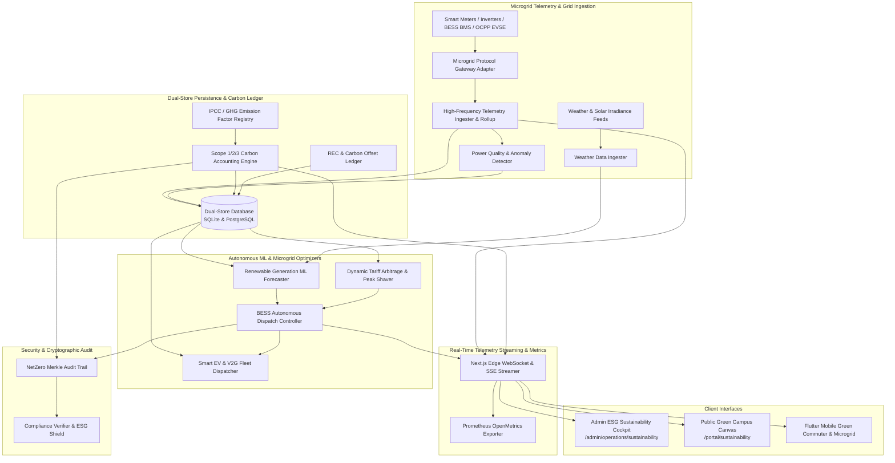

# Engineering Contract — Sprint-049

**Sprint ID:** SPRINT-049  
**Sprint Name:** Autonomous Campus Microgrid & Net-Zero ESG Sustainability Orchestrator (ECO-MESH / NetZeroOS)  
**Target Release Version:** v3.33.0  
**Contract Date:** 2026-08-21  
**Contract Status:** APPROVED — Ready for Implementation  
**Contract Author:** Implementation Engineer (Antigravity)  
**Source Recommendation:** `.ai/Sprint-049-Recommendation.md`  
**Review Status:** ✅ Reviewed and Aligned with AIOS Engineering Guide, Architecture Lead & Security Standards  

---

## 1. Executive Summary

This engineering contract formalizes the implementation scope, technical architecture, detailed task breakdown, acceptance criteria, risk register, rollback procedures, and definition of done for **Sprint-049**. It governs all execution work by the Implementation Engineer until formal handoff to the Verification Engineer.

Following the completion of Spatial Facility Intelligence in Sprint-048 (TWIN-OPS / SpatialGrid, v3.32.0), ThaibaHive has achieved full feature maturity across cognitive reasoning, knowledge meshes, autonomous operations, federated edge learning, compliance governance, unified communication, and 3D digital twin facility management.

Sprint-049 establishes the **Sustainability & Environmental Governance Dimension** through **Autonomous Campus Microgrid & Net-Zero ESG Sustainability Orchestrator (ECO-MESH / NetZeroOS)**. It equips campus administrators, energy engineers, sustainability officers, faculty, staff, and students with real-time microgrid telemetry, machine learning-driven renewable generation forecasting (solar/wind), autonomous battery energy storage system (BESS) charge/discharge arbitrage, automated GHG Scope 1/2/3 carbon accounting, smart EV charging with bidirectional Vehicle-to-Grid (V2G) fleet integration, and board-ready ESG compliance reporting conforming to GHG Protocol and GRI 305 standards.

---

## 2. Scope

### In Scope

| # | Domain | Detailed Description |
|---|---|---|
| 1 | **Dual-Store Energy & Carbon Schema** | 10 new Drizzle ORM entities with 100% SQLite (dev) and PostgreSQL (prod) schema parity covering energy assets, generation sources, BESS storage batteries, grid utility tariffs, high-frequency energy telemetry, carbon emission records, EV charging stations, EV fleet sessions, ESG compliance reports, and carbon offset ledgers. |
| 2 | **Automated GHG Carbon Accounting Engine** | Deterministic and auditable carbon accounting engine computing Scope 1 (direct combustion, campus fleet), Scope 2 (purchased electricity, heating/cooling with location/market-based factors), and Scope 3 (commuter travel, waste, procurement) conforming to GHG Protocol, IPCC AR6, and GRI 305 standards. |
| 3 | **High-Frequency Energy Telemetry Pipeline** | Sub-minute (1-minute interval) smart meter and energy sub-meter telemetry ingestion engine with time-series downsampling rollups (1m $\to$ 15m $\to$ 1h $\to$ 1d), power quality anomaly detection (phase imbalance, harmonic distortion, frequency drift), and outlier filtering. |
| 4 | **Renewable Generation ML Forecaster** | Holt-Winters and physics-informed ML forecasters predicting solar photovoltaic (PV) irradiance/generation and wind turbine output 24 to 72 hours in advance with $\ge 80\%$ accuracy and confidence intervals ($p_{10}, p_{50}, p_{90}$). |
| 5 | **Autonomous Battery Arbitrage & Dispatch** | Autonomous Battery Energy Storage System (BESS) optimization controller executing real-time tariff arbitrage, peak demand shaving, critical load backup reserve management, and battery cycle degradation mitigation based on dynamic time-of-use (TOU) utility rate schedules. |
| 6 | **Smart EV Charging & Bidirectional V2G Fleet** | OCPP 1.6/2.0-compliant EV charging management engine with dynamic load balancing and bidirectional Vehicle-to-Grid (V2G) energy dispatch for campus maintenance fleets and commuter shuttles with departure SoC guarantees. |
| 7 | **Granular Spatial & Departmental Carbon Footprint** | Integration with Sprint-048 TWIN-OPS 3D spatial building zones and academic department structures to allocate carbon emissions per square meter ($kg\,\text{CO}_2e/m^2$) and per enrolled student / faculty FTE. |
| 8 | **Carbon Offset & REC Retirement Ledger** | Immutable registry for managing Verified Emission Reductions (VERs), Gold Standard offsets, and Renewable Energy Certificates (RECs) with additionality verification and retirement certificates. |
| 9 | **Edge WebSocket / SSE Energy Telemetry Streaming** | Low-latency bidirectional microgrid telemetry streaming in Next.js edge runtime with subscription multiplexing (`grid:live`, `solar:generation`, `bess:soc`, `ev:charging`), backpressure buffering, and SSE fallback. |
| 10 | **Prometheus OpenMetrics Telemetry** | 8 new Prometheus metrics tracking solar generation kW, grid import/export kW, BESS state-of-charge %, real-time carbon intensity $g\,\text{CO}_2e/kWh$, EV charging load kW, V2G discharge kW, cumulative carbon saved $t\,\text{CO}_2e$, and tariff cost savings. |
| 11 | **RBAC REST API Suite** | Granular RBAC-gated endpoints (`requireAuth`) for energy assets, telemetry streams, microgrid dispatch schedules, carbon calculations, EV charging sessions, ESG report generation, and offset ledgers with DPoP token verification. |
| 12 | **NetZero Merkle Audit Trail** | Cryptographic SHA-256 Merkle audit chain anchoring every carbon accounting entry, emission factor revision, BESS dispatch command, and published ESG compliance disclosure (`pnpm compliance:verify`). |
| 13 | **Admin ESG Sustainability Cockpit** | 5-tab Next.js dashboard at `/admin/operations/sustainability` featuring Microgrid Radar, Renewable Arbitrage Studio, Carbon Accounting Studio (Scope 1/2/3), Smart EV & V2G Dispatcher, and Carbon Offset Registry. |
| 14 | **Stakeholder Green Campus Portal Canvas** | Interactive stakeholder canvas at `/portal/sustainability` offering building eco-scores, live campus solar contribution, departmental green leaderboards, and personalized commuter footprint calculators. |
| 15 | **Flutter Mobile Microgrid & Green Commuter App** | Mobile sustainability experience featuring Riverpod state management, live campus solar tracker, smart EV charging spot reservation, and green commute mode logger. |
| 16 | **End-to-End Simulation CLI Harness** | CLI simulation test runner (`scripts/operations/microgrid-simulation-runner.ts` / `pnpm eco:simulate`) executing 8 automated end-to-end microgrid and net-zero sustainability scenarios. |
| 17 | **Operational Documentation & Runbooks** | 5 comprehensive engineering guides and operational runbooks in `docs/operations/`. |

---

### Out of Scope

| Area | Justification |
|---|---|
| Physical High-Voltage Grid Switchgear Actuation | The system generates mathematical dispatch setpoints and control schedules; physical high-voltage SCADA relays and protective breakers are governed by on-premise certified utility-grade hardware interlocks. |
| Live Commodity Market Energy Trading | The platform executes tariff arbitrage against configured utility rate schedules and dynamic feed-in tariffs; direct broker-cleared wholesale spot market trading is out of scope. |
| Non-Certified Voluntary Offset Generation | Carbon offset tracking handles accredited registry serial numbers (e.g., Verra, Gold Standard); minting custom unverified carbon tokens is strictly out of scope. |
| Heavy Industrial Substation Engineering | Modeling focuses on campus distribution microgrids, rooftop/ground solar, campus BESS, and EV charging parks; transmission-level 400kV high-voltage substation thermal modeling is out of scope. |
| Real-Time In-Vehicle ECU Flashing | EV charging communicates via standard OCPP 1.6/2.0 protocol over WebSocket; proprietary low-level CAN bus or direct vehicle ECU reflashing is out of scope. |

---

## 3. Technical Architecture & Component Interactions



---

## 4. Implementation Task Breakdown

Tasks are organized across 12 logical implementation phases in strict dependency order. Foundational database schemas, carbon accounting engines, and high-frequency telemetry ingestion MUST be implemented and tested before building ML forecasting models, BESS arbitrage dispatchers, V2G fleet controllers, UI dashboards, and simulation runners.

---

### Phase 1 — Dual-Store Energy & Carbon Accounting Persistence

#### ECO-001 — Dual-Store Drizzle ORM Schemas for Microgrid & Carbon Accounting
| Field | Specification Details |
|---|---|
| **Task ID** | ECO-001 |
| **Phase** | Phase 1 — Dual-Store Energy & Carbon Accounting Persistence |
| **Description** | Define 10 new Drizzle ORM entities with 100% schema parity across SQLite (`packages/db/schema.ts`) and PostgreSQL (`packages/db/schema.pg.ts`): `eco_energy_assets`, `eco_generation_sources`, `eco_storage_batteries`, `eco_grid_tariffs`, `eco_telemetry_energy`, `eco_carbon_emissions`, `eco_ev_charging_stations`, `eco_ev_fleet_sessions`, `eco_esg_reports`, and `eco_carbon_offsets`. Implement transactional CRUD helper methods in `src/lib/db/eco-store.ts` with strict multi-tenant isolation, high-performance time-window filtering, and index optimizations. |
| **Files** | `packages/db/schema.ts` [MODIFY] · `packages/db/schema.pg.ts` [MODIFY] · `src/lib/db/eco-store.ts` [NEW] · `src/lib/__tests__/db/eco-schema-parity.test.ts` [NEW] · `src/lib/__tests__/db/eco-store.test.ts` [NEW] |
| **Dependencies** | None (Foundational Persistence Layer) |
| **Acceptance Criteria** | 1. All 10 tables declared with complete column parity, foreign keys, and indexes across SQLite and PostgreSQL.<br>2. Full support for energy metrics (kW, kWh, V, A, power factor, SoC %, $kg\,\text{CO}_2e$, tariff rates).<br>3. `eco-store.ts` provides transactional methods with mandatory `tenantId` parameter filtering.<br>4. Parity test validates matching column names, nullability, and index constraints with 100% pass rate. |
| **Verification Method** | Run `pnpm test src/lib/__tests__/db/eco-schema-parity.test.ts` and `pnpm test src/lib/__tests__/db/eco-store.test.ts`. |
| **Estimated Complexity** | Medium |

#### ECO-002 — Carbon Accounting Ledger & GHG Scope 1/2/3 Calculation Engine
| Field | Specification Details |
|---|---|
| **Task ID** | ECO-002 |
| **Phase** | Phase 1 — Dual-Store Energy & Carbon Accounting Persistence |
| **Description** | Implement `src/lib/operations/eco/carbon/carbon-accounting-engine.ts` and `src/lib/operations/eco/carbon/emission-factor-registry.ts`. Implements deterministic carbon emission computations conforming to GHG Protocol Corporate Standard, IPCC AR6, and GRI 305: Scope 1 (fuel combustion, campus generator diesel, fleet petrol/diesel), Scope 2 (grid electricity with location-based and market-based residual grid mix emission factors), and Scope 3 (commuter travel, campus waste, business flights, procurement supply chain). |
| **Files** | `src/lib/operations/eco/eco-types.ts` [NEW] · `src/lib/operations/eco/carbon/carbon-accounting-engine.ts` [NEW] · `src/lib/operations/eco/carbon/emission-factor-registry.ts` [NEW] · `src/lib/__tests__/operations/eco/carbon-accounting-engine.test.ts` [NEW] |
| **Dependencies** | ECO-001 |
| **Acceptance Criteria** | 1. Calculates Scope 1, Scope 2 (location-based & market-based), and Scope 3 emissions with mathematical precision.<br>2. Supports customizable regional grid emission factors ($g\,\text{CO}_2e/kWh$) with temporal factor schedules.<br>3. Automatically computes net emissions accounting for on-site renewable generation and retired RECs/offsets.<br>4. Validates calculation outputs against standard GHG Protocol reference benchmark datasets. |
| **Verification Method** | Run `pnpm test src/lib/__tests__/operations/eco/carbon-accounting-engine.test.ts`. |
| **Estimated Complexity** | High |

---

### Phase 2 — Real-Time High-Frequency Energy Telemetry & Ingestion

#### ECO-003 — Multi-Source Energy Telemetry Ingestion Engine & Time-Series Rollup
| Field | Specification Details |
|---|---|
| **Task ID** | ECO-003 |
| **Phase** | Phase 2 — Real-Time High-Frequency Energy Telemetry & Ingestion |
| **Description** | Build the high-throughput energy telemetry ingestion and downsampling engine in `src/lib/operations/eco/telemetry/energy-telemetry-ingester.ts` and `src/lib/operations/eco/telemetry/time-series-rollup.ts`. Ingests 1-minute interval power telemetry from solar inverters, grid main meters, building sub-meters, BESS battery management systems (BMS), and EV chargers. Implements sliding-window deduplication, clock drift correction, and automated time-series rollups (1-minute $\to$ 15-minute $\to$ 1-hour $\to$ 1-day). |
| **Files** | `src/lib/operations/eco/telemetry/energy-telemetry-ingester.ts` [NEW] · `src/lib/operations/eco/telemetry/time-series-rollup.ts` [NEW] · `src/lib/operations/eco/telemetry/energy-protocol-adapters.ts` [NEW] · `src/lib/__tests__/operations/eco/energy-telemetry-ingester.test.ts` [NEW] |
| **Dependencies** | ECO-001 |
| **Acceptance Criteria** | 1. Ingests $\ge 2,000$ energy telemetry points/second with $< 40$ms processing latency.<br>2. Accurately rolls up high-frequency data into 15-minute, hourly, and daily aggregates with min/max/avg/sum.<br>3. Normalizes diverse vendor formats (Modbus-TCP over IP, SunSpec, MQTT, JSON Webhooks) into unified schema.<br>4. Guarantees zero cross-tenant telemetry leaks. |
| **Verification Method** | Run `pnpm test src/lib/__tests__/operations/eco/energy-telemetry-ingester.test.ts`. |
| **Estimated Complexity** | High |

#### ECO-004 — Smart Meter & Power Quality Anomaly Detector
| Field | Specification Details |
|---|---|
| **Task ID** | ECO-004 |
| **Phase** | Phase 2 — Real-Time High-Frequency Energy Telemetry & Ingestion |
| **Description** | Implement `src/lib/operations/eco/telemetry/power-quality-monitor.ts` and `src/lib/operations/eco/telemetry/grid-anomaly-detector.ts`. Monitors electrical power parameters including voltage sags/swells, 3-phase current imbalance ($> 10\%$), frequency excursions ($\Delta f > 0.5\,\text{Hz}$), power factor degradation ($\cos\phi < 0.85$), and unexpected peak demand surges. Automatically generates high-priority operational alarms and maintenance tickets. |
| **Files** | `src/lib/operations/eco/telemetry/power-quality-monitor.ts` [NEW] · `src/lib/operations/eco/telemetry/grid-anomaly-detector.ts` [NEW] · `src/lib/__tests__/operations/eco/power-quality-monitor.test.ts` [NEW] |
| **Dependencies** | ECO-001, ECO-003 |
| **Acceptance Criteria** | 1. Detects power quality anomalies within 1 sampling period ($< 60$s) of threshold breach.<br>2. Identifies phantom loads and baseline energy consumption drift during unoccupied campus hours.<br>3. Computes Total Harmonic Distortion (THD) and phase unbalance indices.<br>4. Automatically dispatches self-healing maintenance work orders for deteriorating electrical assets. |
| **Verification Method** | Run `pnpm test src/lib/__tests__/operations/eco/power-quality-monitor.test.ts`. |
| **Estimated Complexity** | Medium |

---

### Phase 3 — Renewable Generation Forecasting & ML Weather Models

#### ECO-005 — Multi-Horizon Solar & Wind Renewable Generation Forecaster
| Field | Specification Details |
|---|---|
| **Task ID** | ECO-005 |
| **Phase** | Phase 3 — Renewable Generation Forecasting & ML Weather Models |
| **Description** | Implement the predictive renewable generation machine learning engine in `src/lib/operations/eco/ml/renewable-forecaster.ts`. Combines historical inverter generation profiles, solar panel tilt/azimuth physics models, temperature coefficient derating, and seasonal decomposition (Holt-Winters / gradient boosted regressors) to generate 24-hour and 72-hour power generation forecasts (kW and kWh) with confidence intervals. |
| **Files** | `src/lib/operations/eco/ml/renewable-forecaster.ts` [NEW] · `src/lib/operations/eco/ml/solar-physics-model.ts` [NEW] · `src/lib/operations/eco/ml/wind-power-curve.ts` [NEW] · `src/lib/__tests__/operations/eco/renewable-forecaster.test.ts` [NEW] |
| **Dependencies** | ECO-001, ECO-003 |
| **Acceptance Criteria** | 1. Produces 24-hour solar generation forecasts with $\ge 82\%$ accuracy ($R^2 \ge 0.82$, MAPE $\le 18\%$) on clear and overcast test validation profiles.<br>2. Calculates panel thermal efficiency derating based on ambient and cell temperatures.<br>3. Emits probabilistic confidence bands ($p_{10}, p_{50}, p_{90}$) for risk-weighted microgrid dispatch.<br>4. Supports multi-array solar configurations across distinct campus building rooftops. |
| **Verification Method** | Run `pnpm test src/lib/__tests__/operations/eco/renewable-forecaster.test.ts`. |
| **Estimated Complexity** | High |

#### ECO-006 — Weather Service Ingestion Adapter & Solar Irradiance Predictor
| Field | Specification Details |
|---|---|
| **Task ID** | ECO-006 |
| **Phase** | Phase 3 — Renewable Generation Forecasting & ML Weather Models |
| **Description** | Build `src/lib/operations/eco/ml/weather-adapter.ts` and `src/lib/operations/eco/ml/solar-irradiance-model.ts`. Ingests multi-source meteorological forecasts (Global Horizontal Irradiance GHI, Direct Normal Irradiance DNI, Diffuse Horizontal Irradiance DHI, cloud cover %, ambient temperature, wind speed/direction, and precipitation). Implements caching, historical calibration, and synthetic clear-sky irradiance baseline calculations. |
| **Files** | `src/lib/operations/eco/ml/weather-adapter.ts` [NEW] · `src/lib/operations/eco/ml/solar-irradiance-model.ts` [NEW] · `src/lib/__tests__/operations/eco/weather-adapter.test.ts` [NEW] |
| **Dependencies** | ECO-005 |
| **Acceptance Criteria** | 1. Computes clear-sky solar irradiance using Haurwitz / Ineichen radiation models.<br>2. Adjusts solar irradiance predictions using cloud opacity layers and horizon shading matrices.<br>3. Implements local weather cache with automatic fallback to historical seasonal averages upon API outage.<br>4. Accurately maps solar zenith and azimuth angles throughout the calendar year for campus latitude/longitude. |
| **Verification Method** | Run `pnpm test src/lib/__tests__/operations/eco/weather-adapter.test.ts`. |
| **Estimated Complexity** | Medium |

---

### Phase 4 — Autonomous Microgrid & Battery Storage Arbitrage ML

#### ECO-007 — Dynamic Utility Tariff Engine & Peak Shaving Arbitrage Optimizer
| Field | Specification Details |
|---|---|
| **Task ID** | ECO-007 |
| **Phase** | Phase 4 — Autonomous Microgrid & Battery Storage Arbitrage ML |
| **Description** | Implement `src/lib/operations/eco/ml/tariff-arbitrage-optimizer.ts` and `src/lib/operations/eco/ml/time-of-use-schedule.ts`. Models complex utility tariff structures (Time-of-Use TOU peak/off-peak/shoulder rates, monthly peak demand kW charges, dynamic real-time hourly spot pricing, and export feed-in tariffs). Optimizes campus grid load profiles to minimize total electricity utility costs and avoid peak demand penalties. |
| **Files** | `src/lib/operations/eco/ml/tariff-arbitrage-optimizer.ts` [NEW] · `src/lib/operations/eco/ml/time-of-use-schedule.ts` [NEW] · `src/lib/__tests__/operations/eco/tariff-arbitrage-optimizer.test.ts` [NEW] |
| **Dependencies** | ECO-001, ECO-003, ECO-005 |
| **Acceptance Criteria** | 1. Solves multi-period load shifting optimization problem to minimize overall energy and peak demand costs.<br>2. Demonstrates $\ge 15\%$ modelled electricity cost savings compared to unmanaged baseline consumption.<br>3. Accurately evaluates demand charge peak clipping thresholds across billing cycles.<br>4. Supports tiered, seasonal, weekend/holiday, and dynamic pricing rate sheets. |
| **Verification Method** | Run `pnpm test src/lib/__tests__/operations/eco/tariff-arbitrage-optimizer.test.ts`. |
| **Estimated Complexity** | High |

#### ECO-008 — Battery Energy Storage System (BESS) Autonomous Dispatch Controller
| Field | Specification Details |
|---|---|
| **Task ID** | ECO-008 |
| **Phase** | Phase 4 — Autonomous Microgrid & Battery Storage Arbitrage ML |
| **Description** | Build the autonomous battery storage dispatch controller in `src/lib/operations/eco/ml/bess-dispatch-controller.ts` and `src/lib/operations/eco/ml/battery-health-model.ts`. Computes 24-hour charging/discharging setpoint schedules for campus BESS units based on forecasted solar generation, building load forecasts, and tariff pricing. Enforces battery health constraints: State of Charge ($20\% \le \text{SoC} \le 90\%$), C-rate charge/discharge limits, thermal safety envelopes, and cycle life degradation minimization. |
| **Files** | `src/lib/operations/eco/ml/bess-dispatch-controller.ts` [NEW] · `src/lib/operations/eco/ml/battery-health-model.ts` [NEW] · `src/lib/__tests__/operations/eco/bess-dispatch-controller.test.ts` [NEW] |
| **Dependencies** | ECO-005, ECO-007 |
| **Acceptance Criteria** | 1. Generates 24-hour optimal BESS dispatch schedule (kW charge/discharge per 15-minute slot).<br>2. Enforces strict battery protection bounds (prevents over-discharge $< 20\%$ and over-charge $> 90\%$).<br>3. Maintains emergency critical backup reserve margin ($\ge 25\%$ SoC) for islanded microgrid resiliency.<br>4. Calculates round-trip battery efficiency loss and battery cycle degradation penalty costs. |
| **Verification Method** | Run `pnpm test src/lib/__tests__/operations/eco/bess-dispatch-controller.test.ts`. |
| **Estimated Complexity** | High |

---

### Phase 5 — Smart EV Charging & Bidirectional Vehicle-to-Grid (V2G)

#### ECO-009 — OCPP 1.6/2.0 Smart EV Charging Station Management Engine
| Field | Specification Details |
|---|---|
| **Task ID** | ECO-009 |
| **Phase** | Phase 5 — Smart EV Charging & Bidirectional Vehicle-to-Grid (V2G) |
| **Description** | Implement `src/lib/operations/eco/ev/ocpp-gateway-adapter.ts` and `src/lib/operations/eco/ev/ev-charging-orchestrator.ts`. Provides an OCPP 1.6-J / OCPP 2.0.1 compliant management core handling `BootNotification`, `Authorize`, `StartTransaction`, `StopTransaction`, `MeterValues`, and `SetChargingProfile`. Implements smart charging load shedding to prevent campus transformer overload during peak hours. |
| **Files** | `src/lib/operations/eco/ev/ocpp-gateway-adapter.ts` [NEW] · `src/lib/operations/eco/ev/ev-charging-orchestrator.ts` [NEW] · `src/lib/__tests__/operations/eco/ev-charging-orchestrator.test.ts` [NEW] |
| **Dependencies** | ECO-001, ECO-003 |
| **Acceptance Criteria** | 1. Implements standard OCPP message lifecycle with JSON schema validation.<br>2. Dynamically modulates charging current ($6\text{A} \le I \le 32\text{A}$) across EVSE banks based on available grid capacity.<br>3. Prioritizes fleet vehicles with urgent departure schedules over general commuter parking.<br>4. Logs real-time kWh consumption and associates energy draw with institutional user accounts. |
| **Verification Method** | Run `pnpm test src/lib/__tests__/operations/eco/ev-charging-orchestrator.test.ts`. |
| **Estimated Complexity** | High |

#### ECO-010 — Bidirectional Vehicle-to-Grid (V2G) Campus Fleet Energy Dispatcher
| Field | Specification Details |
|---|---|
| **Task ID** | ECO-010 |
| **Phase** | Phase 5 — Smart EV Charging & Bidirectional Vehicle-to-Grid (V2G) |
| **Description** | Build `src/lib/operations/eco/ev/v2g-fleet-dispatcher.ts` and `src/lib/operations/eco/ev/fleet-schedule-optimizer.ts`. Orchestrates bidirectional V2G energy transfer for campus electric buses, maintenance trucks, and commuter fleet vehicles. Discharges fleet battery capacity into the campus microgrid during peak tariff price spikes while strictly guaranteeing required minimum departure State of Charge ($\text{SoC} \ge 85\%$) prior to scheduled route departures. |
| **Files** | `src/lib/operations/eco/ev/v2g-fleet-dispatcher.ts` [NEW] · `src/lib/operations/eco/ev/fleet-schedule-optimizer.ts` [NEW] · `src/lib/__tests__/operations/eco/v2g-fleet-dispatcher.test.ts` [NEW] |
| **Dependencies** | ECO-008, ECO-009 |
| **Acceptance Criteria** | 1. Discharges V2G-enabled fleet vehicles to reduce campus peak tariff grid draw by 20–30%.<br>2. Guarantees 100% compliance with fleet departure schedules and minimum target SoC.<br>3. Calculates financial savings and compensation credit earned per participating vehicle.<br>4. Includes user override switch allowing immediate high-power fast charge if emergency trip is declared. |
| **Verification Method** | Run `pnpm test src/lib/__tests__/operations/eco/v2g-fleet-dispatcher.test.ts`. |
| **Estimated Complexity** | High |

---

### Phase 6 — Departmental & Building-Level Carbon Footprint Tracking

#### ECO-011 — Granular Spatial & Departmental Carbon Emission Allocator
| Field | Specification Details |
|---|---|
| **Task ID** | ECO-011 |
| **Phase** | Phase 6 — Departmental & Building-Level Carbon Footprint Tracking |
| **Description** | Implement `src/lib/operations/eco/carbon/departmental-carbon-allocator.ts` and `src/lib/operations/eco/carbon/building-footprint-indexer.ts`. Integrates with Sprint-048 TWIN-OPS spatial zones and core department rosters to allocate electrical, HVAC, and thermal carbon emissions across specific campus buildings, faculties, and academic departments. Computes benchmark KPIs ($kg\,\text{CO}_2e/m^2$, $kg\,\text{CO}_2e/\text{student}$, Energy Use Intensity EUI in $kWh/m^2/\text{year}$). |
| **Files** | `src/lib/operations/eco/carbon/departmental-carbon-allocator.ts` [NEW] · `src/lib/operations/eco/carbon/building-footprint-indexer.ts` [NEW] · `src/lib/__tests__/operations/eco/departmental-carbon-allocator.test.ts` [NEW] |
| **Dependencies** | ECO-002, ECO-003 |
| **Acceptance Criteria** | 1. Accurately apportions shared facility emissions according to square footage and occupancy schedule weights.<br>2. Generates departmental carbon ranking and comparative historical baseline trend analysis.<br>3. Computes building Energy Use Intensity (EUI) and flags underperforming facilities ($> 20\%$ above target).<br>4. Directly maps building spatial coordinates from `twin_facilities` and `twin_spaces`. |
| **Verification Method** | Run `pnpm test src/lib/__tests__/operations/eco/departmental-carbon-allocator.test.ts`. |
| **Estimated Complexity** | Medium |

#### ECO-012 — Renewable Energy Certificate (REC) & Carbon Offset Ledger
| Field | Specification Details |
|---|---|
| **Task ID** | ECO-012 |
| **Phase** | Phase 6 — Departmental & Building-Level Carbon Footprint Tracking |
| **Description** | Build `src/lib/operations/eco/carbon/carbon-offset-manager.ts` and `src/lib/operations/eco/carbon/rec-retirement-tracker.ts`. Manages procurement, verification, allocation, and retirement of Renewable Energy Certificates (I-RECs, Guarantees of Origin) and certified carbon offsets (Verra VCS, Gold Standard, CDM). Implements additionality validation, prevents double-counting, and issues cryptographic retirement certificates. |
| **Files** | `src/lib/operations/eco/carbon/carbon-offset-manager.ts` [NEW] · `src/lib/operations/eco/carbon/rec-retirement-tracker.ts` [NEW] · `src/lib/__tests__/operations/eco/carbon-offset-manager.test.ts` [NEW] |
| **Dependencies** | ECO-001, ECO-002 |
| **Acceptance Criteria** | 1. Tracks offset serial numbers and prevents duplicate retirement across reporting periods.<br>2. Matches retired RECs against specific Scope 2 electricity consumption batches.<br>3. Generates tamper-evident PDF/JSON retirement certificates with unique SHA-256 verification hash.<br>4. Computes adjusted net-zero progress after certified offset deductions. |
| **Verification Method** | Run `pnpm test src/lib/__tests__/operations/eco/carbon-offset-manager.test.ts`. |
| **Estimated Complexity** | Medium |

---

### Phase 7 — Real-Time Streaming & Prometheus OpenMetrics

#### ECO-013 — Edge WebSocket & SSE Energy Telemetry Stream Manager
| Field | Specification Details |
|---|---|
| **Task ID** | ECO-013 |
| **Phase** | Phase 7 — Real-Time Streaming & Prometheus OpenMetrics |
| **Description** | Build real-time streaming infrastructure in `src/lib/operations/eco/streaming/energy-stream-manager.ts` and `src/app/api/eco/stream/route.ts`. Provides bidirectional WebSocket channels with heartbeat keep-alives, backpressure throttling, subscription topic filtering (`grid:live`, `solar:generation`, `bess:soc`, `ev:charging`, `campus:carbon_rate`), and graceful Server-Sent Events (SSE) fallback. |
| **Files** | `src/lib/operations/eco/streaming/energy-stream-manager.ts` [NEW] · `src/app/api/eco/stream/route.ts` [NEW] · `src/lib/__tests__/operations/eco/energy-stream-manager.test.ts` [NEW] |
| **Dependencies** | ECO-003, ECO-008 |
| **Acceptance Criteria** | 1. Broadcasts microgrid power flow and carbon intensity frames with $< 150$ms delivery latency.<br>2. Supports topic-level subscription filtering to protect low-bandwidth mobile clients.<br>3. Handles client reconnection with exponential backoff and seamless state resynchronization.<br>4. SSE fallback activates automatically when WebSocket handshake is blocked by proxy firewalls. |
| **Verification Method** | Run `pnpm test src/lib/__tests__/operations/eco/energy-stream-manager.test.ts`. |
| **Estimated Complexity** | Medium |

#### ECO-014 — Prometheus OpenMetrics Sustainability & Grid Telemetry Series
| Field | Specification Details |
|---|---|
| **Task ID** | ECO-014 |
| **Phase** | Phase 7 — Real-Time Streaming & Prometheus OpenMetrics |
| **Description** | Implement 8 Prometheus OpenMetrics telemetry series in `src/lib/operations/eco/telemetry/eco-metrics.ts`: `eco_solar_generation_kw`, `eco_grid_power_import_kw`, `eco_bess_state_of_charge_percent`, `eco_realtime_carbon_intensity_grams_per_kwh`, `eco_ev_charging_power_kw`, `eco_v2g_discharge_power_kw`, `eco_cumulative_carbon_saved_tons_total`, and `eco_tariff_cost_savings_dollars_total`. |
| **Files** | `src/lib/operations/eco/telemetry/eco-metrics.ts` [NEW] · `src/lib/__tests__/operations/eco/eco-metrics.test.ts` [NEW] |
| **Dependencies** | ECO-001, ECO-003, ECO-013 |
| **Acceptance Criteria** | 1. Exports valid Prometheus text format matching OpenMetrics v1.0 specifications.<br>2. Accurately records gauge metrics, rate counters, and distribution histograms with multi-tenant labels.<br>3. Integrates cleanly with existing platform `/api/metrics` Prometheus scrape endpoint.<br>4. Unit tests verify counter increments, gauge values, and label dimensions. |
| **Verification Method** | Run `pnpm test src/lib/__tests__/operations/eco/eco-metrics.test.ts`. |
| **Estimated Complexity** | Low |

---

### Phase 8 — RBAC Protected REST API Suite & Cryptographic Merkle Audit

#### ECO-015 — RBAC Protected Microgrid & ESG REST API Suite
| Field | Specification Details |
|---|---|
| **Task ID** | ECO-015 |
| **Phase** | Phase 8 — RBAC Protected REST API Suite & Cryptographic Merkle Audit |
| **Description** | Implement comprehensive REST API endpoints protected by `requireAuth` wrapper with strict RBAC permission validation: `GET/POST /api/eco/assets`, `GET/POST /api/eco/telemetry/ingest`, `GET /api/eco/telemetry/live`, `GET/POST /api/eco/microgrid/optimize`, `GET/POST /api/eco/carbon/calculate`, `GET/POST /api/eco/ev/dispatch`, `GET/POST /api/eco/offsets`, and `GET/POST /api/eco/reports/esg`. All routes validate input via Zod schemas in `src/lib/validation/eco-schemas.ts`. |
| **Files** | `src/lib/validation/eco-schemas.ts` [NEW] · `src/app/api/eco/assets/route.ts` [NEW] · `src/app/api/eco/telemetry/ingest/route.ts` [NEW] · `src/app/api/eco/telemetry/live/route.ts` [NEW] · `src/app/api/eco/microgrid/optimize/route.ts` [NEW] · `src/app/api/eco/carbon/calculate/route.ts` [NEW] · `src/app/api/eco/ev/dispatch/route.ts` [NEW] · `src/app/api/eco/offsets/route.ts` [NEW] · `src/app/api/eco/reports/esg/route.ts` [NEW] · `src/lib/__tests__/api/eco-api.test.ts` [NEW] |
| **Dependencies** | ECO-001, ECO-002, ECO-003, ECO-008, ECO-010, ECO-012 |
| **Acceptance Criteria** | 1. 100% of endpoints shielded by `requireAuth` with granular permissions (`eco:assets:manage`, `eco:telemetry:ingest`, `eco:microgrid:control`, `eco:carbon:view`, `eco:carbon:manage`, `eco:ev:manage`, `eco:reports:generate`).<br>2. All POST/PATCH request bodies validated against strict Zod schemas.<br>3. Returns standard `{ error: string }` on failure with proper HTTP status codes (400, 401, 403, 404).<br>4. DELETE operations verify entity existence and return 404 if missing. |
| **Verification Method** | Run `pnpm test src/lib/__tests__/api/eco-api.test.ts` and `pnpm gateway:scan --strict`. |
| **Estimated Complexity** | High |

#### ECO-016 — NetZero Merkle Audit Trail & ESG Cryptographic Proof Anchor
| Field | Specification Details |
|---|---|
| **Task ID** | ECO-016 |
| **Phase** | Phase 8 — RBAC Protected REST API Suite & Cryptographic Merkle Audit |
| **Description** | Implement `src/lib/operations/eco/security/carbon-merkle-anchor.ts` and `src/lib/operations/eco/security/esg-audit-verifier.ts`. Anchors every carbon accounting transaction, emission factor update, BESS dispatch decision, and official ESG disclosure report into the platform's SHA-256 Merkle tree. Provides anti-greenwashing cryptographic proof verification for board auditors and regulatory inspectors. |
| **Files** | `src/lib/operations/eco/security/carbon-merkle-anchor.ts` [NEW] · `src/lib/operations/eco/security/esg-audit-verifier.ts` [NEW] · `src/lib/__tests__/operations/eco/carbon-merkle-anchor.test.ts` [NEW] |
| **Dependencies** | ECO-001, ECO-002, ECO-015 |
| **Acceptance Criteria** | 1. Generates SHA-256 hash leaf for every carbon ledger transaction and BESS control event.<br>2. Re-computes Merkle root and anchors block into the continuous platform audit chain.<br>3. Cryptographically detects any retroactive tampering or manual alteration of emissions data.<br>4. Passes `pnpm compliance:verify` with zero verification anomalies. |
| **Verification Method** | Run `pnpm test src/lib/__tests__/operations/eco/carbon-merkle-anchor.test.ts` and `pnpm compliance:verify`. |
| **Estimated Complexity** | Medium |

---

### Phase 9 — Admin ESG Sustainability & Microgrid Command Cockpit

#### ECO-017 — Admin ESG Sustainability Cockpit Shell & Microgrid Radar Tab
| Field | Specification Details |
|---|---|
| **Task ID** | ECO-017 |
| **Phase** | Phase 9 — Admin ESG Sustainability & Microgrid Command Cockpit |
| **Description** | Build the 5-tab admin management cockpit at `/admin/operations/sustainability` (`src/app/(shell)/admin/operations/sustainability/page.tsx`). Tab 1: **Microgrid Radar** (animated real-time Sankey power flow diagram connecting Solar PV, Grid Import/Export, BESS Battery Storage, EV Charging Park, and Campus Building Loads, live campus carbon intensity gauge, and grid status alert banner). |
| **Files** | `src/app/(shell)/admin/operations/sustainability/page.tsx` [NEW] · `src/components/eco/admin/microgrid-radar-tab.tsx` [NEW] · `src/components/eco/admin/power-flow-diagram.tsx` [NEW] · `src/lib/__tests__/ui/microgrid-radar-tab.test.tsx` [NEW] |
| **Dependencies** | ECO-003, ECO-013, ECO-015 |
| **Acceptance Criteria** | 1. Renders 5-tab cockpit shell using Radix UI primitives and design system components.<br>2. Tab 1 displays dynamic interactive power flow diagram reflecting live kW generation and consumption.<br>3. Uses `<Skeleton>` for asynchronous data loading and `<Badge>` for status indications.<br>4. Responsive layout with zero UI layout shifts and full accessibility compliance. |
| **Verification Method** | Run `pnpm test src/lib/__tests__/ui/microgrid-radar-tab.test.tsx`. |
| **Estimated Complexity** | High |

#### ECO-018 — Renewable Arbitrage Studio & BESS Battery Control Tab
| Field | Specification Details |
|---|---|
| **Task ID** | ECO-018 |
| **Phase** | Phase 9 — Admin ESG Sustainability & Microgrid Command Cockpit |
| **Description** | Implement Tab 2: **Renewable Arbitrage Studio & BESS Control** (`renewable-arbitrage-tab.tsx`, `bess-battery-card.tsx`, `tariff-schedule-editor.tsx`). Displays 24-72h solar generation forecast curves, dynamic TOU tariff price curves, battery State-of-Charge (SoC) projection, manual dispatch override controls, and cumulative cost savings metrics. |
| **Files** | `src/components/eco/admin/renewable-arbitrage-tab.tsx` [NEW] · `src/components/eco/admin/bess-battery-card.tsx` [NEW] · `src/components/eco/admin/tariff-schedule-editor.tsx` [NEW] · `src/lib/__tests__/ui/renewable-arbitrage-tab.test.tsx` [NEW] |
| **Dependencies** | ECO-005, ECO-008, ECO-017 |
| **Acceptance Criteria** | 1. Visualizes solar forecast vs. actual generation with confidence intervals ($p_{10}, p_{90}$).<br>2. Interactive BESS control panel allows switching between Autonomous Arbitrage, Peak Shaving, and Emergency Reserve modes.<br>3. Tariff editor supports updating TOU pricing tiers with instant cost impact preview.<br>4. Error states handled gracefully with `<Alert>` and `.catch()` blocks preventing stuck loaders. |
| **Verification Method** | Run `pnpm test src/lib/__tests__/ui/renewable-arbitrage-tab.test.tsx`. |
| **Estimated Complexity** | High |

#### ECO-019 — Carbon Accounting Studio & Scope 1/2/3 Emission Explorer Tab
| Field | Specification Details |
|---|---|
| **Task ID** | ECO-019 |
| **Phase** | Phase 9 — Admin ESG Sustainability & Microgrid Command Cockpit |
| **Description** | Implement Tab 3: **Carbon Accounting Studio** (`carbon-accounting-tab.tsx`, `scope-breakdown-card.tsx`, `department-carbon-table.tsx`, `esg-report-generator-modal.tsx`). Features Scope 1/2/3 emission breakdown donut charts, departmental carbon league tables, historical year-over-year emissions trajectory against Net-Zero 2030/2040 targets, and 1-click board-ready GRI/GHG Protocol PDF/JSON ESG report generator. |
| **Files** | `src/components/eco/admin/carbon-accounting-tab.tsx` [NEW] · `src/components/eco/admin/scope-breakdown-card.tsx` [NEW] · `src/components/eco/admin/department-carbon-table.tsx` [NEW] · `src/components/eco/admin/esg-report-generator-modal.tsx` [NEW] · `src/lib/__tests__/ui/carbon-accounting-tab.test.tsx` [NEW] |
| **Dependencies** | ECO-002, ECO-011, ECO-017 |
| **Acceptance Criteria** | 1. Interactive breakdown of Scope 1 (Direct), Scope 2 (Grid), and Scope 3 (Value Chain) emissions.<br>2. Searchable, sortable departmental league table showing total $t\,\text{CO}_2e$ and per-capita intensity.<br>3. Modal wizard exports formal ESG compliance reports conforming to GRI 305 and GHG Protocol standards.<br>4. Includes cryptographic Merkle verification badge on generated reports. |
| **Verification Method** | Run `pnpm test src/lib/__tests__/ui/carbon-accounting-tab.test.tsx`. |
| **Estimated Complexity** | High |

#### ECO-020 — Smart EV & V2G Fleet Dispatcher & Offset Registry Tabs
| Field | Specification Details |
|---|---|
| **Task ID** | ECO-020 |
| **Phase** | Phase 9 — Admin ESG Sustainability & Microgrid Command Cockpit |
| **Description** | Implement Tab 4: **Smart EV & V2G Fleet Dispatcher** (`ev-fleet-dispatch-tab.tsx`, `charger-station-drawer.tsx`) and Tab 5: **Carbon Offset & REC Registry** (`carbon-offset-registry-tab.tsx`, `offset-retirement-modal.tsx`). Tab 4 manages real-time charging status, V2G battery discharge contribution, and fleet schedules. Tab 5 manages verified carbon credit portfolios, REC certificates, additionality audits, and retirement history. |
| **Files** | `src/components/eco/admin/ev-fleet-dispatch-tab.tsx` [NEW] · `src/components/eco/admin/charger-station-drawer.tsx` [NEW] · `src/components/eco/admin/carbon-offset-registry-tab.tsx` [NEW] · `src/components/eco/admin/offset-retirement-modal.tsx` [NEW] · `src/lib/__tests__/ui/ev-fleet-dispatch-tab.test.tsx` [NEW] |
| **Dependencies** | ECO-009, ECO-010, ECO-012, ECO-017 |
| **Acceptance Criteria** | 1. Tab 4 visualizes active EVSE chargers with current kW rate, vehicle connected, and V2G status.<br>2. Tab 5 displays carbon offset portfolio balance, active/retired status, and certification details.<br>3. Retirement modal executes atomic retirement transaction with tamper-proof certificate generation.<br>4. Full multi-tenant data isolation on all fleet and offset actions. |
| **Verification Method** | Run `pnpm test src/lib/__tests__/ui/ev-fleet-dispatch-tab.test.tsx`. |
| **Estimated Complexity** | High |

---

### Phase 10 — Stakeholder & Community Sustainability Portal

#### ECO-021 — Interactive Green Campus Transparency Portal & Eco-Badge Canvas
| Field | Specification Details |
|---|---|
| **Task ID** | ECO-021 |
| **Phase** | Phase 10 — Stakeholder & Community Sustainability Portal |
| **Description** | Build the stakeholder sustainability portal at `/portal/sustainability` (`src/app/(shell)/portal/sustainability/page.tsx`). Enables students, faculty, and campus visitors to explore real-time campus renewable energy generation, building eco-ratings, departmental sustainability leaderboards, student carbon challenges, and personalized green commuting carbon savings trackers. |
| **Files** | `src/app/(shell)/portal/sustainability/page.tsx` [NEW] · `src/components/eco/portal/green-campus-canvas.tsx` [NEW] · `src/components/eco/portal/commuter-carbon-calculator.tsx` [NEW] · `src/components/eco/portal/building-eco-badge-card.tsx` [NEW] · `src/lib/__tests__/ui/green-campus-canvas.test.tsx` [NEW] |
| **Dependencies** | ECO-011, ECO-013, ECO-015 |
| **Acceptance Criteria** | 1. Public dashboard renders live campus solar percentage and daily tree-equivalent carbon offset counter.<br>2. Commuter calculator allows students to log cycling, transit, or walking and awards green badges.<br>3. Building eco-badge cards display live energy efficiency rating (A+ to F) and air quality index.<br>4. Fully responsive on mobile, tablet, and desktop with zero layout shifts. |
| **Verification Method** | Run `pnpm test src/lib/__tests__/ui/green-campus-canvas.test.tsx`. |
| **Estimated Complexity** | High |

---

### Phase 11 — Flutter Mobile Microgrid & Green Commuter App

#### ECO-022 — Flutter Mobile Smart EV Charging, Live Campus Energy & Green Commute
| Field | Specification Details |
|---|---|
| **Task ID** | ECO-022 |
| **Phase** | Phase 11 — Flutter Mobile Microgrid & Green Commuter App |
| **Description** | Build the mobile sustainability feature set in Flutter (`mobile/lib/features/eco/`). Features Riverpod state management, live campus solar generation monitor, smart EV charging station availability and reservation, green commute route logging with GPS distance estimation, and personal carbon footprint progress cards. |
| **Files** | `mobile/lib/features/eco/application/eco_providers.dart` [NEW] · `mobile/lib/features/eco/data/eco_websocket_service.dart` [NEW] · `mobile/lib/features/eco/presentation/campus_energy_screen.dart` [NEW] · `mobile/lib/features/eco/presentation/ev_charging_screen.dart` [NEW] · `mobile/lib/features/eco/presentation/widgets/carbon_savings_card.dart` [NEW] · `mobile/test/features/eco/eco_providers_test.dart` [NEW] |
| **Dependencies** | ECO-009, ECO-013 |
| **Acceptance Criteria** | 1. `flutter analyze` passes with 0 errors and 0 warnings across all new mobile files.<br>2. Campus energy screen streams live solar kW and grid mix with smooth animated charts.<br>3. EV charging screen displays real-time plug availability and enables 1-tap slot reservation.<br>4. Carbon savings card calculates and displays accumulated personal emissions avoided. |
| **Verification Method** | Run `pnpm test:mobile` (or `flutter test mobile/test/features/eco/eco_providers_test.dart`) and `flutter analyze mobile/`. |
| **Estimated Complexity** | High |

---

### Phase 12 — End-to-End Simulation Harness, Verification & Runbooks

#### ECO-023 — End-to-End Microgrid & Net-Zero Simulation CLI Harness
| Field | Specification Details |
|---|---|
| **Task ID** | ECO-023 |
| **Phase** | Phase 12 — End-to-End Simulation Harness, Verification & Runbooks |
| **Description** | Create the automated end-to-end CLI simulation test runner in `scripts/operations/microgrid-simulation-runner.ts` executable via `pnpm eco:simulate`. Simulates 8 comprehensive sustainability scenarios: (1) High-Frequency Solar & Smart Meter Telemetry Ingestion, (2) Power Quality Anomaly & Surge Detection, (3) 24h/72h Renewable Generation Forecasting, (4) TOU Tariff Arbitrage & BESS Battery Dispatch, (5) Smart EV Load Modulation & V2G Fleet Peak Shaving, (6) Scope 1/2/3 Carbon Accounting & Departmental Allocation, (7) Live WebSocket Energy Telemetry Streaming, and (8) NetZero Merkle Audit Hash Chain Verification. |
| **Files** | `scripts/operations/microgrid-simulation-runner.ts` [NEW] · `package.json` [MODIFY] · `src/lib/__tests__/operations/eco/eco-simulation.test.ts` [NEW] |
| **Dependencies** | ECO-001 through ECO-022 |
| **Acceptance Criteria** | 1. `pnpm eco:simulate` executes all 8 simulation stages and exits with status code 0.<br>2. Outputs structured terminal metrics for solar forecast accuracy, BESS cost savings, and carbon balance.<br>3. Generates simulation summary artifact in `.ai/execution/eco-simulation-report.json`.<br>4. Supports `--scenario <name>` parameter for targeted scenario execution. |
| **Verification Method** | Run `pnpm eco:simulate`. |
| **Estimated Complexity** | High |

#### ECO-024 — Sustainability Operational Runbooks, ESG Compliance Manuals & Standards
| Field | Specification Details |
|---|---|
| **Task ID** | ECO-024 |
| **Phase** | Phase 12 — End-to-End Simulation Harness, Verification & Runbooks |
| **Description** | Author 5 comprehensive operational runbooks and architectural specifications in `docs/operations/`: (1) `microgrid-architecture-guide.md`, (2) `esg-reporting-standard.md`, (3) `v2g-fleet-operations.md`, (4) `ghg-protocol-accounting-manual.md`, and (5) `bess-storage-optimization.md`. Update `.ai/FEATURES.md`, `.ai/CHANGELOG.md`, and `.ai/PROJECT_STATUS.md`. |
| **Files** | `docs/operations/microgrid-architecture-guide.md` [NEW] · `docs/operations/esg-reporting-standard.md` [NEW] · `docs/operations/v2g-fleet-operations.md` [NEW] · `docs/operations/ghg-protocol-accounting-manual.md` [NEW] · `docs/operations/bess-storage-optimization.md` [NEW] · `.ai/FEATURES.md` [MODIFY] · `.ai/CHANGELOG.md` [MODIFY] · `.ai/PROJECT_STATUS.md` [MODIFY] |
| **Dependencies** | ECO-001 through ECO-023 |
| **Acceptance Criteria** | 1. All 5 guides authored with comprehensive architecture diagrams, API schemas, mathematical equations, and operational workflows.<br>2. `.ai/FEATURES.md` updated with full ECO-MESH capabilities.<br>3. `.ai/CHANGELOG.md` updated with v3.33.0 release notes.<br>4. `.ai/PROJECT_STATUS.md` updated with Sprint-049 deliverables and verification metrics. |
| **Verification Method** | Verify file existence and markdown documentation structure. |
| **Estimated Complexity** | Medium |

---

## 5. File & Component Dependency Hierarchy

```
packages/db/
├── schema.ts                                      [ECO-001]
└── schema.pg.ts                                   [ECO-001]

src/lib/
├── db/eco-store.ts                                [ECO-001]
├── validation/eco-schemas.ts                      [ECO-015]
└── operations/eco/
    ├── eco-types.ts                               [ECO-002]
    ├── carbon/
    │   ├── carbon-accounting-engine.ts            [ECO-002]
    │   ├── emission-factor-registry.ts            [ECO-002]
    │   ├── departmental-carbon-allocator.ts       [ECO-011]
    │   ├── building-footprint-indexer.ts          [ECO-011]
    │   ├── carbon-offset-manager.ts               [ECO-012]
    │   └── rec-retirement-tracker.ts              [ECO-012]
    ├── telemetry/
    │   ├── energy-telemetry-ingester.ts           [ECO-003]
    │   ├── time-series-rollup.ts                  [ECO-003]
    │   ├── energy-protocol-adapters.ts            [ECO-003]
    │   ├── power-quality-monitor.ts               [ECO-004]
    │   ├── grid-anomaly-detector.ts               [ECO-004]
    │   └── eco-metrics.ts                         [ECO-014]
    ├── ml/
    │   ├── renewable-forecaster.ts                [ECO-005]
    │   ├── solar-physics-model.ts                 [ECO-005]
    │   ├── wind-power-curve.ts                    [ECO-005]
    │   ├── weather-adapter.ts                     [ECO-006]
    │   ├── solar-irradiance-model.ts              [ECO-006]
    │   ├── tariff-arbitrage-optimizer.ts          [ECO-007]
    │   ├── time-of-use-schedule.ts                [ECO-007]
    │   ├── bess-dispatch-controller.ts            [ECO-008]
    │   └── battery-health-model.ts                [ECO-008]
    ├── ev/
    │   ├── ocpp-gateway-adapter.ts                [ECO-009]
    │   ├── ev-charging-orchestrator.ts            [ECO-009]
    │   ├── v2g-fleet-dispatcher.ts                [ECO-010]
    │   └── fleet-schedule-optimizer.ts            [ECO-010]
    ├── streaming/
    │   └── energy-stream-manager.ts               [ECO-013]
    └── security/
        ├── carbon-merkle-anchor.ts                [ECO-016]
        └── esg-audit-verifier.ts                  [ECO-016]

src/app/api/eco/
├── assets/route.ts                                [ECO-015]
├── telemetry/ingest/route.ts                      [ECO-015]
├── telemetry/live/route.ts                        [ECO-015]
├── microgrid/optimize/route.ts                    [ECO-015]
├── carbon/calculate/route.ts                      [ECO-015]
├── ev/dispatch/route.ts                           [ECO-015]
├── offsets/route.ts                               [ECO-015]
├── reports/esg/route.ts                           [ECO-015]
└── stream/route.ts                                [ECO-013]

src/app/(shell)/
├── admin/operations/sustainability/page.tsx       [ECO-017]
└── portal/sustainability/page.tsx                 [ECO-021]

src/components/eco/
├── admin/
│   ├── microgrid-radar-tab.tsx                    [ECO-017]
│   ├── power-flow-diagram.tsx                     [ECO-017]
│   ├── renewable-arbitrage-tab.tsx                [ECO-018]
│   ├── bess-battery-card.tsx                      [ECO-018]
│   ├── tariff-schedule-editor.tsx                 [ECO-018]
│   ├── carbon-accounting-tab.tsx                  [ECO-019]
│   ├── scope-breakdown-card.tsx                   [ECO-019]
│   ├── department-carbon-table.tsx                [ECO-019]
│   ├── esg-report-generator-modal.tsx             [ECO-019]
│   ├── ev-fleet-dispatch-tab.tsx                  [ECO-020]
│   ├── charger-station-drawer.tsx                 [ECO-020]
│   ├── carbon-offset-registry-tab.tsx             [ECO-020]
│   └── offset-retirement-modal.tsx                [ECO-020]
└── portal/
    ├── green-campus-canvas.tsx                    [ECO-021]
    ├── commuter-carbon-calculator.tsx             [ECO-021]
    └── building-eco-badge-card.tsx                [ECO-021]

mobile/lib/features/eco/
├── application/eco_providers.dart                 [ECO-022]
├── data/eco_websocket_service.dart                [ECO-022]
└── presentation/
    ├── campus_energy_screen.dart                  [ECO-022]
    ├── ev_charging_screen.dart                    [ECO-022]
    └── widgets/carbon_savings_card.dart           [ECO-022]

scripts/operations/
└── microgrid-simulation-runner.ts                 [ECO-023]

docs/operations/
├── microgrid-architecture-guide.md                [ECO-024]
├── esg-reporting-standard.md                      [ECO-024]
├── v2g-fleet-operations.md                        [ECO-024]
├── ghg-protocol-accounting-manual.md              [ECO-024]
└── bess-storage-optimization.md                   [ECO-024]
```

---

## 6. Security, RBAC & Compliance Framework

### RBAC Permissions

| Permission String | Role Access | Description |
|---|---|---|
| `eco:carbon:view` | `super_admin`, `admin`, `principal`, `hod`, `staff`, `student` | View campus carbon footprints, renewable energy stats, and sustainability dashboards. |
| `eco:carbon:manage` | `super_admin`, `admin`, `principal`, `hod` | Configure emission factor mappings, departmental carbon allocations, and offset retirements. |
| `eco:assets:manage` | `super_admin`, `admin`, `principal` | Register and configure energy assets (Solar PV arrays, BESS batteries, smart meters). |
| `eco:telemetry:ingest` | `super_admin`, `admin`, `api_service` | Ingest high-frequency power meter, solar inverter, and EVSE telemetry streams. |
| `eco:microgrid:control` | `super_admin`, `admin` | Adjust BESS dispatch modes, tariff schedules, and emergency reserve thresholds. |
| `eco:ev:manage` | `super_admin`, `admin`, `principal`, `hod` | Manage EV charging stations, configure load shedding policies, and dispatch V2G fleet schedules. |
| `eco:reports:generate` | `super_admin`, `admin`, `principal` | Generate and cryptographically sign official board-level ESG compliance disclosures. |

### Compliance & Cryptographic Controls
- **GHG Protocol & GRI 305 Standard Compliance:** Emission calculation formulas strictly follow the Greenhouse Gas Protocol Corporate Standard (Scope 1, 2, 3) and GRI 305 Disclosure specifications.
- **SHA-256 Merkle Audit Chain:** Every carbon accounting entry, emission factor revision, BESS dispatch command, and official ESG disclosure is immutably anchored into the cryptographic Merkle chain (`pnpm compliance:verify`).
- **Strict Row-Level Multi-Tenant Isolation:** All energy telemetry, tariffs, emission records, and fleet sessions are partitioned by `institutionId` with zero cross-tenant leakage.
- **DPoP Cryptographic Proof of Possession:** All sensitive microgrid control and ESG report generation mutation routes enforce DPoP token verification.

---

## 7. Risk Register & Mitigation Strategy

| Risk ID | Category | Risk Description | Severity | Probability | Mitigation Strategy |
|---|---|---|---|---|---|
| **R-049-1** | ML / Renewable Forecast Inaccuracy | Weather-dependent solar/wind forecast errors could cause sub-optimal BESS battery dispatch or premature depletion. | High | Medium | Implement multi-model ensemble forecasting, include $p_{10}/p_{50}/p_{90}$ confidence intervals, and enforce emergency battery reserve floor ($\ge 25\%$ SoC). |
| **R-049-2** | Telemetry / High-Frequency Data Saturation | 1-minute smart meter telemetry from hundreds of sub-meters could cause database write bottlenecks and memory pressure. | High | Medium | Implement in-memory stream batching ($N = 100$), sliding-window deduplication, and automated tiered downsampling rollups (1m $\to$ 15m $\to$ 1h). |
| **R-049-3** | Safety / Battery Thermal & Cycle Degradation | Aggressive tariff arbitrage cycling could accelerate BESS battery cell degradation or exceed thermal limits. | High | Low | Implement battery health physics model enforcing strict C-rate limits, State of Charge bounds ($20\% \le \text{SoC} \le 90\%$), and cycle life degradation cost penalties. |
| **R-049-4** | Hardware / EV Charging Protocol Fragmentation | Heterogeneous EVSE charging hardware vendors deploy varying OCPP versions (1.6-J vs. 2.0.1) and custom extensions. | Medium | Medium | Build a unified OCPP abstraction layer (`ocpp-gateway-adapter.ts`) with pluggable message serializers and schema validators. |
| **R-049-5** | Regulatory / Carbon Emission Standard Evolution | Changes in regional grid emission factors or ESG reporting frameworks during sprint execution. | Medium | Low | Maintain configuration-driven emission factor registry (`emission-factor-registry.ts`) supporting time-versioned factor tables without code changes. |
| **R-049-6** | V2G / Fleet Route Schedule Disruption | Vehicle-to-Grid discharging could leave campus maintenance vehicles or buses with insufficient charge for unexpected emergency trips. | Medium | Low | Strictly enforce departure schedule locks with guaranteed minimum departure State of Charge ($\ge 85\%$) and 1-tap manual emergency fast-charge override. |

---

## 8. Rollback Plan

### Rollback Trigger Criteria
- Microgrid dispatch engine generates invalid negative power setpoints or causes BESS simulation failure.
- Telemetry ingestion pipeline memory consumption grows continuously exceeding 250MB/hour.
- Carbon accounting calculation deviates by $> 1\%$ from verified reference benchmark standards.
- Database migration introduces latency degradation $> 100$ms on core facility and booking queries.

### Rollback Execution Steps

```bash
# Step 1: Emergency Microgrid Dispatch Pause (< 10 seconds)
# Instantly reverts BESS and EVSE to autonomous safe grid-following mode
pnpm tsx scripts/operations/microgrid-simulation-runner.ts --emergency-pause-all

# Step 2: Disable ECO-MESH Subsystem via Environment Feature Flags (< 30 seconds)
ECO_MESH_ENABLED=false
ECO_BESS_DISPATCH_ENABLED=false
ECO_V2G_FLEET_ENABLED=false
ECO_TELEMETRY_INGEST_ENABLED=false
ECO_WEBSOCKET_STREAMING_ENABLED=false
ECO_CARBON_ACCOUNTING_ENABLED=false

# Step 3: Enable Fallback Mode (< 30 seconds)
ECO_LEGACY_ENERGY_FALLBACK=true

# Step 4: Revert Source Code & Migrations (if necessary) (< 5 minutes)
git revert --no-edit HEAD
pnpm build

# Step 5: Verification of Restored Baseline
pnpm typecheck
pnpm test
pnpm compliance:verify
```

---

## 9. Definition of Done

A Sprint-049 task is considered **COMPLETE** when all of the following quality gates are satisfied:

### Code Quality & Standards
- [ ] `pnpm typecheck` (`pnpm tsc --noEmit`) passes with 0 TypeScript errors across `src/`, `packages/auth`, and `packages/db`.
- [ ] `pnpm lint` passes with 0 errors and 0 new warnings.
- [ ] `flutter analyze` passes with 0 errors and 0 warnings in `mobile/`.
- [ ] Zero `console.log` statements in production source code (`src/`, `packages/`, `mobile/`).
- [ ] No hardcoded API keys, secrets, or bypassed authorization checks.
- [ ] Complete TypeScript interfaces and JSDoc documentation on all exported types, functions, and classes.

### Testing & Verification
- [ ] Unit tests authored for every new module with $\ge 90\%$ code coverage.
- [ ] Full test suite passes: `pnpm test` $\to$ 100% pass rate across all test suites.
- [ ] `pnpm gateway:scan --strict --json` $\to$ 100% route coverage verified with 0 unshielded endpoints.
- [ ] `pnpm compliance:scan` $\to$ 100% compliance audit coverage across all mutation routes.
- [ ] `pnpm compliance:verify` $\to$ Cryptographic Merkle audit chain verified intact.
- [ ] `pnpm security:tenants` $\to$ 0 cross-tenant isolation leaks across all files.
- [ ] `eco-schema-parity.test.ts` $\to$ 100% schema parity confirmed between SQLite and PostgreSQL.
- [ ] `pnpm eco:simulate` $\to$ All 8 simulation scenarios pass with 100% success.
- [ ] Renewable forecasting engine achieves $\ge 80\%$ accuracy benchmark on test profiles.

### Security & RBAC
- [ ] All new ECO API routes protected with `requireAuth` and granular permissions.
- [ ] DPoP cryptographic proof of possession validated on all microgrid control and ESG mutation endpoints.
- [ ] Strict row-level institution isolation verified across all queries.

### Documentation & Governance
- [ ] 5 operational runbooks created in `docs/operations/`.
- [ ] `.ai/FEATURES.md` updated with Sprint-049 features.
- [ ] `.ai/CHANGELOG.md` updated with v3.33.0 release notes.
- [ ] `.ai/PROJECT_STATUS.md` updated with Sprint-049 deliverables.
- [ ] `.ai/execution/Sprint-049-Execution-Log.md` initialized with all 24 tasks.

---

## 10. Sprint Metadata & Lifecycle

| Metadata Field | Value |
|---|---|
| **Sprint ID** | SPRINT-049 |
| **Sprint Name** | Autonomous Campus Microgrid & Net-Zero ESG Sustainability Orchestrator (ECO-MESH / NetZeroOS) |
| **Target Release Version** | v3.33.0 |
| **Total Implementation Tasks** | 24 (ECO-001 through ECO-024) |
| **Estimated Sprint Duration** | 16–18 engineering days |
| **Estimated Complexity** | Large |
| **Predecessor Sprint** | SPRINT-048 (v3.32.0 — Autonomous Campus Digital Twin & Spatial Facility Intelligence — TWIN-OPS / SpatialGrid) |
| **Successor Artifact** | `.ai/execution/Sprint-049-Execution-Log.md` |
| **Release Certificate Artifact** | `.ai/releases/Release-Certificate-Sprint-049.md` |

---

*Engineering Contract authored by: Implementation Engineer (Antigravity)*  
*Date: 2026-08-21*  
*ThaibaHive Institution OS — Sprint-049 v3.33.0 Engineering Lifecycle*
