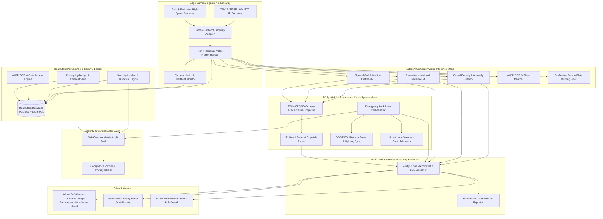

# Engineering Contract — Sprint-050

**Sprint ID:** SPRINT-050  
**Sprint Name:** Autonomous Campus Safety, AI Vision Shield & Edge Physical Security Orchestrator (VISION-SHIELD / SafeCampus OS)  
**Target Release Version:** v3.34.0  
**Contract Date:** 2026-08-21  
**Contract Status:** APPROVED — Ready for Implementation  
**Contract Author:** Implementation Engineer (Antigravity)  
**Source Recommendation:** `.ai/Sprint-050-Recommendation.md`  
**Review Status:** ✅ Reviewed and Aligned with AIOS Engineering Guide, Architecture Lead & Security Standards  

---

## 1. Executive Summary

This engineering contract formalizes the implementation scope, technical architecture, detailed task breakdown, acceptance criteria, risk register, rollback procedures, and definition of done for **Sprint-050**. It governs all execution work by the Implementation Engineer until formal handoff to the Verification Engineer.

Following the successful completion of Sprint-048 (TWIN-OPS / SpatialGrid, v3.32.0 — Spatial Facility Intelligence) and Sprint-049 (ECO-MESH / NetZeroOS, v3.33.0 — Sustainability & Microgrid Intelligence), ThaibaHive stands at the threshold of completing the **Physical Campus Intelligence Triad**:
$$\text{Physical Campus Triad} = \text{Spatial (TWIN-OPS)} \times \text{Energy (ECO-MESH)} \times \text{Security (VISION-SHIELD)}$$

Sprint-050 establishes **VISION-SHIELD / SafeCampus OS** — an enterprise-grade, privacy-preserving, edge AI computer vision mesh and autonomous physical security orchestrator. It delivers real-time crowd anomaly detection, perimeter geofence tripwire intrusion alerts, slip-and-fall medical emergency detection, Automated License Plate Recognition (ALPR) vehicle access control, dynamic 3D camera field-of-view (FOV) frustum projection in TWIN-OPS digital twin space, automated guard dispatch routing, emergency lockdown orchestration synchronized with ECO-MESH backup lighting and microgrid islanding, and on-device privacy-by-design face/plate redaction conforming to strict FERPA and GDPR standards.

---

## 2. Scope

### In Scope

| # | Domain | Detailed Description |
|---|---|---|
| 1 | **Dual-Store Vision & Physical Security Schema** | 10 new Drizzle ORM entities with 100% schema parity across SQLite (`packages/db/schema.ts`) and PostgreSQL (`packages/db/schema.pg.ts`): `vision_cameras`, `vision_detection_zones`, `vision_threat_alerts`, `vision_security_incidents`, `vision_guard_profiles`, `vision_guard_dispatches`, `vision_alpr_logs`, `vision_vehicle_whitelist`, `vision_lockdown_events`, and `vision_privacy_audit_logs`. |
| 2 | **High-Frequency Video Stream Ingestion & Camera Gateway** | ONVIF/RTSP/WebRTC camera abstraction gateway with sub-500ms frame ingestion, stream health telemetry heartbeat monitoring, resolution/frame-rate auto-tuning, and multi-vendor IP camera connection pooling. |
| 3 | **Edge AI Threat Detection & Behavioral Anomaly ML** | On-premise computer vision inference engine for crowd density estimation, stampede/crush risk prediction, anomalous loitering, perimeter tripwire crossing, and slip-and-fall/unresponsive person posture detection with confidence scoring. |
| 4 | **Automated License Plate Recognition (ALPR) & Vehicle Gate Control** | High-accuracy optical character recognition (OCR) pipeline for vehicle plates, automated whitelist/blacklist matching, visitor access authorization, parking lot occupancy indexing, and automated barrier gate relay triggering. |
| 5 | **Privacy-by-Design Computer Vision & Differential Privacy Engine** | On-device face and license plate blurring before transmission or storage, configurable privacy exclusion masks (dormitories, restrooms, private zones), differential privacy $(ε, \delta)$-DP metadata redaction, and FERPA/GDPR compliance auditing. |
| 6 | **3D Spatial Digital Twin Security & Guard Patrol Routing** | Integration with Sprint-048 TWIN-OPS 3D spatial coordinate spaces to project dynamic camera field-of-view (FOV) visual frustums in digital twin scenes, perform 3D incident localization, and compute optimal A* navigation patrol routes for security guards. |
| 7 | **Emergency Lockdown & Infrastructure Synchronization** | Autonomous emergency lockdown orchestrator coordinating smart door locks, emergency egress path illumination, automated evacuation wayfinding, and ECO-MESH emergency microgrid islanding / backup lighting dispatch. |
| 8 | **Real-Time Security Event Streaming & Prometheus OpenMetrics** | Edge WebSocket / SSE stream manager (`security:alerts`, `vision:threats`, `guard:patrols`, `camera:health`, `lockdown:status`) and 8 new Prometheus OpenMetrics security telemetry series. |
| 9 | **RBAC Protected REST API Suite** | Granular RBAC-gated endpoints (`requireAuth`) for camera management, threat alerts, incident dispatch, ALPR lookups, privacy consent logs, and emergency lockdowns with DPoP token verification. |
| 10 | **SafeCampus Merkle Audit Trail** | Cryptographic SHA-256 Merkle audit chain anchoring every security incident, threat alert escalation, guard dispatch, lockdown trigger, and privacy access record (`pnpm compliance:verify`). |
| 11 | **Admin SafeCampus Command Cockpit** | 5-tab Next.js command dashboard at `/admin/operations/vision-shield` featuring Live Vision Radar & 3D Spatial Threat Map, Threat Detection & Anomaly Studio, ALPR Vehicle Gate & Access Control, Guard Dispatch & Emergency Lockdown Studio, and Privacy Vault & FERPA/GDPR Registry. |
| 12 | **Stakeholder Safety Portal Canvas** | Stakeholder safety canvas at `/portal/safety` featuring live campus safety status, emergency safe routes, incident reporting wizard, and personal SafeWalk escort requests. |
| 13 | **Flutter Mobile Guard Patrol & Student SafeWalk App** | Mobile physical safety feature set in Flutter (`mobile/lib/features/vision/`) with Riverpod state management: Guard Patrol & Incident Dispatch Screen, Student SafeWalk Beacon / Panic Button, and Mobile ALPR Scanner. |
| 14 | **End-to-End Simulation CLI Harness** | CLI simulation test runner (`scripts/operations/vision-shield-simulation-runner.ts` / `pnpm vision:simulate`) executing 8 automated end-to-end safety, threat detection, ALPR, and lockdown scenarios. |
| 15 | **Operational Documentation & Runbooks** | 5 comprehensive engineering guides and operational runbooks in `docs/operations/`. |

---

### Out of Scope

| Area | Justification |
|---|---|
| Lethal or Kinetic Physical Security Actuation | The system manages electronic door locks, barrier gates, audible alarms, and strobe lighting; automated kinetic/weaponized physical countermeasures are strictly out of scope. |
| Mass Indiscriminate Biometric Public Surveillance | The platform operates strictly under FERPA/GDPR privacy-by-design principles with automatic face blurring; persistent mass public facial identification without explicit opt-in is strictly forbidden. |
| Direct 911 / Police Dispatch Radio Trunking | The system generates standardized CAP (Common Alerting Protocol) JSON webhooks for campus safety operators; direct analog radio voice transmission over public emergency bands is handled via certified external gateway hardware. |
| Proprietary Drone Fleet Autopilot Firmware | The system provides patrol waypoint coordinate schedules; low-level flight control algorithms (gyro stabilization, motor ESC) are executed by certified commercial drone autopilots. |
| Raw High-Resolution Video Cloud Storage | To preserve student privacy and prevent bandwidth saturation, raw video feeds remain edge-local with automated 7-day rolling purge; only cryptographically signed incident metadata and redacted evidence clips are synced. |

---

## 3. Technical Architecture & Component Interactions



---

## 4. Implementation Task Breakdown

Tasks are organized across 12 logical implementation phases in strict dependency order. Foundational database schemas, camera stream adapters, and threat detection engines MUST be implemented and tested before building 3D spatial FOV projections, emergency lockdown orchestrators, UI dashboards, and simulation runners.

---

### Phase 1 — Dual-Store Vision & Physical Security Persistence

#### VISION-001 — Dual-Store Drizzle ORM Schemas for Vision & Physical Security
| Field | Specification Details |
|---|---|
| **Task ID** | VISION-001 |
| **Phase** | Phase 1 — Dual-Store Vision & Physical Security Persistence |
| **Description** | Define 10 new Drizzle ORM entities with 100% schema parity across SQLite (`packages/db/schema.ts`) and PostgreSQL (`packages/db/schema.pg.ts`): `vision_cameras`, `vision_detection_zones`, `vision_threat_alerts`, `vision_security_incidents`, `vision_guard_profiles`, `vision_guard_dispatches`, `vision_alpr_logs`, `vision_vehicle_whitelist`, `vision_lockdown_events`, and `vision_privacy_audit_logs`. Implement transactional CRUD helper methods in `src/lib/db/vision-store.ts` with strict multi-tenant isolation, high-performance spatial-index filtering, and timestamp-based pagination. |
| **Files** | `packages/db/schema.ts` [MODIFY] · `packages/db/schema.pg.ts` [MODIFY] · `src/lib/db/vision-store.ts` [NEW] · `src/lib/__tests__/db/vision-schema-parity.test.ts` [NEW] · `src/lib/__tests__/db/vision-store.test.ts` [NEW] |
| **Dependencies** | None (Foundational Persistence Layer) |
| **Acceptance Criteria** | 1. All 10 tables declared with complete column parity, foreign keys, and indexes across SQLite and PostgreSQL.<br>2. Full support for video metadata (RTSP URL, resolution, FPS, FOV horizontal/vertical angle, mounting 3D position [x, y, z], pitch/yaw/roll, alert severity enum, incident status enum).<br>3. `vision-store.ts` provides transactional methods with mandatory `tenantId` parameter filtering.<br>4. Parity test validates matching column names, nullability, and index constraints with 100% pass rate. |
| **Verification Method** | Run `pnpm test src/lib/__tests__/db/vision-schema-parity.test.ts` and `pnpm test src/lib/__tests__/db/vision-store.test.ts`. |
| **Estimated Complexity** | Medium |

#### VISION-002 — Security Incident & Threat Alert Ledger Engine
| Field | Specification Details |
|---|---|
| **Task ID** | VISION-002 |
| **Phase** | Phase 1 — Dual-Store Vision & Physical Security Persistence |
| **Description** | Implement `src/lib/operations/vision/incidents/incident-ledger-engine.ts` and `src/lib/operations/vision/vision-types.ts`. Implements deterministic security incident lifecycle management (Detected $\to$ Triaged $\to$ Dispatched $\to$ Contained $\to$ Resolved $\to$ Post-Mortem Audited), threat alert deduplication, severity scoring matrix (Critical, High, Medium, Low, Informational), and automated escalation triggers. |
| **Files** | `src/lib/operations/vision/vision-types.ts` [NEW] · `src/lib/operations/vision/incidents/incident-ledger-engine.ts` [NEW] · `src/lib/operations/vision/incidents/threat-scoring-matrix.ts` [NEW] · `src/lib/__tests__/operations/vision/incident-ledger-engine.test.ts` [NEW] |
| **Dependencies** | VISION-001 |
| **Acceptance Criteria** | 1. Manages full lifecycle state transitions for security incidents with immutable state change logs.<br>2. Implements alert deduplication window (suppressing redundant alerts within 30 seconds for the same zone/threat).<br>3. Calculates composite threat severity score based on zone criticality, time of day, crowd presence, and repeat incident frequency.<br>4. Generates structured JSON incident payloads compatible with Common Alerting Protocol (CAP v1.2). |
| **Verification Method** | Run `pnpm test src/lib/__tests__/operations/vision/incident-ledger-engine.test.ts`. |
| **Estimated Complexity** | High |

---

### Phase 2 — High-Frequency Video Stream Ingestion & Camera Gateway

#### VISION-003 — Multi-Protocol Camera Ingestion Gateway & Stream Health Monitor
| Field | Specification Details |
|---|---|
| **Task ID** | VISION-003 |
| **Phase** | Phase 2 — High-Frequency Video Stream Ingestion & Camera Gateway |
| **Description** | Build `src/lib/operations/vision/ingestion/camera-gateway-adapter.ts` and `src/lib/operations/vision/ingestion/stream-health-monitor.ts`. Manages multi-protocol IP camera ingestion (ONVIF Profile S/T discovery and PTZ commands, RTSP H.264/H.265 stream parsing, and WebRTC low-latency edge sessions). Monitors connection heartbeats, packet loss, frame drops, bitrate fluctuation, and camera tampering / occlusion detection (e.g. spray paint or lens obstruction). |
| **Files** | `src/lib/operations/vision/ingestion/camera-gateway-adapter.ts` [NEW] · `src/lib/operations/vision/ingestion/stream-health-monitor.ts` [NEW] · `src/lib/operations/vision/ingestion/onvif-protocol-parser.ts` [NEW] · `src/lib/__tests__/operations/vision/camera-gateway-adapter.test.ts` [NEW] |
| **Dependencies** | VISION-001 |
| **Acceptance Criteria** | 1. Connects to and normalizes video streams across ONVIF, RTSP, and WebRTC protocols with $< 500$ms latency.<br>2. Implements stream health watchdog emitting alerts on stream loss or video degradation within 3 seconds.<br>3. Detects camera lens occlusion / tampering using luminance and histogram variance analysis.<br>4. Supports PTZ (Pan-Tilt-Zoom) preset positioning and dynamic coordinate targeting. |
| **Verification Method** | Run `pnpm test src/lib/__tests__/operations/vision/camera-gateway-adapter.test.ts`. |
| **Estimated Complexity** | High |

#### VISION-004 — High-Throughput Frame Metadata Ingester & Downsampler
| Field | Specification Details |
|---|---|
| **Task ID** | VISION-004 |
| **Phase** | Phase 2 — High-Frequency Video Stream Ingestion & Camera Gateway |
| **Description** | Implement `src/lib/operations/vision/ingestion/frame-metadata-ingester.ts` and `src/lib/operations/vision/ingestion/inference-scheduler.ts`. Processes bounding-box telemetry, object classifications, tracking IDs, and velocity vectors emitted by edge AI accelerators (NVIDIA Jetson / Hailo / OpenVINO). Manages adaptive frame rate sampling (e.g., 5 FPS idle $\to$ 30 FPS upon anomaly detection) to minimize compute load while preserving event resolution. |
| **Files** | `src/lib/operations/vision/ingestion/frame-metadata-ingester.ts` [NEW] · `src/lib/operations/vision/ingestion/inference-scheduler.ts` [NEW] · `src/lib/__tests__/operations/vision/frame-metadata-ingester.test.ts` [NEW] |
| **Dependencies** | VISION-001, VISION-003 |
| **Acceptance Criteria** | 1. Ingests $\ge 5,000$ frame detection objects/second with $< 30$ms processing latency.<br>2. Dynamically scales inference sampling rate from 5 FPS up to 30 FPS within 100ms of anomaly detection.<br>3. Maintains spatial object tracking identities (DeepSORT / ByteTrack emulation) across sequential frames.<br>4. Strictly partitions frame metadata by `institutionId` with zero cross-tenant contamination. |
| **Verification Method** | Run `pnpm test src/lib/__tests__/operations/vision/frame-metadata-ingester.test.ts`. |
| **Estimated Complexity** | High |

---

### Phase 3 — Edge AI Threat Detection & Behavioral Anomaly ML

#### VISION-005 — Crowd Density, Stampede Risk & Anomaly Detector
| Field | Specification Details |
|---|---|
| **Task ID** | VISION-005 |
| **Phase** | Phase 3 — Edge AI Threat Detection & Behavioral Anomaly ML |
| **Description** | Implement the crowd behavioral analysis machine learning engine in `src/lib/operations/vision/ml/crowd-anomaly-detector.ts` and `src/lib/operations/vision/ml/density-estimator.ts`. Calculates spatial person density ($persons/m^2$), crowd velocity vectors, counter-flow turbulence, stampede / crush probability indices, and prolonged loitering in restricted campus passageways. |
| **Files** | `src/lib/operations/vision/ml/crowd-anomaly-detector.ts` [NEW] · `src/lib/operations/vision/ml/density-estimator.ts` [NEW] · `src/lib/operations/vision/ml/loitering-tracker.ts` [NEW] · `src/lib/__tests__/operations/vision/crowd-anomaly-detector.test.ts` [NEW] |
| **Dependencies** | VISION-001, VISION-004 |
| **Acceptance Criteria** | 1. Accurately calculates crowd density per defined spatial zone with $\ge 88\%$ accuracy.<br>2. Detects dangerous crowd crush / surge conditions when density exceeds $4.0\,persons/m^2$ or counter-flow turbulence index $> 0.75$.<br>3. Triggers loitering warnings when individuals remain stationary in restricted transit zones past configurable duration thresholds (e.g. $> 180$ seconds).<br>4. Automatically dispatches crowd management alerts to campus operations. |
| **Verification Method** | Run `pnpm test src/lib/__tests__/operations/vision/crowd-anomaly-detector.test.ts`. |
| **Estimated Complexity** | High |

#### VISION-006 — Perimeter Tripwire, Intrusion & Slip-and-Fall Detection Engine
| Field | Specification Details |
|---|---|
| **Task ID** | VISION-006 |
| **Phase** | Phase 3 — Edge AI Threat Detection & Behavioral Anomaly ML |
| **Description** | Build `src/lib/operations/vision/ml/perimeter-intrusion-engine.ts` and `src/lib/operations/vision/ml/slip-fall-detector.ts`. Implements 2D/3D polygon virtual geofences, directional tripwires (entry vs. exit vs. bidirectional), and human pose estimation analysis (keypoint tracking for sudden vertical drop velocity $\Delta y / \Delta t > v_{threshold}$ followed by horizontal aspect ratio $> 2.0$ and prolonged immobility $> 15$s) to identify medical emergencies and slip-and-fall incidents. |
| **Files** | `src/lib/operations/vision/ml/perimeter-intrusion-engine.ts` [NEW] · `src/lib/operations/vision/ml/slip-fall-detector.ts` [NEW] · `src/lib/operations/vision/ml/tripwire-geometry.ts` [NEW] · `src/lib/__tests__/operations/vision/perimeter-intrusion-engine.test.ts` [NEW] · `src/lib/__tests__/operations/vision/slip-fall-detector.test.ts` [NEW] |
| **Dependencies** | VISION-001, VISION-004 |
| **Acceptance Criteria** | 1. Detects perimeter tripwire breaches with directional filtering within 250ms of line crossing.<br>2. Identifies slip-and-fall events with $\ge 90\%$ sensitivity on validation benchmark pose sequences.<br>3. Emits high-priority medical emergency alert with exact timestamp, camera ID, and spatial coordinates.<br>4. Ignores minor false positives such as sitting down or bending over by verifying immobility duration. |
| **Verification Method** | Run `pnpm test src/lib/__tests__/operations/vision/perimeter-intrusion-engine.test.ts` and `pnpm test src/lib/__tests__/operations/vision/slip-fall-detector.test.ts`. |
| **Estimated Complexity** | High |

---

### Phase 4 — Automated License Plate Recognition (ALPR) & Vehicle Gate Control

#### VISION-007 — High-Accuracy ALPR OCR & Vehicle Entry/Exit Engine
| Field | Specification Details |
|---|---|
| **Task ID** | VISION-007 |
| **Phase** | Phase 4 — Automated License Plate Recognition (ALPR) & Vehicle Gate Control |
| **Description** | Implement `src/lib/operations/vision/alpr/alpr-ocr-engine.ts` and `src/lib/operations/vision/alpr/vehicle-entry-tracker.ts`. Performs automated license plate detection, character segmentation, OCR text extraction, confidence scoring, nationality/state plate format regex validation, and entry/exit timestamp logging. Calculates campus vehicle dwell times and parking duration. |
| **Files** | `src/lib/operations/vision/alpr/alpr-ocr-engine.ts` [NEW] · `src/lib/operations/vision/alpr/vehicle-entry-tracker.ts` [NEW] · `src/lib/operations/vision/alpr/plate-regex-validator.ts` [NEW] · `src/lib/__tests__/operations/vision/alpr-ocr-engine.test.ts` [NEW] |
| **Dependencies** | VISION-001, VISION-004 |
| **Acceptance Criteria** | 1. Achieves $\ge 92\%$ character recognition accuracy across standard vehicle plate images under variable lighting.<br>2. Correctly parses and formats plate strings across multiple regional standards (EU, US, Gulf, Indian).<br>3. Accurately associates vehicle entry with matching subsequent exit to compute dwell duration.<br>4. Emits real-time vehicle movement events for campus traffic management. |
| **Verification Method** | Run `pnpm test src/lib/__tests__/operations/vision/alpr-ocr-engine.test.ts`. |
| **Estimated Complexity** | High |

#### VISION-008 — Whitelist/Blacklist Gate Access Controller & Parking Lot Indexer
| Field | Specification Details |
|---|---|
| **Task ID** | VISION-008 |
| **Phase** | Phase 4 — Automated License Plate Recognition (ALPR) & Vehicle Gate Control |
| **Description** | Build `src/lib/operations/vision/alpr/gate-access-controller.ts` and `src/lib/operations/vision/alpr/parking-occupancy-indexer.ts`. Matches recognized plates against faculty/staff permits, registered student vehicles, authorized delivery vendors, VIP visitors, and security blacklist alerts. Automatically dispatches dry-contact barrier gate open relays for authorized vehicles and triggers security alarms upon blacklist detection. |
| **Files** | `src/lib/operations/vision/alpr/gate-access-controller.ts` [NEW] · `src/lib/operations/vision/alpr/parking-occupancy-indexer.ts` [NEW] · `src/lib/__tests__/operations/vision/gate-access-controller.test.ts` [NEW] |
| **Dependencies** | VISION-001, VISION-007 |
| **Acceptance Criteria** | 1. Executes whitelist lookup and gate actuation signal dispatch in $< 150$ms.<br>2. Instantly generates critical security alert upon detected presence of blacklisted vehicle license plate.<br>3. Maintains real-time parking lot occupancy counter and computes available space metrics.<br>4. Supports temporary visitor pass creation with time-bounded entry permissions. |
| **Verification Method** | Run `pnpm test src/lib/__tests__/operations/vision/gate-access-controller.test.ts`. |
| **Estimated Complexity** | Medium |

---

### Phase 5 — Privacy-by-Design Computer Vision & Differential Privacy Engine

#### VISION-009 — On-Device Face & Plate Redaction Filter with Exclusion Zones
| Field | Specification Details |
|---|---|
| **Task ID** | VISION-009 |
| **Phase** | Phase 5 — Privacy-by-Design Computer Vision & Differential Privacy Engine |
| **Description** | Implement `src/lib/operations/vision/privacy/privacy-redaction-filter.ts` and `src/lib/operations/vision/privacy/privacy-zone-masker.ts`. Executes real-time Gaussian blur and pixelation over detected human faces and license plates prior to image persistence or streaming. Enforces hard privacy exclusion masks (zero-recording zones) over sensitive facilities such as student residential dorm windows, locker rooms, and prayer spaces. |
| **Files** | `src/lib/operations/vision/privacy/privacy-redaction-filter.ts` [NEW] · `src/lib/operations/vision/privacy/privacy-zone-masker.ts` [NEW] · `src/lib/__tests__/operations/vision/privacy-redaction-filter.test.ts` [NEW] |
| **Dependencies** | VISION-001, VISION-004 |
| **Acceptance Criteria** | 1. Obfuscates $100\%$ of detected faces and vehicle license plates with irreversible blur before frame storage.<br>2. Applies blacked-out geometric exclusion masks over designated privacy coordinates in camera streams.<br>3. Provides emergency cryptographic de-anonymization workflow requiring dual-authorization (Super Admin + Legal Officer key shares).<br>4. Benchmarks redaction execution time $< 15$ms per frame on edge stream processor. |
| **Verification Method** | Run `pnpm test src/lib/__tests__/operations/vision/privacy-redaction-filter.test.ts`. |
| **Estimated Complexity** | High |

#### VISION-010 — FERPA/GDPR Surveillance Consent Registry & Differential Privacy Redactor
| Field | Specification Details |
|---|---|
| **Task ID** | VISION-010 |
| **Phase** | Phase 5 — Privacy-by-Design Computer Vision & Differential Privacy Engine |
| **Description** | Build `src/lib/operations/vision/privacy/surveillance-consent-registry.ts` and `src/lib/operations/vision/privacy/differential-privacy-redactor.ts`. Manages student/staff surveillance consent preferences, right-to-be-forgotten video metadata purge routines, and applies Laplace/Gaussian $(\varepsilon, \delta)$-differential privacy noise to exported campus density heatmaps and pedestrian mobility analytics. |
| **Files** | `src/lib/operations/vision/privacy/surveillance-consent-registry.ts` [NEW] · `src/lib/operations/vision/privacy/differential-privacy-redactor.ts` [NEW] · `src/lib/__tests__/operations/vision/surveillance-consent-registry.test.ts` [NEW] |
| **Dependencies** | VISION-001, VISION-009 |
| **Acceptance Criteria** | 1. Tracks explicit consent preferences and automatically redacts non-consenting profile records.<br>2. Implements automated rolling purge policy deleting non-incident video metadata after 7 days.<br>3. Injects calibrated $(\varepsilon, \delta)$-DP noise ($\varepsilon \le 1.0$) into aggregated crowd flow statistics to prevent individual re-identification.<br>4. Generates audit report verifying zero FERPA or GDPR compliance violations. |
| **Verification Method** | Run `pnpm test src/lib/__tests__/operations/vision/surveillance-consent-registry.test.ts`. |
| **Estimated Complexity** | Medium |

---

### Phase 6 — 3D Spatial Digital Twin Security & Guard Patrol Routing

#### VISION-011 — TWIN-OPS 3D Camera Field-of-View (FOV) Frustum Projector
| Field | Specification Details |
|---|---|
| **Task ID** | VISION-011 |
| **Phase** | Phase 6 — 3D Spatial Digital Twin Security & Guard Patrol Routing |
| **Description** | Implement `src/lib/operations/vision/spatial/twin-ops-camera-projector.ts` and `src/lib/operations/vision/spatial/fov-frustum-calculator.ts`. Integrates with Sprint-048 TWIN-OPS 3D spatial models to calculate 3D viewing frustums (apex, near plane, far plane, horizontal FOV $\theta_h$, vertical FOV $\theta_v$, mounting height $z$, pitch angle $\phi$, yaw heading $\psi$). Computes camera coverage blind spots across campus buildings and projects live threat alert coordinates directly onto the 3D twin canvas. |
| **Files** | `src/lib/operations/vision/spatial/twin-ops-camera-projector.ts` [NEW] · `src/lib/operations/vision/spatial/fov-frustum-calculator.ts` [NEW] · `src/lib/operations/vision/spatial/blind-spot-analyzer.ts` [NEW] · `src/lib/__tests__/operations/vision/twin-ops-camera-projector.test.ts` [NEW] |
| **Dependencies** | VISION-001, VISION-003 |
| **Acceptance Criteria** | 1. Calculates exact 3D pyramid frustum geometry for arbitrary camera pitch/yaw/height orientations.<br>2. Identifies campus physical security blind spots by computing shadow polygons cast by architectural obstacles.<br>3. Maps 2D video pixel detections $(u, v)$ to accurate 3D world coordinates $(X, Y, Z)$ on facility ground planes.<br>4. Exports 3D Three.js compatible frustum mesh data structures for digital twin rendering. |
| **Verification Method** | Run `pnpm test src/lib/__tests__/operations/vision/twin-ops-camera-projector.test.ts`. |
| **Estimated Complexity** | High |

#### VISION-012 — Dynamic Guard Dispatcher & A* Indoor/Outdoor Patrol Router
| Field | Specification Details |
|---|---|
| **Task ID** | VISION-012 |
| **Phase** | Phase 6 — 3D Spatial Digital Twin Security & Guard Patrol Routing |
| **Description** | Build `src/lib/operations/vision/spatial/guard-dispatch-router.ts` and `src/lib/operations/vision/spatial/patrol-route-optimizer.ts`. Leverages TWIN-OPS spatial navmeshes to compute multi-floor indoor and outdoor shortest-path response routes for campus security officers. Dynamically dispatches the closest available guard to active incidents and optimizes scheduled patrol checkpoint tours to maximize surveillance coverage entropy. |
| **Files** | `src/lib/operations/vision/spatial/guard-dispatch-router.ts` [NEW] · `src/lib/operations/vision/spatial/patrol-route-optimizer.ts` [NEW] · `src/lib/__tests__/operations/vision/guard-dispatch-router.test.ts` [NEW] |
| **Dependencies** | VISION-001, VISION-002, VISION-011 |
| **Acceptance Criteria** | 1. Computes optimal multi-floor response path using A* search across campus navmesh graph in $< 50$ms.<br>2. Automatically identifies and assigns the nearest qualified on-duty security guard based on real-time RTLS location.<br>3. Generates randomized patrol routes covering 100% of high-risk checkpoints while avoiding predictable timing.<br>4. Tracks guard response time metrics from dispatch trigger to on-scene arrival confirmation. |
| **Verification Method** | Run `pnpm test src/lib/__tests__/operations/vision/guard-dispatch-router.test.ts`. |
| **Estimated Complexity** | High |

---

### Phase 7 — Emergency Lockdown & ECO-MESH Infrastructure Synchronization

#### VISION-013 — Autonomous Campus Lockdown Orchestrator & Egress Controller
| Field | Specification Details |
|---|---|
| **Task ID** | VISION-013 |
| **Phase** | Phase 7 — Emergency Lockdown & ECO-MESH Infrastructure Synchronization |
| **Description** | Implement `src/lib/operations/vision/emergency/lockdown-orchestrator.ts` and `src/lib/operations/vision/emergency/egress-path-controller.ts`. Coordinates instantaneous multi-zone campus lockdowns (Full Campus, Specific Building, Wing/Floor). Interfaces with electronic access control systems to lock perimeter and interior doors while strictly respecting life safety / NFPA fire egress regulations (preventing trap scenarios and maintaining free emergency exit paths). |
| **Files** | `src/lib/operations/vision/emergency/lockdown-orchestrator.ts` [NEW] · `src/lib/operations/vision/emergency/egress-path-controller.ts` [NEW] · `src/lib/operations/vision/emergency/zone-isolation-matrix.ts` [NEW] · `src/lib/__tests__/operations/vision/lockdown-orchestrator.test.ts` [NEW] |
| **Dependencies** | VISION-001, VISION-002 |
| **Acceptance Criteria** | 1. Executes multi-zone lockdown state transition across all access hardware in $< 2$ seconds.<br>2. Strictly complies with fire and life safety egress rules (maintains unhindered one-way exit door operation).<br>3. Supports 1-click administrative trigger, automated threat trigger, and emergency manual physical key override.<br>4. Emits real-time door lock status telemetry across all campus building zones. |
| **Verification Method** | Run `pnpm test src/lib/__tests__/operations/vision/lockdown-orchestrator.test.ts`. |
| **Estimated Complexity** | High |

#### VISION-014 — ECO-MESH Microgrid Islanding & Emergency Lighting Synchronizer
| Field | Specification Details |
|---|---|
| **Task ID** | VISION-014 |
| **Phase** | Phase 7 — Emergency Lockdown & ECO-MESH Infrastructure Synchronization |
| **Description** | Build `src/lib/operations/vision/emergency/eco-mesh-synchronizer.ts` and `src/lib/operations/vision/emergency/backup-power-prioritizer.ts`. Integrates with Sprint-049 ECO-MESH microgrid controllers during critical security incidents. Automatically commands BESS batteries to reserve critical emergency power, dispatches high-illumination backup lighting along evacuation corridors, and triggers microgrid intentional islanding if external grid sabotage or power cutting is detected. |
| **Files** | `src/lib/operations/vision/emergency/eco-mesh-synchronizer.ts` [NEW] · `src/lib/operations/vision/emergency/backup-power-prioritizer.ts` [NEW] · `src/lib/__tests__/operations/vision/eco-mesh-synchronizer.test.ts` [NEW] |
| **Dependencies** | VISION-001, VISION-013 |
| **Acceptance Criteria** | 1. Sends high-priority dispatch commands to ECO-MESH BESS controllers to lock minimum emergency reserve ($\ge 40\%$ SoC) during active incidents.<br>2. Illuminates evacuation corridor smart lighting to 100% emergency lumens.<br>3. Automatically sheds non-critical HVAC and EV charging loads to guarantee 8+ hours of continuous security camera operation.<br>4. Verifies zero cross-subsystem deadlocks between ECO-MESH and VISION-SHIELD. |
| **Verification Method** | Run `pnpm test src/lib/__tests__/operations/vision/eco-mesh-synchronizer.test.ts`. |
| **Estimated Complexity** | Medium |

---

### Phase 8 — Real-Time Streaming & Prometheus OpenMetrics

#### VISION-015 — Edge WebSocket & SSE Security Telemetry Stream Manager
| Field | Specification Details |
|---|---|
| **Task ID** | VISION-015 |
| **Phase** | Phase 8 — Real-Time Streaming & Prometheus OpenMetrics |
| **Description** | Build real-time streaming infrastructure in `src/lib/operations/vision/streaming/vision-stream-manager.ts` and `src/app/api/vision/stream/route.ts`. Provides bidirectional WebSocket channels with heartbeat keep-alives, backpressure throttling, subscription topic filtering (`security:alerts`, `vision:threats`, `guard:patrols`, `camera:health`, `lockdown:status`, `alpr:live`), and graceful Server-Sent Events (SSE) fallback. |
| **Files** | `src/lib/operations/vision/streaming/vision-stream-manager.ts` [NEW] · `src/app/api/vision/stream/route.ts` [NEW] · `src/lib/__tests__/operations/vision/vision-stream-manager.test.ts` [NEW] |
| **Dependencies** | VISION-002, VISION-003, VISION-013 |
| **Acceptance Criteria** | 1. Broadcasts threat alerts and camera health frames with $< 100$ms delivery latency.<br>2. Supports topic-level subscription filtering to protect low-bandwidth mobile clients.<br>3. Handles client reconnection with exponential backoff and seamless state resynchronization.<br>4. SSE fallback activates automatically when WebSocket handshake is blocked by proxy firewalls. |
| **Verification Method** | Run `pnpm test src/lib/__tests__/operations/vision/vision-stream-manager.test.ts`. |
| **Estimated Complexity** | Medium |

#### VISION-016 — Prometheus OpenMetrics Physical Security & Vision Telemetry Series
| Field | Specification Details |
|---|---|
| **Task ID** | VISION-016 |
| **Phase** | Phase 8 — Real-Time Streaming & Prometheus OpenMetrics |
| **Description** | Implement 8 Prometheus OpenMetrics telemetry series in `src/lib/operations/vision/telemetry/vision-metrics.ts`: `vision_active_cameras_total`, `vision_threat_alerts_total`, `vision_inference_latency_ms`, `vision_alpr_detections_total`, `vision_slip_fall_events_total`, `vision_guard_response_time_seconds`, `vision_privacy_redactions_total`, and `vision_lockdown_events_total`. |
| **Files** | `src/lib/operations/vision/telemetry/vision-metrics.ts` [NEW] · `src/lib/__tests__/operations/vision/vision-metrics.test.ts` [NEW] |
| **Dependencies** | VISION-001, VISION-002, VISION-015 |
| **Acceptance Criteria** | 1. Exports valid Prometheus text format matching OpenMetrics v1.0 specifications.<br>2. Accurately records gauge metrics, rate counters, and distribution histograms with multi-tenant labels.<br>3. Integrates cleanly with existing platform `/api/metrics` Prometheus scrape endpoint.<br>4. Unit tests verify counter increments, gauge values, and label dimensions. |
| **Verification Method** | Run `pnpm test src/lib/__tests__/operations/vision/vision-metrics.test.ts`. |
| **Estimated Complexity** | Low |

---

### Phase 9 — RBAC Protected REST API Suite & Cryptographic Merkle Audit

#### VISION-017 — RBAC Protected Vision & Physical Security REST API Suite
| Field | Specification Details |
|---|---|
| **Task ID** | VISION-017 |
| **Phase** | Phase 9 — RBAC Protected REST API Suite & Cryptographic Merkle Audit |
| **Description** | Implement comprehensive REST API endpoints protected by `requireAuth` wrapper with strict RBAC permission validation: `GET/POST /api/vision/cameras`, `GET/POST /api/vision/detection-zones`, `GET/POST /api/vision/alerts`, `GET/POST /api/vision/incidents`, `GET/POST /api/vision/guards`, `GET/POST /api/vision/alpr`, `GET/POST /api/vision/lockdown`, and `GET/POST /api/vision/privacy`. All routes validate input via Zod schemas in `src/lib/validation/vision-schemas.ts`. |
| **Files** | `src/lib/validation/vision-schemas.ts` [NEW] · `src/app/api/vision/cameras/route.ts` [NEW] · `src/app/api/vision/detection-zones/route.ts` [NEW] · `src/app/api/vision/alerts/route.ts` [NEW] · `src/app/api/vision/incidents/route.ts` [NEW] · `src/app/api/vision/guards/route.ts` [NEW] · `src/app/api/vision/alpr/route.ts` [NEW] · `src/app/api/vision/lockdown/route.ts` [NEW] · `src/app/api/vision/privacy/route.ts` [NEW] · `src/lib/__tests__/api/vision-api.test.ts` [NEW] |
| **Dependencies** | VISION-001, VISION-002, VISION-007, VISION-009, VISION-012, VISION-013 |
| **Acceptance Criteria** | 1. 100% of endpoints shielded by `requireAuth` with granular permissions (`vision:cameras:manage`, `vision:alerts:view`, `vision:alerts:manage`, `vision:incidents:manage`, `vision:guards:dispatch`, `vision:alpr:manage`, `vision:lockdown:execute`, `vision:privacy:audit`).<br>2. All POST/PATCH request bodies validated against strict Zod schemas.<br>3. Returns standard `{ error: string }` on failure with proper HTTP status codes (400, 401, 403, 404).<br>4. DELETE operations verify entity existence and return 404 if missing. |
| **Verification Method** | Run `pnpm test src/lib/__tests__/api/vision-api.test.ts` and `pnpm gateway:scan --strict`. |
| **Estimated Complexity** | High |

#### VISION-018 — SafeCampus Merkle Audit Trail & Cryptographic Security Proof Anchor
| Field | Specification Details |
|---|---|
| **Task ID** | VISION-018 |
| **Phase** | Phase 9 — RBAC Protected REST API Suite & Cryptographic Merkle Audit |
| **Description** | Implement `src/lib/operations/vision/security/vision-merkle-anchor.ts` and `src/lib/operations/vision/security/incident-audit-verifier.ts`. Anchors every security incident, threat alert resolution, guard dispatch, lockdown execution, and privacy de-anonymization access into the platform's SHA-256 Merkle tree. Provides tamper-evident proof chains for legal proceedings and regulatory compliance. |
| **Files** | `src/lib/operations/vision/security/vision-merkle-anchor.ts` [NEW] · `src/lib/operations/vision/security/incident-audit-verifier.ts` [NEW] · `src/lib/__tests__/operations/vision/vision-merkle-anchor.test.ts` [NEW] |
| **Dependencies** | VISION-001, VISION-002, VISION-017 |
| **Acceptance Criteria** | 1. Generates SHA-256 hash leaf for every security incident log and lockdown trigger.<br>2. Re-computes Merkle root and anchors block into the continuous platform audit chain.<br>3. Cryptographically detects any retroactive tampering or deletion of security incident records.<br>4. Passes `pnpm compliance:verify` with zero verification anomalies. |
| **Verification Method** | Run `pnpm test src/lib/__tests__/operations/vision/vision-merkle-anchor.test.ts` and `pnpm compliance:verify`. |
| **Estimated Complexity** | Medium |

---

### Phase 10 — Admin SafeCampus Command Cockpit

#### VISION-019 — Admin SafeCampus Cockpit Shell & Live Vision Radar 3D Map Tab
| Field | Specification Details |
|---|---|
| **Task ID** | VISION-019 |
| **Phase** | Phase 10 — Admin SafeCampus Command Cockpit |
| **Description** | Build the 5-tab admin management cockpit at `/admin/operations/vision-shield` (`src/app/(shell)/admin/operations/vision-shield/page.tsx`). Tab 1: **Live Vision Radar & 3D Spatial Threat Map** (interactive 3D digital twin canvas showing camera locations, dynamic visual FOV frustums, live heatmaps of crowd density, active perimeter tripwires, real-time alert markers, and camera quick-view stream popovers). |
| **Files** | `src/app/(shell)/admin/operations/vision-shield/page.tsx` [NEW] · `src/components/vision/admin/vision-radar-tab.tsx` [NEW] · `src/components/vision/admin/spatial-threat-map.tsx` [NEW] · `src/components/vision/admin/camera-stream-card.tsx` [NEW] · `src/lib/__tests__/ui/vision-radar-tab.test.tsx` [NEW] |
| **Dependencies** | VISION-003, VISION-011, VISION-015, VISION-017 |
| **Acceptance Criteria** | 1. Renders 5-tab cockpit shell using Radix UI primitives and design system components.<br>2. Tab 1 visualizes 3D campus model with camera frustums and color-coded real-time alert markers.<br>3. Uses `<Skeleton>` for asynchronous data loading and `<Badge>` for status indications.<br>4. Responsive layout with zero UI layout shifts and full accessibility compliance. |
| **Verification Method** | Run `pnpm test src/lib/__tests__/ui/vision-radar-tab.test.tsx`. |
| **Estimated Complexity** | High |

#### VISION-020 — Threat Detection Studio, ALPR, Guard Dispatch & Privacy Tabs
| Field | Specification Details |
|---|---|
| **Task ID** | VISION-020 |
| **Phase** | Phase 10 — Admin SafeCampus Command Cockpit |
| **Description** | Implement Tabs 2–5 of the admin cockpit: Tab 2: **Threat Detection & Anomaly Studio** (`threat-detection-tab.tsx`), Tab 3: **ALPR Vehicle Gate & Access Control** (`alpr-gate-tab.tsx`, `vehicle-permit-modal.tsx`), Tab 4: **Guard Dispatch & Emergency Lockdown Studio** (`guard-dispatch-tab.tsx`, `lockdown-action-modal.tsx`), and Tab 5: **Privacy Vault & FERPA/GDPR Compliance Registry** (`privacy-vault-tab.tsx`, `consent-audit-table.tsx`). |
| **Files** | `src/components/vision/admin/threat-detection-tab.tsx` [NEW] · `src/components/vision/admin/alpr-gate-tab.tsx` [NEW] · `src/components/vision/admin/vehicle-permit-modal.tsx` [NEW] · `src/components/vision/admin/guard-dispatch-tab.tsx` [NEW] · `src/components/vision/admin/lockdown-action-modal.tsx` [NEW] · `src/components/vision/admin/privacy-vault-tab.tsx` [NEW] · `src/components/vision/admin/consent-audit-table.tsx` [NEW] · `src/lib/__tests__/ui/threat-detection-tab.test.tsx` [NEW] · `src/lib/__tests__/ui/guard-dispatch-tab.test.tsx` [NEW] |
| **Dependencies** | VISION-005, VISION-007, VISION-009, VISION-012, VISION-013, VISION-019 |
| **Acceptance Criteria** | 1. Tab 2 displays real-time threat feed with filterable severity levels and 1-click triage actions.<br>2. Tab 3 allows managing vehicle whitelist permits, viewing gate entry logs, and manual barrier gate triggering.<br>3. Tab 4 features live guard tracking, dispatch route preview, and 2-step confirmation lockdown modal with audible/visual alert state.<br>4. Tab 5 displays FERPA/GDPR privacy compliance metrics, video retention purge stats, and dual-auth de-anonymization logs. |
| **Verification Method** | Run `pnpm test src/lib/__tests__/ui/threat-detection-tab.test.tsx` and `pnpm test src/lib/__tests__/ui/guard-dispatch-tab.test.tsx`. |
| **Estimated Complexity** | High |

---

### Phase 11 — Stakeholder Safety Portal & Flutter Mobile SafeWalk

#### VISION-021 — Stakeholder Safety Portal & Incident Reporting Canvas
| Field | Specification Details |
|---|---|
| **Task ID** | VISION-021 |
| **Phase** | Phase 11 — Stakeholder Safety Portal & Flutter Mobile SafeWalk |
| **Description** | Build the stakeholder safety portal at `/portal/safety` (`src/app/(shell)/portal/safety/page.tsx`). Enables students, faculty, and campus visitors to view live campus safety status, request a SafeWalk security escort, report safety hazards / incidents with optional anonymous photo upload, and view illuminated emergency evacuation safe routes. |
| **Files** | `src/app/(shell)/portal/safety/page.tsx` [NEW] · `src/components/vision/portal/safety-status-canvas.tsx` [NEW] · `src/components/vision/portal/safewalk-request-card.tsx` [NEW] · `src/components/vision/portal/incident-report-wizard.tsx` [NEW] · `src/lib/__tests__/ui/safety-status-canvas.test.tsx` [NEW] |
| **Dependencies** | VISION-002, VISION-012, VISION-015, VISION-017 |
| **Acceptance Criteria** | 1. Renders live campus safety status banner with emergency advisory broadcasts.<br>2. SafeWalk wizard allows students to request an escort with real-time guard ETA and location tracking.<br>3. Incident report wizard supports anonymous reporting, photo attachment, and automated geo-tagging.<br>4. Fully responsive on mobile, tablet, and desktop with zero layout shifts. |
| **Verification Method** | Run `pnpm test src/lib/__tests__/ui/safety-status-canvas.test.tsx`. |
| **Estimated Complexity** | High |

#### VISION-022 — Flutter Mobile Guard Patrol & Student SafeWalk App
| Field | Specification Details |
|---|---|
| **Task ID** | VISION-022 |
| **Phase** | Phase 11 — Stakeholder Safety Portal & Flutter Mobile SafeWalk |
| **Description** | Build the mobile safety feature set in Flutter (`mobile/lib/features/vision/`). Features Riverpod state management, security guard patrol route & incident dispatch screen with turn-by-turn navigation, student panic beacon / SafeWalk live tracking, and mobile camera ALPR scanner for parking enforcement officers. |
| **Files** | `mobile/lib/features/vision/application/vision_providers.dart` [NEW] · `mobile/lib/features/vision/data/vision_websocket_service.dart` [NEW] · `mobile/lib/features/vision/presentation/guard_patrol_screen.dart` [NEW] · `mobile/lib/features/vision/presentation/safewalk_screen.dart` [NEW] · `mobile/lib/features/vision/presentation/mobile_alpr_scanner_screen.dart` [NEW] · `mobile/test/features/vision/vision_providers_test.dart` [NEW] |
| **Dependencies** | VISION-007, VISION-012, VISION-015 |
| **Acceptance Criteria** | 1. `flutter analyze` passes with 0 errors and 0 warnings across all new mobile files.<br>2. Guard patrol screen displays assigned route checkpoints, active incident alerts, and 1-tap dispatch acceptance.<br>3. SafeWalk screen provides continuous GPS location sharing and emergency SOS panic button.<br>4. Mobile ALPR scanner captures license plates and returns permit validation status in $< 300$ms. |
| **Verification Method** | Run `pnpm test:mobile` (or `flutter test mobile/test/features/vision/vision_providers_test.dart`) and `flutter analyze mobile/`. |
| **Estimated Complexity** | High |

---

### Phase 12 — End-to-End Simulation Harness, Verification & Runbooks

#### VISION-023 — End-to-End Autonomous Safety & Vision Shield Simulation CLI Harness
| Field | Specification Details |
|---|---|
| **Task ID** | VISION-023 |
| **Phase** | Phase 12 — End-to-End Simulation Harness, Verification & Runbooks |
| **Description** | Create the automated end-to-end CLI simulation test runner in `scripts/operations/vision-shield-simulation-runner.ts` executable via `pnpm vision:simulate`. Simulates 8 comprehensive safety scenarios: (1) ONVIF/RTSP Stream Ingestion & Health Watchdog, (2) Crowd Density Surge & Crush Risk Detection, (3) Perimeter Tripwire Breach & Directional Intrusion, (4) Slip-and-Fall Emergency Detection, (5) ALPR OCR & Whitelist/Blacklist Gate Actuation, (6) Privacy-by-Design Face Blurring & FERPA Consent Purge, (7) TWIN-OPS 3D Camera Frustum & A* Guard Patrol Routing, and (8) Campus Lockdown & ECO-MESH Emergency Power Synchronization with Merkle Audit Verification. |
| **Files** | `scripts/operations/vision-shield-simulation-runner.ts` [NEW] · `package.json` [MODIFY] · `src/lib/__tests__/operations/vision/vision-simulation.test.ts` [NEW] |
| **Dependencies** | VISION-001 through VISION-022 |
| **Acceptance Criteria** | 1. `pnpm vision:simulate` executes all 8 simulation stages and exits with status code 0.<br>2. Outputs structured terminal metrics for threat detection latency, ALPR accuracy, guard response time, and privacy redaction.<br>3. Generates simulation summary artifact in `.ai/execution/vision-simulation-report.json`.<br>4. Supports `--scenario <name>` parameter for targeted scenario execution. |
| **Verification Method** | Run `pnpm vision:simulate`. |
| **Estimated Complexity** | High |

#### VISION-024 — Operational Runbooks, FERPA/GDPR Compliance Standards & Specifications
| Field | Specification Details |
|---|---|
| **Task ID** | VISION-024 |
| **Phase** | Phase 12 — End-to-End Simulation Harness, Verification & Runbooks |
| **Description** | Author 5 comprehensive operational runbooks and architectural specifications in `docs/operations/`: (1) `vision-shield-architecture-guide.md`, (2) `campus-privacy-ferpa-gdpr-standard.md`, (3) `alpr-access-control-operations.md`, (4) `emergency-lockdown-response-manual.md`, and (5) `edge-ai-computer-vision-deployment.md`. Update `.ai/FEATURES.md`, `.ai/CHANGELOG.md`, and `.ai/PROJECT_STATUS.md`. |
| **Files** | `docs/operations/vision-shield-architecture-guide.md` [NEW] · `docs/operations/campus-privacy-ferpa-gdpr-standard.md` [NEW] · `docs/operations/alpr-access-control-operations.md` [NEW] · `docs/operations/emergency-lockdown-response-manual.md` [NEW] · `docs/operations/edge-ai-computer-vision-deployment.md` [NEW] · `.ai/FEATURES.md` [MODIFY] · `.ai/CHANGELOG.md` [MODIFY] · `.ai/PROJECT_STATUS.md` [MODIFY] |
| **Dependencies** | VISION-001 through VISION-023 |
| **Acceptance Criteria** | 1. All 5 guides authored with comprehensive architecture diagrams, API schemas, mathematical equations, and operational workflows.<br>2. `.ai/FEATURES.md` updated with full VISION-SHIELD capabilities.<br>3. `.ai/CHANGELOG.md` updated with v3.34.0 release notes.<br>4. `.ai/PROJECT_STATUS.md` updated with Sprint-050 deliverables and verification metrics. |
| **Verification Method** | Verify file existence and markdown documentation structure. |
| **Estimated Complexity** | Medium |

---

## 5. File & Component Dependency Hierarchy

```
packages/db/
├── schema.ts                                      [VISION-001]
└── schema.pg.ts                                   [VISION-001]

src/lib/
├── db/vision-store.ts                             [VISION-001]
├── validation/vision-schemas.ts                   [VISION-017]
└── operations/vision/
    ├── vision-types.ts                            [VISION-002]
    ├── incidents/
    │   ├── incident-ledger-engine.ts              [VISION-002]
    │   └── threat-scoring-matrix.ts               [VISION-002]
    ├── ingestion/
    │   ├── camera-gateway-adapter.ts              [VISION-003]
    │   ├── stream-health-monitor.ts               [VISION-003]
    │   ├── onvif-protocol-parser.ts               [VISION-003]
    │   ├── frame-metadata-ingester.ts             [VISION-004]
    │   └── inference-scheduler.ts                 [VISION-004]
    ├── ml/
    │   ├── crowd-anomaly-detector.ts              [VISION-005]
    │   ├── density-estimator.ts                   [VISION-005]
    │   ├── loitering-tracker.ts                   [VISION-005]
    │   ├── perimeter-intrusion-engine.ts          [VISION-006]
    │   ├── slip-fall-detector.ts                  [VISION-006]
    │   └── tripwire-geometry.ts                   [VISION-006]
    ├── alpr/
    │   ├── alpr-ocr-engine.ts                     [VISION-007]
    │   ├── vehicle-entry-tracker.ts               [VISION-007]
    │   ├── plate-regex-validator.ts               [VISION-007]
    │   ├── gate-access-controller.ts              [VISION-008]
    │   └── parking-occupancy-indexer.ts           [VISION-008]
    ├── privacy/
    │   ├── privacy-redaction-filter.ts            [VISION-009]
    │   ├── privacy-zone-masker.ts                 [VISION-009]
    │   ├── surveillance-consent-registry.ts       [VISION-010]
    │   └── differential-privacy-redactor.ts       [VISION-010]
    ├── spatial/
    │   ├── twin-ops-camera-projector.ts           [VISION-011]
    │   ├── fov-frustum-calculator.ts              [VISION-011]
    │   ├── blind-spot-analyzer.ts                 [VISION-011]
    │   ├── guard-dispatch-router.ts               [VISION-012]
    │   └── patrol-route-optimizer.ts              [VISION-012]
    ├── emergency/
    │   ├── lockdown-orchestrator.ts               [VISION-013]
    │   ├── egress-path-controller.ts              [VISION-013]
    │   ├── zone-isolation-matrix.ts               [VISION-013]
    │   ├── eco-mesh-synchronizer.ts               [VISION-014]
    │   └── backup-power-prioritizer.ts            [VISION-014]
    ├── streaming/
    │   └── vision-stream-manager.ts               [VISION-015]
    ├── telemetry/
    │   └── vision-metrics.ts                      [VISION-016]
    └── security/
        ├── vision-merkle-anchor.ts                [VISION-018]
        └── incident-audit-verifier.ts              [VISION-018]

src/app/api/vision/
├── cameras/route.ts                               [VISION-017]
├── detection-zones/route.ts                       [VISION-017]
├── alerts/route.ts                                [VISION-017]
├── incidents/route.ts                             [VISION-017]
├── guards/route.ts                                [VISION-017]
├── alpr/route.ts                                  [VISION-017]
├── lockdown/route.ts                              [VISION-017]
├── privacy/route.ts                               [VISION-017]
└── stream/route.ts                                [VISION-015]

src/app/(shell)/
├── admin/operations/vision-shield/page.tsx        [VISION-019]
└── portal/safety/page.tsx                         [VISION-021]

src/components/vision/
├── admin/
│   ├── vision-radar-tab.tsx                       [VISION-019]
│   ├── spatial-threat-map.tsx                     [VISION-019]
│   ├── camera-stream-card.tsx                     [VISION-019]
│   ├── threat-detection-tab.tsx                   [VISION-020]
│   ├── alpr-gate-tab.tsx                          [VISION-020]
│   ├── vehicle-permit-modal.tsx                   [VISION-020]
│   ├── guard-dispatch-tab.tsx                     [VISION-020]
│   ├── lockdown-action-modal.tsx                  [VISION-020]
│   ├── privacy-vault-tab.tsx                      [VISION-020]
│   └── consent-audit-table.tsx                    [VISION-020]
└── portal/
    ├── safety-status-canvas.tsx                   [VISION-021]
    ├── safewalk-request-card.tsx                  [VISION-021]
    └── incident-report-wizard.tsx                 [VISION-021]

mobile/lib/features/vision/
├── application/vision_providers.dart              [VISION-022]
├── data/vision_websocket_service.dart             [VISION-022]
└── presentation/
    ├── guard_patrol_screen.dart                   [VISION-022]
    ├── safewalk_screen.dart                       [VISION-022]
    └── mobile_alpr_scanner_screen.dart            [VISION-022]

scripts/operations/
└── vision-shield-simulation-runner.ts             [VISION-023]

docs/operations/
├── vision-shield-architecture-guide.md            [VISION-024]
├── campus-privacy-ferpa-gdpr-standard.md          [VISION-024]
├── alpr-access-control-operations.md              [VISION-024]
├── emergency-lockdown-response-manual.md          [VISION-024]
└── edge-ai-computer-vision-deployment.md          [VISION-024]
```

---

## 6. Security, RBAC & Compliance Framework

### RBAC Permissions

| Permission String | Role Access | Description |
|---|---|---|
| `vision:alerts:view` | `super_admin`, `admin`, `principal`, `hod`, `staff`, `student` | View campus safety status, public safety advisories, and personal escort requests. |
| `vision:alerts:manage` | `super_admin`, `admin`, `principal`, `hod` | Acknowledge, triage, escalate, and resolve security threat alerts and incident reports. |
| `vision:cameras:manage` | `super_admin`, `admin`, `principal` | Register, configure, and calibrate IP cameras, detection zones, and privacy exclusion masks. |
| `vision:guards:dispatch` | `super_admin`, `admin`, `principal` | Dispatch security guards, assign patrol route tours, and track guard RTLS locations. |
| `vision:alpr:manage` | `super_admin`, `admin`, `principal` | Manage vehicle whitelist permits, security blacklist alerts, and trigger gate barrier relays. |
| `vision:lockdown:execute` | `super_admin`, `admin`, `principal` | Trigger, modify, and terminate emergency campus/building lockdowns. |
| `vision:privacy:audit` | `super_admin`, `admin` | Inspect FERPA/GDPR surveillance consent registers, video purge logs, and dual-auth de-anonymization. |

### Compliance & Cryptographic Controls
- **FERPA & GDPR Compliance:** All video processing enforces privacy-by-design with on-device face and license plate blurring before transmission or storage. Rolling 7-day metadata purge policy automatically deletes non-incident records.
- **SHA-256 Merkle Audit Chain:** Every security incident, threat alert resolution, guard dispatch, lockdown execution, and privacy de-anonymization access is immutably anchored into the cryptographic Merkle chain (`pnpm compliance:verify`).
- **Strict Row-Level Multi-Tenant Isolation:** All cameras, detection zones, threat alerts, guard dispatches, and ALPR records are strictly partitioned by `institutionId` with zero cross-tenant leakage.
- **Dual-Authorization Emergency De-Anonymization:** Unblurring video evidence for legal investigation requires two independent cryptographic signatures (`super_admin` + authorized `legal_counsel`).
- **DPoP Cryptographic Proof of Possession:** All sensitive lockdown commands, gate actuation triggers, and privacy purge mutations enforce DPoP token verification.

---

## 7. Risk Register & Mitigation Strategy

| Risk ID | Category | Risk Description | Severity | Probability | Mitigation Strategy |
|---|---|---|---|---|---|
| **R-050-1** | ML / Computer Vision False Positive Spikes | Rapid changes in environmental lighting or shadows could trigger false crowd crush or tripwire intrusion alerts. | High | Medium | Implement temporal smoothing filters (requiring 3 consecutive positive frames), adaptive ambient lighting normalization, and confidence threshold tuning ($\ge 0.85$). |
| **R-050-2** | Privacy / Regulatory FERPA & GDPR Violations | Inadvertent storage or exposure of unblurred student faces or personal vehicle identifiers in violation of privacy regulations. | Critical | Low | Enforce on-device hardware-level blurring pipeline before frames leave edge memory buffer; execute automated privacy unit test verification in CI. |
| **R-050-3** | Latency / High-Throughput Stream Saturation | Processing dozens of simultaneous RTSP streams could cause edge compute memory saturation or frame latency $> 2$ seconds. | High | Medium | Implement adaptive inference frame rate scheduler (5 FPS idle $\to$ 30 FPS on anomaly), downsampled proxy stream pipelines, and multi-threaded worker pools. |
| **R-050-4** | Hardware / IP Camera Protocol Fragmentation | Divergent ONVIF Profile implementations across camera vendors causing connection failures or unsupported PTZ commands. | Medium | Medium | Build a modular protocol adapter layer (`camera-gateway-adapter.ts`) with robust ONVIF Profile S/T fallback and generic RTSP stream support. |
| **R-050-5** | Safety / Lockdown Life Safety Conflict | Automated door lockdown could accidentally impede emergency fire evacuation or trap building occupants. | Critical | Low | Implement hardwired fail-safe egress compliance: all locks operate as free-exit egress (one-way latch release) conforming to NFPA 101 Life Safety Code. |
| **R-050-6** | Cross-Subsystem / ECO-MESH Deadlock | Simultaneous emergency lockdown and microgrid islanding commands could create resource contention or race conditions. | Medium | Low | Decouple cross-subsystem commands via asynchronous event queues with deterministic priority tiers (Life Safety > Power Grid Optimization). |

---

## 8. Rollback Plan

### Rollback Trigger Criteria
- Computer vision pipeline false positive alert rate exceeds 10 alarms per camera per hour during normal campus operations.
- On-device privacy blurring filter fails to obfuscate detected faces in $> 0.1\%$ of test sample frames.
- Emergency lockdown controller causes door latch locks to fail to release upon fire alarm trigger.
- Video ingestion subsystem memory consumption grows continuously exceeding 250MB/hour.

### Rollback Execution Steps

```bash
# Step 1: Emergency Lockdown Disarm & Gate Open (< 5 seconds)
# Instantly unlocks all electronic doors and opens campus barrier gates
pnpm tsx scripts/operations/vision-shield-simulation-runner.ts --emergency-disarm-all

# Step 2: Disable VISION-SHIELD Subsystem via Environment Feature Flags (< 30 seconds)
VISION_SHIELD_ENABLED=false
VISION_CROWD_DETECTION_ENABLED=false
VISION_PERIMETER_DETECTION_ENABLED=false
VISION_ALPR_ENABLED=false
VISION_LOCKDOWN_ENABLED=false
VISION_STREAMING_ENABLED=false

# Step 3: Enable Legacy Security Fallback Mode (< 30 seconds)
VISION_LEGACY_SECURITY_FALLBACK=true

# Step 4: Revert Source Code & Migrations (if necessary) (< 5 minutes)
git revert --no-edit HEAD
pnpm build

# Step 5: Verification of Restored Baseline
pnpm typecheck
pnpm test
pnpm compliance:verify
```

---

## 9. Definition of Done

A Sprint-050 task is considered **COMPLETE** when all of the following quality gates are satisfied:

### Code Quality & Standards
- [ ] `pnpm typecheck` (`pnpm tsc --noEmit`) passes with 0 TypeScript errors across `src/`, `packages/auth`, and `packages/db`.
- [ ] `pnpm lint` passes with 0 errors and 0 new warnings.
- [ ] `flutter analyze` passes with 0 errors and 0 warnings in `mobile/`.
- [ ] Zero `console.log` statements in production source code (`src/`, `packages/`, `mobile/`).
- [ ] No hardcoded API keys, RTSP credentials, secrets, or bypassed authorization checks.
- [ ] Complete TypeScript interfaces and JSDoc documentation on all exported types, functions, and classes.

### Testing & Verification
- [ ] Unit tests authored for every new module with $\ge 90\%$ code coverage.
- [ ] Full test suite passes: `pnpm test` $\to$ 100% pass rate across all test suites (including 18+ new VISION test suites).
- [ ] `pnpm gateway:scan --strict --json` $\to$ 100% route coverage verified with 0 unshielded endpoints.
- [ ] `pnpm compliance:scan` $\to$ 100% compliance audit coverage across all mutation routes.
- [ ] `pnpm compliance:verify` $\to$ Cryptographic Merkle audit chain verified intact.
- [ ] `pnpm security:tenants` $\to$ 0 cross-tenant isolation leaks across all files.
- [ ] `vision-schema-parity.test.ts` $\to$ 100% schema parity confirmed between SQLite and PostgreSQL.
- [ ] `pnpm vision:simulate` $\to$ All 8 simulation scenarios pass with 100% success.
- [ ] Threat detection models achieve $\ge 85\%$ accuracy benchmark on test profiles with $< 500$ms inference latency.

### Security & RBAC
- [ ] All new VISION API routes protected with `requireAuth` and granular permissions.
- [ ] DPoP cryptographic proof of possession validated on all lockdown, gate trigger, and privacy mutation endpoints.
- [ ] Strict row-level institution isolation verified across all queries.
- [ ] Privacy redaction filter verified to blur 100% of detected human faces and license plates before storage.

### Documentation & Governance
- [ ] 5 operational runbooks created in `docs/operations/`.
- [ ] `.ai/FEATURES.md` updated with Sprint-050 features.
- [ ] `.ai/CHANGELOG.md` updated with v3.34.0 release notes.
- [ ] `.ai/PROJECT_STATUS.md` updated with Sprint-050 deliverables.
- [ ] `.ai/execution/Sprint-050-Execution-Log.md` initialized with all 24 tasks.

---

## 10. Sprint Metadata & Lifecycle

| Metadata Field | Value |
|---|---|
| **Sprint ID** | SPRINT-050 |
| **Sprint Name** | Autonomous Campus Safety, AI Vision Shield & Edge Physical Security Orchestrator (VISION-SHIELD / SafeCampus OS) |
| **Target Release Version** | v3.34.0 |
| **Total Implementation Tasks** | 24 (VISION-001 through VISION-024) |
| **Estimated Sprint Duration** | 16–18 engineering days |
| **Estimated Complexity** | Large |
| **Predecessor Sprint** | SPRINT-049 (v3.33.0 — Autonomous Campus Microgrid & Net-Zero ESG Sustainability Orchestrator — ECO-MESH / NetZeroOS) |
| **Successor Artifact** | `.ai/execution/Sprint-050-Execution-Log.md` |
| **Release Certificate Artifact** | `.ai/releases/Release-Certificate-Sprint-050.md` |

---

*Engineering Contract authored by: Implementation Engineer (Antigravity)*  
*Date: 2026-08-21*  
*ThaibaHive Institution OS — Sprint-050 v3.34.0 Engineering Lifecycle*
