# Engineering Contract — Sprint-051

**Sprint ID:** SPRINT-051  
**Sprint Name:** Autonomous Multi-Agent Academic Advising & Curricular Graph Optimizer (ADVISE-MESH / CognitiveDegree OS)  
**Target Release Version:** v3.35.0  
**Contract Date:** 2026-08-21  
**Contract Status:** APPROVED — Ready for Implementation  
**Contract Author:** Implementation Engineer (Antigravity)  
**Source Recommendation:** `.ai/Sprint-051-Recommendation.md`  
**Review Status:** ✅ Reviewed and Aligned with AIOS Engineering Guide, Architecture Lead & Academic Security Standards  

---

## 1. Executive Summary

This engineering contract formalizes the implementation scope, system architecture, task decomposition, acceptance criteria, risk register, rollback procedures, and definition of done for **Sprint-051**. It governs all execution work by the Implementation Engineer until formal handoff to the Verification Engineer.

Following the successful completion of the Physical Campus Intelligence Triad in Sprint-048 (TWIN-OPS / SpatialGrid, v3.32.0 — Spatial Facility Intelligence), Sprint-049 (ECO-MESH / NetZeroOS, v3.33.0 — Sustainability & Microgrid Intelligence), and Sprint-050 (VISION-SHIELD / SafeCampus OS, v3.34.0 — Edge Physical Security), ThaibaHive moves to complete the **Cognitive Academic & Student Success Triad**:

$$\text{Cognitive Academic Triad} = \text{Admissions \& Enrollment} \times \text{KM-COPILOT Knowledge Mesh (Sprint-046)} \times \text{ADVISE-MESH CognitiveDegree OS (Sprint-051)}$$

Sprint-051 establishes **ADVISE-MESH / CognitiveDegree OS** — an autonomous multi-agent academic intelligence and curricular optimization platform. It delivers:
1. **Curricular Directed Acyclic Graph (DAG) Engine**: Topological sorting of course prerequisite networks, critical-path graduation bottleneck detection, and prerequisite cycle detection.
2. **Autonomous Multi-Agent Academic Advisor**: Coordinated multi-agent LLM copilot ecosystem with 5 specialized domain agents (Degree Planning, Career Alignment, Transfer Articulation, Financial Aid & Load Balancing, Academic Recovery).
3. **Automated Degree Audit & Transfer Articulation Engine**: Deterministic degree requirement verification (major, minor, general education, residency, GPA bounds) paired with OCR transcript parsing and semantic vector course equivalency matching.
4. **Predictive Student Retention & Early Intervention ML**: Multi-factor student attrition risk classifier integrating academic, attendance, and LMS engagement signals with automated early warning triage and EngageOS outreach triggers.
5. **Interactive 4-Year Visual Degree Planner Canvas**: Drag-and-drop course sequencing matrix with real-time prerequisite validation, credit load balancing, and graduation timeline forecasting for students and academic counselors.
6. **Academic Operations Command Cockpit & Student Portal**: 5-tab administrative command studio at `/admin/operations/advise-mesh` and student self-service portal at `/portal/degree-planner`.
7. **Flutter Mobile Academic Success Hub**: Mobile degree roadmap visualizer, on-the-go advising copilot, and push alert notifications.
8. **End-to-End Simulation CLI Harness**: Multi-scenario academic advising and curriculum optimization test harness (`pnpm advise:simulate`).

---

## 2. Scope

### In Scope

| # | Domain | Detailed Description |
|---|---|---|
| 1 | **Dual-Store Curricular & Advising Schema** | 10 new Drizzle ORM entities with 100% schema parity across SQLite (`packages/db/schema.ts`) and PostgreSQL (`packages/db/schema.pg.ts`): `curriculum_programs`, `curriculum_courses`, `curriculum_prerequisites`, `curriculum_degree_plans`, `curriculum_plan_courses`, `curriculum_transfer_articulations`, `curriculum_advising_sessions`, `curriculum_advising_messages`, `curriculum_retention_alerts`, and `curriculum_audit_logs`. |
| 2 | **Curricular DAG Prerequisite Solver & Bottleneck Engine** | Graph-theoretic DAG solver implementing Kahn's topological sort, Tarjan's strongly connected components cycle detection, critical path degree completion calculation, and course capacity bottleneck simulation. |
| 3 | **Autonomous Multi-Agent Academic Advisor Mesh** | Multi-agent coordination runtime with specialized agents: Degree Planner Agent, Career Alignment Agent, Transfer Articulation Agent, Financial Aid/Load Agent, and Academic Recovery Agent with intent routing and agent-to-agent delegation. |
| 4 | **Institutional Catalog & Academic Policy RAG Connector** | Integration with KM-COPILOT knowledge graph and hybrid dense/sparse vector retrieval over course catalogs, faculty prerequisites, academic standing rules, and graduation bylaws. |
| 5 | **Deterministic Degree Audit Engine** | High-speed degree audit verifier checking major requirements, core general education, concentration electives, minimum GPA rules, residency credits, and upper-division credit thresholds. |
| 6 | **Transfer Credit OCR & Semantic Articulation Matcher** | Automated transcript OCR text extraction, course code normalization, vector embedding similarity comparison, and automatic transfer equivalency recommendation with confidence scoring. |
| 7 | **Predictive Student Retention & Early Warning Engine** | Machine learning retention risk scoring model analyzing GPA trajectory, course drop patterns, attendance anomalies, and LMS activity with automated risk tiering (Critical, High, Medium, Low). |
| 8 | **Automated Advising Intervention & EngageOS Dispatch** | Automated advising case assignment, priority triage queues, and multi-channel student intervention notifications (Email, SMS, WhatsApp, In-App) via EngageOS integration. |
| 9 | **Real-Time Telemetry Streaming & Prometheus OpenMetrics** | Server-Sent Events (SSE) and WebSocket stream manager for live advising sessions, degree plan validation events, and 8 Prometheus OpenMetrics academic advising series. |
| 10 | **RBAC Protected REST API Suite** | Granular RBAC-gated endpoints (`requireAuth`) for programs, courses, prerequisite DAG validation, degree plans, degree audits, transfer articulations, advising dialogues, and retention alerts. |
| 11 | **Cryptographic Merkle Audit Trail** | SHA-256 Merkle audit chain immutably anchoring degree plan approvals, requirement waivers, transfer credit approvals, and advisor intervention actions. |
| 12 | **Admin Curricular & Advising Command Cockpit** | 5-tab Next.js command center at `/admin/operations/advise-mesh` featuring: Curricular Graph Studio, Multi-Agent Advising Hub, Degree Audit Engine, Retention & Early Warning Matrix, and Transfer Articulation Vault. |
| 13 | **Interactive Visual 4-Year Degree Planner Canvas** | Interactive client canvas with drag-and-drop course terms, real-time prerequisite DAG violation highlighting, term credit load meter, and instant graduation date recalculation. |
| 14 | **Student Self-Service Degree Portal** | Student degree dashboard at `/portal/degree-planner` featuring degree progress radar, milestone completion tracker, AI advising assistant drawer, and advisor appointment booking. |
| 15 | **Flutter Mobile Degree Roadmap & Advising App** | Mobile academic success feature set in Flutter (`mobile/lib/features/curriculum/`) with Riverpod state management: Degree Roadmap Screen, Mobile Advising Chat, and Retention Alert Badges. |
| 16 | **End-to-End Simulation CLI Harness** | CLI simulation test runner (`scripts/operations/advise-mesh-simulation-runner.ts` / `pnpm advise:simulate`) executing 8 automated end-to-end curricular graph, multi-agent advising, audit, transfer, and retention scenarios. |
| 17 | **Operational Documentation & Runbooks** | 5 comprehensive engineering guides and operational runbooks in `docs/operations/`. |

---

### Out of Scope

| Area | Justification |
|---|---|
| Autonomous Faculty Grade Mutation | The system provides predictive modeling, degree audits, and intervention recommendations; direct modification of student course grades or transcripts is strictly reserved for authorized registrar staff. |
| External Financial Disbursement Automation | The Financial Aid & Load Agent evaluates credit thresholds for scholarship eligibility; direct fund transfers and bank disbursements remain external banking integrations. |
| Accreditation Agency Document Filing | The system generates standardized compliance reports and degree pathway metrics; final submission to regional or national accreditation bodies is an institutional administrative process. |
| Real-Time Classroom Audio/Video Proctoring | Student engagement and retention models leverage attendance, submission timelines, and LMS metrics; invasive biometric classroom video surveillance is handled separately under strict privacy bounds. |
| Non-Academic Disciplinary Adjudication | The platform optimizes academic progression and degree completion; student behavioral conduct hearings are managed under institutional judicial affairs. |

---

## 3. Technical Architecture & Component Interactions

```mermaid
flowchart TD
    subgraph Curricular Knowledge & Catalog Ingestion
        CATALOG[Institutional Course Catalog] --> RAG_CONNECTOR[Catalog RAG & Policy Connector]
        POLICIES[Academic Standing & Degree Bylaws] --> RAG_CONNECTOR
        TRANSCRIPTS[Student Transcripts & Transfer Records] --> OCR_ENGINE[Transfer Credit OCR Parser]
        RAG_CONNECTOR --> KM_MESH[KM-COPILOT Knowledge Mesh]
    end

    subgraph Dual-Store Persistence & Curricular Store
        DB[(Dual-Store Database\nSQLite & PostgreSQL)]
        STORE[Curriculum Store Data Access Layer] --> DB
        STORE <--> DAG_ENGINE[Curricular DAG & Topological Solver]
        STORE <--> AUDIT_ENGINE[Deterministic Degree Audit Engine]
        STORE <--> RETENTION_ENGINE[Predictive Retention & Early Warning ML]
    end

    subgraph Curricular Graph & Optimization Core
        DAG_ENGINE --> TOPOSORT[Topological Prerequisite Solver]
        DAG_ENGINE --> CYCLE_DETECT[Tarjan Cycle Detector]
        DAG_ENGINE --> BOTTLENECK[Curricular Bottleneck & Capacity Analyzer]
    end

    subgraph Autonomous Multi-Agent Advisor Mesh
        ADVISOR_ORCHESTRATOR[Multi-Agent Advisor Orchestrator] --> DEGREE_AGENT[Degree Planner Agent]
        ADVISOR_ORCHESTRATOR --> CAREER_AGENT[Career Alignment Agent]
        ADVISOR_ORCHESTRATOR --> TRANSFER_AGENT[Transfer Articulation Agent]
        ADVISOR_ORCHESTRATOR --> FINAID_AGENT[Financial Aid & Load Agent]
        ADVISOR_ORCHESTRATOR --> RECOVERY_AGENT[Academic Recovery Agent]
        RAG_CONNECTOR --> ADVISOR_ORCHESTRATOR
    end

    subgraph Degree Audit & Transfer Credit Matching
        OCR_ENGINE --> SEMANTIC_MATCHER[Vector Semantic Course Articulation Matcher]
        SEMANTIC_MATCHER --> AUDIT_ENGINE
        AUDIT_ENGINE --> DEGREE_AGENT
    end

    subgraph Retention & Automated Intervention Workflow
        RETENTION_ENGINE --> RISK_SCORER[Multi-Factor Attrition Classifier]
        RISK_SCORER --> INTERVENTION[Early Intervention Dispatcher]
        INTERVENTION --> ENGAGE_OS[EngageOS Multi-Modal Outreach]
    end

    subgraph Real-Time Telemetry & Audit Trail
        STREAM_MGR[Advising Stream Manager\nSSE & WebSockets] --> PROMETHEUS[Prometheus OpenMetrics Exporter]
        ADVISOR_ORCHESTRATOR --> STREAM_MGR
        STORE --> MERKLE[Academic Advising Merkle Audit Anchor]
    end

    subgraph Presentation & Client Layer
        STREAM_MGR --> ADMIN_UI[Admin Curricular & Advising Cockpit\n/admin/operations/advise-mesh]
        STREAM_MGR --> CANVAS_UI[Interactive Visual Degree Planner Canvas]
        STREAM_MGR --> PORTAL_UI[Student Self-Service Degree Portal\n/portal/degree-planner]
        STREAM_MGR --> MOBILE_APP[Flutter Mobile Academic Success App]
    end
```



---

## 4. Implementation Task Breakdown

Tasks are organized across 10 logical implementation phases in strict dependency order. Foundational database schemas, curricular DAG graph algorithms, and degree audit engines MUST be implemented and tested before building multi-agent advisors, retention workflows, UI dashboards, and simulation runners.

---

### Phase 1 — Dual-Store Curricular & Advising Persistence Layer

#### ADVISE-001 — Dual-Store Drizzle ORM Schemas for Curricular Graph & Advising
| Field | Specification Details |
|---|---|
| **Task ID** | ADVISE-001 |
| **Phase** | Phase 1 — Dual-Store Curricular & Advising Persistence Layer |
| **Description** | Define 10 new Drizzle ORM entities with 100% schema parity across SQLite (`packages/db/schema.ts`) and PostgreSQL (`packages/db/schema.pg.ts`): `curriculum_programs`, `curriculum_courses`, `curriculum_prerequisites`, `curriculum_degree_plans`, `curriculum_plan_courses`, `curriculum_transfer_articulations`, `curriculum_advising_sessions`, `curriculum_advising_messages`, `curriculum_retention_alerts`, and `curriculum_audit_logs`. |
| **Files** | `packages/db/schema.ts` [MODIFY] · `packages/db/schema.pg.ts` [MODIFY] · `src/lib/__tests__/db/curriculum-schema-parity.test.ts` [NEW] |
| **Dependencies** | None (Foundational Persistence Layer) |
| **Acceptance Criteria** | 1. All 10 tables declared with complete column parity, foreign keys, and indexes across SQLite and PostgreSQL.<br>2. Full support for course credits, minimum grade requirements, prerequisite concurrency flags, plan term indices, advising agent domain tags, retention risk levels, and Merkle hash pointers.<br>3. Parity test validates matching column names, nullability, data types, and index constraints with 100% pass rate. |
| **Verification Method** | Run `pnpm test src/lib/__tests__/db/curriculum-schema-parity.test.ts`. |
| **Estimated Complexity** | Medium |

#### ADVISE-002 — Curricular & Degree Audit Store Data Access Layer
| Field | Specification Details |
|---|---|
| **Task ID** | ADVISE-002 |
| **Phase** | Phase 1 — Dual-Store Curricular & Advising Persistence Layer |
| **Description** | Implement `src/lib/db/curriculum-store.ts` and `src/lib/operations/curriculum/curriculum-types.ts`. Implement transactional CRUD helper methods for programs, course catalogs, prerequisite trees, student degree plans, advising sessions, retention alerts, and audit logs with strict multi-tenant isolation and tenant-scoped query filters. |
| **Files** | `src/lib/operations/curriculum/curriculum-types.ts` [NEW] · `src/lib/db/curriculum-store.ts` [NEW] · `src/lib/__tests__/db/curriculum-store.test.ts` [NEW] |
| **Dependencies** | ADVISE-001 |
| **Acceptance Criteria** | 1. Provides strongly typed CRUD operations for all 10 curricular entities with mandatory `institutionId` isolation.<br>2. Supports batch insertion of course catalogs and atomic updates to student 4-year degree plans.<br>3. Implements pagination, status filtering, risk tier sorting, and relation preloading.<br>4. Comprehensive unit test suite confirms 100% transaction integrity and multi-tenant isolation. |
| **Verification Method** | Run `pnpm test src/lib/__tests__/db/curriculum-store.test.ts`. |
| **Estimated Complexity** | Medium |

---

### Phase 2 — Graph-Theoretic Curricular DAG Solver & Bottleneck Engine

#### ADVISE-003 — Curricular DAG Engine & Topological Prerequisite Solver
| Field | Specification Details |
|---|---|
| **Task ID** | ADVISE-003 |
| **Phase** | Phase 2 — Graph-Theoretic Curricular DAG Solver & Bottleneck Engine |
| **Description** | Implement `src/lib/operations/curriculum/graph/curricular-dag-solver.ts` and `src/lib/operations/curriculum/graph/prerequisite-validator.ts`. Constructs a Directed Acyclic Graph (DAG) of courses and prerequisites. Implements Kahn's algorithm for topological sorting, Tarjan's strongly connected components algorithm for circular dependency detection, and verifies term-by-term prerequisite compliance for student course plans. |
| **Files** | `src/lib/operations/curriculum/graph/curricular-dag-solver.ts` [NEW] · `src/lib/operations/curriculum/graph/prerequisite-validator.ts` [NEW] · `src/lib/operations/curriculum/graph/dag-types.ts` [NEW] · `src/lib/__tests__/operations/curriculum/curricular-dag-solver.test.ts` [NEW] |
| **Dependencies** | ADVISE-001, ADVISE-002 |
| **Acceptance Criteria** | 1. Accurately performs topological sorting across complex multi-branch prerequisite graphs within $< 20$ms.<br>2. Detects direct and indirect circular prerequisite dependencies (cycles) with exact cycle path traces.<br>3. Validates student degree plan term sequences, identifying missing prerequisites, concurrent corequisite violations, and minimum grade deficiencies.<br>4. Calculates longest prerequisite chain (critical path) to determine minimum terms required for degree completion. |
| **Verification Method** | Run `pnpm test src/lib/__tests__/operations/curriculum/curricular-dag-solver.test.ts`. |
| **Estimated Complexity** | High |

#### ADVISE-004 — Degree Bottleneck Analyzer & Cohort Graduation Simulation Engine
| Field | Specification Details |
|---|---|
| **Task ID** | ADVISE-004 |
| **Phase** | Phase 2 — Graph-Theoretic Curricular DAG Solver & Bottleneck Engine |
| **Description** | Implement `src/lib/operations/curriculum/graph/bottleneck-analyzer.ts` and `src/lib/operations/curriculum/graph/graduation-simulator.ts`. Analyzes curriculum graphs to identify structural "gateway" and "bottleneck" courses (high in-degree centrality, low pass rate, long downstream dependency chains). Simulates student cohort progression over 8–12 terms to forecast enrollment demand and graduation rate sensitivity to course offering frequencies. |
| **Files** | `src/lib/operations/curriculum/graph/bottleneck-analyzer.ts` [NEW] · `src/lib/operations/curriculum/graph/graduation-simulator.ts` [NEW] · `src/lib/__tests__/operations/curriculum/bottleneck-analyzer.test.ts` [NEW] |
| **Dependencies** | ADVISE-001, ADVISE-003 |
| **Acceptance Criteria** | 1. Calculates Curricular Complexity Index (CCI) and course blocking factors for any degree program.<br>2. Highlights top-5 bottleneck courses with quantitative impact scores on 4-year graduation probability.<br>3. Simulates cohort graduation trajectories under varying course pass rates and scheduling constraints.<br>4. Recommends curriculum optimizations (e.g. prerequisite decoupling or alternate elective paths). |
| **Verification Method** | Run `pnpm test src/lib/__tests__/operations/curriculum/bottleneck-analyzer.test.ts`. |
| **Estimated Complexity** | High |

---

### Phase 3 — Autonomous Multi-Agent Academic Advisor Mesh

#### ADVISE-005 — Multi-Agent Advisor Coordination Engine & Intent Router
| Field | Specification Details |
|---|---|
| **Task ID** | ADVISE-005 |
| **Phase** | Phase 3 — Autonomous Multi-Agent Academic Advisor Mesh |
| **Description** | Implement `src/lib/operations/curriculum/advising/advisor-mesh-orchestrator.ts` and `src/lib/operations/curriculum/advising/intent-router.ts`. Orchestrates specialized academic advising agents. Implements natural language intent classification to route student inquiries to appropriate domain agents, coordinates multi-turn advising sessions, maintains advising context memory, and manages agent-to-agent delegation handoffs. |
| **Files** | `src/lib/operations/curriculum/advising/advisor-mesh-orchestrator.ts` [NEW] · `src/lib/operations/curriculum/advising/intent-router.ts` [NEW] · `src/lib/operations/curriculum/advising/advising-types.ts` [NEW] · `src/lib/__tests__/operations/curriculum/advisor-mesh-orchestrator.test.ts` [NEW] |
| **Dependencies** | ADVISE-001, ADVISE-002, ADVISE-003 |
| **Acceptance Criteria** | 1. Correctly classifies student advising intents (degree planning, career, transfer, credit load, academic difficulty) with $\ge 90\%$ accuracy.<br>2. Seamlessly routes dialogue to the appropriate specialist agent and handles multi-domain session transitions.<br>3. Maintains conversation memory and student academic profile state across session turns.<br>4. Supports human advisor takeover with complete conversation transcript handover. |
| **Verification Method** | Run `pnpm test src/lib/__tests__/operations/curriculum/advisor-mesh-orchestrator.test.ts`. |
| **Estimated Complexity** | High |

#### ADVISE-006 — Specialized Advisor Domain Agents
| Field | Specification Details |
|---|---|
| **Task ID** | ADVISE-006 |
| **Phase** | Phase 3 — Autonomous Multi-Agent Academic Advisor Mesh |
| **Description** | Implement 5 specialized advising agents in `src/lib/operations/curriculum/advising/agents/`: (1) `degree-planner-agent.ts` (generates and modifies 4-year roadmaps), (2) `career-alignment-agent.ts` (maps courses and concentrations to industry career paths), (3) `transfer-articulation-agent.ts` (evaluates prior credits and transfer pathways), (4) `financial-aid-load-agent.ts` (monitors full-time credit thresholds and overload policies), and (5) `academic-recovery-agent.ts` (constructs GPA rehabilitation plans for students on academic probation). |
| **Files** | `src/lib/operations/curriculum/advising/agents/degree-planner-agent.ts` [NEW] · `src/lib/operations/curriculum/advising/agents/career-alignment-agent.ts` [NEW] · `src/lib/operations/curriculum/advising/agents/transfer-articulation-agent.ts` [NEW] · `src/lib/operations/curriculum/advising/agents/financial-aid-load-agent.ts` [NEW] · `src/lib/operations/curriculum/advising/agents/academic-recovery-agent.ts` [NEW] · `src/lib/__tests__/operations/curriculum/specialized-agents.test.ts` [NEW] |
| **Dependencies** | ADVISE-001, ADVISE-003, ADVISE-005 |
| **Acceptance Criteria** | 1. Degree Planner Agent generates valid 4-year schedule respecting prerequisite DAG and credit constraints in $< 500$ms.<br>2. Career Agent recommends relevant elective clusters based on target roles (e.g. AI Engineering, Cyber Security, Healthcare).<br>3. Transfer Agent details credit equivalency status and remaining bridge coursework.<br>4. Financial Aid Agent flags under-enrollment risks ($< 12$ credits) or excessive overload ($> 18$ credits).<br>5. Academic Recovery Agent builds retake schedules and term GPA targets for probation recovery. |
| **Verification Method** | Run `pnpm test src/lib/__tests__/operations/curriculum/specialized-agents.test.ts`. |
| **Estimated Complexity** | High |

#### ADVISE-007 — Institutional Catalog & Academic Policy RAG Connector
| Field | Specification Details |
|---|---|
| **Task ID** | ADVISE-007 |
| **Phase** | Phase 3 — Autonomous Multi-Agent Academic Advisor Mesh |
| **Description** | Implement `src/lib/operations/curriculum/advising/catalog-rag-connector.ts` and `src/lib/operations/curriculum/advising/policy-retriever.ts`. Connects the advising agent mesh to the KM-COPILOT knowledge mesh. Performs hybrid dense vector search and sparse keyword retrieval over institutional course descriptions, syllabi, grading policies, prerequisite waiver bylaws, and graduation requirements with strict institutional scoping. |
| **Files** | `src/lib/operations/curriculum/advising/catalog-rag-connector.ts` [NEW] · `src/lib/operations/curriculum/advising/policy-retriever.ts` [NEW] · `src/lib/__tests__/operations/curriculum/catalog-rag-connector.test.ts` [NEW] |
| **Dependencies** | ADVISE-001, ADVISE-005 |
| **Acceptance Criteria** | 1. Retrieves relevant course catalog entries and academic policy clauses with sub-100ms latency.<br>2. Re-ranks search results based on student's active major, catalog year, and academic standing.<br>3. Appends verifiable citations (policy section, catalog page, effective year) to all generated agent responses.<br>4. Enforces strict row-level multi-tenant isolation, preventing cross-institution policy leakage. |
| **Verification Method** | Run `pnpm test src/lib/__tests__/operations/curriculum/catalog-rag-connector.test.ts`. |
| **Estimated Complexity** | Medium |

---

### Phase 4 — Automated Degree Audit & Transfer Credit Articulation

#### ADVISE-008 — Deterministic Degree Audit Engine
| Field | Specification Details |
|---|---|
| **Task ID** | ADVISE-008 |
| **Phase** | Phase 4 — Automated Degree Audit & Transfer Credit Articulation |
| **Description** | Implement `src/lib/operations/curriculum/audit/degree-audit-engine.ts` and `src/lib/operations/curriculum/audit/requirement-evaluator.ts`. Evaluates student academic transcripts against program requirements: major core, major electives, general education distribution, minimum cumulative GPA, minimum major GPA, upper-division credit thresholds, and institutional residency requirements. Generates structured audit reports with completion percentages and outstanding deficits. |
| **Files** | `src/lib/operations/curriculum/audit/degree-audit-engine.ts` [NEW] · `src/lib/operations/curriculum/audit/requirement-evaluator.ts` [NEW] · `src/lib/operations/curriculum/audit/audit-types.ts` [NEW] · `src/lib/__tests__/operations/curriculum/degree-audit-engine.test.ts` [NEW] |
| **Dependencies** | ADVISE-001, ADVISE-002, ADVISE-003 |
| **Acceptance Criteria** | 1. Evaluates full degree audit for any student transcript in $< 50$ms with 100% mathematical precision.<br>2. Categorizes courses into fulfilled requirements, in-progress courses, and unassigned general electives.<br>3. Computes cumulative GPA, major GPA, upper-division credit count, and remaining credit hours needed.<br>4. Accurately handles repeat course grade replacement and course waiver/substitution exceptions. |
| **Verification Method** | Run `pnpm test src/lib/__tests__/operations/curriculum/degree-audit-engine.test.ts`. |
| **Estimated Complexity** | High |

#### ADVISE-009 — Transfer Credit OCR Parser & Semantic Course Articulation Matcher
| Field | Specification Details |
|---|---|
| **Task ID** | ADVISE-009 |
| **Phase** | Phase 4 — Automated Degree Audit & Transfer Credit Articulation |
| **Description** | Implement `src/lib/operations/curriculum/transfer/transfer-credit-parser.ts` and `src/lib/operations/curriculum/transfer/semantic-articulation-matcher.ts`. Parses external institutional transcripts (PDF/text OCR), extracts course identifiers, titles, credit hours, and grades. Matches external courses against internal catalog courses using cosine similarity of vector embeddings and semantic syllabus text overlap. Recommends direct equivalency, elective credit, or departmental review. |
| **Files** | `src/lib/operations/curriculum/transfer/transfer-credit-parser.ts` [NEW] · `src/lib/operations/curriculum/transfer/semantic-articulation-matcher.ts` [NEW] · `src/lib/operations/curriculum/transfer/articulation-types.ts` [NEW] · `src/lib/__tests__/operations/curriculum/transfer-credit-parser.test.ts` [NEW] |
| **Dependencies** | ADVISE-001, ADVISE-002, ADVISE-007 |
| **Acceptance Criteria** | 1. Extracts structured course list from raw transcript text with $\ge 95\%$ field extraction accuracy.<br>2. Computes semantic similarity between external and internal course descriptions with confidence scores.<br>3. Automatically classifies matches into: Exact Equivalent ($\ge 0.88$), Department Review ($0.70 - 0.87$), or General Elective ($< 0.70$).<br>4. Records articulation decisions into `curriculum_transfer_articulations` for permanent institutional memory. |
| **Verification Method** | Run `pnpm test src/lib/__tests__/operations/curriculum/transfer-credit-parser.test.ts`. |
| **Estimated Complexity** | High |

---

### Phase 5 — Predictive Student Retention & Early Intervention Engine

#### ADVISE-010 — Student Retention Risk ML Classifier
| Field | Specification Details |
|---|---|
| **Task ID** | ADVISE-010 |
| **Phase** | Phase 5 — Predictive Student Retention & Early Intervention Engine |
| **Description** | Implement `src/lib/operations/curriculum/retention/retention-risk-classifier.ts` and `src/lib/operations/curriculum/retention/risk-feature-extractor.ts`. Builds a multi-factor machine learning risk scoring engine that evaluates: GPA velocity ($\Delta \text{GPA}$ term-over-term), prerequisite failure history, course withdrawal rates, attendance trends, LMS assignment submission delays, and credit load deviations. Predicts student attrition probability and assigns risk tiers (Critical, High, Medium, Low). |
| **Files** | `src/lib/operations/curriculum/retention/retention-risk-classifier.ts` [NEW] · `src/lib/operations/curriculum/retention/risk-feature-extractor.ts` [NEW] · `src/lib/operations/curriculum/retention/retention-types.ts` [NEW] · `src/lib/__tests__/operations/curriculum/retention-risk-classifier.test.ts` [NEW] |
| **Dependencies** | ADVISE-001, ADVISE-002 |
| **Acceptance Criteria** | 1. Computes student retention risk score $(0.0 - 1.0)$ with $< 30$ms inference latency.<br>2. Identifies top contributing risk factors (e.g. failing gateway course, attendance drop $> 25\%$, incomplete prerequisite).<br>3. Generates actionable explanations for academic counselors with specific suggested interventions.<br>4. Achieves $\ge 80\%$ precision on benchmark synthetic academic performance datasets. |
| **Verification Method** | Run `pnpm test src/lib/__tests__/operations/curriculum/retention-risk-classifier.test.ts`. |
| **Estimated Complexity** | High |

#### ADVISE-011 — Automated Early Intervention Workflow & EngageOS Trigger
| Field | Specification Details |
|---|---|
| **Task ID** | ADVISE-011 |
| **Phase** | Phase 5 — Predictive Student Retention & Early Intervention Engine |
| **Description** | Implement `src/lib/operations/curriculum/retention/early-intervention-workflow.ts` and `src/lib/operations/curriculum/retention/intervention-dispatcher.ts`. Automatically converts high-risk retention predictions into actionable academic alerts, triages alerts to assigned academic counselors based on caseload, and triggers automated, empathetic student outreach drips (Email, SMS, WhatsApp, In-App) via EngageOS integration. |
| **Files** | `src/lib/operations/curriculum/retention/early-intervention-workflow.ts` [NEW] · `src/lib/operations/curriculum/retention/intervention-dispatcher.ts` [NEW] · `src/lib/__tests__/operations/curriculum/early-intervention-workflow.test.ts` [NEW] |
| **Dependencies** | ADVISE-001, ADVISE-002, ADVISE-010 |
| **Acceptance Criteria** | 1. Automatically generates `curriculum_retention_alerts` when risk score exceeds configurable threshold ($\ge 0.65$).<br>2. Dispatches targeted student outreach messages via EngageOS with personalized advising booking links.<br>3. Tracks intervention resolution lifecycle (Created $\to$ Advisor Contacted $\to$ Tutoring Enrolled $\to$ Resolved).<br>4. Enforces FERPA confidentiality: outreach content does not disclose sensitive risk scores to unauthorized parties. |
| **Verification Method** | Run `pnpm test src/lib/__tests__/operations/curriculum/early-intervention-workflow.test.ts`. |
| **Estimated Complexity** | Medium |

---

### Phase 6 — Real-Time Telemetry, OpenMetrics & Merkle Audit Trail

#### ADVISE-012 — Curricular & Advising Telemetry Stream Manager
| Field | Specification Details |
|---|---|
| **Task ID** | ADVISE-012 |
| **Phase** | Phase 6 — Real-Time Telemetry, OpenMetrics & Merkle Audit Trail |
| **Description** | Implement `src/lib/operations/curriculum/streaming/advising-stream-manager.ts`. Manages real-time Server-Sent Events (SSE) and WebSocket channels for streaming AI advising token responses, degree plan validation feedback, active advising session status, and real-time retention alert broadcasts to counselor cockpits. |
| **Files** | `src/lib/operations/curriculum/streaming/advising-stream-manager.ts` [NEW] · `src/lib/__tests__/operations/curriculum/advising-stream-manager.test.ts` [NEW] |
| **Dependencies** | ADVISE-001, ADVISE-005 |
| **Acceptance Criteria** | 1. Delivers token-by-token streaming LLM advising responses with $< 50$ms chunk latency.<br>2. Broadcasts degree plan DAG validation updates and retention alert triggers in real time.<br>3. Manages connection heartbeats, client auto-reconnection, and channel isolation by `institutionId`.<br>4. Supports multi-client synchronization across student portal and counselor dashboard. |
| **Verification Method** | Run `pnpm test src/lib/__tests__/operations/curriculum/advising-stream-manager.test.ts`. |
| **Estimated Complexity** | Medium |

#### ADVISE-013 — Prometheus OpenMetrics Academic Advising Exporter
| Field | Specification Details |
|---|---|
| **Task ID** | ADVISE-013 |
| **Phase** | Phase 6 — Real-Time Telemetry, OpenMetrics & Merkle Audit Trail |
| **Description** | Implement `src/lib/operations/curriculum/telemetry/advising-metrics.ts`. Exports 8 standardized Prometheus OpenMetrics series for academic advising and curricular health: `advise_sessions_total`, `advise_token_latency_ms`, `advise_intent_routing_total`, `advise_dag_validation_seconds`, `advise_degree_audits_total`, `advise_retention_risk_gauge`, `advise_interventions_triggered_total`, and `advise_transfer_articulations_total`. |
| **Files** | `src/lib/operations/curriculum/telemetry/advising-metrics.ts` [NEW] · `src/lib/__tests__/operations/curriculum/advising-metrics.test.ts` [NEW] |
| **Dependencies** | ADVISE-001 |
| **Acceptance Criteria** | 1. Exposes all 8 metric series formatted according to Prometheus OpenMetrics 1.0 standard.<br>2. Records execution durations and counters across all advising, DAG solver, audit, and retention workflows.<br>3. Automatically tags metrics with `institution_id`, `program_id`, and `agent_domain` labels.<br>4. Unit tests verify correct metric incrementing, histogram observation, and scrape output formatting. |
| **Verification Method** | Run `pnpm test src/lib/__tests__/operations/curriculum/advising-metrics.test.ts`. |
| **Estimated Complexity** | Low |

#### ADVISE-014 — Immutable Merkle Audit Anchor for Academic Advising
| Field | Specification Details |
|---|---|
| **Task ID** | ADVISE-014 |
| **Phase** | Phase 6 — Real-Time Telemetry, OpenMetrics & Merkle Audit Trail |
| **Description** | Implement `src/lib/operations/curriculum/security/advising-merkle-anchor.ts` and `src/lib/operations/curriculum/security/audit-trail-verifier.ts`. Implements a cryptographic SHA-256 Merkle tree that anchors all critical academic actions: degree plan approvals, prerequisite waivers, graduation requirement substitutions, transfer credit articulations, and advisor risk overrides (`pnpm compliance:verify`). |
| **Files** | `src/lib/operations/curriculum/security/advising-merkle-anchor.ts` [NEW] · `src/lib/operations/curriculum/security/audit-trail-verifier.ts` [NEW] · `src/lib/__tests__/operations/curriculum/advising-merkle-anchor.test.ts` [NEW] |
| **Dependencies** | ADVISE-001, ADVISE-002 |
| **Acceptance Criteria** | 1. Anchors all academic modifications into an unbroken cryptographic SHA-256 hash chain.<br>2. Generates verifiable Merkle inclusion proofs for any degree plan approval or course waiver record.<br>3. Detects any tampering or unauthorized record modification during integrity scans.<br>4. Integrates with the platform-wide compliance verification runner (`pnpm compliance:verify`). |
| **Verification Method** | Run `pnpm test src/lib/__tests__/operations/curriculum/advising-merkle-anchor.test.ts`. |
| **Estimated Complexity** | Medium |

---

### Phase 7 — Secure RBAC API Gateway Suite

#### ADVISE-015 — REST API Handlers for Programs, Courses & DAG Validation
| Field | Specification Details |
|---|---|
| **Task ID** | ADVISE-015 |
| **Phase** | Phase 7 — Secure RBAC API Gateway Suite |
| **Description** | Implement Next.js App Router API route handlers for degree programs, course catalogs, prerequisite trees, and DAG validation at `src/app/api/curriculum/programs/route.ts`, `src/app/api/curriculum/courses/route.ts`, `src/app/api/curriculum/prerequisites/route.ts`, and `src/app/api/curriculum/dag/route.ts`. All endpoints wrapped in `requireAuth` with Zod input validation schemas. |
| **Files** | `src/app/api/curriculum/programs/route.ts` [NEW] · `src/app/api/curriculum/courses/route.ts` [NEW] · `src/app/api/curriculum/prerequisites/route.ts` [NEW] · `src/app/api/curriculum/dag/route.ts` [NEW] · `src/lib/validation/curriculum-schemas.ts` [NEW] · `src/lib/__tests__/api/curriculum-core-routes.test.ts` [NEW] |
| **Dependencies** | ADVISE-001, ADVISE-002, ADVISE-003 |
| **Acceptance Criteria** | 1. GET/POST/PATCH/DELETE endpoints for programs, courses, and prerequisites fully implemented and RBAC-gated.<br>2. DAG validation endpoint verifies proposed course schedule and returns detailed error array if cycles or unmet prerequisites exist.<br>3. Strict Zod schema validation on all request bodies with clean JSON error messages.<br>4. Gateway AST route scanner confirms 100% route shielding. |
| **Verification Method** | Run `pnpm test src/lib/__tests__/api/curriculum-core-routes.test.ts` and `pnpm gateway:scan`. |
| **Estimated Complexity** | High |

#### ADVISE-016 — REST API Handlers for Degree Plans, Audits & Transfer Articulation
| Field | Specification Details |
|---|---|
| **Task ID** | ADVISE-016 |
| **Phase** | Phase 7 — Secure RBAC API Gateway Suite |
| **Description** | Implement API route handlers at `src/app/api/curriculum/plans/route.ts`, `src/app/api/curriculum/audit/route.ts`, and `src/app/api/curriculum/transfer/route.ts`. Supports creating, updating, and approving student 4-year degree plans, executing deterministic degree audits, and processing transfer credit OCR/semantic equivalency evaluations. |
| **Files** | `src/app/api/curriculum/plans/route.ts` [NEW] · `src/app/api/curriculum/audit/route.ts` [NEW] · `src/app/api/curriculum/transfer/route.ts` [NEW] · `src/lib/__tests__/api/curriculum-plan-audit-routes.test.ts` [NEW] |
| **Dependencies** | ADVISE-001, ADVISE-002, ADVISE-008, ADVISE-009, ADVISE-015 |
| **Acceptance Criteria** | 1. Complete CRUD operations for student degree plans with term-by-term course associations.<br>2. Audit endpoint returns comprehensive degree progress, fulfilled categories, GPA metrics, and missing requirements.<br>3. Transfer endpoint handles transcript payload, executes semantic matching, and returns articulation recommendations.<br>4. Implements DPoP token verification for advisor approval actions and requirement waivers. |
| **Verification Method** | Run `pnpm test src/lib/__tests__/api/curriculum-plan-audit-routes.test.ts`. |
| **Estimated Complexity** | High |

#### ADVISE-017 — REST API Handlers for Multi-Agent Advising Dialogue, Retention Alerts & Stream
| Field | Specification Details |
|---|---|
| **Task ID** | ADVISE-017 |
| **Phase** | Phase 7 — Secure RBAC API Gateway Suite |
| **Description** | Implement API route handlers at `src/app/api/curriculum/advising/route.ts`, `src/app/api/curriculum/retention/route.ts`, and `src/app/api/curriculum/stream/route.ts`. Handles multi-agent advising conversation turns, intent routing, retention risk alert queries and status transitions, and Server-Sent Events (SSE) streaming connections. |
| **Files** | `src/app/api/curriculum/advising/route.ts` [NEW] · `src/app/api/curriculum/retention/route.ts` [NEW] · `src/app/api/curriculum/stream/route.ts` [NEW] · `src/lib/__tests__/api/curriculum-advising-stream-routes.test.ts` [NEW] |
| **Dependencies** | ADVISE-001, ADVISE-005, ADVISE-010, ADVISE-011, ADVISE-012 |
| **Acceptance Criteria** | 1. Advising dialogue endpoint returns conversational advice with domain agent attribution and roadmap change proposals.<br>2. Retention endpoint supports counselor triage, status updates (Contacted, In Intervention, Resolved), and bulk queries.<br>3. Stream endpoint establishes authenticated SSE channel delivering live advising tokens and real-time alerts.<br>4. All endpoints protected with `requireAuth` and verified by Gateway AST scanner. |
| **Verification Method** | Run `pnpm test src/lib/__tests__/api/curriculum-advising-stream-routes.test.ts` and `pnpm gateway:scan`. |
| **Estimated Complexity** | High |

---

### Phase 8 — Interactive Degree Canvas & Admin Command Cockpit UI

#### ADVISE-018 — Admin Curricular & Advising Command Cockpit
| Field | Specification Details |
|---|---|
| **Task ID** | ADVISE-018 |
| **Phase** | Phase 8 — Interactive Degree Canvas & Admin Command Cockpit UI |
| **Description** | Build the 5-tab administrative command center at `src/app/(shell)/admin/operations/advise-mesh/page.tsx` and supporting components in `src/components/curriculum/admin/`. Tabs: (1) Curricular Graph Studio & Bottlenecks, (2) Multi-Agent Advising Hub, (3) Degree Audit Engine, (4) Retention & Early Warning Matrix, and (5) Transfer Articulation Vault. Built strictly with standard design primitives (`Card`, `Badge`, `Skeleton`, `Dialog`, `Alert`, `Tabs`). |
| **Files** | `src/app/(shell)/admin/operations/advise-mesh/page.tsx` [NEW] · `src/components/curriculum/admin/curricular-graph-tab.tsx` [NEW] · `src/components/curriculum/admin/advising-hub-tab.tsx` [NEW] · `src/components/curriculum/admin/degree-audit-tab.tsx` [NEW] · `src/components/curriculum/admin/retention-matrix-tab.tsx` [NEW] · `src/components/curriculum/admin/transfer-vault-tab.tsx` [NEW] |
| **Dependencies** | ADVISE-001, ADVISE-015, ADVISE-016, ADVISE-017 |
| **Acceptance Criteria** | 1. 5-tab dashboard renders smoothly with sub-3-second load times and zero stuck loading spinners.<br>2. Visualizes curricular complexity scores, bottleneck courses, and cohort graduation simulation graphs.<br>3. Displays active advising sessions with live transcript viewing and advisor intervention controls.<br>4. Lists retention alerts with risk tier badges, quick triage actions, and EngageOS outreach dispatch modals.<br>5. Conforms to UI rules: no raw HTML inputs/buttons, proper `<Badge>` variants, `<Skeleton>` loaders. |
| **Verification Method** | Run Next.js build (`pnpm build`) and verify rendering via component unit tests. |
| **Estimated Complexity** | High |

#### ADVISE-019 — Interactive Visual 4-Year Degree Planner Canvas
| Field | Specification Details |
|---|---|
| **Task ID** | ADVISE-019 |
| **Phase** | Phase 8 — Interactive Degree Canvas & Admin Command Cockpit UI |
| **Description** | Implement the drag-and-drop 4-year visual degree planner in `src/components/curriculum/planner/degree-planner-canvas.tsx` and subcomponents. Allows students and advisors to arrange courses across 8 academic terms (Fall/Spring/Summer), dynamically validates prerequisite DAG compliance upon drag drop, highlights prerequisite violation connectors, and displays a live term credit load gauge (with overload warnings $> 18$ credits). |
| **Files** | `src/components/curriculum/planner/degree-planner-canvas.tsx` [NEW] · `src/components/curriculum/planner/term-column.tsx` [NEW] · `src/components/curriculum/planner/course-card.tsx` [NEW] · `src/components/curriculum/planner/prerequisite-line-overlay.tsx` [NEW] · `src/components/curriculum/planner/credit-meter.tsx` [NEW] |
| **Dependencies** | ADVISE-003, ADVISE-015, ADVISE-016 |
| **Acceptance Criteria** | 1. Drag-and-drop course resequencing updates plan state with instant client-side prerequisite validation.<br>2. Displays clear visual warnings (red highlight + tooltip) if a course is placed before its prerequisite term.<br>3. Computes term credit totals and displays color-coded load indicators (Under-enrolled, Optimal, Overload).<br>4. Supports saving custom plans, exporting to PDF/JSON, and submitting for counselor approval. |
| **Verification Method** | Run component test suite and verify interaction handlers. |
| **Estimated Complexity** | High |

#### ADVISE-020 — Multi-Agent Advising Chat Interface & Recommendation Drawer
| Field | Specification Details |
|---|---|
| **Task ID** | ADVISE-020 |
| **Phase** | Phase 8 — Interactive Degree Canvas & Admin Command Cockpit UI |
| **Description** | Implement `src/components/curriculum/advising/advising-chat-drawer.tsx` and `src/components/curriculum/advising/agent-badge.tsx`. Features a side-drawer conversational UI with real-time token streaming, active domain agent badge indicators (e.g., "Degree Planner Agent", "Career Alignment Agent"), proposed degree roadmap diff previews, and one-click "Apply to My Plan" actions. |
| **Files** | `src/components/curriculum/advising/advising-chat-drawer.tsx` [NEW] · `src/components/curriculum/advising/agent-badge.tsx` [NEW] · `src/components/curriculum/advising/roadmap-diff-card.tsx` [NEW] · `src/components/curriculum/advising/quick-prompt-chips.tsx` [NEW] |
| **Dependencies** | ADVISE-005, ADVISE-006, ADVISE-012, ADVISE-017 |
| **Acceptance Criteria** | 1. Renders conversational chat stream with Markdown formatting, course code links, and policy citations.<br>2. Displays active domain agent avatar and domain transition notifications.<br>3. Renders interactive roadmap diff cards showing proposed course additions/removals.<br>4. Clicking "Apply to My Plan" automatically updates the degree planner canvas state. |
| **Verification Method** | Run component test suite and verify chat stream handling. |
| **Estimated Complexity** | Medium |

#### ADVISE-021 — Student Self-Service Degree Portal
| Field | Specification Details |
|---|---|
| **Task ID** | ADVISE-021 |
| **Phase** | Phase 8 — Interactive Degree Canvas & Admin Command Cockpit UI |
| **Description** | Build the student-facing degree portal at `src/app/(shell)/portal/degree-planner/page.tsx` and supporting widgets in `src/components/curriculum/portal/`. Includes: Overall Degree Completion Radar, Completed vs Remaining Requirements Breakdown, GPA Projection Calculator, Academic Milestone Tracker (Senior Project, Internship, Foreign Language), and One-Click Advisor Appointment Booking. |
| **Files** | `src/app/(shell)/portal/degree-planner/page.tsx` [NEW] · `src/components/curriculum/portal/degree-progress-radar.tsx` [NEW] · `src/components/curriculum/portal/gpa-projection-calculator.tsx` [NEW] · `src/components/curriculum/portal/milestone-tracker.tsx` [NEW] · `src/components/curriculum/portal/advisor-booking-card.tsx` [NEW] |
| **Dependencies** | ADVISE-008, ADVISE-016, ADVISE-019, ADVISE-020 |
| **Acceptance Criteria** | 1. Displays clear, responsive degree progress dashboard tailored to student's declared major and catalog year.<br>2. GPA projection tool lets students simulate future course grades to see impact on cumulative GPA.<br>3. Integrates the degree planner canvas (`ADVISE-019`) and advising chat drawer (`ADVISE-020`).<br>4. Meets WCAG 2.1 AA accessibility standards with full keyboard navigation and screen reader support. |
| **Verification Method** | Run `pnpm build` and verify portal page compilation. |
| **Estimated Complexity** | High |

---

### Phase 9 — Mobile Integration (Flutter)

#### ADVISE-022 — Flutter Mobile Degree Roadmaps, Advising Chat & Retention Notifications
| Field | Specification Details |
|---|---|
| **Task ID** | ADVISE-022 |
| **Phase** | Phase 9 — Mobile Integration (Flutter) |
| **Description** | Implement the mobile academic success suite in Flutter (`mobile/lib/features/curriculum/`) using Riverpod state management: `DegreeRoadmapScreen` (mobile term-by-term plan viewer), `MobileAdvisingChatScreen` (on-the-go conversational advising copilot), `AcademicProgressWidget` (degree completion percentage & GPA), and `RetentionAlertsWidget` (push notifications for academic deadlines & advising appointments). |
| **Files** | `mobile/lib/features/curriculum/application/curriculum_providers.dart` [NEW] · `mobile/lib/features/curriculum/data/curriculum_api_service.dart` [NEW] · `mobile/lib/features/curriculum/presentation/degree_roadmap_screen.dart` [NEW] · `mobile/lib/features/curriculum/presentation/mobile_advising_chat_screen.dart` [NEW] · `mobile/lib/features/curriculum/presentation/academic_progress_widget.dart` [NEW] · `mobile/lib/app/router.dart` [MODIFY] |
| **Dependencies** | ADVISE-015, ADVISE-016, ADVISE-017 |
| **Acceptance Criteria** | 1. Riverpod providers manage curriculum state, degree plans, and real-time chat messages.<br>2. Mobile degree roadmap presents clean, scrollable term cards with course status badges.<br>3. Mobile advising chat connects to SSE stream with markdown rendering and quick reply chips.<br>4. Routes registered under `lib/app/router.dart` with `_authGuard` protection; passes `flutter analyze`. |
| **Verification Method** | Run `flutter analyze` in `mobile/` directory. |
| **Estimated Complexity** | High |

---

### Phase 10 — End-to-End Simulation CLI Harness & Governance

#### ADVISE-023 — End-to-End Simulation CLI Harness (`pnpm advise:simulate`)
| Field | Specification Details |
|---|---|
| **Task ID** | ADVISE-023 |
| **Phase** | Phase 10 — End-to-End Simulation CLI Harness & Governance |
| **Description** | Implement `scripts/operations/advise-mesh-simulation-runner.ts` and add package script `pnpm advise:simulate`. Executes 8 comprehensive automated simulation stages: (1) Curricular DAG Topological Sorting & Cycle Detection, (2) Degree Bottleneck & CCI Calculation, (3) Multi-Agent Advising Intent Routing & Domain Handoff, (4) Catalog RAG & Policy Retrieval, (5) Deterministic Degree Audit Verification, (6) Transfer Credit OCR & Semantic Articulation, (7) Retention Risk ML Prediction & Early Intervention Dispatch, and (8) Cryptographic Merkle Audit Trail Verification. |
| **Files** | `scripts/operations/advise-mesh-simulation-runner.ts` [NEW] · `package.json` [MODIFY] · `src/lib/__tests__/simulation/advise-simulate.test.ts` [NEW] |
| **Dependencies** | ADVISE-001 through ADVISE-021 |
| **Acceptance Criteria** | 1. Simulation runner executes all 8 stages sequentially with colored terminal logging and exit code 0.<br>2. Verifies DAG cycle prevention, RAG citation accuracy, audit calculations, and retention scoring.<br>3. Supports standalone flags: `--stage=dag`, `--stage=advising`, `--stage=audit`, `--stage=retention`.<br>4. Clean test execution incorporated into CI/CD regression verification. |
| **Verification Method** | Run `pnpm advise:simulate` and verify all 8 stages report green PASS status. |
| **Estimated Complexity** | High |

#### ADVISE-024 — Architecture Guides, FERPA Academic Policy Manual & Operational Runbooks
| Field | Specification Details |
|---|---|
| **Task ID** | ADVISE-024 |
| **Phase** | Phase 10 — End-to-End Simulation CLI Harness & Governance |
| **Description** | Author 5 comprehensive engineering guides and operational runbooks in `docs/operations/`: (1) `advise-mesh-architecture-guide.md` (subsystem architecture, DAG algorithms, multi-agent protocols), (2) `ferpa-academic-data-governance.md` (FERPA compliance, audit retention, advising privacy standards), (3) `curricular-graph-optimization-runbook.md` (curriculum modeling, bottleneck alleviation, prerequisite management), (4) `student-retention-early-warning-operations.md` (ML risk thresholds, counselor triage playbooks, EngageOS messaging), and (5) `transfer-credit-articulation-standard.md` (OCR parsing, semantic matching thresholds, course waiver protocols). |
| **Files** | `docs/operations/advise-mesh-architecture-guide.md` [NEW] · `docs/operations/ferpa-academic-data-governance.md` [NEW] · `docs/operations/curricular-graph-optimization-runbook.md` [NEW] · `docs/operations/student-retention-early-warning-operations.md` [NEW] · `docs/operations/transfer-credit-articulation-standard.md` [NEW] |
| **Dependencies** | ADVISE-001 through ADVISE-023 |
| **Acceptance Criteria** | 1. All 5 guides authored with detailed architecture diagrams, mathematical equations, configuration parameters, and triage workflows.<br>2. FERPA compliance guide covers student record access rules, retention score confidentiality, and Merkle audit trails.<br>3. Operational runbooks provide step-by-step playbooks for academic counselors and registrars.<br>4. Documents pass technical documentation review with accurate code references and hyperlinks. |
| **Verification Method** | Review markdown formatting, check internal links, and verify documentation completeness. |
| **Estimated Complexity** | Medium |

---

## 5. File Manifest

```
packages/db/
├── schema.ts                                      [ADVISE-001]
└── schema.pg.ts                                   [ADVISE-001]

src/lib/
├── db/
│   └── curriculum-store.ts                        [ADVISE-002]
├── validation/
│   └── curriculum-schemas.ts                      [ADVISE-015]
└── operations/
    └── curriculum/
        ├── curriculum-types.ts                    [ADVISE-002]
        ├── graph/
        │   ├── dag-types.ts                       [ADVISE-003]
        │   ├── curricular-dag-solver.ts           [ADVISE-003]
        │   ├── prerequisite-validator.ts          [ADVISE-003]
        │   ├── bottleneck-analyzer.ts             [ADVISE-004]
        │   └── graduation-simulator.ts            [ADVISE-004]
        ├── advising/
        │   ├── advising-types.ts                  [ADVISE-005]
        │   ├── advisor-mesh-orchestrator.ts       [ADVISE-005]
        │   ├── intent-router.ts                   [ADVISE-005]
        │   ├── catalog-rag-connector.ts           [ADVISE-007]
        │   ├── policy-retriever.ts                [ADVISE-007]
        │   └── agents/
        │       ├── degree-planner-agent.ts        [ADVISE-006]
        │       ├── career-alignment-agent.ts      [ADVISE-006]
        │       ├── transfer-articulation-agent.ts [ADVISE-006]
        │       ├── financial-aid-load-agent.ts    [ADVISE-006]
        │       └── academic-recovery-agent.ts     [ADVISE-006]
        ├── audit/
        │   ├── audit-types.ts                     [ADVISE-008]
        │   ├── degree-audit-engine.ts             [ADVISE-008]
        │   └── requirement-evaluator.ts           [ADVISE-008]
        ├── transfer/
        │   ├── articulation-types.ts              [ADVISE-009]
        │   ├── transfer-credit-parser.ts          [ADVISE-009]
        │   └── semantic-articulation-matcher.ts   [ADVISE-009]
        ├── retention/
        │   ├── retention-types.ts                 [ADVISE-010]
        │   ├── retention-risk-classifier.ts       [ADVISE-010]
        │   ├── risk-feature-extractor.ts          [ADVISE-010]
        │   ├── early-intervention-workflow.ts     [ADVISE-011]
        │   └── intervention-dispatcher.ts         [ADVISE-011]
        ├── streaming/
        │   └── advising-stream-manager.ts         [ADVISE-012]
        ├── telemetry/
        │   └── advising-metrics.ts                [ADVISE-013]
        └── security/
            ├── advising-merkle-anchor.ts          [ADVISE-014]
            └── audit-trail-verifier.ts            [ADVISE-014]

src/app/api/curriculum/
├── programs/route.ts                              [ADVISE-015]
├── courses/route.ts                               [ADVISE-015]
├── prerequisites/route.ts                         [ADVISE-015]
├── dag/route.ts                                   [ADVISE-015]
├── plans/route.ts                                 [ADVISE-016]
├── audit/route.ts                                 [ADVISE-016]
├── transfer/route.ts                              [ADVISE-016]
├── advising/route.ts                              [ADVISE-017]
├── retention/route.ts                             [ADVISE-017]
└── stream/route.ts                                [ADVISE-017]

src/app/(shell)/
├── admin/operations/advise-mesh/page.tsx          [ADVISE-018]
└── portal/degree-planner/page.tsx                 [ADVISE-021]

src/components/curriculum/
├── admin/
│   ├── curricular-graph-tab.tsx                   [ADVISE-018]
│   ├── advising-hub-tab.tsx                       [ADVISE-018]
│   ├── degree-audit-tab.tsx                       [ADVISE-018]
│   ├── retention-matrix-tab.tsx                   [ADVISE-018]
│   └── transfer-vault-tab.tsx                     [ADVISE-018]
├── planner/
│   ├── degree-planner-canvas.tsx                  [ADVISE-019]
│   ├── term-column.tsx                            [ADVISE-019]
│   ├── course-card.tsx                            [ADVISE-019]
│   ├── prerequisite-line-overlay.tsx              [ADVISE-019]
│   └── credit-meter.tsx                           [ADVISE-019]
├── advising/
│   ├── advising-chat-drawer.tsx                   [ADVISE-020]
│   ├── agent-badge.tsx                            [ADVISE-020]
│   ├── roadmap-diff-card.tsx                      [ADVISE-020]
│   └── quick-prompt-chips.tsx                     [ADVISE-020]
└── portal/
    ├── degree-progress-radar.tsx                  [ADVISE-021]
    ├── gpa-projection-calculator.tsx              [ADVISE-021]
    ├── milestone-tracker.tsx                      [ADVISE-021]
    └── advisor-booking-card.tsx                   [ADVISE-021]

mobile/lib/features/curriculum/
├── application/curriculum_providers.dart          [ADVISE-022]
├── data/curriculum_api_service.dart               [ADVISE-022]
└── presentation/
    ├── degree_roadmap_screen.dart                 [ADVISE-022]
    ├── mobile_advising_chat_screen.dart           [ADVISE-022]
    └── academic_progress_widget.dart              [ADVISE-022]

scripts/operations/
└── advise-mesh-simulation-runner.ts               [ADVISE-023]

docs/operations/
├── advise-mesh-architecture-guide.md              [ADVISE-024]
├── ferpa-academic-data-governance.md              [ADVISE-024]
├── curricular-graph-optimization-runbook.md       [ADVISE-024]
├── student-retention-early-warning-operations.md  [ADVISE-024]
└── transfer-credit-articulation-standard.md       [ADVISE-024]
```

---

## 6. Security, RBAC & Compliance Framework

### RBAC Permissions

| Permission String | Role Access | Description |
|---|---|---|
| `curriculum:plans:view` | `super_admin`, `admin`, `principal`, `hod`, `staff`, `student` | View student degree plans, course catalogs, degree audit progress, and academic roadmaps. |
| `curriculum:plans:edit` | `super_admin`, `admin`, `principal`, `hod`, `student` (own plan) | Create, modify, reorder courses, and save draft degree plans. |
| `curriculum:plans:approve` | `super_admin`, `admin`, `principal`, `hod`, `staff` (advisor) | Formally approve student degree plans, grant prerequisite waivers, and approve substitutions. |
| `curriculum:catalog:manage` | `super_admin`, `admin`, `principal`, `hod` | Create, edit, and archive degree programs, courses, credits, and prerequisite relationships. |
| `curriculum:audit:execute` | `super_admin`, `admin`, `principal`, `hod`, `staff`, `student` | Execute deterministic degree audits and view requirement fulfillment status. |
| `curriculum:transfer:articulate` | `super_admin`, `admin`, `principal`, `hod`, `staff` (registrar) | Upload external transcripts, review semantic course matching, and finalize transfer credits. |
| `curriculum:retention:view` | `super_admin`, `admin`, `principal`, `hod`, `staff` (advisor) | Access student retention risk scores, risk factor attributions, and early warning queues. |
| `curriculum:retention:intervene` | `super_admin`, `admin`, `principal`, `hod`, `staff` (advisor) | Triage retention alerts, assign counselors, and dispatch EngageOS outreach interventions. |
| `curriculum:advising:chat` | `super_admin`, `admin`, `principal`, `hod`, `staff`, `student` | Engage in multi-agent autonomous academic advising sessions. |

### Compliance & Cryptographic Controls
- **FERPA & GDPR Compliance:** Student academic transcripts, GPA trajectories, and retention risk scores are classified as Confidential Educational Records under FERPA. Access is strictly restricted via RBAC. Predictive retention risk scores are strictly internal to authorized academic advisors and are never exposed to students or external parties.
- **SHA-256 Merkle Audit Chain:** Every degree plan approval, prerequisite waiver, graduation requirement substitution, transfer credit articulation, and advisor intervention action is immutably anchored into the cryptographic Merkle chain (`pnpm compliance:verify`).
- **Strict Row-Level Multi-Tenant Isolation:** All programs, courses, degree plans, advising transcripts, and retention alerts are strictly partitioned by `institutionId` with zero cross-institution data leakage.
- **DPoP Cryptographic Proof of Possession:** All sensitive academic approvals, course substitutions, and transfer credit waivers enforce DPoP token verification.

---

## 7. Risk Register & Mitigation Strategy

| Risk ID | Category | Risk Description | Severity | Probability | Mitigation Strategy |
|---|---|---|---|---|---|
| **R-051-1** | Graph Theory / Prerequisite Cycles | Inadvertent creation of circular prerequisite dependencies in catalog updates causing infinite loops in degree planners. | High | Medium | Enforce strict DAG cycle detection (Tarjan's algorithm) on all course prerequisite insertions/updates with atomic transaction rejection on detected cycles. |
| **R-051-2** | AI / Hallucination in Advising | LLM advising agent recommending non-existent courses or outdated graduation rules. | High | Low | Ground all agent responses strictly in the institutional catalog via KM-COPILOT RAG; validate all proposed roadmap changes through the deterministic DAG solver before presenting to user. |
| **R-051-3** | Compliance / FERPA Data Exposure | Accidental leakage of student academic probation status or retention risk scores to unauthorized peers or staff. | Critical | Low | Enforce strict role-based field filtering in API serialization; retention risk endpoints require `curriculum:retention:view` permission and are never accessible via student tokens. |
| **R-051-4** | ML / Retention Model Bias | Attrition risk classifier exhibiting demographic or socioeconomic bias in academic risk predictions. | High | Low | Exclude demographic/protected attributes from feature extraction; base risk predictions purely on observable academic performance metrics (GPA velocity, course drops, attendance). |
| **R-051-5** | NLP / Transfer Credit Mismatch | Semantic articulation engine incorrectly matching unrelated courses across institutions. | Medium | Medium | Implement confidence tiering: automatic articulation is only recommended for high-confidence matches ($\ge 0.88$); all borderline matches are flagged for manual registrar review. |
| **R-051-6** | Performance / Complex DAG Solver Latency | Calculating 4-year degree plans for large programs with hundreds of courses causing UI latency $> 2$s. | Medium | Low | Cache topologically sorted course subgraphs in memory; optimize Kahn's algorithm with adjacency list representation for sub-50ms execution. |

---

## 8. Rollback Plan

### Rollback Trigger Criteria
- Curricular DAG solver encounters undetected cycles or throws unhandled recursion exceptions during production planning sessions.
- Degree audit engine produces inaccurate requirement fulfillment calculations in $> 0.1\%$ of test student audits.
- Multi-agent advising orchestrator generates recommendations violating institutional prerequisites.
- Predictive retention classifier exhibits false positive alert rate $> 40\%$ creating advisor alert fatigue.

### Rollback Execution Steps

```bash
# Step 1: Disable ADVISE-MESH Subsystem via Environment Feature Flags (< 30 seconds)
ADVISE_MESH_ENABLED=false
CURRICULUM_DAG_SOLVER_ENABLED=false
ADVISE_MULTI_AGENT_ENABLED=false
CURRICULUM_DEGREE_AUDIT_ENABLED=false
CURRICULUM_RETENTION_ML_ENABLED=false
CURRICULUM_TRANSFER_OCR_ENABLED=false

# Step 2: Enable Legacy Advising Fallback Mode (< 30 seconds)
CURRICULUM_LEGACY_ADVISING_FALLBACK=true

# Step 3: Revert Source Code & Migrations (if necessary) (< 5 minutes)
git revert --no-edit HEAD
pnpm build

# Step 4: Verification of Restored Baseline
pnpm typecheck
pnpm test
pnpm compliance:verify
```

---

## 9. Definition of Done

A Sprint-051 task is considered **COMPLETE** when all of the following quality gates are satisfied:

### Code Quality & Standards
- [ ] `pnpm typecheck` (`pnpm tsc --noEmit`) passes with 0 TypeScript errors across `src/`, `packages/auth`, and `packages/db`.
- [ ] `pnpm lint` passes with 0 errors and 0 new warnings.
- [ ] `flutter analyze` passes with 0 errors and 0 warnings in `mobile/`.
- [ ] Zero `console.log` statements in production source code (`src/`, `packages/`, `mobile/`).
- [ ] No hardcoded API keys, LLM credentials, secrets, or bypassed authorization checks.
- [ ] Complete TypeScript interfaces and JSDoc documentation on all exported types, functions, and classes.

### Testing & Verification
- [ ] Unit tests authored for every new module with $\ge 90\%$ code coverage.
- [ ] Full test suite passes: `pnpm test` $\to$ 100% pass rate across all test suites (including 20+ new ADVISE-MESH test suites).
- [ ] `pnpm gateway:scan --strict --json` $\to$ 100% route coverage verified with 0 unshielded endpoints.
- [ ] `pnpm compliance:scan` $\to$ 100% compliance audit coverage across all mutation routes.
- [ ] `pnpm compliance:verify` $\to$ Cryptographic Merkle audit chain verified intact.
- [ ] `pnpm security:tenants` $\to$ 0 cross-tenant isolation leaks across all files.
- [ ] `curriculum-schema-parity.test.ts` $\to$ 100% schema parity confirmed between SQLite and PostgreSQL.
- [ ] `pnpm advise:simulate` $\to$ All 8 simulation scenarios pass with 100% success.
- [ ] Curricular DAG solver and degree audit engine execute with sub-50ms latency.

### Security & RBAC
- [ ] All new ADVISE-MESH API routes protected with `requireAuth` and granular permissions.
- [ ] DPoP cryptographic proof of possession validated on all degree plan approval and transfer waiver endpoints.
- [ ] Strict row-level institution isolation verified across all queries.
- [ ] Retention risk scores and academic probation status strictly restricted to authorized advisors.

### Documentation & Governance
- [ ] 5 operational runbooks created in `docs/operations/`.
- [ ] `.ai/FEATURES.md` updated with Sprint-051 features.
- [ ] `.ai/CHANGELOG.md` updated with v3.35.0 release notes.
- [ ] `.ai/PROJECT_STATUS.md` updated with Sprint-051 deliverables.
- [ ] `.ai/execution/Sprint-051-Execution-Log.md` initialized with all 24 tasks.

---

## 10. Sprint Metadata & Lifecycle

| Metadata Field | Value |
|---|---|
| **Sprint ID** | SPRINT-051 |
| **Sprint Name** | Autonomous Multi-Agent Academic Advising & Curricular Graph Optimizer (ADVISE-MESH / CognitiveDegree OS) |
| **Target Release Version** | v3.35.0 |
| **Total Implementation Tasks** | 24 (ADVISE-001 through ADVISE-024) |
| **Estimated Sprint Duration** | 16–18 engineering days |
| **Estimated Complexity** | Large |
| **Predecessor Sprint** | SPRINT-050 (v3.34.0 — Autonomous Campus Safety, AI Vision Shield & Edge Physical Security Orchestrator — VISION-SHIELD / SafeCampus OS) |
| **Successor Artifact** | `.ai/execution/Sprint-051-Execution-Log.md` |
| **Release Certificate Artifact** | `.ai/releases/Release-Certificate-Sprint-051.md` |

---

*Engineering Contract authored by: Implementation Engineer (Antigravity)*  
*Date: 2026-08-21*  
*ThaibaHive Institution OS — Sprint-051 v3.35.0 Engineering Lifecycle*
