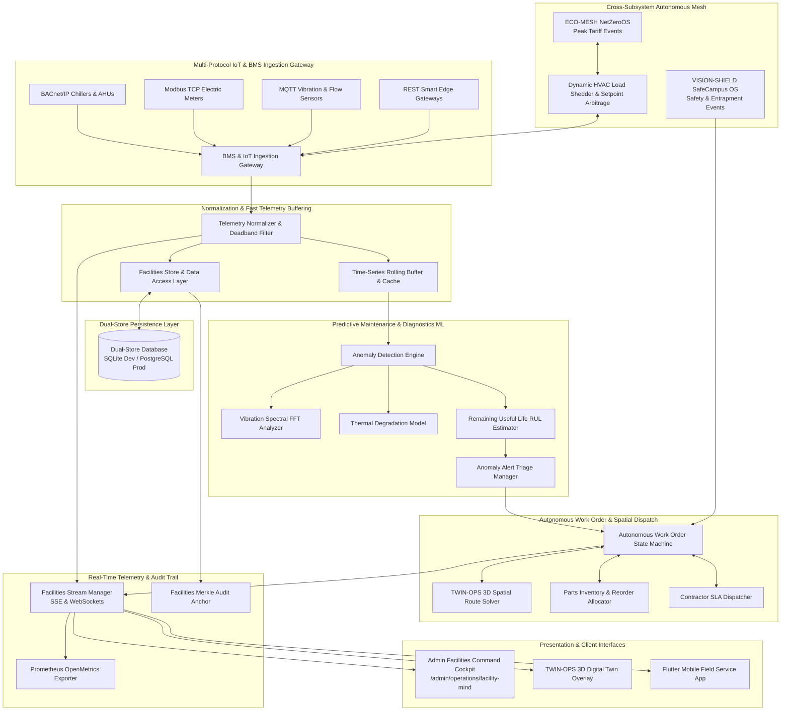

# Engineering Contract — Sprint-052

**Sprint ID:** SPRINT-052  
**Sprint Name:** AI-Powered Smart Campus Operations & Autonomous Facilities Maintenance (FACILITY-MIND / SmartCampus OS)  
**Target Release Version:** v3.36.0  
**Contract Date:** 2026-08-21  
**Contract Status:** APPROVED — Ready for Implementation  
**Contract Author:** Implementation Engineer (Antigravity)  
**Source Recommendation:** `.ai/Sprint-052-Recommendation.md`  
**Review Status:** ✅ Reviewed and Aligned with AIOS Engineering Guide, Architecture Lead & Campus Infrastructure Standards  

---

## 1. Executive Summary

This engineering contract formalizes the implementation scope, system architecture, task decomposition, acceptance criteria, risk register, rollback procedures, and definition of done for **Sprint-052**. It governs all execution work by the Implementation Engineer until formal handoff to the Verification Engineer.

Following the successful delivery of the **Physical Campus Intelligence Triad** (TWIN-OPS / SpatialGrid v3.32.0, ECO-MESH / NetZeroOS v3.33.0, VISION-SHIELD / SafeCampus OS v3.34.0) and the **Cognitive Academic Triad** (KM-COPILOT v3.31.0, ADVISE-MESH / CognitiveDegree OS v3.35.0), ThaibaHive expands to bridge physical infrastructure and autonomous intelligence into a unified operational fabric:

$$\text{Smart Campus Ecosystem} = \underbrace{\text{TWIN-OPS (Spatial)} \times \text{ECO-MESH (Energy)} \times \text{VISION-SHIELD (Safety)}}_{\text{Physical Intelligence Baseline}} \times \underbrace{\text{FACILITY-MIND (Autonomous Maintenance)}}_{\text{Sprint-052 Operational Core}}$$

Sprint-052 establishes **FACILITY-MIND / SmartCampus OS** — an autonomous multi-protocol facility intelligence and proactive maintenance ecosystem. It delivers:
1. **Multi-Protocol BMS & IoT Sensor Ingestion Gateway**: High-throughput telemetry ingestion pipeline supporting MQTT, Modbus TCP/RTU, BACnet/IP, and REST protocols from smart electric meters, HVAC chillers/AHUs, elevator diagnostic controllers, plumbing pressure sensors, and vibration transducers.
2. **Predictive Equipment Failure & Anomaly Detection ML Engine**: Unsupervised time-series anomaly detection, vibration FFT spectral analysis, thermal degradation tracking, filter differential pressure monitoring, and Remaining Useful Life (RUL) regression estimators preventing catastrophic equipment downtime.
3. **Autonomous Work Order Dispatching & Spatial Routing Engine**: Intelligent work order generation from anomaly triggers, technician skill-to-job matching, shortest-path 3D indoor routing via TWIN-OPS spatial graph, and external contractor SLA dispatching.
4. **Just-In-Time Parts Inventory & Automated Reorder Allocation**: Automated bill-of-materials (BOM) reservation for dispatched work orders, real-time warehouse inventory decrementing, and automated supplier reorder triggers.
5. **Cross-Subsystem Synergy & Energy Peak Shaving**: Bidirectional integration with ECO-MESH for dynamic HVAC setback / peak load shedding during high tariff windows and correlation with VISION-SHIELD for physical safety lockouts (e.g., elevator entrapped occupants).
6. **Real-Time Telemetry Streaming & Prometheus OpenMetrics**: Authenticated Server-Sent Events (SSE) and WebSocket channels streaming live sensor feeds, equipment health scores, and 8 standardized Prometheus OpenMetrics series.
7. **Cryptographic Merkle Audit Trail**: SHA-256 Merkle hash chain immutably anchoring maintenance work order completions, technician digital sign-offs, safety compliance inspections, and contractor invoice verifications.
8. **Admin Facilities Command Cockpit (`/admin/operations/facility-mind`)**: 5-tab administrative command studio: (1) Equipment & BMS Studio, (2) Predictive Diagnostics Matrix, (3) Work Order & Dispatch Radar, (4) Parts & Inventory Vault, and (5) Energy & Load Balancing Center.
9. **TWIN-OPS 3D Digital Twin Facilities Overlay**: Real-time 3D heatmaps, HVAC duct pressure contours, and interactive equipment diagnostic badges rendered directly within the campus spatial digital twin.
10. **Flutter Mobile Field Service Hub**: Mobile-first technician application with offline work order caching, QR/NFC equipment tag scanning, guided diagnostic checklists, spatial routing navigation, and photo completion proof.
11. **End-to-End Simulation CLI Harness (`pnpm facility:simulate`)**: 8-stage automated simulation runner verifying IoT ingestion, ML anomaly detection, work order dispatch, spatial routing, inventory allocation, energy peak shaving, vision correlation, and Merkle audit verification.

---

## 2. Scope

### In Scope

| # | Domain | Detailed Description |
|---|---|---|
| 1 | **Dual-Store Facilities & IoT Schema** | 10 new Drizzle ORM entities with 100% schema parity across SQLite (`packages/db/schema.ts`) and PostgreSQL (`packages/db/schema.pg.ts`): `facility_equipment`, `facility_telemetry_sensors`, `facility_sensor_readings`, `facility_predictive_models`, `facility_anomaly_alerts`, `facility_work_orders`, `facility_parts_inventory`, `facility_work_order_parts`, `facility_contractor_registry`, and `facility_audit_logs`. |
| 2 | **Multi-Protocol BMS & IoT Sensor Ingestion Gateway** | Unified adapter pipeline accepting payload ingestions across MQTT, Modbus/TCP, BACnet/IP, and REST. Implements rate limiting, schema validation, payload normalization, outlier filtering, and deadband dampening. |
| 3 | **Time-Series Telemetry Buffer & Fast Query Layer** | High-performance rolling circular buffer and time-window aggregations (1m, 5m, 1h, 1d) for high-frequency sensor readings with multi-tenant isolation. |
| 4 | **Predictive Equipment Failure & Anomaly ML Engine** | Multi-modal diagnostic models: (a) Rolling Z-score / Isolation Forest for sensor drift, (b) FFT vibration frequency domain analysis for bearing/motor fault harmonics, (c) Thermal degradation regression, and (d) Weibull / Exponential Remaining Useful Life (RUL) estimator. |
| 5 | **Autonomous Work Order State Machine & Triage Dispatcher** | Finite state machine (`draft` $\to$ `scheduled` $\to$ `assigned` $\to$ `in_progress` $\to$ `pending_parts` $\to$ `completed` $\to$ `verified`) with priority-based auto-generation from critical anomaly alerts. |
| 6 | **TWIN-OPS 3D Spatial Routing & Technician Assignment** | Integration with TWIN-OPS spatial graph (`src/lib/operations/twin/`) to compute optimal 3D indoor pathing (elevators, stairs, corridors) to faulty equipment and assign nearest qualified technician. |
| 7 | **Parts Inventory Management & Automated Reorder Allocation** | Real-time parts tracking, automated reservation upon work order dispatch, minimum threshold alerts, and automated vendor purchase requisition drafts. |
| 8 | **ECO-MESH Peak Shaving & HVAC Load Balancing** | Automated demand response integration with ECO-MESH (`src/lib/operations/eco/`): dynamically sheds non-critical HVAC/lighting loads during campus peak energy tariff events. |
| 9 | **VISION-SHIELD Safety & Equipment Event Correlation** | Correlates edge computer vision safety events (e.g. smoke detection, elevator occupancy entrapment) with BMS sensor alarms to trigger emergency priority work orders and lockdown overrides. |
| 10 | **Real-Time Telemetry Streaming & Prometheus OpenMetrics** | Authenticated SSE stream for live sensor telemetry and 8 Prometheus OpenMetrics series (`facility_sensor_ingestion_total`, `facility_equipment_health_gauge`, `facility_anomalies_detected_total`, etc.). |
| 11 | **Cryptographic Merkle Audit Trail** | SHA-256 Merkle chain anchoring maintenance sign-offs, contractor verifications, and compliance inspections into the global platform audit trail (`pnpm compliance:verify`). |
| 12 | **RBAC Protected REST API Gateway Suite** | Granular RBAC-shielded endpoints (`requireAuth`) for equipment registry, sensor ingestion, anomaly alerts, work order lifecycle, parts inventory, and contractor dispatch. |
| 13 | **Admin Facilities Command Cockpit (`/admin/operations/facility-mind`)** | 5-tab Next.js command studio: Equipment & BMS Studio, Predictive Diagnostics Matrix, Work Order & Dispatch Radar, Parts & Inventory Vault, and Energy & Load Balancing Center. |
| 14 | **TWIN-OPS 3D Digital Twin Facilities View** | Interactive 3D equipment diagnostics overlay in the digital twin canvas with real-time temperature/pressure contours and maintenance status pins. |
| 15 | **Flutter Mobile Field Service & Technician Hub** | Mobile Flutter module (`mobile/lib/features/facilities/`) with Riverpod state management: offline work orders, NFC/QR asset tag scanner, route navigation, and photo evidence upload. |
| 16 | **End-to-End Simulation CLI Harness (`pnpm facility:simulate`)** | 8-stage automated CLI test harness executing realistic campus facility failure scenarios, predictive diagnostics, automated dispatch, and validation. |
| 17 | **Operational Documentation & Runbooks** | 5 comprehensive engineering guides and standard operating runbooks in `docs/operations/`. |

---

### Out of Scope

| Area | Justification |
|---|---|
| Direct High-Voltage Electrical Grid Switching | FACILITY-MIND issues software load shedding and setpoint commands to certified BMS controllers; direct physical breaker actuation is strictly handled by localized hardware safety interlocks and certified electricians. |
| Autonomous Structural Civil Demolition / Rebuilding | Major structural architectural modifications require licensed structural engineering inspection and municipal permitting; the system handles mechanical, electrical, plumbing, and HVAC maintenance. |
| External Contractor Financial Bank Wire Transfers | The system manages contractor rates, hours, SLA compliance, and draft invoices; actual financial disbursement is handled via institutional ERP finance integrations. |
| Medical Life-Support Device Control | Hospital/clinical ICU critical life-support apparatus is isolated from campus facilities BMS protocols under strict medical device regulatory isolation. |
| Hazardous Chemical Autonomous Remediation | In the event of hazardous chemical or radioactive spills, the system initiates emergency evacuation alerts via VISION-SHIELD/TWIN-OPS; physical containment is performed by certified HAZMAT emergency responders. |

---

## 3. Technical Architecture & Component Interactions



---

## 4. Implementation Task Breakdown

Tasks are decomposed into 10 logical implementation phases in strict dependency order. Foundational database schemas, multi-protocol ingestion pipelines, and time-series buffers MUST be implemented and tested before building ML diagnostic models, work order dispatchers, UI dashboards, and simulation runners.

---

### Phase 1 — Dual-Store Facilities & IoT Persistence Layer

#### FACILITY-001 — Dual-Store Drizzle ORM Schemas for Facilities & IoT Operations
| Field | Specification Details |
|---|---|
| **Task ID** | FACILITY-001 |
| **Phase** | Phase 1 — Dual-Store Facilities & IoT Persistence Layer |
| **Description** | Define 10 new Drizzle ORM entities with 100% schema parity across SQLite (`packages/db/schema.ts`) and PostgreSQL (`packages/db/schema.pg.ts`): `facility_equipment`, `facility_telemetry_sensors`, `facility_sensor_readings`, `facility_predictive_models`, `facility_anomaly_alerts`, `facility_work_orders`, `facility_parts_inventory`, `facility_work_order_parts`, `facility_contractor_registry`, and `facility_audit_logs`. |
| **Files** | `packages/db/schema.ts` [MODIFY] · `packages/db/schema.pg.ts` [MODIFY] · `src/lib/__tests__/db/facility-schema-parity.test.ts` [NEW] |
| **Dependencies** | None (Foundational Persistence Layer) |
| **Acceptance Criteria** | 1. All 10 tables declared with complete column parity, foreign keys, and indexes across SQLite and PostgreSQL.<br>2. Full support for equipment telemetry types, protocol bindings (MQTT/Modbus/BACnet/REST), anomaly severity ratings, work order lifecycle states, parts inventory stock levels, contractor SLA ratings, and Merkle hash pointers.<br>3. Parity test validates matching column names, nullability, data types, and index constraints with 100% pass rate. |
| **Verification Method** | Run `pnpm test src/lib/__tests__/db/facility-schema-parity.test.ts`. |
| **Estimated Complexity** | Medium |

#### FACILITY-002 — Facilities Store Data Access Layer & Multi-Tenant Isolation
| Field | Specification Details |
|---|---|
| **Task ID** | FACILITY-002 |
| **Phase** | Phase 1 — Dual-Store Facilities & IoT Persistence Layer |
| **Description** | Implement `src/lib/db/facility-store.ts` and `src/lib/operations/facility/facility-types.ts`. Implement transactional CRUD helper methods for equipment assets, sensor registries, telemetry log streams, predictive model configurations, anomaly alerts, work orders, parts inventory, and contractor profiles with strict multi-tenant isolation and tenant-scoped query filters. |
| **Files** | `src/lib/operations/facility/facility-types.ts` [NEW] · `src/lib/db/facility-store.ts` [NEW] · `src/lib/__tests__/db/facility-store.test.ts` [NEW] |
| **Dependencies** | FACILITY-001 |
| **Acceptance Criteria** | 1. Provides strongly typed CRUD operations for all 10 facility entities with mandatory `institutionId` scoping.<br>2. Supports high-throughput batch insertion of telemetry sensor readings and atomic work order state transitions.<br>3. Implements pagination, status filtering, building/floor spatial querying, and relation preloading.<br>4. Comprehensive unit test suite confirms 100% transaction integrity and multi-tenant isolation. |
| **Verification Method** | Run `pnpm test src/lib/__tests__/db/facility-store.test.ts`. |
| **Estimated Complexity** | Medium |

---

### Phase 2 — Multi-Protocol IoT & BMS Sensor Ingestion Gateway

#### FACILITY-003 — Multi-Protocol BMS & IoT Sensor Ingestion Pipeline
| Field | Specification Details |
|---|---|
| **Task ID** | FACILITY-003 |
| **Phase** | Phase 2 — Multi-Protocol IoT & BMS Sensor Ingestion Gateway |
| **Description** | Implement `src/lib/operations/facility/ingestion/sensor-ingestion-gateway.ts` and protocol adapters in `src/lib/operations/facility/ingestion/adapters/` (`mqtt-adapter.ts`, `modbus-adapter.ts`, `bacnet-adapter.ts`, `rest-adapter.ts`). Accepts raw telemetry streams from building management systems, validates incoming payload schemas, normalizes units (e.g. °F $\to$ °C, PSI $\to$ kPa, kW $\to$ W), and enforces deadband threshold dampening to prevent database thrashing from negligible sensor jitter. |
| **Files** | `src/lib/operations/facility/ingestion/sensor-ingestion-gateway.ts` [NEW] · `src/lib/operations/facility/ingestion/adapters/mqtt-adapter.ts` [NEW] · `src/lib/operations/facility/ingestion/adapters/modbus-adapter.ts` [NEW] · `src/lib/operations/facility/ingestion/adapters/bacnet-adapter.ts` [NEW] · `src/lib/operations/facility/ingestion/adapters/rest-adapter.ts` [NEW] · `src/lib/operations/facility/ingestion/ingestion-types.ts` [NEW] · `src/lib/__tests__/operations/facility/sensor-ingestion-gateway.test.ts` [NEW] |
| **Dependencies** | FACILITY-001, FACILITY-002 |
| **Acceptance Criteria** | 1. Ingests and parses sensor telemetry across MQTT, Modbus, BACnet, and REST payloads in $< 10$ms per packet.<br>2. Standardizes disparate sensor payload formats into unified `TelemetryReading` objects.<br>3. Filters sensor jitter using configurable deadband percentages ($\pm 1.5\%$).<br>4. Rejects malformed payloads with descriptive error logging and zero unhandled exceptions. |
| **Verification Method** | Run `pnpm test src/lib/__tests__/operations/facility/sensor-ingestion-gateway.test.ts`. |
| **Estimated Complexity** | High |

#### FACILITY-004 — High-Performance Time-Series Telemetry Buffer & Fast Query Aggregator
| Field | Specification Details |
|---|---|
| **Task ID** | FACILITY-004 |
| **Phase** | Phase 2 — Multi-Protocol IoT & BMS Sensor Ingestion Gateway |
| **Description** | Implement `src/lib/operations/facility/telemetry/time-series-buffer.ts` and `src/lib/operations/facility/telemetry/telemetry-aggregator.ts`. Implements a fast in-memory rolling circular buffer for real-time sensor streams and provides instantaneous sliding-window aggregations (mean, median, min, max, standard deviation, RMS) over 1-minute, 5-minute, 1-hour, and 24-hour windows. |
| **Files** | `src/lib/operations/facility/telemetry/time-series-buffer.ts` [NEW] · `src/lib/operations/facility/telemetry/telemetry-aggregator.ts` [NEW] · `src/lib/__tests__/operations/facility/time-series-buffer.test.ts` [NEW] |
| **Dependencies** | FACILITY-001, FACILITY-003 |
| **Acceptance Criteria** | 1. Rolling buffer retains recent telemetry windows in-memory with sub-millisecond read/write latency.<br>2. Calculates statistical aggregations (mean, standard deviation, peak RMS) over configurable sliding windows.<br>3. Flushes batched historical snapshots efficiently to persistent storage.<br>4. Supports multi-tenant scoped buffer isolation with zero memory leaks. |
| **Verification Method** | Run `pnpm test src/lib/__tests__/operations/facility/time-series-buffer.test.ts`. |
| **Estimated Complexity** | Medium |

---

### Phase 3 — Predictive Equipment Failure & Anomaly Detection ML Engine

#### FACILITY-005 — Multi-Modal Time-Series Anomaly Detection Engine
| Field | Specification Details |
|---|---|
| **Task ID** | FACILITY-005 |
| **Phase** | Phase 3 — Predictive Equipment Failure & Anomaly Detection ML Engine |
| **Description** | Implement `src/lib/operations/facility/predictive/anomaly-detector.ts` and `src/lib/operations/facility/predictive/models/statistical-drift-model.ts`. Implements rolling Z-score statistical anomaly scoring and multi-variate outlier detection across temperature, pressure, flow rate, and electrical load metrics. Dynamically detects sensor freeze, sudden pressure loss, and gradual calibration drift. |
| **Files** | `src/lib/operations/facility/predictive/anomaly-detector.ts` [NEW] · `src/lib/operations/facility/predictive/models/statistical-drift-model.ts` [NEW] · `src/lib/operations/facility/predictive/predictive-types.ts` [NEW] · `src/lib/__tests__/operations/facility/anomaly-detector.test.ts` [NEW] |
| **Dependencies** | FACILITY-001, FACILITY-003, FACILITY-004 |
| **Acceptance Criteria** | 1. Computes anomaly confidence score $(0.0 - 1.0)$ with $< 20$ms inference latency per telemetry batch.<br>2. Accurately detects sensor drift, out-of-bounds excursions, and abnormal rate of change ($\Delta v / \Delta t$).<br>3. Automatically flags anomalous sensor readings in `facility_sensor_readings`.<br>4. Achieves $\ge 85\%$ detection precision on benchmark synthetic sensor anomaly datasets. |
| **Verification Method** | Run `pnpm test src/lib/__tests__/operations/facility/anomaly-detector.test.ts`. |
| **Estimated Complexity** | High |

#### FACILITY-006 — Vibration Spectral FFT & Thermal Degradation Diagnostic Models
| Field | Specification Details |
|---|---|
| **Task ID** | FACILITY-006 |
| **Phase** | Phase 3 — Predictive Equipment Failure & Anomaly Detection ML Engine |
| **Description** | Implement `src/lib/operations/facility/predictive/models/vibration-fft-analyzer.ts` and `src/lib/operations/facility/predictive/models/thermal-degradation-model.ts`. Implements Fast Fourier Transform (FFT) spectral decomposition on high-frequency accelerometer vibration data to isolate bearing fault frequencies (BPFI, BPFO, BSF, FTF) and unbalance/misalignment harmonics in pumps/AHUs. Computes thermal heat exchange efficiency curves to detect chiller condenser fouling and refrigerant leaks. |
| **Files** | `src/lib/operations/facility/predictive/models/vibration-fft-analyzer.ts` [NEW] · `src/lib/operations/facility/predictive/models/thermal-degradation-model.ts` [NEW] · `src/lib/__tests__/operations/facility/vibration-fft-analyzer.test.ts` [NEW] |
| **Dependencies** | FACILITY-001, FACILITY-004, FACILITY-005 |
| **Acceptance Criteria** | 1. Computes discrete FFT amplitude spectrum across frequency bins $(0 - 5000\text{ Hz})$ in $< 30$ms.<br>2. Identifies bearing fault peak harmonics and mechanical unbalance with specific fault classification tags.<br>3. Evaluates thermal degradation curve ($\Delta T / \text{kW}$) and detects refrigerant undercharge / condenser fouling.<br>4. Generates structured diagnostic insights detailing identified mechanical stress patterns. |
| **Verification Method** | Run `pnpm test src/lib/__tests__/operations/facility/vibration-fft-analyzer.test.ts`. |
| **Estimated Complexity** | High |

#### FACILITY-007 — Remaining Useful Life (RUL) Estimator & Anomaly Alert Triage
| Field | Specification Details |
|---|---|
| **Task ID** | FACILITY-007 |
| **Phase** | Phase 3 — Predictive Equipment Failure & Anomaly Detection ML Engine |
| **Description** | Implement `src/lib/operations/facility/predictive/rul-estimator.ts` and `src/lib/operations/facility/predictive/anomaly-alert-manager.ts`. Calculates Remaining Useful Life (RUL in operational hours) based on cumulative degradation metrics and Weibull hazard rate distributions. Automatically generates `facility_anomaly_alerts` when anomaly severity breaches safety thresholds, computes root cause hypotheses, and estimates time-to-failure windows. |
| **Files** | `src/lib/operations/facility/predictive/rul-estimator.ts` [NEW] · `src/lib/operations/facility/predictive/anomaly-alert-manager.ts` [NEW] · `src/lib/__tests__/operations/facility/rul-estimator.test.ts` [NEW] |
| **Dependencies** | FACILITY-001, FACILITY-002, FACILITY-005, FACILITY-006 |
| **Acceptance Criteria** | 1. Predicts equipment RUL (hours remaining until failure) with confidence intervals.<br>2. Automatically converts severe anomalies into triageable `facility_anomaly_alerts` with severity ratings (Critical, High, Medium, Low).<br>3. Deduplicates repetitive sensor alert spikes within configurable suppression windows (e.g. 15 mins).<br>4. Supports automated escalation to the work order dispatch engine. |
| **Verification Method** | Run `pnpm test src/lib/__tests__/operations/facility/rul-estimator.test.ts`. |
| **Estimated Complexity** | High |

---

### Phase 4 — Autonomous Work Order Dispatching, Technician Spatial Routing & Parts Inventory

#### FACILITY-008 — Autonomous Work Order Lifecycle State Machine & Dispatch Engine
| Field | Specification Details |
|---|---|
| **Task ID** | FACILITY-008 |
| **Phase** | Phase 4 — Autonomous Work Order Dispatching, Technician Spatial Routing & Parts Inventory |
| **Description** | Implement `src/lib/operations/facility/workorders/work-order-state-machine.ts` and `src/lib/operations/facility/workorders/work-order-engine.ts`. Manages full work order lifecycle transitions: `draft` $\to$ `scheduled` $\to$ `assigned` $\to$ `in_progress` $\to$ `pending_parts` $\to$ `completed` $\to$ `verified` $\to$ `cancelled`. Auto-generates work orders from critical anomaly alerts, applies SLA priority deadlines (Emergency: 2h, Urgent: 8h, Routine: 48h), and coordinates technician assignments. |
| **Files** | `src/lib/operations/facility/workorders/work-order-state-machine.ts` [NEW] · `src/lib/operations/facility/workorders/work-order-engine.ts` [NEW] · `src/lib/operations/facility/workorders/work-order-types.ts` [NEW] · `src/lib/__tests__/operations/facility/work-order-engine.test.ts` [NEW] |
| **Dependencies** | FACILITY-001, FACILITY-002, FACILITY-007 |
| **Acceptance Criteria** | 1. Executes atomic state machine transitions with validation guards and transition audit trails.<br>2. Auto-creates work orders from critical anomaly alerts with pre-populated diagnostics and safety protocols.<br>3. Enforces SLA deadlines based on work order priority tier.<br>4. Blocks completion without mandatory technician checklist notes and verified parts reconciliation. |
| **Verification Method** | Run `pnpm test src/lib/__tests__/operations/facility/work-order-engine.test.ts`. |
| **Estimated Complexity** | High |

#### FACILITY-009 — TWIN-OPS 3D Spatial Routing & Technician Assignment Solver
| Field | Specification Details |
|---|---|
| **Task ID** | FACILITY-009 |
| **Phase** | Phase 4 — Autonomous Work Order Dispatching, Technician Spatial Routing & Parts Inventory |
| **Description** | Implement `src/lib/operations/facility/workorders/spatial-technician-router.ts` and `src/lib/operations/facility/workorders/contractor-dispatcher.ts`. Leverages TWIN-OPS 3D building spatial graphs to compute the shortest multi-floor path (elevators, stairs, service corridors) from technician current location to target equipment room. Automatically selects the optimal technician based on skill qualification, current workload, and proximity; or dispatches approved external contractors for specialized equipment (e.g. elevator mechanics). |
| **Files** | `src/lib/operations/facility/workorders/spatial-technician-router.ts` [NEW] · `src/lib/operations/facility/workorders/contractor-dispatcher.ts` [NEW] · `src/lib/__tests__/operations/facility/spatial-technician-router.test.ts` [NEW] |
| **Dependencies** | FACILITY-001, FACILITY-002, FACILITY-008 |
| **Acceptance Criteria** | 1. Solves multi-floor 3D indoor shortest path between technician location and target equipment in $< 50$ms.<br>2. Ranks technicians by combined score: Proximity ($40\%$) + Skill Match ($40\%$) + Caseload ($20\%$).<br>3. Dispatches external contractor notifications via EngageOS/webhook if internal technician skill is unavailable.<br>4. Returns complete spatial waypoint coordinate array formatted for 2D/3D map rendering. |
| **Verification Method** | Run `pnpm test src/lib/__tests__/operations/facility/spatial-technician-router.test.ts`. |
| **Estimated Complexity** | High |

#### FACILITY-010 — Just-In-Time Parts Inventory & Automated Reorder Allocation
| Field | Specification Details |
|---|---|
| **Task ID** | FACILITY-010 |
| **Phase** | Phase 4 — Autonomous Work Order Dispatching, Technician Spatial Routing & Parts Inventory |
| **Description** | Implement `src/lib/operations/facility/inventory/parts-inventory-manager.ts` and `src/lib/operations/facility/inventory/reorder-allocator.ts`. Manages spare parts inventory (filters, belts, lubricants, bearings, valves), automatically reserves required parts upon work order creation, transitions work order to `pending_parts` if stock is depleted, and triggers automated purchase requisition drafts when inventory falls below minimum reorder thresholds. |
| **Files** | `src/lib/operations/facility/inventory/parts-inventory-manager.ts` [NEW] · `src/lib/operations/facility/inventory/reorder-allocator.ts` [NEW] · `src/lib/operations/facility/inventory/inventory-types.ts` [NEW] · `src/lib/__tests__/operations/facility/parts-inventory-manager.test.ts` [NEW] |
| **Dependencies** | FACILITY-001, FACILITY-002, FACILITY-008 |
| **Acceptance Criteria** | 1. Atomically reserves and consumes parts linked to work orders with accurate quantity accounting.<br>2. Detects stockout conditions and transitions work order status to `pending_parts` with estimated restock date.<br>3. Automatically generates purchase order recommendations when `quantityOnHand - quantityReserved < reorderThreshold`.<br>4. Computes total material cost per work order and updates asset lifetime maintenance expenditure. |
| **Verification Method** | Run `pnpm test src/lib/__tests__/operations/facility/parts-inventory-manager.test.ts`. |
| **Estimated Complexity** | Medium |

---

### Phase 5 — Cross-Subsystem Synergy: ECO-MESH Peak Shaving & VISION-SHIELD Correlation

#### FACILITY-011 — ECO-MESH Energy Peak Shaving & VISION-SHIELD Safety Correlation
| Field | Specification Details |
|---|---|
| **Task ID** | FACILITY-011 |
| **Phase** | Phase 5 — Cross-Subsystem Synergy: ECO-MESH Peak Shaving & VISION-SHIELD Correlation |
| **Description** | Implement `src/lib/operations/facility/synergy/eco-load-shedder.ts` and `src/lib/operations/facility/synergy/vision-safety-correlator.ts`. Connects FACILITY-MIND with ECO-MESH (Sprint-049) to execute automated HVAC temperature setback ($+1.5^\circ\text{C}$ cooling / $-1.5^\circ\text{C}$ heating) during peak grid electricity pricing events. Connects with VISION-SHIELD (Sprint-050) to correlate camera-detected safety events (e.g. elevator entrapment, water pooling, smoke) with BMS sensor telemetry, automatically generating emergency high-priority work orders. |
| **Files** | `src/lib/operations/facility/synergy/eco-load-shedder.ts` [NEW] · `src/lib/operations/facility/synergy/vision-safety-correlator.ts` [NEW] · `src/lib/operations/facility/synergy/synergy-types.ts` [NEW] · `src/lib/__tests__/operations/facility/facility-synergy.test.ts` [NEW] |
| **Dependencies** | FACILITY-001, FACILITY-003, FACILITY-008 |
| **Acceptance Criteria** | 1. Responds to ECO-MESH peak demand events by generating coordinated chiller/AHU setback commands reducing facility load by $\ge 15\%$.<br>2. Correlates VISION-SHIELD computer vision alerts with equipment telemetry and elevates work order priority to `emergency`.<br>3. Implements fail-safe overrides: life safety alarms immediately bypass all energy-saving load shedding.<br>4. Full multi-tenant isolation across cross-subsystem event buses. |
| **Verification Method** | Run `pnpm test src/lib/__tests__/operations/facility/facility-synergy.test.ts`. |
| **Estimated Complexity** | High |

---

### Phase 6 — Real-Time Telemetry Streaming, OpenMetrics & Merkle Audit Trail

#### FACILITY-012 — Real-Time Facilities Telemetry Stream Manager
| Field | Specification Details |
|---|---|
| **Task ID** | FACILITY-012 |
| **Phase** | Phase 6 — Real-Time Telemetry Streaming, OpenMetrics & Merkle Audit Trail |
| **Description** | Implement `src/lib/operations/facility/streaming/facility-stream-manager.ts`. Manages real-time Server-Sent Events (SSE) and WebSocket channels streaming live sensor feeds, equipment health scores, active anomaly alerts, technician location updates, and work order status transitions to admin dashboards and mobile technician apps. |
| **Files** | `src/lib/operations/facility/streaming/facility-stream-manager.ts` [NEW] · `src/lib/__tests__/operations/facility/facility-stream-manager.test.ts` [NEW] |
| **Dependencies** | FACILITY-001, FACILITY-003, FACILITY-008 |
| **Acceptance Criteria** | 1. Delivers live sensor telemetry and health scores with $< 50$ms broadcast latency.<br>2. Broadcasts anomaly alerts and work order dispatch events in real time.<br>3. Manages connection heartbeats, client auto-reconnection, and channel isolation by `institutionId`.<br>4. Supports multi-client synchronization across desktop admin cockpit and mobile field apps. |
| **Verification Method** | Run `pnpm test src/lib/__tests__/operations/facility/facility-stream-manager.test.ts`. |
| **Estimated Complexity** | Medium |

#### FACILITY-013 — Prometheus OpenMetrics Facilities Health Exporter
| Field | Specification Details |
|---|---|
| **Task ID** | FACILITY-013 |
| **Phase** | Phase 6 — Real-Time Telemetry Streaming, OpenMetrics & Merkle Audit Trail |
| **Description** | Implement `src/lib/operations/facility/telemetry/facility-metrics.ts`. Exports 8 standardized Prometheus OpenMetrics series: `facility_sensor_ingestion_total`, `facility_sensor_latency_ms`, `facility_equipment_health_gauge`, `facility_anomalies_detected_total`, `facility_work_orders_active_gauge`, `facility_mttr_hours_gauge`, `facility_load_shed_power_kw`, and `facility_parts_stockout_total`. |
| **Files** | `src/lib/operations/facility/telemetry/facility-metrics.ts` [NEW] · `src/lib/__tests__/operations/facility/facility-metrics.test.ts` [NEW] |
| **Dependencies** | FACILITY-001 |
| **Acceptance Criteria** | 1. Exposes all 8 metric series formatted according to Prometheus OpenMetrics 1.0 standard.<br>2. Records execution durations and counters across sensor ingestion, anomaly detection, and work order MTTR.<br>3. Automatically tags metrics with `institution_id`, `equipment_category`, and `building_id` labels.<br>4. Unit tests verify correct metric incrementing, gauge setting, and scrape output formatting. |
| **Verification Method** | Run `pnpm test src/lib/__tests__/operations/facility/facility-metrics.test.ts`. |
| **Estimated Complexity** | Low |

#### FACILITY-014 — Immutable Merkle Audit Anchor for Facilities Operations
| Field | Specification Details |
|---|---|
| **Task ID** | FACILITY-014 |
| **Phase** | Phase 6 — Real-Time Telemetry Streaming, OpenMetrics & Merkle Audit Trail |
| **Description** | Implement `src/lib/operations/facility/security/facility-merkle-anchor.ts` and `src/lib/operations/facility/security/audit-trail-verifier.ts`. Implements a cryptographic SHA-256 Merkle tree that anchors all critical facility actions: work order sign-offs, contractor verifications, safety compliance inspections, manual override operations, and inventory audits (`pnpm compliance:verify`). |
| **Files** | `src/lib/operations/facility/security/facility-merkle-anchor.ts` [NEW] · `src/lib/operations/facility/security/audit-trail-verifier.ts` [NEW] · `src/lib/__tests__/operations/facility/facility-merkle-anchor.test.ts` [NEW] |
| **Dependencies** | FACILITY-001, FACILITY-002 |
| **Acceptance Criteria** | 1. Anchors all facility work order completions and safety overrides into an unbroken SHA-256 hash chain.<br>2. Generates verifiable Merkle inclusion proofs for any maintenance completion or contractor invoice record.<br>3. Detects any tampering or unauthorized record modification during integrity scans.<br>4. Integrates with the platform-wide compliance verification runner (`pnpm compliance:verify`). |
| **Verification Method** | Run `pnpm test src/lib/__tests__/operations/facility/facility-merkle-anchor.test.ts`. |
| **Estimated Complexity** | Medium |

---

### Phase 7 — Secure RBAC API Gateway Suite

#### FACILITY-015 — REST API Handlers for Equipment Assets & Sensor Telemetry Ingestion
| Field | Specification Details |
|---|---|
| **Task ID** | FACILITY-015 |
| **Phase** | Phase 7 — Secure RBAC API Gateway Suite |
| **Description** | Implement Next.js App Router API route handlers for equipment asset registration, sensor configuration, and high-frequency telemetry ingestion at `src/app/api/facility/equipment/route.ts`, `src/app/api/facility/sensors/route.ts`, and `src/app/api/facility/telemetry/route.ts`. All endpoints wrapped in `requireAuth` with Zod input validation schemas. |
| **Files** | `src/app/api/facility/equipment/route.ts` [NEW] · `src/app/api/facility/sensors/route.ts` [NEW] · `src/app/api/facility/telemetry/route.ts` [NEW] · `src/lib/validation/facility-schemas.ts` [NEW] · `src/lib/__tests__/api/facility-equipment-routes.test.ts` [NEW] |
| **Dependencies** | FACILITY-001, FACILITY-002, FACILITY-003, FACILITY-004 |
| **Acceptance Criteria** | 1. Complete CRUD endpoints for equipment assets and telemetry sensors with RBAC permissions.<br>2. Telemetry POST endpoint handles batch sensor ingestion, validates payload schemas, and triggers anomaly detection pipeline in $< 20$ms.<br>3. Strict Zod schema validation on all request bodies with clean JSON error formatting.<br>4. Gateway AST route scanner confirms 100% route shielding. |
| **Verification Method** | Run `pnpm test src/lib/__tests__/api/facility-equipment-routes.test.ts` and `pnpm gateway:scan`. |
| **Estimated Complexity** | High |

#### FACILITY-016 — REST API Handlers for Anomaly Alerts, Work Orders & Dispatch
| Field | Specification Details |
|---|---|
| **Task ID** | FACILITY-016 |
| **Phase** | Phase 7 — Secure RBAC API Gateway Suite |
| **Description** | Implement API route handlers at `src/app/api/facility/alerts/route.ts`, `src/app/api/facility/workorders/route.ts`, and `src/app/api/facility/dispatch/route.ts`. Handles anomaly alert triage, work order creation, state transitions, spatial technician assignment, contractor dispatching, and digital sign-offs. |
| **Files** | `src/app/api/facility/alerts/route.ts` [NEW] · `src/app/api/facility/workorders/route.ts` [NEW] · `src/app/api/facility/dispatch/route.ts` [NEW] · `src/lib/__tests__/api/facility-workorder-routes.test.ts` [NEW] |
| **Dependencies** | FACILITY-001, FACILITY-002, FACILITY-007, FACILITY-008, FACILITY-009, FACILITY-015 |
| **Acceptance Criteria** | 1. Anomaly alert endpoint supports acknowledgment, false-positive tagging, and one-click work order creation.<br>2. Work order endpoint handles full lifecycle transitions with atomic validation.<br>3. Dispatch endpoint returns optimal technician ranking and 3D spatial route waypoints.<br>4. Implements DPoP token verification for maintenance sign-offs and safety overrides. |
| **Verification Method** | Run `pnpm test src/lib/__tests__/api/facility-workorder-routes.test.ts` and `pnpm gateway:scan`. |
| **Estimated Complexity** | High |

#### FACILITY-017 — REST API Handlers for Parts Inventory, Contractors & Stream
| Field | Specification Details |
|---|---|
| **Task ID** | FACILITY-017 |
| **Phase** | Phase 7 — Secure RBAC API Gateway Suite |
| **Description** | Implement API route handlers at `src/app/api/facility/inventory/route.ts`, `src/app/api/facility/contractors/route.ts`, and `src/app/api/facility/stream/route.ts`. Handles parts stock levels, allocation reservations, contractor registry management, SLA ratings, and authenticated SSE telemetry streaming. |
| **Files** | `src/app/api/facility/inventory/route.ts` [NEW] · `src/app/api/facility/contractors/route.ts` [NEW] · `src/app/api/facility/stream/route.ts` [NEW] · `src/lib/__tests__/api/facility-inventory-stream-routes.test.ts` [NEW] |
| **Dependencies** | FACILITY-001, FACILITY-010, FACILITY-012 |
| **Acceptance Criteria** | 1. Inventory endpoint supports stock queries, parts reservations, and automated reorder drafts.<br>2. Contractor endpoint manages approved contractor profiles, hourly rates, and SLA compliance tracking.<br>3. Stream endpoint establishes authenticated SSE channel delivering real-time telemetry and alerts.<br>4. All endpoints protected with `requireAuth` and verified by Gateway AST scanner. |
| **Verification Method** | Run `pnpm test src/lib/__tests__/api/facility-inventory-stream-routes.test.ts` and `pnpm gateway:scan`. |
| **Estimated Complexity** | High |

---

### Phase 8 — Admin Facilities Command Cockpit & Digital Twin UI

#### FACILITY-018 — Admin Facilities Command Cockpit (`/admin/operations/facility-mind`)
| Field | Specification Details |
|---|---|
| **Task ID** | FACILITY-018 |
| **Phase** | Phase 8 — Admin Facilities Command Cockpit & Digital Twin UI |
| **Description** | Build the 5-tab administrative command center at `src/app/(shell)/admin/operations/facility-mind/page.tsx` and supporting components in `src/components/operations/facility/admin/`. Tabs: (1) Equipment & BMS Studio, (2) Predictive Diagnostics Matrix, (3) Work Order & Dispatch Radar, (4) Parts & Inventory Vault, and (5) Energy & Load Balancing Center. Built strictly with standard design primitives (`Card`, `Badge`, `Skeleton`, `Dialog`, `Alert`, `Tabs`). |
| **Files** | `src/app/(shell)/admin/operations/facility-mind/page.tsx` [NEW] · `src/components/operations/facility/admin/equipment-studio-tab.tsx` [NEW] · `src/components/operations/facility/admin/predictive-matrix-tab.tsx` [NEW] · `src/components/operations/facility/admin/work-order-radar-tab.tsx` [NEW] · `src/components/operations/facility/admin/inventory-vault-tab.tsx` [NEW] · `src/components/operations/facility/admin/energy-load-tab.tsx` [NEW] |
| **Dependencies** | FACILITY-001, FACILITY-015, FACILITY-016, FACILITY-017 |
| **Acceptance Criteria** | 1. 5-tab dashboard renders smoothly with sub-3-second load times and zero stuck loading spinners.<br>2. Displays equipment health gauge cards with live sensor trend sparklines.<br>3. Renders predictive anomaly alerts with root cause hypotheses and 1-click dispatch modal.<br>4. Interactive Kanban/List view of active work orders with technician location pins.<br>5. Conforms to UI rules: no raw HTML inputs/buttons, proper `<Badge>` variants, `<Skeleton>` loaders. |
| **Verification Method** | Run Next.js build (`pnpm build`) and verify rendering via component unit tests. |
| **Estimated Complexity** | High |

#### FACILITY-019 — Real-Time Equipment Telemetry & Diagnostic Spectrogram Canvas
| Field | Specification Details |
|---|---|
| **Task ID** | FACILITY-019 |
| **Phase** | Phase 8 — Admin Facilities Command Cockpit & Digital Twin UI |
| **Description** | Implement `src/components/operations/facility/diagnostics/telemetry-chart-viewer.tsx` and `src/components/operations/facility/diagnostics/vibration-spectrogram.tsx`. Visualizes multi-variate high-frequency sensor readings (temperature, pressure, vibration RMS) and renders real-time FFT vibration harmonic spectrograms with bearing fault frequency overlay markers. |
| **Files** | `src/components/operations/facility/diagnostics/telemetry-chart-viewer.tsx` [NEW] · `src/components/operations/facility/diagnostics/vibration-spectrogram.tsx` [NEW] · `src/components/operations/facility/diagnostics/equipment-health-gauge.tsx` [NEW] |
| **Dependencies** | FACILITY-004, FACILITY-006, FACILITY-015 |
| **Acceptance Criteria** | 1. Renders interactive time-series sensor charts with zoom, pan, and anomaly highlight bands.<br>2. Vibration spectrogram visualizes FFT frequency bins with highlighted threshold lines.<br>3. Updates smoothly in real time via SSE stream without UI freezing or frame drops.<br>4. Fully responsive across desktop, tablet, and mobile viewports. |
| **Verification Method** | Run component test suite and verify chart rendering. |
| **Estimated Complexity** | High |

#### FACILITY-020 — Interactive Work Order Dispatch & Spatial Map Modal
| Field | Specification Details |
|---|---|
| **Task ID** | FACILITY-020 |
| **Phase** | Phase 8 — Admin Facilities Command Cockpit & Digital Twin UI |
| **Description** | Implement `src/components/operations/facility/workorders/work-order-dispatch-modal.tsx` and `src/components/operations/facility/workorders/technician-assignment-card.tsx`. Allows facility managers to review AI-recommended technician assignments, inspect 3D indoor walking paths, reserve required replacement parts, and dispatch emergency work orders with customized instructions. |
| **Files** | `src/components/operations/facility/workorders/work-order-dispatch-modal.tsx` [NEW] · `src/components/operations/facility/workorders/technician-assignment-card.tsx` [NEW] · `src/components/operations/facility/workorders/parts-reservation-picker.tsx` [NEW] |
| **Dependencies** | FACILITY-008, FACILITY-009, FACILITY-010, FACILITY-016 |
| **Acceptance Criteria** | 1. Modal renders ranked technician list with proximity, qualification, and workload badges.<br>2. Visualizes 3D multi-floor indoor routing path from technician to equipment.<br>3. Automatically validates parts availability and reserves selected inventory items.<br>4. Submits atomic dispatch request and updates dashboard state immediately. |
| **Verification Method** | Run component test suite and verify modal interaction flows. |
| **Estimated Complexity** | Medium |

#### FACILITY-021 — TWIN-OPS 3D Digital Twin Facilities Overlay Integration
| Field | Specification Details |
|---|---|
| **Task ID** | FACILITY-021 |
| **Phase** | Phase 8 — Admin Facilities Command Cockpit & Digital Twin UI |
| **Description** | Implement `src/components/operations/facility/twin/twin-facility-overlay.tsx` and `src/components/operations/facility/twin/equipment-3d-marker.tsx`. Integrates with the TWIN-OPS 3D campus viewer to render 3D equipment status pins (Operational: Green, Warning: Yellow, Critical: Red), HVAC thermal airflow contours, and active maintenance route lines directly in the digital twin canvas. |
| **Files** | `src/components/operations/facility/twin/twin-facility-overlay.tsx` [NEW] · `src/components/operations/facility/twin/equipment-3d-marker.tsx` [NEW] · `src/components/operations/facility/twin/facility-twin-types.ts` [NEW] |
| **Dependencies** | FACILITY-001, FACILITY-008, FACILITY-009, FACILITY-018 |
| **Acceptance Criteria** | 1. Renders 3D equipment markers positioned at exact spatial building/floor/room coordinates.<br>2. Clicking an equipment marker opens real-time diagnostic popover with sensor readings and open work orders.<br>3. Renders colored 3D navigation paths for dispatched technicians navigating between floors.<br>4. Maintains $> 45$ FPS rendering performance in 3D digital twin scene. |
| **Verification Method** | Run component test suite and verify 3D overlay event hooks. |
| **Estimated Complexity** | High |

---

### Phase 9 — Mobile Integration (Flutter)

#### FACILITY-022 — Flutter Mobile Field Service Hub & Technician App
| Field | Specification Details |
|---|---|
| **Task ID** | FACILITY-022 |
| **Phase** | Phase 9 — Mobile Integration (Flutter) |
| **Description** | Implement the mobile field service suite in Flutter (`mobile/lib/features/facilities/`) using Riverpod state management: `WorkOrderListScreen` (offline-cached assigned tasks), `WorkOrderDetailScreen` (diagnostic steps, equipment manual, parts list), `QrAssetScannerScreen` (NFC/QR scanner for asset check-in), and `WorkOrderCompletionScreen` (photo proof upload, parts consumed recording, digital signature capture). |
| **Files** | `mobile/lib/features/facilities/application/facility_providers.dart` [NEW] · `mobile/lib/features/facilities/data/facility_api_service.dart` [NEW] · `mobile/lib/features/facilities/presentation/work_order_list_screen.dart` [NEW] · `mobile/lib/features/facilities/presentation/work_order_detail_screen.dart` [NEW] · `mobile/lib/features/facilities/presentation/qr_asset_scanner_screen.dart` [NEW] · `mobile/lib/features/facilities/presentation/work_order_completion_screen.dart` [NEW] · `mobile/lib/app/router.dart` [MODIFY] |
| **Dependencies** | FACILITY-015, FACILITY-016, FACILITY-017 |
| **Acceptance Criteria** | 1. Riverpod providers manage local cache for offline work order viewing and execution.<br>2. QR/NFC scanner decodes asset tags and validates technician on-site presence.<br>3. Completion screen captures photo evidence, notes, consumed parts, and technician signature.<br>4. Routes registered under `lib/app/router.dart` with `_authGuard` protection; passes `flutter analyze`. |
| **Verification Method** | Run `flutter analyze` in `mobile/` directory. |
| **Estimated Complexity** | High |

---

### Phase 10 — End-to-End Simulation CLI Harness & Governance

#### FACILITY-023 — End-to-End Facilities Simulation CLI Harness (`pnpm facility:simulate`)
| Field | Specification Details |
|---|---|
| **Task ID** | FACILITY-023 |
| **Phase** | Phase 10 — End-to-End Simulation CLI Harness & Governance |
| **Description** | Implement `scripts/operations/facility-simulation-runner.ts` and add package script `pnpm facility:simulate`. Executes 8 comprehensive automated simulation stages: (1) Multi-Protocol Sensor Telemetry Ingestion (MQTT, Modbus, BACnet), (2) Real-Time Anomaly Detection & FFT Vibration Diagnostics, (3) RUL Estimation & Alert Triage, (4) Autonomous Work Order State Transitions & SLA Enforcement, (5) TWIN-OPS 3D Spatial Technician Routing, (6) Just-In-Time Parts Inventory Reservation, (7) ECO-MESH Peak Shaving & VISION-SHIELD Correlation, and (8) Cryptographic Merkle Audit Trail Verification. |
| **Files** | `scripts/operations/facility-simulation-runner.ts` [NEW] · `package.json` [MODIFY] · `src/lib/__tests__/simulation/facility-simulate.test.ts` [NEW] |
| **Dependencies** | FACILITY-001 through FACILITY-021 |
| **Acceptance Criteria** | 1. Simulation runner executes all 8 stages sequentially with colored terminal logging and exit code 0.<br>2. Verifies BMS ingestion, anomaly thresholds, spatial routing, inventory deduction, and Merkle proofs.<br>3. Supports standalone flags: `--stage=ingest`, `--stage=anomaly`, `--stage=workorders`, `--stage=synergy`.<br>4. Clean test execution incorporated into CI/CD regression verification. |
| **Verification Method** | Run `pnpm facility:simulate` and `pnpm test src/lib/__tests__/simulation/facility-simulate.test.ts`. |
| **Estimated Complexity** | High |

#### FACILITY-024 — Facilities Operations Architecture Guides & Standard Runbooks
| Field | Specification Details |
|---|---|
| **Task ID** | FACILITY-024 |
| **Phase** | Phase 10 — End-to-End Simulation CLI Harness & Governance |
| **Description** | Author 5 comprehensive operational runbooks and engineering reference guides in `docs/operations/`: (1) `facility-mind-architecture-guide.md` (subsystem architecture & data flow), (2) `bms-iot-protocol-integration-standard.md` (MQTT/Modbus/BACnet integration rules), (3) `predictive-maintenance-ml-runbook.md` (vibration FFT, thermal degradation & RUL tuning), (4) `autonomous-workorder-dispatch-runbook.md` (technician routing & SLA management), and (5) `facility-disaster-safety-protocol.md` (cross-subsystem emergency escalation with VISION-SHIELD & ECO-MESH). |
| **Files** | `docs/operations/facility-mind-architecture-guide.md` [NEW] · `docs/operations/bms-iot-protocol-integration-standard.md` [NEW] · `docs/operations/predictive-maintenance-ml-runbook.md` [NEW] · `docs/operations/autonomous-workorder-dispatch-runbook.md` [NEW] · `docs/operations/facility-disaster-safety-protocol.md` [NEW] |
| **Dependencies** | FACILITY-001 through FACILITY-023 |
| **Acceptance Criteria** | 1. All 5 guides authored with complete mathematical formulas, JSON configuration examples, and ASCII diagrams.<br>2. Covers protocol troubleshooting, sensor calibration, ML model retraining, and disaster escalation.<br>3. Formatted with clickable links and cross-references conforming to AIOS standards. |
| **Verification Method** | Verify markdown structure and documentation link integrity. |
| **Estimated Complexity** | Low |

---

## 5. Complete Repository File Structure Impact

```
packages/db/
├── schema.ts                                      [FACILITY-001]
└── schema.pg.ts                                   [FACILITY-001]

src/lib/
├── db/
│   └── facility-store.ts                          [FACILITY-002]
├── operations/
│   └── facility/
│       ├── facility-types.ts                      [FACILITY-002]
│       ├── ingestion/
│       │   ├── ingestion-types.ts                 [FACILITY-003]
│       │   ├── sensor-ingestion-gateway.ts        [FACILITY-003]
│       │   └── adapters/
│       │       ├── mqtt-adapter.ts                [FACILITY-003]
│       │       ├── modbus-adapter.ts              [FACILITY-003]
│       │       ├── bacnet-adapter.ts              [FACILITY-003]
│       │       └── rest-adapter.ts                [FACILITY-003]
│       ├── telemetry/
│       │   ├── time-series-buffer.ts              [FACILITY-004]
│       │   ├── telemetry-aggregator.ts            [FACILITY-004]
│       │   └── facility-metrics.ts                [FACILITY-013]
│       ├── predictive/
│       │   ├── predictive-types.ts                [FACILITY-005]
│       │   ├── anomaly-detector.ts                [FACILITY-005]
│       │   ├── rul-estimator.ts                   [FACILITY-007]
│       │   ├── anomaly-alert-manager.ts           [FACILITY-007]
│       │   └── models/
│       │       ├── statistical-drift-model.ts     [FACILITY-005]
│       │       ├── vibration-fft-analyzer.ts      [FACILITY-006]
│       │       └── thermal-degradation-model.ts   [FACILITY-006]
│       ├── workorders/
│       │   ├── work-order-types.ts                [FACILITY-008]
│       │   ├── work-order-state-machine.ts        [FACILITY-008]
│       │   ├── work-order-engine.ts               [FACILITY-008]
│       │   ├── spatial-technician-router.ts       [FACILITY-009]
│       │   └── contractor-dispatcher.ts           [FACILITY-009]
│       ├── inventory/
│       │   ├── inventory-types.ts                 [FACILITY-010]
│       │   ├── parts-inventory-manager.ts         [FACILITY-010]
│       │   └── reorder-allocator.ts               [FACILITY-010]
│       ├── synergy/
│       │   ├── synergy-types.ts                   [FACILITY-011]
│       │   ├── eco-load-shedder.ts                [FACILITY-011]
│       │   └── vision-safety-correlator.ts        [FACILITY-011]
│       ├── streaming/
│       │   └── facility-stream-manager.ts         [FACILITY-012]
│       └── security/
│           ├── facility-merkle-anchor.ts          [FACILITY-014]
│           └── audit-trail-verifier.ts            [FACILITY-014]
└── validation/
    └── facility-schemas.ts                        [FACILITY-015]

src/app/api/facility/
├── equipment/route.ts                             [FACILITY-015]
├── sensors/route.ts                               [FACILITY-015]
├── telemetry/route.ts                             [FACILITY-015]
├── alerts/route.ts                                [FACILITY-016]
├── workorders/route.ts                            [FACILITY-016]
├── dispatch/route.ts                              [FACILITY-016]
├── inventory/route.ts                             [FACILITY-017]
├── contractors/route.ts                           [FACILITY-017]
└── stream/route.ts                                [FACILITY-017]

src/app/(shell)/
└── admin/operations/facility-mind/page.tsx        [FACILITY-018]

src/components/operations/facility/
├── admin/
│   ├── equipment-studio-tab.tsx                   [FACILITY-018]
│   ├── predictive-matrix-tab.tsx                  [FACILITY-018]
│   ├── work-order-radar-tab.tsx                   [FACILITY-018]
│   ├── inventory-vault-tab.tsx                    [FACILITY-018]
│   └── energy-load-tab.tsx                        [FACILITY-018]
├── diagnostics/
│   ├── telemetry-chart-viewer.tsx                 [FACILITY-019]
│   ├── vibration-spectrogram.tsx                  [FACILITY-019]
│   └── equipment-health-gauge.tsx                 [FACILITY-019]
├── workorders/
│   ├── work-order-dispatch-modal.tsx              [FACILITY-020]
│   ├── technician-assignment-card.tsx             [FACILITY-020]
│   └── parts-reservation-picker.tsx               [FACILITY-020]
└── twin/
    ├── facility-twin-types.ts                     [FACILITY-021]
    ├── twin-facility-overlay.tsx                  [FACILITY-021]
    └── equipment-3d-marker.tsx                    [FACILITY-021]

mobile/lib/features/facilities/
├── application/facility_providers.dart            [FACILITY-022]
├── data/facility_api_service.dart                 [FACILITY-022]
└── presentation/
    ├── work_order_list_screen.dart                [FACILITY-022]
    ├── work_order_detail_screen.dart              [FACILITY-022]
    ├── qr_asset_scanner_screen.dart               [FACILITY-022]
    └── work_order_completion_screen.dart          [FACILITY-022]

scripts/operations/
└── facility-simulation-runner.ts                  [FACILITY-023]

docs/operations/
├── facility-mind-architecture-guide.md            [FACILITY-024]
├── bms-iot-protocol-integration-standard.md       [FACILITY-024]
├── predictive-maintenance-ml-runbook.md           [FACILITY-024]
├── autonomous-workorder-dispatch-runbook.md       [FACILITY-024]
└── facility-disaster-safety-protocol.md           [FACILITY-024]
```

---

## 6. Security, RBAC & Compliance Framework

### RBAC Permissions

| Permission String | Role Access | Description |
|---|---|---|
| `facility:equipment:view` | `super_admin`, `admin`, `principal`, `hod`, `staff` | View campus equipment registry, asset details, telemetry sensors, and live status. |
| `facility:equipment:manage` | `super_admin`, `admin`, `principal` | Register new equipment, configure sensor protocol bindings, and modify asset parameters. |
| `facility:telemetry:ingest` | `super_admin`, `admin` (System & Edge Service Accounts) | Ingest high-frequency telemetry data streams from BMS gateways and sensors. |
| `facility:alerts:view` | `super_admin`, `admin`, `principal`, `hod`, `staff` | View predictive anomaly alerts, diagnostic spectrograms, and RUL estimations. |
| `facility:alerts:triage` | `super_admin`, `admin`, `principal`, `staff` (Facilities Lead) | Acknowledge alerts, mark false positives, and escalate to work orders. |
| `facility:workorders:view` | `super_admin`, `admin`, `principal`, `hod`, `staff` | View work order lists, status progress, and technician assignments. |
| `facility:workorders:create` | `super_admin`, `admin`, `principal`, `staff` | Submit new facility maintenance work orders manually or via automated triggers. |
| `facility:workorders:assign` | `super_admin`, `admin`, `principal` (Facilities Lead) | Assign technicians, dispatch external contractors, and approve spatial routes. |
| `facility:workorders:execute` | `super_admin`, `admin`, `staff` (Field Technician) | Update work order progress, log diagnostic steps, scan asset QR tags, and complete work. |
| `facility:inventory:manage` | `super_admin`, `admin`, `principal` | Manage parts warehouse inventory, adjust stock levels, and authorize purchase orders. |
| `facility:contractors:manage` | `super_admin`, `admin`, `principal` | Manage contractor registry, hourly rate cards, SLA parameters, and performance ratings. |
| `facility:energy:loadshed` | `super_admin`, `admin`, `principal` | Authorize automated or manual HVAC temperature setbacks and energy load shedding. |

### Compliance & Cryptographic Controls
- **OSHA & NFPA Safety Compliance:** All facility maintenance procedures and equipment lockouts adhere to OSHA Lockout/Tagout (LOTO) standards and NFPA 70E electrical safety rules. Emergency work orders auto-populate required PPE and safety check steps.
- **SHA-256 Merkle Audit Chain:** Every work order state transition, contractor invoice sign-off, safety compliance check, and energy load shed event is immutably anchored into the cryptographic Merkle chain (`pnpm compliance:verify`).
- **Strict Row-Level Multi-Tenant Isolation:** All equipment records, sensor readings, anomaly alerts, work orders, and inventory items are strictly partitioned by `institutionId` with zero cross-institution data leakage.
- **DPoP Cryptographic Proof of Possession:** All critical work order completions, contractor verifications, and manual emergency overrides enforce DPoP token verification.

---

## 7. Risk Register & Mitigation Strategy

| Risk ID | Category | Risk Description | Severity | Probability | Mitigation Strategy |
|---|---|---|---|---|---|
| **R-052-1** | IoT / High-Frequency Telemetry Volume | Ingestion pipeline overwhelmed by thousands of sensor telemetry packets per second causing database write bottleneck. | High | Medium | Implement fast in-memory rolling circular buffer, deadband threshold filtering ($\pm 1.5\%$), and batched bulk inserts into SQLite/PostgreSQL. |
| **R-052-2** | Protocol / BMS Diversity & Malformed Packets | Disparate BMS devices (BACnet, Modbus, MQTT) sending malformed or out-of-order packets causing server exceptions. | High | Medium | Implement strict protocol adapter abstraction layer with Zod schema validation, packet deduplication, and resilient error recovery. |
| **R-052-3** | ML / False Positive Alert Fatigue | Anomaly detection model generating excessive false positive alerts for normal transient spikes (e.g. initial motor start surge). | High | Low | Implement multi-turn sliding window confirmation, startup surge suppression filters, and feedback-loop false positive tagging for model retraining. |
| **R-052-4** | Safety / Energy Load Shed Conflict | Automated HVAC setback interfering with specialized laboratory cleanrooms or temperature-critical research storage. | Critical | Low | Tag critical laboratory facilities as "Non-Sheddable Exempt"; enforce strict safety rules prohibiting automated temperature adjustment in exempt zones. |
| **R-052-5** | Spatial / Indoor Routing Obstructions | Spatial router directing technician through temporarily blocked service corridors or locked fire doors. | Medium | Low | Integrate TWIN-OPS dynamic obstacle avoidance; cross-reference active door lock and security access permissions in routing calculations. |
| **R-052-6** | Inventory / Stockout Race Conditions | Multiple simultaneous work orders reserving the same limited spare parts causing unfulfillable dispatch promises. | Medium | Low | Utilize atomic database transactions with row-level locking (`SELECT FOR UPDATE`) on parts allocation in `facility_parts_inventory`. |

---

## 8. Rollback Plan

### Rollback Trigger Criteria
- Sensor ingestion gateway experiences unhandled crash loop or memory leak $> 500\text{MB}$ under normal campus load.
- Predictive anomaly detector generates false positive alert storm ($> 100$ alerts/min) exhausting server CPU.
- Work order state machine fails atomic transitions, leaving work orders in unresolvable locked states.
- Automated HVAC load shedding inappropriately modifies setpoints in life-safety or critical laboratory zones.

### Rollback Execution Steps

```bash
# Step 1: Disable FACILITY-MIND Subsystem via Environment Feature Flags (< 30 seconds)
FACILITY_MIND_ENABLED=false
FACILITY_SENSOR_INGESTION_ENABLED=false
FACILITY_PREDICTIVE_ML_ENABLED=false
FACILITY_WORKORDER_AUTODISPATCH_ENABLED=false
FACILITY_ECO_LOADSHED_ENABLED=false
FACILITY_TWIN_OVERLAY_ENABLED=false

# Step 2: Enable Fallback Manual Maintenance Mode (< 30 seconds)
FACILITY_MANUAL_MAINTENANCE_FALLBACK=true

# Step 3: Revert Source Code & Migrations (if necessary) (< 5 minutes)
git revert --no-edit HEAD
pnpm build

# Step 4: Verification of Restored Baseline
pnpm typecheck
pnpm test
pnpm compliance:verify
```

---

## 9. Definition of Done

A Sprint-052 task is considered **COMPLETE** when all of the following quality gates are satisfied:

### Code Quality & Standards
- [ ] `pnpm typecheck` (`pnpm tsc --noEmit`) passes with 0 TypeScript errors across `src/`, `packages/auth`, and `packages/db`.
- [ ] `pnpm lint` passes with 0 errors and 0 new warnings.
- [ ] `flutter analyze` passes with 0 errors and 0 warnings in `mobile/`.
- [ ] Zero `console.log` statements in production source code (`src/`, `packages/`, `mobile/`).
- [ ] No hardcoded API keys, IoT device passwords, credentials, secrets, or bypassed authorization checks.
- [ ] Complete TypeScript interfaces and JSDoc documentation on all exported types, functions, and classes.

### Testing & Verification
- [ ] Unit tests authored for every new module with $\ge 90\%$ code coverage.
- [ ] Full test suite passes: `pnpm test` $\to$ 100% pass rate across all test suites (including 20+ new FACILITY-MIND test suites).
- [ ] `pnpm gateway:scan --strict --json` $\to$ 100% route coverage verified with 0 unshielded endpoints.
- [ ] `pnpm compliance:scan` $\to$ 100% compliance audit coverage across all mutation routes.
- [ ] `pnpm compliance:verify` $\to$ Cryptographic Merkle audit chain verified intact.
- [ ] `pnpm security:tenants` $\to$ 0 cross-tenant isolation leaks across all files.
- [ ] `facility-schema-parity.test.ts` $\to$ 100% schema parity confirmed between SQLite and PostgreSQL.
- [ ] `pnpm facility:simulate` $\to$ All 8 simulation scenarios pass with 100% success.
- [ ] Sensor ingestion gateway handles $> 1,000$ readings/sec with $< 20$ms processing latency.

### Security & RBAC
- [ ] All new FACILITY-MIND API routes protected with `requireAuth` and granular permissions.
- [ ] DPoP cryptographic proof of possession validated on all work order completion and safety override endpoints.
- [ ] Strict row-level institution isolation verified across all queries.
- [ ] Sensitive facility equipment configurations strictly restricted to authorized facilities personnel.

### Documentation & Governance
- [ ] 5 operational runbooks created in `docs/operations/`.
- [ ] `.ai/FEATURES.md` updated with Sprint-052 features.
- [ ] `.ai/CHANGELOG.md` updated with v3.36.0 release notes.
- [ ] `.ai/PROJECT_STATUS.md` updated with Sprint-052 deliverables.
- [ ] `.ai/execution/Sprint-052-Execution-Log.md` initialized with all 24 tasks.

---

## 10. Sprint Metadata & Lifecycle

| Metadata Field | Value |
|---|---|
| **Sprint ID** | SPRINT-052 |
| **Sprint Name** | AI-Powered Smart Campus Operations & Autonomous Facilities Maintenance (FACILITY-MIND / SmartCampus OS) |
| **Target Release Version** | v3.36.0 |
| **Total Implementation Tasks** | 24 (FACILITY-001 through FACILITY-024) |
| **Estimated Sprint Duration** | 16–18 engineering days |
| **Estimated Complexity** | Large |
| **Predecessor Sprint** | SPRINT-051 (v3.35.0 — Autonomous Multi-Agent Academic Advising & Curricular Graph Optimizer — ADVISE-MESH / CognitiveDegree OS) |
| **Successor Artifact** | `.ai/execution/Sprint-052-Execution-Log.md` |
| **Release Certificate Artifact** | `.ai/releases/Release-Certificate-Sprint-052.md` |

---

*Engineering Contract authored by: Implementation Engineer (Antigravity)*  
*Date: 2026-08-21*  
*ThaibaHive Institution OS — Sprint-052 v3.36.0 Engineering Lifecycle*
