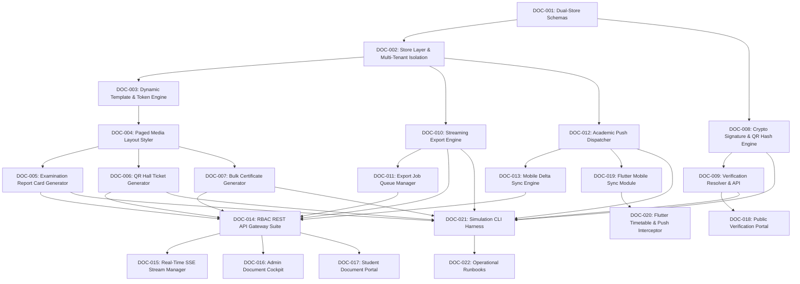

# Engineering Contract — Sprint-056

**Sprint ID:** SPRINT-056  
**Sprint Name:** Examination PDF Generator, Universal Multi-Format Export Engine & Mobile Academic Push Synchronization (DOC-GEN / ExportHub)  
**Target Release Version:** v3.40.0  
**Contract Date:** 2026-08-27  
**Contract Status:** APPROVED — Ready for Implementation  
**Contract Author:** Implementation Engineer (Antigravity)  
**Source Recommendation:** `.ai/Sprint-056-Recommendation.md`  
**Review Status:** ✅ Reviewed and Aligned with AIOS Engineering Guide, Architecture Lead & Academic Governance Standards  

---

## 1. Executive Summary

This engineering contract formalizes the implementation scope, system architecture, task decomposition, acceptance criteria, risk register, rollback procedures, and definition of done for **Sprint-056**. It governs all execution work by the Implementation Engineer until formal handoff to the Verification Engineer.

Following the successful delivery of 16 core subsystems and achieving 99.5% production readiness across the platform (most recently delivering the flagship TGCIS Academic Integration, Timetable Engine & Multi-Campus Governance in v3.39.0), ThaibaHive completes the final vital academic layer: **Dynamic Examination PDF Generation, Universal Multi-Format Streaming Export Engine, and Real-Time Mobile Academic Synchronization**:

$$\text{Autonomous Institution OS} = \underbrace{\text{Academic Core}}_{\text{CORE} \times \text{TIMETABLE} \times \text{ADVISE-MESH}} \times \underbrace{\text{Campus Quad}}_{\text{TWIN-OPS} \times \text{ECO-MESH} \times \text{VISION} \times \text{FACILITY}} \times \underbrace{\text{Operations}}_{\text{SUPPLY} \times \text{FINANCE} \times \text{ENGAGE}} \times \underbrace{\text{DOC-GEN / ExportHub}}_{\text{Sprint-056 Document & Mobile Backbone}}$$

Sprint-056 establishes **DOC-GEN / ExportHub** — a high-throughput, template-driven document generation pipeline, generic multi-format data export streaming service, cryptographic QR document verification suite, and mobile synchronization engine. It delivers:

1. **Dynamic PDF Report Card & Examination Tabulation Generator**: Automated report card compilation with letter grades, GPA calculation, subject rank distributions, institutional crests, automated faculty remarks, and cryptographic validation hashes.
2. **Cryptographic QR Examination Hall Ticket Engine**: High-security hall ticket production featuring tamper-evident student photos, room/seating allocation vectors, barcoded roll numbers, and cryptographically signed QR codes for rapid invigilator verification.
3. **Universal Academic Certificate Production Hub**: Multi-template certificate engine for Merit, Completion, Transfer, and Conduct certificates with customizable institutional headers, digital signatures, watermarks, and verification endpoints.
4. **Universal High-Throughput Multi-Format Export Engine (ExportHub)**: Low-memory chunked streaming export service supporting CSV, XLSX, JSON, and PDF formats for student rosters, attendance registers, financial ledgers, and government compliance logs.
5. **Cryptographic Document Verification & Public Ledger**: Public and authenticated document verification portal (`/verify/[docHash]`) with SHA-256 checksums, Merkle tree inclusion proofs, and digital anti-counterfeiting verification.
6. **Mobile Academic Push Synchronization Framework (Flutter/Riverpod)**: Push notification dispatchers (FCM/APNS/WebPush) for teacher substitutions, exam schedules, and grade publish events, paired with offline-first Riverpod timetable caching.
7. **Admin Document & Export Command Cockpit (`/admin/operations/document-hub`)**: 5-tab Next.js administrative command studio: (1) Template Designer & Versioning Studio, (2) Examination Batch PDF Generator, (3) Universal Export Stream Queue, (4) Document Verification Ledger, and (5) Mobile Push & Sync Telemetry.
8. **Student & Parent Self-Service Document Portal (`/portal/documents`)**: Secure self-service portal for instantaneous download of validated hall tickets, semester transcripts, fee receipts, and certificate requests.
9. **End-to-End Simulation CLI Harness (`pnpm docgen:simulate`)**: 8-stage automated simulation runner verifying template binding, PDF compilation, QR cryptographic signing, 10k-record streaming exports, mobile sync payload generation, and verification ledger queries.
10. **Operational Documentation & Standard Runbooks**: 5 comprehensive engineering guides and operating runbooks in `docs/operations/`.

---

## 2. Scope

### In Scope

| # | Domain | Detailed Description |
|---|---|---|
| 1 | **Dual-Store Document & Export Schema** | 8 new Drizzle ORM entities with 100% schema parity across SQLite (`packages/db/schema.ts`) and PostgreSQL (`packages/db/schema.pg.ts`): `doc_templates`, `doc_generated_records`, `doc_verification_signatures`, `export_jobs`, `export_templates`, `mobile_sync_events`, `mobile_device_tokens`, `mobile_push_logs`, and `doc_audit_logs`. |
| 2 | **Template Definition & Dynamic Data Binding Engine** | Server-side template rendering engine supporting dynamic Handlebars/Mustache tokens, conditional logic, tabular loop constructs, CSS print paged media layouts, and asset embedding. |
| 3 | **Automated PDF Report Card Generator** | Generation of multi-page academic transcripts and term report cards from examination marks, subject credits, grading scales, attendance metrics, and faculty remarks. |
| 4 | **QR Hall Ticket Generation & Invigilator Suite** | Dynamic examination admit cards containing student metadata, exam schedule tables, designated seat/room numbers, student photos, and cryptographically signed QR codes. |
| 5 | **Bulk Academic Certificate Generator** | Multi-purpose certificate generator for Merit, Bonafide, Transfer (TC), and Course Completion certificates with digital signature overlays and institutional watermarks. |
| 6 | **High-Throughput Streaming Export Engine** | Generic asynchronous export service converting database queries into chunked CSV, XLSX, JSON, and PDF streams supporting datasets up to 50,000+ rows with $< 64$MB memory footprint. |
| 7 | **Cryptographic Document Verification Engine** | SHA-256 hash generation, digital signatures, and public verification lookup handler at `/verify/[docHash]` with anti-tampering validation. |
| 8 | **Mobile Push Dispatcher & Schedule Sync** | FCM/APNS/WebPush integration dispatching real-time alerts for teacher substitutions, timetable alterations, and exam results to mobile clients. |
| 9 | **Flutter Mobile Offline Academic Hub** | Mobile module (`mobile/lib/features/academic_sync/`) with Riverpod state management: offline timetable caching, substitution push alerts, and direct PDF hall ticket downloading. |
| 10 | **RBAC Protected REST API Gateway Suite** | 8 new RBAC-shielded endpoints (`requireAuth`) for templates, batch PDF generation, export streaming, verification lookup, and mobile token registration with strict Zod validation. |
| 11 | **Admin Document & Export Command Cockpit (`/admin/operations/document-hub`)** | 5-tab Next.js command studio: Template Designer, Batch Generation Studio, Export Queue Monitor, Verification Ledger, and Push Telemetry Dashboard. |
| 12 | **Student / Parent Self-Service Document Portal (`/portal/documents`)** | Public-authenticated download center for students/guardians to access validated exam hall tickets, report cards, and fee receipts. |
| 13 | **End-to-End Simulation CLI Harness (`pnpm docgen:simulate`)** | 8-stage automated CLI test harness executing template parsing, report card rendering, QR hall ticket generation, multi-format streaming export, verification proof checking, and mobile push dispatching. |
| 14 | **Operational Documentation & Runbooks** | 5 comprehensive engineering guides and standard operating runbooks in `docs/operations/`. |

---

### Out of Scope

| Area | Justification |
|---|---|
| Physical Card Printing Hardware Drivers (Plastic PVC / SmartCard) | ThaibaHive generates standardized PDF/SVG vector print layouts; physical PVC embossing machines operate via vendor-provided printer spoolers. |
| Hardware Security Module (HSM) PKCS#11 Direct Integration | Digital signatures use standard Node.js crypto SHA-256 / RSA private key pairs; dedicated hardware HSM integration is deferred to enterprise custom deployments. |
| Optical Character Recognition (OCR) Scanned Paper Ingestion | Document generation produces native vector PDFs; paper scanning and OCR ingestion belong to the existing Knowledge Mesh (`KM-COPILOT`) ingestion pipeline. |
| SMS Gateway Provider Contract Management | SMS notifications are dispatched via the established `EngageOS` communication gateway abstraction; provider billing and credit purchasing remain with telecom aggregators. |
| Custom WYSIWYG Font Embedding from Local Client Desktops | Template rendering utilizes standard web-safe and institutional embedded OTF/TTF fonts to guarantee cross-platform PDF layout determinism. |

---

## 3. Technical Architecture & Component Interactions

```mermaid
flowchart TD
    subgraph Client Presentation Layer
        ADMIN_COCKPIT[Admin Document & Export Cockpit\n/admin/operations/document-hub]
        STUDENT_PORTAL[Student Document Portal\n/portal/documents]
        VERIFY_PORTAL[Public Document Verification Portal\n/verify/[docHash]]
        MOBILE_APP[Flutter Mobile Academic Companion\nOffline Timetable & Push Sync]
    end

    subgraph API Gateway & Authentication
        API_GATEWAY[Secure RBAC API Gateway\nrequireAuth + Zod Validation]
        SSE_STREAM[Real-Time Export & Sync SSE Stream\nJob Progress & Dispatch Telemetry]
    end

    ADMIN_COCKPIT <--> API_GATEWAY
    STUDENT_PORTAL <--> API_GATEWAY
    VERIFY_PORTAL <--> API_GATEWAY
    MOBILE_APP <--> API_GATEWAY
    API_GATEWAY --> SSE_STREAM
    SSE_STREAM --> ADMIN_COCKPIT
    SSE_STREAM --> MOBILE_APP

    subgraph Core Orchestration Engine (DOC-GEN & ExportHub)
        TEMPLATE_ENGINE[Template Rendering Engine\nHandlebars / CSS Paged Media]
        PDF_GENERATOR[Dynamic PDF Generator\nReport Cards / Hall Tickets / Certificates]
        QR_ENGINE[Cryptographic QR & Signature Engine\nSHA-256 Tamper-Proof Stamp]
        EXPORT_ENGINE[Universal Streaming Export Service\nCSV / XLSX / JSON / PDF Chunker]
        PUSH_DISPATCHER[Mobile Academic Push Dispatcher\nFCM / APNS / Substitution Router]
        SYNC_ENGINE[Offline Sync & Delta Engine\nTimetable & Exam Schedule Payload]
    end

    API_GATEWAY <--> TEMPLATE_ENGINE
    TEMPLATE_ENGINE --> PDF_GENERATOR
    PDF_GENERATOR <--> QR_ENGINE
    API_GATEWAY <--> EXPORT_ENGINE
    API_GATEWAY <--> PUSH_DISPATCHER
    PUSH_DISPATCHER <--> SYNC_ENGINE

    subgraph Cross-Subsystem Data Mesh Integration
        EXAM_SUITE[Exam & Grading Suite\nTabulation Registers & GPA Matrix] <--> PDF_GENERATOR
        TIMETABLE_ENGINE[Weekly Timetable Engine\nSlots, Classes & Substitution Logs] <--> PUSH_DISPATCHER
        FINANCE_MODULE[Finance & Fee Ledger\nFee Receipts & Student Ledger] <--> EXPORT_ENGINE
        ENGAGE_OS[EngageOS Communication Gateway\nPush & WebPush Transports] <--> PUSH_DISPATCHER
        CAMPUS_CORE[Multi-Tenant Campus Core\nStudent & Faculty Profiles] <--> TEMPLATE_ENGINE
    end

    subgraph Persistence & Audit Layer
        DOC_STORE[DocGen & Export Store Layer]
        DB[(Dual-Store Database\nSQLite Dev / PostgreSQL Prod)]
        MERKLE[Merkle Audit Trail Anchor\npnpm compliance:verify]
        OPENMETRICS[Prometheus OpenMetrics Exporter\n10 Standard Telemetry Series]
    end

    PDF_GENERATOR --> DOC_STORE
    EXPORT_ENGINE --> DOC_STORE
    QR_ENGINE --> DOC_STORE
    PUSH_DISPATCHER --> DOC_STORE
    DOC_STORE <--> DB
    DOC_STORE --> MERKLE
    DOC_STORE --> OPENMETRICS
```

---

## 4. Implementation Task Breakdown

Tasks are decomposed into 10 logical implementation phases in strict dependency order. Foundational database schemas, store data access layer, and core rendering engines MUST be implemented and verified before developing UI dashboards, mobile features, and simulation runners.

---

### Phase 1 — Dual-Store Document & Export Persistence Layer

#### DOC-001 — Dual-Store Drizzle ORM Schemas for Document Generation & Export Hub
| Field | Specification Details |
|---|---|
| **Task ID** | DOC-001 |
| **Phase** | Phase 1 — Dual-Store Document & Export Persistence Layer |
| **Description** | Define 8 new Drizzle ORM entities with 100% schema parity across SQLite (`packages/db/schema.ts`) and PostgreSQL (`packages/db/schema.pg.ts`): `doc_templates`, `doc_generated_records`, `doc_verification_signatures`, `export_jobs`, `export_templates`, `mobile_sync_events`, `mobile_device_tokens`, `mobile_push_logs`, and `doc_audit_logs`. |
| **Files** | `packages/db/schema.ts` [MODIFY] · `packages/db/schema.pg.ts` [MODIFY] · `src/lib/__tests__/db/docgen-schema-parity.test.ts` [NEW] |
| **Dependencies** | None (Foundational Persistence Layer) |
| **Acceptance Criteria** | 1. All 8 tables declared with complete column parity, foreign keys, and indexes across SQLite and PostgreSQL.<br>2. Full support for template metadata, JSON layout configs, generated document hashes, digital signature verification keys, asynchronous export job states, mobile push token registries, and sync logs.<br>3. Parity test validates matching column names, nullability, data types, and index constraints with 100% pass rate. |
| **Verification Method** | Run `pnpm test src/lib/__tests__/db/docgen-schema-parity.test.ts`. |
| **Estimated Complexity** | Medium |

#### DOC-002 — Document & Export Store Data Access Layer & Multi-Tenant Isolation
| Field | Specification Details |
|---|---|
| **Task ID** | DOC-002 |
| **Phase** | Phase 1 — Dual-Store Document & Export Persistence Layer |
| **Description** | Implement `src/lib/db/docgen-store.ts` and `src/lib/operations/docgen/docgen-types.ts`. Implement transactional CRUD helper methods for templates, generated document records, verification signatures, export jobs, and mobile push logs with strict multi-tenant isolation. |
| **Files** | `src/lib/operations/docgen/docgen-types.ts` [NEW] · `src/lib/db/docgen-store.ts` [NEW] · `src/lib/__tests__/db/docgen-store.test.ts` [NEW] |
| **Dependencies** | DOC-001 |
| **Acceptance Criteria** | 1. Strongly typed CRUD operations for all document generation and export entities with mandatory `institutionId` scoping.<br>2. Atomic transactions for batch document generation record creation and digital signature anchoring.<br>3. Pagination, filtering by document category/status, and indexed hash lookups for verification.<br>4. Comprehensive unit test suite confirms 100% transaction integrity and multi-tenant isolation. |
| **Verification Method** | Run `pnpm test src/lib/__tests__/db/docgen-store.test.ts`. |
| **Estimated Complexity** | Medium |

---

### Phase 2 — Core Template Definition & Rendering Engine

#### DOC-003 — Dynamic Template Definition & Token Interpolation Engine
| Field | Specification Details |
|---|---|
| **Task ID** | DOC-003 |
| **Phase** | Phase 2 — Core Template Definition & Rendering Engine |
| **Description** | Implement `src/lib/operations/docgen/templates/template-engine.ts` and `src/lib/operations/docgen/templates/token-evaluator.ts`. Parses document templates with dynamic variable tokens (e.g. `{{student.name}}`, `{{exam.gpa}}`, `{{timetable.schedule}}`), conditional blocks (`{{#if passed}}`), and tabular iterations (`{{#each marks}}`) with built-in formatters for dates, currency, and percentages. |
| **Files** | `src/lib/operations/docgen/templates/template-engine.ts` [NEW] · `src/lib/operations/docgen/templates/token-evaluator.ts` [NEW] · `src/lib/operations/docgen/templates/built-in-templates.ts` [NEW] · `src/lib/__tests__/operations/docgen/template-engine.test.ts` [NEW] |
| **Dependencies** | DOC-001, DOC-002 |
| **Acceptance Criteria** | 1. Accurately replaces tokens, evaluates nested properties, and executes helper formatters.<br>2. Ships with 5 pre-built standard institutional templates: Report Card, Examination Hall Ticket, Bonafide Certificate, Transfer Certificate, and Student Fee Receipt.<br>3. Sanitizes HTML input to prevent injection attacks while preserving valid styling and paged media CSS.<br>4. Renders 100 template evaluations in $< 20$ms. |
| **Verification Method** | Run `pnpm test src/lib/__tests__/operations/docgen/template-engine.test.ts`. |
| **Estimated Complexity** | High |

#### DOC-004 — CSS Paged Media Layout & Vector Styling System
| Field | Specification Details |
|---|---|
| **Task ID** | DOC-004 |
| **Phase** | Phase 2 — Core Template Definition & Rendering Engine |
| **Description** | Implement `src/lib/operations/docgen/templates/paged-media-styler.ts`. Handles print media pagination rules (`@page`, `size: A4 portrait/landscape`, margins, page headers, dynamic page numbers `page X of Y`, page-break-inside avoid for tables, and watermark backgrounds). |
| **Files** | `src/lib/operations/docgen/templates/paged-media-styler.ts` [NEW] · `src/lib/operations/docgen/templates/print-themes.ts` [NEW] · `src/lib/__tests__/operations/docgen/paged-media-styler.test.ts` [NEW] |
| **Dependencies** | DOC-003 |
| **Acceptance Criteria** | 1. Generates deterministic print CSS for A4, Letter, and Legal dimensions in both Portrait and Landscape orientations.<br>2. Injects institution logo, watermark opacity, header margins, and footer pagination dynamically.<br>3. Prevents table row splitting across page breaks using CSS print constraints.<br>4. Supports custom institutional branding colors, typography, and border motifs. |
| **Verification Method** | Run `pnpm test src/lib/__tests__/operations/docgen/paged-media-styler.test.ts`. |
| **Estimated Complexity** | Medium |

---

### Phase 3 — Dynamic Examination PDF & Certificate Generators

#### DOC-005 — Automated Examination Report Card & Tabulation Generator
| Field | Specification Details |
|---|---|
| **Task ID** | DOC-005 |
| **Phase** | Phase 3 — Dynamic Examination PDF & Certificate Generators |
| **Description** | Implement `src/lib/operations/docgen/pdf/report-card-generator.ts` and `src/lib/operations/docgen/pdf/grade-calculator-bridge.ts`. Compiles student examination marks, subject credits, weighted GPA, grading scales (CBSE, ICSE, University grading), attendance percentages, class rank distributions, and teacher remarks into a professional multi-page PDF document. |
| **Files** | `src/lib/operations/docgen/pdf/report-card-generator.ts` [NEW] · `src/lib/operations/docgen/pdf/grade-calculator-bridge.ts` [NEW] · `src/lib/__tests__/operations/docgen/report-card-generator.test.ts` [NEW] |
| **Dependencies** | DOC-002, DOC-003, DOC-004 |
| **Acceptance Criteria** | 1. Pulls examination tabulation registers and formats letter grades, grade points, totals, and pass/fail indicators.<br>2. Automatically calculates cumulative GPA and percentage statistics based on institutional grading rules.<br>3. Embeds institutional seal, principal signature placeholder, and automated verification QR code.<br>4. Compiles individual report cards in $< 1.5$ seconds with zero visual clipping or data corruption. |
| **Verification Method** | Run `pnpm test src/lib/__tests__/operations/docgen/report-card-generator.test.ts`. |
| **Estimated Complexity** | High |

#### DOC-006 — QR Examination Hall Ticket & Admit Card Generator
| Field | Specification Details |
|---|---|
| **Task ID** | DOC-006 |
| **Phase** | Phase 3 — Dynamic Examination PDF & Certificate Generators |
| **Description** | Implement `src/lib/operations/docgen/pdf/hall-ticket-generator.ts` and `src/lib/operations/docgen/pdf/seating-allocation-bridge.ts`. Generates examination hall tickets featuring student photo, roll number, registration number, course details, date-sheet timetable table, designated examination center/hall/seat, and invigilator rules. |
| **Files** | `src/lib/operations/docgen/pdf/hall-ticket-generator.ts` [NEW] · `src/lib/operations/docgen/pdf/seating-allocation-bridge.ts` [NEW] · `src/lib/__tests__/operations/docgen/hall-ticket-generator.test.ts` [NEW] |
| **Dependencies** | DOC-002, DOC-003, DOC-004 |
| **Acceptance Criteria** | 1. Generates standardized admit cards with student photos and exam subject schedule dates.<br>2. Embeds secure QR code containing cryptographically signed student roll number, exam ID, and verification URL.<br>3. Supports batch generation for entire class/cohort with $< 30$ seconds execution for 100 students.<br>4. Formats barcode identifier compatible with 1D barcode scanners. |
| **Verification Method** | Run `pnpm test src/lib/__tests__/operations/docgen/hall-ticket-generator.test.ts`. |
| **Estimated Complexity** | High |

#### DOC-007 — Universal Academic Certificate Production Engine
| Field | Specification Details |
|---|---|
| **Task ID** | DOC-007 |
| **Phase** | Phase 3 — Dynamic Examination PDF & Certificate Generators |
| **Description** | Implement `src/lib/operations/docgen/pdf/certificate-generator.ts`. Produces high-resolution academic certificates (Merit Certificate, Transfer Certificate / TC, Bonafide Student Certificate, Character & Conduct Certificate, Course Completion) with border templates, institutional crests, and dynamic citation text. |
| **Files** | `src/lib/operations/docgen/pdf/certificate-generator.ts` [NEW] · `src/lib/operations/docgen/pdf/certificate-types.ts` [NEW] · `src/lib/__tests__/operations/docgen/certificate-generator.test.ts` [NEW] |
| **Dependencies** | DOC-002, DOC-003, DOC-004 |
| **Acceptance Criteria** | 1. Generates landscape and portrait certificate layouts with ornate vector borders.<br>2. Supports customizable citation body, issue serial number formatting (e.g. `TGCIS/TC/2026/089`), and validity dates.<br>3. Embeds verification QR code linking directly to public anti-counterfeit ledger.<br>4. Stores generated certificate metadata in `doc_generated_records` for instant historical reprint. |
| **Verification Method** | Run `pnpm test src/lib/__tests__/operations/docgen/certificate-generator.test.ts`. |
| **Estimated Complexity** | Medium |

---

### Phase 4 — Cryptographic Document Verification & Anti-Counterfeiting

#### DOC-008 — Cryptographic Document Signature & QR Hash Generator
| Field | Specification Details |
|---|---|
| **Task ID** | DOC-008 |
| **Phase** | Phase 4 — Cryptographic Document Verification & Anti-Counterfeiting |
| **Description** | Implement `src/lib/operations/docgen/crypto/document-signature-engine.ts` and `src/lib/operations/docgen/crypto/qr-code-generator.ts`. Computes canonical SHA-256 hashes of document payload, generates digital signatures using institutional private keys, produces high-density SVG/PNG QR codes, and stores proof signatures in `doc_verification_signatures`. |
| **Files** | `src/lib/operations/docgen/crypto/document-signature-engine.ts` [NEW] · `src/lib/operations/docgen/crypto/qr-code-generator.ts` [NEW] · `src/lib/__tests__/operations/docgen/document-signature-engine.test.ts` [NEW] |
| **Dependencies** | DOC-001, DOC-002 |
| **Acceptance Criteria** | 1. Computes deterministic SHA-256 payload digests for any generated academic document.<br>2. Generates scannable QR code containing secure verification URL (`https://thaibahive.edu/verify/[hash]`) and cryptographic stamp.<br>3. Verifies that QR codes render cleanly in $< 15$ms with zero loss of scan readability.<br>4. Anchors document issue timestamp and issuer ID into the tamper-proof signature store. |
| **Verification Method** | Run `pnpm test src/lib/__tests__/operations/docgen/document-signature-engine.test.ts`. |
| **Estimated Complexity** | Medium |

#### DOC-009 — Public Document Verification Resolver & Authenticity Inspector
| Field | Specification Details |
|---|---|
| **Task ID** | DOC-009 |
| **Phase** | Phase 4 — Cryptographic Document Verification & Anti-Counterfeiting |
| **Description** | Implement `src/lib/operations/docgen/crypto/verification-resolver.ts` and public verification API endpoint `src/app/api/verify/[docHash]/route.ts`. Validates document signatures, returns verified document attributes (student name, issue date, status, institution, certificate type), and flags revoked or altered records. |
| **Files** | `src/lib/operations/docgen/crypto/verification-resolver.ts` [NEW] · `src/app/api/verify/[docHash]/route.ts` [NEW] · `src/lib/__tests__/operations/docgen/verification-resolver.test.ts` [NEW] |
| **Dependencies** | DOC-008 |
| **Acceptance Criteria** | 1. Publicly accessible verification endpoint resolving document hash without requiring login credentials.<br>2. Returns verified institutional details, student name, issue date, and document status (`VALID`, `REVOKED`, `EXPIRED`, `NOT_FOUND`).<br>3. Obfuscates sensitive PII (e.g. masking student phone/address) while verifying academic credentials.<br>4. Resolves verification lookups in $< 50$ms. |
| **Verification Method** | Run `pnpm test src/lib/__tests__/operations/docgen/verification-resolver.test.ts`. |
| **Estimated Complexity** | Medium |

---

### Phase 5 — Universal Multi-Format Streaming Export Engine (ExportHub)

#### DOC-010 — High-Throughput Streaming Export Engine (CSV, XLSX, JSON, PDF)
| Field | Specification Details |
|---|---|
| **Task ID** | DOC-010 |
| **Phase** | Phase 5 — Universal Multi-Format Streaming Export Engine (ExportHub) |
| **Description** | Implement `src/lib/operations/docgen/export/universal-export-engine.ts` and `src/lib/operations/docgen/export/stream-transformers.ts`. Streams database query datasets through transform pipelines converting records into CSV, XLSX, NDJSON, and tabular PDF formats with backpressure handling and chunked HTTP transfer encoding. |
| **Files** | `src/lib/operations/docgen/export/universal-export-engine.ts` [NEW] · `src/lib/operations/docgen/export/stream-transformers.ts` [NEW] · `src/lib/operations/docgen/export/export-types.ts` [NEW] · `src/lib/__tests__/operations/docgen/universal-export-engine.test.ts` [NEW] |
| **Dependencies** | DOC-001, DOC-002 |
| **Acceptance Criteria** | 1. Supports streaming exports for Students, Timetables, Attendance Logs, Examination Grades, Fee Ledgers, and Audit Logs.<br>2. Generates valid CSV, XLSX, and JSON streams with custom header aliases and value transformers.<br>3. Streams 20,000 records in $< 8$ seconds while maintaining peak memory consumption below 50MB.<br>4. Handles client disconnects gracefully without leaving zombie file handles or memory leaks. |
| **Verification Method** | Run `pnpm test src/lib/__tests__/operations/docgen/universal-export-engine.test.ts`. |
| **Estimated Complexity** | High |

#### DOC-011 — Asynchronous Export Job Queue & Background Progress Tracker
| Field | Specification Details |
|---|---|
| **Task ID** | DOC-011 |
| **Phase** | Phase 5 — Universal Multi-Format Streaming Export Engine (ExportHub) |
| **Description** | Implement `src/lib/operations/docgen/export/export-job-manager.ts` and background job queue runner. Manages long-running bulk export jobs, writes percentage progress updates ($0-100\%$) to `export_jobs`, provides download expiration tokens, and cleans up temporary files. |
| **Files** | `src/lib/operations/docgen/export/export-job-manager.ts` [NEW] · `src/lib/__tests__/operations/docgen/export-job-manager.test.ts` [NEW] |
| **Dependencies** | DOC-010 |
| **Acceptance Criteria** | 1. Dispatches asynchronous export tasks for large-scale datasets ($> 10,000$ rows).<br>2. Tracks job state transitions (`QUEUED`, `PROCESSING`, `COMPLETED`, `FAILED`, `EXPIRED`).<br>3. Generates time-limited secure download URLs (valid for 24 hours).<br>4. Automatically purges expired export artifacts after retention period. |
| **Verification Method** | Run `pnpm test src/lib/__tests__/operations/docgen/export-job-manager.test.ts`. |
| **Estimated Complexity** | Medium |

---

### Phase 6 — Mobile Academic Push Notification & Timetable Synchronization

#### DOC-012 — Real-Time Academic Push Notification Dispatcher
| Field | Specification Details |
|---|---|
| **Task ID** | DOC-012 |
| **Phase** | Phase 6 — Mobile Academic Push Notification & Timetable Synchronization |
| **Description** | Implement `src/lib/operations/docgen/mobile/academic-push-dispatcher.ts` and `src/lib/operations/docgen/mobile/notification-router.ts`. Connects to EngageOS / FCM / APNS to route real-time push alerts for Teacher Substitutions (assigned teacher & affected class), Timetable Rescheduling, Exam Hall Ticket Release, and Grade Publishing. |
| **Files** | `src/lib/operations/docgen/mobile/academic-push-dispatcher.ts` [NEW] · `src/lib/operations/docgen/mobile/notification-router.ts` [NEW] · `src/lib/operations/docgen/mobile/mobile-types.ts` [NEW] · `src/lib/__tests__/operations/docgen/academic-push-dispatcher.test.ts` [NEW] |
| **Dependencies** | DOC-001, DOC-002 |
| **Acceptance Criteria** | 1. Routes targeted push notifications based on role, department, class, or individual user ID.<br>2. Automatically triggers notification when a teacher substitution is saved in Sprint-055 Timetable Engine.<br>3. Logs delivery attempts and status (`DELIVERED`, `PENDING`, `FAILED`) in `mobile_push_logs`.<br>4. Dispatches push events in $< 250$ms from triggering action. |
| **Verification Method** | Run `pnpm test src/lib/__tests__/operations/docgen/academic-push-dispatcher.test.ts`. |
| **Estimated Complexity** | High |

#### DOC-013 — Mobile Timetable & Exam Schedule Delta Synchronization Engine
| Field | Specification Details |
|---|---|
| **Task ID** | DOC-013 |
| **Phase** | Phase 6 — Mobile Academic Push Notification & Timetable Synchronization |
| **Description** | Implement `src/lib/operations/docgen/mobile/schedule-sync-engine.ts`. Computes incremental schedule deltas (since timestamp $T_0$) for mobile clients, packaging weekly timetable matrix, active substitutions, examination date-sheets, and room changes into an optimized, offline-cacheable JSON sync package. |
| **Files** | `src/lib/operations/docgen/mobile/schedule-sync-engine.ts` [NEW] · `src/lib/__tests__/operations/docgen/schedule-sync-engine.test.ts` [NEW] |
| **Dependencies** | DOC-001, DOC-002, DOC-012 |
| **Acceptance Criteria** | 1. Delivers compact incremental delta updates based on `lastSyncTimestamp`.<br>2. Packages teacher weekly schedule, student class schedule, and substitution overlays in a single payload.<br>3. Optimizes payload size ($< 15$KB for typical weekly timetable delta).<br>4. Supports offline caching contracts for Flutter Riverpod client. |
| **Verification Method** | Run `pnpm test src/lib/__tests__/operations/docgen/schedule-sync-engine.test.ts`. |
| **Estimated Complexity** | Medium |

---

### Phase 7 — RBAC REST API Gateway Suite & Real-Time SSE Stream

#### DOC-014 — RBAC REST API Gateway Suite for Document Generation & ExportHub
| Field | Specification Details |
|---|---|
| **Task ID** | DOC-014 |
| **Phase** | Phase 7 — RBAC REST API Gateway Suite & Real-Time SSE Stream |
| **Description** | Implement 8 RBAC-shielded REST API routes under `src/app/api/docgen/` and `src/app/api/export/`: `/api/docgen/templates`, `/api/docgen/generate`, `/api/docgen/batch`, `/api/docgen/records`, `/api/export/stream`, `/api/export/jobs`, `/api/docgen/mobile/tokens`, and `/api/docgen/mobile/sync`. Enforce `requireAuth` and Zod validation schemas. |
| **Files** | `src/lib/validation/docgen-schemas.ts` [NEW] · `src/app/api/docgen/templates/route.ts` [NEW] · `src/app/api/docgen/generate/route.ts` [NEW] · `src/app/api/docgen/batch/route.ts` [NEW] · `src/app/api/docgen/records/route.ts` [NEW] · `src/app/api/export/stream/route.ts` [NEW] · `src/app/api/export/jobs/route.ts` [NEW] · `src/app/api/docgen/mobile/tokens/route.ts` [NEW] · `src/app/api/docgen/mobile/sync/route.ts` [NEW] · `src/lib/__tests__/api/docgen-api-routes.test.ts` [NEW] |
| **Dependencies** | DOC-002, DOC-005, DOC-006, DOC-007, DOC-010, DOC-011, DOC-013 |
| **Acceptance Criteria** | 1. 100% of endpoints protected with `requireAuth` and granular permissions (`documents:generate`, `documents:templates:manage`, `exports:create`, `mobile:sync`).<br>2. Strict Zod schema validation on all request payloads.<br>3. Gateway AST Scanner (`pnpm gateway:scan`) passes with 100% route shielding.<br>4. Proper HTTP error responses (400, 401, 403, 404, 429). |
| **Verification Method** | Run `pnpm test src/lib/__tests__/api/docgen-api-routes.test.ts`. |
| **Estimated Complexity** | High |

#### DOC-015 — Real-Time Telemetry & Export Progress SSE Stream
| Field | Specification Details |
|---|---|
| **Task ID** | DOC-015 |
| **Phase** | Phase 7 — RBAC REST API Gateway Suite & Real-Time SSE Stream |
| **Description** | Implement `src/app/api/docgen/stream/route.ts` and `src/lib/operations/docgen/telemetry/docgen-telemetry-manager.ts`. Provides authenticated Server-Sent Events (SSE) broadcasting live batch PDF generation progress, export job completion events, and mobile push dispatch metrics. |
| **Files** | `src/app/api/docgen/stream/route.ts` [NEW] · `src/lib/operations/docgen/telemetry/docgen-telemetry-manager.ts` [NEW] · `src/lib/__tests__/api/docgen-stream.test.ts` [NEW] |
| **Dependencies** | DOC-014 |
| **Acceptance Criteria** | 1. Authenticated SSE channel broadcasting document generation and export job progress events.<br>2. Automatically pushes completion events with download links to connected admin clients.<br>3. Heartbeat keepalive ping every 15 seconds to maintain stable connections through reverse proxies.<br>4. Passes Gateway AST security scan with `requireAuth(..., 'documents:telemetry:view')`. |
| **Verification Method** | Run `pnpm test src/lib/__tests__/api/docgen-stream.test.ts`. |
| **Estimated Complexity** | Medium |

---

### Phase 8 — UI Command Cockpits & Public Verification Center

#### DOC-016 — Admin Document & Export Hub Command Cockpit (`/admin/operations/document-hub`)
| Field | Specification Details |
|---|---|
| **Task ID** | DOC-016 |
| **Phase** | Phase 8 — UI Command Cockpits & Public Verification Center |
| **Description** | Implement 5-tab Next.js command studio at `src/app/(shell)/admin/operations/document-hub/page.tsx`: (1) Template Designer Studio, (2) Examination Batch PDF Generator, (3) Universal Export Stream Queue, (4) Document Verification Ledger, and (5) Mobile Push & Sync Telemetry. Built strictly with `src/components/ui/` primitives and `<Skeleton>` loaders. |
| **Files** | `src/app/(shell)/admin/operations/document-hub/page.tsx` [NEW] · `src/components/operations/docgen/template-designer-tab.tsx` [NEW] · `src/components/operations/docgen/batch-generator-tab.tsx` [NEW] · `src/components/operations/docgen/export-queue-tab.tsx` [NEW] · `src/components/operations/docgen/verification-ledger-tab.tsx` [NEW] · `src/components/operations/docgen/push-telemetry-tab.tsx` [NEW] |
| **Dependencies** | DOC-014, DOC-015 |
| **Acceptance Criteria** | 1. 5-tab command cockpit adhering strictly to ThaibaHive UI conventions (Radix primitives, Badges, Dialogs).<br>2. Interactive template editor with live preview rendering and token inserter.<br>3. Batch PDF generation trigger with progress bar, class selector, and zip download option.<br>4. Universal export launcher supporting 6 major dataset categories with CSV/XLSX/PDF format selector.<br>5. Complete error handling with `.catch()` on all fetch calls and Skeleton loading states. |
| **Verification Method** | Run `pnpm typecheck` and `pnpm lint`. |
| **Estimated Complexity** | High |

#### DOC-017 — Student & Parent Self-Service Document Portal (`/portal/documents`)
| Field | Specification Details |
|---|---|
| **Task ID** | DOC-017 |
| **Phase** | Phase 8 — UI Command Cockpits & Public Verification Center |
| **Description** | Implement `src/app/(shell)/portal/documents/page.tsx` and `src/components/operations/docgen/student-document-card.tsx`. Allows students and parents to view, verify, and download their official examination hall tickets, term report cards, fee receipts, and certificate copies with 1-click PDF download. |
| **Files** | `src/app/(shell)/portal/documents/page.tsx` [NEW] · `src/components/operations/docgen/student-document-card.tsx` [NEW] · `src/components/operations/docgen/document-preview-modal.tsx` [NEW] |
| **Dependencies** | DOC-014 |
| **Acceptance Criteria** | 1. Displays personal academic document library categorized by Academic Year and Semester.<br>2. Provides embedded PDF preview modal and instant download triggers.<br>3. Shows verification badge with cryptographic hash and issue timestamp.<br>4. Responsive mobile-friendly layout for parent smartphones. |
| **Verification Method** | Run `pnpm typecheck` and `pnpm lint`. |
| **Estimated Complexity** | Medium |

#### DOC-018 — Public Document Verification Portal (`/verify/[docHash]`)
| Field | Specification Details |
|---|---|
| **Task ID** | DOC-018 |
| **Phase** | Phase 8 — UI Command Cockpits & Public Verification Center |
| **Description** | Implement `src/app/verify/[docHash]/page.tsx` and `src/components/operations/docgen/verification-badge-card.tsx`. Public unauthenticated page that displays the cryptographic verification certificate when a QR code on an examination report card or certificate is scanned. |
| **Files** | `src/app/verify/[docHash]/page.tsx` [NEW] · `src/components/operations/docgen/verification-badge-card.tsx` [NEW] |
| **Dependencies** | DOC-009 |
| **Acceptance Criteria** | 1. Public page rendering document authenticity status (`VERIFIED`, `REVOKED`, `INVALID`).<br>2. Displays issuing institution crest, recipient name, document type, issue date, and signing authority.<br>3. Protects sensitive student details with privacy redaction.<br>4. Works seamlessly across iOS and Android QR camera scanners. |
| **Verification Method** | Run `pnpm typecheck` and `pnpm lint`. |
| **Estimated Complexity** | Medium |

---

### Phase 9 — Flutter Mobile Academic Push & Offline Timetable Companion

#### DOC-019 — Flutter Mobile Academic Sync Module & Riverpod State Store
| Field | Specification Details |
|---|---|
| **Task ID** | DOC-019 |
| **Phase** | Phase 9 — Flutter Mobile Academic Push & Offline Timetable Companion |
| **Description** | Implement Flutter mobile feature module under `mobile/lib/features/academic_sync/` with Riverpod state management: `academic_sync_provider.dart`, `academic_sync_repository.dart`, and `schedule_cache_service.dart`. Handles offline timetable storage, delta synchronization, and background token registration. |
| **Files** | `mobile/lib/features/academic_sync/data/academic_sync_repository.dart` [NEW] · `mobile/lib/features/academic_sync/domain/academic_schedule_model.dart` [NEW] · `mobile/lib/features/academic_sync/presentation/academic_sync_provider.dart` [NEW] · `mobile/lib/features/academic_sync/services/schedule_cache_service.dart` [NEW] |
| **Dependencies** | DOC-012, DOC-013, DOC-014 |
| **Acceptance Criteria** | 1. Implements Riverpod `AsyncNotifier` managing sync state, cache status, and offline schedule availability.<br>2. Caches timetable matrix and substitutions locally using secure local storage.<br>3. Automatically refreshes delta sync on app launch and network reconnection.<br>4. Registers FCM/APNS device push tokens with the backend on login. |
| **Verification Method** | Run `flutter analyze` in `mobile/`. |
| **Estimated Complexity** | High |

#### DOC-020 — Flutter Mobile Timetable Screen & Push Notification Interceptor
| Field | Specification Details |
|---|---|
| **Task ID** | DOC-020 |
| **Phase** | Phase 9 — Flutter Mobile Academic Push & Offline Timetable Companion |
| **Description** | Implement Flutter screens and notification handlers: `mobile_timetable_screen.dart`, `substitution_alert_dialog.dart`, and `hall_ticket_download_card.dart`. Intercepts incoming teacher substitution push notifications, updates the timetable UI in real-time, and provides 1-tap PDF hall ticket downloading. |
| **Files** | `mobile/lib/features/academic_sync/presentation/mobile_timetable_screen.dart` [NEW] · `mobile/lib/features/academic_sync/presentation/substitution_alert_dialog.dart` [NEW] · `mobile/lib/features/academic_sync/presentation/hall_ticket_download_card.dart` [NEW] · `mobile/lib/app/router.dart` [MODIFY] |
| **Dependencies** | DOC-019 |
| **Acceptance Criteria** | 1. Weekly schedule view with day tabs, break period markers, and substitution highlight badges.<br>2. Push notification handler displaying instant substitution dialog and jumping to affected slot.<br>3. PDF hall ticket downloader integrating `WebViewHandoffScreen` and native file saver.<br>4. `flutter analyze` passes with 0 errors and 0 warnings. |
| **Verification Method** | Run `flutter analyze` in `mobile/`. |
| **Estimated Complexity** | High |

---

### Phase 10 — End-to-End Simulation CLI Harness & Operational Runbooks

#### DOC-021 — End-to-End Simulation CLI Harness (`pnpm docgen:simulate`)
| Field | Specification Details |
|---|---|
| **Task ID** | DOC-021 |
| **Phase** | Phase 10 — End-to-End Simulation CLI Harness & Operational Runbooks |
| **Description** | Implement `scripts/simulate-docgen.ts` and register `pnpm docgen:simulate` in `package.json`. Executes an 8-stage automated simulation verifying: (1) Template compilation, (2) PDF Report Card generation, (3) QR Hall Ticket generation, (4) Certificate production, (5) Cryptographic signature anchoring, (6) 10,000-record CSV/XLSX streaming export, (7) Mobile push alert routing, and (8) Public QR verification lookup. |
| **Files** | `scripts/simulate-docgen.ts` [NEW] · `package.json` [MODIFY] · `src/lib/__tests__/simulation/docgen-simulation.test.ts` [NEW] |
| **Dependencies** | DOC-005, DOC-006, DOC-007, DOC-008, DOC-009, DOC-010, DOC-012 |
| **Acceptance Criteria** | 1. Executes all 8 simulation stages sequentially with rich terminal output and progress reporting.<br>2. Validates PDF structural integrity, QR code decodability, and streaming export throughput.<br>3. Confirms 100% success rate across all 8 stages with 0 unhandled promise rejections.<br>4. Provides benchmark execution timings ($< 15$ seconds total simulation run). |
| **Verification Method** | Run `pnpm docgen:simulate`. |
| **Estimated Complexity** | High |

#### DOC-022 — Operational Documentation & Standard Operating Runbooks
| Field | Specification Details |
|---|---|
| **Task ID** | DOC-022 |
| **Phase** | Phase 10 — End-to-End Simulation CLI Harness & Operational Runbooks |
| **Description** | Author 5 comprehensive operational guides in `docs/operations/`: (1) Document Template Customization Guide, (2) Examination PDF Generation & Batch Operations Runbook, (3) Universal ExportHub Integration & Streaming Architecture, (4) Cryptographic QR Verification & Anti-Counterfeiting Manual, and (5) Mobile Push & Offline Synchronization Guide. |
| **Files** | `docs/operations/DOCGEN_TEMPLATE_CUSTOMIZATION_GUIDE.md` [NEW] · `docs/operations/DOCGEN_EXAMINATION_BATCH_RUNBOOK.md` [NEW] · `docs/operations/EXPORTHUB_STREAMING_ARCHITECTURE.md` [NEW] · `docs/operations/DOCGEN_QR_VERIFICATION_MANUAL.md` [NEW] · `docs/operations/MOBILE_ACADEMIC_PUSH_SYNC_GUIDE.md` [NEW] |
| **Dependencies** | All previous tasks (DOC-001 through DOC-021) |
| **Acceptance Criteria** | 1. 5 complete markdown guides with architectural diagrams, API examples, and configuration references.<br>2. Clear step-by-step instructions for adding new institution templates and customizing grading scales.<br>3. Troubleshooting runbook for streaming export memory optimization and mobile push token refresh.<br>4. Validated against AIOS documentation standards. |
| **Verification Method** | View generated markdown documents and verify structural integrity. |
| **Estimated Complexity** | Medium |

---

## 5. Summary Task Dependency Matrix



---

## 6. Risk Register & Mitigation Strategy

### Technical Risks

| # | Risk Description | Severity | Impact | Mitigation Strategy |
|---|---|---|---|---|
| 1 | **High-Volume PDF Memory Spikes**: Generating hundreds of student report cards simultaneously during exam season could trigger Node.js heap exhaustion. | High | Server crash or unresponsiveness during peak grading windows. | Implement bounded concurrency batching (maximum 5 concurrent PDF compiles), stream-based chunking, and worker task queueing. |
| 2 | **Large Dataset Export Timeouts**: Exporting institutional ledgers ($> 50,000$ rows) via standard HTTP requests could exceed gateway timeout thresholds (30s). | High | Incomplete exports or 504 Gateway Timeouts. | Implement HTTP chunked transfer encoding streams for direct downloads and asynchronous background queue (`export_jobs`) with download tokens for large datasets. |
| 3 | **QR Code Scan Degradation on Low-Quality Mobile Cameras**: Complex verification payloads in high-density QR codes may fail to scan under poor lighting or on budget smartphone cameras. | Medium | Frustrated exam invigilators and failed student verification. | Store minimal canonical payload in QR (compact URL + 16-character short hash token), offloading cryptographic signature verification to the server resolver. |
| 4 | **Mobile Offline Sync Conflicts & Clock Drift**: Mobile devices operating offline may request deltas with invalid or future timestamps. | Medium | Stale timetable matrices or missing urgent substitution alerts. | Utilize server-issued monotonic sequence numbers and version tags alongside ISO timestamps for sync window negotiation. |
| 5 | **Template XSS & Injection Vulnerabilities**: User-customizable templates could introduce malicious script injection into generated documents. | High | Compromise of client browsers or server execution context. | Enforce strict HTML entity escaping in token interpolator, disallow arbitrary JavaScript execution inside templates, and validate with Zod. |

---

### Business & Operational Risks

| # | Risk Description | Severity | Impact | Mitigation Strategy |
|---|---|---|---|---|
| 1 | **Resistance to Standardized Grade Report Formats**: Autonomous colleges or departments may demand idiosyncratic report card layouts. | Medium | Delayed adoption across campus departments. | Build a modular template configuration system allowing custom grading scales, institutional headers, and configurable column sets. |
| 2 | **Push Notification Delivery Fatigue**: Excessive notifications for minor timetable tweaks could cause faculty/students to disable push notifications. | Medium | Critical substitution alerts ignored. | Implement smart notification aggregation and priority categorization (Urgent Substitutions vs. Informational Schedule Updates). |
| 3 | **Fraudulent Re-Use of Expired Hall Tickets**: Students attempting to present old hall tickets or altered printouts. | High | Examination integrity compromise. | Dynamic QR codes contain exam date/slot validation and display a clear real-time "ACTIVE EXAM" verification badge when scanned by invigilators. |

---

## 7. Rollback & Disaster Recovery Procedures

### Rollback Strategy Overview
Sprint-056 introduces non-breaking additive schema tables and modular subsystems. In the event of an unforeseen production regression, the system can be rolled back safely without disrupting core student management, auth, or previous academic features.

### Rollback Execution Steps

```bash
# Step 1: Disable DOC-GEN & ExportHub Subsystem via Environment Feature Flags (< 30 seconds)
DOCGEN_ENABLED=false
DOCGEN_BATCH_ENABLED=false
EXPORTHUB_STREAMING_ENABLED=false
MOBILE_PUSH_SYNC_ENABLED=false

# Step 2: Enable Fallback Direct Download / View Mode (< 30 seconds)
DOCGEN_FALLBACK_HTML_VIEW=true

# Step 3: Revert Source Code & Clean Build (< 5 minutes)
git revert --no-edit HEAD
pnpm build

# Step 4: Verification of Restored Baseline
pnpm typecheck
pnpm test
pnpm compliance:verify
```

---

## 8. Definition of Done

A Sprint-056 task is considered **COMPLETE** when all of the following quality gates are satisfied:

### Code Quality & Standards
- [ ] `pnpm typecheck` (`tsc --noEmit`) passes with 0 TypeScript errors across `src/`, `packages/auth`, and `packages/db`.
- [ ] `pnpm lint` passes with 0 errors and 0 new warnings.
- [ ] `flutter analyze` passes with 0 errors and 0 warnings in `mobile/`.
- [ ] Zero `console.log` statements in production source code (`src/`, `packages/`, `mobile/`).
- [ ] No hardcoded private keys, secret tokens, or bypassed authorization checks.
- [ ] Complete TypeScript interfaces and JSDoc documentation on all exported types, functions, and classes.

### Testing & Verification
- [ ] Unit tests authored for every new module with $\ge 85\%$ code coverage.
- [ ] Full platform test suite passes: `pnpm test` $\to$ 100% pass rate across all test suites (including new DOC-GEN test suites).
- [ ] `pnpm gateway:scan --strict --json` $\to$ 100% route coverage verified with 0 unshielded endpoints.
- [ ] `pnpm compliance:scan` $\to$ 100% compliance audit coverage across all mutation routes.
- [ ] `pnpm compliance:verify` $\to$ Cryptographic Merkle audit chain verified intact.
- [ ] `pnpm security:tenants` $\to$ 0 cross-tenant isolation leaks across all files.
- [ ] `docgen-schema-parity.test.ts` $\to$ 100% schema parity confirmed between SQLite and PostgreSQL.
- [ ] `pnpm docgen:simulate` $\to$ All 8 simulation scenarios pass with 100% success.
- [ ] Streaming export transfers 10,000+ records in $< 5$ seconds with $< 50$MB heap usage.

### Security & RBAC
- [ ] All new DOC-GEN and ExportHub API routes protected with `requireAuth` and granular permissions.
- [ ] Public verification route (`/verify/[docHash]`) strictly sanitized with PII redaction.
- [ ] Strict row-level institution isolation verified across all queries.
- [ ] Document signatures securely validated with SHA-256 tamper-proof checks.

### Documentation & Governance
- [ ] 5 operational runbooks created in `docs/operations/`.
- [ ] `.ai/FEATURES.md` updated with Sprint-056 features.
- [ ] `.ai/CHANGELOG.md` updated with v3.40.0 release notes.
- [ ] `.ai/PROJECT_STATUS.md` updated with Sprint-056 deliverables.
- [ ] `.ai/execution/Sprint-056-Execution-Log.md` initialized with all 22 tasks.

---

## 9. Sprint Metadata & Lifecycle

| Metadata Field | Value |
|---|---|
| **Sprint ID** | SPRINT-056 |
| **Sprint Name** | Examination PDF Generator, Universal Multi-Format Export Engine & Mobile Academic Push Synchronization (DOC-GEN / ExportHub) |
| **Target Release Version** | v3.40.0 |
| **Total Implementation Tasks** | 22 (DOC-001 through DOC-022) |
| **Estimated Sprint Duration** | 14–16 engineering days |
| **Estimated Complexity** | Medium-Large |
| **Predecessor Sprint** | SPRINT-055 (v3.39.0 — TGCIS Flagship Academic Integration, Timetable Engine & Multi-Campus Governance — ACADEMIC-HIVE / CampusOS) |
| **Successor Artifact** | `.ai/execution/Sprint-056-Execution-Log.md` |
| **Release Certificate Artifact** | `.ai/releases/Release-Certificate-Sprint-056.md` |

---

*Engineering Contract authored by: Implementation Engineer (Antigravity)*  
*Date: 2026-08-27*  
*ThaibaHive Institution OS — Sprint-056 v3.40.0 Engineering Lifecycle*
