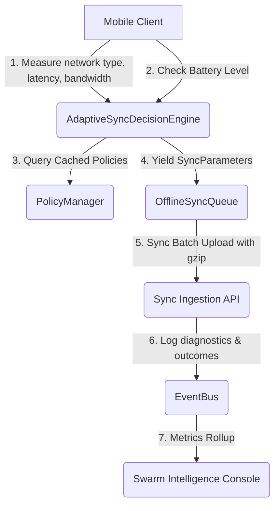

# Mobile Network-Aware Bandwidth Auto-Tuning Guide

This guide explains the architecture, administration, and runtime operations of the Mobile Network-Aware Bandwidth Auto-Tuning (MNAT) subsystem introduced in v3.8.0.

## Overview

The MNAT system optimizes sync performance and bandwidth usage by automatically adjusting batch sizes, compression levels, and retry backoffs based on active client network parameters.



## Administration Configuration

Administrators can configure network environment policy baselines via the **Swarm Intelligence Console** -> **Mobile Sync Diagnostics** tab.

### Policy Parameter Enforcements
1. **Max Batch Size**: Maximum number of outbox mutations included in a single HTTP POST request (1 - 200).
2. **Compression Level**: Gzip compression depth parameter (1 - 9).
3. **Retry Backoff (ms)**: Minimum backoff sleep between consecutive sync retries (1,000ms - 120,000ms).
4. **Min Bandwidth (kbps)**: Minimum bandwidth threshold to activate the policy.
5. **Max Latency (ms)**: Maximum round-trip time threshold to activate the policy.

## Reset Runbook

If tuning policies need to be reset to system-provided defaults, run the CLI utility script:

```bash
npx tsx scripts/reset-sync-policies.ts
```

This clears the `sync_tuning_policies` table in SQLite/PostgreSQL and seeds baseline records:
- **WIFI**: `batchSize: 100`, `compressionLevel: 1`, `retryBackoffMs: 3000`
- **CELLULAR**: `batchSize: 25`, `compressionLevel: 5`, `retryBackoffMs: 10000`
- **DEFAULT**: `batchSize: 10`, `compressionLevel: 9`, `retryBackoffMs: 20000`
