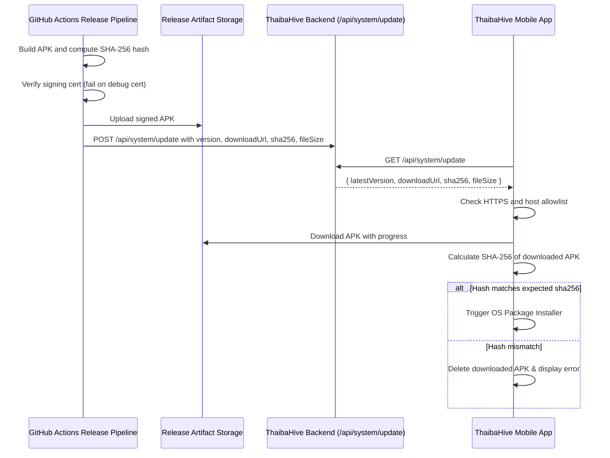

# Mobile Release & System Update Workflow

This document details the single source of truth for versioning, release artifacts, and integrity hashing for ThaibaHive.

---

## 1. Release Versioning Architecture

The application version is managed cohesively across:
1. **Mobile App (`pubspec.yaml`)**: Declares `version: X.Y.Z+buildNumber` (e.g. `3.20.0+15`).
2. **Release Metadata File (`src/config/release-metadata.json`)**: Version fallback file defining `latestVersion`, `downloadUrl`, `releaseNotes`, `forceUpdate`, `sha256`, and `fileSize`.
3. **Database Configuration (`systemConfigs` table)**: Overrides release information in real time without redeploying code.

---

## 2. Release Update Flow



---

## 3. How to Update Release Metadata

### Method A: Automated via API (Recommended for CI/CD)
Send an authenticated `POST /api/system/update` request with your `SYSTEM_UPDATE_SECRET`:

```bash
curl -X POST https://thaibahive.com/api/system/update \
  -H "Authorization: Bearer $SYSTEM_UPDATE_SECRET" \
  -H "Content-Type: application/json" \
  -d '{
    "version": "3.20.0+15",
    "downloadUrl": "https://thaibahive.com/downloads/ThaibaHive-v3.20.0+15-release.apk",
    "releaseNotes": "Bug fixes, performance improvements, and biometric auth enhancements.",
    "isForceUpdate": false,
    "sha256": "5b8710a85fb02a95d2e809c9c5ad2ec0d632d5d689448c067196a764969aaf12",
    "fileSize": 89291695
  }'
```

### Method B: Update `src/config/release-metadata.json`
Edit `src/config/release-metadata.json` and deploy:
```json
{
  "latestVersion": "3.20.0+15",
  "downloadUrl": "/downloads/ThaibaHive_latest.apk",
  "releaseNotes": "Production release 3.20.0+15: hardened mobile release signing and SHA-256 integrity verification.",
  "forceUpdate": false,
  "sha256": "5b8710a85fb02a95d2e809c9c5ad2ec0d632d5d689448c067196a764969aaf12",
  "fileSize": 89291695
}
```
