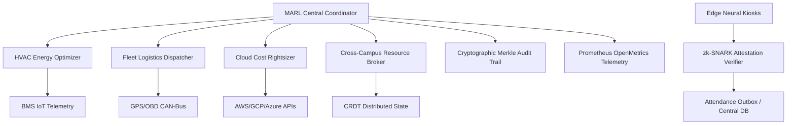

# AIMS / AutoOps Architecture Specification

## Overview
**AIMS** (Autonomous Intelligence & Multi-Agent Smart Campus System) represents the operational intelligence layer of the ThaibaHive platform. It transitions campus infrastructure from passive monitoring into an active, self-optimizing ecosystem.

## Architectural Pillars
1. **Multi-Agent Reinforcement Learning (MARL)**: Decentralized actor policies evaluate local actions (HVAC setpoints, route modifications), while a centralized critic evaluates joint value functions $Q(s, a_1, \dots, a_n)$ with bounded tanh activations.
2. **Thermal Comfort & Air Quality Optimization**: ISO 7730 Fanger PMV/PPD modeling ensures comfort setpoint adjustments remain strictly within $[-0.5, +0.5]$ PMV and PPD $\le 10\%$.
3. **Capacitated Vehicle Routing (CVRPTW)**: Dynamic multi-stop routing with battery/fuel consumption optimization, driver duty limits, and weather-aware speed buffers.
4. **Edge Biometrics & ZKP**: Sub-50ms cosine similarity matching on local edge kiosks coupled with zk-SNARK Groth16 / BN254 nullifier verification protecting student privacy.
5. **Multi-Cloud Cost & Carbon ESG**: Automated rightsizing, spot instance pre-drain orchestration, and GHG Protocol Scope 1, 2, and 3 accounting with GRI 305 compliance.
6. **Cross-Campus Resource Mesh**: Observed-Remove Set (ORSet) CRDT for conflict-free distributed equipment and facility scheduling across campuses.
