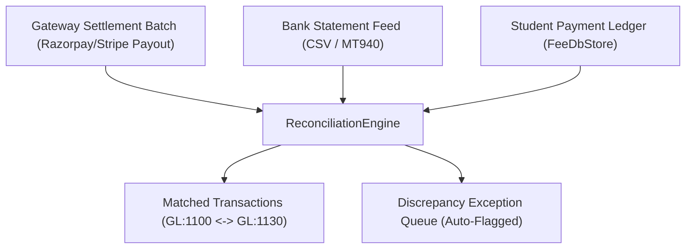

# Standard Operating Procedure: Bank Statement & Settlement Reconciliation Runbook

**Document ID:** SOP-FIN-005  
**Module:** `FEE-HIVE` / `FinanceOS`  
**Target Audience:** Chief Financial Officer, Senior Accountants, External Auditors  
**Effective Date:** 2026-08-27  

---

## 1. Overview & 3-Way Matching Architecture

ThaibaHive FinanceOS implements an automated 3-way reconciliation mesh connecting payment gateway settlement files, institutional bank feeds, and internal student ledger records:

---

## 2. Daily Reconciliation Procedure

### Step 1: Exporting Settlement & Statement Feeds
1. Obtain the bank statement CSV for the target clearing account.
2. Obtain gateway daily payout settlement summaries.

### Step 2: Uploading to Reconciliation Studio
1. Navigate to `/admin/finance/fee-hub` $\to$ **Reconciliation** tab.
2. Click **New Reconciliation Batch**.
3. Select Source Type:
   - `bank_statement`
   - `razorpay_settlement`
   - `stripe_payout`
   - `pos_terminal`
4. Paste or upload the statement CSV data.

### Step 3: Automated Matching Algorithm Execution
The `ReconciliationEngine` performs multi-pass matching:
1. **Pass 1 — Exact Reference Match**: Matches on Transaction Reference / UTR Number / Gateway Payment ID + exact Amount ($\text{Confidence} = 1.0$).
2. **Pass 2 — Amount & Date Window Match**: Matches on exact Amount + Transaction Date $\pm 24\text{ hours}$ ($\text{Confidence} = 0.85$).
3. **Pass 3 — Unmatched Extraction**: Isolates unmatched bank lines and unreconciled system payments.

### Step 4: Reviewing Discrepancy Batches
- **Status: RECONCILED**: Batch discrepancy amount is ₹0.00. Automatic GL settlement journals are posted (`FeeGLEngine.generateSettlementJournals`).
- **Status: DISCREPANCY_FLAGGED**: Unmatched credit lines or fee deduction variances are presented in the exception table for manual auditor review.

---

## 3. Discrepancy Resolution & Audit Log

Once an accountant investigates and tags unmatched lines (e.g. unknown direct NEFT deposit mapped to student roll number), the batch is marked finalized, generating an immutable cryptographic entry in `fee_audit_logs`.
