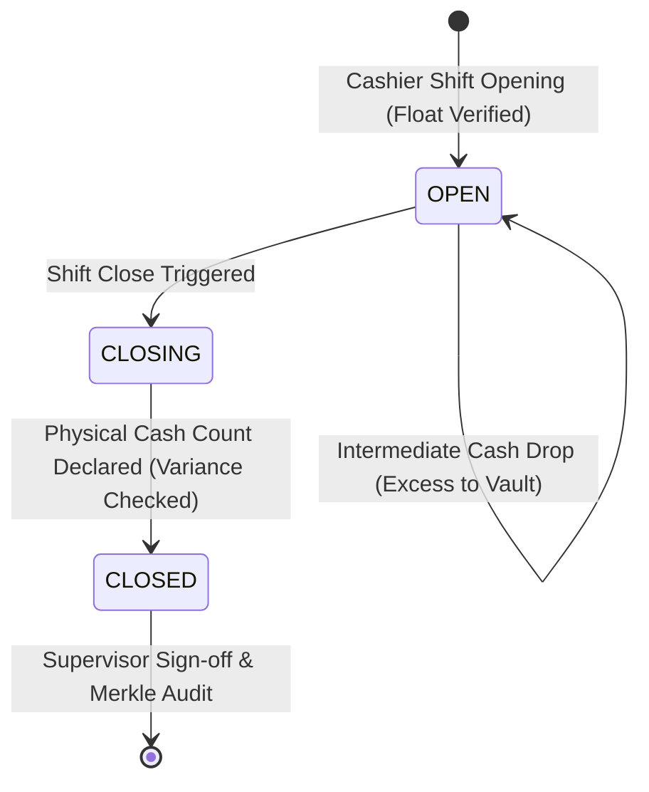

# Standard Operating Procedure: Campus Cashier Shift & Counter Reconciliation Runbook

**Document ID:** SOP-FIN-003  
**Module:** `FEE-HIVE` / `FinanceOS`  
**Target Audience:** Campus Cashiers, Accountants, Head of Finance  
**Effective Date:** 2026-08-27  

---

## 1. Purpose & Objectives

This runbook defines the daily lifecycle for campus physical fee counters, managing cashier float disbursement, recording offline collections (cash, POS swipe cards, cheques, demand drafts), executing intermediate cash drops to the campus vault, and closing shifts with discrepancy variance audits.

---

## 2. Shift Lifecycle Workflow

---

## 3. Standard Operating Steps

### Step 1: Shift Opening & Float Allocation
1. Cashier logs in at `/admin/finance/fee-hub` $\to$ **Counter & Shifts** tab.
2. Selects counter workstation (e.g. `Main Admin Counter 1`).
3. Inputs opening cash float received from campus vault (e.g. ₹10,000).
4. System records shift start and locks cashier to active drawer.

### Step 2: Processing Walk-in Payments
1. Cashier enters Student Roll Number / ID.
2. Selects outstanding fee component or installment.
3. Chooses payment mode:
   - **Cash**: Direct drawer accumulation.
   - **POS Card**: Terminal approval code entry.
   - **Cheque / DD**: Bank name, cheque number, and clearance date.
4. Generates and prints official signed PDF receipt (`RCPT-...`).

### Step 3: Intermediate Vault Cash Drops
When cash drawer balance exceeds maximum security threshold (default: ₹50,000):
1. Cashier initiates **Cash Drop** from counter panel.
2. Specifying drop amount and receiving supervisor staff ID.
3. System deducts physical cash from active shift and updates expected closing count.

### Step 4: Shift Close & Physical Verification
1. At shift conclusion, cashier counts physical cash in drawer.
2. Inputs `closingCashDeclared` into counter modal.
3. System executes variance computation:
   $$\text{Variance} = \text{ClosingCashDeclared} - (\text{OpeningFloat} + \text{SystemCashCollected} - \text{CashDropsTotal})$$
4. If variance is 0: Shift is marked `CLOSED` (Balanced).
5. If variance $\ne 0$: Flagged in red with required supervisor explanation notes.

---

## 4. Discrepancy Escalation Matrix

| Variance Magnitude | Action Required | Approving Authority |
|---|---|---|
| **₹0 (Balanced)** | Standard end-of-day closure | Cashier |
| **< ₹500** | Logged as cashier overage/shortage drawer drift | Shift Supervisor |
| **> ₹500** | Audit investigation, CCTV cross-check, register freeze | Finance Director |
