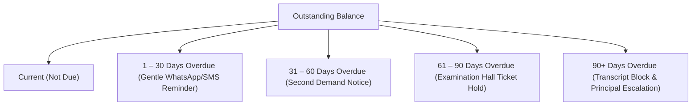

# Standard Operating Procedure: Accounts Receivable Aging & Defaulter Recovery Guide

**Document ID:** SOP-FIN-004  
**Module:** `FEE-HIVE` / `FinanceOS`  
**Target Audience:** Accounts Receivable Team, Student Welfare Officers, Principals  
**Effective Date:** 2026-08-27  

---

## 1. Purpose & Objectives

This guide outlines the automated delinquency classification, risk scoring, examination restriction enforcement, and multi-channel outreach recovery procedures for overdue student accounts across Thaiba Garden Group.

---

## 2. 30/60/90 Days Aging Matrix

---

## 3. Delinquency Buckets & Policy Actions

| Bucket | Days Overdue | Policy Restrictions | Automated Outreach Channel |
|---|---|---|---|
| **Current** | $\le 0$ days | None (Normal standing) | $T-7$ days & $T-0$ upcoming due notice via WhatsApp |
| **1_30** | $1–30$ days | Late fine assessment begins | Gentle reminder + payment deep link via WhatsApp/SMS |
| **31_60** | $31–60$ days | Parent portal alert badge | Formal demand notice via Email + SMS |
| **61_90** | $61–90$ days | **Examination Hall Ticket Blocked** | Urgent clearance warning + telephonic follow-up |
| **90_plus** | $> 90$ days | **Transcripts & Degree Blocked** | Formal Administrative notice + Principal financial intervention |

---

## 4. Student Financial Risk Scoring Model

The `AgingAnalyticsEngine` assigns each student a dynamic risk score ($0–100$):
$$\text{RiskScore} = \text{Score}_{\text{Days}} + \text{Score}_{\text{Amount}}$$
- $\text{Score}_{\text{Days}}$: 0 (Current) to 85 (90+ Days).
- $\text{Score}_{\text{Amount}}$: 5 (<₹20k), 10 (₹20k–₹50k), 15 (>₹50k).
- **Risk Score > 75**: Student flagged for proactive financial aid or counseling review before administrative hold is triggered.

---

## 5. Automated Outreach Dispatch SOP

1. Navigate to `/admin/finance/fee-hub` $\to$ **Aging & Defaulters** tab.
2. Review aggregated delinquency metrics:
   - Total Accounts Receivable
   - Overdue Dues Total
   - Collection Recovery Rate (%)
   - Critical Defaulters Count
3. Click **Dispatch Batch Reminders** to send personalized payment links containing HMAC authentication tokens directly to parent WhatsApp and SMS channels.
4. All communications are permanently recorded in `fee_defaulter_logs`.
