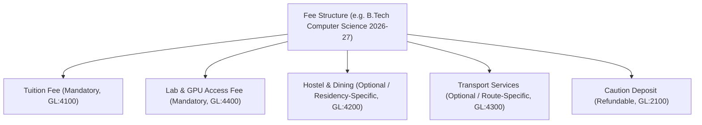

# Standard Operating Procedure: Fee Structure & Component Hierarchy Setup Guide

**Document ID:** SOP-FIN-001  
**Module:** `FEE-HIVE` / `FinanceOS`  
**Target Audience:** Finance Directors, Campus Registrars, Institutional Administrators  
**Effective Date:** 2026-08-27  

---

## 1. Purpose & Scope

This guide outlines the standard operating procedure for configuring academic fee structures, defining component breakdowns, setting up quota and residency overrides, establishing installment payment matrices, and assigning fee schedules to students across Thaiba Garden Group institutions.

---

## 2. Core Concepts & Component Breakdown

### Fee Structure Architecture
Each fee structure represents the total annual or semester financial obligation for a cohort.



### Component Parameters
- **Name**: Clear descriptive name (e.g., "Tuition Fee - Term 1").
- **Component Type**: `tuition`, `admission`, `hostel`, `transport`, `lab`, `library`, `exam`, `extracurricular`, `misc`.
- **Amount**: Base component fee in INR.
- **isMandatory**: Boolean (`true` for non-negotiable core academic fees).
- **isRefundable**: Boolean (`true` for caution deposits).
- **taxRatePercent**: GST rate if applicable (default 0%).
- **glAccountCode**: Associated Chart of Accounts General Ledger code.

---

## 3. Step-by-Step Configuration Workflow

### Step 1: Accessing the Admin Fee Hub
1. Navigate to `/admin/finance/fee-hub` in the web application shell.
2. Select the **Fee Structures** tab.
3. Click **Create New Structure**.

### Step 2: Setting Cohort Parameters
Enter the cohort metadata:
- **Academic Year**: `2026-2027`
- **Program / Department**: e.g., `Computer Science & Engineering`
- **Quota**: `general` | `merit` | `management` | `nri` | `sports`
- **Residential Type**: `day_scholar` | `hosteller` | `boarder`
- **Billing Term**: `annual` | `semesterly` | `quarterly`

### Step 3: Adding Fee Components
1. Click **Add Component** for each line item.
2. Specify component type, amount, refundability, and GL account.
3. System automatically calculates total structure sum and verifies double-entry mapping.

### Step 4: Allocating to Students & Installment Generation
Allocations can be initiated in bulk by academic year/cohort or individually via API/UI:
```http
POST /api/finance/fees/allocations
Content-Type: application/json

{
  "institutionId": "inst-001",
  "studentId": "TG-STD-2026-089",
  "feeStructureId": "struct-btech-2026",
  "academicYear": "2026-2027",
  "customConcessionAmount": 0,
  "planType": "semesterly"
}
```

---

## 4. Installment Scheduling & Late Fine Policies

### Supported Installment Plans
- **Lump Sum**: 100% due at start of academic session.
- **Semesterly**: 2 equal splits (50% / 50%) due at start of Term 1 and Term 2.
- **Quarterly**: 4 equal splits (25% each) due at 90-day intervals.
- **Custom**: Custom installment ratios and due dates.

### Late Fine Policy Rules
Installments overdue past the `gracePeriodDays` (default: 7 days) automatically calculate late fines:
- **Flat Daily Penalty**: e.g., ₹50/day.
- **Monthly Percentage**: e.g., 2% per 30-day block overdue.
- **Stepped Slabs**:
  - Days 1–15: Flat ₹500
  - Days 16–30: Flat ₹1,500
  - Days 31+: Flat ₹3,000 + 1.5% monthly compound.

---

## 5. Audit & Compliance

Every fee structure creation or alteration triggers a SHA-256 cryptographic audit record in `fee_audit_logs`. Fee adjustments must be countersigned by the Finance Officer.
