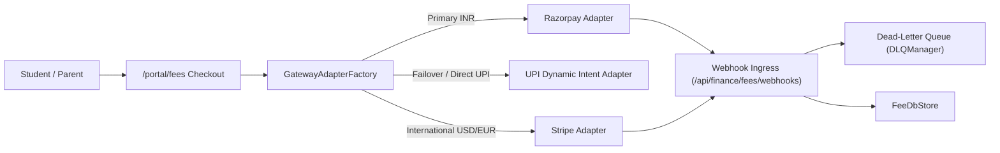

# Standard Operating Procedure: Payment Gateway Integration & Key Rotation Runbook

**Document ID:** SOP-FIN-002  
**Module:** `FEE-HIVE` / `FinanceOS`  
**Target Audience:** DevOps Engineers, Security Administrators, Lead Integrators  
**Effective Date:** 2026-08-27  

---

## 1. Architecture Overview

ThaibaHive FinanceOS abstracts multi-gateway online payments via the `PaymentGatewayAdapter` interface with failover routing:



---

## 2. Supported Payment Gateways

| Gateway | Supported Currencies | Methods | Webhook Auth Standard |
|---|---|---|---|
| **Razorpay** | INR | Credit/Debit Cards, Net Banking, UPI, Wallets | HMAC-SHA256 (`x-razorpay-signature`) |
| **Stripe** | Global (USD, EUR, GBP, AED, SAR) | International Cards, Apple Pay, Google Pay | HMAC-SHA256 (`t=...,v1=...`) |
| **UPI Direct** | INR | NPCI Dynamic Deep Link & QR Code | NPCI Response Digest & Checksum |

---

## 3. Environment Variables & Secret Configuration

Sensitive credentials MUST be stored in server environment variables or encrypted at rest using AES-256-GCM via `PaymentCrypto`:

```env
# Razorpay Credentials
RAZORPAY_KEY_ID="rzp_live_xxxxxxxxxxxx"
RAZORPAY_KEY_SECRET="your_razorpay_secret"
RAZORPAY_WEBHOOK_SECRET="whsec_razorpay_live_xxxx"

# Stripe Credentials
STRIPE_PUBLISHABLE_KEY="pk_live_xxxxxxxxxxxx"
STRIPE_SECRET_KEY="sk_live_xxxxxxxxxxxx"
STRIPE_WEBHOOK_SECRET="whsec_stripe_live_xxxx"

# UPI Virtual Payment Address (VPA)
UPI_VPA_ID="thaiba.garden@hdfcbank"
UPI_MERCHANT_NAME="Thaiba Garden Group of Institutions"

# Master Encryption Key
PAYMENT_ENCRYPTION_KEY="thaiba-hive-secure-master-key-32bytes!"
```

---

## 4. Webhook Security & Idempotency Engine

### Idempotency Key Generation
Every incoming webhook is assigned an idempotency token:
$$\text{IdempotencyKey} = \text{SHA-256}(\text{GatewayName} \parallel \text{EventId} \parallel \text{PaymentId})$$
Duplicate payloads from network bursts or retries are acknowledged with HTTP 200 `{ isDuplicate: true }` without triggering redundant ledger transactions.

### Dead-Letter Queue (DLQ) Management
Webhooks failing cryptographic verification or throwing operational exceptions are captured into `DLQManager`:
- Retried with exponential backoff: $60 \text{ sec} \times 2^{\text{retryCount}}$.
- Abandoned after 5 failed attempts and escalated to the financial security dashboard.

---

## 5. Gateway Key Rotation SOP

1. **Generate New Credentials**: In the gateway merchant console, create a secondary API key.
2. **Update Environment Variable**: Deploy new secret in the staging environment.
3. **Execute Simulation Verification**:
   ```bash
   pnpm fee:simulate
   ```
4. **Deploy to Production**: Deploy updated environment keys to production pods.
5. **Revoke Old Secret**: Revoke the deprecated API key in the gateway portal after 24 hours.
