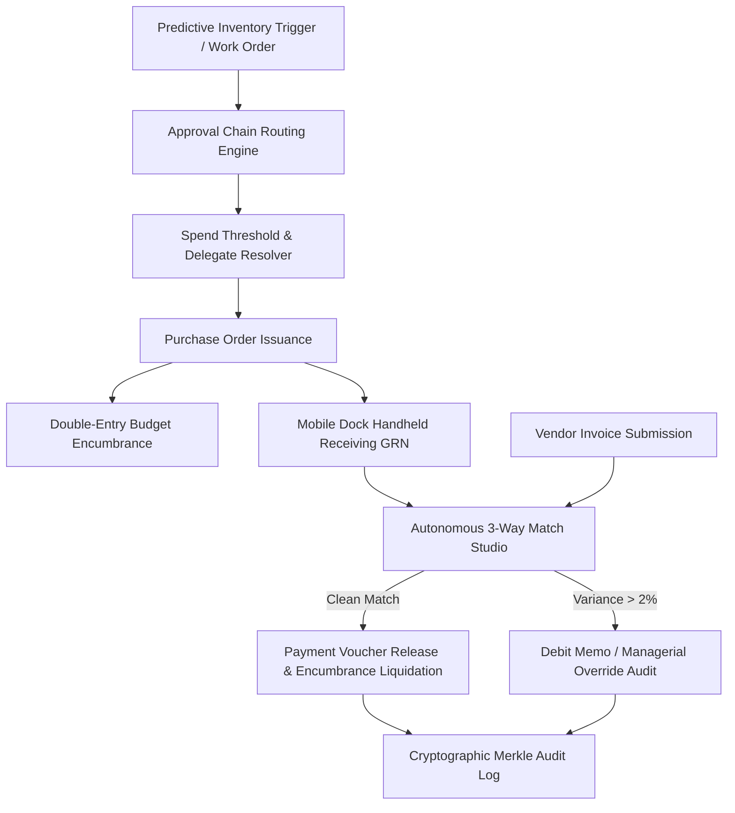

# SUPPLY-HIVE / ProcurementOS Operational Runbook
**Sprint-054 — Autonomous Institutional Procurement, Vendor Contracts & Supply Chain Intelligence**

## 1. Subsystem Architecture Overview
SUPPLY-HIVE delivers end-to-end autonomous procurement, vendor governance, ESG scoring, 3-way invoice matching, budget encumbrance, and supply chain telemetry for higher-education and research institutions.

---

## 2. Standard Operating Procedures (SOP)

### SOP-01: Autonomous Vendor Onboarding & Sanctions Interception
1. All new suppliers are screened via `VendorRiskScreeningEngine` against international sanction registries (OFAC SDN, UN Consolidated, EU Financial).
2. Vendors with string similarity $\ge 0.85$ or composite risk score $\ge 70.0$ are blocked immediately.
3. ESG certifications (ISO 14001, Fair Labor, Minority/Diversity Ownership) are graded from AAA to CCC.

### SOP-02: Predictive Inventory & EOQ Reorder
1. Consumables (filters, valves, GPU thermal pads, network fiber) evaluate $ROP = (d \times L) + SS$.
2. Wilson Economic Order Quantity formula $EOQ = \sqrt{\frac{2 D S}{H}}$ automatically sizes restock batches.
3. Spend $< \$1,000$ auto-approves; spend above routes to HOD/Principal.

### SOP-03: Budget Encumbrance & Double-Entry Accounting
1. Before PO dispatch, `BudgetEncumbranceEngine` confirms available department headroom.
2. Funds are locked: `DEBIT: GL:ENCUMBRANCE_EXPENSE`, `CREDIT: GL:ENCUMBRANCE_RESERVE`.
3. On verified 3-way invoice match, encumbrance is liquidated to Accounts Payable.

### SOP-04: 3-Way Invoice Reconciliation & Discrepancies
1. System compares PO, GRN, and Vendor Invoice line-by-line.
2. Tolerances permitted: $\pm 2\%$ unit price, $0\%$ quantity overbilling.
3. Unexcused discrepancies trigger `DebitMemoGenerator` or managerial override with recorded audit justification.

---

## 3. Telemetry, Prometheus Metrics & Audit Verification

- **Prometheus Endpoint**: OpenMetrics 1.0 format (`supply_po_created_total`, `supply_spend_encumbered_usd`, `supply_invoices_matched_total`, etc.).
- **SSE Stream**: `/api/supply/stream?topic=orders:status` & `receiving:dock`.
- **Cryptographic Audit Chain**: SHA-256 Merkle root verification via `ProcurementAuditVerifier.verifyChainIntegrity()`.

---

## 4. Disaster Recovery & Emergency Procedures

1. **ERP / Network Outage during Dock Receiving**:
   - Field handheld switches to offline SQLite/Hive queue.
   - Receipts cached locally; flush sync runs automatically upon reconnect with 3-retry dead-letter queue (DLQ) protection.
2. **Sanctions List Synchronization Failure**:
   - High-value POs ($> \$10,000$) fall back to manual compliance officer review until registry cache refreshes.
