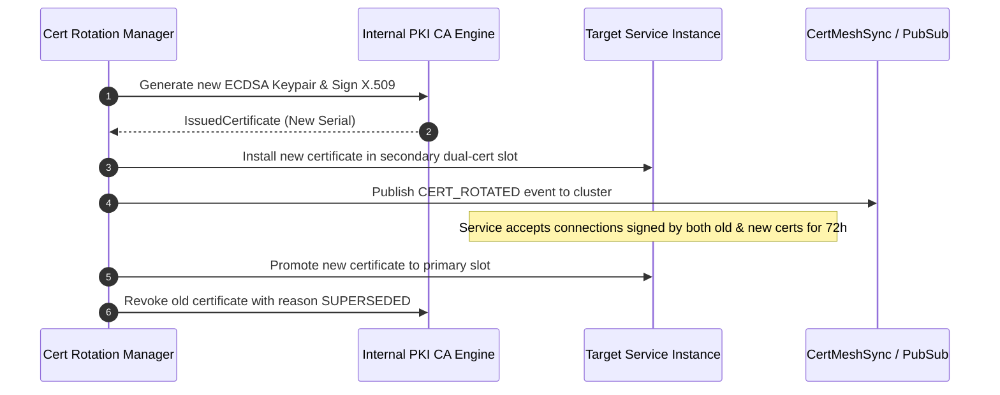

# Internal PKI & mTLS Continuous Certificate Rotation Runbook

## 1. Scope & Standards
- **Standard**: RFC 5280 compliant X.509 certificates.
- **Algorithms**: ECDSA (`prime256v1`) by default; RSA (`2048-bit` / `4096-bit`) configurable.
- **Root CA Validity**: 10 years (3650 days).
- **Service Cert Validity**: 90 days with continuous rotation at 60 days (30-day dual-certificate grace period).

---

## 2. Zero-Downtime Certificate Rotation Procedure



---

## 3. Emergency Key Revocation Runbook
In case of private key compromise:
1. Trigger immediate revocation via REST API:
   ```http
   POST /api/admin/security/zero-trust/certificates
   Content-Type: application/json

   {
     "serialNumber": "CERT-SERIAL-TO-REVOKE",
     "reason": "KEY_COMPROMISE"
   }
   ```
2. `CertMeshSync` immediately broadcasts a `CERT_REVOKED` event to all edge gateways and service mesh proxies.
3. The serial number is added to the CRL (Certificate Revocation List), instantly dropping all active mTLS connections using the compromised key.
