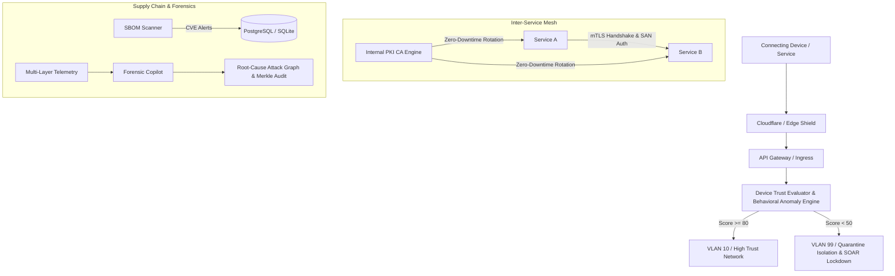

# Zero-Trust Autonomous Security Mesh (ZASM) Operator Guide

## 1. Overview
The Zero-Trust Autonomous Security Mesh (ZASM) establishes **proactive perimeterless security** for the ThaibaHive enterprise infrastructure across three unified dimensions:
1. **Continuous Device Trust Scoring & Posture Evaluation**: Multi-factor 0–100 composite scoring of all connecting hardware with dynamic behavioral anomaly penalties (impossible travel, user-agent spoofing, auth storms).
2. **Dynamic Micro-Segmentation Policy Engine**: Default-deny network containment with campus switch VLAN steering (VLAN 10 High Trust, VLAN 20 Medium Trust, VLAN 30 Inspection, VLAN 99 Quarantine).
3. **Internal PKI & Continuous mTLS Mesh**: Zero-downtime automated certificate rotation and distributed revocation mesh across microservices.
4. **Automated SBOM & Supply Chain Vulnerability Scanner**: CycloneDX v1.5 and SPDX v2.3 SBOM generation with automated CVE matching, non-breaking patch recommendation, and copyleft license compliance enforcement.
5. **Advanced Forensic Root-Cause Analysis Copilot**: Multi-stage ATT&CK correlation, chronological event sequencing, and root-cause DAG reconstruction under 30 seconds.

---

## 2. Architecture & Control Loops

---

## 3. Operator Procedures

### 3.1 Device Trust Overrides
When an executive or remote staff member is flagged with low trust due to legitimate emergency travel:
1. Navigate to `/admin/security/zero-trust` in the Admin Dashboard.
2. In the **Continuous Device Posture & Trust Matrix** table, locate the device ID and click **Override**.
3. Set the forced score (e.g. `85`) and enter a mandatory justification reason.
4. The override is TTL-bound (default 24h) and automatically logged to the immutable SHA-256 Merkle audit chain.

### 3.2 Micro-Segmentation Policy Management
- Policies are prioritized (`1` highest priority).
- Traffic is evaluated against trust tier tags (`HIGH_TRUST`, `MEDIUM_TRUST`, `LOW_TRUST`, `UNTRUSTED`).
- Policies are propagated across all cluster nodes in $< 5$ seconds via `PolicyPropagationMesh`.
