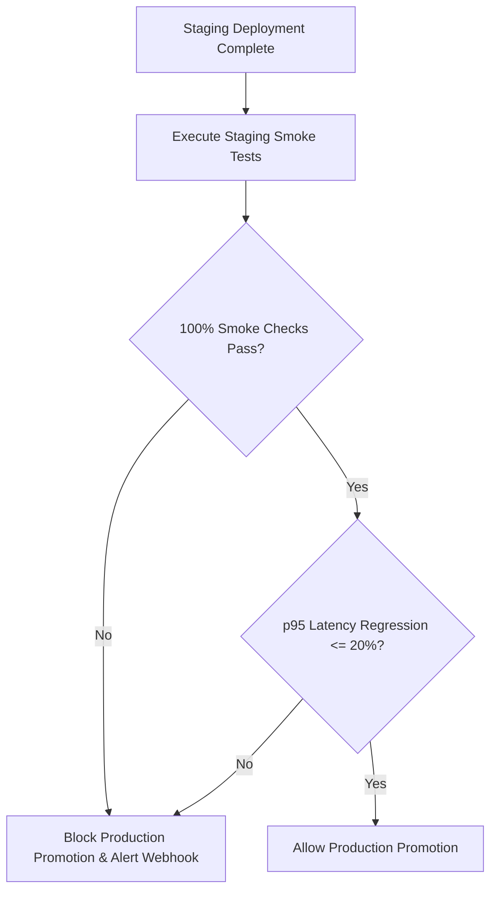

# Staging Canary & Automated Promotion Runbook

**Document ID:** RUNBOOK-CANARY-001  
**Sprint Reference:** SPRINT-033 (v3.17.0)  
**Technical Debt Reference:** TD-008 (Resolved)  
**Target Audience:** DevOps Engineers, Platform Engineers, Release Managers  

---

## 1. Staging Smoke Test Suite Overview

The staging smoke test runner (`scripts/staging/staging-smoke-runner.ts`) is a zero-dependency TypeScript validation suite that runs in under 60 seconds post-deployment against a staging environment.

### Validations Performed
1. **Health & Database Check:** `GET /api/system/health` asserting database connectivity and ping latency < 250ms.
2. **Critical APIs & RBAC Check:** Signed JWT simulation testing student queries, finance ledger access, nonce handoff, and RBAC boundary enforcement (staff received 403 on admin routes).
3. **APM Metrics & Latency SLA:** `GET /api/system/metrics` validating p95 latency is under 500ms and Prometheus OpenMetrics exposition formatting.

---

## 2. Running Smoke Tests Locally or in CI

### CLI Usage
```bash
# Dry run mode (validates runner execution and mock report output)
pnpm test:staging:smoke -- --dry-run

# Run against local development or standalone server
pnpm test:staging:smoke -- --url=http://localhost:3000 --jwt-secret=your-jwt-secret

# Run against staging instance with health & metrics secrets
pnpm test:staging:smoke -- --url=https://staging.thaibahive.internal --secret=health-secret --metrics-secret=metrics-secret
```

### Generated Artifacts
- Machine-readable JSON summary report saved to `staging-reports/smoke-test-summary.json`.

---

## 3. Canary Promotion Gate & Decision Tree

The canary promotion gate (`scripts/staging/canary-promotion-gate.ts`) evaluates the smoke test report against production release criteria:



### Promotion Gate Criteria
- **Smoke Check Pass Rate:** 100% (0 failures allowed).
- **Error Rate:** 0.00% across all smoke endpoints.
- **Latency Degradation Cap:** Max +20% p95 latency compared to the production baseline.

---

## 4. GitHub Actions CI/CD Integration

The workflow `.github/workflows/staging-canary-gate.yml` runs automatically upon pushes to `staging` or `release/*` branches.

### Manual Bypass & Emergency Overrides
If an emergency hotfix must bypass the canary gate:
- Add `[skip canary]` in the commit message or trigger deployment with manual override flag in GitHub Actions.

---

## 5. Rollback Procedures for Failed Canary Validations

If the canary promotion gate fails:
1. **Automated Notification:** The gate automatically dispatches an alert payload to `ALERT_WEBHOOK_URL` detailing the exact failed checks and latency regressions.
2. **Promotion Blocked:** The GitHub Actions output `promotion_allowed=false` halts downstream deployment jobs.
3. **Staging Rollback:**
   ```bash
   git revert HEAD
   git push origin staging
   ```
4. **Inspect Diagnostics:** Download the `staging-smoke-report` artifact from the GitHub Actions run and examine `staging-reports/smoke-test-summary.json`.

---

*Operational Runbook: RUNBOOK-CANARY-001 | ThaibaHive v3.17.0*
